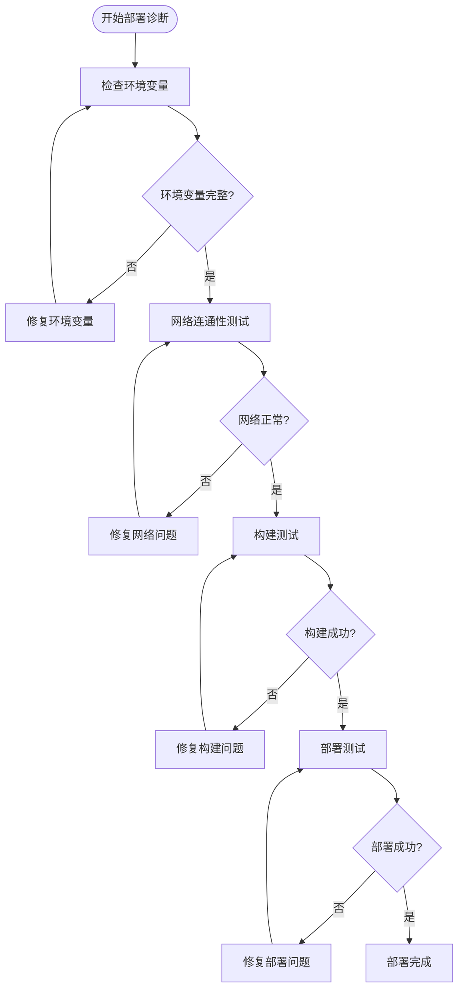
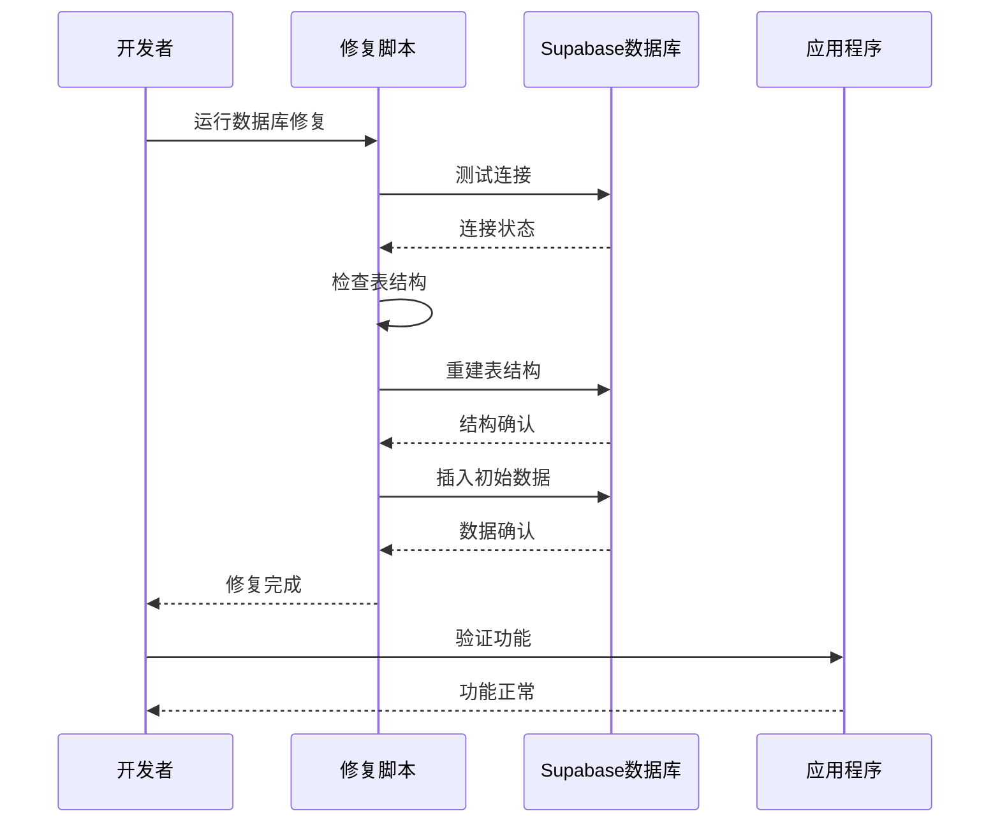
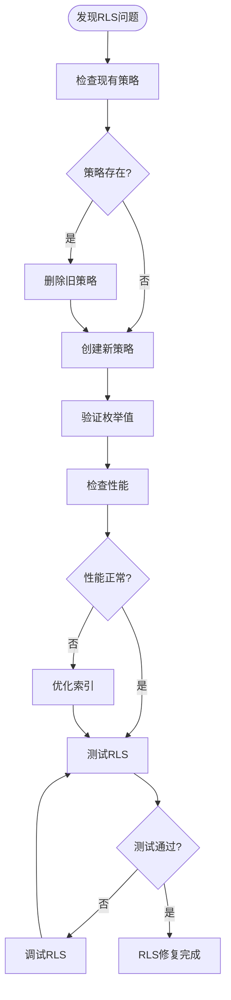
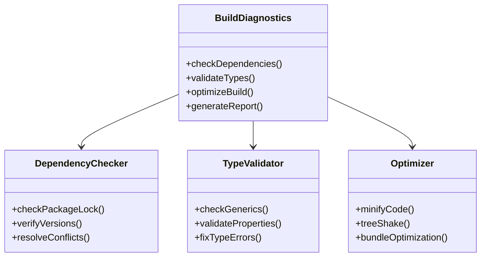
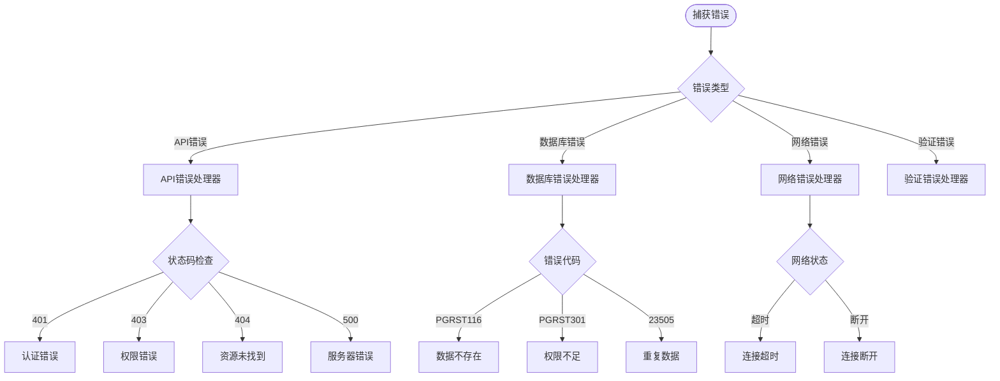
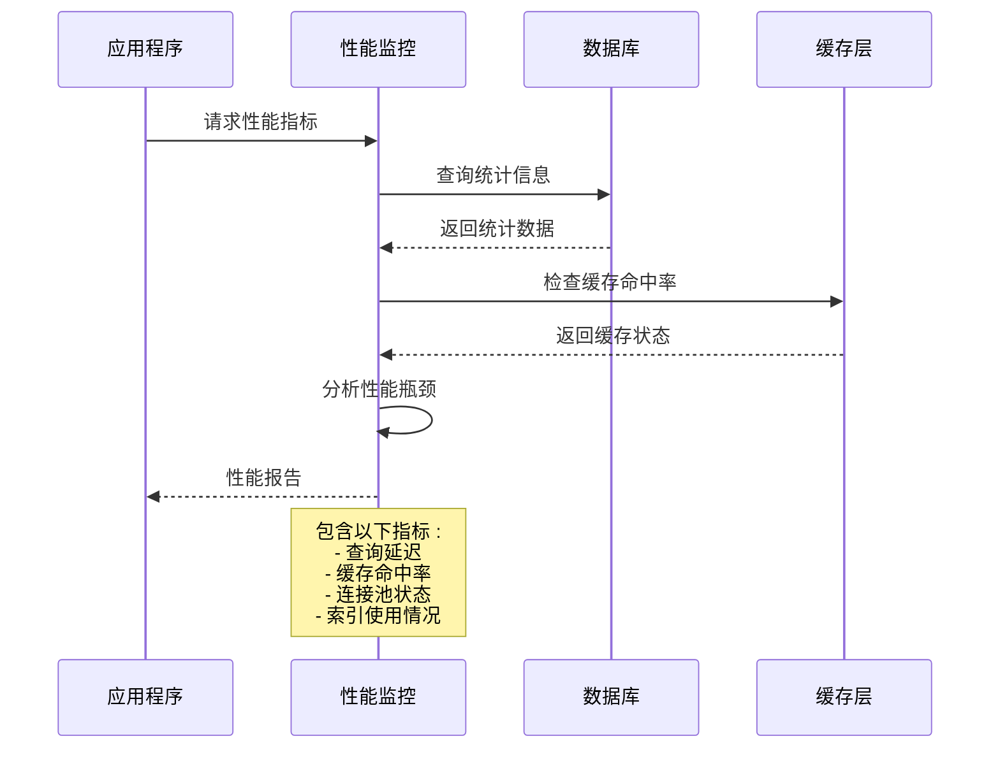
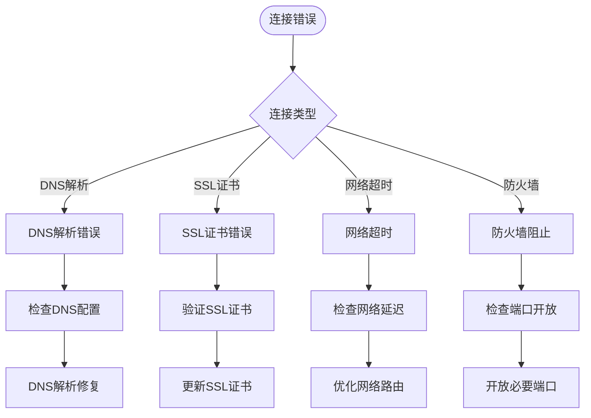
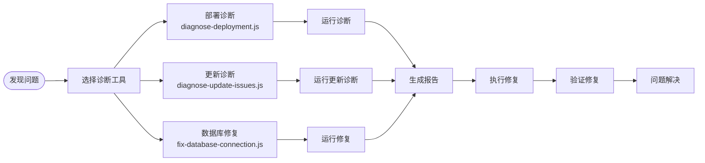
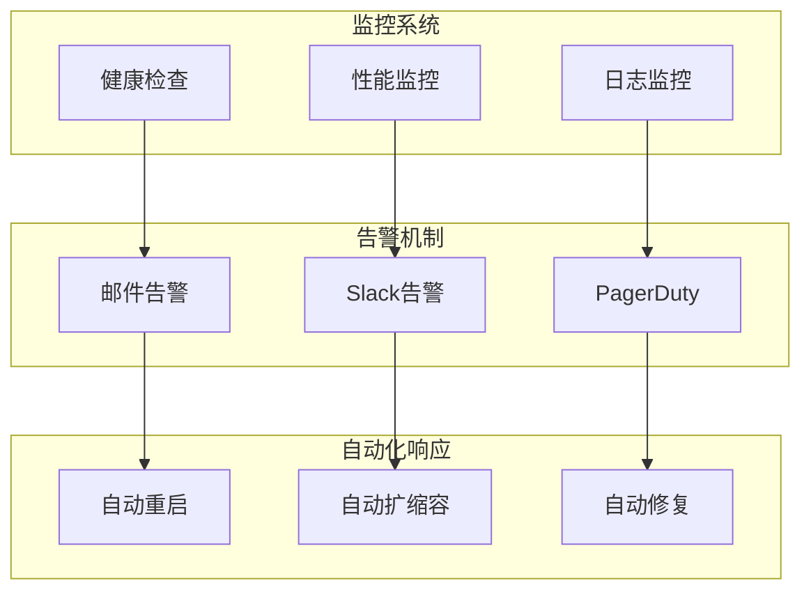

# 故障排除指南

<cite>
**本文档中引用的文件**
- [diagnose-deployment.js](file://scripts/deployment/diagnose-deployment.js)
- [diagnose-update-issues.js](file://scripts/deployment/diagnose-update-issues.js)
- [fix-database-connection.js](file://scripts/fix-database-connection.js)
- [fix-database.js](file://scripts/fix-database.js)
- [create-rls-policies-fixed.sql](file://scripts/database/create-rls-policies-fixed.sql)
- [databaseService.ts](file://src/services/databaseService.ts)
- [errorHandler.ts](file://src/utils/errorHandler.ts)
- [vite.config.ts](file://vite.config.ts)
- [netlify.toml](file://netlify.toml)
- [package.json](file://package.json)
</cite>

## 目录
1. [简介](#简介)
2. [部署故障排除](#部署故障排除)
3. [数据库连接问题](#数据库连接问题)
4. [Supabase RLS权限错误](#supabase-rls权限错误)
5. [构建和编译错误](#构建和编译错误)
6. [运行时错误诊断](#运行时错误诊断)
7. [性能问题排查](#性能问题排查)
8. [网络和连接问题](#网络和连接问题)
9. [故障排除工具](#故障排除工具)
10. [预防性维护](#预防性维护)

## 简介

本故障排除指南旨在帮助开发者快速识别和解决项目中常见的技术问题。该指南涵盖了从部署失败到数据库连接异常的各种场景，并提供了详细的诊断步骤和解决方案。

项目采用Vue.js + TypeScript + Supabase架构，主要涉及前端构建、数据库连接、权限管理和部署流程等方面的问题。

## 部署故障排除

### 常见部署失败模式

根据项目的GitHub Actions日志分析，部署失败通常表现为以下几种模式：

#### 1. 网络连接超时
```bash
# 检查网络连通性
ping -c 4 ramusi.cn
nslookup ramusi.cn
curl -I https://ramusi.cn
```

#### 2. 构建依赖问题
```bash
# 检查依赖安装
npm install --legacy-peer-deps --prefer-offline --no-audit --include=optional
```

#### 3. 环境变量缺失
```bash
# 验证环境变量
echo $VITE_SUPABASE_URL
echo $VITE_SUPABASE_ANON_KEY
echo $GITHUB_TOKEN
```

### 部署诊断流程



**图表来源**
- [diagnose-deployment.js](file://scripts/deployment/diagnose-deployment.js#L1-L169)

**章节来源**
- [diagnose-deployment.js](file://scripts/deployment/diagnose-deployment.js#L1-L169)
- [netlify.toml](file://netlify.toml#L1-L12)

## 数据库连接问题

### 数据库连接诊断

项目使用Supabase作为数据库后端，数据库连接问题是最常见的故障之一。

#### 连接问题症状
- 页面加载缓慢或无响应
- API请求返回500错误
- 数据库查询超时
- 认证功能失效

#### 诊断步骤

1. **检查环境变量配置**
```javascript
// 检查Supabase URL和密钥
console.log("Supabase URL:", process.env.VITE_SUPABASE_URL);
console.log("API Key:", process.env.VITE_SUPABASE_ANON_KEY);
```

2. **测试数据库连接**
```javascript
// 使用提供的修复脚本
node scripts/fix-database-connection.js
```

3. **验证表结构**
```sql
-- 检查关键表是否存在
SELECT table_name FROM information_schema.tables WHERE table_schema = 'public';

-- 验证用户表
SELECT COUNT(*) FROM user_profiles WHERE id = auth.uid();
```

### 数据库修复流程



**图表来源**
- [fix-database-connection.js](file://scripts/fix-database-connection.js#L1-L263)
- [databaseService.ts](file://src/services/databaseService.ts#L1-L405)

**章节来源**
- [fix-database-connection.js](file://scripts/fix-database-connection.js#L1-L263)
- [databaseService.ts](file://src/services/databaseService.ts#L1-L405)

## Supabase RLS权限错误

### RLS策略问题

基于Context7最佳实践的RLS策略修正，解决了枚举值错误和性能问题。

#### 常见RLS错误类型

1. **权限不足错误 (PGRST301)**
2. **数据不存在错误 (PGRST116)**
3. **重复键错误 (23505)**
4. **外键违反 (23503)**

#### RLS策略诊断

```sql
-- 检查用户角色
SELECT private.get_user_role();

-- 验证管理员权限
SELECT private.is_admin();

-- 检查特定表的RLS策略
SELECT policyname, permissive, roles, cmd, qual, with_check 
FROM pg_policy 
WHERE tablename = 'tools';
```

### RLS修复流程



**图表来源**
- [create-rls-policies-fixed.sql](file://scripts/database/create-rls-policies-fixed.sql#L1-L692)

**章节来源**
- [create-rls-policies-fixed.sql](file://scripts/database/create-rls-policies-fixed.sql#L1-L692)

## 构建和编译错误

### TypeScript编译错误

根据日志分析，主要的TypeScript错误集中在泛型参数不匹配和属性不存在问题上。

#### 常见编译错误类型

1. **泛型参数错误**
```typescript
// 错误示例
Argument of type 'Partial<T>' is not assignable to parameter of type 'never'
```

2. **属性不存在错误**
```typescript
// 错误示例
Property 'tool_id' does not exist on type 'never'
```

3. **类型不匹配错误**
```typescript
// 错误示例
Type 'unknown' is not assignable to type 'string'
```

### 构建修复策略



**图表来源**
- [vite.config.ts](file://vite.config.ts#L1-L104)

**章节来源**
- [vite.config.ts](file://vite.config.ts#L1-L104)

## 运行时错误诊断

### 错误处理机制

项目实现了完善的错误处理机制，包括API错误、数据库错误和网络错误的分类处理。

#### 错误分类处理



**图表来源**
- [errorHandler.ts](file://src/utils/errorHandler.ts#L1-L331)

### 错误恢复机制

项目实现了重试机制和指数退避算法来处理临时性错误：

```typescript
// 指数退避重试
static async withExponentialBackoff<T>(
  operation: () => Promise<T>,
  maxRetries: number = 3,
  baseDelay: number = 1000,
  maxDelay: number = 10000,
): Promise<T>
```

**章节来源**
- [errorHandler.ts](file://src/utils/errorHandler.ts#L1-L331)

## 性能问题排查

### 数据库性能监控



**图表来源**
- [databaseService.ts](file://src/services/databaseService.ts#L360-L403)

### 性能优化策略

1. **索引优化**
   - 为RLS策略中常用列创建索引
   - 优化查询条件字段索引
   - 使用复合索引减少查询复杂度

2. **缓存策略**
   - 实现智能缓存机制
   - 设置合理的TTL值
   - 缓存失效策略

3. **查询优化**
   - 使用LIMIT和OFFSET进行分页
   - 避免SELECT *
   - 使用适当的JOIN策略

**章节来源**
- [databaseService.ts](file://src/services/databaseService.ts#L360-L403)

## 网络和连接问题

### 网络诊断工具

项目提供了完整的网络诊断功能，支持多维度的网络连通性检查。

#### 网络诊断命令

```bash
# 基础连通性测试
ping -c 4 ramusi.cn
nslookup ramusi.cn
curl -I https://ramusi.cn

# GitHub API测试
curl -I https://api.github.com/zen

# Netlify API测试
curl -I https://api.netlify.com/api/v1/sites
```

### 连接问题分类



**章节来源**
- [diagnose-deployment.js](file://scripts/deployment/diagnose-deployment.js#L149-L167)

## 故障排除工具

### 诊断脚本集合

项目提供了多个专用的诊断脚本来帮助快速定位问题：

#### 1. 部署诊断脚本
```javascript
// 主要功能：
// - 检查GitHub Actions状态
// - 测试网络连接
// - 验证Supabase连接
// - 检查构建状态
// - 提供Context7最佳实践建议
```

#### 2. 更新发布问题诊断
```javascript
// 专门诊断初次发布成功但更新失败的问题
// - 检查包管理器一致性
// - 验证Netlify配置
// - 检查依赖问题
// - 生成修复脚本
```

#### 3. 数据库连接修复
```javascript
// 自动检测和修复Supabase连接问题
// - 检查API密钥有效性
// - 验证表结构完整性
// - 重新初始化数据
```

### 工具使用指南



**章节来源**
- [diagnose-deployment.js](file://scripts/deployment/diagnose-deployment.js#L1-L169)
- [diagnose-update-issues.js](file://scripts/deployment/diagnose-update-issues.js#L1-L373)
- [fix-database-connection.js](file://scripts/fix-database-connection.js#L1-L263)

## 预防性维护

### 定期维护任务

为了预防故障的发生，建议定期执行以下维护任务：

#### 1. 数据库维护
- 每周检查RLS策略有效性
- 每月优化数据库索引
- 每季度清理历史数据

#### 2. 应用维护
- 每周检查依赖更新
- 每月进行性能基准测试
- 每季度进行全面安全审计

#### 3. 基础设施维护
- 每周监控网络连通性
- 每月检查SSL证书有效期
- 每季度备份重要数据

### 监控和告警



### 最佳实践建议

1. **版本管理**
   - 使用语义化版本控制
   - 保持依赖版本锁定
   - 定期审查安全更新

2. **配置管理**
   - 使用环境变量管理配置
   - 实施配置验证
   - 建立配置变更流程

3. **测试策略**
   - 实施持续集成测试
   - 建立端到端测试套件
   - 定期进行压力测试

4. **文档维护**
   - 保持文档及时更新
   - 建立知识库
   - 记录故障处理经验

通过遵循这些预防性维护措施和最佳实践，可以显著降低系统故障的发生概率，提高系统的稳定性和可靠性。