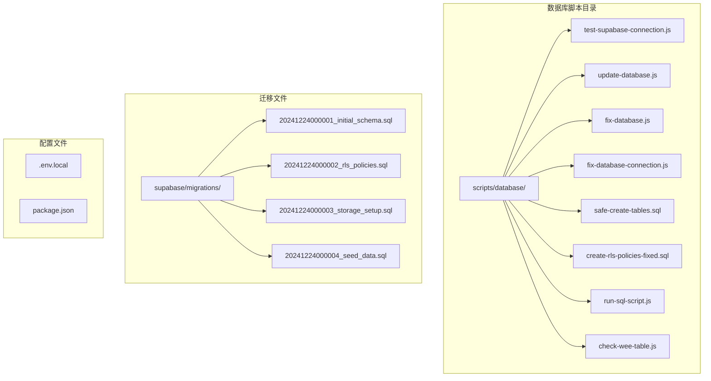
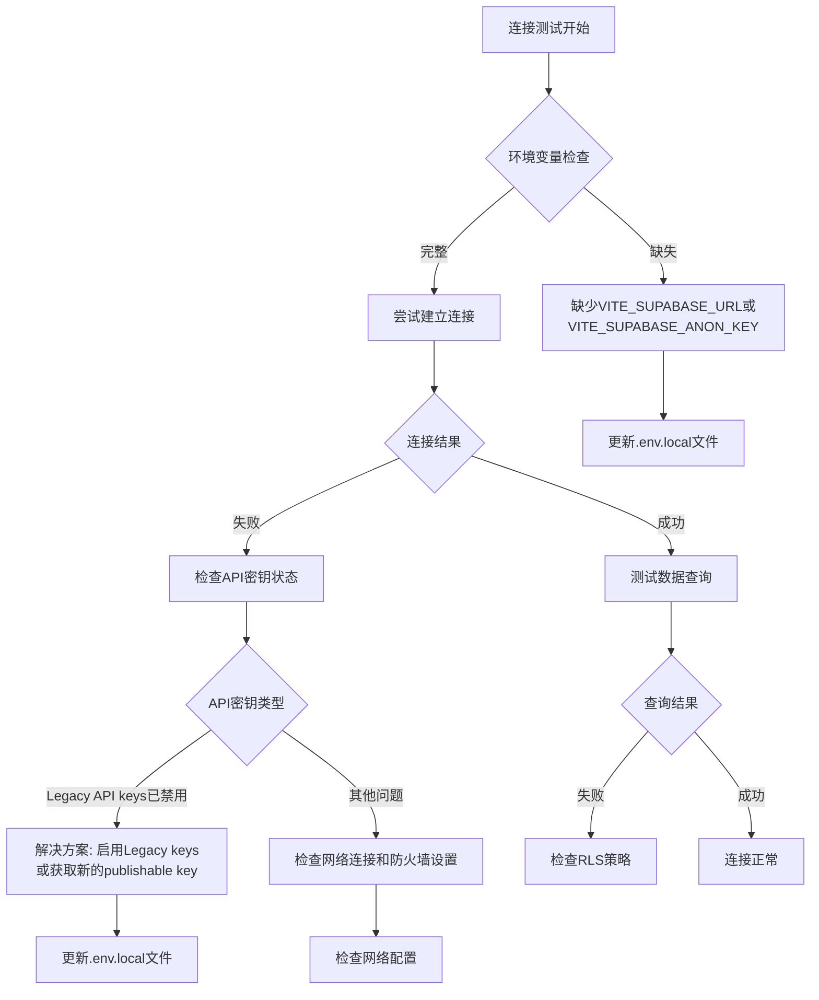
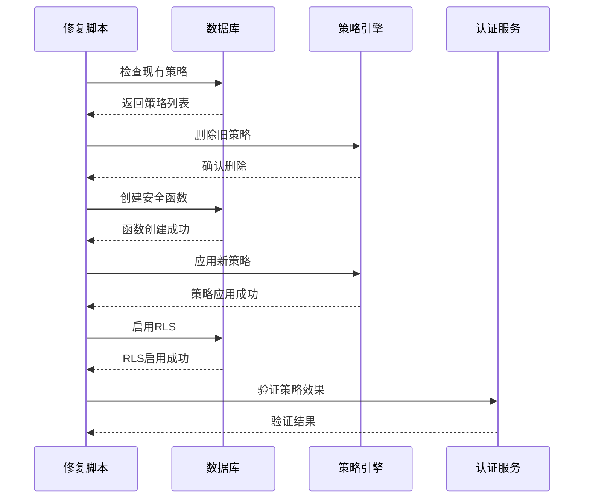
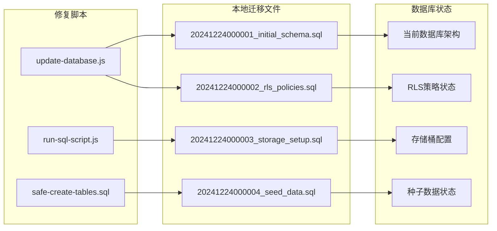
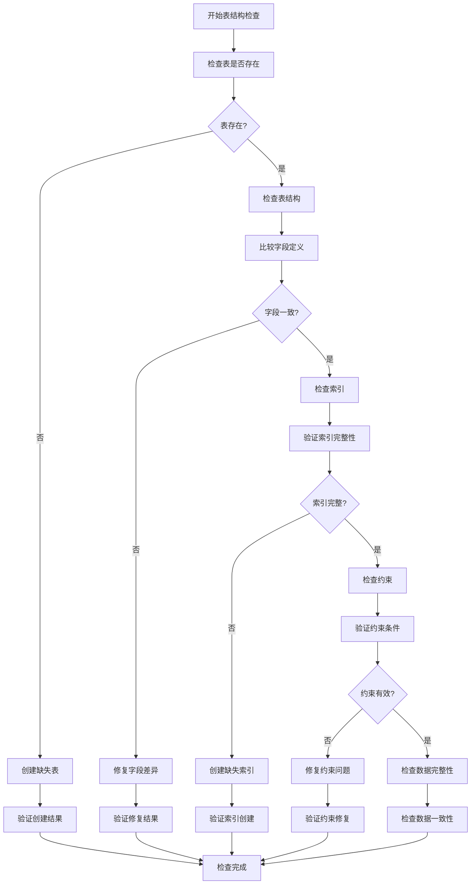
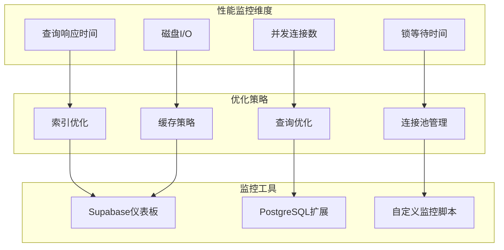
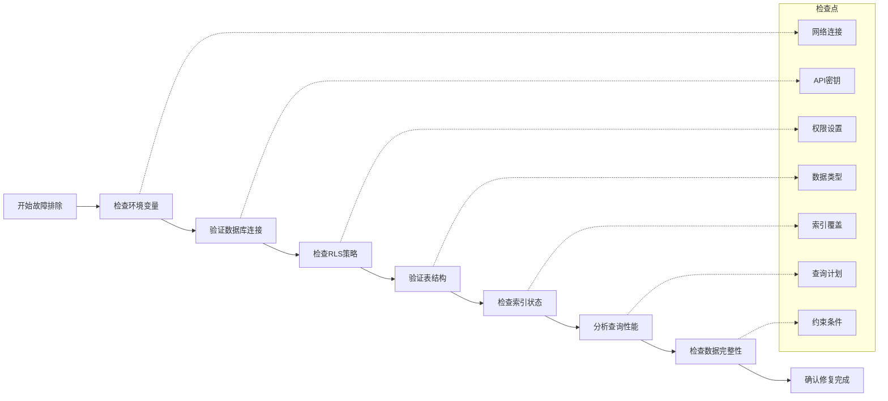

现在我已经收集了足够的信息来编写完整的数据库问题排查手册。让我开始生成文档：

<docs>
# 数据库问题排查手册

<cite>
**本文档引用的文件**
- [test-supabase-connection.js](file://scripts/database/test-supabase-connection.js)
- [update-database.js](file://scripts/database/update-database.js)
- [fix-database.js](file://scripts/fix-database.js)
- [fix-database-connection.js](file://scripts/fix-database-connection.js)
- [safe-create-tables.sql](file://scripts/database/safe-create-tables.sql)
- [create-rls-policies-fixed.sql](file://scripts/database/create-rls-policies-fixed.sql)
- [run-sql-script.js](file://scripts/database/run-sql-script.js)
- [check-wee-table.js](file://scripts/database/check-wee-table.js)
- [20241224000001_initial_schema.sql](file://supabase/migrations/20241224000001_initial_schema.sql)
- [20241224000002_rls_policies.sql](file://supabase/migrations/20241224000002_rls_policies.sql)
</cite>

## 目录
1. [简介](#简介)
2. [项目结构概览](#项目结构概览)
3. [核心数据库脚本](#核心数据库脚本)
4. [连接问题排查](#连接问题排查)
5. [RLS策略问题](#rls策略问题)
6. [迁移问题排查](#迁移问题排查)
7. [表结构问题](#表结构问题)
8. [性能优化](#性能优化)
9. [故障排除指南](#故障排除指南)
10. [最佳实践](#最佳实践)

## 简介

本手册专门针对Supabase数据库连接与结构问题提供全面的排查和解决方案。涵盖了从基础连接测试到复杂迁移问题的完整排查流程，帮助开发者快速定位和解决数据库相关问题。

## 项目结构概览



**图表来源**
- [test-supabase-connection.js](file://scripts/database/test-supabase-connection.js#L1-L112)
- [update-database.js](file://scripts/database/update-database.js#L1-L305)
- [fix-database.js](file://scripts/fix-database.js#L1-L228)

## 核心数据库脚本

### 连接测试脚本

`test-supabase-connection.js` 是数据库连接测试的核心工具，提供全面的连通性检查：

```javascript
// 主要功能模块
async function testConnection() {
  console.log("🔍 测试Supabase数据库连接...");
  
  // 测试1: 获取分类数据
  const { data: categories, error: categoriesError } = await supabase
    .from("categories")
    .select("*")
    .eq("is_active", true)
    .order("sort_order", { ascending: true });

  // 测试2: 获取工具数据
  const { data: tools, error: toolsError } = await supabase
    .from("tools")
    .select("*, category:categories(*)")
    .eq("status", "active")
    .eq("is_active", true);

  // 测试3: 获取产品数据
  const { data: products, error: productsError } = await supabase
    .from("products")
    .select("*, category:product_categories(*)")
    .eq("status", "active");
}
```

**章节来源**
- [test-supabase-connection.js](file://scripts/database/test-supabase-connection.js#L25-L85)

### 数据库更新脚本

`update-database.js` 提供完整的数据库更新和重置功能：

```javascript
async function updateDatabase() {
  // 清空现有数据
  await supabase.from("tool_tags").delete().neq("tool_id", "");
  await supabase.from("tools").delete().neq("id", "");
  await supabase.from("tags").delete().neq("id", "");

  // 插入新标签
  const tags = [
    { id: "750e8400-e29b-41d4-a716-446655440001", name: "代码托管", color: "#0078d4" },
    { id: "750e8400-e29b-41d4-a716-446655440002", name: "版本控制", color: "#0078d4" },
    // ... 更多标签
  ];
}
```

**章节来源**
- [update-database.js](file://scripts/database/update-database.js#L15-L100)

## 连接问题排查

### 常见连接错误类型



**图表来源**
- [fix-database-connection.js](file://scripts/fix-database-connection.js#L30-L60)
- [test-supabase-connection.js](file://scripts/database/test-supabase-connection.js#L15-L25)

### 连接修复步骤

1. **环境变量验证**
```bash
# 检查环境变量是否正确设置
echo $VITE_SUPABASE_URL
echo $VITE_SUPABASE_ANON_KEY
```

2. **API密钥问题诊断**
```javascript
// 检查API密钥状态
if (error.message.includes("Legacy API keys are disabled")) {
  console.log("解决方案：");
  console.log("1. 访问 Supabase 控制台");
  console.log("2. 进入项目设置 > API");
  console.log("3. 重新启用 legacy keys 或获取新的 publishable key");
}
```

3. **网络连接测试**
```javascript
// 测试基本连接
const { error } = await supabase
  .from("categories")
  .select("count")
  .limit(1);
```

**章节来源**
- [fix-database-connection.js](file://scripts/fix-database-connection.js#L30-L80)

## RLS策略问题

### RLS策略修复流程



**图表来源**
- [create-rls-policies-fixed.sql](file://scripts/database/create-rls-policies-fixed.sql#L1-L50)
- [fix-database-connection.js](file://scripts/fix-database-connection.js#L60-L90)

### RLS策略修复脚本

`create-rls-policies-fixed.sql` 提供了完整的RLS策略修复功能：

```sql
-- 创建安全定义函数以提高性能
CREATE OR REPLACE FUNCTION private.get_user_role()
RETURNS TEXT
LANGUAGE plpgsql
SECURITY DEFINER
AS $$
BEGIN
    RETURN (
        SELECT role 
        FROM user_profiles 
        WHERE id = auth.uid()
    );
END;
$$;

-- 检查用户是否为管理员
CREATE OR REPLACE FUNCTION private.is_admin()
RETURNS BOOLEAN
LANGUAGE plpgsql
SECURITY DEFINER
AS $$
BEGIN
    RETURN (
        SELECT role IN ('admin', 'super_admin')
        FROM user_profiles 
        WHERE id = auth.uid()
    );
END;
$$;
```

**章节来源**
- [create-rls-policies-fixed.sql](file://scripts/database/create-rls-policies-fixed.sql#L15-L45)

### 常见RLS问题及解决方案

1. **策略拒绝访问**
   - 检查用户角色权限
   - 验证RLS策略语法
   - 确认安全函数正确性

2. **性能问题**
   - 使用安全定义函数避免递归检查
   - 创建适当的索引
   - 优化策略逻辑

3. **枚举值错误**
   - 确保使用正确的枚举值
   - 检查表结构一致性
   - 验证策略条件匹配

**章节来源**
- [create-rls-policies-fixed.sql](file://scripts/database/create-rls-policies-fixed.sql#L400-L500)

## 迁移问题排查

### 迁移脚本对比



**图表来源**
- [update-database.js](file://scripts/database/update-database.js#L15-L30)
- [run-sql-script.js](file://scripts/database/run-sql-script.js#L15-L30)

### 迁移同步步骤

1. **检查数据库版本**
```javascript
// 使用run-sql-script.js同步最新迁移
node scripts/database/run-sql-script.js supabase/migrations/20241224000001_initial_schema.sql
```

2. **验证迁移完整性**
```javascript
// 检查表结构是否与迁移文件一致
const { data: columns, error: columnsError } = await supabase.rpc("exec_sql", {
  sql: `
    SELECT column_name, data_type, is_nullable, column_default
    FROM information_schema.columns 
    WHERE table_name = 'tools' AND table_schema = 'public'
    ORDER BY ordinal_position;
  `,
});
```

3. **处理迁移冲突**
```javascript
// 使用safe-create-tables.sql安全创建表
node scripts/database/run-sql-script.js scripts/database/safe-create-tables.sql
```

**章节来源**
- [run-sql-script.js](file://scripts/database/run-sql-script.js#L25-L80)
- [safe-create-tables.sql](file://scripts/database/safe-create-tables.sql#L1-L50)

## 表结构问题

### 表结构检查流程



**图表来源**
- [check-wee-table.js](file://scripts/database/check-wee-table.js#L20-L80)
- [safe-create-tables.sql](file://scripts/database/safe-create-tables.sql#L1-L30)

### 表结构修复脚本

`check-wee-table.js` 提供了完整的表结构检查和修复功能：

```javascript
async function checkWeeTable() {
  console.log("🔍 检查 wee 表...");
  
  // 尝试直接查询 wee 表
  const { error: weeError } = await supabase.from("wee").select("*").limit(1);
  
  if (weeError) {
    if (weeError.message.includes("does not exist") || weeError.code === "42P01") {
      console.log("✅ wee 表不存在，无需删除");
      return false;
    }
  }
  
  console.log("⚠️ 发现 wee 表存在");
  return true;
}
```

**章节来源**
- [check-wee-table.js](file://scripts/database/check-wee-table.js#L20-L60)

### 常见表结构问题

1. **表不存在**
   - 使用 `safe-create-tables.sql` 创建缺失表
   - 验证表结构定义
   - 检查权限设置

2. **字段类型不匹配**
   - 比较迁移文件和数据库结构
   - 使用ALTER TABLE修复字段
   - 验证数据兼容性

3. **索引缺失**
   - 分析查询性能瓶颈
   - 创建必要的索引
   - 优化索引策略

**章节来源**
- [check-wee-table.js](file://scripts/database/check-wee-table.js#L80-L150)

## 性能优化

### 性能监控指标



### 性能优化脚本

`create-rls-policies-fixed.sql` 包含了性能优化的关键部分：

```sql
-- 创建性能优化索引
CREATE INDEX IF NOT EXISTS idx_user_profiles_role ON user_profiles(role);
CREATE INDEX IF NOT EXISTS idx_orders_user_id_status ON orders(user_id, status);
CREATE INDEX IF NOT EXISTS idx_favorites_user_id ON favorites(user_id);
CREATE INDEX IF NOT EXISTS idx_product_reviews_user_id ON product_reviews(user_id);

-- 使用安全定义函数避免RLS递归检查
CREATE OR REPLACE FUNCTION private.is_admin()
RETURNS BOOLEAN
LANGUAGE plpgsql
SECURITY DEFINER
AS $$
BEGIN
    RETURN (
        SELECT role IN ('admin', 'super_admin')
        FROM user_profiles 
        WHERE id = auth.uid()
    );
END;
$$;
```

**章节来源**
- [create-rls-policies-fixed.sql](file://scripts/database/create-rls-policies-fixed.sql#L650-L680)

## 故障排除指南

### 常见错误代码及解决方案

| 错误代码 | 错误描述 | 解决方案 |
|---------|---------|---------|
| 42P01 | 表不存在 | 使用safe-create-tables.sql创建表 |
| 42703 | 列不存在 | 检查迁移文件和表结构 |
| 42804 | 类型不匹配 | 修复字段类型定义 |
| 23505 | 违反唯一约束 | 清理重复数据或修改约束 |

### 故障排除检查清单



### 自动化故障排除脚本

```javascript
// 综合故障排除脚本
async function comprehensiveDiagnostics() {
  console.log("🔍 开始综合诊断...");
  
  // 1. 连接测试
  await testConnection();
  
  // 2. 表结构检查
  await checkTables();
  
  // 3. RLS策略验证
  await validateRLSPolicies();
  
  // 4. 性能指标分析
  await analyzePerformance();
  
  console.log("✅ 诊断完成");
}
```

**章节来源**
- [fix-database-connection.js](file://scripts/fix-database-connection.js#L180-L220)

## 最佳实践

### 数据库维护最佳实践

1. **定期备份**
   ```bash
   # 使用Supabase CLI备份
   supabase db dump --file backup.sql
   ```

2. **监控告警**
   - 设置连接超时告警
   - 监控RLS策略执行时间
   - 跟踪查询性能变化

3. **版本控制**
   - 保持迁移文件版本化
   - 记录每次变更原因
   - 维护回滚策略

4. **安全配置**
   - 定期更新API密钥
   - 检查RLS策略有效性
   - 验证权限设置

### 开发环境配置

```javascript
// 开发环境数据库配置
const devConfig = {
  url: process.env.VITE_SUPABASE_URL_DEV,
  key: process.env.VITE_SUPABASE_ANON_KEY_DEV,
  serviceRole: process.env.SUPABASE_SERVICE_ROLE_KEY_DEV
};

// 生产环境数据库配置
const prodConfig = {
  url: process.env.VITE_SUPABASE_URL,
  key: process