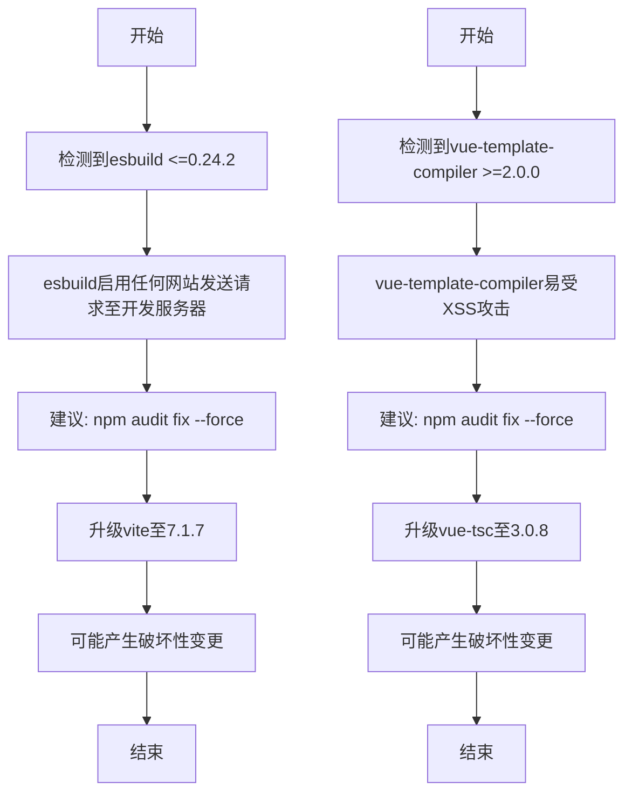
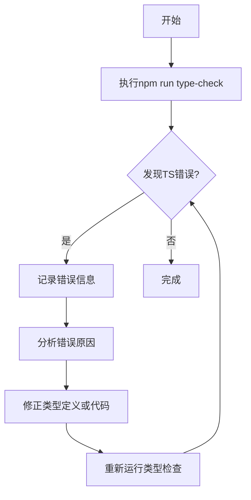
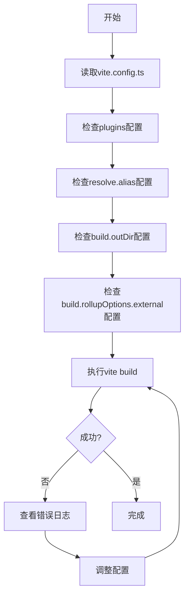

# 构建与依赖问题排查

<cite>
**本文档引用的文件**
- [package.json](file://package.json)
- [vite.config.ts](file://vite.config.ts)
- [tsconfig.json](file://tsconfig.json)
- [scripts/deployment/clean-dependencies.js](file://scripts/deployment/clean-dependencies.js)
- [run_17963016897_logs/3_📋 Code Quality Check.txt](file://run_17963016897_logs/3_📋 Code Quality Check.txt)
- [run_17963016897_logs/4_🔒 Security Check.txt](file://run_17963016897_logs/4_🔒 Security Check.txt)
</cite>

## 目录
1. [项目构建问题概述](#项目构建问题概述)
2. [依赖冲突分析](#依赖冲突分析)
3. [TypeScript类型错误排查](#typescript类型错误排查)
4. [Vite打包失败问题](#vite打包失败问题)
5. [clean-dependencies.js脚本分析](#clean-dependenciesjs脚本分析)
6. [vite.config.ts配置检查](#viteconfigts配置检查)
7. [lockfile冲突解决方案](#lockfile冲突解决方案)
8. [依赖版本兼容性升级](#依赖版本兼容性升级)
9. [tsconfig.json配置验证](#tsconfigjson配置验证)
10. [最小化复现构建错误的方法](#最小化复现构建错误的方法)
11. [增量调试建议](#增量调试建议)

## 项目构建问题概述

在项目构建过程中，出现了多种问题，包括依赖冲突、TypeScript类型错误和Vite打包失败。通过分析运行日志（如run_17963016897_logs）中的Node.js安装和构建阶段输出，可以定位npm/yarn/pnpm依赖解析异常。此外，需要指导如何修复lockfile冲突、升级依赖版本兼容性问题，并验证tsconfig.json配置与源码的一致性。

**Section sources**
- [run_17963016897_logs/3_📋 Code Quality Check.txt](file://run_17963016897_logs/3_📋 Code Quality Check.txt)
- [run_17963016897_logs/4_🔒 Security Check.txt](file://run_17963016897_logs/4_🔒 Security Check.txt)

## 依赖冲突分析

从安全审计日志中可以看出，存在多个中等严重性的漏洞，主要涉及esbuild和vue-template-compiler。这些漏洞可能导致开发服务器被任意网站请求并读取响应，以及客户端跨站脚本攻击(XSS)。建议使用`npm audit fix --force`来解决这些问题，但这可能会导致破坏性变更，例如将vite升级到7.1.7版本。

**Diagram sources**
- [run_17963016897_logs/4_🔒 Security Check.txt](file://run_17963016897_logs/4_🔒 Security Check.txt)

**Section sources**
- [run_17963016897_logs/4_🔒 Security Check.txt](file://run_17963016897_logs/4_🔒 Security Check.txt)

## TypeScript类型错误排查

TypeScript类型检查发现了大量错误，主要包括：
- 类型不匹配：如`string`不能赋值给`File`
- 属性不存在：如`User`类型缺少`status`属性
- 模块未找到：如无法找到模块`@/data/additional-tools`
- 函数参数数量不匹配：期望0-1个参数但提供了3个

这些问题表明类型定义与实际代码实现之间存在不一致，需要更新或修正相关类型的定义。

**Diagram sources**
- [run_17963016897_logs/3_📋 Code Quality Check.txt](file://run_17963016897_logs/3_📋 Code Quality Check.txt)

**Section sources**
- [run_17963016897_logs/3_📋 Code Quality Check.txt](file://run_17963016897_logs/3_📋 Code Quality Check.txt)

## Vite打包失败问题

Vite打包失败的原因可能包括：
- 配置文件(vite.config.ts)中的插件配置不当
- 外部化(platform-specific)的rollup可选二进制包处理不当
- 构建选项(build options)设置不合理

特别是rollupOptions.external配置了以"@rollup/rollup-"开头的ID作为外部化，这可能是为了避免CI上的EBADPLATFORM错误。

**Diagram sources**
- [vite.config.ts