# 认证与权限问题排查

<cite>
**本文档引用的文件**
- [authService.ts](file://src/services/authService.ts)
- [auth.ts](file://src/stores/auth.ts)
- [supabaseClient.ts](file://src/lib/supabaseClient.ts)
- [create-rls-policies-fixed.sql](file://scripts/database/create-rls-policies-fixed.sql)
- [fix-storage-policies.js](file://scripts/database/fix-storage-policies.js)
- [errorHandler.ts](file://src/utils/errorHandler.ts)
</cite>

## 目录
1. [简介](#简介)
2. [认证系统架构概览](#认证系统架构概览)
3. [常见认证问题及排查](#常见认证问题及排查)
4. [RLS权限策略分析](#rls权限策略分析)
5. [存储策略修复指南](#存储策略修复指南)
6. [JWT令牌调试与验证](#jwt令牌调试与验证)
7. [OAuth回调异常处理](#oauth回调异常处理)
8. [用户身份模拟测试](#用户身份模拟测试)
9. [故障排除最佳实践](#故障排除最佳实践)
10. [总结](#总结)

## 简介

本文档旨在帮助开发者深入理解Supabase认证系统的运作机制，特别是针对登录失败、会话过期、RLS权限拒绝等常见认证相关问题的排查和解决方案。通过分析authService.ts中的认证流程，结合Supabase RLS策略定义，以及实际的故障排除案例，为开发者提供全面的认证问题诊断指南。

## 认证系统架构概览

### 整体架构设计

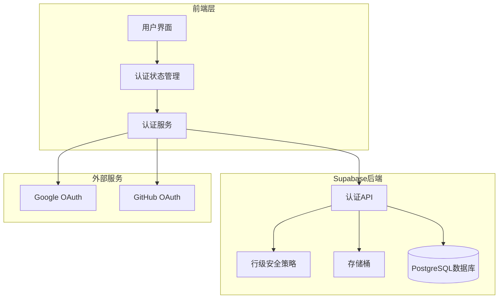

**图表来源**
- [authService.ts](file://src/services/authService.ts#L1-L50)
- [auth.ts](file://src/stores/auth.ts#L1-L30)

### 认证流程核心组件

认证系统的核心组件包括：

1. **AuthService** - 提供完整的认证业务逻辑
2. **AuthStore** - 管理认证状态和用户信息
3. **SupabaseClient** - 提供底层数据库和存储操作
4. **RLS策略** - 实现行级安全控制
5. **错误处理机制** - 统一的错误管理和日志记录

**章节来源**
- [authService.ts](file://src/services/authService.ts#L1-L306)
- [auth.ts](file://src/stores/auth.ts#L1-L190)

## 常见认证问题及排查

### 登录失败问题

#### 问题症状
- 用户无法登录系统
- 登录请求返回401未授权错误
- 密码验证失败

#### 排查步骤

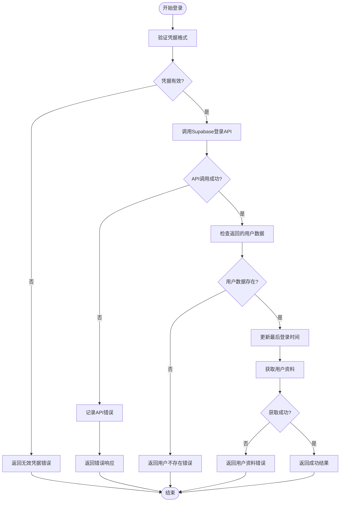

**图表来源**
- [authService.ts](file://src/services/authService.ts#L15-L45)

#### 常见原因分析

1. **凭据验证失败**
   - 邮箱格式不正确
   - 密码长度或复杂度不符合要求
   - 用户名已被占用

2. **Supabase配置问题**
   - API密钥配置错误
   - 数据库连接失败
   - 认证服务未启用

3. **用户状态问题**
   - 用户账户被禁用
   - 邮箱未验证
   - 账户过期

**章节来源**
- [authService.ts](file://src/services/authService.ts#L15-L45)

### 会话过期问题

#### 问题症状
- 用户突然被登出
- 会话令牌过期
- 权限验证失败

#### 排查方法

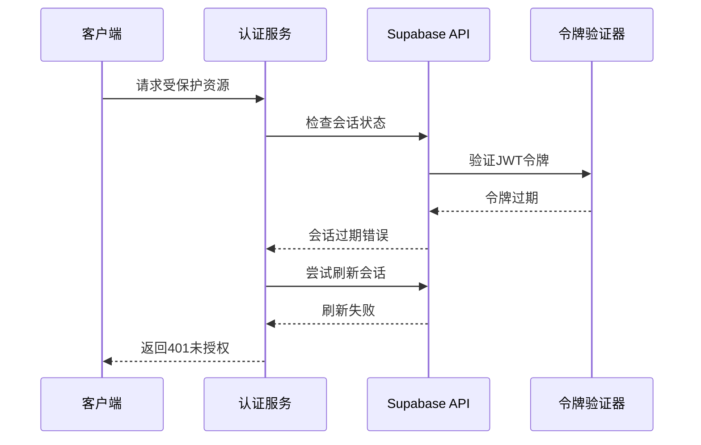

**图表来源**
- [authService.ts](file://src/services/authService.ts#L220-L240)

#### 解决方案

1. **自动刷新机制**
   ```typescript
   // 自动检测会话状态
   async function checkSessionValidity() {
     const session = await AuthService.getSession();
     if (!session || new Date(session.expires_at) < new Date()) {
       await AuthService.refreshSession();
     }
   }
   ```

2. **用户提示机制**
   - 显示会话即将过期警告
   - 提供手动刷新选项
   - 自动保存未提交的数据

**章节来源**
- [authService.ts](file://src/services/authService.ts#L220-L240)

### 权限拒绝问题

#### 问题症状
- RLS策略阻止数据访问
- 用户无法查看或修改特定数据
- 权限验证失败

#### 排查流程

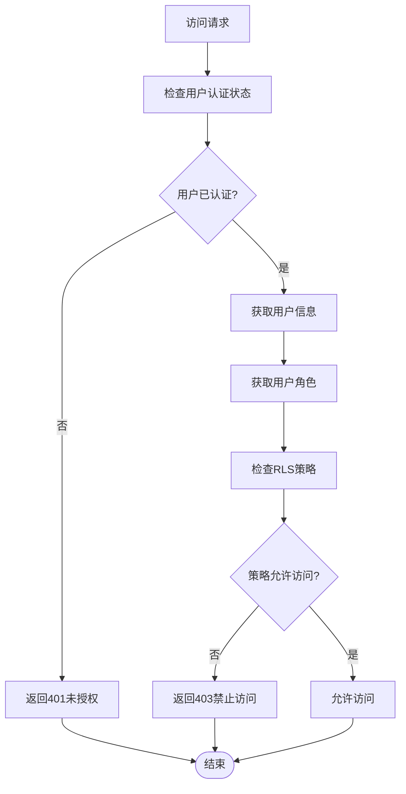

**图表来源**
- [supabaseClient.ts](file://src/lib/supabaseClient.ts#L60-L80)

**章节来源**
- [supabaseClient.ts](file://src/lib/supabaseClient.ts#L60-L80)

## RLS权限策略分析

### RLS策略架构

Supabase的行级安全(RLS)策略提供了细粒度的数据访问控制。以下是关键的RLS策略组件：

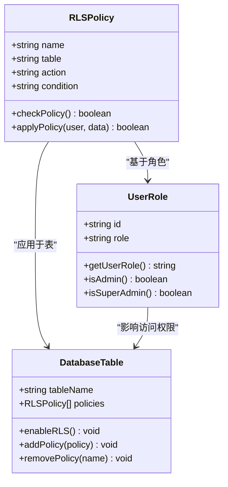

**图表来源**
- [create-rls-policies-fixed.sql](file://scripts/database/create-rls-policies-fixed.sql#L1-L50)

### 关键RLS策略分析

#### 用户资料策略

1. **公开查看策略**
   ```sql
   CREATE POLICY "public_profiles_select" ON user_profiles
   FOR SELECT
   TO authenticated, anon
   USING (true);
   ```

2. **个人资料管理策略**
   ```sql
   CREATE POLICY "users_update_own_profile" ON user_profiles
   FOR UPDATE
   TO authenticated
   USING (id = auth.uid());
   ```

#### 数据访问策略

1. **工具数据访问**
   ```sql
   CREATE POLICY "public_tools_select" ON tools
   FOR SELECT
   TO authenticated
   USING (is_active = true);
   ```

2. **管理员管理策略**
   ```sql
   CREATE POLICY "admin_tools_update" ON tools
   FOR UPDATE
   TO authenticated
   USING (
     EXISTS (
       SELECT 1 FROM user_profiles 
       WHERE id = auth.uid() 
       AND role IN ('admin', 'super_admin')
     )
   );
   ```

**章节来源**
- [create-rls-policies-fixed.sql](file://scripts/database/create-rls-policies-fixed.sql#L150-L200)

### RLS策略验证

#### 策略有效性检查

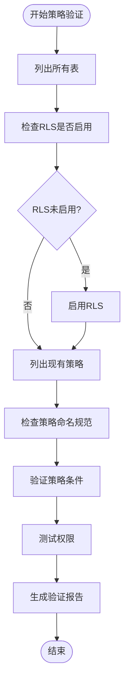

**图表来源**
- [create-rls-policies-fixed.sql](file://scripts/database/create-rls-policies-fixed.sql#L80-L120)

**章节来源**
- [create-rls-policies-fixed.sql](file://scripts/database/create-rls-policies-fixed.sql#L80-L150)

## 存储策略修复指南

### 存储策略问题概述

存储策略问题通常表现为：
- 用户无法上传文件
- 文件访问权限错误
- 存储桶权限配置不当

### 修复脚本分析

#### fix-storage-policies.js功能

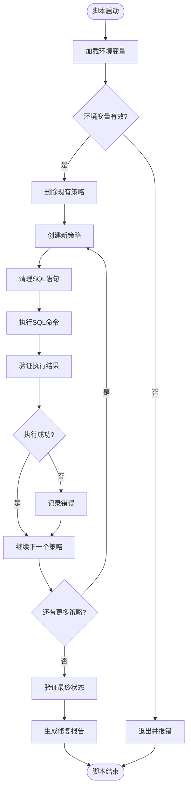

**图表来源**
- [fix-storage-policies.js](file://scripts/database/fix-storage-policies.js#L1-L50)

#### 关键修复策略

1. **头像文件策略**
   ```javascript
   // 用户可以上传自己的头像
   CREATE POLICY "用户可以上传自己的头像" ON storage.objects
   FOR INSERT WITH CHECK (
     bucket_id = 'avatars' 
     AND auth.uid()::text = (storage.foldername(name))[1]
   );
   ```

2. **产品图片管理策略**
   ```javascript
   // 管理员可以上传产品图片
   CREATE POLICY "管理员可以上传产品图片" ON storage.objects
   FOR INSERT WITH CHECK (
     bucket_id = 'product-images'
     AND EXISTS (
       SELECT 1 FROM user_profiles 
       WHERE id = auth.uid() 
       AND role IN ('admin', 'super_admin')
     )
   );
   ```

**章节来源**
- [fix-storage-policies.js](file://scripts/database/fix-storage-policies.js#L50-L150)

### 存储策略验证

#### 验证流程

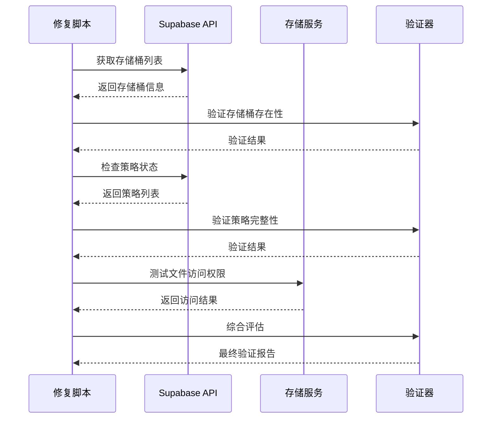

**图表来源**
- [fix-storage-policies.js](file://scripts/database/fix-storage-policies.js#L250-L300)

**章节来源**
- [fix-storage-policies.js](file://scripts/database/fix-storage-policies.js#L250-L336)

## JWT令牌调试与验证

### JWT令牌结构分析

#### 令牌组成部分

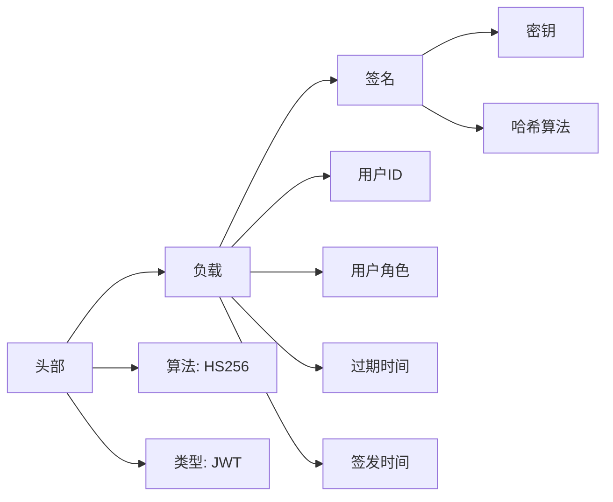

### 令牌验证流程

#### 调试步骤

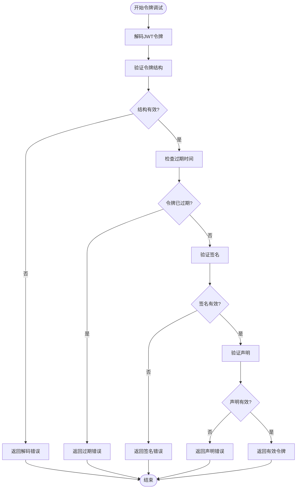

### 令牌调试工具

#### 开发者工具集成

```typescript
// 令牌调试辅助函数
function debugJWTToken(token: string) {
  try {
    // 解码头部
    const header = decodeJWTHeader(token);
    console.log('JWT Header:', header);
    
    // 解码负载
    const payload = decodeJWTPayload(token);
    console.log('JWT Payload:', payload);
    
    // 验证过期时间
    if (payload.exp && payload.exp < Date.now() / 1000) {
      console.warn('JWT令牌已过期');
    }
    
    // 验证用户角色
    if (payload.role) {
      console.log('用户角色:', payload.role);
    }
    
  } catch (error) {
    console.error('JWT令牌调试失败:', error);
  }
}
```

**章节来源**
- [authService.ts](file://src/services/authService.ts#L220-L240)

## OAuth回调异常处理

### OAuth流程分析

#### 回调处理机制

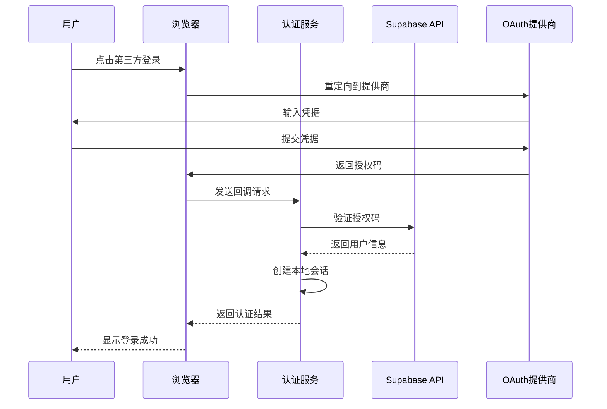

**图表来源**
- [authService.ts](file://src/services/authService.ts#L250-L280)

### 常见OAuth问题

#### 问题类型及解决方案

1. **回调URL不匹配**
   - 检查OAuth提供商配置
   - 验证重定向URL设置
   - 确认环境变量配置

2. **授权码过期**
   - 实现授权码重试机制
   - 设置合理的超时时间
   - 提供用户友好的错误提示

3. **用户取消授权**
   - 处理用户取消事件
   - 清理临时状态
   - 引导用户重新尝试

**章节来源**
- [authService.ts](file://src/services/authService.ts#L250-L280)

## 用户身份模拟测试

### 测试框架设计

#### 模拟用户身份

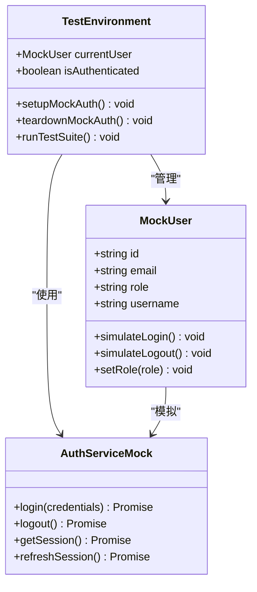

### 模拟测试实现

#### 测试用例示例

```typescript
// 用户身份模拟测试
describe('认证模拟测试', () => {
  let mockUser: MockUser;
  
  beforeEach(() => {
    // 设置测试环境
    mockUser = new MockUser({
      id: 'test-user-id',
      email: 'test@example.com',
      role: 'admin'
    });
  });
  
  it('应该能够模拟管理员登录', async () => {
    await mockUser.simulateLogin();
    
    expect(mockUser.isAuthenticated()).toBe(true);
    expect(mockUser.hasAdminRights()).toBe(true);
  });
  
  it('应该能够模拟普通用户登录', async () => {
    mockUser.setRole('user');
    await mockUser.simulateLogin();
    
    expect(mockUser.isAuthenticated()).toBe(true);
    expect(mockUser.hasAdminRights()).toBe(false);
  });
});
```

### 测试工具函数

#### 辅助测试函数

```typescript
// 创建测试用户
function createTestUser(role: 'user' | 'admin' | 'super_admin') {
  return {
    id: `test-${role}-${Date.now()}`,
    email: `test-${role}@example.com`,
    role,
    username: `test_${role}`
  };
}

// 模拟用户登录
async function simulateUserLogin(user: any) {
  // 模拟Supabase认证
  const session = await supabase.auth.signInWithPassword({
    email: user.email,
    password: 'test-password'
  });
  
  // 更新用户状态
  await updateUserProfile(user.id, {
    role: user.role,
    last_login: new Date()
  });
  
  return session;
}
```

**章节来源**
- [auth.ts](file://src/stores/auth.ts#L40-L80)

## 故障排除最佳实践

### 错误处理策略

#### 统一错误处理机制

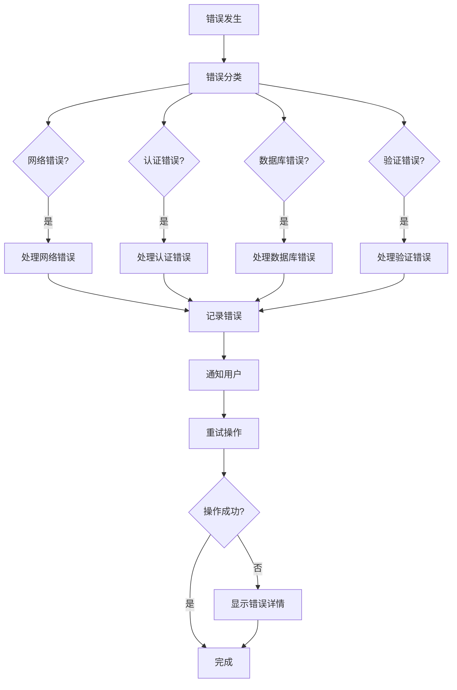

**图表来源**
- [errorHandler.ts](file://src/utils/errorHandler.ts#L50-L100)

### 性能监控与优化

#### 监控指标

1. **认证成功率**
   - 登录成功率统计
   - OAuth回调成功率
   - 会话保持率

2. **响应时间监控**
   - API响应时间
   - 页面加载时间
   - 数据库查询时间

3. **错误率监控**
   - 401未授权错误
   - 403权限拒绝
   - 500服务器错误

**章节来源**
- [errorHandler.ts](file://src/utils/errorHandler.ts#L50-L150)

### 日志记录策略

#### 结构化日志记录

```typescript
// 结构化错误日志
interface AuthLogEntry {
  timestamp: Date;
  userId?: string;
  sessionId?: string;
  eventType: 'login' | 'logout' | 'session_refresh' | 'permission_denied';
  statusCode: number;
  errorMessage: string;
  userAgent: string;
  ipAddress: string;
  metadata?: Record<string, any>;
}

// 日志记录函数
function logAuthEvent(event: Partial<AuthLogEntry>) {
  const logEntry: AuthLogEntry = {
    timestamp: new Date(),
    eventType: 'login',
    statusCode: 200,
    errorMessage: '',
    userAgent: navigator.userAgent,
    ipAddress: '', // 需要从服务器获取
    ...event
  };
  
  console.log('Auth Event:', logEntry);
  // 发送到监控服务
  sendToMonitoring(logEntry);
}
```

**章节来源**
- [errorHandler.ts](file://src/utils/errorHandler.ts#L200-L250)

## 总结

本文档详细介绍了Supabase认证系统的排查方法和最佳实践。通过深入分析authService.ts中的认证流程，结合RLS策略和存储策略的修复方案，为开发者提供了全面的认证问题诊断指南。

### 关键要点

1. **系统化排查方法** - 采用结构化的排查流程，确保问题能够快速定位和解决
2. **策略验证机制** - 通过自动化脚本验证RLS和存储策略的有效性
3. **错误处理统一化** - 实现统一的错误处理和日志记录机制
4. **测试驱动开发** - 通过模拟测试确保认证功能的可靠性

### 后续建议

1. **定期策略检查** - 建立定期的RLS和存储策略检查机制
2. **监控告警系统** - 实现认证相关的监控告警
3. **文档持续更新** - 根据实际问题不断更新排查指南
4. **团队培训** - 定期对开发团队进行认证系统培训

通过遵循本文档的指导原则和最佳实践，开发团队能够更有效地处理认证相关问题，提升系统的稳定性和用户体验。