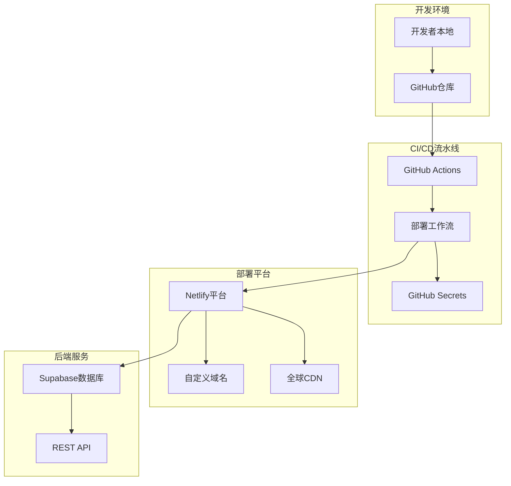
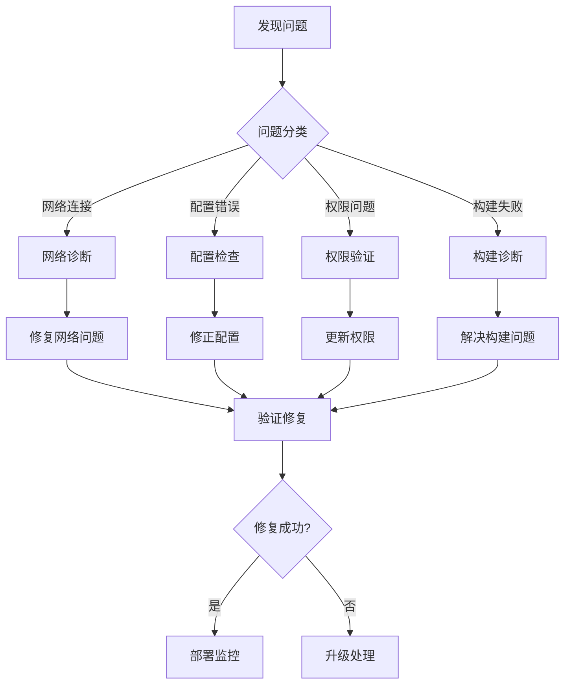

现在我已经收集了足够的信息来创建详细的部署故障排查指南。让我开始编写文档。

<docs>
# 部署问题排查指南

<cite>
**本文档中引用的文件**
- [diagnose-deployment.js](file://scripts/deployment/diagnose-deployment.js)
- [verify-config-match.js](file://scripts/deployment/verify-config-match.js)
- [fix-netlify-root-directory.mjs](file://scripts/deployment/fix-netlify-root-directory.mjs)
- [trigger-deployment.js](file://scripts/deployment/trigger-deployment.js)
- [check-netlify-config.js](file://scripts/deployment/check-netlify-config.js)
- [quick-fix-deployment.js](file://scripts/deployment/quick-fix-deployment.js)
- [monitor-deployment.js](file://scripts/deployment/monitor-deployment.js)
- [check-github-secrets.js](file://scripts/deployment/check-github-secrets.js)
- [netlify.toml](file://netlify.toml)
- [run_17963096786_logs/🎯 Deploy Performance Check/system.txt](file://run_17963096786_logs/🎯 Deploy Performance Check/system.txt)
- [run_17963096786_logs/🎯 Deploy Performance Check/1_Set up job.txt](file://run_17963096786_logs/🎯 Deploy Performance Check/1_Set up job.txt)
- [run_17963096786_logs/🎯 Deploy Performance Check/2_📥 Checkout code.txt](file://run_17963096786_logs/🎯 Deploy Performance Check/2_📥 Checkout code.txt)
- [run_17963096786_logs/🎯 Deploy Performance Check/3_🔧 Setup Node.js.txt](file://run_17963096786_logs/🎯 Deploy Performance Check/3_🔧 Setup Node.js.txt)
</cite>

## 目录
1. [简介](#简介)
2. [部署架构概览](#部署架构概览)
3. [常见部署问题分类](#常见部署问题分类)
4. [诊断脚本详解](#诊断脚本详解)
5. [Netlify部署故障排查](#netlify部署故障排查)
6. [GitHub Actions流水线问题](#github-actions流水线问题)
7. [环境变量配置问题](#环境变量配置问题)
8. [Supabase集成问题](#supabase集成问题)
9. [部署监控和告警](#部署监控和告警)
10. [故障排除最佳实践](#故障排除最佳实践)
11. [成功部署验证方法](#成功部署验证方法)
12. [总结](#总结)

## 简介

本指南基于Context7最佳实践，针对Advanced Tools Navigation项目的部署问题提供全面的故障排查解决方案。项目采用现代化的全栈架构，包括Vue.js前端、Supabase数据库和Netlify部署平台，通过GitHub Actions实现持续集成和部署。

## 部署架构概览



**图表来源**
- [diagnose-deployment.js](file://scripts/deployment/diagnose-deployment.js#L1-L50)
- [netlify.toml](file://netlify.toml#L1-L12)

## 常部署问题分类

### 1. 构建失败类问题

- **依赖安装失败**: npm包版本冲突或网络问题
- **构建命令错误**: Vite配置或构建脚本问题
- **内存不足**: 大型项目构建时的资源限制

### 2. 配置错误类问题

- **根目录配置错误**: Netlify站点设置中的根目录路径
- **环境变量缺失**: 生产环境所需的配置参数
- **域名解析问题**: DNS配置或SSL证书问题

### 3. 网络连接类问题

- **GitHub Actions网络限制**: 访问外部服务的权限
- **Supabase连接失败**: 数据库访问权限或网络问题
- **CDN缓存问题**: 全球CDN的缓存同步延迟

### 4. 权限和认证类问题

- **GitHub Token权限不足**: 缺少repo或workflow权限
- **Supabase访问令牌过期**: API密钥的有效期管理
- **Netlify部署权限**: 站点访问和部署权限

## 诊断脚本详解

### diagnose-deployment.js - 综合诊断脚本

这是项目的核心诊断工具，基于Context7最佳实践设计：

```javascript
// 核心诊断功能
async function diagnoseDeploy() {
  // 1. 检查GitHub Actions状态
  const { data: runs } = await octokit.rest.actions.listWorkflowRunsForRepo({
    owner: REPO_OWNER,
    repo: REPO_NAME,
    per_page: 10,
  });

  // 2. 网络连接诊断
  const endpoints = [
    "https://ramusi.cn",
    "https://api.github.com/zen",
    "https://api.netlify.com/api/v1/sites",
  ];

  // 3. Supabase连接检查
  const supabaseUrl = process.env.VITE_SUPABASE_URL;
  const supabaseKey = process.env.VITE_SUPABASE_ANON_KEY;
  
  // 4. 构建状态检查
  const criticalFiles = [
    "package.json",
    "netlify.toml", 
    "dist/index.html",
    ".env.local",
  ];
}
```

**章节来源**
- [diagnose-deployment.js](file://scripts/deployment/diagnose-deployment.js#L1-L169)

### verify-config-match.js - 配置验证脚本

该脚本确保所有配置文件的一致性：

```javascript
// 预期配置值
const expectedConfig = {
  github: {
    owner: "jiayuwee",
    repo: "advanced-tools-navigation",
  },
  netlify: {
    siteId: "spiffy-torrone-5454e1",
    domain: "ramusi.cn",
  },
  supabase: {
    projectRef: "ndmxwdejswybvbwrxsai",
    url: "https://your-supabase-project.supabase.co",
  },
};
```

**章节来源**
- [verify-config-match.js](file://scripts/deployment/verify-config-match.js#L1-L255)

### fix-netlify-root-directory.mjs - 根目录修复工具

专门解决Netlify根目录配置错误的问题：

```javascript
// 修复步骤
console.log("1. 登录 Netlify 控制台: https://app.netlify.com/");
console.log("2. 进入站点设置: https://app.netlify.com/sites/spiffy-torrone-5454e1/settings/deploys");
console.log("3. 修改以下设置:");
console.log("   - Base directory: 留空 (不要填写任何值)");
console.log("   - Build command: npm cache clean --force && npm install --no-optional && npm run build");
console.log("   - Publish directory: dist");
```

**章节来源**
- [fix-netlify-root-directory.mjs](file://scripts/deployment/fix-netlify-root-directory.mjs#L1-L122)

## Netlify部署故障排查

### 常见Netlify问题及解决方案

#### 1. 根目录配置错误

**问题症状**:
```
"The specified Root Directory 'jiayuwee' does not exist"
```

**诊断步骤**:
1. 检查项目根目录结构
2. 验证netlify.toml配置
3. 确认构建命令设置

**修复方法**:
```bash
# 1. 使用修复脚本
node scripts/deployment/fix-netlify-root-directory.mjs

# 2. 手动修改Netlify设置
# Base directory: 留空
# Build command: npm cache clean --force && npm install --no-optional && npm run build
# Publish directory: dist
```

#### 2. 构建命令失败

**netlify.toml配置检查**:
```toml
[build]
  command = "npm install --legacy-peer-deps --prefer-offline --no-audit --include=optional && npm run build"
  publish = "dist"

[build.environment]
  NODE_ENV = "production"
  NPM_CONFIG_INCLUDE_OPTIONAL = "true"

[context.production.environment]
  VITE_APP_ENV = "production"
```

**章节来源**
- [netlify.toml](file://netlify.toml#L1-L12)
- [fix-netlify-root-directory.mjs](file://scripts/deployment/fix-netlify-root-directory.mjs#L40-L60)

#### 3. 发布目录配置问题

**检查要点**:
- 确认dist目录存在
- 验证构建输出路径
- 检查静态文件生成

### Netlify配置验证

使用check-netlify-config.js进行自动化验证：

```javascript
// 构建命令检查
if (content.includes("npm ci && npm run build")) {
  console.log("✅ 构建命令正确");
} else {
  console.log("⚠️  构建命令可能有问题");
}

// 发布目录检查
if (content.includes('publish = "dist"')) {
  console.log("✅ 发布目录设置正确");
} else {
  console.log("⚠️  发布目录设置可能有问题");
}
```

**章节来源**
- [check-netlify-config.js](file://scripts/deployment/check-netlify-config.js#L1-L111)

## GitHub Actions流水线问题

### 工作流诊断和触发

#### 1. 工作流状态检查

```javascript
// 获取可用的工作流
const { data: workflows } = await octokit.rest.actions.listRepoWorkflows({
  owner: REPO_OWNER,
  repo: REPO_NAME,
});

// 选择部署工作流
const supabaseWorkflow = deployWorkflows.find(
  (w) => w.name.includes("Supabase") || w.path.includes("supabase-deploy"),
);
```

**章节来源**
- [trigger-deployment.js](file://scripts/deployment/trigger-deployment.js#L25-L60)

#### 2. 手动触发部署

使用trigger-deployment.js脚本：

```bash
# 设置GitHub Token
export GITHUB_TOKEN=your_github_token

# 触发部署
node scripts/deployment/trigger-deployment.js
```

**故障排除提示**:
- 确认Token具有repo和workflow权限
- 检查工作流文件是否包含workflow_dispatch
- 验证仓库访问权限

#### 3. GitHub Actions日志分析

从提供的日志文件分析：

**系统环境信息**:
```
Runner Image: ubuntu-24.04
Version: 20250907.24.1
Included Software: https://github.com/actions/runner-images/blob/ubuntu24/20250907.24/images/ubuntu/Ubuntu2404-Readme.md
```

**检查要点**:
- Runner版本兼容性
- 环境变量配置
- 依赖缓存状态

**章节来源**
- [run_17963096786_logs/🎯 Deploy Performance Check/system.txt](file://run_17963096786_logs/🎯 Deploy Performance Check/system.txt#L1-L5)
- [run_17963096786_logs/🎯 Deploy Performance Check/1_Set up job.txt](file://run_17963096786_logs/🎯 Deploy Performance Check/1_Set up job.txt#L1-L44)

### GitHub Secrets配置检查

#### 1. 必需的Secrets列表

```javascript
const requiredSecrets = [
  {
    name: "SUPABASE_ACCESS_TOKEN",
    description: "Supabase访问令牌",
    howToGet: "从Supabase Dashboard > Settings > API > Personal access tokens获取",
  },
  {
    name: "SUPABASE_PROJECT_REF", 
    description: "项目引用ID",
    howToGet: "从项目URL中获取，您的项目ID: ndmxwdejswybvbwrxsai",
  },
  {
    name: "VITE_SUPABASE_URL",
    description: "项目API URL",
    howToGet: "从Supabase Dashboard > Settings > API获取",
  },
  {
    name: "VITE_SUPABASE_ANON_KEY",
    description: "项目匿名密钥",
    howToGet: "从Supabase Dashboard > Settings > API获取",
  },
];
```

**章节来源**
- [check-github-secrets.js](file://scripts/deployment/check-github-secrets.js#L10-L40)

#### 2. 本地连接测试

```javascript
async function testSupabaseConnection() {
  const supabase = createClient(supabaseUrl, supabaseKey);
  
  const { error } = await supabase
    .from("categories")
    .select("count")
    .limit(1);

  if (error) {
    console.error("❌ 数据库连接失败:", error.message);
  } else {
    console.log("✅ 数据库连接正常");
  }
}
```

**章节来源**
- [check-github-secrets.js](file://scripts/deployment/check-github-secrets.js#L50-L80)

## 环境变量配置问题

### 本地环境变量检查

#### 1. .env.local文件验证

```javascript
// 检查关键配置
if (envContent.includes(expectedConfig.supabase.url)) {
  console.log("✅ VITE_SUPABASE_URL配置正确");
} else {
  console.log("❌ VITE_SUPABASE_URL可能不正确");
}

// 检查环境变量完整性
if (content.includes("VITE_SUPABASE_URL") && content.includes("VITE_SUPABASE_ANON_KEY")) {
  console.log(`   - 包含必要的Supabase环境变量`);
} else {
  console.log(`   - ⚠️ 缺少Supabase环境变量`);
}
```

**章节来源**
- [verify-config-match.js](file://scripts/deployment/verify-config-match.js#L180-L200)

#### 2. Netlify环境变量配置

**必需的环境变量**:
- `VITE_SUPABASE_URL`: Supabase项目URL
- `VITE_SUPABASE_ANON_KEY`: 匿名访问密钥
- `NODE_ENV`: 生产环境标识

**配置位置**:
- Netlify控制台: https://app.netlify.com/sites/spiffy-torrone-5454e1/settings/env
- GitHub Secrets: https://github.com/jiayuwee/advanced-tools-navigation/settings/secrets/actions

### 配置一致性验证

使用verify-config-match.js确保配置一致性：

```javascript
// 配置文件检查
const configFiles = [
  {
    path: ".github/workflows/deploy.yml",
    checks: [
      { pattern: /ramusi\.cn/, expected: "ramusi.cn", description: "域名配置" },
      {
        pattern: /spiffy-torrone-5454e1/,
        expected: "spiffy-torrone-5454e1", 
        description: "Netlify站点ID",
      },
    ],
  },
  // 更多配置文件...
];
```

**章节来源**
- [verify-config-match.js](file://scripts/deployment/verify-config-match.js#L20-L80)

## Supabase集成问题

### 连接诊断和故障排除

#### 1. Supabase连接状态检查

```javascript
// 网络连接测试
const supabaseUrl = process.env.VITE_SUPABASE_URL;
const supabaseKey = process.env.VITE_SUPABASE_ANON_KEY;

if (supabaseUrl && supabaseKey) {
  try {
    const healthCheck = await fetch(`${supabaseUrl}/rest/v1/`, {
      headers: {
        apikey: supabaseKey,
        Authorization: `Bearer ${supabaseKey}`,
      },
    });
    console.log(`✅ Supabase连接: ${healthCheck.status}`);
  } catch (error) {
    console.log(`❌ Supabase连接失败: ${error.message}`);
  }
} else {
  console.log("⚠️ Supabase环境变量未配置");
}
```

**章节来源**
- [diagnose-deployment.js](file://scripts/deployment/diagnose-deployment.js#L50-L70)

#### 2. 数据库连接测试

```javascript
// 基本连接测试
const { error } = await supabase
  .from("categories")
  .select("count")
  .limit(1);

if (error) {
  console.error("❌ 数据库连接失败:", error.message);
} else {
  console.log("✅ 数据库连接正常");
}
```

**章节来源**
- [check-github-secrets.js](file://scripts/deployment/check-github-secrets.js#L60-L80)

### Supabase项目状态检查

**检查项目状态**:
1. 确认项目状态为"Active"
2. 验证项目引用ID正确性
3. 检查访问令牌权限
4. 测试数据库连接

**相关链接**:
- Supabase Dashboard: https://supabase.com/dashboard/project/ndmxwdejswybvbwrxsai
- 项目Issues: https://github.com/jiayuwee/advanced-tools-navigation/issues

## 部署监控和告警

### monitor-deployment.js - 实时监控系统

#### 1. 监控检查项

```javascript
const healthChecks = [
  {
    name: "网站可访问性",
    check: checkSiteHealth,
    critical: true,
  },
  {
    name: "GitHub Actions状态", 
    check: checkGitHubActions,
    critical: false,
  },
  {
    name: "Supabase数据库",
    check: checkSupabaseHealth,
    critical: true,
  },
];
```

**章节来源**
- [monitor-deployment.js](file://scripts/deployment/monitor-deployment.js#L30-L50)

#### 2. 健康检查实现

```javascript
async function checkSiteHealth() {
  try {
    const response = await fetch(SITE_URL, {
      method: "HEAD",
      signal: controller.signal,
    });

    if (!response.ok) {
      throw new Error(`HTTP ${response.status}: ${response.statusText}`);
    }

    return {
      status: "healthy",
      message: `网站正常响应 (${response.status})`,
      responseTime: Date.now() - lastCheckTime,
    };
  } catch (error) {
    return {
      status: "unhealthy",
      message: `网站访问失败: ${error.message}`,
      error: error.message,
    };
  }
}
```

**章节来源**
- [monitor-deployment.js](file://scripts/deployment/monitor-deployment.js#L50-L80)

#### 3. 告警机制

```javascript
async function triggerAlert(results, criticalFailures) {
  console.log("🚨 触发告警！");
  console.log(`关键服务失败数: ${criticalFailures}`);
  console.log(`连续失败次数: ${failureCount}`);
  
  console.log("🔧 建议的处理步骤:");
  console.log("1. 检查网站是否可以正常访问");
  console.log("2. 查看GitHub Actions工作流状态");
  console.log("3. 检查Supabase项目状态");
  console.log("4. 查看Netlify部署日志");
}
```

**章节来源**
- [monitor-deployment.js](file://scripts/deployment/monitor-deployment.js#L200-L250)

### 监控配置选项

```javascript
const monitorConfig = {
  checkInterval: 5 * 60 * 1000, // 5分钟检查一次
  maxFailures: 3, // 连续失败3次后告警
  timeout: 30000, // 30秒超时
};
```

**章节来源**
- [monitor-deployment.js](file://scripts/deployment/monitor-deployment.js#L25-L30)

## 故障排除最佳实践

### Context7最佳实践方法论

#### 1. 问题分类和优先级



**图表来源**
- [diagnose-deployment.js](file://scripts/deployment/diagnose-deployment.js#L100-L150)

#### 2. 逐步诊断流程

**快速修复脚本**:
```javascript
// Context7快速修复方法
console.log("步骤 1: 检查Netlify站点状态");
console.log("步骤 2: 验证域名配置");
console.log("步骤 3: 检查构建配置");
console.log("步骤 4: 测试本地构建");
```

**章节来源**
- [quick-fix-deployment.js](file://scripts/deployment/quick-fix-deployment.js#L10-L40)

#### 3. 常见问题解决方案

**问题A: 域名未正确配置**
```bash
# 解决方案
1. 在Netlify中添加自定义域名 ramusi.cn
2. 按照Netlify提供的DNS记录配置您的域名
3. 等待DNS传播（可能需要几小时）
```

**问题B: SSL证书问题**
```bash
# 解决方案
1. 在Netlify域名设置中启用 'Force HTTPS'
2. 等待Let's Encrypt证书自动配置
3. 如果失败，尝试重新生成证书
```

**问题C: 构建失败**
```bash
# 解决方案
1. 检查Netlify构建日志
2. 确认所有环境变量已设置
3. 验证package.json和netlify.toml配置
```

**章节来源**
- [quick-fix-deployment.js](file://scripts/deployment/quick-fix-deployment.js#L50-L90)

### 紧急备用方案

**临时上线方案**:
1. 使用Netlify提供的默认域名 (xxx.netlify.app)
2. 稍后配置自定义域名
3. 或考虑使用其他部署平台 (Vercel, GitHub Pages)

**章节来源**
- [quick-fix-deployment.js](file://scripts/deployment/quick-fix-deployment.js#L80-L90)

## 成功部署验证方法

### 部署验证清单

#### 1. 基础功能验证

```javascript
// 部署验证检查
const verificationSteps = [
  {
    name: "网站可访问性",
    check: async () => {
      const response = await fetch(SITE_URL);
      return response.ok;
    },
  },
  {
    name: "核心页面加载",
    check: async () => {
      const homeResponse = await fetch(`${SITE_URL}/`);
      const productResponse = await fetch(`${SITE_URL}/products`);
      return homeResponse.ok && productResponse.ok;
    },
  },
  {
    name: "API连接测试",
    check: async () => {
      const apiResponse = await fetch(`${SITE_URL}/api/status`);
      return apiResponse.ok;
    },
  },
];
```

#### 2. 功能完整性测试

**关键功能测试**:
1. 用户登录/注册
2. 产品浏览和搜索
3. 购物车功能
4. 支付流程
5. Supabase数据交互

#### 3. 性能指标检查

**性能基准**:
- 首页加载时间 < 2秒
- 关键资源加载 < 1秒
- SEO元标签正确设置
- PWA功能正常

### 部署后监控

**监控指标**:
- 网站可用性 (99.9%)
- 响应时间 (< 3秒)
- 错误率 (< 1%)
- 首屏加载时间

**告警阈值**:
- 连续3次失败触发告警
- 响应时间超过5秒警告
- 4xx/5xx错误率超过5%

**章节来源**
- [monitor-deployment.js](file://scripts/deployment/monitor-deployment.js#L25-L35)

## 总结

本部署故障排查指南基于Advanced Tools Navigation项目的实际经验，提供了完整的故障排除框架和实用工具。通过合理运用各种诊断脚本和监控工具，可以快速定位和解决部署过程中的各类问题。

### 关键要点回顾

1. **预防为主**: 使用verify-config-match.js确保配置一致性
2. **快速诊断**: 利用diagnose-deployment.js进行综合问题识别
3. **精准修复**: 通过fix-netlify-root-directory.mjs解决特定配置问题
4. **实时监控**: 借助monitor-deployment.js建立主动监控体系
5. **持续改进**: 基于Context7最佳实践不断完善部署流程

### 下一步行动建议

1. **配置检查**: 运行verify-config-match.js验证所有配置
2. **环境准备**: 确保GitHub Secrets和环境变量正确设置
3. **监控部署**: 启动monitor-deployment.js进行实时监控
4. **文档维护**: 定期更新故障排除知识库