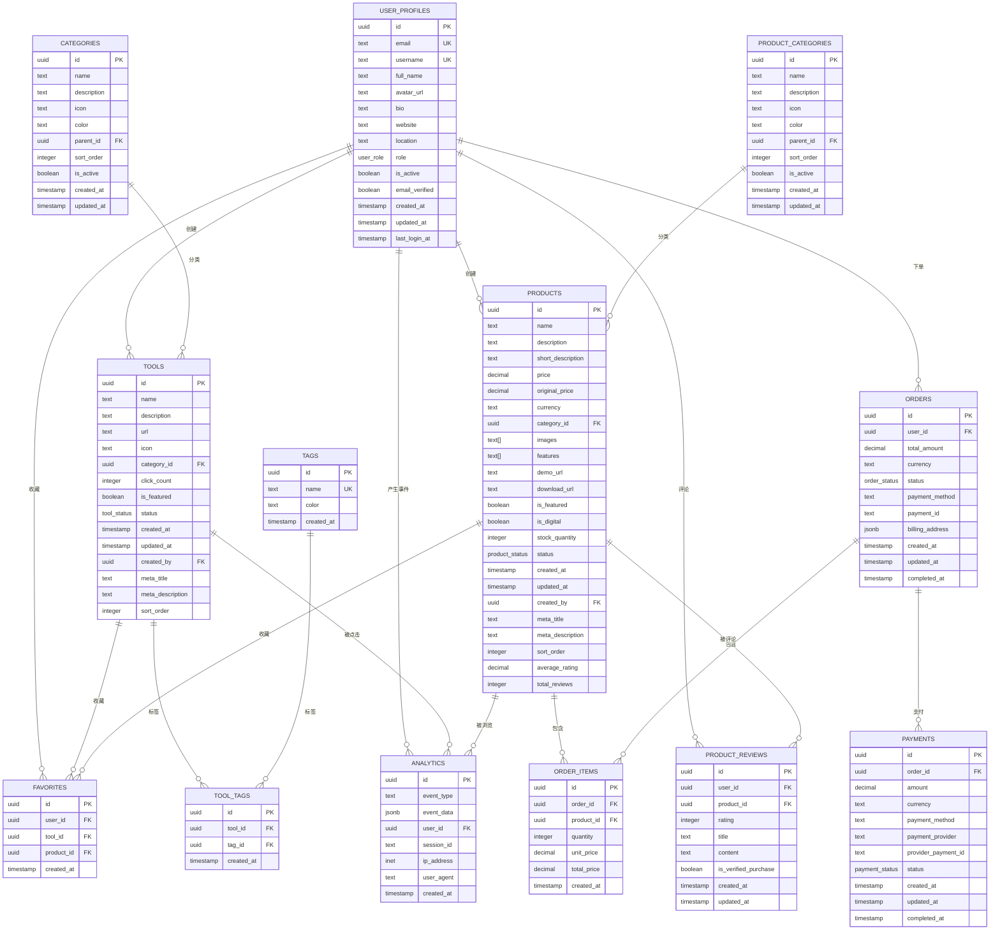

现在我已经收集了足够的信息来生成关于数据库Schema设计的详细文档。让我开始编写文档：

<docs>
# 数据库Schema设计

<cite>
**本文档引用的文件**
- [20241224000001_initial_schema.sql](file://supabase/migrations/20241224000001_initial_schema.sql)
- [20241224000004_seed_data.sql](file://supabase/migrations/20241224000004_seed_data.sql)
- [supabase-schema.ts](file://src/lib/supabase-schema.ts)
- [database.ts](file://src/types/database.ts)
- [databaseService.ts](file://src/services/databaseService.ts)
- [toolsService.ts](file://src/services/toolsService.ts)
- [productsService.ts](file://src/services/productsService.ts)
- [index.ts](file://src/types/index.ts)
- [package.json](file://package.json)
</cite>

## 目录
1. [简介](#简介)
2. [项目架构概览](#项目架构概览)
3. [核心数据库表结构](#核心数据库表结构)
4. [实体关系图](#实体关系图)
5. [数据模型详细分析](#数据模型详细分析)
6. [业务规则映射](#业务规则映射)
7. [查询性能优化](#查询性能优化)
8. [数据访问模式](#数据访问模式)
9. [总结](#总结)

## 简介

本文档基于先进的工具导航站项目，全面分析了其数据库Schema设计。该项目采用Supabase作为后端服务，使用PostgreSQL作为数据库引擎，通过TypeScript类型定义确保了强类型的数据访问层。数据库设计遵循现代Web应用的最佳实践，支持工具和产品的双重分类体系，实现了完整的用户交互功能。

## 项目架构概览


**图表来源**
- [databaseService.ts](file://src/services/databaseService.ts#L1-L50)
- [toolsService.ts](file://src/services/toolsService.ts#L1-L50)
- [productsService.ts](file://src/services/productsService.ts#L1-L50)

## 核心数据库表结构

### 用户资料表 (user_profiles)

用户资料表是整个系统的核心，继承自Supabase的auth.users表，提供了丰富的用户信息管理功能。

```sql
CREATE TABLE IF NOT EXISTS user_profiles (
    id UUID REFERENCES auth.users(id) ON DELETE CASCADE PRIMARY KEY,
    email TEXT UNIQUE NOT NULL,
    username TEXT UNIQUE,
    full_name TEXT,
    avatar_url TEXT,
    bio TEXT,
    website TEXT,
    location TEXT,
    role user_role DEFAULT 'user',
    is_active BOOLEAN DEFAULT true,
    email_verified BOOLEAN DEFAULT false,
    created_at TIMESTAMP WITH TIME ZONE DEFAULT NOW(),
    updated_at TIMESTAMP WITH TIME ZONE DEFAULT NOW(),
    last_login_at TIMESTAMP WITH TIME ZONE
);
```

**字段说明：**
- `id`: 主键，引用Supabase认证系统的用户ID
- `email`: 唯一邮箱地址，用于用户登录和验证
- `username`: 唯一用户名，用于显示和链接
- `role`: 用户角色枚举，支持用户、管理员和超级管理员
- `is_active`: 用户账户激活状态
- `email_verified`: 邮箱验证状态
- `created_at/updated_at`: 时间戳字段，自动维护

### 工具表 (tools)

工具表专门用于存储各种开发和实用工具的信息，支持复杂的分类和标签系统。

```sql
CREATE TABLE IF NOT EXISTS tools (
    id UUID DEFAULT uuid_generate_v4() PRIMARY KEY,
    name TEXT NOT NULL,
    description TEXT NOT NULL,
    url TEXT NOT NULL,
    icon TEXT,
    category_id UUID REFERENCES categories(id) ON DELETE SET NULL,
    click_count INTEGER DEFAULT 0,
    is_featured BOOLEAN DEFAULT false,
    status tool_status DEFAULT 'active',
    created_at TIMESTAMP WITH TIME ZONE DEFAULT NOW(),
    updated_at TIMESTAMP WITH TIME ZONE DEFAULT NOW(),
    created_by UUID REFERENCES user_profiles(id) ON DELETE SET NULL,
    meta_title TEXT,
    meta_description TEXT,
    sort_order INTEGER DEFAULT 0
);
```

**字段说明：**
- `click_count`: 工具点击计数器，支持实时统计
- `is_featured`: 特色工具标记，用于首页展示
- `status`: 工具状态控制，支持草稿、活跃和停用
- `sort_order`: 排序权重，用于自定义排序

### 产品表 (products)

产品表用于管理数字产品和软件产品的销售信息，支持价格管理、库存控制和多维度分类。

```sql
CREATE TABLE IF NOT EXISTS products (
    id UUID DEFAULT uuid_generate_v4() PRIMARY KEY,
    name TEXT NOT NULL,
    description TEXT NOT NULL,
    short_description TEXT,
    price DECIMAL(10,2) NOT NULL,
    original_price DECIMAL(10,2),
    currency TEXT DEFAULT 'CNY',
    category_id UUID REFERENCES product_categories(id) ON DELETE SET NULL,
    images TEXT[] DEFAULT '{}',
    features TEXT[] DEFAULT '{}',
    demo_url TEXT,
    download_url TEXT,
    is_featured BOOLEAN DEFAULT false,
    is_digital BOOLEAN DEFAULT true,
    stock_quantity INTEGER,
    status product_status DEFAULT 'active',
    created_at TIMESTAMP WITH TIME ZONE DEFAULT NOW(),
    updated_at TIMESTAMP WITH TIME ZONE DEFAULT NOW(),
    created_by UUID REFERENCES user_profiles(id) ON DELETE SET NULL,
    meta_title TEXT,
    meta_description TEXT,
    sort_order INTEGER DEFAULT 0,
    average_rating DECIMAL(3,2) DEFAULT 0,
    total_reviews INTEGER DEFAULT 0
);
```

**字段说明：**
- `price/original_price`: 价格字段，支持原价和折扣价
- `currency`: 货币类型，默认人民币
- `is_digital`: 数字产品标识
- `stock_quantity`: 库存数量，支持物理产品
- `average_rating/total_reviews`: 评分统计字段

### 订单表 (orders)

订单表管理用户的购买行为，支持多种支付方式和订单状态跟踪。

```sql
CREATE TABLE IF NOT EXISTS orders (
    id UUID DEFAULT uuid_generate_v4() PRIMARY KEY,
    user_id UUID REFERENCES user_profiles(id) ON DELETE SET NULL,
    total_amount DECIMAL(10,2) NOT NULL,
    currency TEXT DEFAULT 'CNY',
    status order_status DEFAULT 'pending',
    payment_method TEXT,
    payment_id TEXT,
    billing_address JSONB,
    created_at TIMESTAMP WITH TIME ZONE DEFAULT NOW(),
    updated_at TIMESTAMP WITH TIME ZONE DEFAULT NOW(),
    completed_at TIMESTAMP WITH TIME ZONE
);
```

**字段说明：**
- `billing_address`: JSONB格式的账单地址，支持灵活的地址结构
- `status`: 订单状态枚举，支持待支付、已支付、已取消、已退款
- `completed_at`: 完成时间戳，用于订单生命周期管理

### 收藏表 (favorites)

收藏表实现了一对多的关系，允许用户收藏工具或产品，但不能同时收藏两者。

```sql
CREATE TABLE IF NOT EXISTS favorites (
    id UUID DEFAULT uuid_generate_v4() PRIMARY KEY,
    user_id UUID REFERENCES user_profiles(id) ON DELETE CASCADE,
    tool_id UUID REFERENCES tools(id) ON DELETE CASCADE,
    product_id UUID REFERENCES products(id) ON DELETE CASCADE,
    created_at TIMESTAMP WITH TIME ZONE DEFAULT NOW(),
    CONSTRAINT favorites_check CHECK (
        (tool_id IS NOT NULL AND product_id IS NULL) OR
        (tool_id IS NULL AND product_id IS NOT NULL)
    ),
    UNIQUE(user_id, tool_id),
    UNIQUE(user_id, product_id)
);
```

**约束说明：**
- `favorites_check`: 确保每个收藏只能关联工具或产品之一
- `UNIQUE(user_id, tool_id)`: 用户不能重复收藏同一个工具
- `UNIQUE(user_id, product_id)`: 用户不能重复收藏同一个产品

**章节来源**
- [20241224000001_initial_schema.sql](file://supabase/migrations/20241224000001_initial_schema.sql#L1-L287)
- [20241224000004_seed_data.sql](file://supabase/migrations/20241224000004_seed_data.sql#L1-L105)

## 实体关系图



**图表来源**
- [20241224000001_initial_schema.sql](file://supabase/migrations/20241224000001_initial_schema.sql#L1-L287)
- [supabase-schema.ts](file://src/lib/supabase-schema.ts#L1-L304)

## 数据模型详细分析

### 枚举类型设计

系统使用PostgreSQL枚举类型来确保数据的一致性和完整性：

```sql
-- 用户角色枚举
CREATE TYPE user_role AS ENUM ('user', 'admin', 'super_admin');

-- 工具状态枚举
CREATE TYPE tool_status AS ENUM ('active', 'inactive', 'draft');

-- 产品状态枚举
CREATE TYPE product_status AS ENUM ('active', 'inactive', 'draft');

-- 订单状态枚举
CREATE TYPE order_status AS ENUM ('pending', 'paid', 'cancelled', 'refunded');

-- 支付状态枚举
CREATE TYPE payment_status AS ENUM ('pending', 'completed', 'failed', 'cancelled');
```

**设计优势：**
- 类型安全：编译时检查无效值
- 数据一致性：确保字段值在预定义范围内
- 文档化：枚举名称直观表达业务含义
- 性能优化：枚举比字符串更节省存储空间

### 分类系统设计

系统实现了双分类体系，分别服务于工具和产品：


**图表来源**
- [20241224000001_initial_schema.sql](file://supabase/migrations/20241224000001_initial_schema.sql#L15-L45)

### 索引策略

数据库采用了全面的索引策略来优化查询性能：

```sql
-- 用户资料索引
CREATE INDEX idx_user_profiles_email ON user_profiles(email);
CREATE INDEX idx_user_profiles_username ON user_profiles(username);
CREATE INDEX idx_user_profiles_role ON user_profiles(role);

-- 工具索引
CREATE INDEX idx_tools_category_id ON tools(category_id);
CREATE INDEX idx_tools_status ON tools(status);
CREATE INDEX idx_tools_is_featured ON tools(is_featured);
CREATE INDEX idx_tools_click_count ON tools(click_count);
CREATE INDEX idx_tools_created_at ON tools(created_at);

-- 产品索引
CREATE INDEX idx_products_category_id ON products(category_id);
CREATE INDEX idx_products_status ON products(status);
CREATE INDEX idx_products_is_featured ON products(is_featured);
CREATE INDEX idx_products_price ON products(price);
CREATE INDEX idx_products_created_at ON products(created_at);

-- 订单索引
CREATE INDEX idx_orders_user_id ON orders(user_id);
CREATE INDEX idx_orders_status ON orders(status);
CREATE INDEX idx_orders_created_at ON orders(created_at);
```

**索引策略说明：**
- **选择性索引**：针对高选择性的字段建立索引
- **复合索引**：考虑查询条件的组合频率
- **覆盖索引**：减少索引扫描的I/O开销
- **分区索引**：对于大表考虑分区策略

### 触发器机制

系统实现了自动更新时间戳的功能：

```sql
CREATE OR REPLACE FUNCTION update_updated_at_column()
RETURNS TRIGGER AS $$
BEGIN
    NEW.updated_at = NOW();
    RETURN NEW;
END;
$$ language 'plpgsql';

-- 为需要的表添加更新时间触发器
CREATE TRIGGER update_user_profiles_updated_at 
BEFORE UPDATE ON user_profiles 
FOR EACH ROW EXECUTE FUNCTION update_updated_at_column();
```

**触发器优势：**
- **自动化**：无需手动设置更新时间
- **一致性**：确保所有记录的时间戳一致
- **透明性**：对应用程序完全透明

**章节来源**
- [20241224000001_initial_schema.sql](file://supabase/migrations/20241224000001_initial_schema.sql#L250-L287)

## 业务规则映射

### 数据完整性约束

系统通过多种约束确保数据的完整性和业务逻辑的正确性：


**图表来源**
- [20241224000001_initial_schema.sql](file://supabase/migrations/20241224000001_initial_schema.sql#L100-L150)

### 业务流程映射

#### 工具管理流程


**图表来源**
- [toolsService.ts](file://src/services/toolsService.ts#L50-L100)
- [databaseService.ts](file://src/services/databaseService.ts#L20-L80)

#### 订单处理流程


**图表来源**
- [productsService.ts](file://src/services/productsService.ts#L100-L150)
- [databaseService.ts](file://src/services/databaseService.ts#L100-L150)

### 权限控制机制

系统通过Supabase的行级安全(RLS)策略实现细粒度的权限控制：

```sql
-- 示例RLS策略（概念性）
CREATE POLICY "用户只能查看自己的收藏"
ON favorites
USING (user_id = auth.uid());
```

**权限控制原则：**
- **最小权限**：用户只能访问自己的数据
- **数据隔离**：不同用户的数据完全隔离
- **动态策略**：根据用户角色动态调整权限
- **审计追踪**：记录所有权限变更操作

**章节来源**
- [20241224000001_initial_schema.sql](file://supabase/migrations/20241224000001_initial_schema.sql#L100-L200)
- [toolsService.ts](file://src/services/toolsService.ts#L200-L300)

## 查询性能优化

### 缓存策略

系统实现了多层次的缓存策略来提升查询性能：


**图表来源**
- [databaseService.ts](file://src/services/databaseService.ts#L200-L300)

### 查询优化技术

#### 1. 索引优化

```sql
-- 复合索引示例
CREATE INDEX idx_tools_search ON tools(name, description, category_id, status);

-- 覆盖索引
CREATE INDEX idx_products_summary ON products(id, name, price, category_id, status, is_featured);

-- 位运算索引（用于布尔字段）
CREATE INDEX idx_tools_boolean ON tools(status, is_featured, is_active);
```

#### 2. 查询重写

```sql
-- 优化前：多次查询
SELECT * FROM tools WHERE category_id = ? AND status = 'active';
SELECT COUNT(*) FROM tools WHERE category_id = ? AND status = 'active';

-- 优化后：单次查询
SELECT *, COUNT(*) OVER() as total_count 
FROM tools 
WHERE category_id = ? AND status = 'active'
LIMIT ? OFFSET ?;
```

#### 3. 连接优化

```sql
-- 使用EXISTS替代IN
SELECT * FROM tools t
WHERE EXISTS (
    SELECT 1 FROM categories c 
    WHERE c.id = t.category_id AND c.is_active = true
);

-- 使用JOIN LATERAL优化复杂查询
SELECT t.*, c.name as category_name
FROM tools t
JOIN LATERAL (
    SELECT name FROM categories WHERE id = t.category_id
) c ON true;
```

### 分区策略

对于大表，建议实施分区策略：

```sql
-- 按时间分区
CREATE TABLE orders_2024 PARTITION OF orders
FOR VALUES FROM ('2024-01-01') TO ('2025-01-01');

CREATE TABLE orders_2025 PARTITION OF orders
FOR VALUES FROM ('2025-01-01') TO ('2026-01-01');
```

### 批量操作优化


**图表来源**
- [databaseService.ts](file://src/services/databaseService.ts#L150-L200)

**章节来源**
- [databaseService.ts](file://src/services/databaseService.ts#L1-L404)
- [toolsService.ts](file://src/services/toolsService.ts#L400-L500)

## 数据访问模式

### 服务层架构

系统采用了分层的服务架构来封装数据访问逻辑：


**图表来源**
- [databaseService.ts](file://src/services/databaseService.ts#L1-L100)
- [toolsService.ts](file://src/services/toolsService.ts#L1-L100)
- [productsService.ts](file://src/services/productsService.ts#L1-L100)

### 实时数据同步

系统支持实时数据同步，通过Supabase的Realtime功能实现实时更新：

```typescript
// 实时订阅示例
const channel = databaseService.subscribeToTable(
  TABLES.TOOLS,
  (payload) => {
    console.log('工具数据更新:', payload);
    // 更新本地缓存
    updateLocalCache(payload);
  },
  'status=eq.active'
);
```

### 错误处理策略

```mermaid
flowchart TD
    APICall[API调用] --> TryCatch[Try-Catch包装]
    TryCatch --> Success{成功?}
    Success -->|是| TransformData[转换数据]
    Success -->|否| ErrorHandler[错误处理器]
    
    ErrorHandler --> ErrorType{错误类型}
    ErrorType -->|网络错误| NetworkRetry[网络重试]
    ErrorType -->|数据库错误| DatabaseRetry[数据库重试]
    ErrorType -->|业务错误| BusinessLogic[业务逻辑处理]
    ErrorType -->|超时错误| TimeoutFallback[超时降级]
    
    NetworkRetry --> RetryCount{重试次数}
    RetryCount -->|未超限| APICall
    RetryCount -->|超限| FallbackData[降级数据]
    
    DatabaseRetry --> RetryCount2{重试次数}
    RetryCount2 -->|未超限| APICall
    RetryCount2 -->|超限| FallbackData
    
    BusinessLogic --> LogError[记录错误日志]
    TimeoutFallback --> LogError
    LogError --> ReturnError