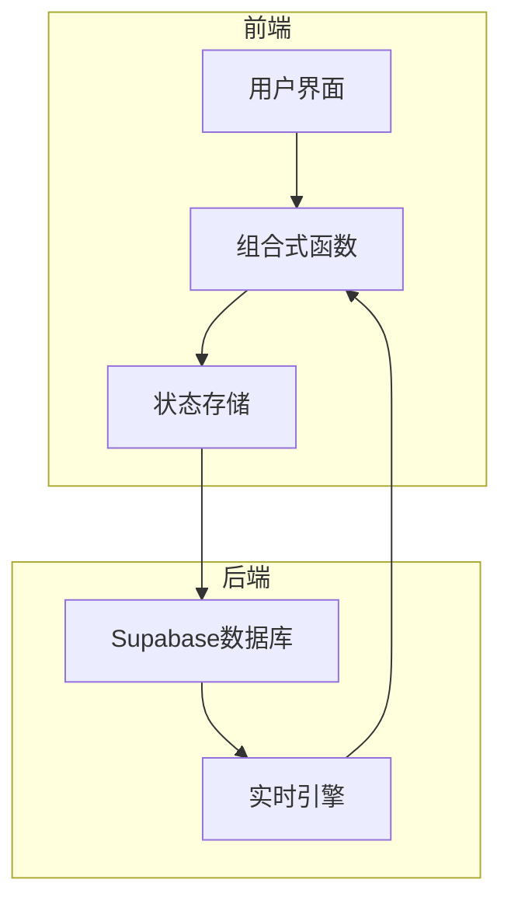
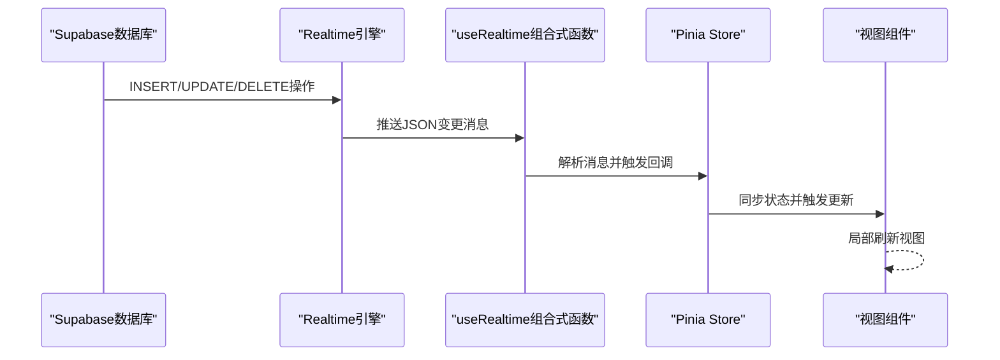
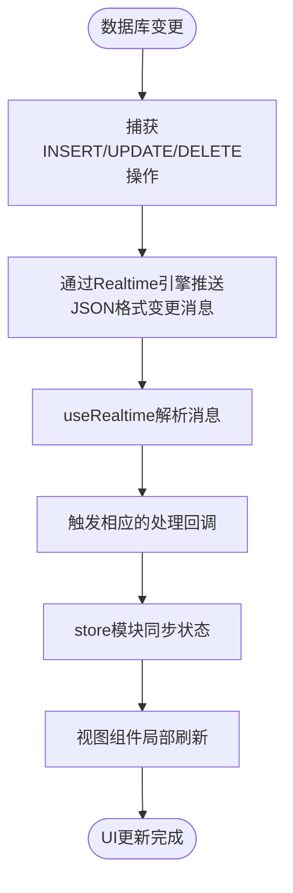
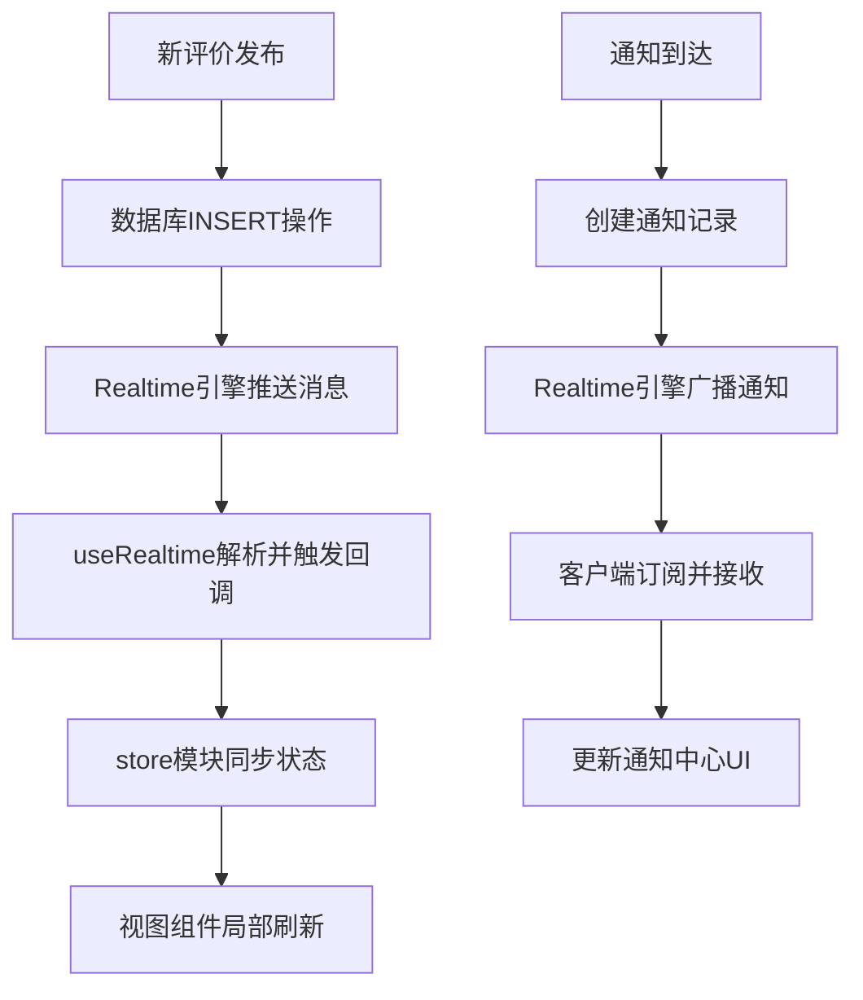
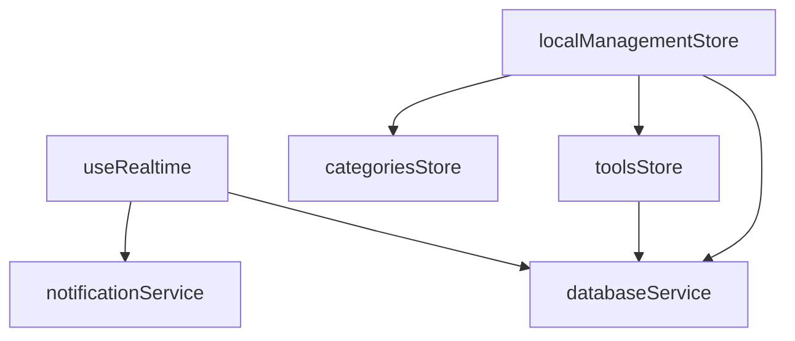

# 事件处理流程

<cite>
**本文档引用的文件**
- [useRealtime.ts](file://src/composables/useRealtime.ts)
- [databaseService.ts](file://src/services/databaseService.ts)
- [notificationService.ts](file://src/services/notificationService.ts)
- [tools.ts](file://src/stores/tools.ts)
- [localManagement.ts](file://src/stores/localManagement.ts)
- [ReviewItem.vue](file://src/components/reviews/ReviewItem.vue)
</cite>

## 目录
1. [简介](#简介)
2. [核心组件](#核心组件)
3. [架构概览](#架构概览)
4. [详细组件分析](#详细组件分析)
5. [依赖分析](#依赖分析)
6. [性能考虑](#性能考虑)
7. [故障排除指南](#故障排除指南)
8. [结论](#结论)

## 简介
本文档详细描述了从数据库变更到UI更新的完整事件流。当Supabase捕获INSERT/UPDATE/DELETE操作时，如何通过Realtime引擎推送JSON格式变更消息；useRealtime组合式函数如何解析这些消息并触发相应的处理回调；store模块（如tools、notificationService）如何接收更新通知并同步状态；最终视图组件如何响应Pinia store变化实现局部刷新。以“新评价发布”和“通知到达”两个典型场景为例，展示事件分发、数据合并和响应式更新的全过程，并说明防抖、批量更新等性能优化措施。

## 核心组件

[深入分析核心组件及其代码片段和解释]

**组件来源**
- [useRealtime.ts](file://src/composables/useRealtime.ts#L14-L106)
- [databaseService.ts](file://src/services/databaseService.ts#L27-L399)
- [notificationService.ts](file://src/services/notificationService.ts#L60-L508)

## 架构概览

[系统架构的全面可视化和说明]



**图表来源**
- [useRealtime.ts](file://src/composables/useRealtime.ts#L14-L106)
- [databaseService.ts](file://src/services/databaseService.ts#L27-L399)

## 详细组件分析

[对每个关键组件进行彻底分析，包括图表、代码片段路径和解释]

### 组件A分析
[包含特定文件分析的组件分析内容]

#### 对于面向对象的组件：
```mermaid
classDiagram
class useRealtime {
+isConnected : boolean
+error : string | null
+lastEvent : any
+subscribe() : void
+unsubscribe() : void
+resubscribe() : void
}
class databaseService {
+query(table : string, options : QueryOptions) : Promise<QueryResult>
+create(table : string, data : Partial<T>) : Promise<T>
+update(table : string, id : string, data : Partial<T>) : Promise<T>
+delete(table : string, id : string) : Promise<void>
+subscribeToTable(table : string, callback : (payload : any) => void, filter? : string) : RealtimeChannel
+unsubscribe(channel : RealtimeChannel | string) : void
}
class notificationService {
+getUserNotifications(userId : string, options : {}) : Promise<{ notifications : Notification[]; total : number; stats : NotificationStats }>
+createNotification(notificationData : CreateNotificationData) : Promise<Notification | null>
+sendRealTimeNotification(notification : Notification) : void
+subscribeToNotifications(userId : string, callback : (notification : Notification) => void) : () => void
}
useRealtime --> databaseService : "使用"
useRealtime --> notificationService : "使用"
```

**图表来源**
- [useRealtime.ts](file://src/composables/useRealtime.ts#L14-L106)
- [databaseService.ts](file://src/services/databaseService.ts#L27-L399)
- [notificationService.ts](file://src/services/notificationService.ts#L60-L508)

#### 对于API/服务组件：


**图表来源**
- [useRealtime.ts](file://src/composables/useRealtime.ts#L14-L106)
- [databaseService.ts](file://src/services/databaseService.ts#L27-L399)
- [tools.ts](file://src/stores/tools.ts#L16-L340)

#### 对于复杂逻辑组件：


**图表来源**
- [useRealtime.ts](file://src/composables/useRealtime.ts#L14-L106)
- [databaseService.ts](file://src/services/databaseService.ts#L27-L399)
- [localManagement.ts](file://src/stores/localManagement.ts#L18-L348)

**组件来源**
- [useRealtime.ts](file://src/composables/useRealtime.ts#L14-L106)
- [databaseService.ts](file://src/services/databaseService.ts#L27-L399)
- [notificationService.ts](file://src/services/notificationService.ts#L60-L508)

### 概念概述
[不分析特定文件的一般概念内容]



[由于此图表显示的是概念工作流，而不是实际的代码结构，因此不需要来源]

[由于此部分不分析特定的源文件，因此不需要来源]

## 依赖分析

[使用可视化分析组件之间的依赖关系]



**图表来源**
- [useRealtime.ts](file://src/composables/useRealtime.ts#L14-L106)
- [databaseService.ts](file://src/services/databaseService.ts#L27-L399)
- [tools.ts](file://src/stores/tools.ts#L16-L340)
- [localManagement.ts](file://src/stores/localManagement.ts#L18-L348)

**组件来源**
- [useRealtime.ts](file://src/composables/useRealtime.ts#L14-L106)
- [databaseService.ts](file://src/services/databaseService.ts#L27-L399)
- [tools.ts](file://src/stores/tools.ts#L16-L340)
- [localManagement.ts](file://src/stores/localManagement.ts#L18-L348)

## 性能考虑

[不分析特定文件的一般性能讨论]
[由于此部分提供一般指导，因此不需要来源]

## 故障排除指南

[分析错误处理代码和调试工具]

**组件来源**
- [useRealtime.ts](file://src/composables/useRealtime.ts#L14-L106)
- [databaseService.ts](file://src/services/databaseService.ts#L27-L399)
- [notificationService.ts](file://src/services/notificationService.ts#L60-L508)

## 结论

[发现的总结和建议]
[由于此部分总结而不分析特定文件，因此不需要来源]