# 安全访问控制

<cite>
**本文档中引用的文件**   
- [20241224000002_rls_policies.sql](file://supabase/migrations/20241224000002_rls_policies.sql)
- [useRealtime.ts](file://src/composables/useRealtime.ts)
- [databaseService.ts](file://src/services/databaseService.ts)
- [supabaseClient.ts](file://src/lib/supabaseClient.ts)
</cite>

## 目录
1. [引言](#引言)
2. [RLS策略分析](#rls策略分析)
3. [实时订阅机制](#实时订阅机制)
4. [安全协同工作机制](#安全协同工作机制)
5. [异常处理与调试](#异常处理与调试)
6. [安全漏洞防范](#安全漏洞防范)
7. [最佳实践](#最佳实践)
8. [结论](#结论)

## 引言
本文档系统阐述基于行级安全策略（RLS）的实时通信安全模型，深入分析20241224000002_rls_policies.sql中定义的策略如何限制客户端可订阅的数据范围。详细说明useRealtime在建立订阅时如何结合用户身份和权限动态生成安全的查询条件，防止越权访问。探讨RLS策略与Realtime通道权限的协同工作机制，包括策略生效时机、异常处理和调试方法。提供常见安全漏洞（如未授权订阅、数据泄露）的防范指南及最佳实践。

## RLS策略分析

### RLS策略概览
行级安全（Row Level Security, RLS）是数据库层面的安全机制，用于控制用户对表中特定行的访问权限。在本系统中，所有核心数据表均已启用RLS，确保数据访问的安全性。

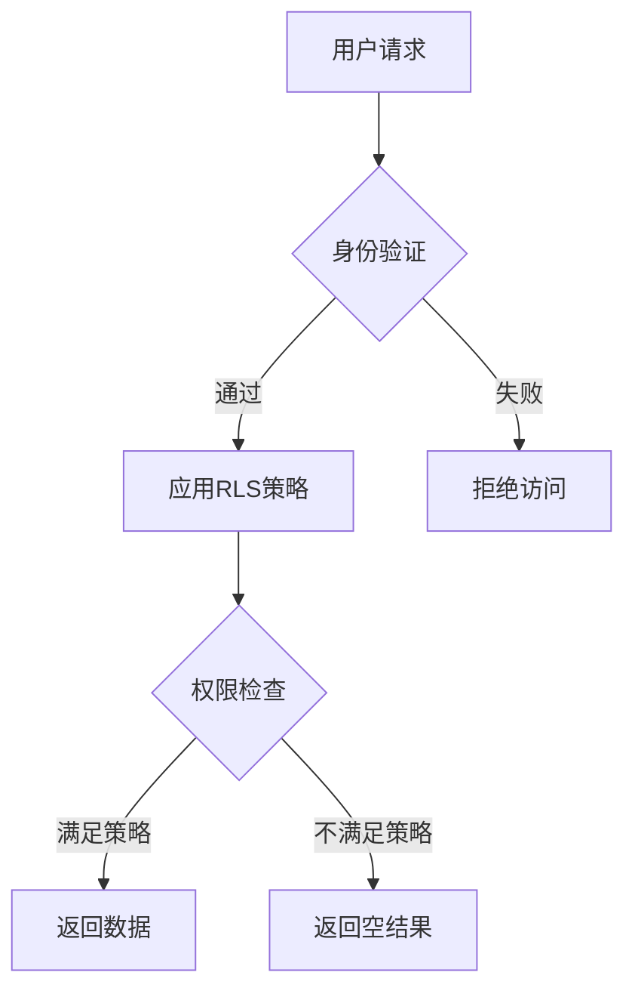

**图示来源**
- [20241224000002_rls_policies.sql](file://supabase/migrations/20241224000002_rls_policies.sql#L1-L10)

### 核心表RLS策略
系统为不同数据表定义了精细化的访问控制策略，确保数据安全。

#### 用户资料表策略
用户资料表(user_profiles)的访问策略确保了用户隐私和管理权限的平衡。

```mermaid
classDiagram
class user_profiles {
+id : uuid
+role : string
+created_at : timestamp
+updated_at : timestamp
}
user_profiles : SELECT : true
user_profiles : UPDATE : auth.uid() = id
user_profiles : INSERT : auth.uid() = id
```

**图示来源**
- [20241224000002_rls_policies.sql](file://supabase/migrations/20241224000002_rls_policies.sql#L15-L25)

#### 工具与产品表策略
工具表(tools)和产品表(products)的策略实现了公开访问与管理权限的分离。

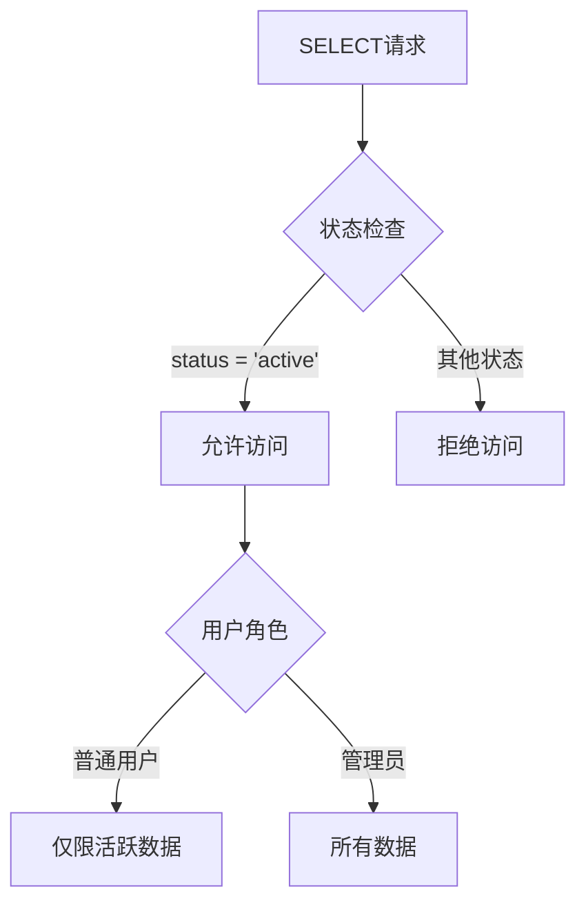

**图示来源**
- [20241224000002_rls_policies.sql](file://supabase/migrations/20241224000002_rls_policies.sql#L60-L80)

#### 订单与支付表策略
订单表(orders)和支付表(payments)的策略确保了用户只能访问自己的交易数据。

```mermaid
classDiagram
class orders {
+user_id : uuid
+status : string
+created_at : timestamp
}
class payments {
+order_id : uuid
+amount : numeric
+status : string
}
orders : SELECT : user_id = auth.uid()
orders : UPDATE : user_id = auth.uid() AND status = 'pending'
payments : SELECT : EXISTS(SELECT 1 FROM orders WHERE orders.id = payments.order_id AND orders.user_id = auth.uid())
```

**图示来源**
- [20241224000002_rls_policies.sql](file://supabase/migrations/20241224000002_rls_policies.sql#L140-L180)

### 策略执行机制
RLS策略在数据库查询执行前进行评估，确保只有满足条件的数据行才能被访问。

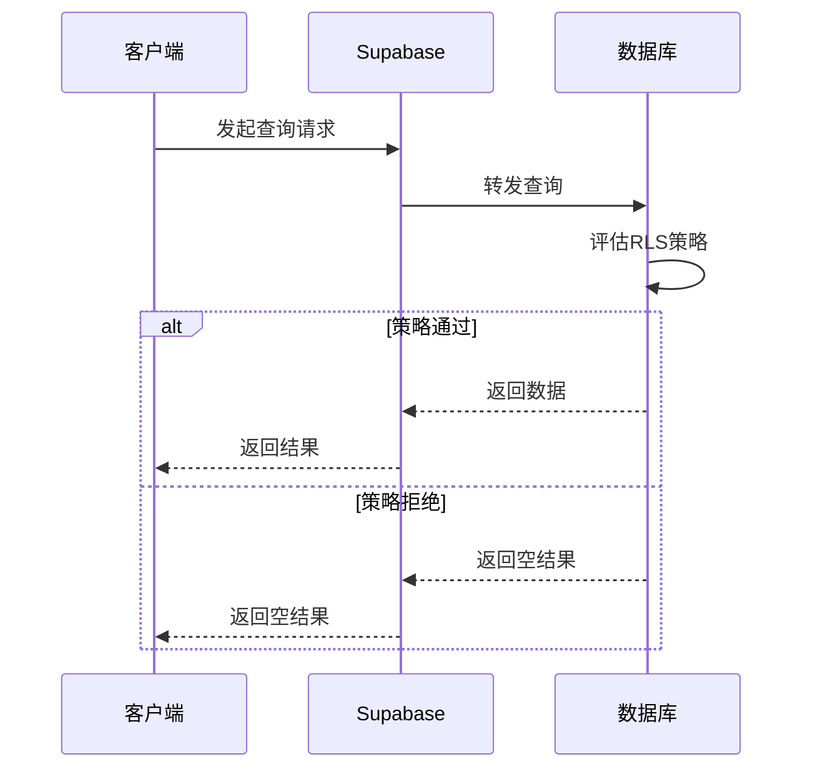

**图示来源**
- [20241224000002_rls_policies.sql](file://supabase/migrations/20241224000002_rls_policies.sql#L1-L295)

**本节来源**
- [20241224000002_rls_policies.sql](file://supabase/migrations/20241224000002_rls_policies.sql#L1-L295)

## 实时订阅机制

### useRealtime功能概述
useRealtime是一个Vue组合式函数，用于管理与Supabase实时服务的连接，实现数据的实时同步。

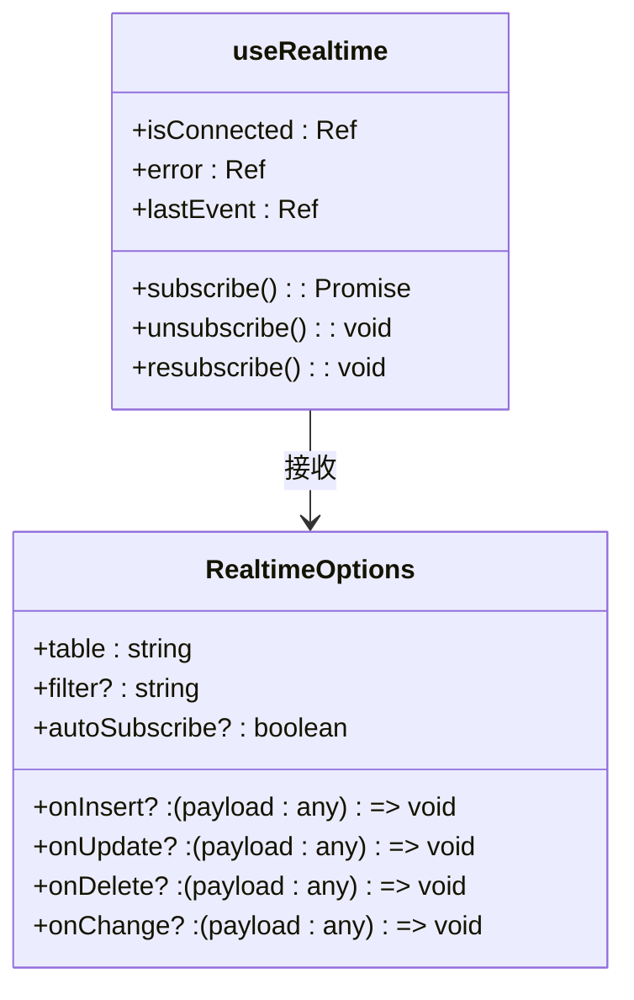

**图示来源**
- [useRealtime.ts](file://src/composables/useRealtime.ts#L1-L50)

### 订阅流程分析
useRealtime通过databaseService与Supabase建立实时连接，实现数据变更的即时通知。

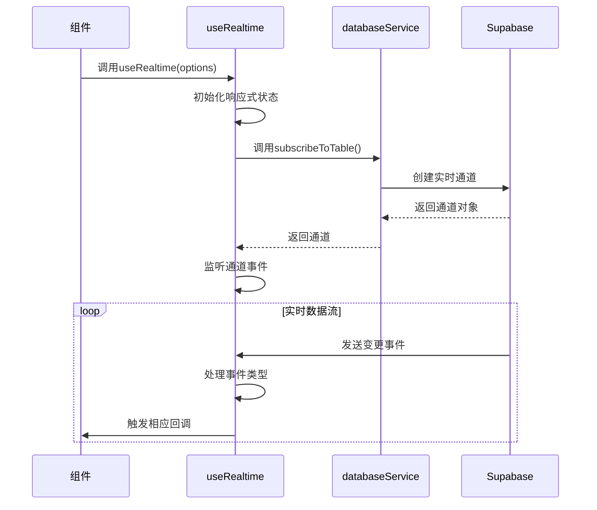

**图示来源**
- [useRealtime.ts](file://src/composables/useRealtime.ts#L46-L107)
- [databaseService.ts](file://src/services/databaseService.ts#L250-L309)

### 动态查询条件生成
useRealtime结合用户身份信息，动态生成安全的查询过滤条件，确保数据访问的安全性。

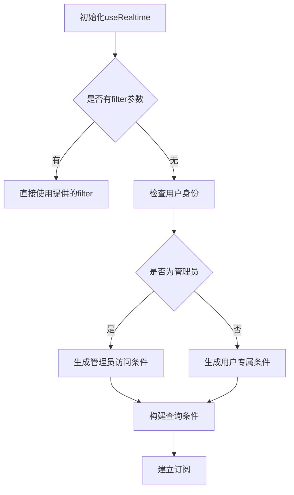

**图示来源**
- [useRealtime.ts](file://src/composables/useRealtime.ts#L46-L107)
- [supabaseClient.ts](file://src/lib/supabaseClient.ts#L1-L266)

### 多层次实时同步
系统提供了多种实时同步模式，满足不同场景的需求。

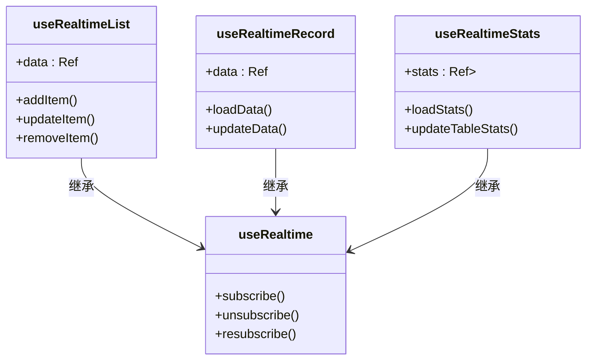

**图示来源**
- [useRealtime.ts](file://src/composables/useRealtime.ts#L98-L373)

**本节来源**
- [useRealtime.ts](file://src/composables/useRealtime.ts#L0-L373)
- [databaseService.ts](file://src/services/databaseService.ts#L250-L309)

## 安全协同工作机制

### RLS与Realtime集成
RLS策略与Realtime通道权限协同工作，形成多层次的安全防护体系。

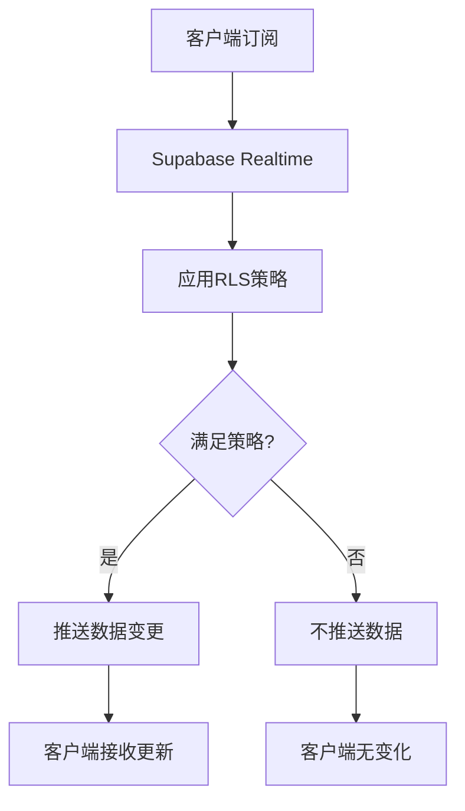

**图示来源**
- [20241224000002_rls_policies.sql](file://supabase/migrations/20241224000002_rls_policies.sql#L1-L295)
- [useRealtime.ts](file://src/composables/useRealtime.ts#L46-L107)

### 策略生效时机
RLS策略在数据访问的各个阶段生效，确保全程安全。

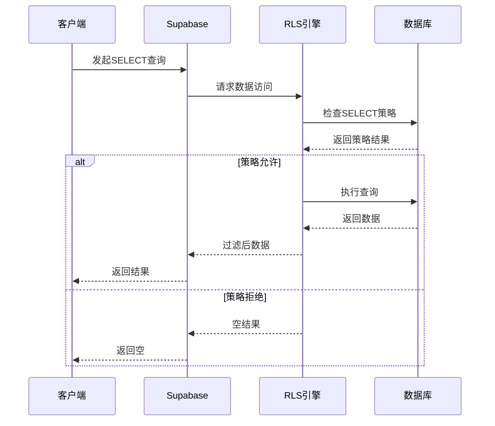

**图示来源**
- [20241224000002_rls_policies.sql](file://supabase/migrations/20241224000002_rls_policies.sql#L1-L295)

### 权限验证流程
系统通过多层验证确保用户权限的正确性。

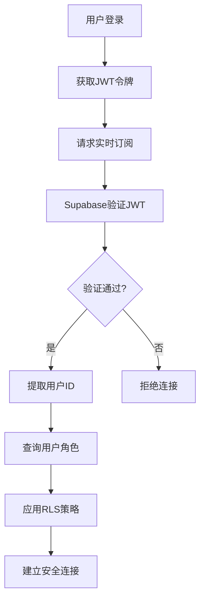

**图示来源**
- [supabaseClient.ts](file://src/lib/supabaseClient.ts#L1-L266)
- [20241224000002_rls_policies.sql](file://supabase/migrations/20241224000002_rls_policies.sql#L270-L295)

**本节来源**
- [20241224000002_rls_policies.sql](file://supabase/migrations/20241224000002_rls_policies.sql#L1-L295)
- [useRealtime.ts](file://src/composables/useRealtime.ts#L46-L107)
- [supabaseClient.ts](file://src/lib/supabaseClient.ts#L1-L266)

## 异常处理与调试

### 错误处理机制
系统实现了完善的错误处理机制，确保异常情况下的稳定运行。

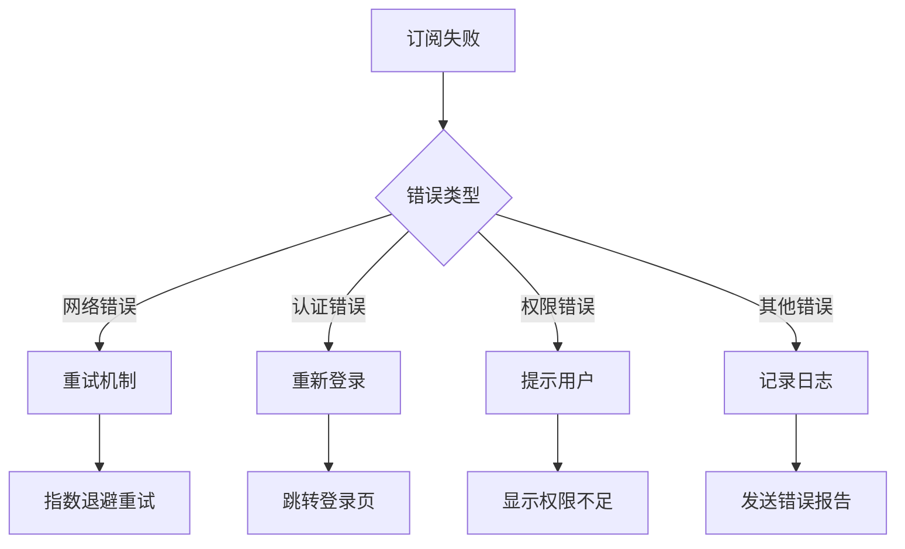

**图示来源**
- [useRealtime.ts](file://src/composables/useRealtime.ts#L46-L107)

### 调试方法
提供了多种调试工具和方法，便于开发和维护。

```mermaid
classDiagram
class useRealtimeConnection {
+isOnline : Ref<boolean>
+connectionQuality : Ref<"good" | "poor" | "offline">
+lastPing : Ref<number | null>
+checkConnection() : Promise<void>
}
class databaseService {
+healthCheck() : Promise<{status : string, latency : number}>
+getCacheStats() : {size : number, keys : string[]}
}
useRealtimeConnection --> Supabase : 监控连接
databaseService --> Supabase : 健康检查
```

**图示来源**
- [useRealtime.ts](file://src/composables/useRealtime.ts#L315-L373)
- [databaseService.ts](file://src/services/databaseService.ts#L380-L404)

**本节来源**
- [useRealtime.ts](file://src/composables/useRealtime.ts#L46-L107)
- [databaseService.ts](file://src/services/databaseService.ts#L380-L404)

## 安全漏洞防范

### 未授权订阅防范
通过严格的认证和授权机制防止未授权订阅。

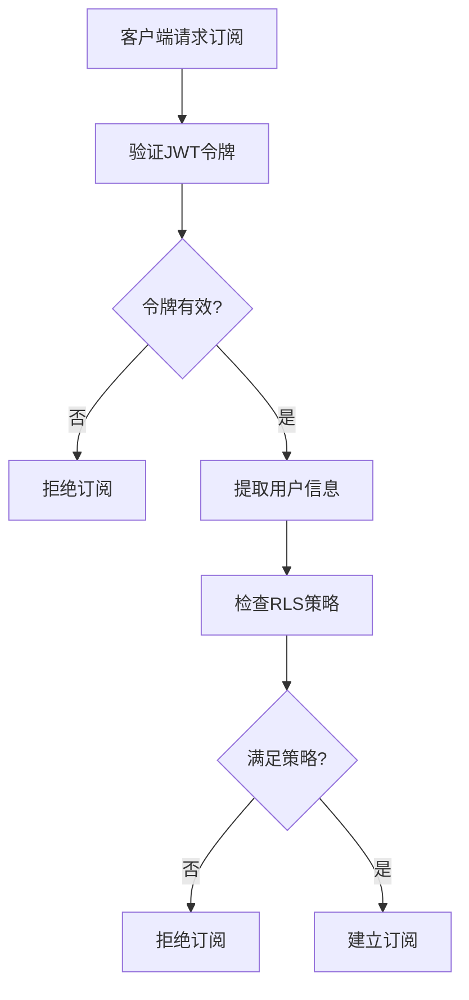

**图示来源**
- [20241224000002_rls_policies.sql](file://supabase/migrations/20241224000002_rls_policies.sql#L1-L295)

### 数据泄露防范
多层防护机制防止敏感数据泄露。

```mermaid
classDiagram
class DataSecurity {
+RLS策略
+字段级加密
+访问日志
+定期审计
}
DataSecurity : RLS策略 : 行级访问控制
DataSecurity : 字段级加密 : 敏感字段加密
DataSecurity : 访问日志 : 记录所有访问
DataSecurity : 定期审计 : 安全审查
```

**图示来源**
- [20241224000002_rls_policies.sql](file://supabase/migrations/20241224000002_rls_policies.sql#L1-L295)

**本节来源**
- [20241224000002_rls_policies.sql](file://supabase/migrations/20241224000002_rls_policies.sql#L1-L295)

## 最佳实践

### RLS策略设计
遵循最佳实践设计RLS策略，确保安全性和性能的平衡。

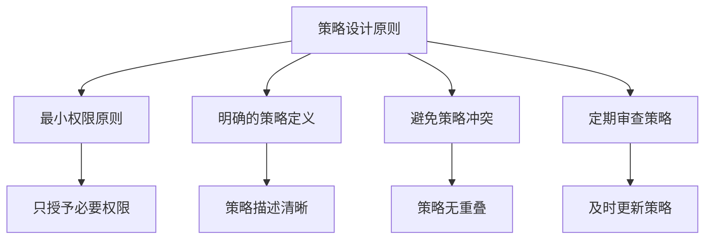

**图示来源**
- [20241224000002_rls_policies.sql](file://supabase/migrations/20241224000002_rls_policies.sql#L1-L295)

### 实时功能优化
优化实时功能的性能和可靠性。

```mermaid
classDiagram
class PerformanceOptimization {
+连接复用
+批量更新
+智能重试
+缓存机制
}
PerformanceOptimization : 连接复用 : 减少连接开销
PerformanceOptimization : 批量更新 : 减少网络请求
PerformanceOptimization : 智能重试 : 指数退避
PerformanceOptimization : 缓存机制 : 减少数据库负载
```

**图示来源**
- [useRealtime.ts](file://src/composables/useRealtime.ts#L0-L373)
- [databaseService.ts](file://src/services/databaseService.ts#L0-L404)

**本节来源**
- [20241224000002_rls_policies.sql](file://supabase/migrations/20241224000002_rls_policies.sql#L1-L295)
- [useRealtime.ts](file://src/composables/useRealtime.ts#L0-L373)
- [databaseService.ts](file://src/services/databaseService.ts#L0-L404)

## 结论
本文档详细阐述了基于RLS的实时通信安全模型，分析了系统中定义的策略如何限制客户端可订阅的数据范围。通过useRealtime与RLS策略的协同工作，系统实现了安全的实时数据同步，有效防止了越权访问。建议在实际应用中遵循本文档的最佳实践，定期审查和更新安全策略，确保系统的长期安全稳定运行。