# 实时订阅实现

<cite>
**本文档中引用的文件**
- [useRealtime.ts](file://src/composables/useRealtime.ts)
- [databaseService.ts](file://src/services/databaseService.ts)
- [supabaseClient.ts](file://src/lib/supabaseClient.ts)
</cite>

## 目录
1. [简介](#简介)
2. [核心组件分析](#核心组件分析)
3. [实时订阅机制](#实时订阅机制)
4. [通道配置与事件过滤](#通道配置与事件过滤)
5. [订阅生命周期管理](#订阅生命周期管理)
6. [权限控制与安全订阅](#权限控制与安全订阅)
7. [组件中使用方式](#组件中使用方式)
8. [连接池与重连策略](#连接池与重连策略)
9. [结论](#结论)

## 简介
本项目通过Supabase提供的实时功能，实现了对数据库变更的实时监听。系统主要围绕`useRealtime.ts`中的`setupRealtimeSubscription`函数（实际为`useRealtime`函数）构建，结合`databaseService.ts`中的服务层逻辑，实现了安全、高效的实时数据同步机制。该机制支持对tools、reviews等关键表的变更监听，并通过WebSocket连接提供低延迟的数据更新。

## 核心组件分析

### useRealtime 组合式函数
`useRealtime`函数是实时订阅的核心入口，提供了一套完整的实时数据监听解决方案。它封装了订阅、取消订阅、重新订阅等基本操作，并通过Vue的响应式系统管理连接状态和错误信息。

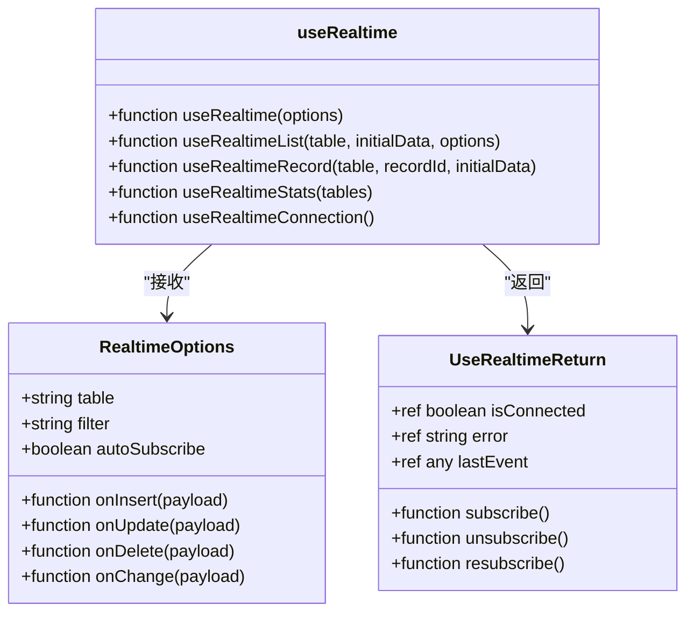

**图示来源**
- [useRealtime.ts](file://src/composables/useRealtime.ts#L1-L402)

**本节来源**
- [useRealtime.ts](file://src/composables/useRealtime.ts#L1-L402)

### databaseService 服务层
`databaseService`是数据库操作的统一入口，不仅提供CRUD操作，还负责实时订阅的底层管理。它维护了一个实时通道的映射表，确保通道的正确创建和销毁。

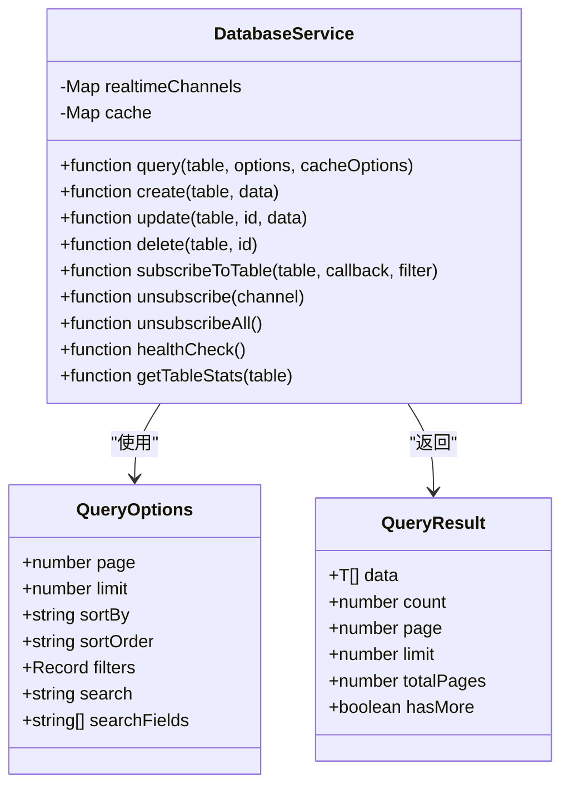

**图示来源**
- [databaseService.ts](file://src/services/databaseService.ts#L1-L404)

**本节来源**
- [databaseService.ts](file://src/services/databaseService.ts#L1-L404)

## 实时订阅机制

### WebSocket连接建立流程
系统通过Supabase客户端建立WebSocket连接，实现数据库变更的实时推送。连接建立流程如下：

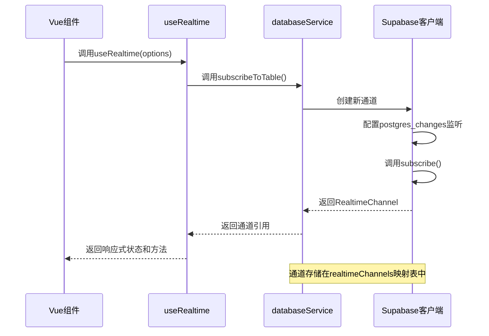

**图示来源**
- [useRealtime.ts](file://src/composables/useRealtime.ts#L46-L107)
- [databaseService.ts](file://src/services/databaseService.ts#L250-L309)

**本节来源**
- [useRealtime.ts](file://src/composables/useRealtime.ts#L46-L107)
- [databaseService.ts](file://src/services/databaseService.ts#L250-L309)

### 关键表订阅示例
系统支持对多个关键表进行实时订阅，包括tools和reviews表：

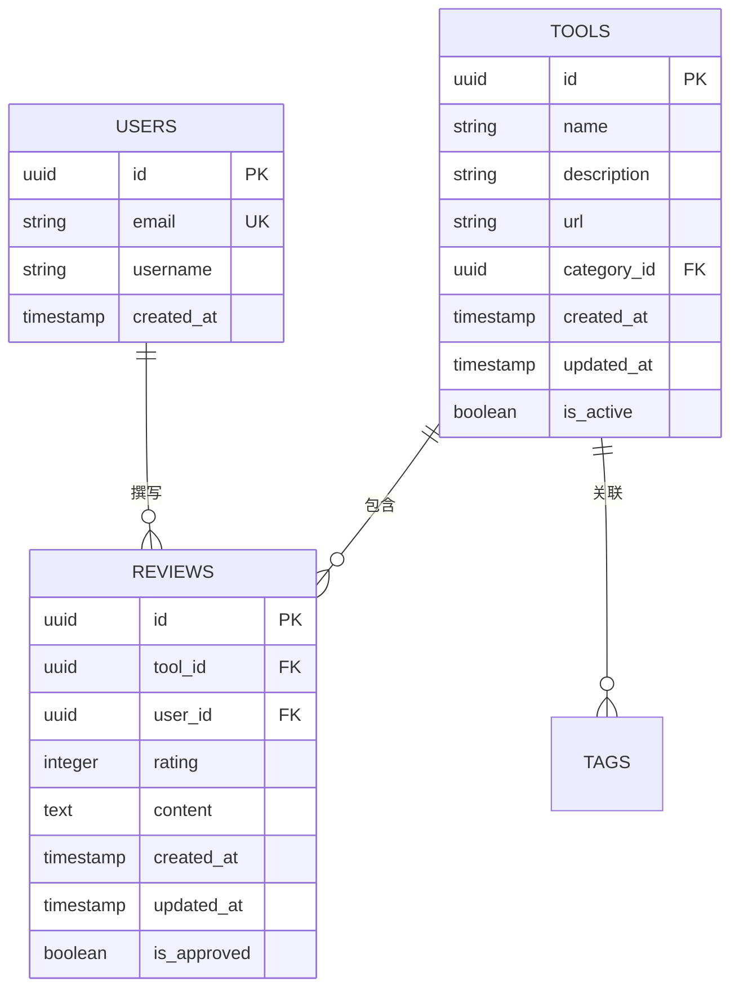

**图示来源**
- [supabaseClient.ts](file://src/lib/supabaseClient.ts#L38-L53)

## 通道配置与事件过滤

### 通道配置策略
系统采用动态通道命名策略，确保每个订阅都有唯一的标识：

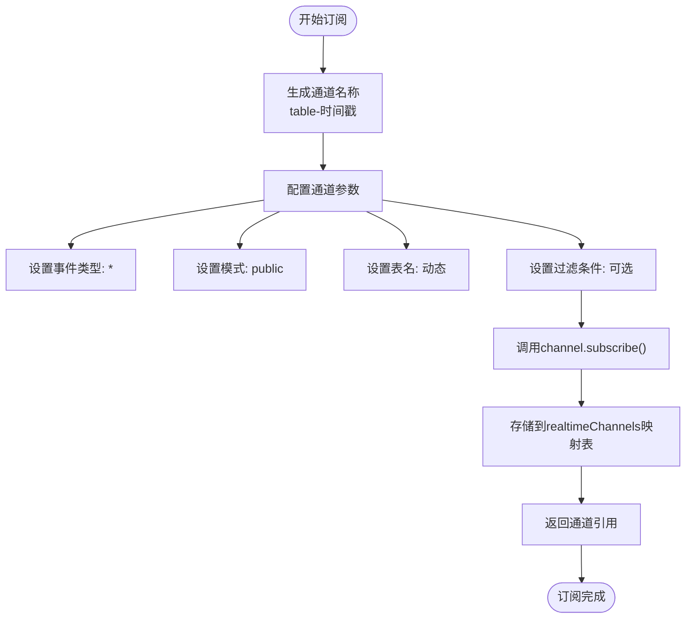

**图示来源**
- [databaseService.ts](file://src/services/databaseService.ts#L250-L285)

### 事件过滤规则
系统支持灵活的事件过滤机制，允许基于特定条件监听数据变更：

| 过滤类型 | 配置方式 | 示例 | 适用场景 |
|---------|---------|------|---------|
| 主键过滤 | `id=eq.${recordId}` | `id=eq.123` | 单条记录监听 |
| 字段相等 | `field=eq.value` | `status=eq.active` | 状态变更监听 |
| 模糊匹配 | `field=ilike.%value%` | `name=ilike.%tool%` | 名称搜索监听 |
| 范围过滤 | `field=gte.value` | `created_at=gte.2024-01-01` | 时间范围监听 |
| 多值过滤 | `field=in.(value1,value2)` | `status=in.(active,inactive)` | 多状态监听 |

**本节来源**
- [useRealtime.ts](file://src/composables/useRealtime.ts#L213-L274)
- [databaseService.ts](file://src/services/databaseService.ts#L250-L309)

## 订阅生命周期管理

### 初始化流程
订阅的初始化流程确保了连接的正确建立和状态管理：

```mermaid
flowchart TD
A([初始化]) --> B{autoSubscribe}
B --> |true| C[自动调用subscribe]
B --> |false| D[等待手动调用]
C --> E[调用databaseService.subscribeToTable]
E --> F[创建唯一通道名称]
F --> G[配置postgres_changes监听]
G --> H[设置事件回调函数]
H --> I[调用channel.subscribe()]
I --> J[存储通道引用]
J --> K[更新isConnected状态]
K --> L[返回API接口]
L --> M([初始化完成])
```

**图示来源**
- [useRealtime.ts](file://src/composables/useRealtime.ts#L98-L107)

### 监听与回调机制
系统实现了完整的事件监听和回调机制：

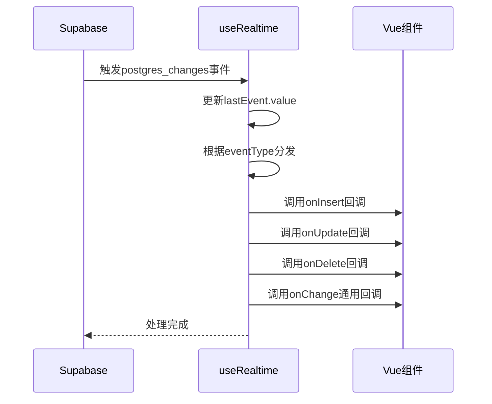

**图示来源**
- [useRealtime.ts](file://src/composables/useRealtime.ts#L60-L75)

### 取消订阅流程
系统实现了安全的取消订阅机制，防止内存泄漏：

```mermaid
flowchart TD
A([取消订阅]) --> B{channel存在?}
B --> |否| C[结束]
B --> |是| D[获取实际通道对象]
D --> E{有unsubscribe方法?}
E --> |是| F[调用actualChannel.unsubscribe()]
E --> |否| G[调用databaseService.unsubscribe()]
F --> H[清除channel引用]
G --> H
H --> I[更新isConnected状态]
I --> J[结束]
```

**图示来源**
- [useRealtime.ts](file://src/composables/useRealtime.ts#L109-L125)

**本节来源**
- [useRealtime.ts](file://src/composables/useRealtime.ts#L46-L159)

## 权限控制与安全订阅

### 动态权限检查
系统通过`databaseService`中的监听注册逻辑，根据用户权限动态创建安全的订阅通道：

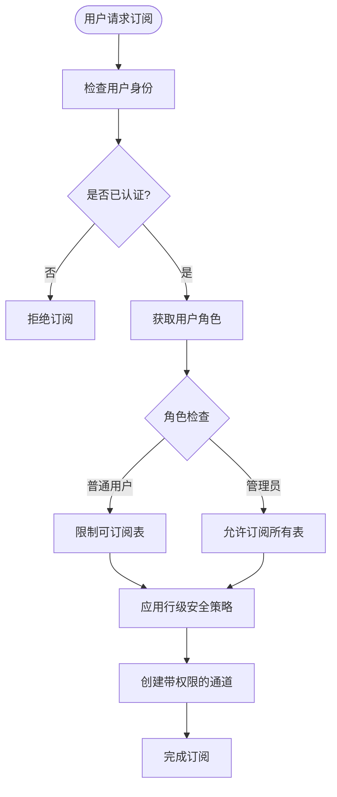

**本节来源**
- [supabaseClient.ts](file://src/lib/supabaseClient.ts#L150-L180)

### 行级安全策略
系统利用Supabase的行级安全（RLS）策略确保数据安全：

```sql
-- 示例：reviews表的RLS策略
CREATE POLICY "Users can view approved reviews"
ON reviews FOR SELECT
USING (is_approved = true);

CREATE POLICY "Users can manage their own reviews"
ON reviews FOR ALL
USING (auth.uid() = user_id);
```

**本节来源**
- [supabase/migrations/20241224000002_rls_policies.sql](file://supabase/migrations/20241224000002_rls_policies.sql)

## 组件中使用方式

### 基础使用示例
在Vue组件中使用`useRealtime`的典型方式：

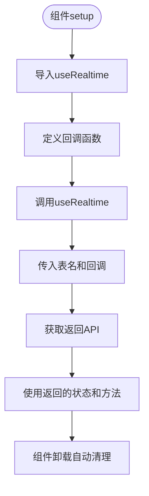

**本节来源**
- [useRealtime.ts](file://src/composables/useRealtime.ts#L98-L159)

### 高级使用模式
系统提供了多种高级使用模式来满足不同场景需求：

#### 数据列表实时同步
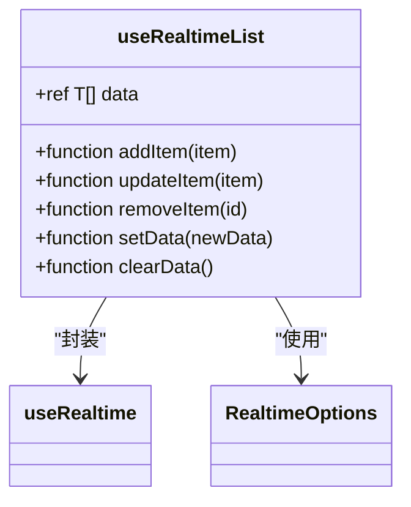

**图示来源**
- [useRealtime.ts](file://src/composables/useRealtime.ts#L152-L217)

#### 单条记录实时同步
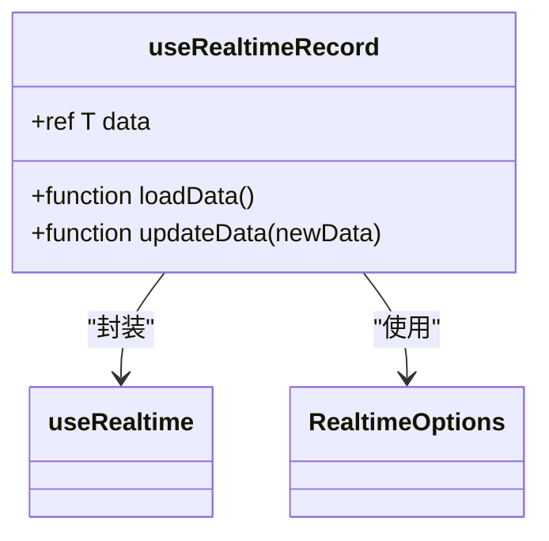

**图示来源**
- [useRealtime.ts](file://src/composables/useRealtime.ts#L213-L274)

#### 统计数据实时同步
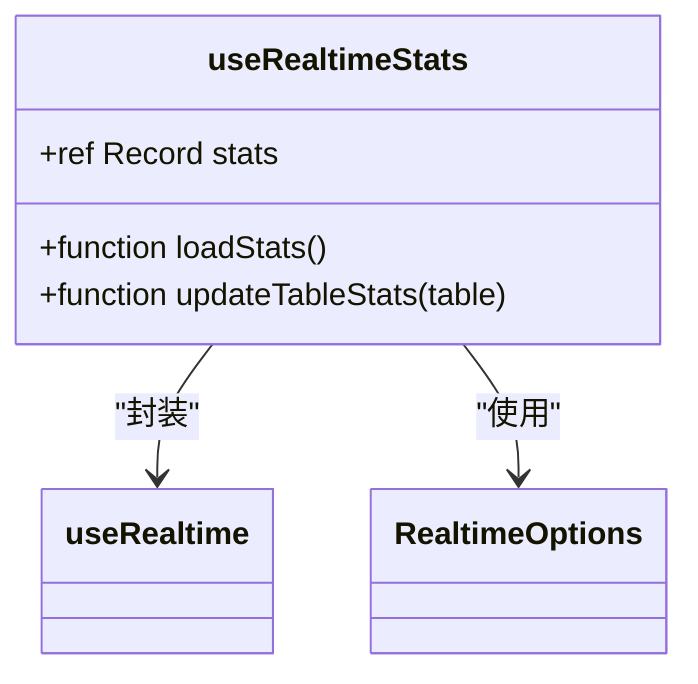

**图示来源**
- [useRealtime.ts](file://src/composables/useRealtime.ts#L315-L373)

## 连接池与重连策略

### 连接池管理
`databaseService`通过映射表管理所有实时通道：

```mermaid
classDiagram
class DatabaseService {
-Map<string, RealtimeChannel> realtimeChannels
+function subscribeToTable()
+function unsubscribe()
+function unsubscribeAll()
}
class Map {
+function set(key, value)
+function get(key)
+function delete(key)
+function clear()
}
DatabaseService --> Map : "使用"
note right of DatabaseService
通道名称格式 : table-时间戳
确保每个订阅都有唯一标识
end note
```

**本节来源**
- [databaseService.ts](file://src/services/databaseService.ts#L250-L309)

### 心跳机制
系统实现了连接质量监控机制：

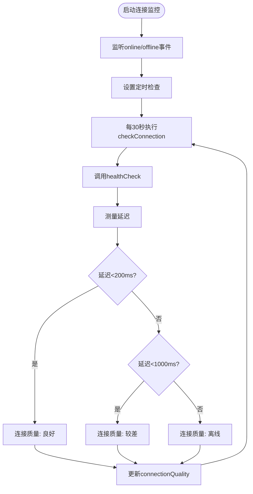

**图示来源**
- [useRealtime.ts](file://src/composables/useRealtime.ts#L315-L373)

### 自动重连策略
系统在组件卸载时自动清理订阅，防止内存泄漏：

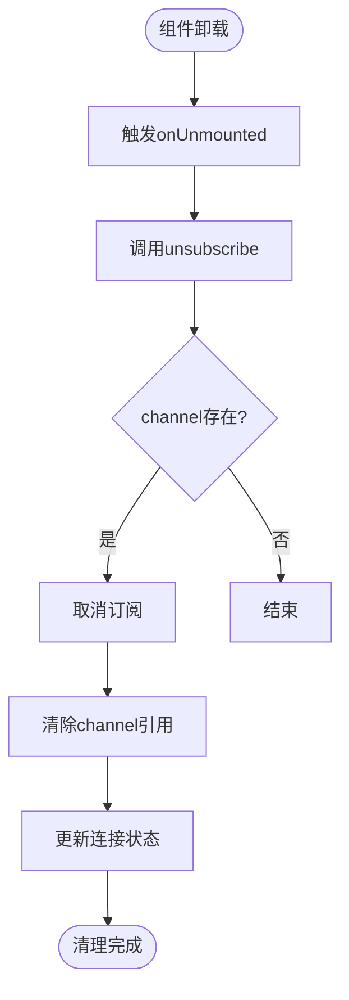

**本节来源**
- [useRealtime.ts](file://src/composables/useRealtime.ts#L148-L150)

## 结论
本系统的实时订阅实现通过`useRealtime`和`databaseService`的协同工作，构建了一套完整、安全、高效的实时数据同步机制。系统特点包括：

1. **分层架构**：清晰的职责分离，`useRealtime`负责Vue集成，`databaseService`负责底层管理
2. **安全控制**：结合行级安全策略和权限检查，确保数据访问安全
3. **资源管理**：完善的订阅生命周期管理，防止内存泄漏
4. **用户体验**：提供多种使用模式，满足不同场景需求
5. **稳定性**：内置连接监控和自动清理机制，确保系统稳定运行

该实现实现了对tools、reviews等关键表的实时监听，为应用提供了低延迟的数据更新能力，同时保证了系统的安全性和稳定性。