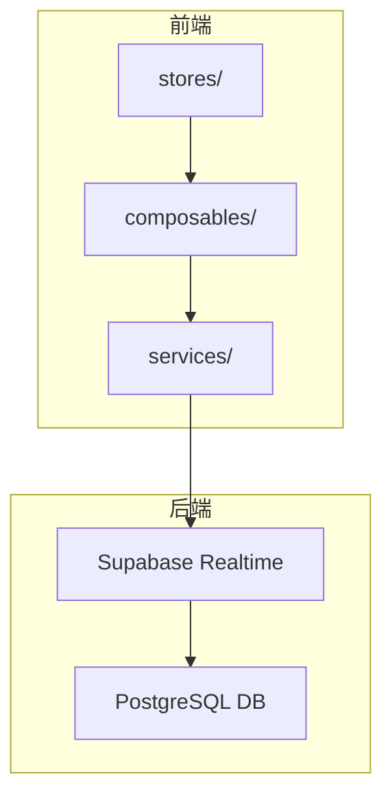
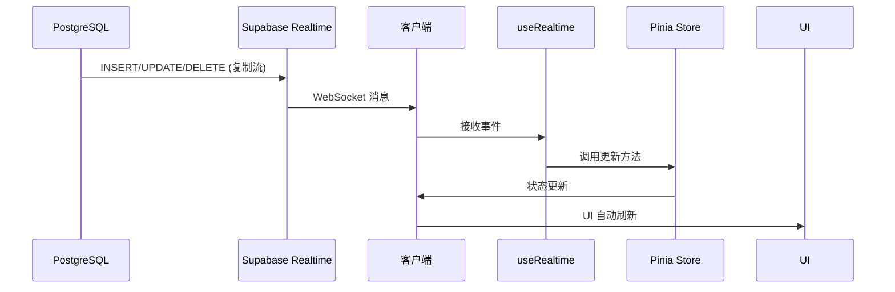
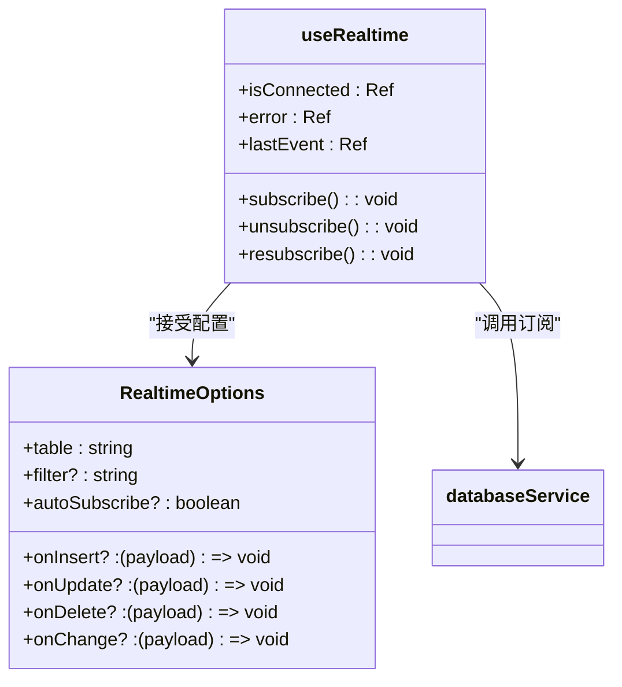
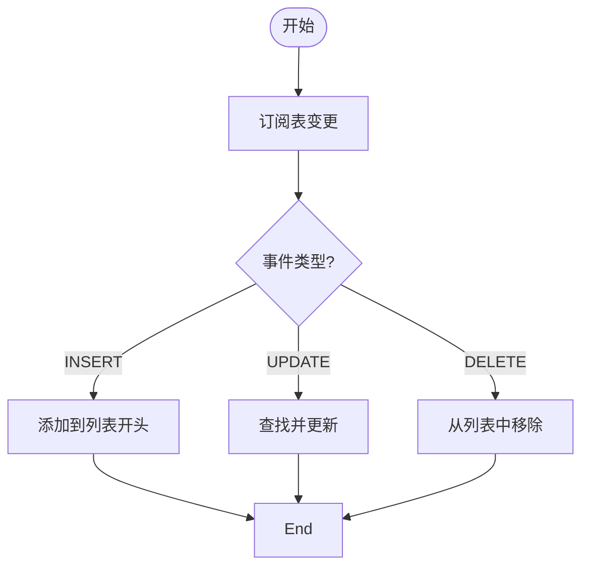
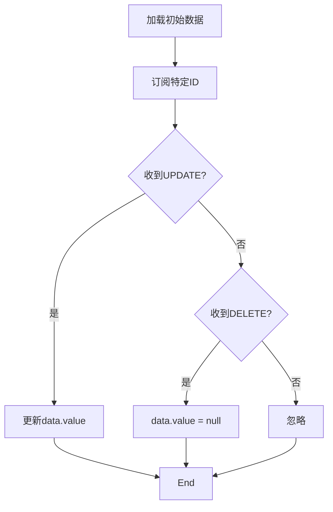
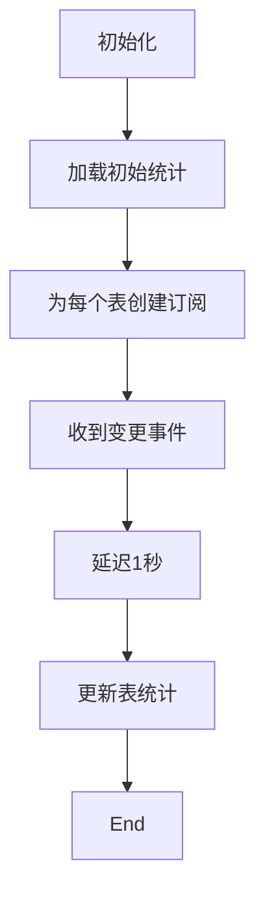
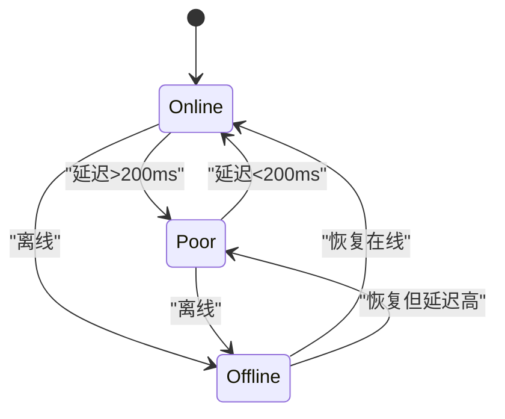
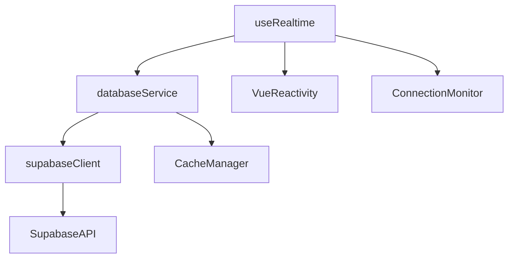

# 实时通信与事件驱动更新

<cite>
**本文档引用的文件**  
- [useRealtime.ts](file://src/composables/useRealtime.ts)
- [databaseService.ts](file://src/services/databaseService.ts)
- [supabaseClient.ts](file://src/lib/supabaseClient.ts)
</cite>

## 目录
1. [简介](#简介)
2. [项目结构](#项目结构)
3. [核心组件](#核心组件)
4. [架构概览](#架构概览)
5. [详细组件分析](#详细组件分析)
6. [依赖分析](#依赖分析)
7. [性能考虑](#性能考虑)
8. [故障排除指南](#故障排除指南)
9. [结论](#结论)

## 简介
本文档深入解析 `useRealtime.ts` 组合式函数如何利用 Supabase Realtime 功能实现客户端数据自动更新。重点说明其基于 PostgreSQL 复制协议和 WebSocket 连接的工作原理，描述如何订阅特定表（如 tools、reviews、notifications）的 INSERT、UPDATE、DELETE 变更事件。结合 `databaseService.ts` 中的监听器注册逻辑，展示从 `setupRealtimeSubscription()` 到接收变更消息并更新对应 Pinia store 的全过程。以“新评价发布后实时刷新评分”为例，说明服务端触发 Realtime 事件 → 客户端 `useRealtime` 捕获 → 调用 store 更新 → UI 自动刷新的流。涵盖权限控制（RLS 策略）对订阅的影响、连接状态管理、重连机制和性能优化建议。

## 项目结构
本项目采用典型的 Vue 3 + Vite 架构，结合 Supabase 提供后端服务。实时通信功能主要集中在 `src/composables` 和 `src/services` 目录下，通过组合式 API 实现响应式数据同步。

**图示来源**  
- [useRealtime.ts](file://src/composables/useRealtime.ts#L1-L403)
- [databaseService.ts](file://src/services/databaseService.ts#L1-L405)

**本节来源**  
- [useRealtime.ts](file://src/composables/useRealtime.ts#L1-L403)
- [databaseService.ts](file://src/services/databaseService.ts#L1-L405)

## 核心组件
`useRealtime` 是实现实时数据同步的核心组合式函数，提供三种主要使用方式：`useRealtime` 基础订阅、`useRealtimeList` 列表同步、`useRealtimeRecord` 单记录同步和 `useRealtimeStats` 统计数据同步。这些函数通过 `databaseService` 与 Supabase Realtime 服务建立 WebSocket 连接，监听数据库变更事件。

**本节来源**  
- [useRealtime.ts](file://src/composables/useRealtime.ts#L1-L403)
- [databaseService.ts](file://src/services/databaseService.ts#L1-L405)

## 架构概览
系统通过 Supabase 的 Realtime 服务，基于 PostgreSQL 的逻辑复制协议，将数据库变更以 WebSocket 消息的形式推送到客户端。客户端通过 `useRealtime` 组合式函数建立订阅，接收变更事件并更新本地状态。

**图示来源**  
- [useRealtime.ts](file://src/composables/useRealtime.ts#L46-L107)
- [databaseService.ts](file://src/services/databaseService.ts#L250-L280)

## 详细组件分析

### useRealtime 函数分析
`useRealtime` 函数是实时通信的基础，提供订阅、取消订阅和重新订阅功能。

**图示来源**  
- [useRealtime.ts](file://src/composables/useRealtime.ts#L9-L45)
- [databaseService.ts](file://src/services/databaseService.ts#L250-L280)

### useRealtimeList 函数分析
`useRealtimeList` 专门用于列表数据的实时同步，自动处理增删改操作。

**图示来源**  
- [useRealtime.ts](file://src/composables/useRealtime.ts#L98-L159)
- [useRealtime.ts](file://src/composables/useRealtime.ts#L152-L217)

### useRealtimeRecord 函数分析
`useRealtimeRecord` 用于单个记录的实时同步，支持按 ID 过滤。

**图示来源**  
- [useRealtime.ts](file://src/composables/useRealtime.ts#L213-L274)
- [databaseService.ts](file://src/services/databaseService.ts#L100-L120)

### useRealtimeStats 函数分析
`useRealtimeStats` 用于统计数据的实时同步，通过延迟更新避免频繁查询。

**图示来源**  
- [useRealtime.ts](file://src/composables/useRealtime.ts#L315-L373)
- [databaseService.ts](file://src/services/databaseService.ts#L350-L380)

### useRealtimeConnection 函数分析
`useRealtimeConnection` 管理连接状态，提供网络质量检测。

**图示来源**  
- [useRealtime.ts](file://src/composables/useRealtime.ts#L375-L402)
- [databaseService.ts](file://src/services/databaseService.ts#L300-L320)

**本节来源**  
- [useRealtime.ts](file://src/composables/useRealtime.ts#L1-L403)
- [databaseService.ts](file://src/services/databaseService.ts#L1-L405)

## 依赖分析
实时通信功能依赖于多个核心模块的协同工作。

**图示来源**  
- [useRealtime.ts](file://src/composables/useRealtime.ts#L2-L3)
- [databaseService.ts](file://src/services/databaseService.ts#L1-L2)
- [supabaseClient.ts](file://src/lib/supabaseClient.ts#L1-L10)

**本节来源**  
- [useRealtime.ts](file://src/composables/useRealtime.ts#L1-L403)
- [databaseService.ts](file://src/services/databaseService.ts#L1-L405)
- [supabaseClient.ts](file://src/lib/supabaseClient.ts#L1-L267)

## 性能考虑
实时通信功能在设计时考虑了多项性能优化：

1. **缓存机制**：`databaseService` 内置缓存，减少重复查询
2. **延迟更新**：统计数据显示延迟更新，避免频繁数据库查询
3. **连接复用**：多个订阅可能共享连接
4. **智能过滤**：支持按条件过滤，减少不必要的消息传输
5. **自动清理**：组件卸载时自动取消订阅，防止内存泄漏

**本节来源**  
- [databaseService.ts](file://src/services/databaseService.ts#L50-L90)
- [useRealtime.ts](file://src/composables/useRealtime.ts#L315-L373)
- [useRealtime.ts](file://src/composables/useRealtime.ts#L100-L110)

## 故障排除指南
### 常见问题及解决方案

| 问题现象 | 可能原因 | 解决方案 |
|---------|--------|--------|
| 无法建立连接 | 网络问题或 Supabase 配置错误 | 检查网络连接和环境变量 |
| 收不到更新 | RLS 策略限制 | 检查数据库 RLS 策略 |
| 频繁重连 | 网络不稳定 | 检查网络质量，优化重连策略 |
| 数据不一致 | 缓存问题 | 清除缓存或调整缓存策略 |

**本节来源**  
- [useRealtime.ts](file://src/composables/useRealtime.ts#L60-L70)
- [databaseService.ts](file://src/services/databaseService.ts#L260-L270)
- [supabaseClient.ts](file://src/lib/supabaseClient.ts#L10-L30)

## 结论
`useRealtime` 组合式函数通过巧妙地封装 Supabase Realtime 功能，为 Vue 3 应用提供了强大而灵活的实时数据同步能力。其设计充分考虑了实际应用场景，提供了多种使用模式，同时兼顾了性能和可靠性。通过与 `databaseService` 的紧密配合，实现了从数据库变更到 UI 更新的完整闭环，为构建实时交互式应用提供了坚实基础。