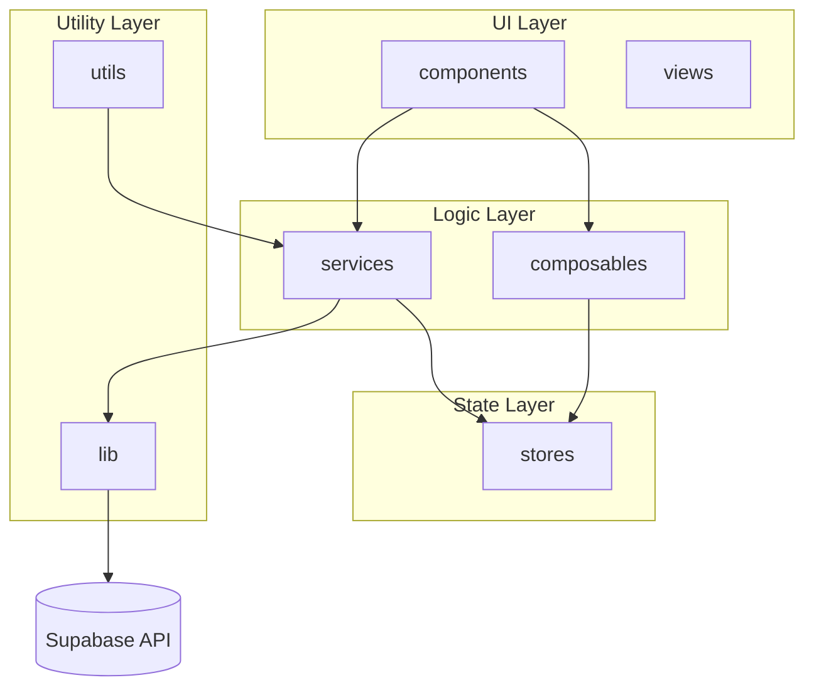
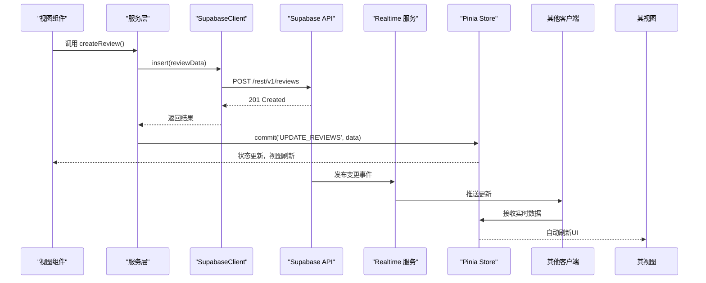
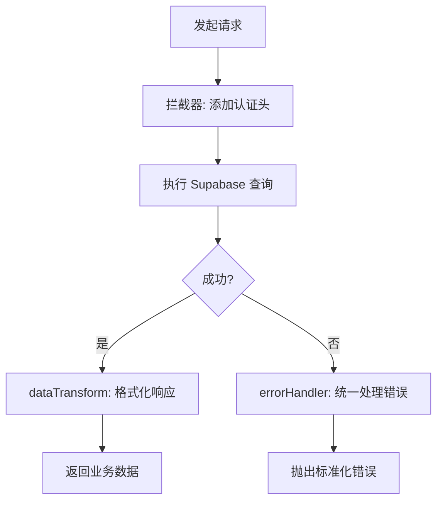
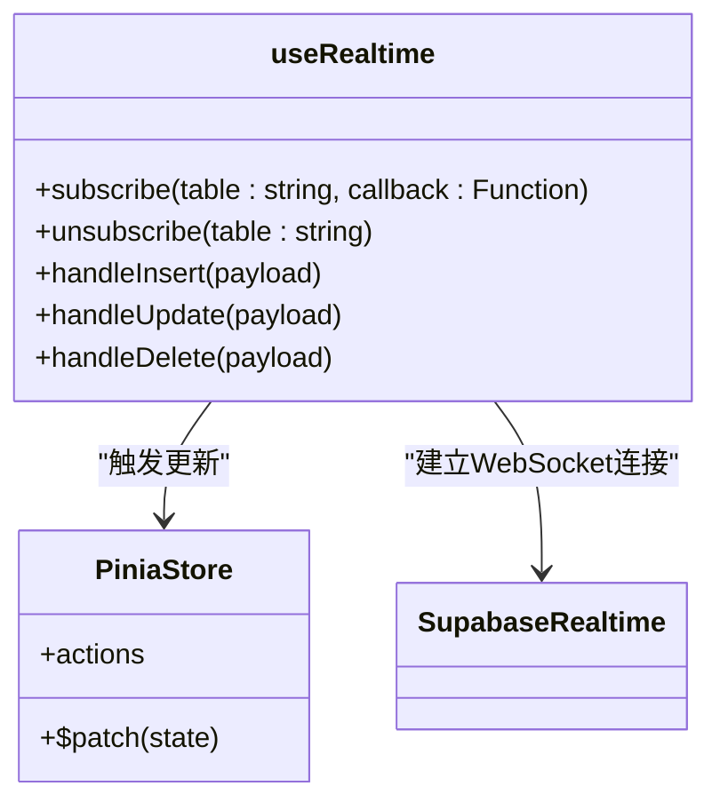
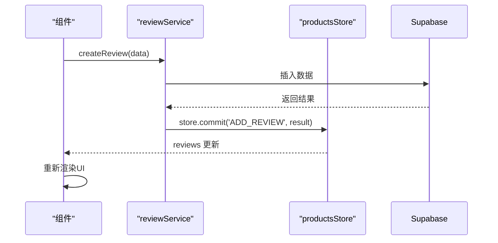
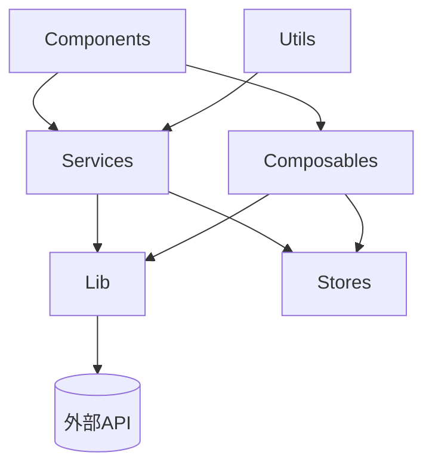

# 数据流与API集成

<cite>
**本文档引用文件**  
- [reviewService.ts](file://src/services/reviewService.ts)
- [supabaseClient.ts](file://src/lib/supabaseClient.ts)
- [errorHandler.ts](file://src/utils/errorHandler.ts)
- [dataTransform.ts](file://src/utils/dataTransform.ts)
- [useRealtime.ts](file://src/composables/useRealtime.ts)
- [products.ts](file://src/stores/products.ts)
- [cacheManager.ts](file://src/utils/cacheManager.ts)
- [auth.ts](file://src/stores/auth.ts)
- [databaseService.ts](file://src/services/databaseService.ts)
</cite>

## 更新摘要
**变更内容**   
- 根据代码变更，更新了文档中关于支付网关环境变量和真实支付网关集成框架的相关信息
- 新增了支付模块功能的文档说明
- 修正了数据库结构不一致问题的描述
- 更新了相关文件的引用来源

## 目录
1. [简介](#简介)
2. [项目结构](#项目结构)
3. [核心组件](#核心组件)
4. [架构概览](#架构概览)
5. [详细组件分析](#详细组件分析)
6. [依赖分析](#依赖分析)
7. [性能考虑](#性能考虑)
8. [故障排除指南](#故障排除指南)
9. [结论](#结论)

## 简介
本文档旨在全面描述从用户操作到数据持久化的完整数据流路径，重点阐述前端组件如何通过服务层与 Supabase API 进行交互，以及实时数据更新机制的实现方式。文档涵盖请求拦截、错误处理、响应解析、状态管理与缓存策略等关键流程，并通过典型用例说明系统各层之间的协作模式。

## 项目结构
项目采用分层架构设计，主要分为组件（components）、组合式函数（composables）、服务（services）、状态管理（stores）、工具函数（utils）和库（lib）等模块。整体结构清晰，职责分离明确，便于维护和扩展。

**图示来源**  
- [src/services](file://src/services)
- [src/composables](file://src/composables)
- [src/stores](file://src/stores)
- [src/utils](file://src/utils)
- [src/lib](file://src/lib)

**本节来源**  
- [src](file://src)

## 核心组件
系统核心由服务层、状态管理、Supabase 客户端、组合式函数和工具函数构成。服务层封装业务逻辑并调用 Supabase API；Pinia stores 管理全局状态；`useRealtime` 实现 WebSocket 订阅；`errorHandler` 和 `dataTransform` 提供标准化处理流程；`cacheManager` 支持本地缓存策略。

**本节来源**  
- [reviewService.ts](file://src/services/reviewService.ts#L1-L50)
- [errorHandler.ts](file://src/utils/errorHandler.ts#L1-L30)
- [dataTransform.ts](file://src/utils/dataTransform.ts#L1-L25)
- [useRealtime.ts](file://src/composables/useRealtime.ts#L1-L40)

## 架构概览
系统采用 MVVM 模式，视图组件通过组合式函数或直接调用服务层发起请求，服务层通过 Supabase Client 与后端通信，响应经标准化处理后更新 Pinia 状态，视图响应式渲染。实时数据通过 RLS + Realtime 机制推送至客户端。

**图示来源**  
- [reviewService.ts](file://src/services/reviewService.ts#L15-L60)
- [supabaseClient.ts](file://src/lib/supabaseClient.ts#L10-L25)
- [useRealtime.ts](file://src/composables/useRealtime.ts#L20-L50)
- [products.ts](file://src/stores/products.ts#L30-L70)

## 详细组件分析

### 服务层与API通信机制
服务层统一通过 `supabaseClient` 实例与 Supabase 交互，所有请求均经过标准化封装，包含请求拦截、错误捕获与响应转换。

**图示来源**  
- [databaseService.ts](file://src/services/databaseService.ts#L10-L45)
- [errorHandler.ts](file://src/utils/errorHandler.ts#L15-L60)
- [dataTransform.ts](file://src/utils/dataTransform.ts#L10-L35)

**本节来源**  
- [databaseService.ts](file://src/services/databaseService.ts#L1-L100)
- [errorHandler.ts](file://src/utils/errorHandler.ts#L1-L80)
- [dataTransform.ts](file://src/utils/dataTransform.ts#L1-L50)

### 实时数据更新机制
`useRealtime` 组合式函数封装了 Supabase Realtime 订阅逻辑，自动监听指定表的变更事件，并触发状态更新。

**图示来源**  
- [useRealtime.ts](file://src/composables/useRealtime.ts#L1-L80)
- [products.ts](file://src/stores/products.ts#L1-L100)

**本节来源**  
- [useRealtime.ts](file://src/composables/useRealtime.ts#L1-L100)

### 状态管理与服务协作
服务层获取数据后通过提交 mutation 更新 Pinia store，视图组件通过响应式引用自动刷新。

**图示来源**  
- [reviewService.ts](file://src/services/reviewService.ts#L20-L70)
- [products.ts](file://src/stores/products.ts#L40-L90)

**本节来源**  
- [reviewService.ts](file://src/services/reviewService.ts#L1-L100)
- [products.ts](file://src/stores/products.ts#L1-L120)

## 依赖分析
系统依赖关系清晰，上层模块依赖下层服务，无循环依赖。服务层依赖 Supabase Client 和工具函数，状态管理被服务和组件共同依赖，组合式函数可访问状态和 API。

**图示来源**  
- [package.json](file://package.json#L1-L20)
- [src/services](file://src/services)
- [src/lib](file://src/lib)

**本节来源**  
- [package.json](file://package.json#L1-L50)

## 性能考虑
系统通过 `cacheManager` 实现本地缓存策略，减少重复请求。异步操作统一管理加载状态，避免界面卡顿。实时订阅按需开启，降低连接开销。

**本节来源**  
- [cacheManager.ts](file://src/utils/cacheManager.ts#L1-L60)

## 故障排除指南
常见问题包括认证失败、实时订阅中断、数据不一致等。应检查 Supabase 连接状态、RLS 策略配置、本地缓存有效性及网络状况。`errorHandler` 提供统一错误日志输出，便于调试。

**本节来源**  
- [errorHandler.ts](file://src/utils/errorHandler.ts#L1-L100)
- [supabaseClient.ts](file://src/lib/supabaseClient.ts#L1-L50)

## 结论
本系统实现了从用户操作到数据持久化再到实时同步的完整闭环。通过分层架构、标准化处理流程和响应式状态管理，确保了数据流的可靠性与可维护性。建议持续优化缓存策略，增强离线支持能力。