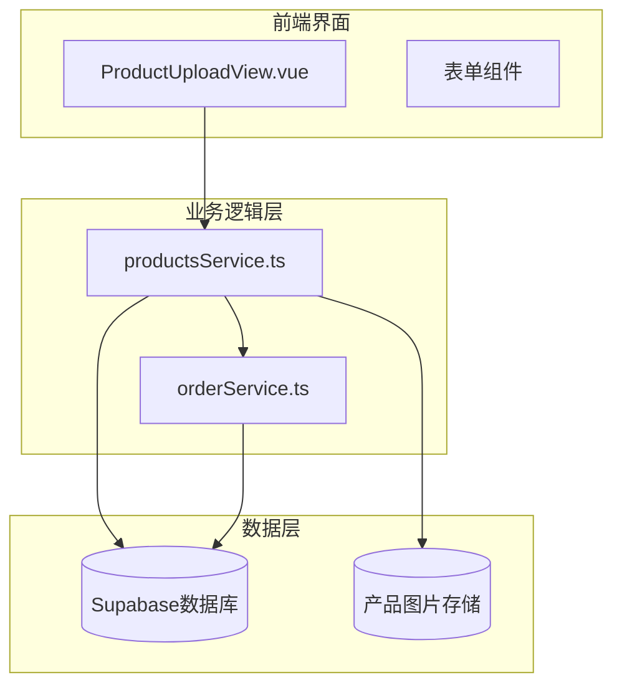
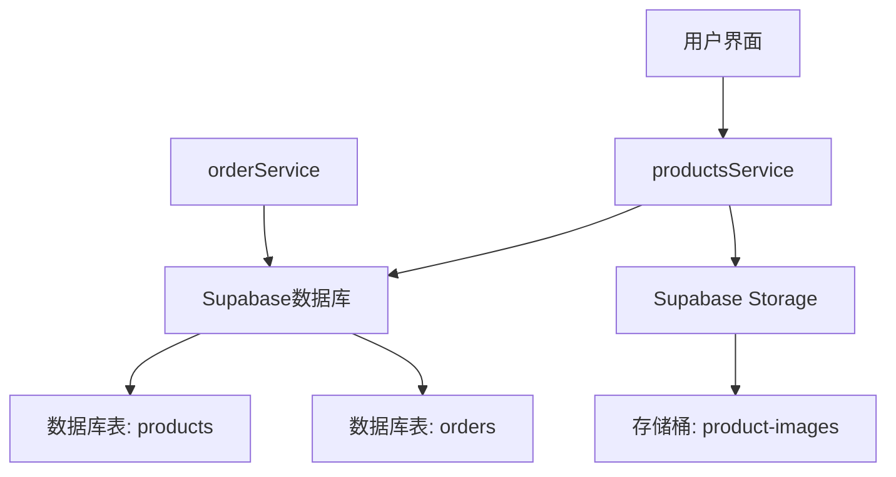
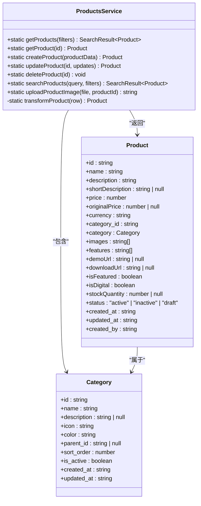
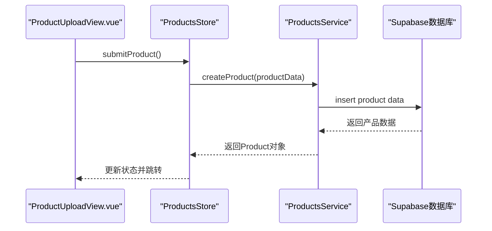
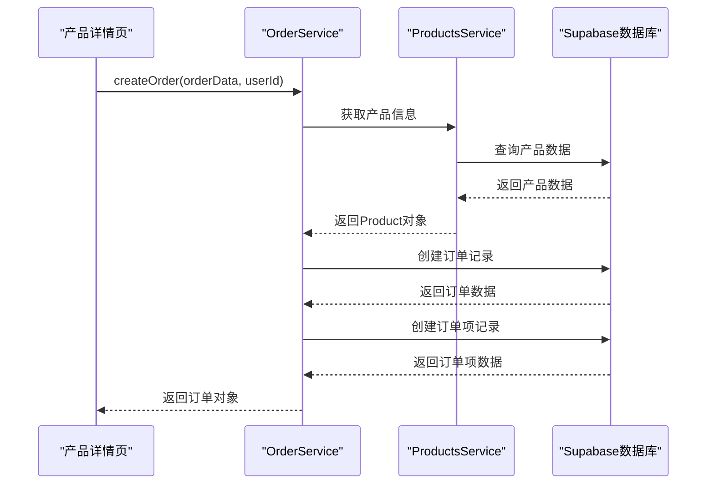
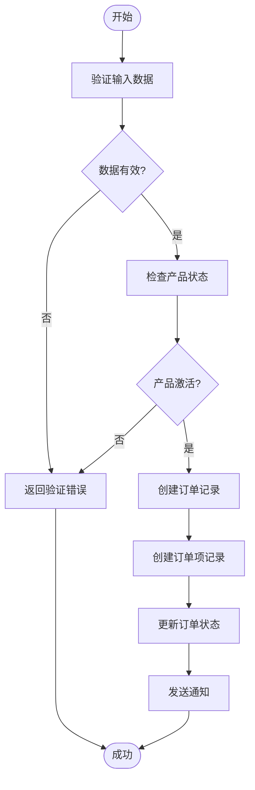
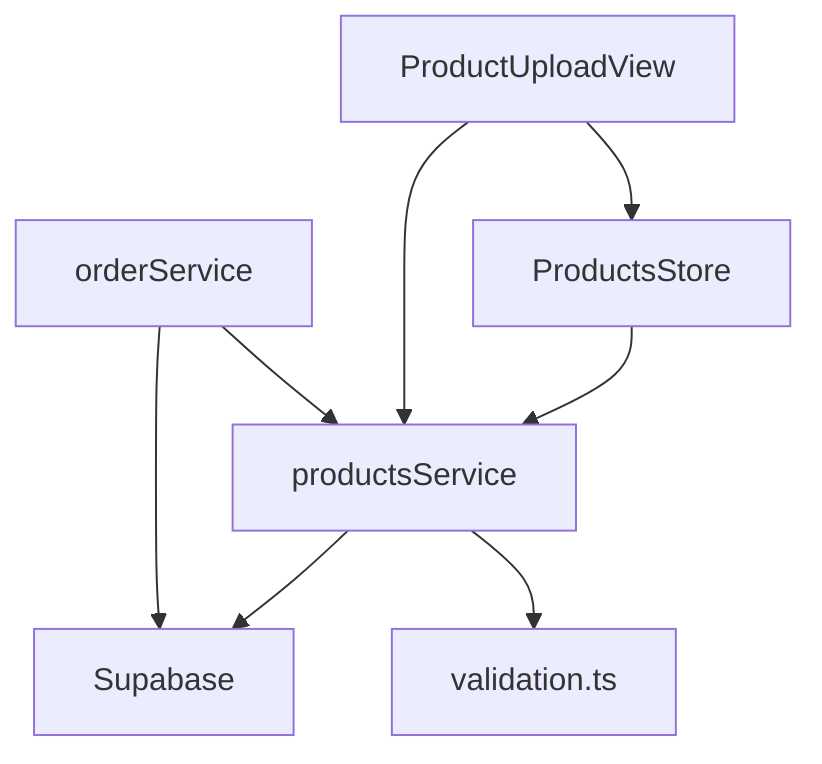

# 产品管理服务

<cite>
**本文档引用的文件**   
- [productsService.ts](file://src/services/productsService.ts)
- [orderService.ts](file://src/services/orderService.ts)
- [database.ts](file://src/types/database.ts)
- [validation.ts](file://src/utils/validation.ts)
- [ProductUploadView.vue](file://src/views/ProductUploadView.vue)
</cite>

## 目录
1. [简介](#简介)
2. [项目结构](#项目结构)
3. [核心组件](#核心组件)
4. [架构概述](#架构概述)
5. [详细组件分析](#详细组件分析)
6. [依赖分析](#依赖分析)
7. [性能考虑](#性能考虑)
8. [故障排除指南](#故障排除指南)
9. [结论](#结论)
10. [附录](#附录)（如有必要）

## 简介
本文档详细阐述了产品管理服务的技术实现，重点说明了productsService如何封装产品信息的CRUD操作及与订单系统的集成。文档涵盖了产品上下架逻辑、价格更新机制以及库存状态同步的实现方式。详细描述了其与orderService的协作关系，确保下单时产品数据一致性。记录了服务中对产品表单数据的校验规则（如价格非负、必填字段）和异常处理策略（如版本冲突、外键约束失败）。提供了"发布新产品"和"处理产品购买请求"的完整调用流程示例，展示从UI触发到数据库持久化的端到端交互。

## 项目结构
产品管理服务位于src/services目录下，主要由productsService.ts文件实现。该服务与orderService.ts紧密协作，共同管理产品和订单的生命周期。产品数据模型定义在types/database.ts中，前端表单验证逻辑位于utils/validation.ts，UI组件主要在views/ProductUploadView.vue中实现。

**图示来源**
- [productsService.ts](file://src/services/productsService.ts#L1-L340)
- [orderService.ts](file://src/services/orderService.ts#L1-L591)
- [ProductUploadView.vue](file://src/views/ProductUploadView.vue#L1-L550)

**本节来源**
- [productsService.ts](file://src/services/productsService.ts#L1-L340)
- [orderService.ts](file://src/services/orderService.ts#L1-L591)

## 核心组件
productsService提供了完整的产品CRUD操作，包括创建、读取、更新和删除产品。服务通过Supabase客户端与数据库交互，实现了产品信息的持久化。orderService负责处理订单创建和支付流程，确保产品购买过程的数据一致性。两个服务通过产品ID进行关联，实现了产品与订单的集成。

**本节来源**
- [productsService.ts](file://src/services/productsService.ts#L1-L340)
- [orderService.ts](file://src/services/orderService.ts#L1-L591)

## 架构概述
产品管理服务采用分层架构，前端UI组件通过服务层与后端数据库交互。productsService作为核心服务，封装了所有产品相关的业务逻辑。服务层与Supabase数据库直接通信，利用其内置的RSL（行级安全）策略确保数据安全。图片上传功能通过Supabase Storage实现，确保了媒体文件的安全存储和访问。

**图示来源**
- [productsService.ts](file://src/services/productsService.ts#L1-L340)
- [orderService.ts](file://src/services/orderService.ts#L1-L591)
- [database.ts](file://src/types/database.ts#L1-L396)

## 详细组件分析
### 产品服务分析
productsService实现了完整的产品管理功能，包括CRUD操作、搜索、图片上传等。服务通过静态方法提供API，确保了调用的一致性和简洁性。

#### 对象关系图

**图示来源**
- [productsService.ts](file://src/services/productsService.ts#L1-L340)
- [database.ts](file://src/types/database.ts#L88-L134)

#### 产品创建流程

**图示来源**
- [productsService.ts](file://src/services/productsService.ts#L183-L200)
- [ProductUploadView.vue](file://src/views/ProductUploadView.vue#L450-L530)

#### 产品购买流程

**图示来源**
- [orderService.ts](file://src/services/orderService.ts#L46-L93)
- [productsService.ts](file://src/services/productsService.ts#L85-L100)

#### 业务逻辑流程

**图示来源**
- [orderService.ts](file://src/services/orderService.ts#L46-L93)
- [productsService.ts](file://src/services/productsService.ts#L85-L100)

**本节来源**
- [productsService.ts](file://src/services/productsService.ts#L1-L340)
- [orderService.ts](file://src/services/orderService.ts#L1-L591)
- [ProductUploadView.vue](file://src/views/ProductUploadView.vue#L1-L550)

## 依赖分析
产品管理服务依赖于Supabase作为后端数据库和存储服务，利用其提供的实时功能和行级安全策略。服务间依赖清晰，productsService和orderService通过明确的接口进行通信，降低了耦合度。前端组件通过store模式与服务层交互，实现了状态的有效管理。

**图示来源**
- [productsService.ts](file://src/services/productsService.ts#L1-L340)
- [orderService.ts](file://src/services/orderService.ts#L1-L591)
- [ProductUploadView.vue](file://src/views/ProductUploadView.vue#L1-L550)

**本节来源**
- [productsService.ts](file://src/services/productsService.ts#L1-L340)
- [orderService.ts](file://src/services/orderService.ts#L1-L591)
- [validation.ts](file://src/utils/validation.ts#L1-L321)

## 性能考虑
产品服务在查询时采用了分页机制，避免了一次性加载过多数据。图片上传使用了Supabase Storage，确保了大文件传输的效率。数据库查询通过索引优化，提高了检索速度。服务层实现了合理的错误处理，避免了异常情况下的性能下降。

## 故障排除指南
产品服务实现了全面的错误处理机制，所有异常都会被捕获并记录到控制台。常见的错误包括产品不存在、数据库连接失败、权限不足等。服务返回标准化的错误消息，便于前端进行用户友好的提示。

**本节来源**
- [productsService.ts](file://src/services/productsService.ts#L1-L340)
- [orderService.ts](file://src/services/orderService.ts#L1-L591)

## 结论
产品管理服务通过清晰的分层架构和明确的接口定义，实现了高效的产品CRUD操作和订单集成。服务充分利用了Supabase的功能，确保了数据安全和性能优化。通过合理的错误处理和验证机制，保证了系统的稳定性和用户体验。

## 附录
### 产品状态枚举
产品状态包括：
- active: 激活状态，产品可被购买
- inactive: 非激活状态，产品不可购买
- draft: 草稿状态，产品仅对创建者可见

### 价格验证规则
价格字段的验证规则包括：
- 必填字段
- 非负数值
- 支持两位小数
- 格式为数字或数字加小数点

**本节来源**
- [database.ts](file://src/types/database.ts#L88-L134)
- [validation.ts](file://src/utils/validation.ts#L1-L321)