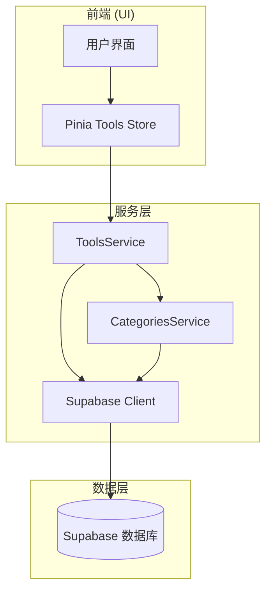
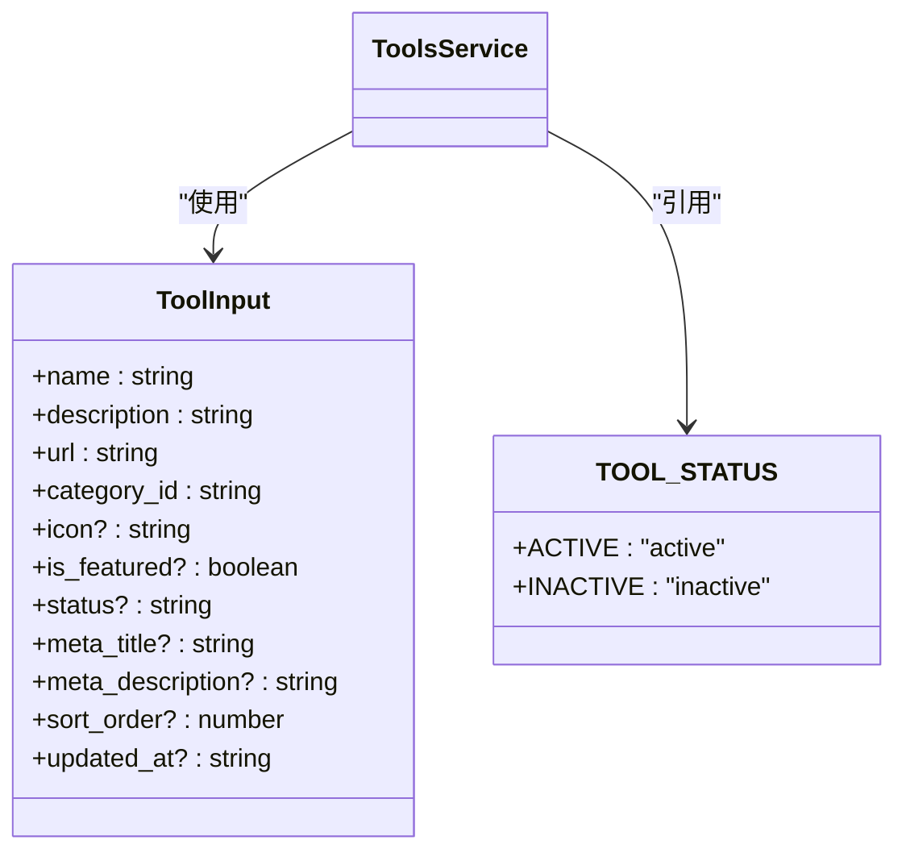
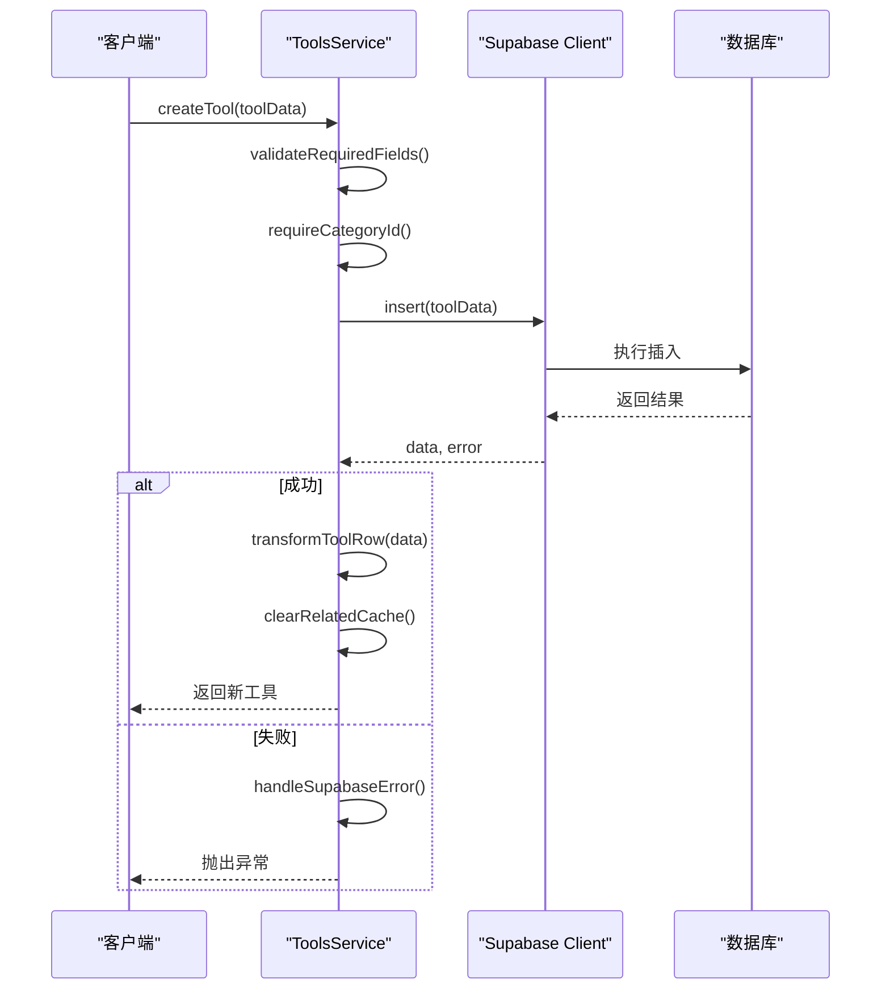

# 工具管理服务

<cite>
**本文档引用的文件**  
- [toolsService.ts](file://src/services/toolsService.ts)
- [categoriesService.ts](file://src/services/categoriesService.ts)
- [tools.ts](file://src/stores/tools.ts)
</cite>

## 目录
1. [简介](#简介)
2. [项目结构](#项目结构)
3. [核心组件](#核心组件)
4. [架构概览](#架构概览)
5. [详细组件分析](#详细组件分析)
6. [依赖分析](#依赖分析)
7. [性能考虑](#性能考虑)
8. [故障排除指南](#故障排除指南)
9. [结论](#结论)

## 简介
本文件深入解析了 `toolsService` 的实现机制，涵盖工具的增删改查、分类关联、状态更新等核心功能。详细说明了其如何通过 Supabase Client 执行数据库操作，并与 `categoriesService` 协同加载分类数据。文档还阐述了请求参数验证机制、错误分类处理策略、事务性操作示例以及与 Pinia store 的数据同步方案。

## 项目结构
项目采用模块化设计，核心服务与状态管理分离。`toolsService` 位于 `src/services` 目录下，负责与 Supabase 数据库交互；`toolsStore` 位于 `src/stores` 目录下，管理前端 UI 层的工具状态。

**Section sources**
- [toolsService.ts](file://src/services/toolsService.ts#L1-L50)
- [tools.ts](file://src/stores/tools.ts#L1-L50)

## 核心组件
`toolsService` 是工具管理的核心服务类，提供创建、读取、更新、删除（CRUD）工具的静态方法。它通过 `supabaseClient` 与数据库通信，并集成缓存机制以提升性能。`categoriesService` 提供分类数据支持，`toolsStore` 实现前端状态同步。

**Section sources**
- [toolsService.ts](file://src/services/toolsService.ts#L1-L50)
- [categoriesService.ts](file://src/services/categoriesService.ts#L1-L50)
- [tools.ts](file://src/stores/tools.ts#L1-L50)

## 架构概览

**Diagram sources**
- [toolsService.ts](file://src/services/toolsService.ts#L1-L20)
- [categoriesService.ts](file://src/services/categoriesService.ts#L1-L20)
- [tools.ts](file://src/stores/tools.ts#L1-L20)

## 详细组件分析

### 工具服务分析
`toolsService` 实现了完整的工具管理功能，包括增删改查、搜索、缓存和错误处理。

#### 工具输入与状态管理
服务定义了 `ToolInput` 接口，规范了创建和更新工具时的数据结构，字段采用蛇形命名以匹配数据库表结构。工具状态由 `TOOL_STATUS` 常量管理，当前支持 `active` 和 `inactive` 两种状态。

**Diagram sources**
- [toolsService.ts](file://src/services/toolsService.ts#L17-L29)
- [toolsService.ts](file://src/services/toolsService.ts#L3-L15)

#### 创建新工具流程
创建工具时，服务首先验证必填字段（名称、描述、URL），然后提取分类 ID，最后通过 Supabase 插入数据。成功后，会清除相关缓存以保证数据一致性。

**Diagram sources**
- [toolsService.ts](file://src/services/toolsService.ts#L158-L195)

####