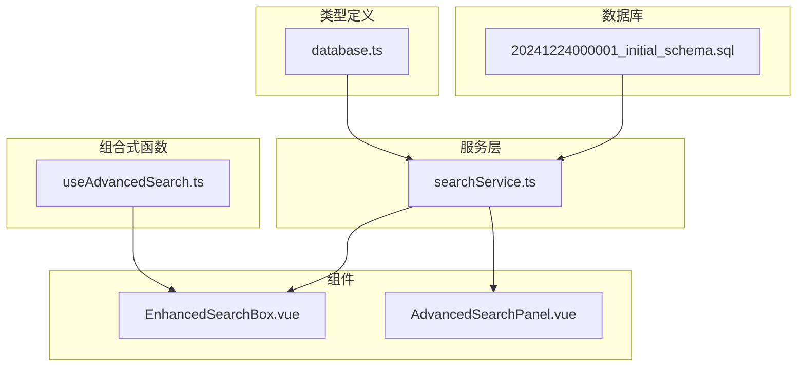
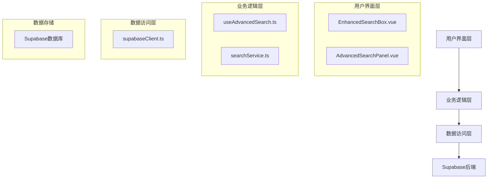
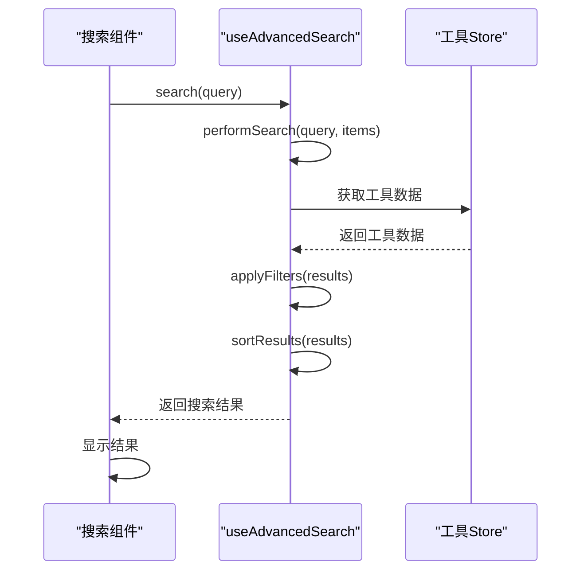
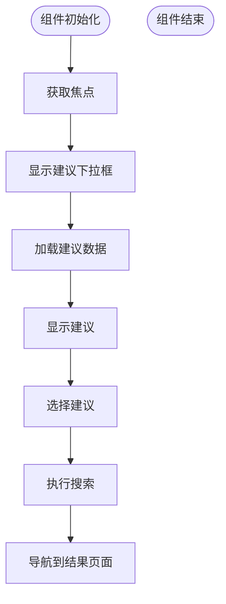
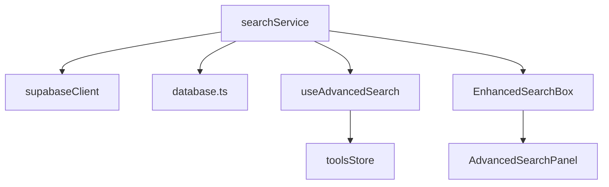

# 搜索服务

<cite>
**本文档引用的文件**  
- [searchService.ts](file://src/services/searchService.ts)
- [useAdvancedSearch.ts](file://src/composables/useAdvancedSearch.ts)
- [EnhancedSearchBox.vue](file://src/components/search/EnhancedSearchBox.vue)
- [AdvancedSearchPanel.vue](file://src/components/search/AdvancedSearchPanel.vue)
- [supabaseClient.ts](file://src/lib/supabaseClient.ts)
- [database.ts](file://src/types/database.ts)
- [20241224000001_initial_schema.sql](file://supabase/migrations/20241224000001_initial_schema.sql)
</cite>

## 目录
1. [简介](#简介)
2. [项目结构](#项目结构)
3. [核心组件](#核心组件)
4. [架构概述](#架构概述)
5. [详细组件分析](#详细组件分析)
6. [依赖分析](#依赖分析)
7. [性能考虑](#性能考虑)
8. [故障排除指南](#故障排除指南)
9. [结论](#结论)

## 简介
搜索服务是高级工具导航系统的核心功能模块，提供工具与产品的全文检索、过滤和排序功能。该服务通过构建复合查询条件（关键词、分类、评分范围）并安全传递至Supabase后端，实现高效的数据检索。服务包含查询性能优化策略如字段索引使用、结果分页和缓存机制，并提供高级搜索查询和实时搜索建议功能。通过useAdvancedSearch组合式函数提升用户体验，同时具备恶意输入防护措施（如SQL注入防范）及超时重试逻辑。

## 项目结构
搜索服务相关文件分布在多个目录中，主要包含服务层、组合式函数、组件和类型定义。服务实现位于`src/services/searchService.ts`，组合式函数在`src/composables/useAdvancedSearch.ts`，用户界面组件位于`src/components/search/`目录下，类型定义在`src/types/database.ts`，数据库架构在`supabase/migrations/`目录中。



**图示来源**  
- [searchService.ts](file://src/services/searchService.ts#L1-L652)
- [useAdvancedSearch.ts](file://src/composables/useAdvancedSearch.ts#L1-L309)
- [EnhancedSearchBox.vue](file://src/components/search/EnhancedSearchBox.vue#L1-L1016)
- [AdvancedSearchPanel.vue](file://src/components/search/AdvancedSearchPanel.vue#L1-L593)
- [database.ts](file://src/types/database.ts#L1-L395)
- [20241224000001_initial_schema.sql](file://supabase/migrations/20241224000001_initial_schema.sql#L1-L285)

**本节来源**  
- [src/services](file://src/services)
- [src/composables](file://src/composables)
- [src/components/search](file://src/components/search)
- [src/types](file://src/types)
- [supabase/migrations](file://supabase/migrations)

## 核心组件
搜索服务的核心组件包括searchService服务类、useAdvancedSearch组合式函数、EnhancedSearchBox和AdvancedSearchPanel组件。searchService提供主要的搜索功能，useAdvancedSearch处理前端搜索逻辑，EnhancedSearchBox提供搜索输入界面，AdvancedSearchPanel提供高级筛选界面。这些组件协同工作，为用户提供完整的搜索体验。

**本节来源**  
- [searchService.ts](file://src/services/searchService.ts#L1-L652)
- [useAdvancedSearch.ts](file://src/composables/useAdvancedSearch.ts#L1-L309)
- [EnhancedSearchBox.vue](file://src/components/search/EnhancedSearchBox.vue#L1-L1016)
- [AdvancedSearchPanel.vue](file://src/components/search/AdvancedSearchPanel.vue#L1-L593)

## 架构概述
搜索服务采用分层架构，包含用户界面层、业务逻辑层和数据访问层。用户界面层由Vue组件构成，业务逻辑层由组合式函数和搜索服务构成，数据访问层由Supabase客户端构成。各层之间通过明确定义的接口进行通信，确保系统的可维护性和可扩展性。



**图示来源**  
- [EnhancedSearchBox.vue](file://src/components/search/EnhancedSearchBox.vue#L1-L1016)
- [AdvancedSearchPanel.vue](file://src/components/search/AdvancedSearchPanel.vue#L1-L593)
- [useAdvancedSearch.ts](file://src/composables/useAdvancedSearch.ts#L1-L309)
- [searchService.ts](file://src/services/searchService.ts#L1-L652)
- [supabaseClient.ts](file://src/lib/supabaseClient.ts#L1-L266)

## 详细组件分析

### searchService分析
searchService是搜索功能的核心实现，提供全文检索、过滤和排序功能。服务通过构建复合查询条件与Supabase后端交互，支持多种搜索类型（工具、产品、分类）和复杂的筛选条件。

#### 类图
```mermaid
classDiagram
class SearchService {
-searchHistory : SearchHistory[]
-popularQueries : Map<string, number>
+search(options : SearchOptions) : Promise<SearchResult<T>>
+getPopularSearches(limit : number) : Promise<string[]>
+getSearchHistory(limit : number) : SearchHistory[]
+clearSearchHistory() : void
+getSmartSuggestions(query : string) : Promise<SearchSuggestion[]>
}
class SearchOptions {
+query : string
+type? : "all" | "tools" | "products" | "categories"
+category? : string
+tags? : string[]
+priceRange? : [number, number]
+sortBy? : "relevance" | "name" | "created_at" | "click_count" | "price"
+sortOrder? : "asc" | "desc"
+limit? : number
+offset? : number
+includeInactive? : boolean
}
class SearchResult {
+items : T[]
+total : number
+query : string
+suggestions : string[]
+facets : SearchFacets
+searchTime : number
}
class SearchFacets {
+categories : { name : string; count : number }[]
+tags : { name : string; count : number }[]
+priceRanges : { range : string; count : number }[]
}
class SearchSuggestion {
+text : string
+type : "query" | "category" | "tag" | "tool" | "product"
+count? : number
}
class SearchHistory {
+id : string
+query : string
+type : string
+timestamp : Date
+results_count : number
}
SearchService --> SearchOptions
SearchService --> SearchResult
SearchService --> SearchFacets
SearchService --> SearchSuggestion
SearchService --> SearchHistory
```

**图示来源**  
- [searchService.ts](file://src/services/searchService.ts#L1-L652)

**本节来源**  
- [searchService.ts](file://src/services/searchService.ts#L1-L652)

### useAdvancedSearch分析
useAdvancedSearch是一个Vue组合式函数，提供前端搜索逻辑的封装。它处理搜索查询、筛选条件和排序逻辑，为搜索组件提供响应式数据和方法。

#### 序列图


**图示来源**  
- [useAdvancedSearch.ts](file://src/composables/useAdvancedSearch.ts#L1-L309)

**本节来源**  
- [useAdvancedSearch.ts](file://src/composables/useAdvancedSearch.ts#L1-L309)

### EnhancedSearchBox分析
EnhancedSearchBox是搜索功能的主要用户界面组件，提供搜索输入、建议显示和高级搜索入口。组件集成实时搜索建议、搜索历史和热门搜索功能，提升用户体验。

#### 流程图


**图示来源**  
- [EnhancedSearchBox.vue](file://src/components/search/EnhancedSearchBox.vue#L1-L1016)

**本节来源**  
- [EnhancedSearchBox.vue](file://src/components/search/EnhancedSearchBox.vue#L1-L1016)

## 依赖分析
搜索服务依赖多个核心模块，包括Supabase客户端、类型定义和状态管理。这些依赖关系确保了服务的正常运行和数据一致性。



**图示来源**  
- [searchService.ts](file://src/services/searchService.ts#L1-L652)
- [supabaseClient.ts](file://src/lib/supabaseClient.ts#L1-L266)
- [database.ts](file://src/types/database.ts#L1-L395)
- [useAdvancedSearch.ts](file://src/composables/useAdvancedSearch.ts#L1-L309)
- [EnhancedSearchBox.vue](file://src/components/search/EnhancedSearchBox.vue#L1-L1016)
- [AdvancedSearchPanel.vue](file://src/components/search/AdvancedSearchPanel.vue#L1-L593)

**本节来源**  
- [src/services/searchService.ts](file://src/services/searchService.ts#L1-L652)
- [src/lib/supabaseClient.ts](file://src/lib/supabaseClient.ts#L1-L266)
- [src/types/database.ts](file://src/types/database.ts#L1-L395)
- [src/composables/useAdvancedSearch.ts](file://src/composables/useAdvancedSearch.ts#L1-L309)
- [src/components/search/EnhancedSearchBox.vue](file://src/components/search/EnhancedSearchBox.vue#L1-L1016)
- [src/components/search/AdvancedSearchPanel.vue](file://src/components/search/AdvancedSearchPanel.vue#L1-L593)

## 性能考虑
搜索服务在设计时考虑了多项性能优化策略。通过使用Supabase的索引功能，确保查询效率；采用分页机制，避免一次性加载大量数据；利用本地存储缓存搜索历史，减少重复查询。此外，服务还实现了防抖机制，避免频繁触发搜索请求。

## 故障排除指南
当搜索功能出现问题时，可参考以下排查步骤：检查Supabase连接配置、验证数据库表结构、确认索引是否存在、检查网络连接状态。对于搜索结果不准确的问题，可检查查询条件构建逻辑和全文搜索配置。

**本节来源**  
- [searchService.ts](file://src/services/searchService.ts#L1-L652)
- [supabaseClient.ts](file://src/lib/supabaseClient.ts#L1-L266)
- [20241224000001_initial_schema.sql](file://supabase/migrations/20241224000001_initial_schema.sql#L1-L285)

## 结论
搜索服务为系统提供了强大而灵活的搜索功能，通过合理的架构设计和性能优化，确保了良好的用户体验。服务的模块化设计使其易于维护和扩展，为未来的功能增强奠定了基础。