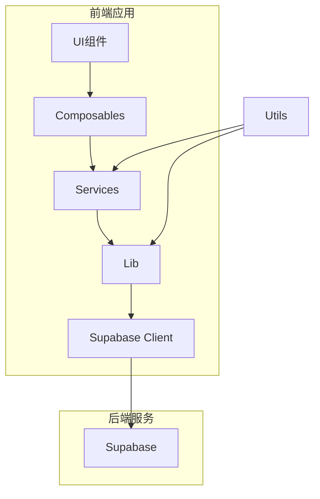
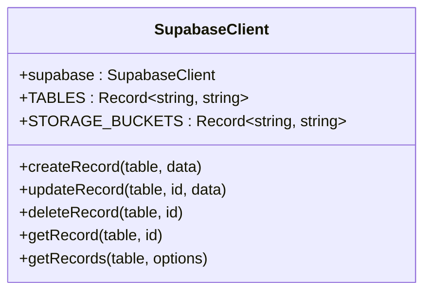
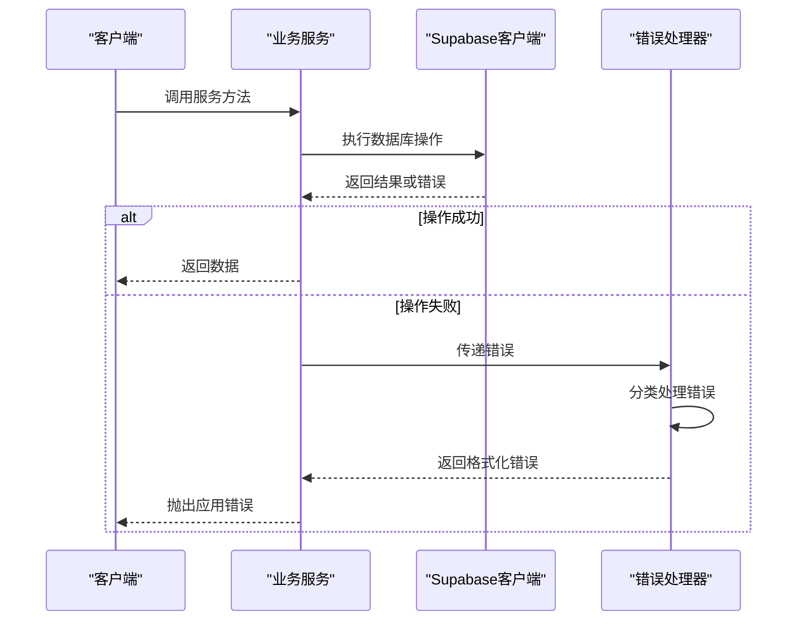
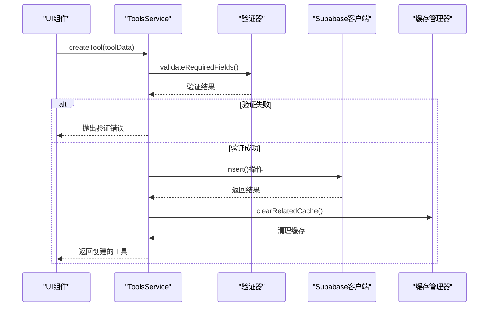
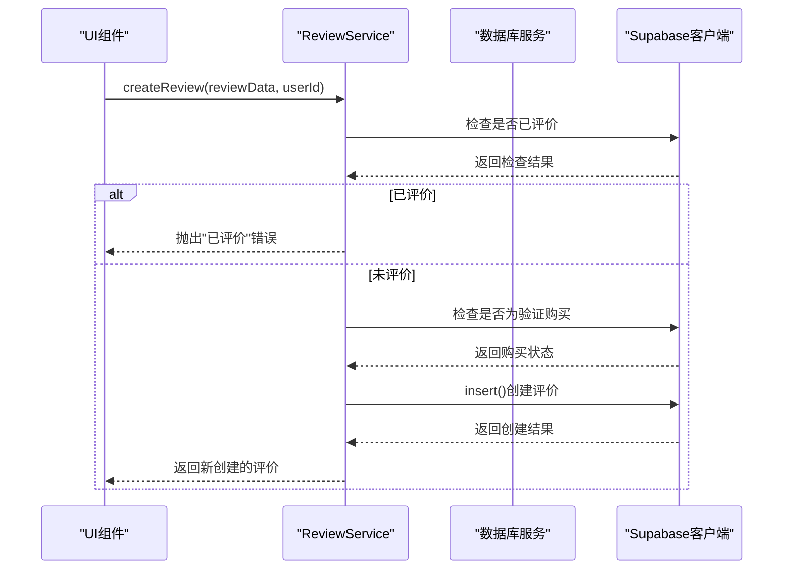
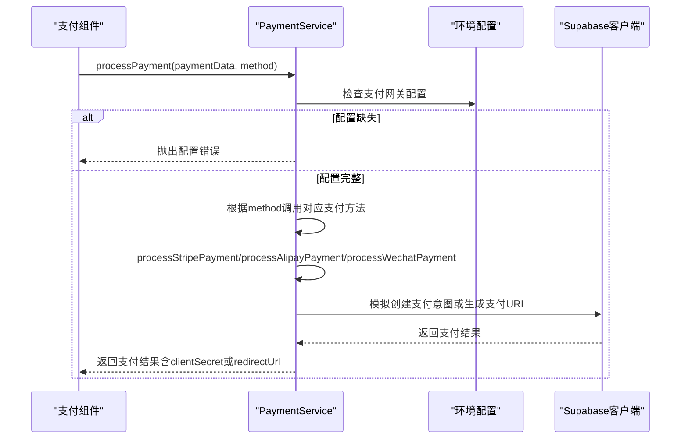
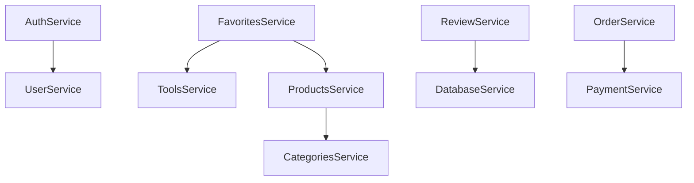

# 服务层集成与API调用

<cite>
**本文档引用文件**  
- [authService.ts](file://src/services/authService.ts)
- [toolsService.ts](file://src/services/toolsService.ts)
- [productsService.ts](file://src/services/productsService.ts)
- [favoritesService.ts](file://src/services/favoritesService.ts)
- [reviewService.ts](file://src/services/reviewService.ts)
- [supabaseClient.ts](file://src/lib/supabaseClient.ts)
- [validation.ts](file://src/utils/validation.ts)
- [errorHandler.ts](file://src/utils/errorHandler.ts)
- [cacheManager.ts](file://src/utils/cacheManager.ts)
- [paymentService.ts](file://src/services/paymentService.ts) - *新增支付服务模块*
- [.env.example](file://.env.example) - *新增支付网关环境变量配置*
</cite>

## 更新摘要
**变更内容**   
- 新增 **支付服务模块** 章节，详细说明 `paymentService` 的实现与集成
- 更新 **核心服务模块职责**，增加支付服务的职责描述
- 在 **典型操作流程** 中新增 **支付处理流程** 序列图
- 更新 **类型安全与数据契约** 中的接口定义，反映支付相关类型变更
- 增加对 `.env.example` 文件中支付网关配置的引用

## 目录
1. [项目结构](#项目结构)
2. [核心服务模块职责](#核心服务模块职责)
3. [Supabase客户端集成](#supabase客户端集成)
4. [输入验证机制](#输入验证机制)
5. [错误处理与重试机制](#错误处理与重试机制)
6. [缓存策略](#缓存策略)
7. [典型操作流程](#典型操作流程)
8. [服务间依赖关系](#服务间依赖关系)
9. [类型安全与数据契约](#类型安全与数据契约)
10. [支付服务模块](#支付服务模块)

## 项目结构

项目采用分层架构设计，`src/services` 目录下包含多个业务服务模块，每个服务封装特定领域的业务逻辑与Supabase API交互。



**图示来源**
- [supabaseClient.ts](file://src/lib/supabaseClient.ts)
- [services目录](file://src/services/)

## 核心服务模块职责

各服务模块遵循单一职责原则，封装特定业务领域的数据访问逻辑。

### 认证服务 (AuthService)
负责用户认证相关操作，包括登录、注册、登出、密码重置等。

**模块来源**
- [authService.ts](file://src/services/authService.ts)

### 工具服务 (ToolsService)
管理工具类资源的CRUD操作，支持搜索、分页、缓存等功能。

**模块来源**
- [toolsService.ts](file://src/services/toolsService.ts)

### 产品服务 (ProductsService)
处理产品信息的管理，包括产品详情、特色产品、相关产品等功能。

**模块来源**
- [productsService.ts](file://src/services/productsService.ts)

### 收藏服务 (FavoritesService)
管理用户收藏功能，支持工具和产品的收藏与取消收藏。

**模块来源**
- [favoritesService.ts](file://src/services/favoritesService.ts)

### 评价服务 (ReviewService)
处理产品评价的创建、更新、删除及统计功能。

**模块来源**
- [reviewService.ts](file://src/services/reviewService.ts)

### 支付服务 (PaymentService)
处理多种支付方式的集成，包括Stripe、支付宝和微信支付。封装支付请求构造、签名生成、支付结果处理等逻辑。

**模块来源**
- [paymentService.ts](file://src/services/paymentService.ts) - *新增模块*

## Supabase客户端集成

所有服务通过统一的Supabase客户端实例与后端通信，确保连接配置的一致性。

### 客户端初始化
```typescript
export const supabase = createClient<Database>(supabaseUrl, supabaseAnonKey, {
  auth: {
    autoRefreshToken: true,
    persistSession: true,
    detectSessionInUrl: true,
  },
});
```

### 表名与存储桶常量
```typescript
export const TABLES = {
  TOOLS: "tools",
  PRODUCTS: "products",
  FAVORITES: "favorites",
  REVIEWS: "reviews",
} as const;

export const STORAGE_BUCKETS = {
  AVATARS: "avatars",
  PRODUCT_IMAGES: "product-images",
} as const;
```

### 数据库操作工具函数
提供通用的增删改查方法，封装错误处理逻辑。



**图示来源**
- [supabaseClient.ts](file://src/lib/supabaseClient.ts)

## 输入验证机制

通过 `validation.ts` 文件提供统一的输入验证框架，确保数据完整性。

### 验证规则定义
```typescript
export interface ValidationRule {
  required?: boolean;
  minLength?: number;
  maxLength?: number;
  pattern?: RegExp;
  custom?: (value: any) => boolean | string;
  message?: string;
}
```

### 常用验证规则
```typescript
export const ValidationRules = {
  email: { pattern: /^[^\s@]+@[^\s@]+\.[^\s@]+$/, message: "请输入有效的邮箱地址" },
  phone: { pattern: /^1[3-9]\d{9}$/, message: "请输入有效的手机号码" },
  password: { minLength: 8, pattern: /^(?=.*[a-z])(?=.*[A-Z])(?=.*\d)[a-zA-Z\d@$!%*?&]{8,}$/, message: "密码至少8位" },
  url: { pattern: /^https?:\/\/.+/, message: "请输入有效的URL地址" },
};
```

### 表单验证器
```typescript
export class FormValidator {
  static create(): FormValidator
  field(name: string): FieldValidator
  validate(data: Record<string, any>): ValidationResult
}
```

**模块来源**
- [validation.ts](file://src/utils/validation.ts)

## 错误处理与重试机制

通过 `errorHandler.ts` 提供统一的错误处理策略，确保用户体验一致性。

### 应用错误接口
```typescript
export interface AppError {
  code: string;
  message: string;
  details?: unknown;
  timestamp: Date;
}
```

### 错误处理类
```typescript
export class ErrorHandler {
  static handleApiError(error: unknown): AppError
  static handleDatabaseError(error: any): AppError
  static handleValidationError(errors: Record<string, string[]>): AppError
  static formatErrorMessage(error: AppError): string
  static logError(error: AppError, context?: string): void
}
```

### 重试机制
```typescript
export class RetryHandler {
  static async withRetry<T>(operation: () => Promise<T>, maxRetries: number = 3, delay: number = 1000): Promise<T>
  static async withExponentialBackoff<T>(operation: () => Promise<T>, maxRetries: number = 3, baseDelay: number = 1000, maxDelay: number = 10000): Promise<T>
}
```



**图示来源**
- [errorHandler.ts](file://src/utils/errorHandler.ts)
- [supabaseClient.ts](file://src/lib/supabaseClient.ts)

## 缓存策略

通过 `cacheManager.ts` 实现API响应缓存，提升性能并减少重复请求。

### 缓存装饰器
```typescript
export function withCache<T extends (...args: any[]) => Promise<any>>(
  fn: T,
  getCacheKey: (...args: any[]) => string,
  cache: Map<string, { data: Awaited<ReturnType<T>>; timestamp: number }>,
  ttl: number = 5 * 60 * 1000
): T
```

### 缓存实例
```typescript
export const apiCache = new Map<string, { data: any; timestamp: number }>();
```

### 服务中的缓存应用
```typescript
static async getTools(filters?: SearchFilters): Promise<SearchResult<Tool>> {
  const cacheKey = `tools_${JSON.stringify(filters || {})}`;
  
  return withCache(
    this._getToolsFromAPI.bind(this),
    () => cacheKey,
    apiCache,
    2 * 60 * 1000
  )(filters);
}
```

**模块来源**
- [cacheManager.ts](file://src/utils/cacheManager.ts)
- [toolsService.ts](file://src/services/toolsService.ts)

## 典型操作流程

展示从调用服务方法到返回Promise的完整流程。

### 创建工具流程


**图示来源**
- [toolsService.ts](file://src/services/toolsService.ts)
- [validation.ts](file://src/utils/validation.ts)

### 提交评价流程


**图示来源**
- [reviewService.ts](file://src/services/reviewService.ts)

### 支付处理流程


**图示来源**
- [paymentService.ts](file://src/services/paymentService.ts)
- [.env.example](file://.env.example)

## 服务间依赖关系

分析各服务之间的依赖关系及最佳实践。

### 依赖关系图


### 最佳实践
1. **避免循环依赖**：确保服务间依赖为有向无环图
2. **依赖注入**：通过静态方法调用而非实例化依赖
3. **接口隔离**：每个服务只暴露必要的公共方法
4. **错误传播**：保持错误类型的一致性，便于上层处理

**模块来源**
- [authService.ts](file://src/services/authService.ts)
- [favoritesService.ts](file://src/services/favoritesService.ts)
- [reviewService.ts](file://src/services/reviewService.ts)
- [orderService.ts](file://src/services/orderService.ts)

## 类型安全与数据契约

通过TypeScript接口定义确保前后端数据契约一致性。

### 类型定义文件
```typescript
// types/index.ts
export interface Tool {
  id: string;
  name: string;
  description: string;
  url: string;
  categoryId: string;
  isFavorite: boolean;
  clickCount: number;
  isFeatured: boolean;
  status: string;
  createdAt: string;
  updatedAt: string;
}

export interface Product {
  id: string;
  name: string;
  description: string;
  price: number;
  categoryId: string;
  images: string[];
  isFeatured: boolean;
  status: string;
  createdAt: string;
  updatedAt: string;
  reviews: Review[];
  averageRating: number;
  totalReviews: number;
}

export interface Review {
  id: string;
  productId: string;
  userId: string;
  rating: number;
  title: string;
  content: string;
  isVerified: boolean;
  isAnonymous: boolean;
  status: "pending" | "approved" | "rejected";
  createdAt: string;
  updatedAt: string;
}

// 支付结果类型
export interface PaymentResult {
  success: boolean;
  paymentId?: string;
  orderId: string;
  amount: number;
  currency: string;
  method: string;
  message?: string;
  redirectUrl?: string;
  clientSecret?: string;
  paymentIntentId?: string;
}
```

### 数据库类型映射
```typescript
// types/database.ts
type ProductInsert = Database["public"]["Tables"]["products"]["Insert"];
type ProductUpdate = Database["public"]["Tables"]["products"]["Update"];
```

### 数据转换
```typescript
private static transformProduct(row: any): Product {
  return {
    id: row.id,
    name: row.name,
    description: row.description,
    price: row.price,
    // ...其他字段映射
  };
}
```

**模块来源**
- [types/index.ts](file://src/types/index.ts)
- [types/database.ts](file://src/types/database.ts)
- [productsService.ts](file://src/services/productsService.ts)

## 支付服务模块

新增的 `paymentService.ts` 模块实现了对多种支付网关的集成，为产品购买流程提供完整的支付解决方案。

### 支付网关配置
服务通过环境变量集中管理各支付网关的配置信息，确保敏感信息不硬编码在代码中。

```typescript
// 支付网关配置
const PAYMENT_CONFIG = {
  // Stripe配置
  stripe: {
    publicKey: import.meta.env.VITE_STRIPE_PUBLIC_KEY || "",
    secretKey: import.meta.env.VITE_STRIPE_SECRET_KEY || "",
  },
  // 支付宝配置
  alipay: {
    appId: import.meta.env.VITE_ALIPAY_APP_ID || "",
    privateKey: import.meta.env.VITE_ALIPAY_PRIVATE_KEY || "",
    alipayPublicKey: import.meta.env.VITE_ALIPAY_PUBLIC_KEY || "",
    gateway: import.meta.env.VITE_ALIPAY_GATEWAY_URL || "https://openapi.alipay.com/gateway.do",
    charset: import.meta.env.VITE_ALIPAY_CHARSET || "UTF-8",
    signType: import.meta.env.VITE_ALIPAY_SIGN_TYPE || "RSA2",
  },
  // 微信支付配置
  wechat: {
    appId: import.meta.env.VITE_WECHAT_APP_ID || "",
    mchId: import.meta.env.VITE_WECHAT_MCH_ID || "",
    apiKey: import.meta.env.VITE_WECHAT_API_KEY || "",
    apiVersion: import.meta.env.VITE_WECHAT_API_VERSION || "v3",
  },
};
```

**模块来源**
- [paymentService.ts](file://src/services/paymentService.ts)
- [.env.example](file://.env.example)

### 支付方式处理
服务提供统一的 `processPayment` 方法，根据传入的支付方式调用相应的处理逻辑。

```typescript
static async processPayment(paymentData: PaymentData, method: string): Promise<PaymentResult> {
  switch (method) {
    case "stripe":
      return await this.processStripePayment(paymentData);
    case "alipay":
      return await this.processAlipayPayment(paymentData);
    case "wechat":
      return await this.processWechatPayment(paymentData);
    default:
      return {
        success: false,
        orderId: paymentData.order_id,
        amount: paymentData.amount,
        currency: "CNY",
        method: method,
        message: "不支持的支付方式"
      };
  }
}
```

### 支付结果处理
服务定义了统一的 `PaymentResult` 接口，确保不同支付方式返回的结果结构一致，便于上层组件处理。

```typescript
export interface PaymentResult {
  success: boolean;
  paymentId?: string;
  orderId: string;
  amount: number;
  currency: string;
  method: string;
  message?: string;
  redirectUrl?: string; // 用于重定向的支付URL
  clientSecret?: string; // Stripe客户端密钥
  paymentIntentId?: string; // Stripe支付意图ID
}
```

**模块来源**
- [paymentService.ts](file://src/services/paymentService.ts)
- [types/index.ts](file://src/types/index.ts)