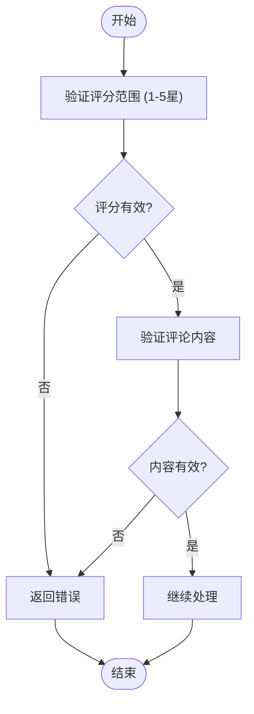
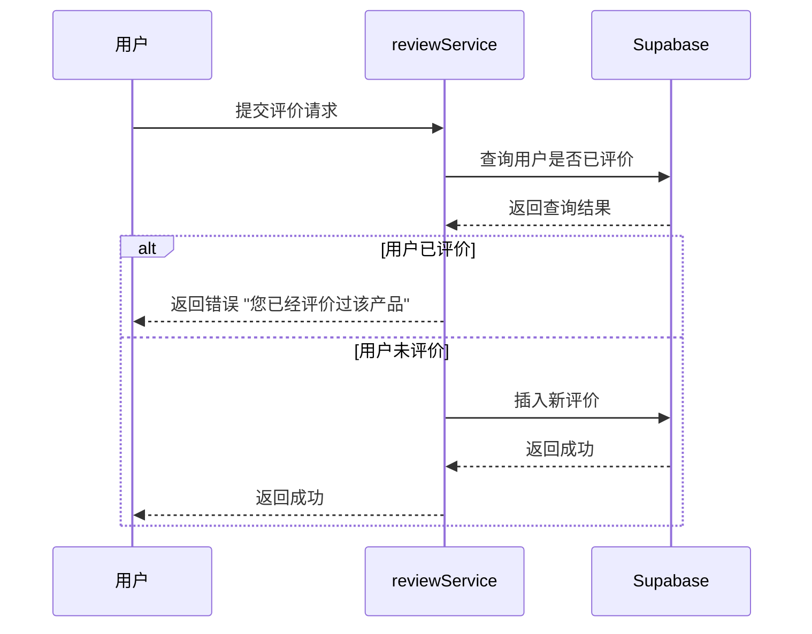
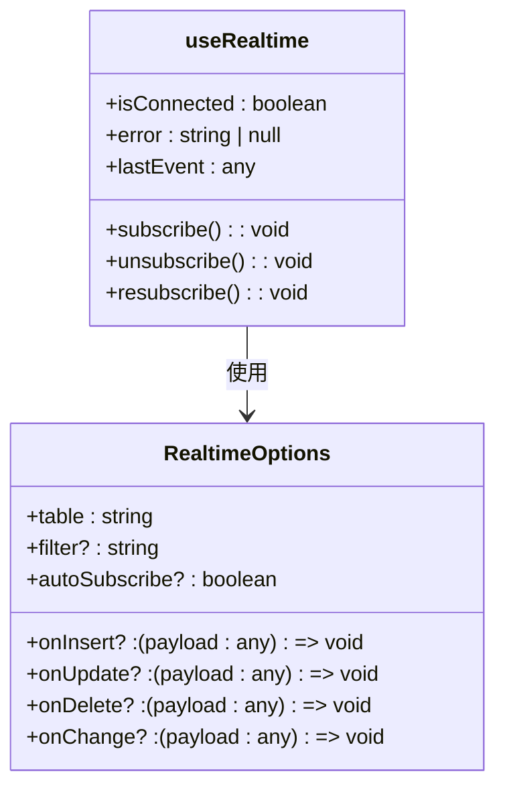
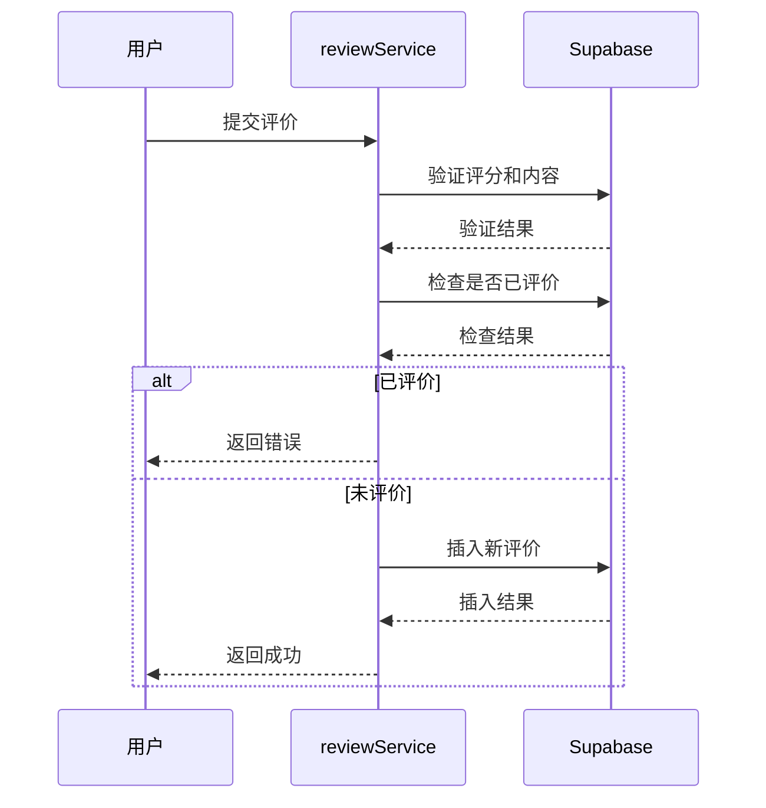

# 评价系统服务

<cite>
**本文档中引用的文件**  
- [reviewService.ts](file://src/services/reviewService.ts)
- [userService.ts](file://src/services/userService.ts)
- [useRealtime.ts](file://src/composables/useRealtime.ts)
</cite>

## 目录
1. [简介](#简介)
2. [核心功能分析](#核心功能分析)
3. [评分与评论验证机制](#评分与评论验证机制)
4. [防止重复评价机制](#防止重复评价机制)
5. [实时通知机制](#实时通知机制)
6. [操作示例](#操作示例)
7. [用户身份集成](#用户身份集成)
8. [结论](#结论)

## 简介
本系统旨在为用户提供对工具或产品的评分与评论功能。通过 `reviewService` 服务，用户可以提交、编辑和删除评价，系统会自动验证评分范围、内容合规性，并防止重复评价。同时，系统利用 Supabase Realtime 机制通知相关方新评价的提交。此外，`reviewService` 与 `userService` 集成，确保评价者身份真实有效，并支持匿名选项的配置化处理。

## 核心功能分析

`reviewService` 提供了完整的评价管理功能，包括创建、更新、删除评价，以及获取评价列表和统计信息。以下是主要功能的概述：

- **创建评价**：用户可以为产品提交新的评价，系统会检查评分范围（1-5星）、评论内容合规性，并防止重复评价。
- **更新评价**：用户可以编辑已有的评价，系统会验证用户权限。
- **删除评价**：用户可以删除自己的评价，系统会验证用户权限。
- **获取评价列表**：根据产品ID获取评价列表，支持分页、排序和筛选。
- **获取评价统计**：获取产品的评价统计信息，包括总评价数、平均评分、评分分布等。

**Section sources**
- [reviewService.ts](file://src/services/reviewService.ts#L103-L605)

## 评分与评论验证机制

### 评分范围验证
系统要求评分必须在1到5星之间。在创建或更新评价时，`reviewService` 会检查评分值是否符合此范围。

### 评论内容合规性
系统会对评论内容进行基本的合规性检查，确保内容不为空且符合平台规定。具体实现中，系统会检查 `content` 字段是否为空或为 `null`。



**Diagram sources**
- [reviewService.ts](file://src/services/reviewService.ts#L103-L605)

**Section sources**
- [reviewService.ts](file://src/services/reviewService.ts#L103-L605)

## 防止重复评价机制

为了防止用户对同一产品进行多次评价，`reviewService` 在创建评价前会检查用户是否已经评价过该产品。如果用户已经评价过，则抛出错误提示。



**Diagram sources**
- [reviewService.ts](file://src/services/reviewService.ts#L103-L605)

**Section sources**
- [reviewService.ts](file://src/services/reviewService.ts#L103-L605)

## 实时通知机制

系统利用 Supabase Realtime 机制通知相关方新评价的提交。`useRealtime` 组件提供了订阅和取消订阅实时更新的功能，确保前端能够及时响应数据变化。



**Diagram sources**
- [useRealtime.ts](file://src/composables/useRealtime.ts#L14-L106)

**Section sources**
- [useRealtime.ts](file://src/composables/useRealtime.ts#L14-L106)

## 操作示例

### 提交工具评价
用户提交评价时，系统会执行以下步骤：
1. 验证评分范围和评论内容。
2. 检查用户是否已经评价过该产品。
3. 如果未评价，插入新评价并返回成功。

### 编辑已有评论
用户编辑已有评论时，系统会执行以下步骤：
1. 验证用户权限。
2. 更新评价内容并返回成功。



**Diagram sources**
- [reviewService.ts](file://src/services/reviewService.ts#L103-L605)

**Section sources**
- [reviewService.ts](file://src/services/reviewService.ts#L103-L605)

## 用户身份集成

`reviewService` 与 `userService` 集成，确保评价者身份真实有效。`userService` 提供了获取当前用户信息、更新用户资料等功能，确保用户身份的完整性和安全性。

```mermaid
classDiagram
class UserService {
+getCurrentUser() : Promise<User | null>
+getUserProfile(userId : string) : Promise<User | null>
+updateProfile(userId : string, profileData : ProfileForm) : Promise<User>
+createUserProfile(userId : string, email : string) : Promise<User>
+uploadAvatar(userId : string, file : File) : Promise<string>
+updateLastLogin(userId : string) : Promise<void>
+checkUsernameAvailability(username : string, excludeUserId? : string) : Promise<boolean>
+getUserStats(userId : string) : Promise<{...}>
+deleteAccount(userId : string) : Promise<void>
}
class User {
+id : string
+email : string
+username : string
+full_name : string
+avatar_url : string
+bio : string
+website : string
+location : string
+role : string
+is_active : boolean
+email_verified : boolean
+created_at : string
+updated_at : string
+last_login_at : string
}
UserService --> User : 使用
```

**Diagram sources**
- [userService.ts](file://src/services/userService.ts#L14-L106)

**Section sources**
- [userService.ts](file://src/services/userService.ts#L14-L106)

## 结论
`reviewService` 服务通过严格的验证机制和实时通知功能，确保了评价系统的可靠性和用户体验。与 `userService` 的集成进一步增强了系统的安全性和完整性。通过这些机制，系统能够有效地管理用户评价，提供高质量的服务。