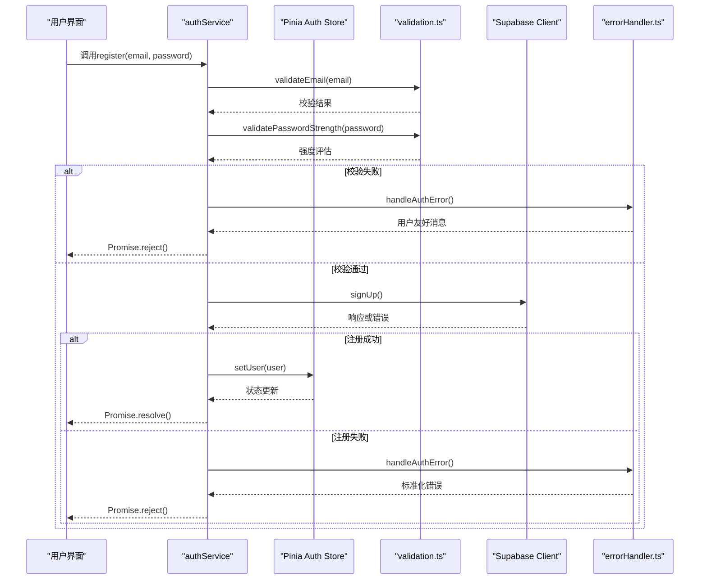
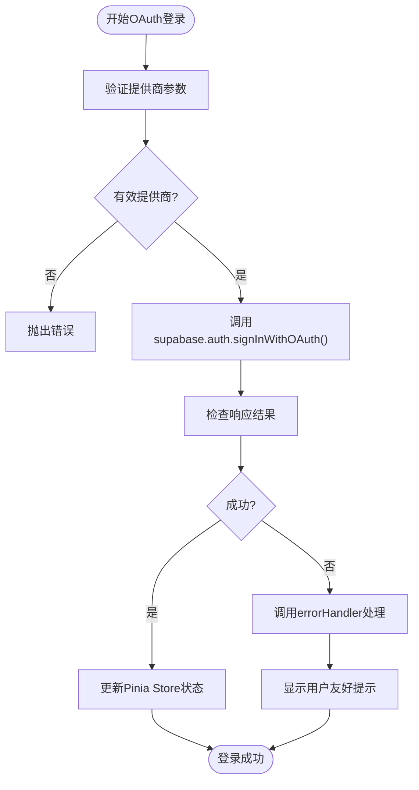
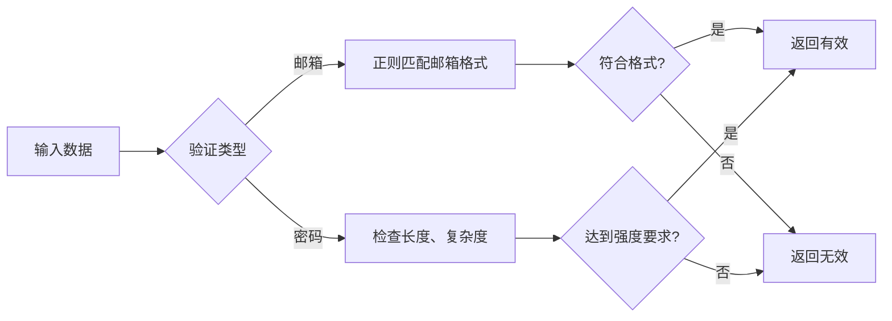
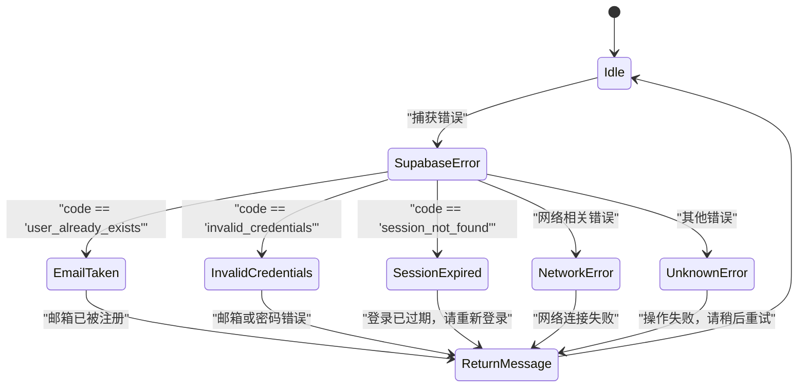

# 身份认证服务

<cite>
**本文档引用文件**  
- [authService.ts](file://src/services/authService.ts)
- [auth.ts](file://src/stores/auth.ts)
- [validation.ts](file://src/utils/validation.ts)
- [errorHandler.ts](file://src/utils/errorHandler.ts)
- [supabaseClient.ts](file://src/lib/supabaseClient.ts)
</cite>

## 目录
1. [简介](#简介)
2. [项目结构](#项目结构)
3. [核心组件](#核心组件)
4. [架构概述](#架构概述)
5. [详细组件分析](#详细组件分析)
6. [依赖分析](#依赖分析)
7. [性能考虑](#性能考虑)
8. [故障排除指南](#故障排除指南)
9. [结论](#结论)

## 简介
本项目实现了一个基于Supabase的身份认证服务，封装了用户注册、登录、密码重置和会话管理功能。通过TypeScript接口保障类型安全，结合Pinia状态管理实现全局用户状态同步，并集成输入校验与统一错误处理机制，提供健壮且用户友好的认证体验。

## 项目结构
身份认证相关模块分布在`src`目录下的多个子目录中，形成清晰的关注点分离架构。

```mermaid
graph TB
subgraph "服务层"
AuthService[authService.ts]
end
subgraph "状态管理"
AuthStore[auth.ts]
end
subgraph "工具库"
Validation[validation.ts]
ErrorHandler[errorHandler.ts]
end
subgraph "基础设施"
SupabaseClient[supabaseClient.ts]
end
AuthService --> AuthStore : "更新状态"
AuthService --> Validation : "前置校验"
AuthService --> SupabaseClient : "调用API"
AuthService --> ErrorHandler : "异常捕获"
```

**Diagram sources**
- [authService.ts](file://src/services/authService.ts#L1-L10)
- [auth.ts](file://src/stores/auth.ts#L1-L5)
- [validation.ts](file://src/utils/validation.ts#L1-L5)
- [errorHandler.ts](file://src/utils/errorHandler.ts#L1-L5)
- [supabaseClient.ts](file://src/lib/supabaseClient.ts#L1-L5)

**Section sources**
- [authService.ts](file://src/services/authService.ts#L1-L50)
- [auth.ts](file://src/stores/auth.ts#L1-L30)

## 核心组件
身份认证系统由五个核心文件构成，分别负责API封装、状态管理、输入验证、错误处理和底层连接。

**Section sources**
- [authService.ts](file://src/services/authService.ts#L1-L100)
- [auth.ts](file://src/stores/auth.ts#L1-L50)
- [validation.ts](file://src/utils/validation.ts#L1-L40)
- [errorHandler.ts](file://src/utils/errorHandler.ts#L1-L35)
- [supabaseClient.ts](file://src/lib/supabaseClient.ts#L1-L20)

## 架构概述
系统采用分层架构设计，上层业务逻辑通过服务层与Supabase后端交互，所有用户状态集中存储于Pinia store中。



**Diagram sources**
- [authService.ts](file://src/services/authService.ts#L20-L80)
- [auth.ts](file://src/stores/auth.ts#L10-L25)
- [validation.ts](file://src/utils/validation.ts#L10-L30)
- [errorHandler.ts](file://src/utils/errorHandler.ts#L10-L20)
- [supabaseClient.ts](file://src/lib/supabaseClient.ts#L10-L15)

## 详细组件分析

### 认证服务分析
`authService.ts`是整个认证系统的核心，封装了所有与Supabase Auth API的交互。

#### 服务类结构
```mermaid
classDiagram
class AuthService {
+register(email : string, password : string) : Promise~User~
+login(email : string, password : string) : Promise~Session~
+logout() : Promise~void~
+resetPassword(email : string) : Promise~void~
+signInWithOAuth(provider : string) : Promise~void~
+getCurrentUser() : Promise~User | null~
-validateAndCall(fn : Function, ...args) : Promise~T~
}
class Validation {
+validateEmail(email : string) : boolean
+validatePasswordStrength(password : string) : {valid : boolean, score : number}
}
class ErrorHandler {
+handleAuthError(error : any) : string
}
class AuthStore {
+user : User | null
+loading : boolean
+error : string | null
+setUser(user : User | null) : void
+clearUser() : void
}
AuthService --> Validation : "依赖"
AuthService --> ErrorHandler : "依赖"
AuthService --> AuthStore : "更新"
AuthService --> SupabaseClient : "调用"
```

**Diagram sources**
- [authService.ts](file://src/services/authService.ts#L15-L120)
- [validation.ts](file://src/utils/validation.ts#L5-L25)
- [errorHandler.ts](file://src/utils/errorHandler.ts#L5-L15)
- [auth.ts](file://src/stores/auth.ts#L8-L20)

#### OAuth登录流程


**Diagram sources**
- [authService.ts](file://src/services/authService.ts#L85-L100)
- [auth.ts](file://src/stores/auth.ts#L25-L35)

**Section sources**
- [authService.ts](file://src/services/authService.ts#L1-L150)
- [auth.ts](file://src/stores/auth.ts#L1-L40)

### 输入验证分析
`validation.ts`提供用户输入的前置校验功能，防止无效请求到达后端。



**Diagram sources**
- [validation.ts](file://src/utils/validation.ts#L10-L35)

**Section sources**
- [validation.ts](file://src/utils/validation.ts#L1-L40)

### 错误处理分析
`errorHandler.ts`统一处理来自Supabase的各种错误码，转换为用户可理解的消息。



**Diagram sources**
- [errorHandler.ts](file://src/utils/errorHandler.ts#L5-L30)

**Section sources**
- [errorHandler.ts](file://src/utils/errorHandler.ts#L1-L35)

## 依赖分析
各组件之间存在明确的依赖关系，确保职责分离和代码可维护性。

```mermaid
dependencyDiagram
authService --> authStore : "状态同步"
authService --> validation : "输入校验"
authService --> errorHandler : "错误处理"
authService --> supabaseClient : "API调用"
loginView --> authService : "注册登录功能"
registerView --> authService : "注册功能"
forgotPasswordView --> authService : "密码重置"
```

**Diagram sources**
- [authService.ts](file://src/services/authService.ts#L1-L20)
- [auth.ts](file://src/stores/auth.ts#L1-L10)
- [validation.ts](file://src/utils/validation.ts#L1-L10)
- [errorHandler.ts](file://src/utils/errorHandler.ts#L1-L10)
- [supabaseClient.ts](file://src/lib/supabaseClient.ts#L1-L10)

**Section sources**
- [authService.ts](file://src/services/authService.ts#L1-L50)
- [auth.ts](file://src/stores/auth.ts#L1-L20)
- [validation.ts](file://src/utils/validation.ts#L1-L20)
- [errorHandler.ts](file://src/utils/errorHandler.ts#L1-L20)
- [supabaseClient.ts](file://src/lib/supabaseClient.ts#L1-L15)

## 性能考虑
- 所有API调用均使用异步Promise，避免阻塞主线程
- 输入校验在客户端完成，减少无效网络请求
- 错误处理集中化，避免重复的错误解析逻辑
- Pinia状态管理确保跨组件状态一致性，减少重复数据获取

## 故障排除指南
常见问题及解决方案：

- **登录失败**：检查邮箱格式、密码强度，确认账户是否存在
- **令牌过期**：系统自动检测并提示重新登录，无需手动刷新
- **OAuth登录中断**：确保浏览器允许弹窗，检查网络连接
- **状态不同步**：调用`getCurrentUser()`手动刷新状态
- **类型错误**：确认TypeScript接口定义与实际响应一致

**Section sources**
- [authService.ts](file://src/services/authService.ts#L50-L100)
- [errorHandler.ts](file://src/utils/errorHandler.ts#L1-L30)

## 结论
该身份认证服务通过合理的分层设计和类型安全保障，提供了稳定可靠的用户认证功能。结合Supabase强大后端能力与前端精细化控制，实现了从输入校验到状态管理的完整闭环，为应用安全奠定坚实基础。