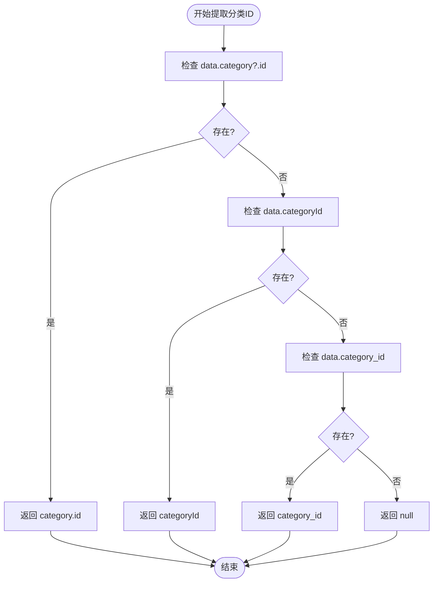
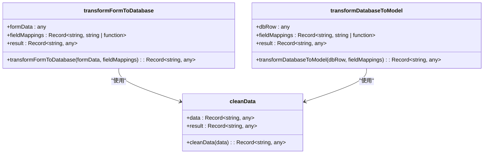
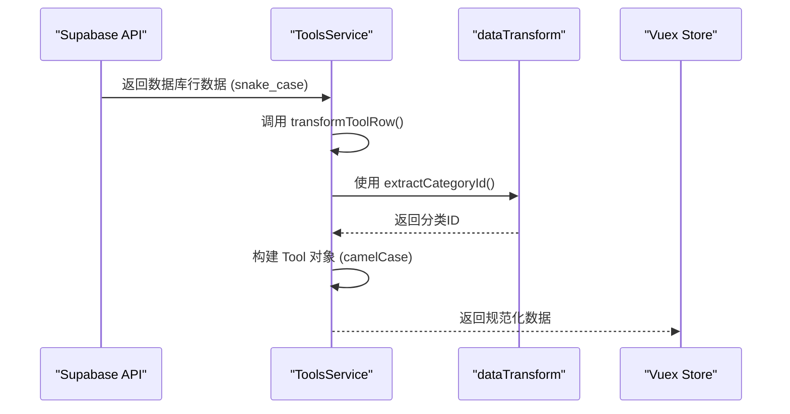

# 数据转换逻辑

<cite>
**本文档引用的文件**
- [dataTransform.ts](file://src/utils/dataTransform.ts#L1-L264)
- [toolsService.ts](file://src/services/toolsService.ts#L1-L470)
- [productsService.ts](file://src/services/productsService.ts#L1-L340)
</cite>

## 目录
1. [简介](#简介)
2. [核心数据转换函数](#核心数据转换函数)
3. [字段提取与验证](#字段提取与验证)
4. [表单与数据库格式转换](#表单与数据库格式转换)
5. [服务层中的数据转换应用](#服务层中的数据转换应用)
6. [异常处理与数据清理](#异常处理与数据清理)
7. [类型系统集成与扩展性](#类型系统集成与扩展性)
8. [总结](#总结)

## 简介
本文件详细解析 `dataTransform.ts` 模块在前端状态管理与 Supabase 数据库响应之间的桥梁作用。该模块提供了一套通用的数据转换工具，用于将 API 返回的原始数据结构映射为适合 Vuex Store 存储的规范化格式。通过字段重命名、类型转换和关系嵌套处理等机制，确保了应用状态的一致性和组件的高复用性。

**Section sources**
- [dataTransform.ts](file://src/utils/dataTransform.ts#L1-L20)

## 核心数据转换函数
`dataTransform.ts` 提供了两个核心的通用转换函数：`transformFormToDatabase` 和 `transformDatabaseToModel`，分别用于前端表单数据到数据库插入格式的转换，以及数据库行数据到前端业务对象的转换。

这两个函数接受一个字段映射配置对象，支持直接字段映射和自定义转换函数，实现了高度的灵活性和可复用性。

**Section sources**
- [dataTransform.ts](file://src/utils/dataTransform.ts#L100-L145)

## 字段提取与验证
为了解决不同数据源中字段命名不一致的问题（如 camelCase、snake_case、嵌套对象），模块提供了 `extractCategoryId` 和 `extractUserId` 等提取函数，能够从多种格式中智能地获取关键 ID。

同时，`requireCategoryId` 和 `validateRequiredFields` 等函数提供了严格的验证机制，在数据转换前确保必需字段的存在，防止因数据缺失导致的运行时错误。

**Diagram sources**
- [dataTransform.ts](file://src/utils/dataTransform.ts#L25-L55)

**Section sources**
- [dataTransform.ts](file://src/utils/dataTransform.ts#L25-L85)

## 表单与数据库格式转换
`transformFormToDatabase` 函数将前端表单数据（通常使用 camelCase）转换为符合数据库表结构（通常使用 snake_case）的插入格式。它通过 `fieldMappings` 配置对象实现字段名的映射。

`transformDatabaseToModel` 则执行相反的操作，将数据库返回的 snake_case 字段转换为前端模型所需的 camelCase 格式，并处理嵌套的关系数据（如工具的分类信息）。

**Diagram sources**
- [dataTransform.ts](file://src/utils/dataTransform.ts#L100-L145)
- [dataTransform.ts](file://src/utils/dataTransform.ts#L180-L195)

**Section sources**
- [dataTransform.ts](file://src/utils/dataTransform.ts#L100-L145)

## 服务层中的数据转换应用
在 `toolsService.ts` 和 `productsService.ts` 中，数据转换逻辑被直接应用于服务方法中。例如，`ToolsService` 的 `transformToolRow` 方法将 Supabase 返回的数据库行数据转换为前端 `Tool` 类型的业务对象。

该方法不仅进行字段重命名（如 `category_id` -> `category_id`），还处理了嵌套的分类对象，并为未实现的字段（如 `tags`）提供默认值，确保了返回数据的完整性和类型安全。

**Diagram sources**
- [toolsService.ts](file://src/services/toolsService.ts#L444-L464)
- [productsService.ts](file://src/services/productsService.ts#L315-L339)

**Section sources**
- [toolsService.ts](file://src/services/toolsService.ts#L444-L464)
- [productsService.ts](file://src/services/productsService.ts#L315-L339)

## 异常处理与数据清理
模块提供了 `cleanData` 函数，用于移除数据对象中的 `undefined` 和 `null` 值，防止向数据库插入无效数据。

`formatErrorMessage` 函数则用于统一错误消息的格式，便于在用户界面中展示。`deepMerge` 函数支持安全的对象合并，避免了浅合并可能带来的引用污染问题。

这些工具函数共同确保了数据在转换过程中的安全性和健壮性。

**Section sources**
- [dataTransform.ts](file://src/utils/dataTransform.ts#L197-L240)

## 类型系统集成与扩展性
所有转换函数都与 TypeScript 类型系统紧密结合。`Tool` 和 `Product` 等接口在 `types/index.ts` 中定义，确保了转换后的数据符合预期的类型结构。

通过使用函数作为字段映射的值，开发者可以轻松扩展转换逻辑，例如添加日期格式化、数值计算或复杂的数据结构重组，而无需修改核心转换函数。

**Section sources**
- [dataTransform.ts](file://src/utils/dataTransform.ts#L100-L145)
- [types/index.ts](file://src/types/index.ts)

## 总结
`dataTransform.ts` 模块是整个应用数据流的关键枢纽。它通过提供一套可复用、类型安全的转换工具，有效地隔离了外部数据源与内部状态模型，极大地提升了代码的可维护性和健壮性。其设计模式为处理复杂的前后端数据交互提供了一个清晰、可靠的解决方案。