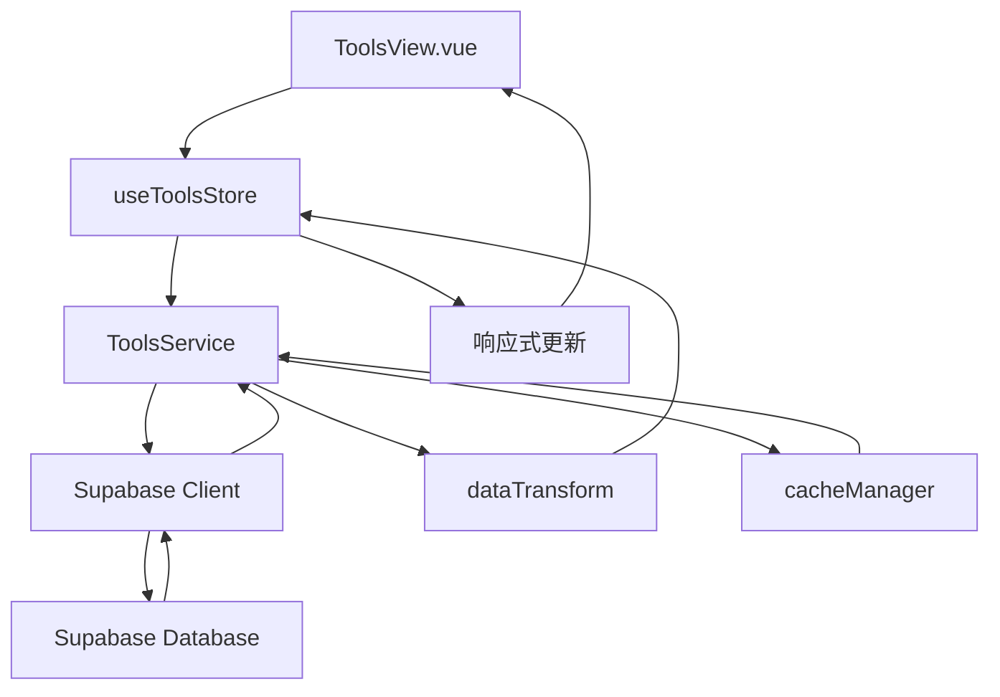
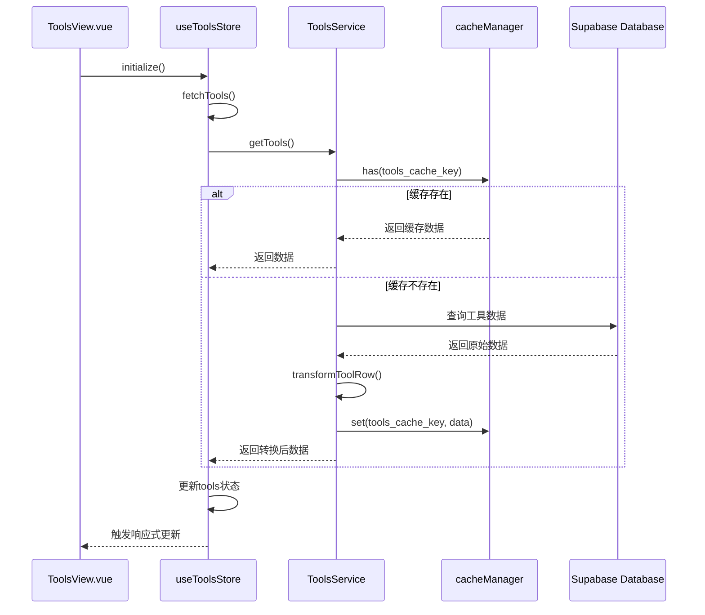
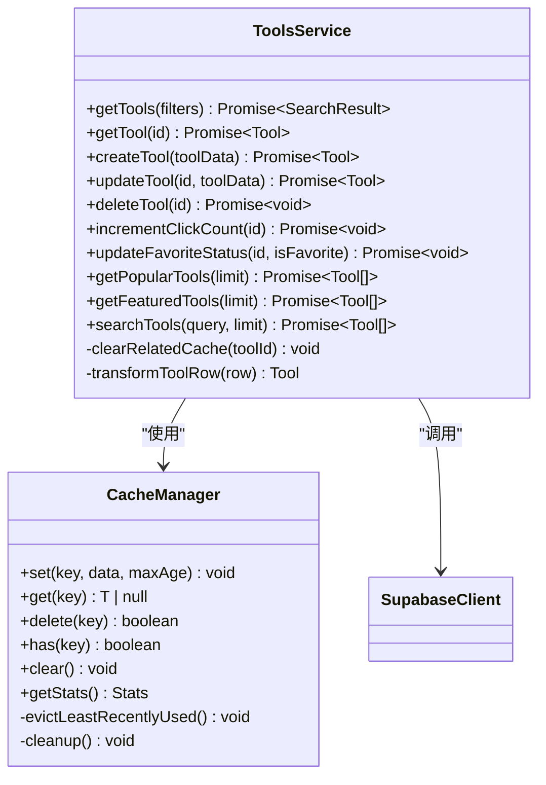
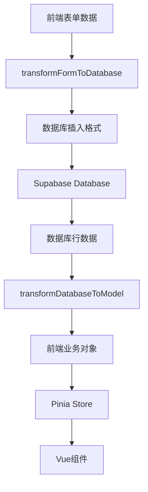
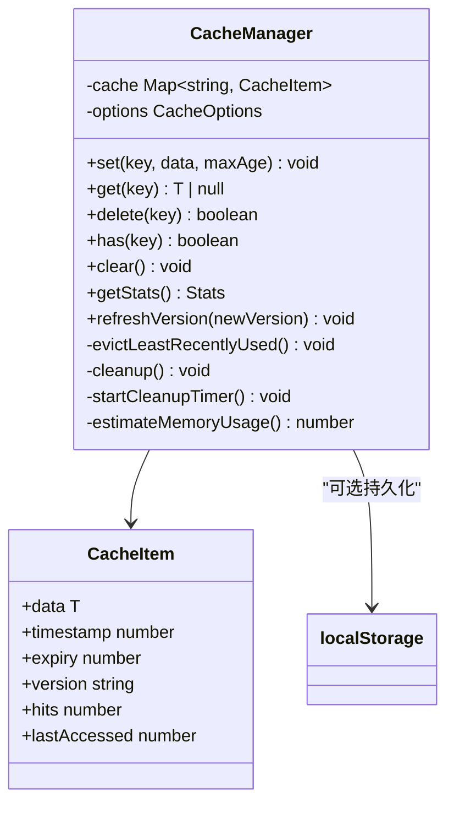
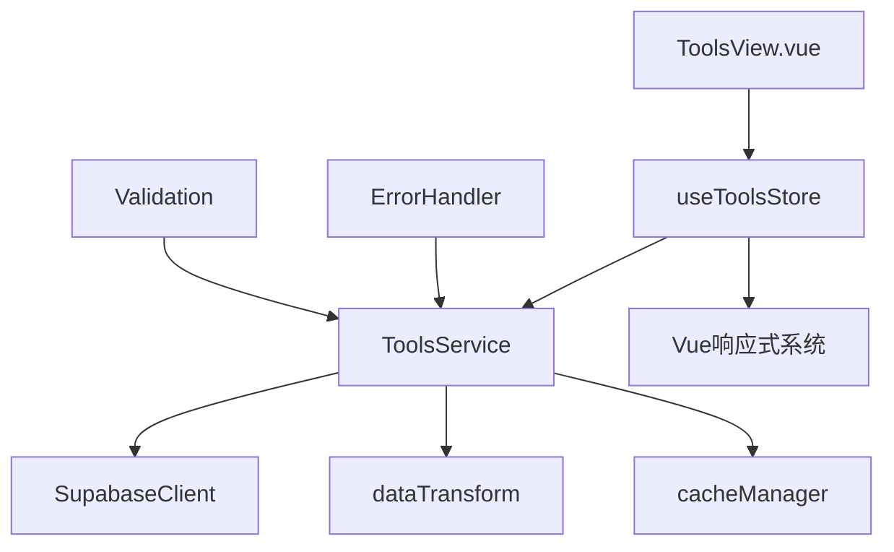

# 状态同步与数据更新机制

<cite>
**本文档引用文件**  
- [tools.ts](file://src/stores/tools.ts)
- [toolsService.ts](file://src/services/toolsService.ts)
- [dataTransform.ts](file://src/utils/dataTransform.ts)
- [cacheManager.ts](file://src/utils/cacheManager.ts)
- [ToolsView.vue](file://src/views/ToolsView.vue)
</cite>

## 目录
1. [简介](#简介)
2. [项目结构](#项目结构)
3. [核心组件](#核心组件)
4. [架构概述](#架构概述)
5. [详细组件分析](#详细组件分析)
6. [依赖分析](#依赖分析)
7. [性能考虑](#性能考虑)
8. [故障排除指南](#故障排除指南)
9. [结论](#结论)

## 简介
本文档详细阐述了Pinia store如何与services协同工作以实现全局状态管理。重点说明在调用services获取数据后，store如何通过actions提交mutations更新state，并触发视图响应式更新。文档详细描述了`dataTransform.ts`在原始API响应与store状态结构之间的数据映射作用，以及`cacheManager.ts`如何优化重复请求性能。以“加载工具列表”为例，展示了从`ToolsView`发起请求→`toolsService.fetchAll()`→返回数据→`dataTransform`格式化→`store.setTools()`更新状态→组件渲染的完整链条。涵盖加载状态（loading）、错误状态（error）和缓存策略的实现方式，并提供处理并发请求和状态竞态的解决方案。

## 项目结构
项目采用模块化设计，主要分为以下几个核心目录：
- `src/components`: 可复用的UI组件
- `src/services`: 业务逻辑和API调用服务
- `src/stores`: Pinia状态管理模块
- `src/utils`: 工具函数和辅助模块
- `src/views`: 页面级视图组件

状态管理的核心文件位于`src/stores`目录下的`tools.ts`，数据服务位于`src/services`目录下的`toolsService.ts`，数据转换和缓存管理分别由`src/utils`目录下的`dataTransform.ts`和`cacheManager.ts`提供支持。

**Section sources**
- [tools.ts](file://src/stores/tools.ts)
- [toolsService.ts](file://src/services/toolsService.ts)

## 核心组件
核心组件包括Pinia store、services、data transform工具和cache manager。`useToolsStore`负责管理工具列表的状态，包括工具数据、加载状态和错误信息。`ToolsService`提供工具数据的CRUD操作和搜索功能。`dataTransform.ts`提供数据格式转换和验证功能。`cacheManager.ts`提供智能缓存管理，优化数据加载性能。

**Section sources**
- [tools.ts](file://src/stores/tools.ts#L1-L342)
- [toolsService.ts](file://src/services/toolsService.ts#L1-L470)
- [dataTransform.ts](file://src/utils/dataTransform.ts#L1-L265)
- [cacheManager.ts](file://src/utils/cacheManager.ts#L1-L396)

## 架构概述
系统采用分层架构，从视图层到数据层形成清晰的数据流。视图组件通过调用store的actions来触发数据更新，store调用services获取数据，services使用Supabase客户端与后端数据库交互。数据经过transform后更新store状态，触发视图响应式更新。

**Diagram sources**
- [ToolsView.vue](file://src/views/ToolsView.vue#L1-L799)
- [tools.ts](file://src/stores/tools.ts#L1-L342)
- [toolsService.ts](file://src/services/toolsService.ts#L1-L470)
- [dataTransform.ts](file://src/utils/dataTransform.ts#L1-L265)
- [cacheManager.ts](file://src/utils/cacheManager.ts#L1-L396)

## 详细组件分析

### 工具状态管理分析
`useToolsStore`是管理工具列表的核心状态管理模块，采用Pinia store模式实现全局状态管理。

#### 状态定义
store定义了多个响应式状态变量：
- `tools`: 存储工具列表数据
- `loading`: 标识数据加载状态
- `error`: 存储错误信息
- `initialized`: 标识store是否已初始化
- `searchQuery`: 搜索查询关键字
- `selectedCategory`: 选中的分类
- `sidebarCollapsed`: 侧边栏折叠状态

#### 计算属性
`filteredTools`是一个计算属性，根据`searchQuery`动态过滤工具列表，实现响应式搜索功能。

#### Actions方法
`fetchTools`是核心action方法，负责从后端获取工具数据。方法实现中包含了环境变量检查、模拟数据回退和错误处理机制。

**Diagram sources**
- [tools.ts](file://src/stores/tools.ts#L1-L342)
- [toolsService.ts](file://src/services/toolsService.ts#L1-L470)
- [cacheManager.ts](file://src/utils/cacheManager.ts#L1-L396)

**Section sources**
- [tools.ts](file://src/stores/tools.ts#L1-L342)

### 数据服务分析
`ToolsService`类提供工具数据的CRUD操作和搜索功能，是连接store和数据源的桥梁。

#### 缓存机制
服务采用`withCache`装饰器实现智能缓存，减少不必要的API调用。不同的数据操作有不同的缓存策略：
- 工具列表：2分钟缓存
- 单个工具：5分钟缓存
- 热门工具：5分钟缓存
- 推荐工具：10分钟缓存

#### 数据转换
`transformToolRow`方法负责将数据库行数据转换为前端业务对象，确保数据结构的一致性。

#### 缓存清理
在创建、更新、删除操作后，`clearRelatedCache`方法会清理相关缓存，确保数据一致性。

**Diagram sources**
- [toolsService.ts](file://src/services/toolsService.ts#L1-L470)
- [cacheManager.ts](file://src/utils/cacheManager.ts#L1-L396)

**Section sources**
- [toolsService.ts](file://src/services/toolsService.ts#L1-L470)

### 数据转换分析
`dataTransform.ts`提供了一系列数据转换和验证工具函数，确保数据在不同层之间正确传递。

#### 字段提取
`extractCategoryId`和`extractUserId`函数支持从不同格式的数据中提取ID，提高代码的灵活性和健壮性。

#### 数据验证
`validateRequiredFields`函数验证必需字段，确保数据完整性。

#### 对象转换
`transformFormToDatabase`和`transformDatabaseToModel`函数实现前后端数据格式的双向转换。

**Diagram sources**
- [dataTransform.ts](file://src/utils/dataTransform.ts#L1-L265)

**Section sources**
- [dataTransform.ts](file://src/utils/dataTransform.ts#L1-L265)

### 缓存管理分析
`cacheManager.ts`实现了智能缓存管理器，优化数据加载性能。

#### 缓存策略
缓存管理器支持多种缓存策略：
- 内存缓存：默认缓存实例
- localStorage持久化：支持序列化存储
- 不同数据类型不同缓存实例

#### 缓存清理
实现定时清理过期缓存，每分钟执行一次，确保缓存数据的有效性。

#### 统计信息
提供缓存统计信息，包括命中率、内存使用量等，便于性能监控。

**Diagram sources**
- [cacheManager.ts](file://src/utils/cacheManager.ts#L1-L396)

**Section sources**
- [cacheManager.ts](file://src/utils/cacheManager.ts#L1-L396)

## 依赖分析
系统各组件之间存在清晰的依赖关系，形成单向数据流。

**Diagram sources**
- [ToolsView.vue](file://src/views/ToolsView.vue#L1-L799)
- [tools.ts](file://src/stores/tools.ts#L1-L342)
- [toolsService.ts](file://src/services/toolsService.ts#L1-L470)
- [dataTransform.ts](file://src/utils/dataTransform.ts#L1-L265)
- [cacheManager.ts](file://src/utils/cacheManager.ts#L1-L396)

**Section sources**
- [tools.ts](file://src/stores/tools.ts#L1-L342)
- [toolsService.ts](file://src/services/toolsService.ts#L1-L470)

## 性能考虑
系统在性能方面做了多项优化：

1. **缓存优化**：通过`cacheManager`减少重复API调用，提高数据加载速度。
2. **响应式优化**：使用Pinia的响应式系统，确保状态更新高效。
3. **错误回退**：在Supabase调用失败时回退到模拟数据，保证用户体验。
4. **并发控制**：`fetchTools`方法中检查`loading`状态，防止并发请求。
5. **内存管理**：缓存管理器定期清理过期数据，防止内存泄漏。

## 故障排除指南
### 常见问题及解决方案

#### 数据加载失败
- **现象**：页面显示"加载失败"错误
- **原因**：Supabase环境变量未配置或网络问题
- **解决方案**：检查`.env`文件中的`VITE_SUPABASE_URL`和`VITE_SUPABASE_ANON_KEY`配置

#### 缓存数据不更新
- **现象**：数据更新后页面显示旧数据
- **原因**：缓存未及时清理
- **解决方案**：检查`clearRelatedCache`方法是否在数据变更后正确调用

#### 搜索功能不工作
- **现象**：搜索无结果或结果不准确
- **原因**：搜索查询未正确传递到服务层
- **解决方案**：检查`ToolsView.vue`中的`handleSearch`方法和store的`setSearchQuery`调用

#### 并发请求问题
- **现象**：多次快速点击导致重复请求
- **原因**：缺少请求状态检查
- **解决方案**：确保在`fetchTools`等方法中检查`loading`状态

**Section sources**
- [tools.ts](file://src/stores/tools.ts#L1-L342)
- [toolsService.ts](file://src/services/toolsService.ts#L1-L470)
- [ToolsView.vue](file://src/views/ToolsView.vue#L1-L799)

## 结论
本文档详细阐述了Pinia store与services协同工作的状态同步机制。通过`useToolsStore`、`ToolsService`、`dataTransform`和`cacheManager`的协同工作，实现了高效、可靠的状态管理。系统采用分层架构，数据流清晰，具备良好的可维护性和扩展性。缓存机制和错误处理策略确保了应用的性能和用户体验。建议在开发新功能时遵循相同的架构模式，保持代码的一致性和质量。