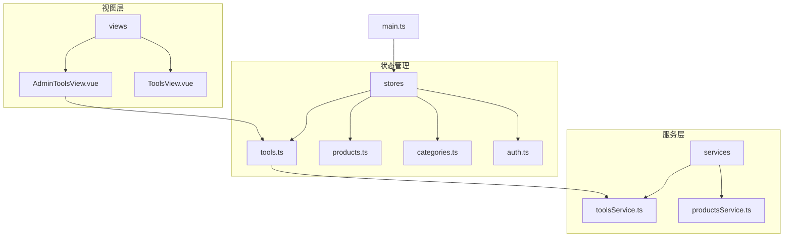
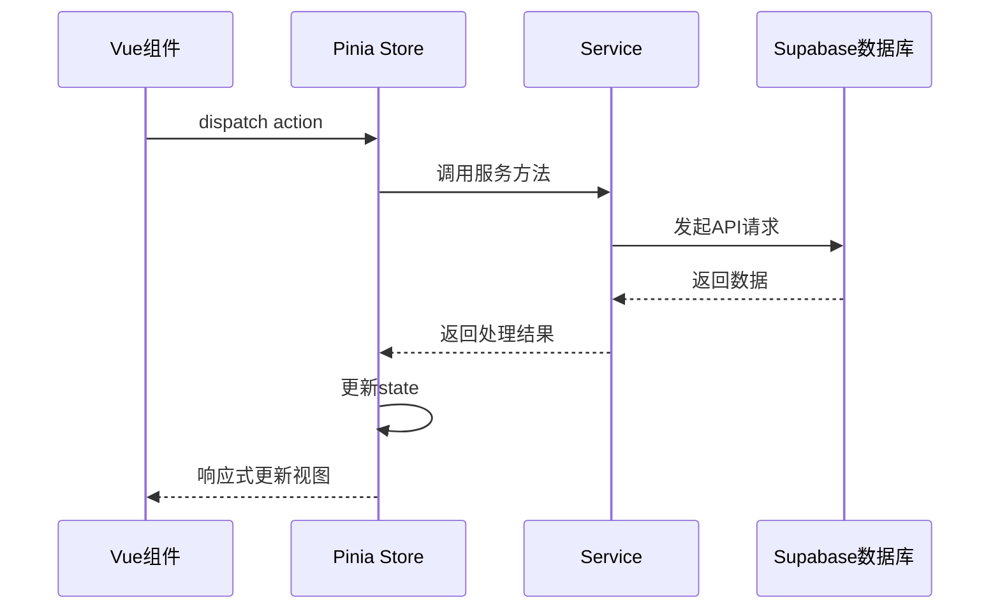
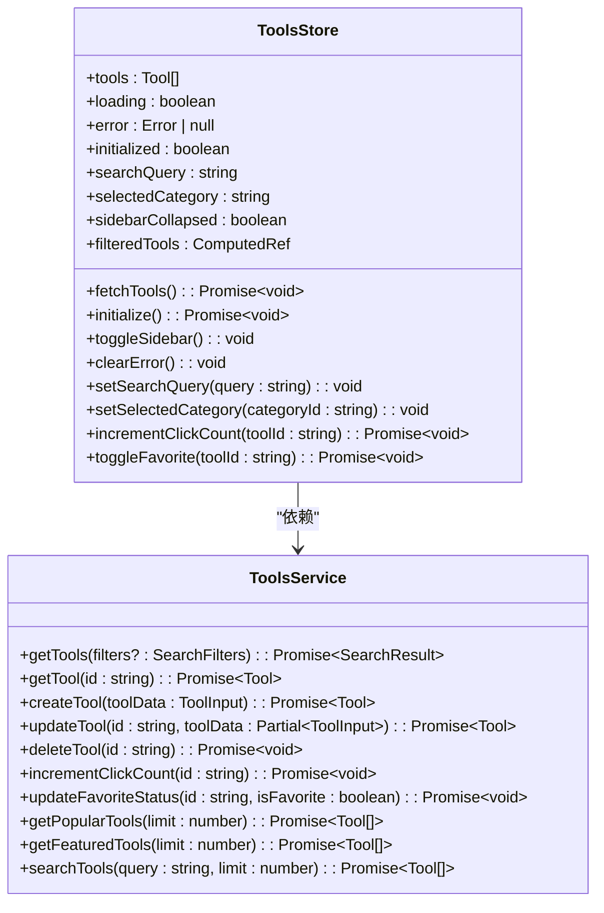
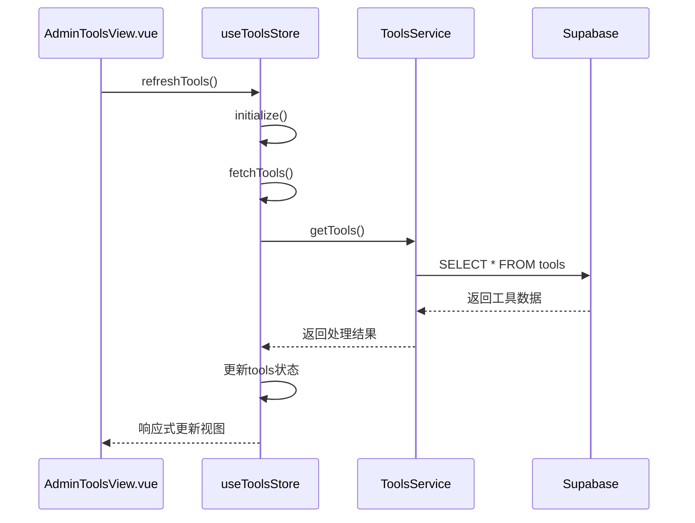
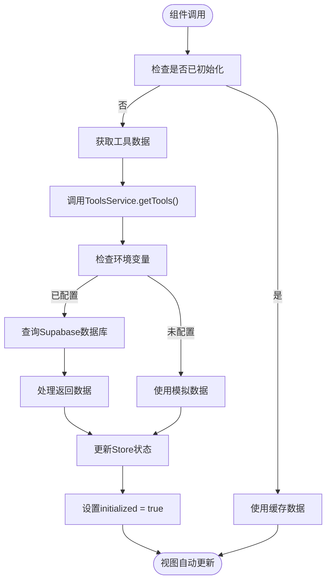
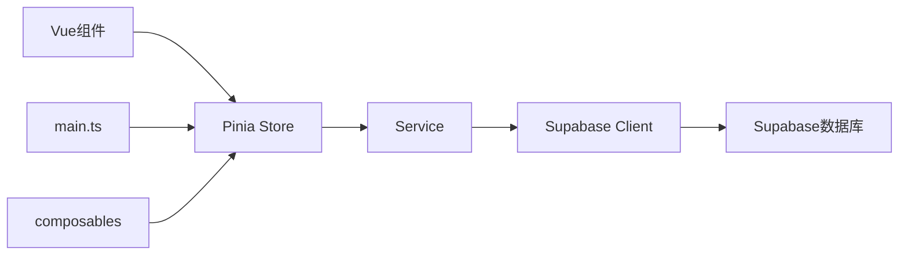

# 状态管理架构

<cite>
**本文档引用的文件**
- [tools.ts](file://src/stores/tools.ts)
- [products.ts](file://src/stores/products.ts)
- [categories.ts](file://src/stores/categories.ts)
- [auth.ts](file://src/stores/auth.ts)
- [main.ts](file://src/main.ts)
- [toolsService.ts](file://src/services/toolsService.ts)
- [AdminToolsView.vue](file://src/views/AdminToolsView.vue)
</cite>

## 目录
1. [项目结构](#项目结构)
2. [核心组件](#核心组件)
3. [架构概述](#架构概述)
4. [详细组件分析](#详细组件分析)
5. [依赖分析](#依赖分析)
6. [性能考虑](#性能考虑)
7. [故障排除指南](#故障排除指南)
8. [结论](#结论)

## 项目结构

项目采用模块化设计，状态管理主要集中在`src/stores`目录下，每个store模块负责特定领域的状态管理。应用启动时通过`main.ts`集中初始化所有核心store。

**图表来源**
- [tools.ts](file://src/stores/tools.ts)
- [products.ts](file://src/stores/products.ts)
- [categories.ts](file://src/stores/categories.ts)
- [auth.ts](file://src/stores/auth.ts)
- [main.ts](file://src/main.ts)

**章节来源**
- [main.ts](file://src/main.ts#L1-L58)

## 核心组件

基于Pinia的状态管理架构实现了模块化设计，每个store模块（如tools、products、auth）独立封装其状态、计算属性和操作。actions封装异步逻辑并调用services获取数据，通过$patch或直接修改state保证状态变更的可追踪性。

**章节来源**
- [tools.ts](file://src/stores/tools.ts#L1-L341)
- [products.ts](file://src/stores/products.ts#L1-L361)
- [categories.ts](file://src/stores/categories.ts#L1-L197)
- [auth.ts](file://src/stores/auth.ts)

## 架构概述

系统采用分层架构，Vue组件通过store与服务层交互，服务层再与Supabase数据库通信。状态变更遵循单向数据流原则，确保数据一致性。

**图表来源**
- [tools.ts](file://src/stores/tools.ts#L1-L341)
- [toolsService.ts](file://src/services/toolsService.ts#L1-L470)
- [AdminToolsView.vue](file://src/views/AdminToolsView.vue#L1-L799)

## 详细组件分析

### 工具模块分析

工具模块实现了完整的CRUD操作，包含加载状态管理和错误处理机制。

#### 对象导向组件

**图表来源**
- [tools.ts](file://src/stores/tools.ts#L1-L341)
- [toolsService.ts](file://src/services/toolsService.ts#L1-L470)

#### API/服务组件

**图表来源**
- [AdminToolsView.vue](file://src/views/AdminToolsView.vue#L1-L799)
- [tools.ts](file://src/stores/tools.ts#L1-L341)
- [toolsService.ts](file://src/services/toolsService.ts#L1-L470)

#### 复杂逻辑组件

**图表来源**
- [tools.ts](file://src/stores/tools.ts#L1-L341)
- [toolsService.ts](file://src/services/toolsService.ts#L1-L470)

**章节来源**
- [tools.ts](file://src/stores/tools.ts#L1-L341)
- [toolsService.ts](file://src/services/toolsService.ts#L1-L470)
- [AdminToolsView.vue](file://src/views/AdminToolsView.vue#L1-L799)

## 依赖分析

系统各组件之间存在清晰的依赖关系，遵循依赖倒置原则，高层模块依赖于抽象而非具体实现。

**图表来源**
- [main.ts](file://src/main.ts#L1-L58)
- [tools.ts](file://src/stores/tools.ts#L1-L341)
- [toolsService.ts](file://src/services/toolsService.ts#L1-L470)

**章节来源**
- [main.ts](file://src/main.ts#L1-L58)
- [tools.ts](file://src/stores/tools.ts#L1-L341)
- [toolsService.ts](file://src/services/toolsService.ts#L1-L470)

## 性能考虑

状态管理架构在性能方面进行了多项优化：
- 使用缓存机制减少重复API调用
- 并发初始化多个store提升启动速度
- 计算属性实现响应式数据过滤
- 错误处理机制确保应用稳定性

## 故障排除指南

常见问题及解决方案：
- **Store未初始化**：确保在`main.ts`中正确调用`initializeCoreStores`
- **数据未更新**：检查store的state是否正确更新，确保使用ref包装可响应数据
- **API调用失败**：验证Supabase环境变量配置正确
- **缓存问题**：在数据变更后及时清理相关缓存

**章节来源**
- [tools.ts](file://src/stores/tools.ts#L1-L341)
- [main.ts](file://src/main.ts#L1-L58)
- [toolsService.ts](file://src/services/toolsService.ts#L1-L470)

## 结论

基于Pinia的状态管理架构实现了模块化、可维护的设计，通过清晰的分层和依赖管理，确保了应用状态的一致性和可预测性。各store模块独立封装业务逻辑，与Vue组件通过响应式连接机制无缝集成，为复杂应用提供了可靠的状态管理解决方案。