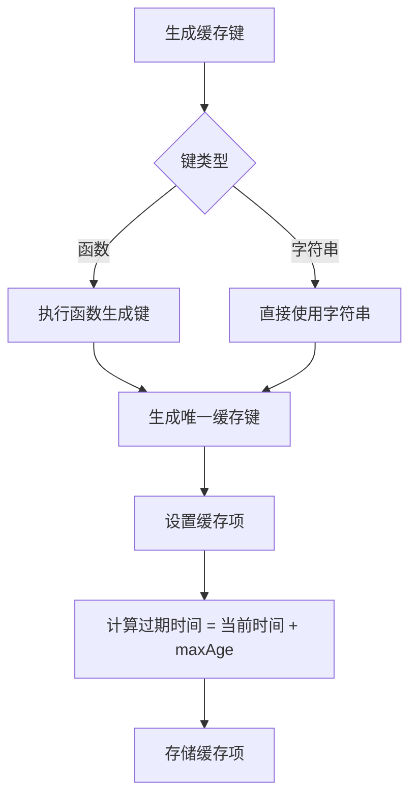
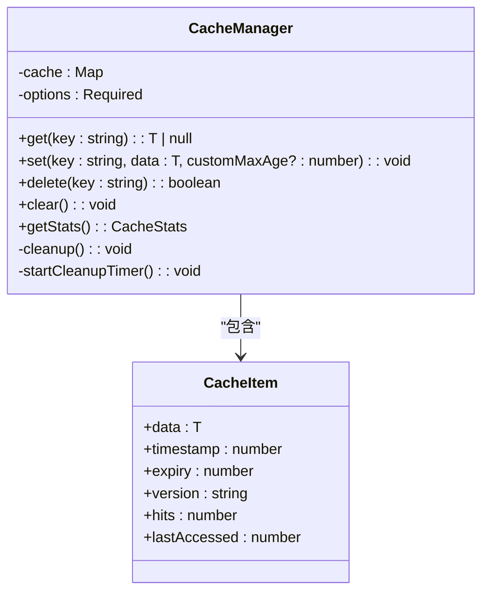
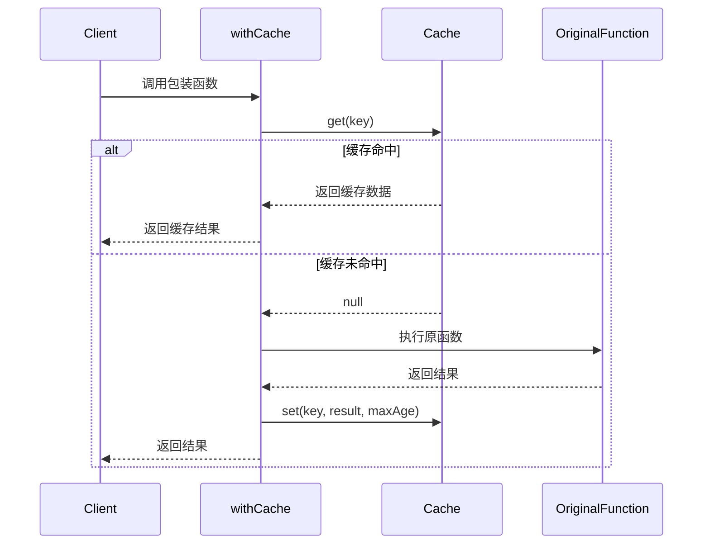

# 缓存策略

<cite>
**本文档引用的文件**   
- [cacheManager.ts](file://src/utils/cacheManager.ts)
- [toolsService.ts](file://src/services/toolsService.ts)
- [productsService.ts](file://src/services/productsService.ts)
- [LocalManagementView.vue](file://src/views/admin/LocalManagementView.vue)
</cite>

## 目录
1. [缓存管理器设计](#缓存管理器设计)
2. [缓存键生成与TTL管理](#缓存键生成与ttl管理)
3. [过期检查与自动清理](#过期检查与自动清理)
4. [服务层缓存集成](#服务层缓存集成)
5. [getWithCache包装器执行流程](#getwithcache包装器执行流程)
6. [缓存失效策略](#缓存失效策略)
7. [缓存问题预防](#缓存问题预防)
8. [多模块共享缓存](#多模块共享缓存)

## 缓存管理器设计

缓存管理器（CacheManager）采用内存存储机制，结合Vue的响应式系统实现高效的数据缓存。通过`reactive<Map<string, CacheItem>>`创建响应式缓存映射，确保缓存操作的实时性和响应性。缓存项包含数据、时间戳、过期时间、版本号、访问次数和最后访问时间等元信息，为缓存管理提供全面的数据支持。

缓存管理器支持多种实例化配置，包括默认缓存、图片缓存和API数据缓存，满足不同场景的需求。其中，图片缓存设置较长的生存时间（30分钟）和较小的缓存容量（50项），而API数据缓存则设置较短的生存时间（3分钟）和较大的缓存容量（200项），体现了针对不同数据类型的优化策略。

**Section sources**
- [cacheManager.ts](file://src/utils/cacheManager.ts#L0-L51)
- [cacheManager.ts](file://src/utils/cacheManager.ts#L255-L308)

## 缓存键生成与TTL管理

缓存键生成策略采用动态函数或静态字符串两种方式。在`toolsService`中，通过`JSON.stringify(filters || {})`将搜索过滤器序列化为缓存键，确保不同查询条件对应不同的缓存项。例如，获取工具列表的缓存键格式为`tools_{"query":"searchTerm","category":"categoryId"}`，实现了基于查询参数的精确缓存。

TTL（生存时间）管理通过`maxAge`参数实现，支持全局默认值和单个缓存项的自定义值。默认缓存的TTL为5分钟，API数据缓存为3分钟，图片缓存为30分钟。当设置缓存时，可传入`customMaxAge`参数覆盖默认值，提供了灵活的生存时间控制机制。

**Diagram sources**
- [cacheManager.ts](file://src/utils/cacheManager.ts#L48-L113)
- [toolsService.ts](file://src/services/toolsService.ts#L25-L35)

## 过期检查与自动清理

过期检查机制在获取缓存时执行，通过比较当前时间与缓存项的`expiry`时间判断是否过期。若缓存已过期，则从缓存中删除并返回null，确保不会返回陈旧数据。同时，缓存管理器还检查版本号，当缓存版本与当前版本不匹配时也会清除缓存，支持缓存的批量失效。

自动清理机制通过定时器实现，每分钟执行一次`cleanup()`方法。该方法遍历所有缓存项，收集过期或版本不匹配的键，并批量删除。这种定期清理的方式避免了每次获取缓存时都进行完整遍历的性能开销，同时确保过期缓存能及时清除。

**Diagram sources**
- [cacheManager.ts](file://src/utils/cacheManager.ts#L165-L219)
- [cacheManager.ts](file://src/utils/cacheManager.ts#L107-L167)

## 服务层缓存集成

在`toolsService`和`productsService`中，通过`withCache`装饰器集成缓存，有效避免重复请求，提升页面加载性能。`toolsService`对`getTools`、`getTool`、`getPopularTools`和`getFeaturedTools`等方法应用缓存，根据不同的数据更新频率设置相应的TTL。

`toolsService`中的缓存集成示例：
- 工具列表：2分钟TTL，缓存键包含所有过滤条件
- 单个工具：5分钟TTL，缓存键为`tool_{id}`
- 热门工具：5分钟TTL，缓存键为`popular_tools_{limit}`
- 推荐工具：10分钟TTL，缓存键为`featured_tools_{limit}`

这种分层缓存策略平衡了数据新鲜度和性能优化，对于更新频繁的工具列表采用较短的缓存时间，而对于相对稳定的推荐工具则采用较长的缓存时间。

**Section sources**
- [toolsService.ts](file://src/services/toolsService.ts#L25-L100)
- [productsService.ts](file://src/services/productsService.ts#L15-L50)

## getWithCache包装器执行流程

`withCache`装饰器实现了"先查缓存→命中则返回→未命中则请求并写入缓存"的标准执行流程。该流程通过高阶函数实现，包装原始异步函数，添加缓存逻辑而不改变原函数的调用方式。

执行流程如下：
1. 根据缓存键策略生成缓存键
2. 尝试从指定缓存实例获取数据
3. 若缓存命中，直接返回缓存结果
4. 若缓存未命中，执行原始函数获取数据
5. 将获取的数据写入缓存
6. 返回结果

**Diagram sources**
- [cacheManager.ts](file://src/utils/cacheManager.ts#L304-L353)
- [toolsService.ts](file://src/services/toolsService.ts#L25-L35)

## 缓存失效策略

缓存失效策略包括手动清除和写操作后失效两种机制。手动清除通过`clear()`和`delete(key)`方法实现，支持清除所有缓存或指定键的缓存。在`LocalManagementView.vue`中提供了清理缓存的UI界面，允许管理员手动清理缓存。

写操作后失效策略在数据变更时自动触发，确保缓存数据与数据库保持一致。在`toolsService`中，`createTool`、`updateTool`和`deleteTool`等写操作方法在执行成功后调用`clearRelatedCache()`方法，清除相关缓存。例如，创建或更新工具后，会清除工具列表缓存和特定工具缓存，确保下次读取时能获取最新数据。

这种失效策略对用户体验和服务器负载有显著影响：
- **用户体验**：确保用户看到的数据始终是最新的，避免了数据不一致的问题
- **服务器负载**：通过批量清除相关缓存而非逐个清除，减少了数据库查询次数，降低了服务器压力

**Section sources**
- [toolsService.ts](file://src/services/toolsService.ts#L300-L320)
- [LocalManagementView.vue](file://src/views/admin/LocalManagementView.vue#L37-L77)

## 缓存问题预防

为预防缓存击穿和雪崩问题，系统采用了多种措施：

**缓存击穿预防**：
- 使用`evictLeastRecentlyUsed()`方法实现LRU（最近最少使用）淘汰策略，当缓存达到最大容量时自动清除最少使用的缓存项
- 通过版本控制机制，当缓存版本更新时批量清除所有缓存，避免大量缓存同时失效

**缓存雪崩预防**：
- 不同类型的数据设置不同的TTL，避免大量缓存同时过期
- 定期清理（每分钟）而非精确到秒的过期检查，分散清理操作的时间点
- 使用`refreshVersion()`方法支持缓存的平滑更新，避免一次性清除所有缓存

此外，系统还实现了缓存统计功能，通过`getStats()`方法获取缓存的命中率、有效项数、过期项数和内存使用量等指标，为缓存性能优化提供数据支持。

**Section sources**
- [cacheManager.ts](file://src/utils/cacheManager.ts#L165-L167)
- [cacheManager.ts](file://src/utils/cacheManager.ts#L107-L167)

## 多模块共享缓存

系统实现了多store模块间的共享缓存模式，通过创建不同的缓存实例满足不同场景的需求：

- `defaultCache`：默认缓存实例，用于一般数据缓存，支持序列化到localStorage
- `imageCache`：图片缓存实例，较长的TTL和较小的容量，不序列化（图片数据不适合序列化）
- `apiCache`：API数据缓存实例，较短的TTL和较大的容量，支持序列化

这种多实例模式实现了缓存的隔离和专业化，避免了不同类型数据的相互影响。同时，所有缓存实例都基于同一个`CacheManager`类，确保了缓存管理逻辑的一致性和可维护性。

共享缓存模式的优势包括：
- **性能优化**：不同类型的数据采用最适合的缓存策略
- **内存管理**：通过容量限制和LRU淘汰防止内存泄漏
- **数据持久化**：关键数据可序列化到localStorage，实现页面刷新后的缓存保留
- **版本控制**：支持缓存的批量更新和清除，便于应用升级时的数据管理

**Section sources**
- [cacheManager.ts](file://src/utils/cacheManager.ts#L255-L308)
- [cacheManager.ts](file://src/utils/cacheManager.ts#L214-L260)