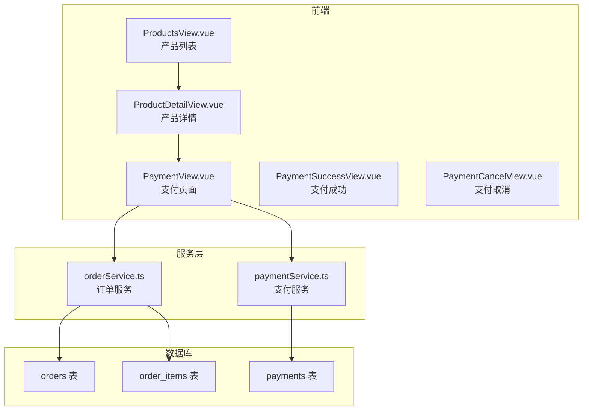
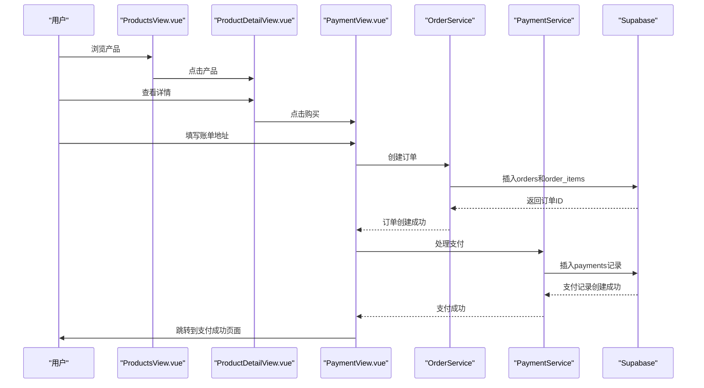
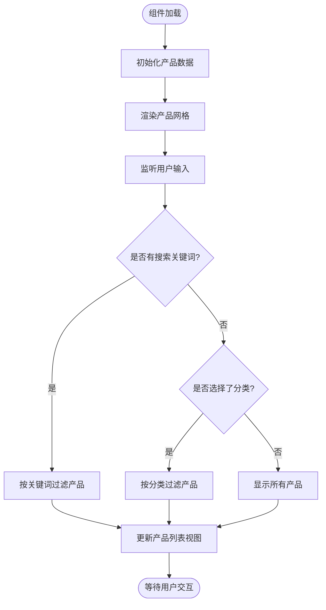
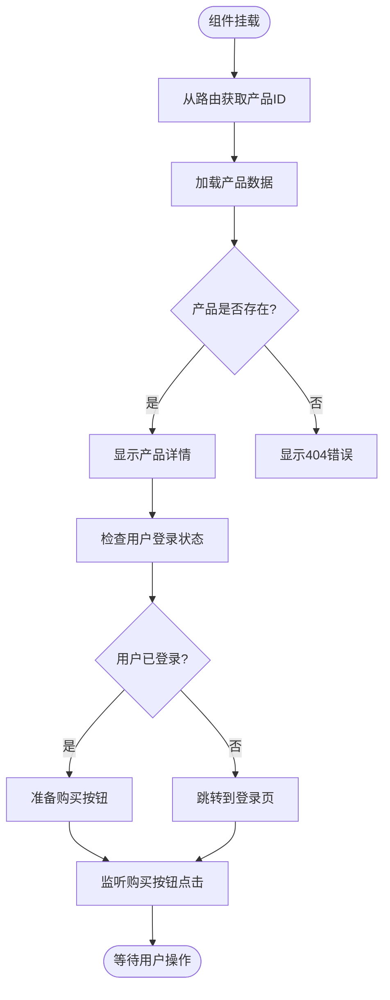
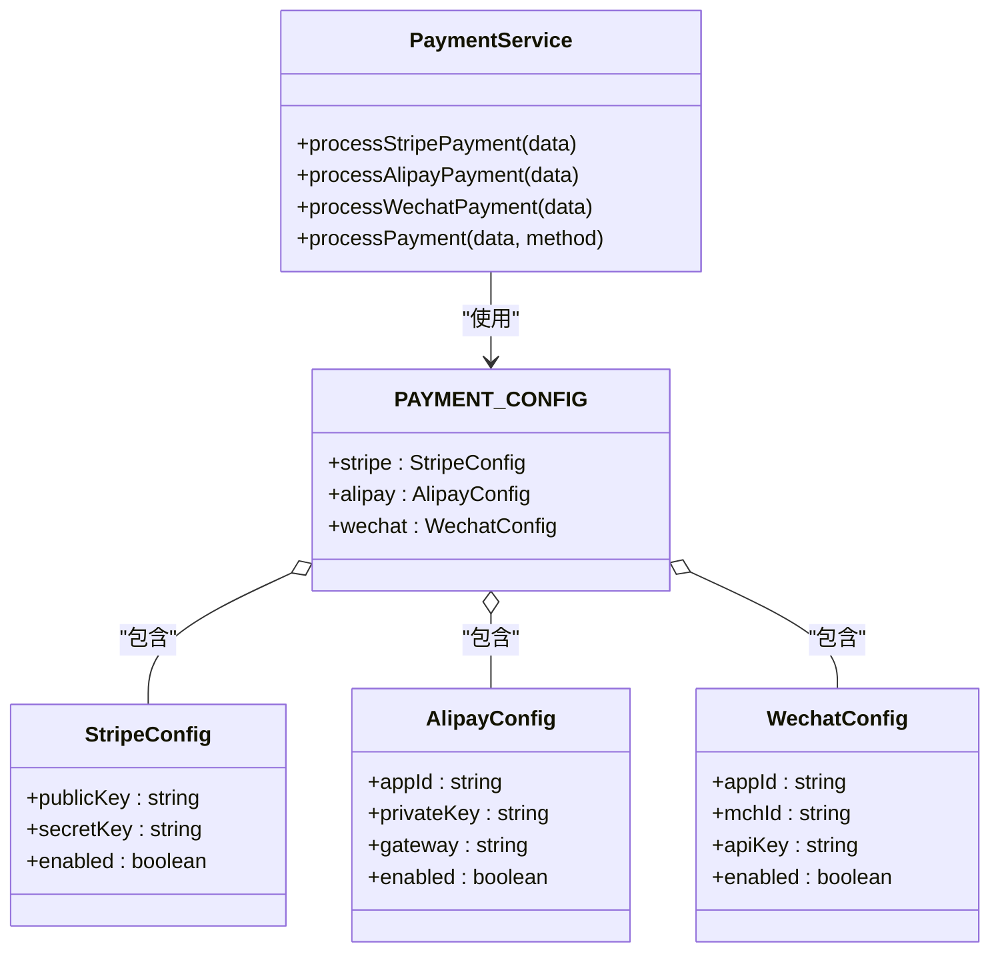
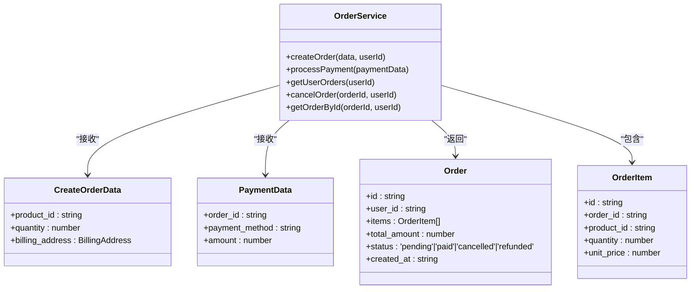
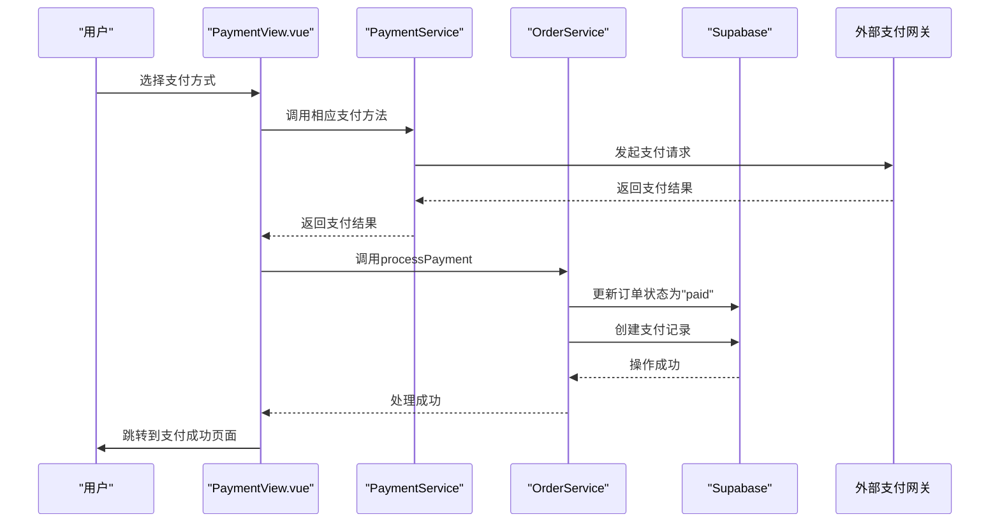

# 产品购买系统

<cite>
**本文档引用的文件**
- [ProductsView.vue](file://src/views/ProductsView.vue)
- [ProductDetailView.vue](file://src/views/ProductDetailView.vue)
- [PaymentView.vue](file://src/views/PaymentView.vue)
- [paymentService.ts](file://src/services/paymentService.ts)
- [orderService.ts](file://src/services/orderService.ts)
- [20241224000001_initial_schema.sql](file://supabase/migrations/20241224000001_initial_schema.sql)
- [StripePayment.vue](file://src/components/StripePayment.vue)
- [AlipayPayment.vue](file://src/components/AlipayPayment.vue)
- [WechatPayment.vue](file://src/components/WechatPayment.vue)
- [PaymentSuccessView.vue](file://src/views/PaymentSuccessView.vue)
- [PaymentCancelView.vue](file://src/views/PaymentCancelView.vue)
</cite>

## 目录
1. [引言](#引言)
2. [项目结构](#项目结构)
3. [核心组件](#核心组件)
4. [架构概述](#架构概述)
5. [详细组件分析](#详细组件分析)
6. [依赖分析](#依赖分析)
7. [性能考虑](#性能考虑)
8. [故障排除指南](#故障排除指南)
9. [结论](#结论)

## 引言
本系统实现了从商品展示到支付完成的完整购买闭环。用户可以通过ProductsView.vue浏览和筛选产品，通过ProductDetailView.vue查看产品详情并发起购买流程。购买流程的核心是PaymentView.vue，它负责订单创建、支付方式选择和支付处理。系统集成了多种支付方式（Stripe、支付宝、微信），并通过paymentService统一管理支付逻辑。订单数据存储在Supabase数据库中，orders表记录了订单状态和相关信息。整个流程包括异常处理机制，如支付失败或重复提交的应对策略。

## 项目结构
系统采用Vue 3 + TypeScript技术栈，遵循模块化设计原则。主要目录包括：
- `src/views`：存放所有页面视图组件
- `src/services`：存放业务逻辑服务
- `src/components`：存放可复用的UI组件
- `src/lib`：存放与Supabase的集成代码
- `supabase/migrations`：存放数据库迁移脚本

**图表来源**
- [ProductsView.vue](file://src/views/ProductsView.vue)
- [ProductDetailView.vue](file://src/views/ProductDetailView.vue)
- [PaymentView.vue](file://src/views/PaymentView.vue)
- [orderService.ts](file://src/services/orderService.ts)
- [paymentService.ts](file://src/services/paymentService.ts)
- [20241224000001_initial_schema.sql](file://supabase/migrations/20241224000001_initial_schema.sql)

**章节来源**
- [ProductsView.vue](file://src/views/ProductsView.vue)
- [ProductDetailView.vue](file://src/views/ProductDetailView.vue)
- [PaymentView.vue](file://src/views/PaymentView.vue)

## 核心组件

### 产品列表视图 (ProductsView.vue)
该组件负责展示所有可购买的产品，提供搜索、分类筛选和网格/列表视图切换功能。用户可以点击"立即购买"按钮直接进入支付流程。

**章节来源**
- [ProductsView.vue](file://src/views/ProductsView.vue#L1-L738)

### 产品详情视图 (ProductDetailView.vue)
该组件显示单个产品的详细信息，包括名称、价格、描述和标签。用户可以在此页面点击"立即购买"按钮，系统会检查用户登录状态，未登录则跳转到登录页，已登录则跳转到支付页面。

**章节来源**
- [ProductDetailView.vue](file://src/views/ProductDetailView.vue#L1-L501)

### 支付视图 (PaymentView.vue)
这是购买流程的核心组件，负责处理订单创建、支付方式选择和支付初始化。根据选择的支付方式，动态显示相应的支付组件（Stripe、支付宝或微信）。

**章节来源**
- [PaymentView.vue](file://src/views/PaymentView.vue#L1-L793)

## 架构概述
系统采用分层架构设计，从前端视图到后端服务再到数据库，形成清晰的数据流和控制流。

**图表来源**
- [ProductsView.vue](file://src/views/ProductsView.vue)
- [ProductDetailView.vue](file://src/views/ProductDetailView.vue)
- [PaymentView.vue](file://src/views/PaymentView.vue)
- [orderService.ts](file://src/services/orderService.ts)
- [paymentService.ts](file://src/services/paymentService.ts)

## 详细组件分析

### 产品列表渲染逻辑
ProductsView.vue使用Vue的响应式系统管理产品数据和用户交互状态。通过计算属性filteredProducts实现搜索和分类筛选功能。

**图表来源**
- [ProductsView.vue](file://src/views/ProductsView.vue#L1-L738)

**章节来源**
- [ProductsView.vue](file://src/views/ProductsView.vue#L1-L738)

### 产品详情渲染逻辑
ProductDetailView.vue通过路由参数获取产品ID，然后加载相应的产品数据。组件还实现了收藏功能的状态管理。

**图表来源**
- [ProductDetailView.vue](file://src/views/ProductDetailView.vue#L1-L501)

**章节来源**
- [ProductDetailView.vue](file://src/views/ProductDetailView.vue#L1-L501)

### 支付服务集成
paymentService.ts统一管理所有支付方式的集成，通过配置对象管理不同支付平台的密钥和设置。

#### 支付方式配置

**图表来源**
- [paymentService.ts](file://src/services/paymentService.ts#L1-L387)

**章节来源**
- [paymentService.ts](file://src/services/paymentService.ts#L1-L387)

### 订单创建与状态管理
orderService.ts负责订单的全生命周期管理，包括创建、支付处理、状态更新等。

#### 订单服务类图

**图表来源**
- [orderService.ts](file://src/services/orderService.ts#L1-L787)

**章节来源**
- [orderService.ts](file://src/services/orderService.ts#L1-L787)

### 支付回调处理机制
系统通过不同的支付组件处理各种支付方式的回调，确保支付结果能够正确更新订单状态。

#### 支付流程序列图

**图表来源**
- [PaymentView.vue](file://src/views/PaymentView.vue)
- [paymentService.ts](file://src/services