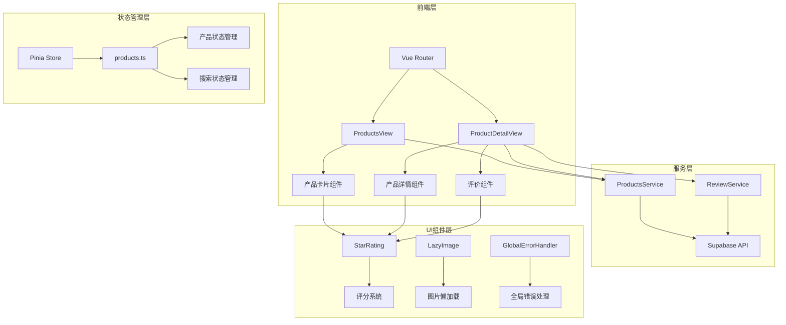
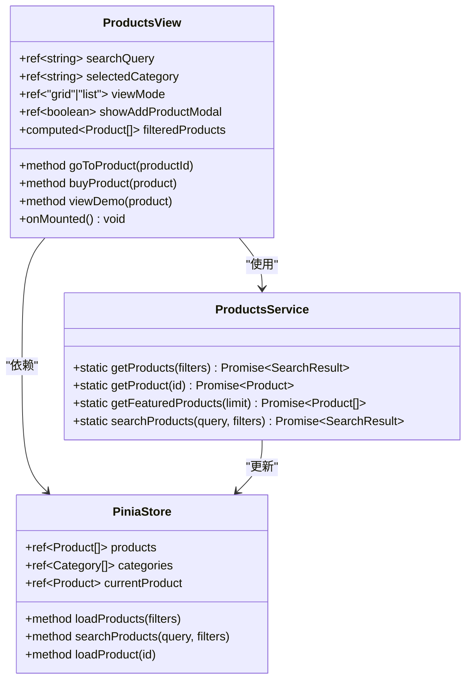
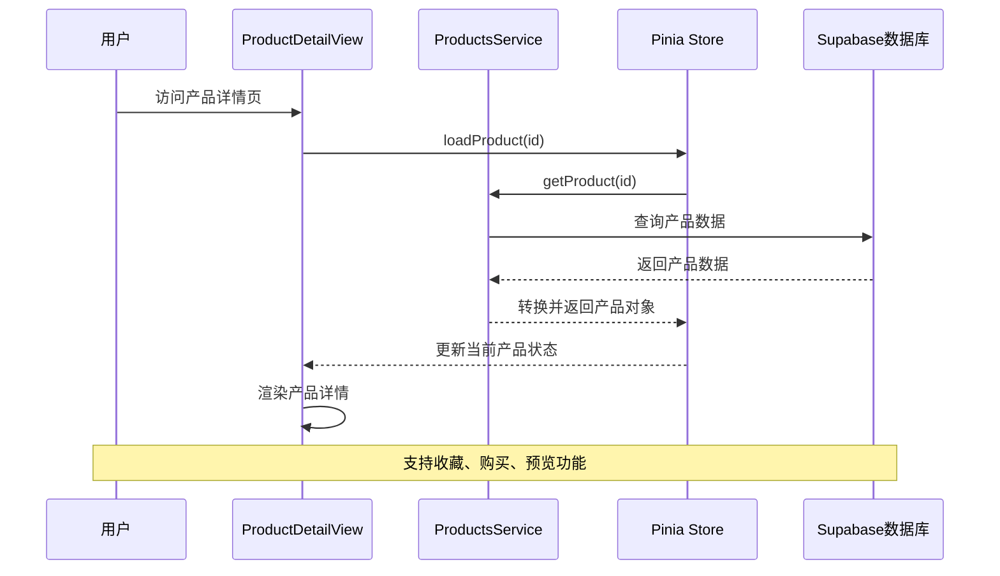
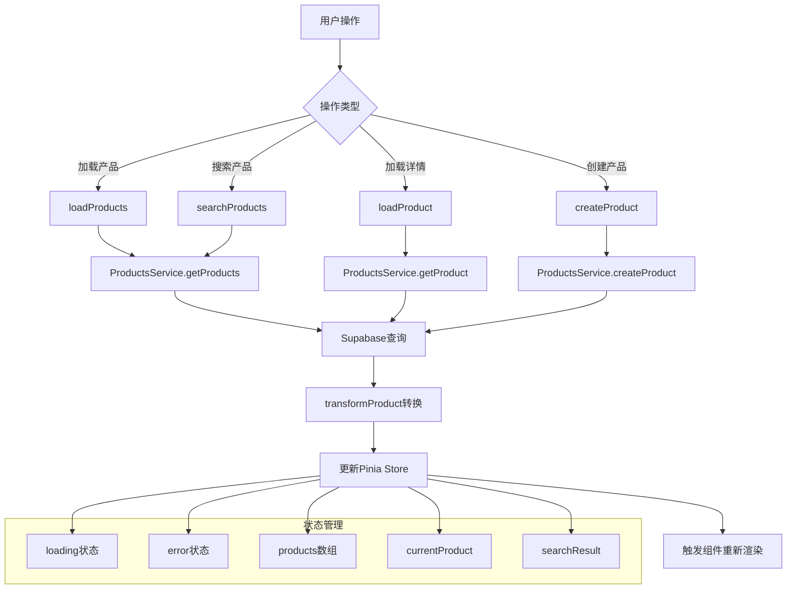
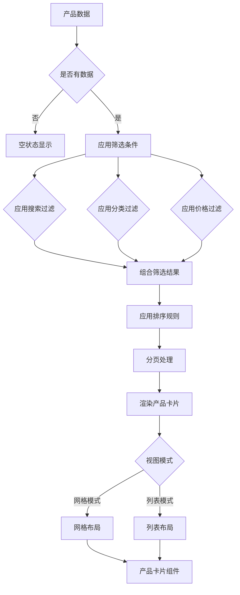
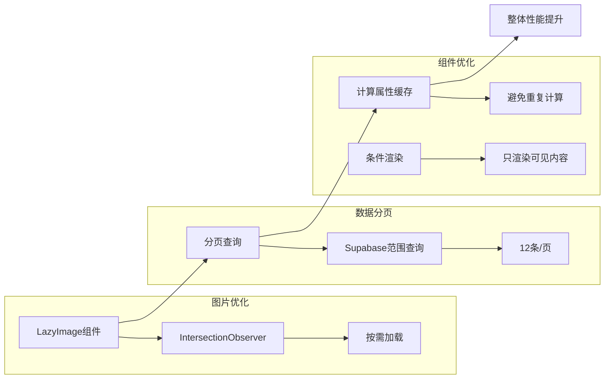
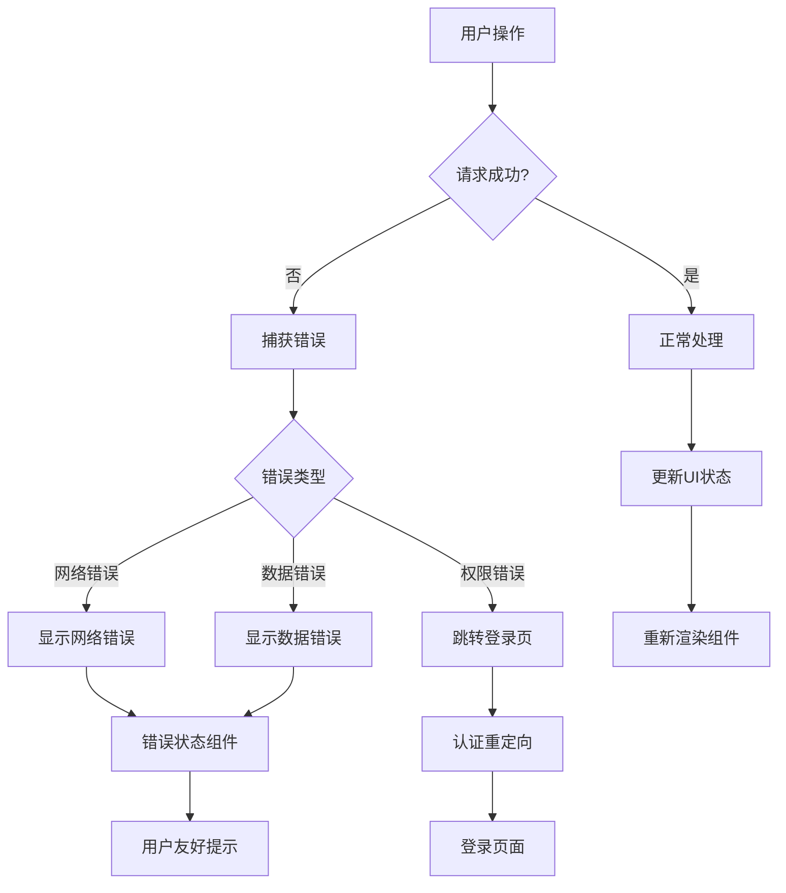

# 商品展示系统

<cite>
**本文档引用的文件**
- [ProductsView.vue](file://src/views/ProductsView.vue)
- [ProductDetailView.vue](file://src/views/ProductDetailView.vue)
- [productsService.ts](file://src/services/productsService.ts)
- [products.ts](file://src/stores/products.ts)
- [StarRating.vue](file://src/components/ui/StarRating.vue)
- [ProductReviews.vue](file://src/components/reviews/ProductReviews.vue)
- [index.ts](file://src/router/index.ts)
</cite>

## 目录
1. [简介](#简介)
2. [项目架构概述](#项目架构概述)
3. [核心组件分析](#核心组件分析)
4. [数据流与状态管理](#数据流与状态管理)
5. [渲染机制详解](#渲染机制详解)
6. [性能优化策略](#性能优化策略)
7. [错误处理与边界](#错误处理与边界)
8. [常见问题排查](#常见问题排查)
9. [总结](#总结)

## 简介

商品展示系统是现代电商平台的核心功能模块，负责向用户展示产品信息、支持搜索和筛选功能，并提供完整的购物体验。本系统采用Vue 3 + TypeScript技术栈，结合Pinia状态管理、Supabase数据库和现代化UI组件库，构建了一个高性能、可扩展的商品展示解决方案。

系统主要包含两个核心页面：
- **ProductsView.vue**：商品列表页，提供产品浏览、搜索、筛选和分页功能
- **ProductDetailView.vue**：商品详情页，展示产品详细信息、评价系统和购买流程

## 项目架构概述



**图表来源**
- [ProductsView.vue](file://src/views/ProductsView.vue#L1-L50)
- [ProductDetailView.vue](file://src/views/ProductDetailView.vue#L1-L50)
- [productsService.ts](file://src/services/productsService.ts#L1-L30)
- [products.ts](file://src/stores/products.ts#L1-L30)

## 核心组件分析

### ProductsView 商品列表页

ProductsView是商品展示系统的主要入口，提供了完整的商品浏览体验：



**图表来源**
- [ProductsView.vue](file://src/views/ProductsView.vue#L80-L120)
- [productsService.ts](file://src/services/productsService.ts#L10-L50)
- [products.ts](file://src/stores/products.ts#L10-L50)

### ProductDetailView 商品详情页

ProductDetailView专注于提供详细的产品信息展示和交互功能：



**图表来源**
- [ProductDetailView.vue](file://src/views/ProductDetailView.vue#L100-L150)
- [productsService.ts](file://src/services/productsService.ts#L50-L80)
- [products.ts](file://src/stores/products.ts#L50-L80)

**章节来源**
- [ProductsView.vue](file://src/views/ProductsView.vue#L1-L738)
- [ProductDetailView.vue](file://src/views/ProductDetailView.vue#L1-L501)

## 数据流与状态管理

### Pinia状态管理架构

系统采用Pinia作为状态管理解决方案，实现了集中化的状态控制：



**图表来源**
- [products.ts](file://src/stores/products.ts#L50-L100)
- [productsService.ts](file://src/services/productsService.ts#L15-L50)

### 数据预取策略

系统在页面加载时采用智能预取策略：

1. **初始化预取**：在组件挂载时自动加载基础产品数据
2. **按需加载**：根据用户交互动态加载更多数据
3. **缓存机制**：利用Pinia store的响应式特性实现智能缓存

```typescript
// 初始化加载示例
const initialize = async () => {
  if (initialized.value) return;
  
  try {
    await Promise.all([loadProducts(), loadFeaturedProducts()]);
    initialized.value = true;
  } catch (err) {
    console.error("Error initializing products store:", err);
  }
};
```

**章节来源**
- [products.ts](file://src/stores/products.ts#L1-L365)
- [productsService.ts](file://src/services/productsService.ts#L1-L347)

## 渲染机制详解

### 产品列表渲染

ProductsView采用虚拟化渲染和条件渲染相结合的方式：



**图表来源**
- [ProductsView.vue](file://src/views/ProductsView.vue#L150-L200)

### 产品详情渲染

ProductDetailView采用渐进式渲染策略：

1. **骨架屏加载**：在数据加载期间显示占位符
2. **逐步渲染**：优先渲染关键信息，次要信息异步加载
3. **错误边界**：提供友好的错误提示界面

```typescript
// 加载状态管理
const loading = ref(true);
const product = ref<any>(null);

const loadProduct = () => {
  const productId = parseInt(route.params.id as string);
  
  // 模拟API调用
  setTimeout(() => {
    const foundProduct = mockProducts.find((p) => p.id === productId);
    if (foundProduct) {
      product.value = foundProduct;
      isFavorite.value = Math.random() > 0.5;
    }
    loading.value = false;
  }, 300);
};
```

**章节来源**
- [ProductsView.vue](file://src/views/ProductsView.vue#L150-L300)
- [ProductDetailView.vue](file://src/views/ProductDetailView.vue#L100-L200)

## 性能优化策略

### 懒加载与分页

系统实现了多层次的性能优化：



**图表来源**
- [ProductsView.vue](file://src/views/ProductsView.vue#L200-L250)
- [productsService.ts](file://src/services/productsService.ts#L100-L150)

### 缓存策略

1. **内存缓存**：Pinia store内部缓存最近访问的产品数据
2. **浏览器缓存**：利用HTTP缓存头控制静态资源缓存
3. **CDN加速**：图片和静态资源通过CDN分发

```typescript
// 分页实现示例
const { data, error, count } = await query.range(from, to);

return {
  items: products,
  total: count || 0,
  page,
  limit,
  hasMore: (count || 0) > page * limit,
};
```

**章节来源**
- [productsService.ts](file://src/services/productsService.ts#L100-L150)
- [products.ts](file://src/stores/products.ts#L100-L150)

## 错误处理与边界

### 全局错误处理

系统实现了多层次的错误处理机制：



**图表来源**
- [ProductDetailView.vue](file://src/views/ProductDetailView.vue#L150-L200)
- [products.ts](file://src/stores/products.ts#L200-L250)

### 错误边界组件

系统包含专门的错误边界组件用于捕获和处理渲染错误：

```typescript
// 错误处理示例
const loadProduct = async (id: string) => {
  try {
    loading.value = true;
    error.value = null;
    
    const product = await ProductsService.getProduct(id);
    currentProduct.value = product;
    
    return product;
  } catch (err) {
    error.value = err instanceof Error ? err.message : "加载产品详情失败";
    console.error("Error loading product:", err);
    throw err;
  } finally {
    loading.value = false;
  }
};
```

**章节来源**
- [ProductDetailView.vue](file://src/views/ProductDetailView.vue#L150-L250)
- [products.ts](file://src/stores/products.ts#L200-L300)

## 常见问题排查

### 数据未更新问题

**问题症状**：页面显示过期的产品数据

**排查步骤**：
1. 检查Pinia store的状态是否正确更新
2. 验证Supabase查询参数是否正确
3. 确认网络连接状态
4. 检查浏览器缓存设置

**解决方案**：
```typescript
// 强制刷新数据
const refreshProducts = async () => {
  // 清除缓存
  searchResult.value = null;
  products.value = [];
  
  // 重新加载数据
  await loadProducts();
};
```

### 图片加载失败

**问题症状**：产品图片无法显示或显示为占位符

**排查步骤**：
1. 检查图片URL是否有效
2. 验证CDN配置
3. 确认存储桶权限设置
4. 检查网络代理设置

**解决方案**：
```typescript
// 图片加载错误处理

```

### 性能问题

**问题症状**：页面加载缓慢或卡顿

**排查步骤**：
1. 使用浏览器开发者工具分析网络请求
2. 检查JavaScript执行时间
3. 分析DOM渲染性能
4. 监控内存使用情况

**优化建议**：
- 启用图片压缩和格式优化
- 实施虚拟滚动技术
- 优化CSS选择器复杂度
- 减少不必要的DOM操作

**章节来源**
- [ProductDetailView.vue](file://src/views/ProductDetailView.vue#L200-L300)
- [productsService.ts](file://src/services/productsService.ts#L200-L300)

## 总结

商品展示系统是一个功能完善、性能优异的电商平台核心模块。通过合理的架构设计、完善的错误处理机制和全面的性能优化策略，系统能够为用户提供流畅、可靠的购物体验。

### 关键特性

1. **响应式设计**：支持多种设备和屏幕尺寸
2. **智能搜索**：提供实时搜索和高级筛选功能
3. **性能优化**：采用懒加载、分页和缓存策略
4. **错误处理**：完善的错误边界和用户提示
5. **可扩展性**：模块化设计便于功能扩展

### 最佳实践

- 使用Pinia进行状态管理，确保数据一致性
- 实施适当的错误处理和用户反馈机制
- 采用分页和懒加载优化性能
- 利用TypeScript提高代码质量和可维护性
- 设计清晰的组件接口和数据流

通过持续的监控和优化，该系统能够适应不断增长的业务需求，为用户提供卓越的购物体验。