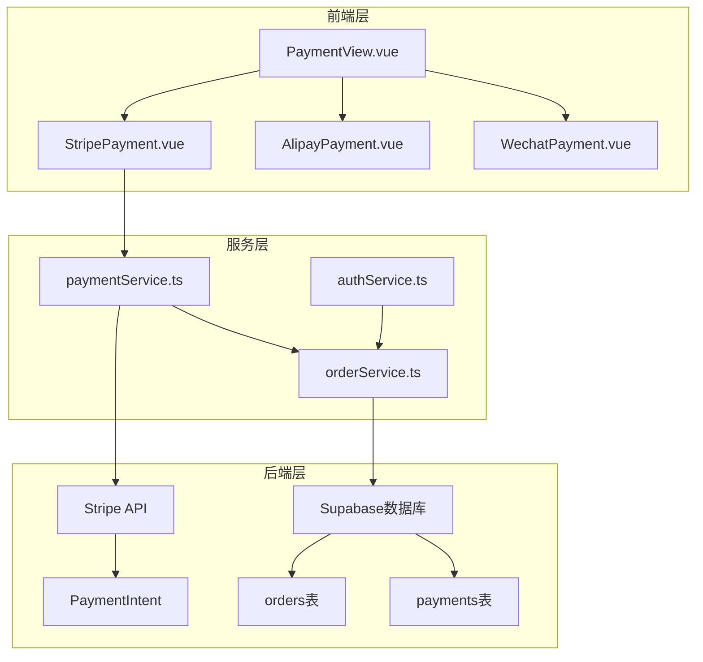
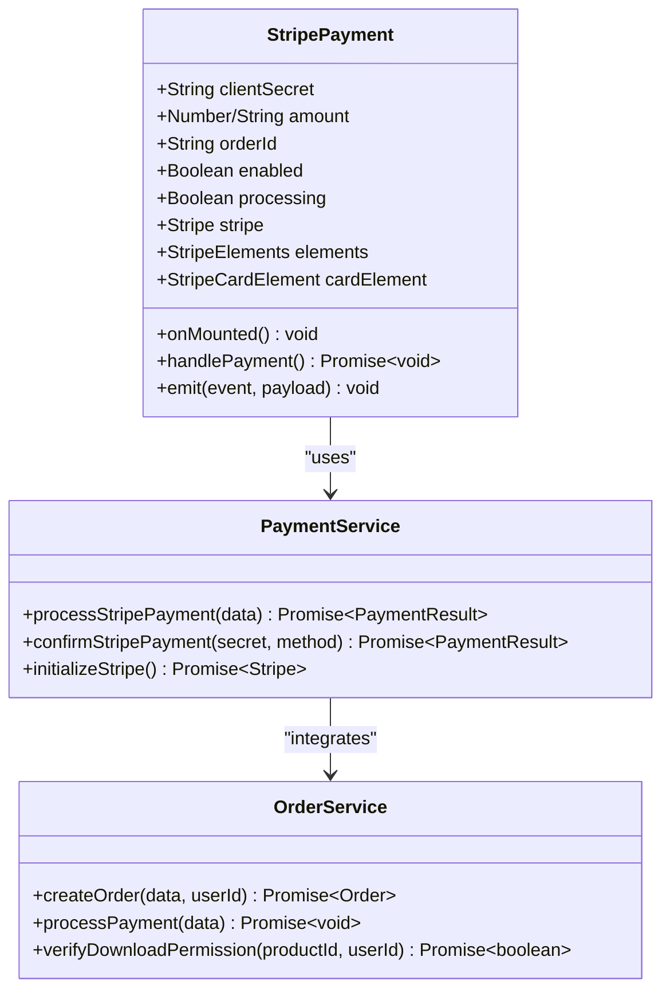
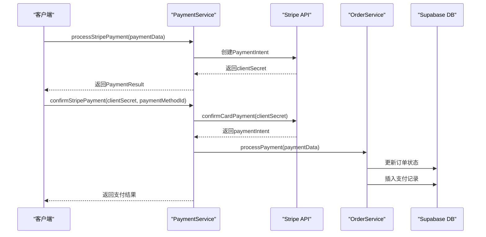
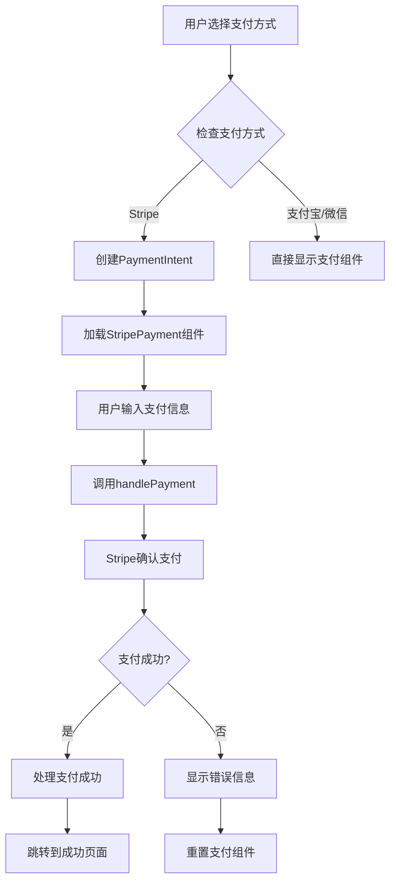
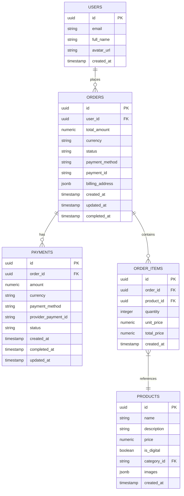
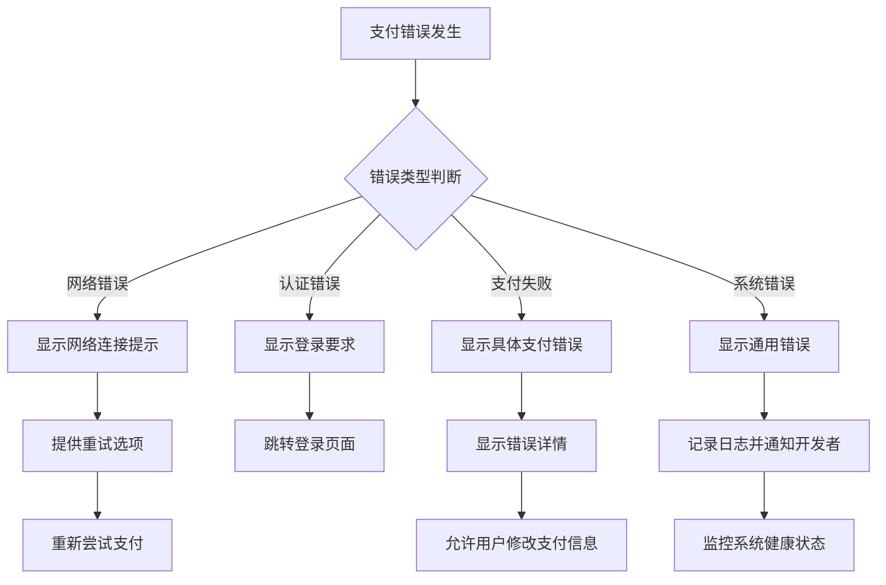

# Stripe 支付集成

<cite>
**本文档引用的文件**
- [StripePayment.vue](file://src/components/StripePayment.vue)
- [paymentService.ts](file://src/services/paymentService.ts)
- [PaymentView.vue](file://src/views/PaymentView.vue)
- [orderService.ts](file://src/services/orderService.ts)
- [PaymentSuccessView.vue](file://src/views/PaymentSuccessView.vue)
</cite>

## 目录
1. [简介](#简介)
2. [项目架构概览](#项目架构概览)
3. [Stripe支付组件分析](#stripe支付组件分析)
4. [支付服务层架构](#支付服务层架构)
5. [前端支付流程](#前端支付流程)
6. [后端支付处理](#后端支付处理)
7. [错误处理与用户提示](#错误处理与用户提示)
8. [调试指南](#调试指南)
9. [性能优化建议](#性能优化建议)
10. [总结](#总结)

## 简介

本文档详细介绍了Advanced Tools Navigation项目中Stripe支付组件的实现细节及其与paymentService的协作机制。该项目采用现代化的Vue 3 + TypeScript技术栈，集成了Stripe JavaScript SDK来处理信用卡支付，提供了完整的支付流程包括前端表单渲染、支付信息加密传输、后端支付会话创建以及支付结果回调处理。

Stripe支付组件作为整个支付系统的核心部分，负责加载Stripe JS SDK、创建支付表单元素、处理信用卡信息加密传输，并通过事件驱动的方式与后端服务进行交互。整个支付流程严格遵循Stripe的安全标准，确保用户的支付信息安全。

## 项目架构概览

项目采用了模块化的架构设计，将支付功能分解为多个独立的服务层：



**图表来源**
- [PaymentView.vue](file://src/views/PaymentView.vue#L1-L50)
- [StripePayment.vue](file://src/components/StripePayment.vue#L1-L30)
- [paymentService.ts](file://src/services/paymentService.ts#L1-L50)

**章节来源**
- [PaymentView.vue](file://src/views/PaymentView.vue#L1-L100)
- [StripePayment.vue](file://src/components/StripePayment.vue#L1-L50)

## Stripe支付组件分析

### 组件结构与功能

StripePayment.vue是一个高度封装的支付组件，专门用于处理信用卡支付。该组件具有以下核心特性：



**图表来源**
- [StripePayment.vue](file://src/components/StripePayment.vue#L30-L80)
- [paymentService.ts](file://src/services/paymentService.ts#L45-L100)
- [orderService.ts](file://src/services/orderService.ts#L1-L50)

### 核心实现细节

#### 1. Stripe SDK初始化

组件在mounted生命周期钩子中执行Stripe SDK的初始化：

```typescript
onMounted(async () => {
  if (!enabled.value) return;

  try {
    stripe.value = await loadStripe(import.meta.env.VITE_STRIPE_PUBLIC_KEY);
    if (!stripe.value) throw new Error("Stripe初始化失败");

    elements.value = stripe.value.elements({ 
      clientSecret: props.clientSecret,
      appearance: {
        theme: "stripe",
        variables: {
          colorPrimary: "#635bff",
          borderRadius: "8px",
        }
      }
    });

    cardElement.value = elements.value.create("card");
    cardElement.value.mount("#stripe-card-element");
  } catch (error) {
    console.error("Stripe初始化错误:", error);
    emit("error", "支付系统初始化失败");
  }
});
```

#### 2. 支付表单渲染

组件使用SVG图标展示Stripe品牌标识，并提供简洁的支付界面：

```html
<div class="payment-header">
  <div class="payment-logo">
    <svg viewBox="0 0 28 28" class="stripe-logo">
      <path fill="#635bff" d="M13.3 11.9c0 .6-.4.9-1.2.9H9.6v-2h2.5c.8 0 1.2.3 1.2.1z"/>
      <path fill="#635bff" d="M20 7H8a1 1 0 0 0-1 1v12a1 1 0 0 0 1 1h12a1 1 0 0 0 1-1V8a1 1 0 0 0-1-1zm-7.9 6.5c0-1.5-1.2-2.5-3-2.5H7.5v8h2.1v-2.8h1.3l1.6 2.8h2.3L13 15.2c.8-.5 1.1-1.2 1.1-1.7zm5.4 4.5h-2.1v-8h2.1v8z"/>
    </svg>
  </div>
  <h3>信用卡支付</h3>
</div>
```

#### 3. 支付处理逻辑

handlePayment方法实现了完整的支付处理流程：

```typescript
async function handlePayment() {
  if (!stripe.value || !elements.value || !cardElement.value) {
    emit("error", "支付系统未就绪");
    return;
  }

  processing.value = true;
  emit("loading", true);

  try {
    const { error, paymentIntent } = await stripe.value.confirmPayment({
      elements: elements.value,
      confirmParams: {
        return_url: `${window.location.origin}/payment/success?order_id=${props.orderId}`,
      },
    });

    if (error) {
      throw new Error(error.message || "支付处理失败");
    }

    if (paymentIntent?.status === "succeeded") {
      emit("success", {
        orderId: props.orderId,
        paymentId: paymentIntent.id,
      });
    } else {
      throw new Error(`支付状态异常: ${paymentIntent?.status}`);
    }
  } catch (error) {
    const message = error instanceof Error ? error.message : "支付处理失败";
    emit("error", message);
  } finally {
    processing.value = false;
    emit("loading", false);
  }
}
```

**章节来源**
- [StripePayment.vue](file://src/components/StripePayment.vue#L30-L155)

## 支付服务层架构

### PaymentService类设计

PaymentService是支付服务的核心类，负责协调Stripe支付流程：



**图表来源**
- [paymentService.ts](file://src/services/paymentService.ts#L45-L150)
- [orderService.ts](file://src/services/orderService.ts#L206-L248)

### 支付配置管理

系统支持多种支付方式的统一配置管理：

```typescript
const PAYMENT_CONFIG = {
  stripe: {
    publicKey: import.meta.env.VITE_STRIPE_PUBLIC_KEY || "",
    secretKey: import.meta.env.VITE_STRIPE_SECRET_KEY || "",
    enabled: !!import.meta.env.VITE_STRIPE_PUBLIC_KEY,
  },
  alipay: {
    appId: import.meta.env.VITE_ALIPAY_APP_ID || "",
    privateKey: import.meta.env.VITE_ALIPAY_PRIVATE_KEY || "",
    alipayPublicKey: import.meta.env.VITE_ALIPAY_PUBLIC_KEY || "",
    gateway: import.meta.env.VITE_ALIPAY_GATEWAY_URL || "https://openapi.alipay.com/gateway.do",
    charset: import.meta.env.VITE_ALIPAY_CHARSET || "UTF-8",
    signType: import.meta.env.VITE_ALIPAY_SIGN_TYPE || "RSA2",
    enabled: !!import.meta.env.VITE_ALIPAY_APP_ID,
  },
  wechat: {
    appId: import.meta.env.VITE_WECHAT_APP_ID || "",
    mchId: import.meta.env.VITE_WECHAT_MCH_ID || "",
    apiKey: import.meta.env.VITE_WECHAT_API_KEY || "",
    apiVersion: import.meta.env.VITE_WECHAT_API_VERSION || "v3",
    enabled: !!import.meta.env.VITE_WECHAT_APP_ID,
  },
};
```

### 支付结果接口定义

```typescript
export interface PaymentResult {
  success: boolean;
  paymentId?: string;
  orderId: string;
  amount: number;
  currency: string;
  method: string;
  message?: string;
  redirectUrl?: string;
  clientSecret?: string; // Stripe 客户端密钥
  paymentIntentId?: string; // Stripe PaymentIntent ID
}
```

**章节来源**
- [paymentService.ts](file://src/services/paymentService.ts#L1-L150)

## 前端支付流程

### PaymentView组件集成

PaymentView作为支付流程的入口点，负责协调各个支付组件：



**图表来源**
- [PaymentView.vue](file://src/views/PaymentView.vue#L300-L400)

### 支付流程实现

```typescript
const handlePayment = async () => {
  try {
    loading.value = true;
    error.value = null;

    // 导入必要的服务
    const { OrderService } = await import("@/services/orderService");
    const { PaymentService } = await import("@/services/paymentService");
    const { useAuthStore } = await import("@/stores/auth");

    const authStore = useAuthStore();
    if (!authStore.user) {
      throw new Error("请先登录");
    }

    // 创建订单（如果还没有）
    let orderId = route.query.order as string;

    if (!orderId) {
      // 从产品创建新订单
      const productId = route.query.product as string;
      if (!productId) {
        throw new Error("缺少产品信息");
      }

      const orderData = {
        product_id: productId,
        quantity: 1,
        billing_address: billingInfo.value,
      };

      const newOrder = await OrderService.createOrder(
        orderData,
        authStore.user.id,
      );
      orderId = newOrder.id;
    }

    currentOrderId.value = orderId;

    // 如果选择的是 Stripe，创建 PaymentIntent
    if (selectedMethod.value === "stripe") {
      const paymentResult = await PaymentService.processStripePayment({
        order_id: orderId,
        payment_method: selectedMethod.value,
        payment_id: `PAY_${Date.now()}`,
        amount: finalAmount.value,
      });

      if (paymentResult.success && paymentResult.clientSecret) {
        stripeClientSecret.value = paymentResult.clientSecret;
        showPaymentComponent.value = true;
      } else {
        throw new Error(paymentResult.message || "Stripe 支付初始化失败");
      }
    } else if (
      selectedMethod.value === "alipay" ||
      selectedMethod.value === "wechat"
    ) {
      // 支付宝和微信支付直接显示支付组件
      showPaymentComponent.value = true;
    } else {
      // 其他支付方式
      const paymentResult = await PaymentService.processPayment(
        {
          order_id: orderId,
          payment_method: selectedMethod.value,
          payment_id: `PAY_${Date.now()}`,
          amount: finalAmount.value,
        },
        selectedMethod.value,
      );

      if (paymentResult.success) {
        await processPaymentSuccess(orderId);
      } else {
        throw new Error(paymentResult.message || "支付失败");
      }
    }
  } catch (err) {
    error.value = err instanceof Error ? err.message : "支付失败，请重试";
  } finally {
    loading.value = false;
  }
};
```

**章节来源**
- [PaymentView.vue](file://src/views/PaymentView.vue#L300-L450)

## 后端支付处理

### 订单状态更新机制

当支付成功后，系统会自动更新订单状态并创建支付记录：

```typescript
static async processPayment(paymentData: PaymentData): Promise<void> {
  try {
    const orderUpdateData: OrderUpdateData = {
      status: "paid",
      payment_method: paymentData.payment_method,
      payment_id: paymentData.payment_id,
      completed_at: new Date().toISOString(),
      updated_at: new Date().toISOString(),
    };

    // 更新订单状态
    const { error } = await supabase
      .from("orders")
      .update(orderUpdateData)
      .eq("id", paymentData.order_id)
      .eq("status", "pending"); // 只能更新待支付的订单

    if (error) throw error;

    // 创建支付记录
    const paymentInsertData: PaymentInsertData = {
      order_id: paymentData.order_id,
      amount: paymentData.amount,
      currency: "CNY",
      payment_method: paymentData.payment_method,
      provider_payment_id: paymentData.payment_id,
      status: "completed",
      completed_at: new Date().toISOString(),
      updated_at: new Date().toISOString(),
    };

    const { error: paymentError } = await supabase
      .from("payments")
      .insert([paymentInsertData]);

    if (paymentError) throw paymentError;
  } catch (error) {
    console.error("处理支付失败:", error);
    throw new Error("处理支付失败");
  }
}
```

### 数据库模式设计

系统使用Supabase作为后端数据库，设计了清晰的支付相关表结构：



**图表来源**
- [orderService.ts](file://src/services/orderService.ts#L50-L100)

**章节来源**
- [orderService.ts](file://src/services/orderService.ts#L206-L248)

## 错误处理与用户提示

### 错误类型映射

系统实现了完善的错误处理机制，将不同类型的错误映射为用户友好的提示：



### 用户界面反馈

StripePayment组件提供了多层次的用户反馈机制：

```typescript
// 成功事件处理
const onPaymentSuccess = async (paymentResult: { orderId: string }) => {
  try {
    await processPaymentSuccess(paymentResult.orderId);
  } catch (err) {
    error.value = err instanceof Error ? err.message : "支付成功但处理失败";
  }
};

// 错误事件处理
const onPaymentError = (errorMessage: string) => {
  error.value = errorMessage;
  showPaymentComponent.value = false;
};
```

### 支付成功页面

PaymentSuccessView提供了完整的支付结果展示：

```typescript
const downloadProducts = async () => {
  try {
    console.log("开始下载产品...");

    // 获取订单信息
    const orderParam = route.query.order;
    if (!orderParam) {
      alert("订单信息不存在");
      return;
    }

    // 导入订单服务
    const { OrderService } = await import("@/services/orderService");
    const { useAuthStore } = await import("@/stores/auth");

    const authStore = useAuthStore();
    if (!authStore.user) {
      alert("请先登录");
      return;
    }

    // 获取订单详情
    const order = await OrderService.getOrderById(
      orderParam as string,
      authStore.user.id,
    );
    if (!order || order.status !== "paid") {
      alert("订单不存在或未支付");
      return;
    }

    // 下载所有产品
    for (const item of order.items) {
      if (item.product?.download_url) {
        const link = document.createElement("a");
        link.href = item.product.download_url;
        link.download = `${item.product.name}.zip`;
        link.target = "_blank";
        document.body.appendChild(link);
        link.click();
        document.body.removeChild(link);

        // 延迟一下避免浏览器阻止多个下载
        await new Promise((resolve) => setTimeout(resolve, 500));
      }
    }
  } catch (error) {
    console.error("下载失败:", error);
    alert("下载失败，请稍后重试");
  }
};
```

**章节来源**
- [PaymentView.vue](file://src/views/PaymentView.vue#L450-L500)
- [PaymentSuccessView.vue](file://src/views/PaymentSuccessView.vue#L100-L150)

## 调试指南

### 常见问题诊断

#### 1. API密钥无效问题

**症状**: 支付组件无法初始化，控制台显示Stripe初始化失败

**解决方案**:
```bash
# 检查环境变量配置
echo $VITE_STRIPE_PUBLIC_KEY
echo $VITE_STRIPE_SECRET_KEY

# 验证Stripe账户状态
# 登录Stripe Dashboard检查API密钥有效性
```

**代码检查**:
```typescript
// 确保环境变量正确设置
if (!PAYMENT_CONFIG.stripe.publicKey) {
  throw new Error(
    "Stripe支付配置缺失，请在.env文件中配置 VITE_STRIPE_PUBLIC_KEY",
  );
}
```

#### 2. 域名未验证问题

**症状**: 支付时出现CORS错误或域名验证失败

**解决方案**:
1. 登录Stripe Dashboard
2. 导航到"Developers" -> "API keys"
3. 添加正确的域名到"Webhook endpoints"
4. 验证域名配置

#### 3. CORS错误处理

**症状**: 浏览器控制台显示跨域请求被阻止

**解决方案**:
```javascript
// 确保Stripe API端点允许跨域请求
// 在Stripe Dashboard中配置正确的CORS头
Access-Control-Allow-Origin: https://yourdomain.com
Access-Control-Allow-Methods: GET, POST, OPTIONS
Access-Control-Allow-Headers: Content-Type, Authorization
```

#### 4. 支付失败排查

**步骤**:
1. 检查PaymentIntent状态
2. 验证支付凭证有效性
3. 确认订单状态一致性
4. 检查数据库事务完整性

```typescript
// 支付确认后的状态验证
if (paymentIntent?.status === "succeeded") {
  emit("success", {
    orderId: props.orderId,
    paymentId: paymentIntent.id,
  });
} else {
  throw new Error(`支付状态异常: ${paymentIntent?.status}`);
}
```

### 开发工具推荐

#### 1. Stripe CLI调试工具

```bash
# 安装Stripe CLI
curl -sf https://raw.githubusercontent.com/stripe/stripe-cli/master/install.sh | sh

# 监控Webhook事件
stripe listen --forward-to localhost:3000/webhooks/stripe

# 发送测试事件
stripe events simulate payment_intent.succeeded
```

#### 2. 浏览器开发者工具

- **Network面板**: 监控支付请求和响应
- **Console面板**: 查看JavaScript错误和警告
- **Application面板**: 检查存储的支付凭证

**章节来源**
- [paymentService.ts](file://src/services/paymentService.ts#L50-L80)
- [StripePayment.vue](file://src/components/StripePayment.vue#L87-L120)

## 性能优化建议

### 1. Stripe SDK加载优化

```typescript
// 实现SDK预加载和缓存
const initializeStripe = async () => {
  if (!stripeInstance && PAYMENT_CONFIG.stripe.publicKey) {
    // 使用Promise缓存避免重复加载
    if (!loadingPromise) {
      loadingPromise = loadStripe(PAYMENT_CONFIG.stripe.publicKey);
    }
    stripeInstance = await loadingPromise;
  }
  return stripeInstance;
};
```

### 2. 支付表单渲染优化

```typescript
// 实现虚拟化和懒加载
const stripeClientSecret = ref("");
const showPaymentComponent = ref(false);

// 只在需要时才渲染支付组件
<StripePayment
  v-if="selectedMethod === 'stripe' && stripeClientSecret"
  :client-secret="stripeClientSecret"
  :amount="finalAmount"
  :order-id="currentOrderId"
  @success="onPaymentSuccess"
  @error="onPaymentError"
/>
```

### 3. 错误恢复机制

```typescript
// 实现自动重试机制
const handlePaymentWithRetry = async (maxRetries = 3) => {
  for (let i = 0; i < maxRetries; i++) {
    try {
      await handlePayment();
      break;
    } catch (error) {
      if (i === maxRetries - 1) throw error;
      
      // 指数退避重试
      await new Promise(resolve => 
        setTimeout(resolve, Math.pow(2, i) * 1000)
      );
    }
  }
};
```

### 4. 缓存策略

```typescript
// 实现PaymentIntent缓存
const paymentCache = new Map();

const getCachedPaymentIntent = (orderId: string) => {
  const cached = paymentCache.get(orderId);
  if (cached && Date.now() - cached.timestamp < 300000) { // 5分钟有效期
    return cached.data;
  }
  paymentCache.delete(orderId);
  return null;
};
```

## 总结

Advanced Tools Navigation项目的Stripe支付集成展现了现代Web应用支付系统的最佳实践。通过模块化的架构设计、完善的错误处理机制和用户友好的界面，系统实现了安全、可靠的支付体验。

### 关键特性总结

1. **安全性**: 严格遵循Stripe安全标准，确保支付信息安全
2. **可靠性**: 完善的错误处理和重试机制
3. **用户体验**: 直观的支付界面和及时的状态反馈
4. **可维护性**: 清晰的代码结构和模块化设计
5. **扩展性**: 支持多种支付方式的统一接口

### 技术亮点

- **TypeScript强类型**: 提供完整的类型安全保障
- **Vue 3 Composition API**: 现代化的组件开发模式
- **响应式设计**: 适配各种设备和屏幕尺寸
- **异步处理**: 支持复杂的支付流程和并发操作

### 最佳实践

1. **分离关注点**: 将支付逻辑、业务逻辑和服务逻辑分离
2. **错误处理**: 实现多层次的错误捕获和用户提示
3. **状态管理**: 使用响应式状态管理支付流程
4. **性能优化**: 实现智能的资源加载和缓存策略

这个Stripe支付集成方案为构建企业级支付系统提供了宝贵的参考，展示了如何在保证安全性的前提下，提供优秀的用户体验和强大的功能性。