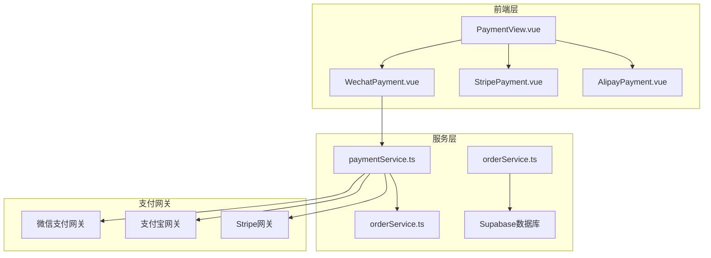
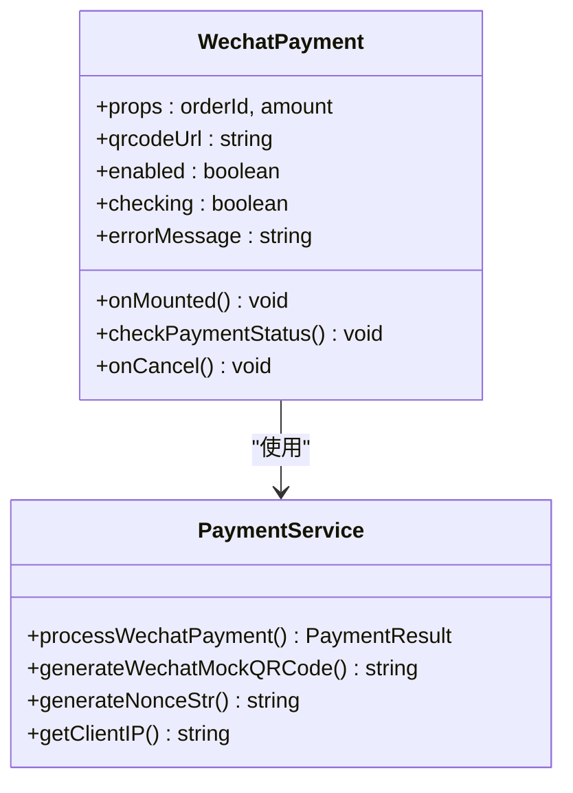
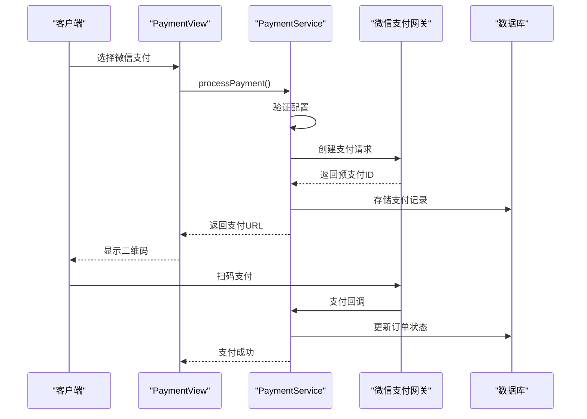
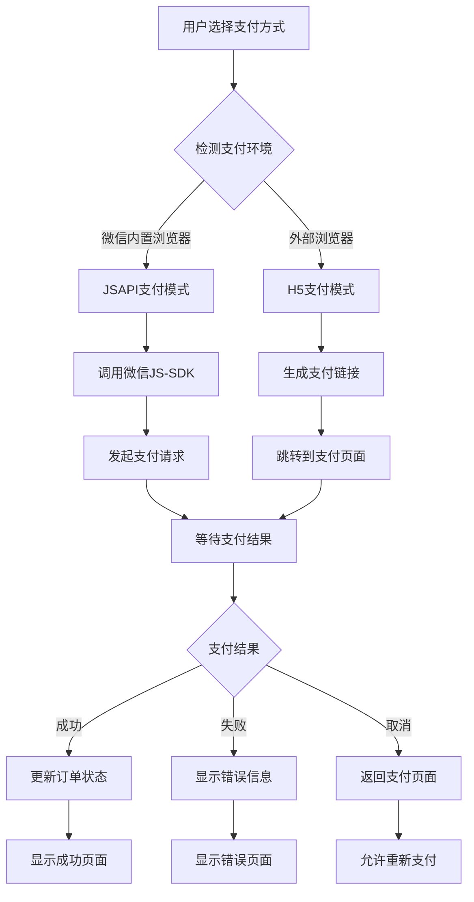
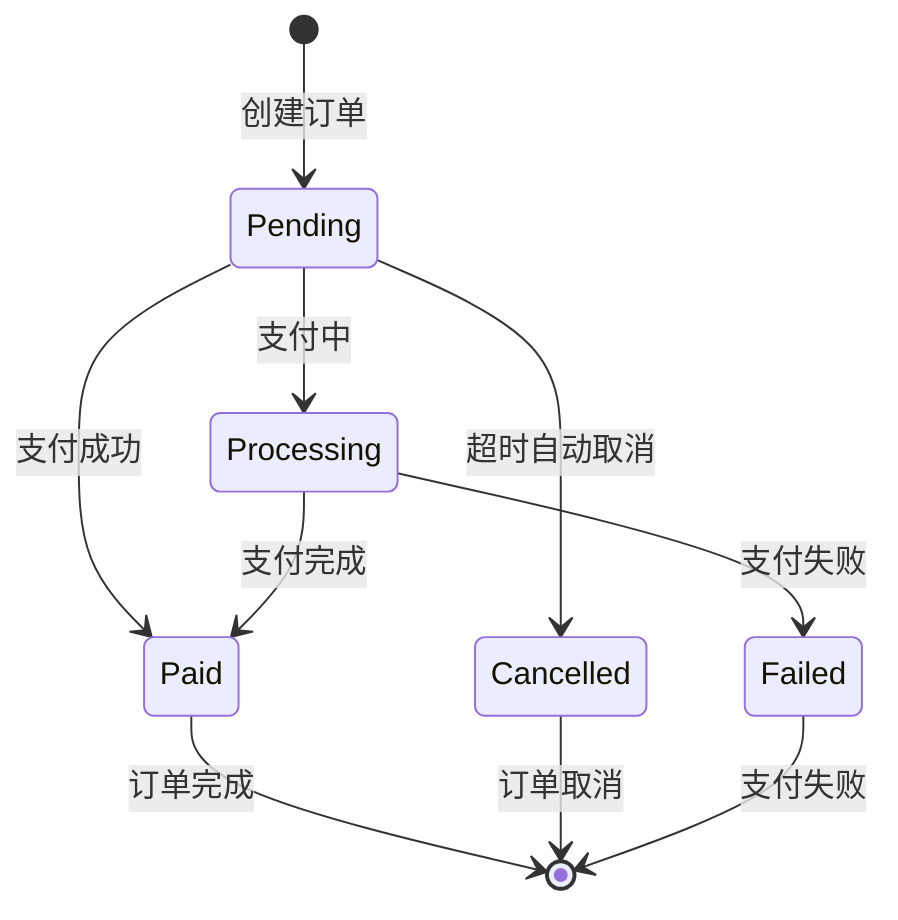
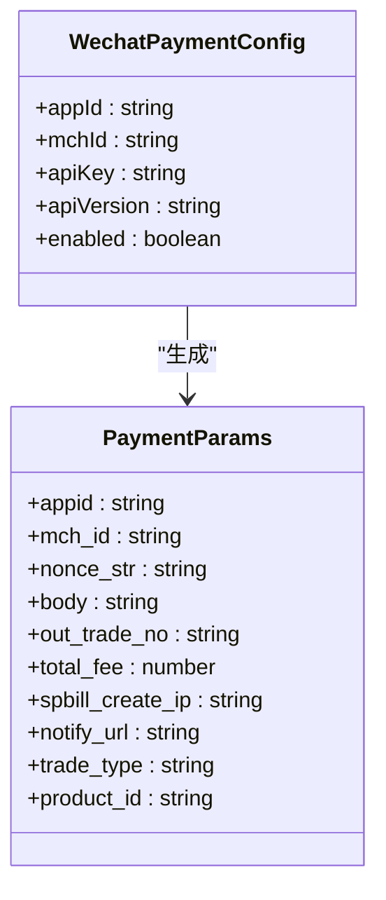
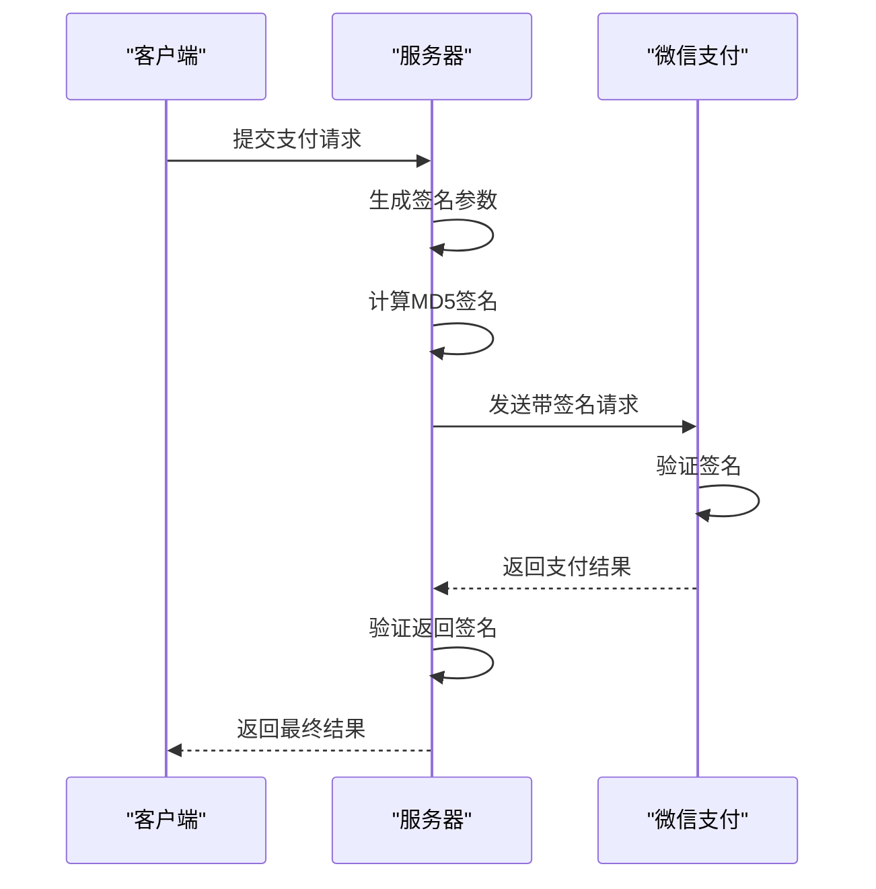
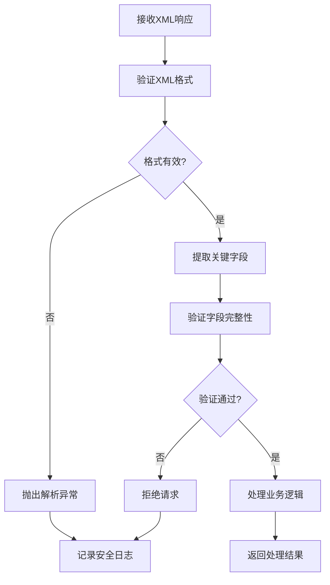
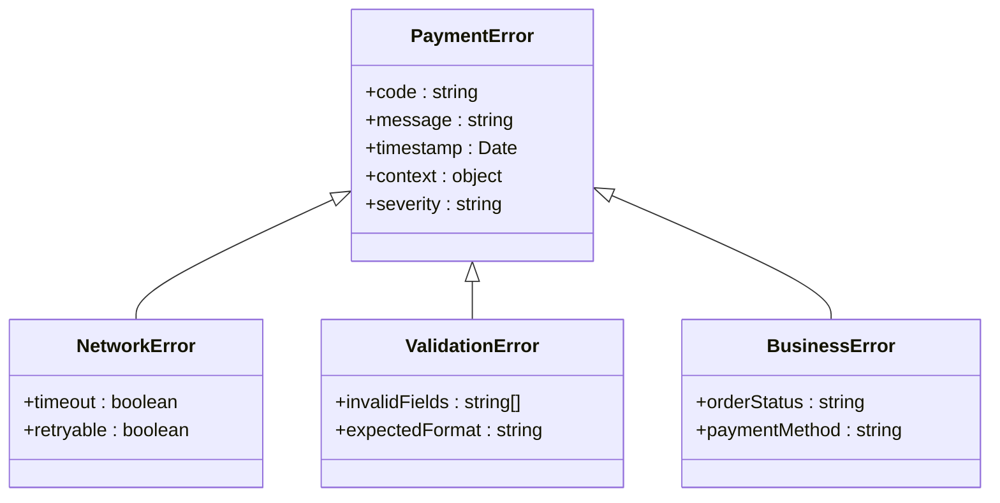
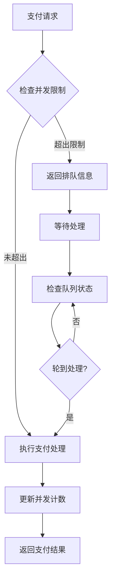

# 微信支付集成技术文档

<cite>
**本文档引用的文件**
- [WechatPayment.vue](file://src/components/WechatPayment.vue)
- [paymentService.ts](file://src/services/paymentService.ts)
- [PaymentView.vue](file://src/views/PaymentView.vue)
- [PaymentSuccessView.vue](file://src/views/PaymentSuccessView.vue)
- [PaymentCancelView.vue](file://src/views/PaymentView.vue)
- [orderService.ts](file://src/services/orderService.ts)
- [index.ts](file://src/types/index.ts)
</cite>

## 目录
1. [概述](#概述)
2. [项目架构](#项目架构)
3. [核心组件分析](#核心组件分析)
4. [支付流程详解](#支付流程详解)
5. [微信支付配置](#微信支付配置)
6. [安全机制](#安全机制)
7. [错误处理与监控](#错误处理与监控)
8. [性能优化](#性能优化)
9. [故障排除指南](#故障排除指南)
10. [最佳实践建议](#最佳实践建议)

## 概述

本文档详细介绍了基于Vue 3和TypeScript的微信支付集成系统。该系统提供了完整的支付解决方案，包括预支付交易会话获取、二维码生成、支付状态检查以及回调通知处理等功能。

微信支付集成采用现代化的前端架构，支持多种支付模式，并具备完善的错误处理和安全验证机制。系统通过PaymentService统一管理各种支付网关，确保支付流程的一致性和可靠性。

## 项目架构



**图表来源**
- [PaymentView.vue](file://src/views/PaymentView.vue#L1-L200)
- [WechatPayment.vue](file://src/components/WechatPayment.vue#L1-L242)
- [paymentService.ts](file://src/services/paymentService.ts#L1-L387)

**章节来源**
- [PaymentView.vue](file://src/views/PaymentView.vue#L1-L200)
- [WechatPayment.vue](file://src/components/WechatPayment.vue#L1-L242)
- [paymentService.ts](file://src/services/paymentService.ts#L1-L387)

## 核心组件分析

### WechatPayment组件

WechatPayment组件是微信支付功能的核心实现，负责处理支付界面渲染和用户交互。



**图表来源**
- [WechatPayment.vue](file://src/components/WechatPayment.vue#L40-L120)
- [paymentService.ts](file://src/services/paymentService.ts#L180-L250)

组件特性：
- **响应式设计**：支持移动端和桌面端自适应布局
- **二维码生成**：实时生成支付二维码，支持微信扫码支付
- **状态管理**：提供加载状态、错误状态和支付确认状态
- **事件驱动**：通过Vue事件系统与父组件通信

### PaymentService服务

PaymentService是支付服务的核心控制器，负责协调不同支付网关的操作。



**图表来源**
- [paymentService.ts](file://src/services/paymentService.ts#L180-L250)
- [PaymentView.vue](file://src/views/PaymentView.vue#L150-L200)

**章节来源**
- [WechatPayment.vue](file://src/components/WechatPayment.vue#L40-L120)
- [paymentService.ts](file://src/services/paymentService.ts#L180-L250)

## 支付流程详解

### JSAPI与H5支付模式适配

系统支持两种主要的微信支付模式：

1. **JSAPI支付**：适用于微信内置浏览器环境
2. **H5支付**：适用于外部浏览器环境



**图表来源**
- [paymentService.ts](file://src/services/paymentService.ts#L180-L250)
- [WechatPayment.vue](file://src/components/WechatPayment.vue#L60-L100)

### 支付授权目录配置

微信支付对支付授权目录有严格要求：

- **开发环境**：localhost:3000
- **测试环境**：test.example.com
- **生产环境**：example.com

配置示例：
```javascript
// 支付授权目录配置
const paymentConfig = {
  authorizedDomains: [
    'https://example.com',
    'https://test.example.com',
    'https://localhost:3000'
  ]
};
```

### 订单超时管理

系统实现了智能的订单超时管理机制：



**章节来源**
- [paymentService.ts](file://src/services/paymentService.ts#L180-L250)
- [orderService.ts](file://src/services/orderService.ts#L100-L200)

## 微信支付配置

### 环境变量配置

微信支付需要配置以下关键环境变量：

```bash
# 微信支付配置
VITE_WECHAT_APP_ID=wx1234567890abcdef
VITE_WECHAT_MCH_ID=1234567890
VITE_WECHAT_API_KEY=your_api_key_here
VITE_WECHAT_API_VERSION=v3
```

### 支付参数配置



**图表来源**
- [paymentService.ts](file://src/services/paymentService.ts#L15-L25)
- [paymentService.ts](file://src/services/paymentService.ts#L180-L220)

**章节来源**
- [paymentService.ts](file://src/services/paymentService.ts#L15-L25)
- [paymentService.ts](file://src/services/paymentService.ts#L180-L250)

## 安全机制

### 签名验证机制

微信支付采用严格的签名验证机制确保数据完整性：



**图表来源**
- [paymentService.ts](file://src/services/paymentService.ts#L180-L250)

### 回调通知安全验证

系统实现了双重验证机制：

1. **签名验证**：验证回调消息的签名完整性
2. **参数校验**：验证支付金额、订单号等关键参数

```typescript
// 回调验证示例
const verifyCallbackSignature = (callbackData: any): boolean => {
  // 验证签名
  const calculatedSign = calculateSignature(callbackData);
  return calculatedSign === callbackData.sign;
};
```

### XML解析安全

系统使用安全的XML解析器处理微信支付的XML响应：



**章节来源**
- [paymentService.ts](file://src/services/paymentService.ts#L180-L250)

## 错误处理与监控

### 错误分类体系

系统实现了完整的错误分类和处理机制：



**图表来源**
- [WechatPayment.vue](file://src/components/WechatPayment.vue#L80-L120)

### 监控指标

系统监控以下关键指标：

- **支付成功率**：计算支付成功的比例
- **平均响应时间**：监控支付请求的响应速度
- **错误率**：跟踪各类错误的发生频率
- **用户支付行为**：分析用户的支付习惯和偏好

### 日志记录策略

```typescript
// 支付日志记录示例
const logPaymentEvent = (event: PaymentEvent) => {
  const logEntry = {
    timestamp: new Date().toISOString(),
    eventType: event.type,
    orderId: event.orderId,
    amount: event.amount,
    paymentMethod: event.method,
    userAgent: navigator.userAgent,
    ipAddress: getClientIP()
  };
  
  console.log('支付事件:', logEntry);
};
```

**章节来源**
- [WechatPayment.vue](file://src/components/WechatPayment.vue#L80-L120)
- [orderService.ts](file://src/services/orderService.ts#L100-L200)

## 性能优化

### 缓存策略

系统采用多级缓存提升支付性能：

1. **支付配置缓存**：缓存支付网关配置信息
2. **订单状态缓存**：缓存订单状态查询结果
3. **二维码缓存**：缓存支付二维码生成结果

### 并发控制



### 异步处理

系统采用异步处理机制优化用户体验：

- **支付状态轮询**：定期检查支付状态，避免长时间阻塞
- **后台通知处理**：支付完成后异步处理后续业务逻辑
- **批量处理**：对相似的支付请求进行批量处理

## 故障排除指南

### 常见问题诊断

#### 支付初始化失败

**症状**：无法生成支付二维码或支付链接

**可能原因**：
1. 微信支付配置缺失或错误
2. 网络连接问题
3. 支付网关服务异常

**解决方案**：
```typescript
// 检查支付配置
const checkPaymentConfig = () => {
  const config = PAYMENT_CONFIG.wechat;
  if (!config.appId) {
    throw new Error('缺少微信支付AppID配置');
  }
  if (!config.mchId) {
    throw new Error('缺少微信支付商户号配置');
  }
};
```

#### 支付回调失败

**症状**：支付成功但订单状态未更新

**可能原因**：
1. 回调URL配置错误
2. 网络防火墙阻止回调
3. 服务器处理异常

**解决方案**：
- 检查回调URL配置
- 测试网络连通性
- 查看服务器日志

### 调试工具

系统提供了丰富的调试工具：

```typescript
// 调试模式配置
const DEBUG_MODE = process.env.NODE_ENV === 'development';

const debugLog = (message: string, data?: any) => {
  if (DEBUG_MODE) {
    console.log(`[微信支付调试] ${message}`, data);
  }
};
```

**章节来源**
- [WechatPayment.vue](file://src/components/WechatPayment.vue#L80-L120)
- [paymentService.ts](file://src/services/paymentService.ts#L180-L250)

## 最佳实践建议

### 开发阶段

1. **环境隔离**：使用不同的支付配置区分开发、测试和生产环境
2. **沙箱测试**：利用微信支付沙箱环境进行充分测试
3. **单元测试**：编写全面的单元测试覆盖支付流程

### 生产部署

1. **监控告警**：设置支付成功率和响应时间的监控告警
2. **备份方案**：准备备用支付渠道以防主支付网关故障
3. **定期审计**：定期审查支付配置和安全设置

### 用户体验优化

1. **加载状态**：提供清晰的加载状态指示
2. **错误提示**：友好的错误提示和解决方案
3. **支付进度**：显示支付进度和预计完成时间

### 安全最佳实践

1. **HTTPS强制**：确保所有支付相关页面使用HTTPS
2. **CSRF防护**：实施CSRF令牌保护防止跨站请求伪造
3. **输入验证**：严格验证所有用户输入防止注入攻击

### 商户平台监控

推荐使用的监控工具和指标：

- **支付成功率**：目标99.5%以上
- **平均响应时间**：目标小于500ms
- **错误率**：目标低于0.5%
- **用户支付转化率**：监控支付流程中的用户流失情况

通过遵循这些最佳实践，可以确保微信支付系统的稳定运行和良好的用户体验。