# 支付服务架构设计文档

<cite>
**本文档引用的文件**
- [paymentService.ts](file://src/services/paymentService.ts)
- [orderService.ts](file://src/services/orderService.ts)
- [supabaseClient.ts](file://src/lib/supabaseClient.ts)
- [envValidation.ts](file://src/utils/envValidation.ts)
- [PaymentView.vue](file://src/views/PaymentView.vue)
- [StripePayment.vue](file://src/components/StripePayment.vue)
- [AlipayPayment.vue](file://src/components/AlipayPayment.vue)
- [WechatPayment.vue](file://src/components/WechatPayment.vue)
</cite>

## 目录
1. [简介](#简介)
2. [项目结构概览](#项目结构概览)
3. [核心组件分析](#核心组件分析)
4. [架构概览](#架构概览)
5. [详细组件分析](#详细组件分析)
6. [依赖关系分析](#依赖关系分析)
7. [性能考虑](#性能考虑)
8. [故障排除指南](#故障排除指南)
9. [结论](#结论)

## 简介

支付服务架构是一个统一的多支付渠道抽象层，旨在为Stripe、支付宝和微信支付提供一致的接口。该架构采用模块化设计，支持动态支付方式检测、安全的密钥管理、HTTP客户端封装以及完整的错误处理机制。通过这种设计，系统能够在保持代码简洁性的同时，支持多种支付渠道的无缝集成。

## 项目结构概览

支付服务相关的文件主要分布在以下几个关键目录中：


**图表来源**
- [paymentService.ts](file://src/services/paymentService.ts#L1-L387)
- [orderService.ts](file://src/services/orderService.ts#L1-L787)
- [supabaseClient.ts](file://src/lib/supabaseClient.ts#L1-L246)

**章节来源**
- [paymentService.ts](file://src/services/paymentService.ts#L1-L50)
- [orderService.ts](file://src/services/orderService.ts#L1-L50)

## 核心组件分析

### 支付服务类 (PaymentService)

PaymentService是整个支付架构的核心类，负责统一处理三种支付渠道：

```typescript
export class PaymentService {
  // 处理Stripe支付
  static async processStripePayment(paymentData: PaymentData): Promise<PaymentResult>
  
  // 确认Stripe支付
  static async confirmStripePayment(clientSecret: string, paymentMethodId: string): Promise<PaymentResult>
  
  // 处理支付宝支付
  static async processAlipayPayment(paymentData: PaymentData): Promise<PaymentResult>
  
  // 处理微信支付
  static async processWechatPayment(paymentData: PaymentData): Promise<PaymentResult>
  
  // 统一支付处理入口
  static async processPayment(paymentData: PaymentData, method: string): Promise<PaymentResult>
}
```

### 支付配置管理

系统采用集中式的支付配置管理，支持运行时检测可用支付渠道：

```typescript
const PAYMENT_CONFIG = {
  stripe: {
    publicKey: import.meta.env.VITE_STRIPE_PUBLIC_KEY || "",
    secretKey: import.meta.env.VITE_STRIPE_SECRET_KEY || "",
    enabled: !!import.meta.env.VITE_STRIPE_PUBLIC_KEY,
  },
  alipay: {
    appId: import.meta.env.VITE_ALIPAY_APP_ID || "",
    privateKey: import.meta.env.VITE_ALIPAY_PRIVATE_KEY || "",
    alipayPublicKey: import.meta.env.VITE_ALIPAY_PUBLIC_KEY || "",
    gateway: import.meta.env.VITE_ALIPAY_GATEWAY_URL || "https://openapi.alipay.com/gateway.do",
    charset: import.meta.env.VITE_ALIPAY_CHARSET || "UTF-8",
    signType: import.meta.env.VITE_ALIPAY_SIGN_TYPE || "RSA2",
    enabled: !!import.meta.env.VITE_ALIPAY_APP_ID,
  },
  wechat: {
    appId: import.meta.env.VITE_WECHAT_APP_ID || "",
    mchId: import.meta.env.VITE_WECHAT_MCH_ID || "",
    apiKey: import.meta.env.VITE_WECHAT_API_KEY || "",
    apiVersion: import.meta.env.VITE_WECHAT_API_VERSION || "v3",
    enabled: !!import.meta.env.VITE_WECHAT_APP_ID,
  },
};
```

**章节来源**
- [paymentService.ts](file://src/services/paymentService.ts#L6-L35)
- [paymentService.ts](file://src/services/paymentService.ts#L338-L387)

## 架构概览

支付服务采用分层架构设计，确保各组件职责清晰分离：


**图表来源**
- [PaymentView.vue](file://src/views/PaymentView.vue#L1-L100)
- [paymentService.ts](file://src/services/paymentService.ts#L1-L50)
- [supabaseClient.ts](file://src/lib/supabaseClient.ts#L1-L50)

## 详细组件分析

### 支付服务核心实现

#### Stripe支付处理

Stripe支付采用现代的PaymentIntents API，支持安全的客户端-服务器通信：


**图表来源**
- [paymentService.ts](file://src/services/paymentService.ts#L40-L85)
- [paymentService.ts](file://src/services/paymentService.ts#L87-L125)

#### 支付宝支付处理

支付宝支付采用传统的PC网站支付模式，支持同步和异步通知：


**图表来源**
- [paymentService.ts](file://src/services/paymentService.ts#L127-L180)

#### 微信支付处理

微信支付采用二维码支付模式，支持扫码支付：


**图表来源**
- [paymentService.ts](file://src/services/paymentService.ts#L182-L235)

### 环境配置验证

系统实现了完善的环境配置验证机制：


**图表来源**
- [envValidation.ts](file://src/utils/envValidation.ts#L1-L50)
- [envValidation.ts](file://src/utils/envValidation.ts#L200-L250)

**章节来源**
- [paymentService.ts](file://src/services/paymentService.ts#L40-L235)
- [envValidation.ts](file://src/utils/envValidation.ts#L1-L100)

### Supabase数据交互

支付服务与Supabase数据库的交互遵循统一的CRUD模式：

```mermaid
classDiagram
class SupabaseClient {
+createRecord(table, data) Promise~T~
+updateRecord(table, id, data) Promise~T~
+deleteRecord(table, id) Promise~void~
+getRecord(table, id) Promise~T~
+getRecords(table, options) Promise~T[]~
+uploadFile(bucket, path, file) Promise~any~
+getPublicUrl(bucket, path) string
+deleteFile(bucket, path) Promise~void~
}
class PaymentService {
+processPayment(paymentData, method) Promise~PaymentResult~
+processStripePayment(paymentData) Promise~PaymentResult~
+processAlipayPayment(paymentData) Promise~PaymentResult~
+processWechatPayment(paymentData) Promise~PaymentResult~
}
class OrderService {
+createOrder(orderData, userId) Promise~Order~
+processPayment(paymentData) Promise~void~
+updateOrderStatus(orderId, status) Promise~void~
}
PaymentService --> SupabaseClient : uses
OrderService --> SupabaseClient : uses
OrderService --> PaymentService : calls
```



**图表来源**
- [supabaseClient.ts](file://src/lib/supabaseClient.ts#L100-L200)
- [paymentService.ts](file://src/services/paymentService.ts#L338-L387)

**章节来源**
- [supabaseClient.ts](file://src/lib/supabaseClient.ts#L1-L100)
- [orderService.ts](file://src/services/orderService.ts#L1-L100)

## 依赖关系分析

支付服务的依赖关系呈现清晰的分层结构：


**图表来源**
- [paymentService.ts](file://src/services/paymentService.ts#L1-L10)
- [supabaseClient.ts](file://src/lib/supabaseClient.ts#L1-L10)

**章节来源**
- [paymentService.ts](file://src/services/paymentService.ts#L1-L20)
- [supabaseClient.ts](file://src/lib/supabaseClient.ts#L1-L20)

## 性能考虑

### 并发处理优化

支付服务在高并发场景下采用了多项优化策略：

1. **Stripe实例缓存**: 避免重复初始化Stripe客户端
2. **异步处理**: 所有支付请求都采用异步处理模式
3. **超时控制**: 设置合理的请求超时时间
4. **连接池管理**: 合理管理HTTP连接资源

### 缓存策略

```typescript
// Stripe实例缓存
let stripeInstance: Awaited<ReturnType<typeof loadStripe>> | null = null;
const initializeStripe = async () => {
  if (!stripeInstance && PAYMENT_CONFIG.stripe.publicKey) {
    stripeInstance = await loadStripe(PAYMENT_CONFIG.stripe.publicKey);
  }
  return stripeInstance;
};
```

### 错误恢复机制

系统实现了多层次的错误恢复机制：


## 故障排除指南

### 常见问题诊断

1. **支付配置错误**
   - 检查环境变量是否正确设置
   - 验证密钥格式是否正确
   - 确认支付网关URL是否可达

2. **Stripe初始化失败**
   - 验证publicKey是否有效
   - 检查网络连接状态
   - 确认Stripe服务可用性

3. **支付宝签名错误**
   - 验证私钥格式是否正确
   - 检查字符编码设置
   - 确认签名算法版本

4. **微信支付参数错误**
   - 验证商户ID配置
   - 检查API密钥设置
   - 确认支付参数完整性

### 日志记录方案

系统实现了完整的日志记录机制：

```typescript
// 支付处理日志
console.log("开始处理Stripe支付:", paymentData);
console.log("Stripe PaymentIntent 已创建", mockPaymentIntent);

// 错误处理日志
console.error("Stripe支付处理失败:", error);
console.error("支付处理失败:", error);
```

**章节来源**
- [paymentService.ts](file://src/services/paymentService.ts#L40-L125)
- [paymentService.ts](file://src/services/paymentService.ts#L127-L235)

## 结论

支付服务架构通过模块化设计、统一接口和完善的错误处理机制，成功实现了对Stripe、支付宝和微信支付的统一抽象。该架构具有以下优势：

1. **可扩展性**: 新增支付渠道只需添加相应的处理逻辑
2. **安全性**: 采用环境变量管理密钥，支持HTTPS传输
3. **可靠性**: 实现了完整的错误处理和重试机制
4. **可维护性**: 清晰的分层架构便于代码维护和测试

通过这种设计，系统能够在保持代码简洁性的同时，支持多种支付渠道的无缝集成，为用户提供流畅的支付体验。