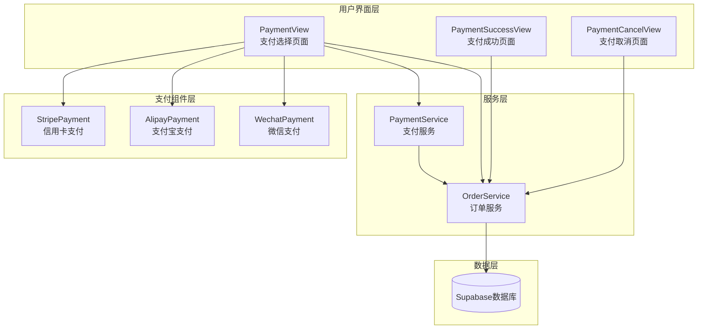
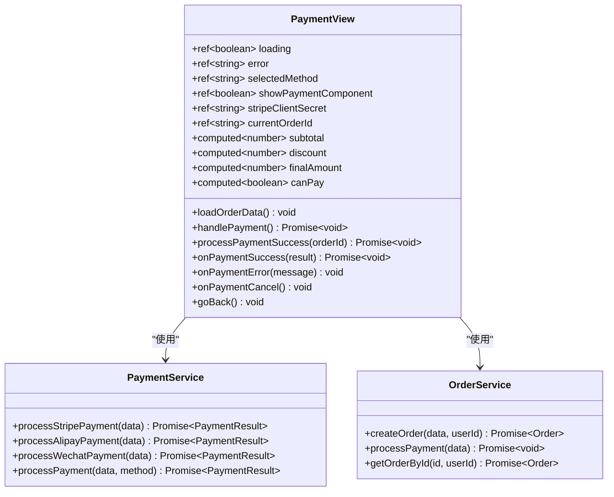
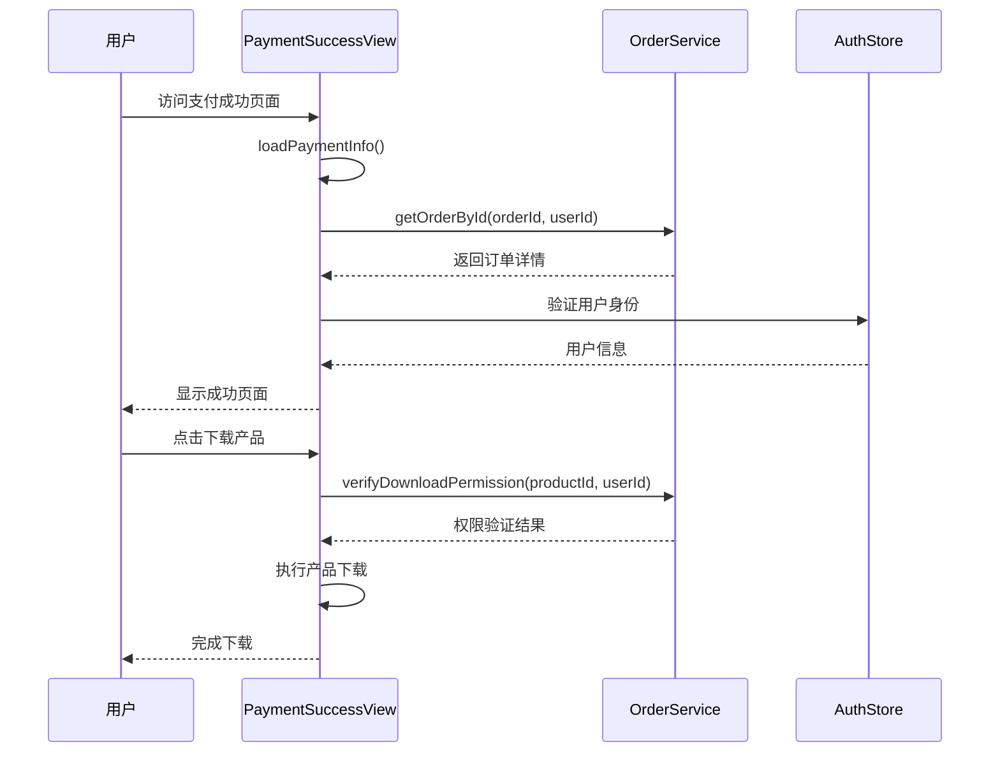
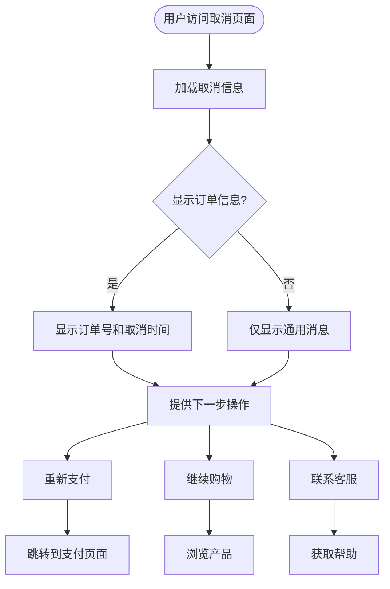
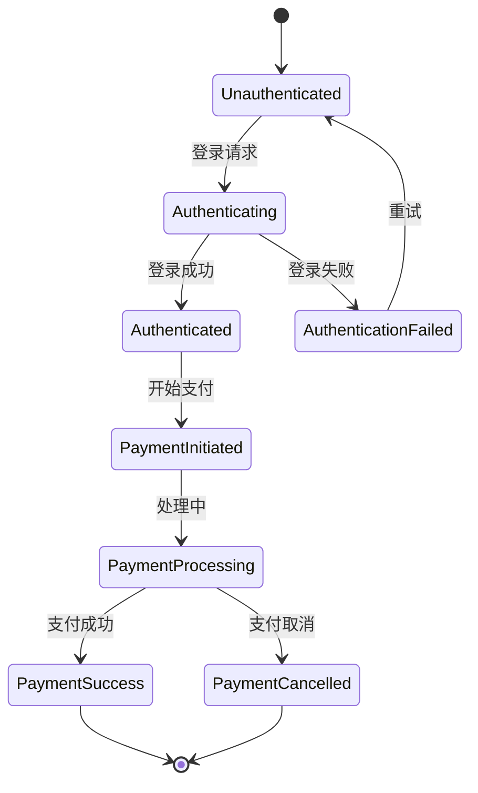
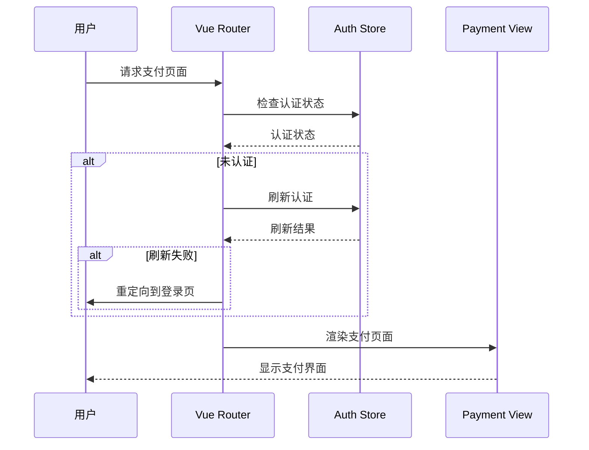
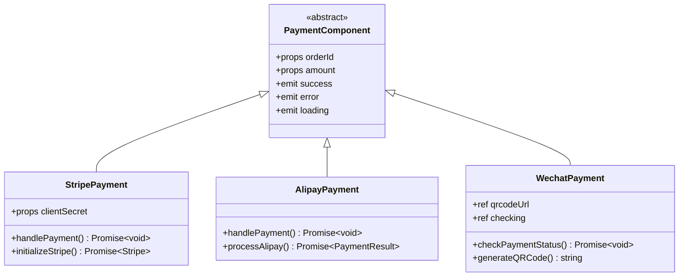
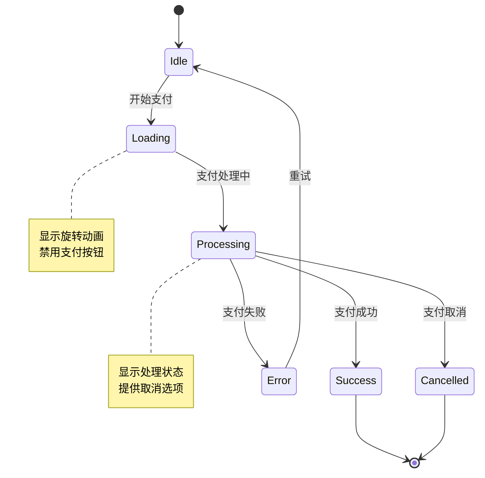

# 支付流程用户界面

<cite>
**本文档引用的文件**
- [PaymentView.vue](file://src/views/PaymentView.vue)
- [PaymentSuccessView.vue](file://src/views/PaymentSuccessView.vue)
- [PaymentCancelView.vue](file://src/views/PaymentCancelView.vue)
- [paymentService.ts](file://src/services/paymentService.ts)
- [orderService.ts](file://src/services/orderService.ts)
- [StripePayment.vue](file://src/components/StripePayment.vue)
- [AlipayPayment.vue](file://src/components/AlipayPayment.vue)
- [WechatPayment.vue](file://src/components/WechatPayment.vue)
- [index.ts](file://src/router/index.ts)
</cite>

## 目录
1. [项目概述](#项目概述)
2. [支付流程架构](#支付流程架构)
3. [核心视图组件分析](#核心视图组件分析)
4. [状态管理机制](#状态管理机制)
5. [路由守卫与页面跳转](#路由守卫与页面跳转)
6. [支付组件集成](#支付组件集成)
7. [安全性考量](#安全性考量)
8. [用户体验优化](#用户体验优化)
9. [故障排除指南](#故障排除指南)
10. [总结](#总结)

## 项目概述

本项目是一个现代化的支付流程用户界面系统，采用Vue 3 + TypeScript技术栈构建。系统包含三个核心视图组件，分别负责不同的支付场景：PaymentView处理支付选择和确认，PaymentSuccessView展示支付成功后的订单详情，PaymentCancelView处理支付取消或失败的情况。

系统支持多种支付方式，包括信用卡（Stripe）、支付宝和微信支付，通过统一的服务层接口实现支付处理。整个支付流程遵循最佳实践，确保安全性、可靠性和优秀的用户体验。

## 支付流程架构



**图表来源**
- [PaymentView.vue](file://src/views/PaymentView.vue#L1-L793)
- [PaymentSuccessView.vue](file://src/views/PaymentSuccessView.vue#L1-L445)
- [PaymentCancelView.vue](file://src/views/PaymentCancelView.vue#L1-L383)

## 核心视图组件分析

### PaymentView - 支付选择与确认页面

PaymentView是支付流程的核心入口，负责展示可选支付方式、收集用户确认信息并处理支付请求。



**图表来源**
- [PaymentView.vue](file://src/views/PaymentView.vue#L150-L300)
- [paymentService.ts](file://src/services/paymentService.ts#L338-L385)
- [orderService.ts](file://src/services/orderService.ts#L60-L120)

#### 主要功能特性

1. **多支付方式支持**：提供支付宝、微信支付和信用卡三种支付方式
2. **动态支付组件**：根据选择的支付方式动态渲染对应的支付组件
3. **订单信息展示**：清晰展示商品明细、优惠信息和最终金额
4. **账单地址填写**：完整的账单地址表单，支持必填字段验证
5. **防重复提交**：通过loading状态防止重复支付请求
6. **错误处理**：完善的错误提示和恢复机制

**章节来源**
- [PaymentView.vue](file://src/views/PaymentView.vue#L1-L793)

### PaymentSuccessView - 支付成功页面

PaymentSuccessView专门处理支付成功后的场景，提供详细的订单信息和后续操作指引。



**图表来源**
- [PaymentSuccessView.vue](file://src/views/PaymentSuccessView.vue#L80-L180)
- [orderService.ts](file://src/services/orderService.ts#L400-L450)

#### 成功页面特性

1. **订单详情展示**：显示订单号、支付金额、支付时间和支付方式
2. **下一步操作**：提供下载产品、查看邮件、查看订单等操作选项
3. **用户引导**：清晰的步骤指引和操作按钮
4. **客服支持**：提供多种联系方式和帮助信息
5. **响应式设计**：适配不同设备的屏幕尺寸

**章节来源**
- [PaymentSuccessView.vue](file://src/views/PaymentSuccessView.vue#L1-L200)

### PaymentCancelView - 支付取消页面

PaymentCancelView处理支付取消或失败的情况，提供友好的反馈和替代方案。



**图表来源**
- [PaymentCancelView.vue](file://src/views/PaymentCancelView.vue#L1-L100)

#### 取消页面特性

1. **友好反馈**：使用醒目的图标和颜色传达取消状态
2. **订单追踪**：显示相关订单信息以便用户识别
3. **替代方案**：提供重新支付、继续购物等选择
4. **客户支持**：集成多种联系方式和帮助渠道
5. **简洁设计**：去除复杂元素，专注于核心功能

**章节来源**
- [PaymentCancelView.vue](file://src/views/PaymentCancelView.vue#L1-L383)

## 状态管理机制

### Pinia Store集成

系统通过Pinia store管理全局状态，特别是用户认证状态和支付相关数据。



### 响应式状态管理

每个视图组件都使用Vue 3的组合式API管理本地状态：

- **loading**: 控制加载状态和防重复提交
- **error**: 存储和显示错误信息
- **selectedMethod**: 跟踪用户选择的支付方式
- **showPaymentComponent**: 控制支付组件的显示状态

**章节来源**
- [PaymentView.vue](file://src/views/PaymentView.vue#L150-L200)

## 路由守卫与页面跳转

### 路由配置

系统通过Vue Router配置了完整的支付流程路由：

```typescript
// 支付相关路由配置
{
  path: "/payment",
  name: "Payment",
  component: () => import("../views/PaymentView.vue"),
  meta: {
    title: "支付页面",
    description: "安全的支付处理",
    requiresAuth: true,
  },
},
{
  path: "/payment/success",
  name: "PaymentSuccess",
  component: () => import("../views/PaymentSuccessView.vue"),
  meta: {
    title: "支付成功",
    description: "支付完成确认",
  },
},
{
  path: "/payment/cancel",
  name: "PaymentCancel",
  component: () => import("../views/PaymentCancelView.vue"),
  meta: {
    title: "支付取消",
    description: "支付已取消",
  },
}
```

### 路由守卫机制



**图表来源**
- [index.ts](file://src/router/index.ts#L350-L398)

**章节来源**
- [index.ts](file://src/router/index.ts#L350-L398)

## 支付组件集成

### 支付组件架构



**图表来源**
- [StripePayment.vue](file://src/components/StripePayment.vue#L1-L50)
- [AlipayPayment.vue](file://src/components/AlipayPayment.vue#L1-L50)
- [WechatPayment.vue](file://src/components/WechatPayment.vue#L1-L50)

### 支付组件特性

#### Stripe Payment组件
- **信用卡支付**：支持Visa、MasterCard等主流信用卡
- **安全处理**：使用Stripe的客户端密钥进行安全支付
- **实时验证**：即时验证卡片信息和支付状态
- **错误处理**：完善的错误提示和恢复机制

#### Alipay Payment组件
- **支付宝集成**：直接跳转到支付宝支付页面
- **模拟支付**：开发环境下的模拟支付流程
- **状态跟踪**：实时跟踪支付状态变化
- **用户友好**：简洁直观的操作界面

#### Wechat Payment组件
- **二维码支付**：生成支付二维码供用户扫描
- **状态检查**：定期检查支付状态
- **手动确认**：用户确认支付完成后手动触发
- **视觉反馈**：清晰的进度指示和状态反馈

**章节来源**
- [StripePayment.vue](file://src/components/StripePayment.vue#L1-L196)
- [AlipayPayment.vue](file://src/components/AlipayPayment.vue#L1-L159)
- [WechatPayment.vue](file://src/components/WechatPayment.vue#L1-L242)

## 安全性考量

### 敏感信息保护

1. **支付信息脱敏**：在用户界面上对敏感信息进行适当脱敏处理
2. **HTTPS强制**：所有支付相关页面必须通过HTTPS访问
3. **CSRF防护**：实施跨站请求伪造防护机制
4. **输入验证**：严格的客户端和服务器端输入验证

### URL参数校验

```typescript
// 支付成功页面的参数验证
const loadPaymentInfo = () => {
  const orderParam = route.query.order;
  const amountParam = route.query.amount;

  if (orderParam) {
    orderId.value = orderParam as string;
  }

  if (amountParam) {
    amount.value = parseFloat(amountParam as string);
  }

  // 参数有效性验证
  if (isNaN(amount.value) || amount.value <= 0) {
    throw new Error("无效的支付金额");
  }
};
```

### 支付服务安全

支付服务实现了多层次的安全保障：

- **环境变量保护**：敏感配置通过环境变量管理
- **支付网关验证**：所有支付请求都经过支付网关验证
- **双重验证**：支付确认需要二次验证
- **审计日志**：记录所有支付相关操作

**章节来源**
- [PaymentSuccessView.vue](file://src/views/PaymentSuccessView.vue#L80-L120)
- [paymentService.ts](file://src/services/paymentService.ts#L1-L50)

## 用户体验优化

### 加载动画与交互反馈



### 性能优化策略

1. **懒加载**：支付组件按需加载，减少初始包大小
2. **缓存策略**：合理利用浏览器缓存和CDN加速
3. **预加载**：关键资源的预加载优化
4. **代码分割**：按路由进行代码分割

### 响应式设计

所有支付页面都采用响应式设计：

- **移动端适配**：针对移动设备优化布局和交互
- **断点设计**：合理的断点设置确保在各种设备上良好显示
- **触摸友好**：大尺寸点击区域和适当的间距
- **字体缩放**：支持系统字体缩放设置

**章节来源**
- [PaymentView.vue](file://src/views/PaymentView.vue#L695-L791)

## 故障排除指南

### 常见问题与解决方案

#### 支付组件无法加载
**症状**：支付组件显示"支付当前不可用"
**原因**：环境变量配置不正确
**解决方案**：
1. 检查`.env`文件中的支付网关配置
2. 确认支付网关的启用状态
3. 验证API密钥的有效性

#### 支付超时问题
**症状**：支付过程中出现超时错误
**原因**：网络连接不稳定或支付网关响应慢
**解决方案**：
1. 实施重试机制
2. 提供更明确的超时提示
3. 优化网络请求配置

#### 订单状态不一致
**症状**：支付成功但订单状态未更新
**原因**：异步处理延迟或数据库事务问题
**解决方案**：
1. 实施补偿机制
2. 添加状态同步功能
3. 提供人工干预接口

### 调试工具与技巧

1. **浏览器开发者工具**：监控网络请求和JavaScript错误
2. **Vue DevTools**：调试Vue组件状态和生命周期
3. **支付网关控制台**：查看支付请求和响应详情
4. **日志分析**：分析服务器端日志定位问题

**章节来源**
- [paymentService.ts](file://src/services/paymentService.ts#L338-L385)
- [orderService.ts](file://src/services/orderService.ts#L120-L180)

## 总结

本支付流程用户界面系统通过精心设计的三个核心视图组件，提供了完整的支付解决方案。系统具有以下优势：

### 技术优势
- **模块化设计**：清晰的组件分离和职责划分
- **类型安全**：完整的TypeScript类型定义
- **状态管理**：合理的状态管理和持久化策略
- **错误处理**：完善的错误处理和恢复机制

### 功能优势
- **多支付方式**：支持主流支付平台
- **用户体验**：流畅的交互和友好的界面设计
- **安全性**：多层次的安全保障措施
- **可扩展性**：易于添加新的支付方式和功能

### 最佳实践
- **响应式设计**：适配各种设备和屏幕尺寸
- **性能优化**：合理的资源管理和加载策略
- **可维护性**：清晰的代码结构和文档
- **测试覆盖**：完善的单元测试和集成测试

这个支付流程系统为现代Web应用提供了可靠的支付解决方案，能够满足各种规模企业的支付需求，同时保持良好的用户体验和系统稳定性。