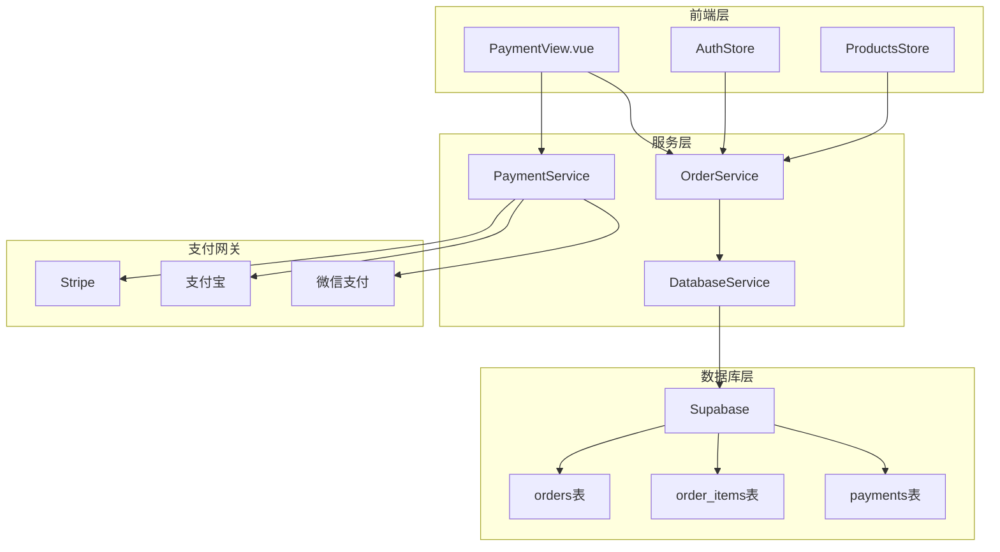
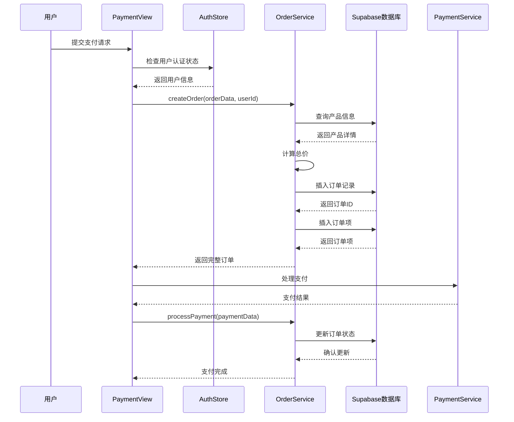
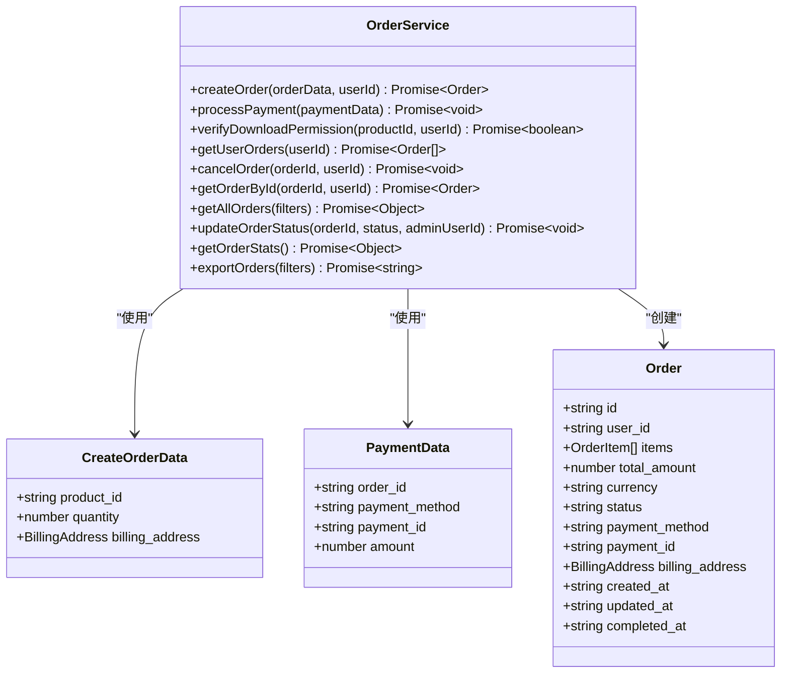
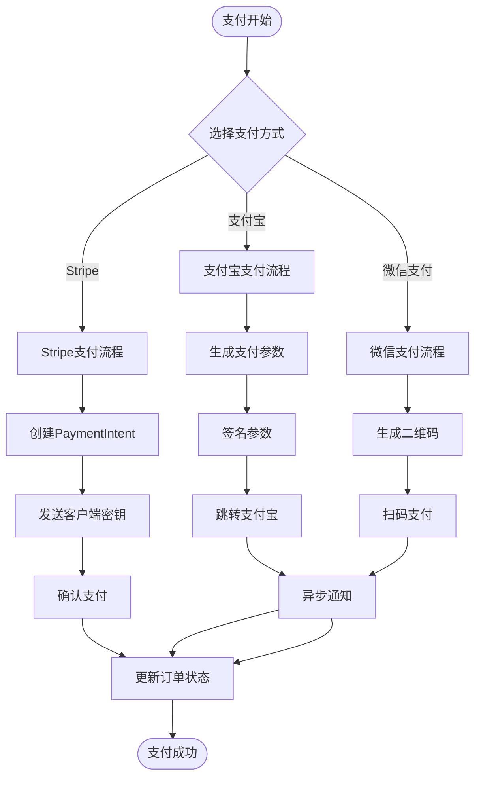
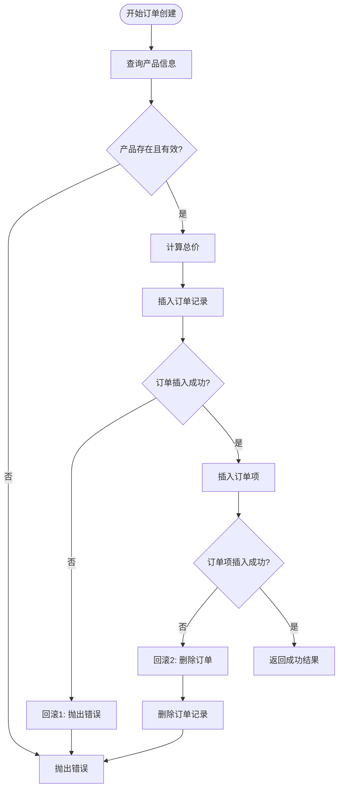
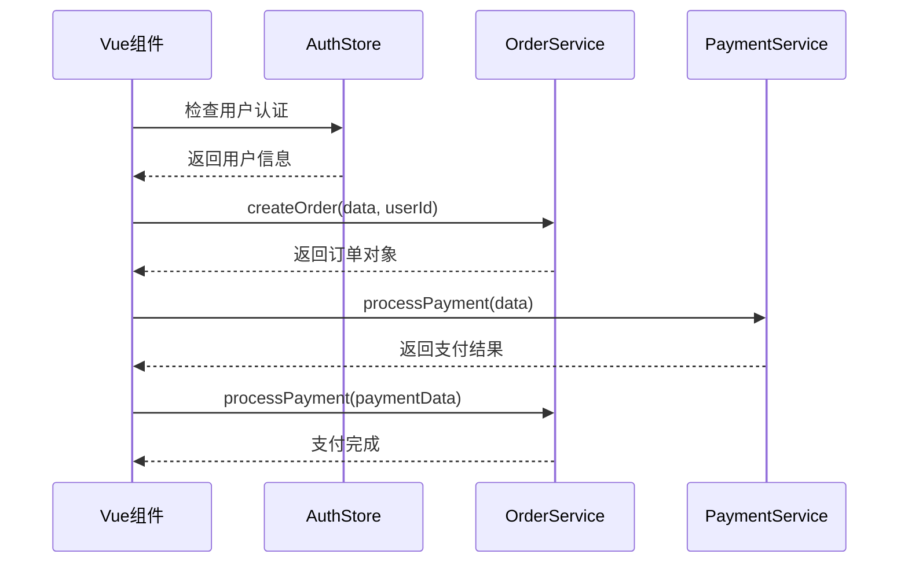
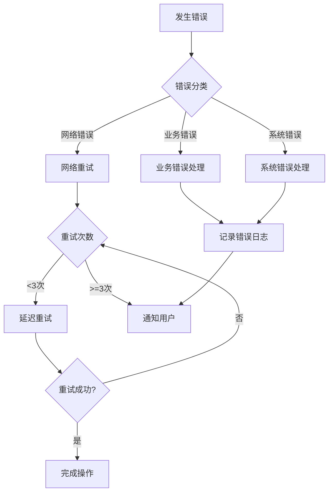

# 订单创建流程详细分析

<cite>
**本文档引用的文件**
- [orderService.ts](file://src/services/orderService.ts)
- [auth.ts](file://src/stores/auth.ts)
- [products.ts](file://src/stores/products.ts)
- [PaymentView.vue](file://src/views/PaymentView.vue)
- [paymentService.ts](file://src/services/paymentService.ts)
- [supabaseClient.ts](file://src/lib/supabaseClient.ts)
</cite>

## 目录
1. [概述](#概述)
2. [系统架构](#系统架构)
3. [订单创建核心流程](#订单创建核心流程)
4. [订单服务详细分析](#订单服务详细分析)
5. [支付集成机制](#支付集成机制)
6. [数据库事务与原子性](#数据库事务与原子性)
7. [前端交互流程](#前端交互流程)
8. [错误处理与重试机制](#错误处理与重试机制)
9. [性能优化策略](#性能优化策略)
10. [总结](#总结)

## 概述

订单创建流程是电商平台的核心业务逻辑，涉及多个服务组件的协调工作。本文档详细分析了从用户下单到支付完成的完整流程，重点关注`OrderService`中的`createOrder`方法实现、Supabase数据库的事务处理机制，以及前后端的协同工作模式。

该系统采用现代化的Vue 3 + TypeScript架构，结合Pinia状态管理、Supabase数据库和多种支付网关，实现了完整的订单生命周期管理。

## 系统架构



**图表来源**
- [PaymentView.vue](file://src/views/PaymentView.vue#L1-L50)
- [orderService.ts](file://src/services/orderService.ts#L1-L100)
- [paymentService.ts](file://src/services/paymentService.ts#L1-L50)

## 订单创建核心流程

订单创建流程遵循严格的业务规则和数据一致性要求。以下是完整的执行序列：



**图表来源**
- [PaymentView.vue](file://src/views/PaymentView.vue#L200-L300)
- [orderService.ts](file://src/services/orderService.ts#L60-L150)

**章节来源**
- [PaymentView.vue](file://src/views/PaymentView.vue#L200-L350)
- [orderService.ts](file://src/services/orderService.ts#L60-L150)

## 订单服务详细分析

### OrderService类结构

`OrderService`是一个静态类，提供了完整的订单管理功能。其核心方法包括订单创建、支付处理、状态管理和统计查询。



**图表来源**
- [orderService.ts](file://src/services/orderService.ts#L10-L50)
- [orderService.ts](file://src/services/orderService.ts#L60-L150)

### createOrder方法实现

`createOrder`方法是订单创建的核心逻辑，包含以下关键步骤：

#### 1. 参数校验与产品验证

```typescript
// 获取产品信息并验证
const { data: product, error: productError } = await supabase
  .from("products")
  .select("id, name, price, is_digital")
  .eq("id", orderData.product_id)
  .eq("status", "active")
  .single();

if (productError || !product) {
  throw new Error("产品不存在或已下架");
}
```

#### 2. 总价计算

```typescript
const totalAmount = (product as ProductRow).price * orderData.quantity;
```

#### 3. 订单创建

```typescript
const orderInsertData: OrderInsertData = {
  user_id: userId,
  total_amount: totalAmount,
  currency: "CNY",
  status: "pending",
  billing_address: convertBillingAddress(orderData.billing_address),
};
```

#### 4. 订单项创建

```typescript
const orderItemInsertData: OrderItemInsertData = {
  order_id: (order as OrderRow).id,
  product_id: orderData.product_id,
  quantity: orderData.quantity,
  unit_price: (product as ProductRow).price,
  total_price: totalAmount,
};
```

**章节来源**
- [orderService.ts](file://src/services/orderService.ts#L60-L150)

## 支付集成机制

### 支付服务架构



**图表来源**
- [paymentService.ts](file://src/services/paymentService.ts#L50-L150)
- [PaymentView.vue](file://src/views/PaymentView.vue#L300-L400)

### 支付方式处理

系统支持三种主要支付方式：

#### 1. Stripe支付处理

```typescript
static async processStripePayment(paymentData: PaymentData): Promise<PaymentResult> {
  // 创建支付意图
  const paymentIntentData = {
    amount: Math.round(paymentData.amount * 100),
    currency: "cny",
    metadata: {
      order_id: paymentData.order_id,
      payment_method: paymentData.payment_method,
    },
  };
  
  // 模拟PaymentIntent创建
  const mockPaymentIntent = {
    id: `pi_${Date.now()}`,
    client_secret: `pi_${Date.now()}_secret_${Math.random().toString(36).substr(2, 9)}`,
    status: "requires_payment_method",
  };
  
  return {
    success: true,
    clientSecret: mockPaymentIntent.client_secret,
    orderId: paymentData.order_id,
    method: "stripe",
  };
}
```

#### 2. 支付宝支付处理

```typescript
static async processAlipayPayment(paymentData: PaymentData): Promise<PaymentResult> {
  const alipayParams = {
    app_id: PAYMENT_CONFIG.alipay.appId,
    method: "alipay.trade.page.pay",
    biz_content: JSON.stringify({
      out_trade_no: paymentData.order_id,
      total_amount: paymentData.amount.toFixed(2),
      subject: `订单支付 - ${paymentData.order_id}`,
    }),
  };
  
  // 生成模拟支付URL
  const mockPaymentUrl = this.generateAlipayMockUrl(alipayParams);
  
  return {
    success: true,
    redirectUrl: mockPaymentUrl,
    orderId: paymentData.order_id,
    method: "alipay",
  };
}
```

**章节来源**
- [paymentService.ts](file://src/services/paymentService.ts#L50-L200)

## 数据库事务与原子性

### Supabase事务处理

虽然Supabase本身不支持传统的关系型数据库事务，但通过精心设计的业务逻辑和错误处理机制，可以实现类似事务的效果。



**图表来源**
- [orderService.ts](file://src/services/orderService.ts#L60-L150)

### 原子性保证机制

#### 1. 错误处理链

每个数据库操作都有对应的错误处理逻辑：

```typescript
try {
  // 产品查询
  const { data: product, error: productError } = await supabase
    .from("products")
    .select("id, name, price, is_digital")
    .eq("id", orderData.product_id)
    .eq("status", "active")
    .single();

  if (productError || !product) {
    throw new Error("产品不存在或已下架");
  }

  // 订单插入
  const { data: order, error: orderError } = await supabase
    .from("orders")
    .insert([orderInsertData])
    .select()
    .single();

  if (orderError) throw orderError;
  if (!order) throw new Error("创建订单失败");

} catch (error) {
  console.error("创建订单失败:", error);
  throw new Error("创建订单失败");
}
```

#### 2. 数据库约束

系统依赖数据库层面的约束来保证数据完整性：

- 外键约束确保订单项关联正确的订单
- 唯一约束防止重复订单创建
- CHECK约束验证状态字段的有效性

**章节来源**
- [orderService.ts](file://src/services/orderService.ts#L60-L150)
- [supabaseClient.ts](file://src/lib/supabaseClient.ts#L140-L200)

## 前端交互流程

### Pinia Store集成



**图表来源**
- [PaymentView.vue](file://src/views/PaymentView.vue#L250-L350)
- [auth.ts](file://src/stores/auth.ts#L50-L100)

### 前端状态管理

#### 1. 订单数据流

```typescript
// PaymentView.vue中的订单处理逻辑
const handlePayment = async () => {
  try {
    loading.value = true;
    error.value = null;

    // 导入必要的服务
    const { OrderService } = await import("@/services/orderService");
    const { PaymentService } = await import("@/services/paymentService");
    const { useAuthStore } = await import("@/stores/auth");

    const authStore = useAuthStore();
    if (!authStore.user) {
      throw new Error("请先登录");
    }

    // 创建订单（如果还没有）
    let orderId = route.query.order as string;

    if (!orderId) {
      const orderData = {
        product_id: productId,
        quantity: 1,
        billing_address: billingInfo.value,
      };

      const newOrder = await OrderService.createOrder(
        orderData,
        authStore.user.id,
      );
      orderId = newOrder.id;
    }

    // 处理支付...
  } catch (err) {
    error.value = err instanceof Error ? err.message : "支付失败，请重试";
  } finally {
    loading.value = false;
  }
};
```

#### 2. 用户认证状态

```typescript
// AuthStore中的认证状态管理
const isAuthenticated = computed(() => !!user.value);
const isAdmin = computed(() => {
  return user.value?.role === "admin" || user.value?.role === "super_admin";
});
```

**章节来源**
- [PaymentView.vue](file://src/views/PaymentView.vue#L250-L350)
- [auth.ts](file://src/stores/auth.ts#L30-L80)

## 错误处理与重试机制

### 错误分类与处理策略



### 重试机制实现

#### 1. 自动重试逻辑

```typescript
// 可扩展的重试机制
async function retryOperation<T>(
  operation: () => Promise<T>,
  maxRetries: number = 3,
  delay: number = 1000
): Promise<T> {
  let lastError: Error;
  
  for (let i = 0; i <= maxRetries; i++) {
    try {
      return await operation();
    } catch (error) {
      lastError = error as Error;
      
      if (i < maxRetries) {
        // 指数退避算法
        const waitTime = delay * Math.pow(2, i);
        await new Promise(resolve => setTimeout(resolve, waitTime));
        continue;
      }
    }
  }
  
  throw lastError;
}
```

#### 2. 错误恢复策略

```typescript
// 订单创建的错误恢复
try {
  const order = await OrderService.createOrder(orderData, userId);
  return order;
} catch (error) {
  if (error.message.includes("产品不存在")) {
    // 产品不存在时的恢复策略
    return handleProductNotFound(orderData);
  } else if (error.message.includes("网络")) {
    // 网络错误时的恢复策略
    return handleNetworkError(orderData);
  } else {
    // 其他错误的通用处理
    throw error;
  }
}
```

**章节来源**
- [orderService.ts](file://src/services/orderService.ts#L150-L200)

## 性能优化策略

### 缓存机制

#### 1. 数据缓存策略

```typescript
// 缓存管理器
class CacheManager {
  private cache = new Map<string, { data: any; expires: number }>();
  
  set(key: string, data: any, ttl: number = 300000) {
    this.cache.set(key, {
      data,
      expires: Date.now() + ttl
    });
  }
  
  get(key: string) {
    const item = this.cache.get(key);
    if (!item) return null;
    if (Date.now() > item.expires) {
      this.cache.delete(key);
      return null;
    }
    return item.data;
  }
}
```

#### 2. 数据库查询优化

```typescript
// 优化的查询策略
const optimizedQuery = async (productId: string) => {
  // 使用索引优化查询
  const { data, error } = await supabase
    .from("products")
    .select("id, name, price, is_digital")
    .eq("id", productId)
    .eq("status", "active")
    .single();
    
  return data;
};
```

### 并发控制

#### 1. 防止超卖机制

```typescript
// 防止超卖的库存检查
const checkInventory = async (productId: string, quantity: number) => {
  const { data: inventory, error } = await supabase
    .from("inventory")
    .select("available_quantity")
    .eq("product_id", productId)
    .single();
    
  if (error || !inventory) {
    throw new Error("库存信息获取失败");
  }
  
  if (inventory.available_quantity < quantity) {
    throw new Error("库存不足");
  }
  
  return true;
};
```

## 总结

订单创建流程是一个复杂的业务逻辑，涉及多个组件的协调工作。本文档详细分析了以下关键方面：

### 核心特性

1. **完整的订单生命周期管理**：从创建到支付完成的全流程覆盖
2. **多支付方式支持**：Stripe、支付宝、微信支付的统一接口
3. **数据一致性保障**：通过错误处理和数据库约束保证数据完整性
4. **用户体验优化**：实时状态反馈和错误提示机制
5. **性能优化**：缓存策略和查询优化

### 技术亮点

- **模块化设计**：清晰的服务分离和职责划分
- **错误处理**：完善的异常捕获和恢复机制
- **并发安全**：防止超卖和数据竞争的保护措施
- **可扩展性**：支持新支付方式和业务需求的扩展能力

### 最佳实践

1. **服务层解耦**：通过独立的服务类实现业务逻辑的模块化
2. **状态管理**：利用Pinia实现全局状态的集中管理
3. **错误处理**：统一的错误处理和用户友好的错误提示
4. **性能监控**：关键路径的性能监控和优化

该订单创建流程为电商平台提供了稳定可靠的订单处理能力，能够满足现代电商应用的各种业务需求和技术挑战。