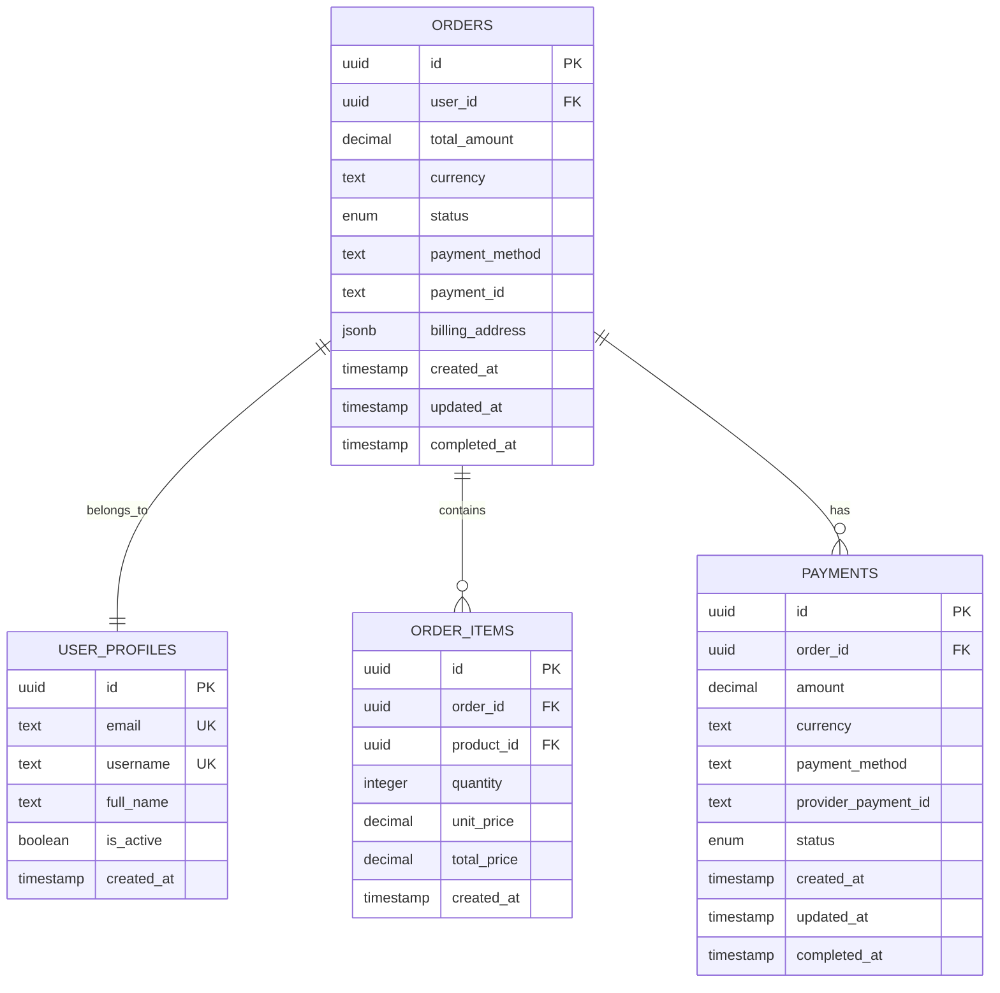
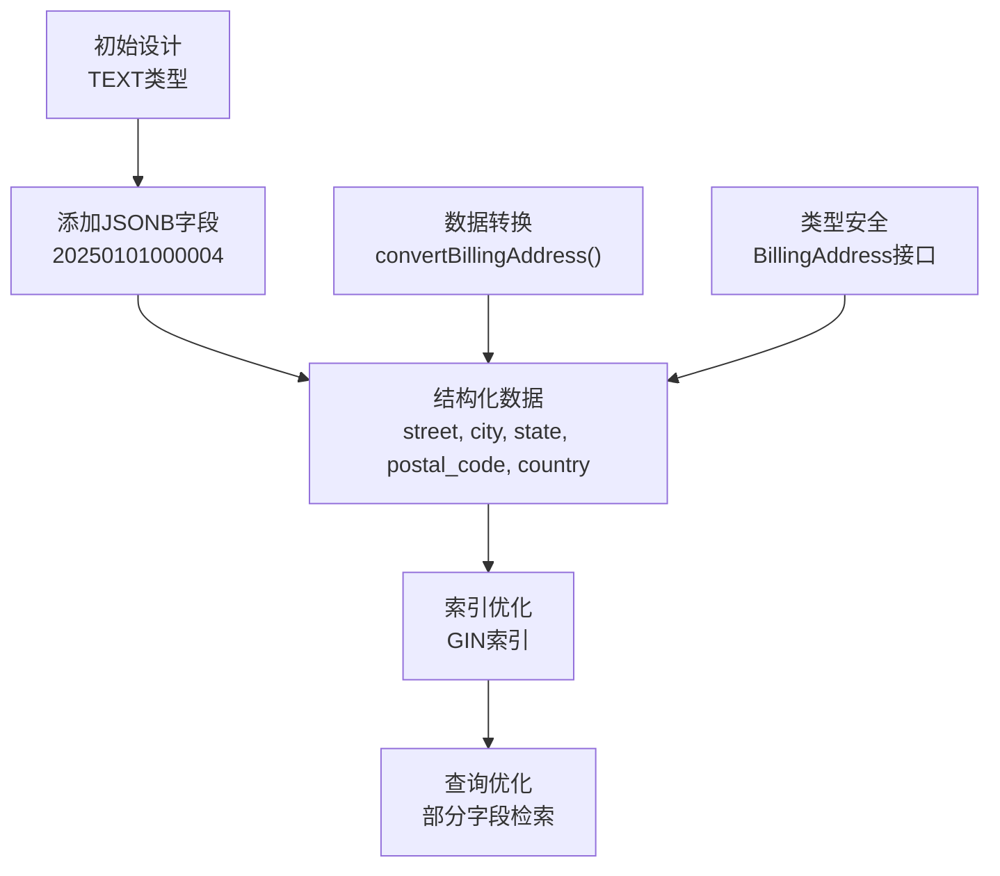
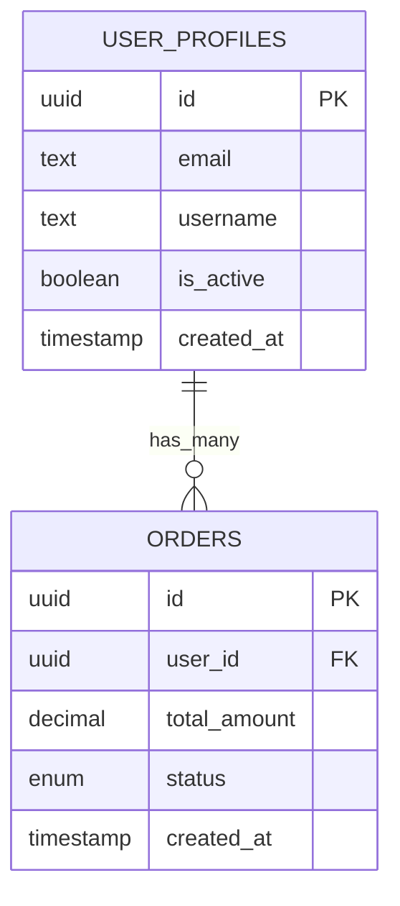
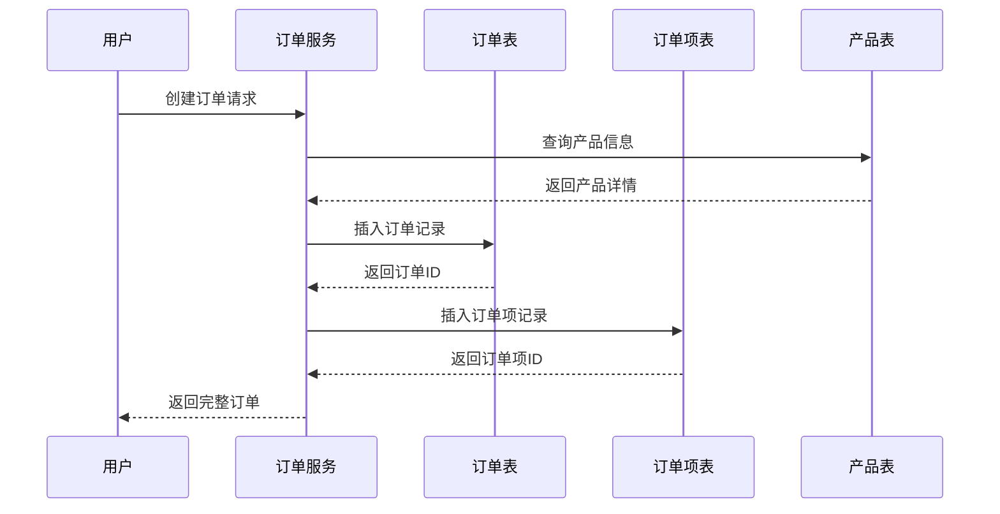
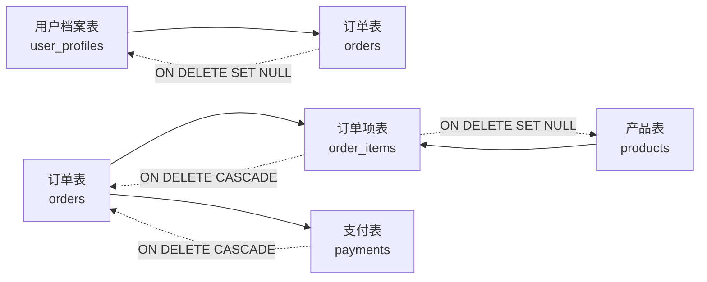
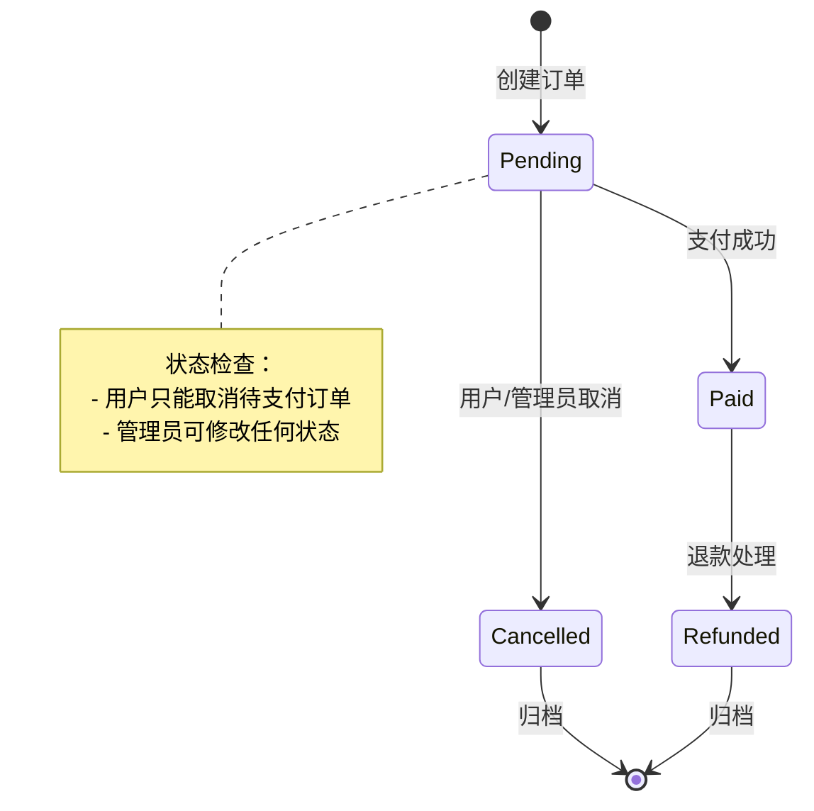
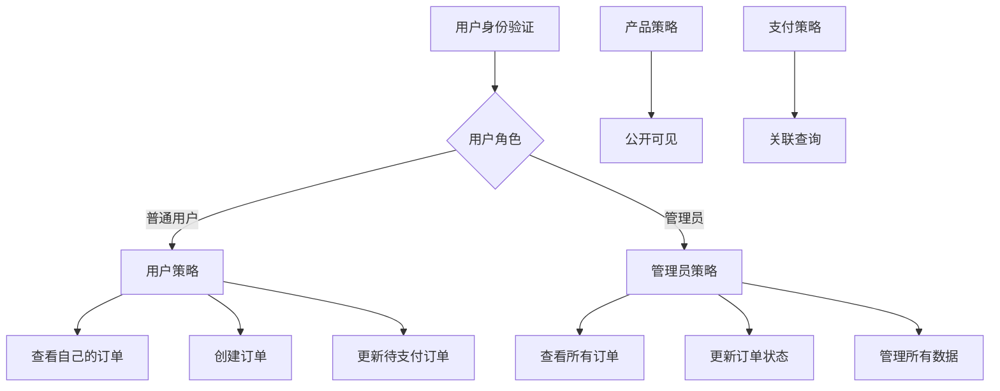
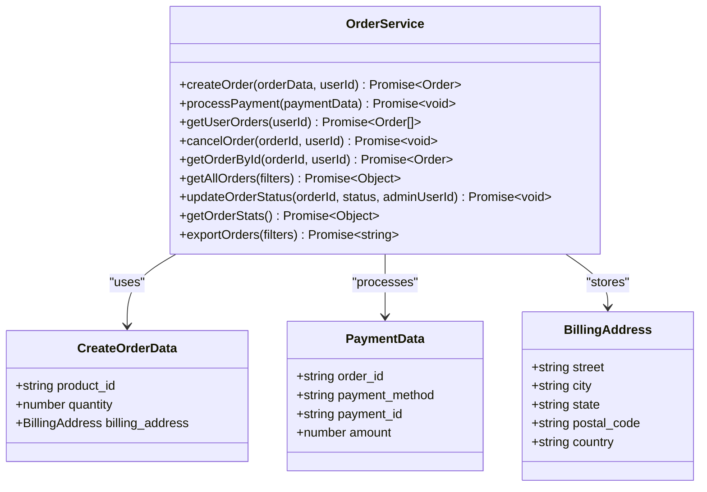

# 订单数据模型

<cite>
**本文档中引用的文件**
- [20241224000001_initial_schema.sql](file://supabase/migrations/20241224000001_initial_schema.sql)
- [20250101000004_add_billing_address_to_orders.sql](file://supabase/migrations/20250101000004_add_billing_address_to_orders.sql)
- [20250103000001_add_performance_indexes.sql](file://supabase/migrations/20250103000001_add_performance_indexes.sql)
- [20241224000002_rls_policies.sql](file://supabase\migrations\20241224000002_rls_policies.sql)
- [orderService.ts](file://src/services/orderService.ts)
- [supabase-schema.ts](file://src\lib\supabase-schema.ts)
- [database.ts](file://src\types\database.ts)
</cite>

## 目录
1. [简介](#简介)
2. [核心字段设计](#核心字段设计)
3. [JSONB结构设计](#jsonb结构设计)
4. [关系映射](#关系映射)
5. [外键约束与索引](#外键约束与索引)
6. [软删除与数据归档](#软删除与数据归档)
7. [访问控制策略](#访问控制策略)
8. [性能优化](#性能优化)
9. [服务层实现](#服务层实现)
10. [总结](#总结)

## 简介

订单数据模型是整个电商系统的核心组件之一，负责管理用户的购买行为、支付流程和订单状态。该模型采用PostgreSQL的JSONB字段存储灵活的账单地址信息，并通过完善的外键约束确保数据完整性。

## 核心字段设计

### 主要字段类型与约束



**图表来源**
- [20241224000001_initial_schema.sql](file://supabase/migrations/20241224000001_initial_schema.sql#L115-L130)

### 字段详细说明

#### 基础标识字段
- **id**: 使用UUID作为主键，确保分布式环境下的唯一性
- **user_id**: 外键关联到用户档案表，建立一对一关系

#### 金额与货币字段
- **total_amount**: DECIMAL(10,2)类型，精确存储订单总金额
- **currency**: TEXT类型，默认值为'CNY'，支持多币种扩展

#### 状态管理字段
- **status**: 枚举类型，包含'pending'(待支付)、'paid'(已支付)、'cancelled'(已取消)、'refunded'(已退款)
- **payment_method**: 存储支付方式信息
- **payment_id**: 第三方支付平台的支付ID

#### 时间戳字段
- **created_at**: 自动记录创建时间，默认NOW()
- **updated_at**: 自动更新时间戳，通过触发器维护
- **completed_at**: 订单完成时间，仅在状态变为"paid"时设置

**章节来源**
- [20241224000001_initial_schema.sql](file://supabase/migrations/20241224000001_initial_schema.sql#L115-L130)
- [supabase-schema.ts](file://src\lib\supabase-schema.ts#L58-L68)

## JSONB结构设计

### 账单地址字段演进

账单地址字段从最初的简单字符串设计，演进为现在的JSONB结构，提供了更大的灵活性和数据完整性保证。



**图表来源**
- [20250101000004_add_billing_address_to_orders.sql](file://supabase/migrations\20250101000004_add_billing_address_to_orders.sql#L1-L20)
- [orderService.ts](file://src\services\orderService.ts#L15-L25)

### JSONB存储格式规范

账单地址采用标准化的JSONB结构：

```typescript
interface BillingAddress {
  street: string;      // 街道地址
  city: string;        // 城市
  state: string;       // 州/省
  postal_code: string; // 邮政编码
  country: string;     // 国家
}
```

### 结构化优势

1. **数据完整性**: 通过JSONB结构确保字段的正确组织
2. **查询效率**: 支持GIN索引，提高部分字段检索性能
3. **扩展性**: 易于添加新的地址字段而不影响现有结构
4. **类型安全**: 在TypeScript层面提供强类型检查

**章节来源**
- [20250101000004_add_billing_address_to_orders.sql](file://supabase\migrations\20250101000004_add_billing_address_to_orders.sql#L1-L43)
- [orderService.ts](file://src\services\orderService.ts#L15-L25)

## 关系映射

### 与用户档案表的关系

订单表与用户档案表建立了一对多关系：



**图表来源**
- [20241224000001_initial_schema.sql](file://supabase\migrations\20241224000001_initial_schema.sql#L115-L130)

### 与订单项表的关联

订单项表与订单表形成一对多关系，每个订单包含多个订单项：



**图表来源**
- [orderService.ts](file://src\services\orderService.ts#L60-L120)

### 外键约束策略

1. **用户ID外键**: ON DELETE SET NULL，防止级联删除影响订单历史
2. **订单项外键**: ON DELETE CASCADE，确保订单删除时清理相关订单项
3. **产品ID外键**: ON DELETE SET NULL，保留订单历史中的产品信息

**章节来源**
- [20241224000001_initial_schema.sql](file://supabase\migrations\20241224000001_initial_schema.sql#L115-L130)
- [20250103000001_add_performance_indexes.sql](file://supabase\migrations\20250103000001_add_performance_indexes.sql#L280-L320)

## 外键约束与索引

### 完善的外键约束体系



**图表来源**
- [20250103000001_add_performance_indexes.sql](file://supabase\migrations\20250103000001_add_performance_indexes.sql#L280-L320)

### 索引优化策略

#### 单字段索引
- **idx_orders_user_id**: 提升按用户查询订单的性能
- **idx_orders_status**: 加速状态过滤查询
- **idx_orders_created_at**: 支持时间范围查询
- **idx_orders_total_amount**: 优化金额排序查询

#### 复合索引
- **idx_orders_user_status**: 同时按用户和状态查询
- **idx_orders_status_created**: 按状态和创建时间排序
- **idx_tools_status_featured**: 工具表的复合索引

#### 特殊索引
- **GIN索引**: 为JSONB字段创建GIN索引，支持快速JSON查询
- **部分索引**: 只为活跃数据创建索引，减少索引大小
- **相似度索引**: 使用pg_trgm扩展支持模糊搜索

**章节来源**
- [20250103000001_add_performance_indexes.sql](file://supabase\migrations\20250103000001_add_performance_indexes.sql#L1-L100)

## 软删除与数据归档

### 当前实现策略

目前系统采用软删除策略，通过状态字段而非物理删除来维护数据完整性：



### 状态管理机制

1. **待支付状态**: 用户创建订单后进入待支付状态
2. **已支付状态**: 支付成功后更新为已支付状态
3. **已取消状态**: 用户或管理员取消订单
4. **已退款状态**: 已支付订单进行退款处理

### 数据归档考虑

虽然当前没有明确的归档策略，但系统设计考虑了以下归档场景：

1. **长期未支付订单**: 可能需要定期清理未支付订单
2. **历史订单查询**: 需要高效的查询性能
3. **合规要求**: 可能需要保留一定期限的历史数据

**章节来源**
- [orderService.ts](file://src\services\orderService.ts#L358-L380)
- [orderService.ts](file://src\services\orderService.ts#L650-L700)

## 访问控制策略

### 行级安全(RLS)策略

系统实现了完整的行级安全策略，确保数据访问的安全性和隐私保护：



**图表来源**
- [20241224000002_rls_policies.sql](file://supabase\migrations\20241224000002_rls_policies.sql#L100-L150)

### 权限控制层次

1. **用户级别权限**:
   - 查看自己的订单记录
   - 创建新的订单
   - 更新待支付的订单

2. **管理员级别权限**:
   - 查看所有订单记录
   - 修改任意订单的状态
   - 导出完整的订单数据

3. **系统级别权限**:
   - 自动创建支付记录
   - 更新订单状态
   - 管理支付信息

### 安全函数

系统提供了两个重要的安全函数：

1. **is_admin()**: 检查用户是否具有管理员权限
2. **get_user_role()**: 获取当前用户的权限等级

**章节来源**
- [20241224000002_rls_policies.sql](file://supabase\migrations\20241224000002_rls_policies.sql#L250-L295)

## 性能优化

### 索引策略详解

#### 查询性能优化

1. **高频查询字段索引**:
   - 用户ID索引: 支持按用户查询订单
   - 状态索引: 快速筛选特定状态的订单
   - 时间戳索引: 支持时间范围查询

2. **复合索引优化**:
   - 用户+状态组合索引: 提高用户特定状态查询性能
   - 状态+时间组合索引: 优化报表查询

#### 存储优化

1. **JSONB字段优化**:
   - GIN索引: 支持JSON字段的部分查询
   - 结构化存储: 减少冗余数据

2. **外键约束优化**:
   - 确保数据完整性
   - 支持级联操作
   - 避免孤立数据

### 性能监控指标

系统通过多种方式监控性能：

1. **查询延迟监控**: 跟踪慢查询
2. **索引使用率**: 监控索引效果
3. **并发连接数**: 控制数据库负载
4. **缓存命中率**: 优化内存使用

**章节来源**
- [20250103000001_add_performance_indexes.sql](file://supabase\migrations\20250103000001_add_performance_indexes.sql#L1-L100)

## 服务层实现

### 订单服务架构



**图表来源**
- [orderService.ts](file://src\services\orderService.ts#L1-L30)

### 核心业务逻辑

#### 订单创建流程
1. **产品验证**: 检查产品是否存在且状态有效
2. **金额计算**: 根据产品价格和数量计算总金额
3. **订单创建**: 插入订单记录并返回订单ID
4. **订单项创建**: 插入对应的订单项记录

#### 支付处理流程
1. **状态验证**: 确认订单处于待支付状态
2. **状态更新**: 更新订单为已支付状态
3. **支付记录**: 创建支付记录并关联订单
4. **事务保证**: 确保支付处理的原子性

#### 数据转换机制
系统实现了类型转换机制，将前端的BillingAddress接口转换为数据库的JSONB格式：

```typescript
const convertBillingAddress = (address: BillingAddress) => {
  return {
    street: address.address || "",
    city: address.city || "",
    state: address.state || "",
    postal_code: address.postal_code || "",
    country: address.country || "",
  };
};
```

**章节来源**
- [orderService.ts](file://src\services\orderService.ts#L60-L120)
- [orderService.ts](file://src\services\orderService.ts#L15-L25)

## 总结

订单数据模型展现了现代电商系统设计的最佳实践：

### 设计亮点

1. **灵活的数据结构**: JSONB字段支持动态地址信息
2. **完善的关系映射**: 清晰的外键约束确保数据完整性
3. **强大的索引策略**: 多层次索引优化查询性能
4. **严格的安全控制**: RLS策略保障数据安全
5. **优雅的状态管理**: 软删除策略维护业务连续性

### 技术特色

1. **PostgreSQL原生功能**: 充分利用JSONB和GIN索引
2. **TypeScript类型安全**: 强类型接口确保开发质量
3. **服务层抽象**: 清晰的业务逻辑分离
4. **性能监控**: 全面的性能指标收集

### 发展方向

1. **数据归档策略**: 实现长期数据的合理归档
2. **异步处理**: 支持复杂的订单处理流程
3. **扩展性设计**: 支持更多支付方式和物流选项
4. **监控完善**: 增强实时监控和告警机制

这个订单数据模型为整个电商系统提供了坚实的基础，既满足了当前的功能需求，又具备良好的扩展性和维护性。