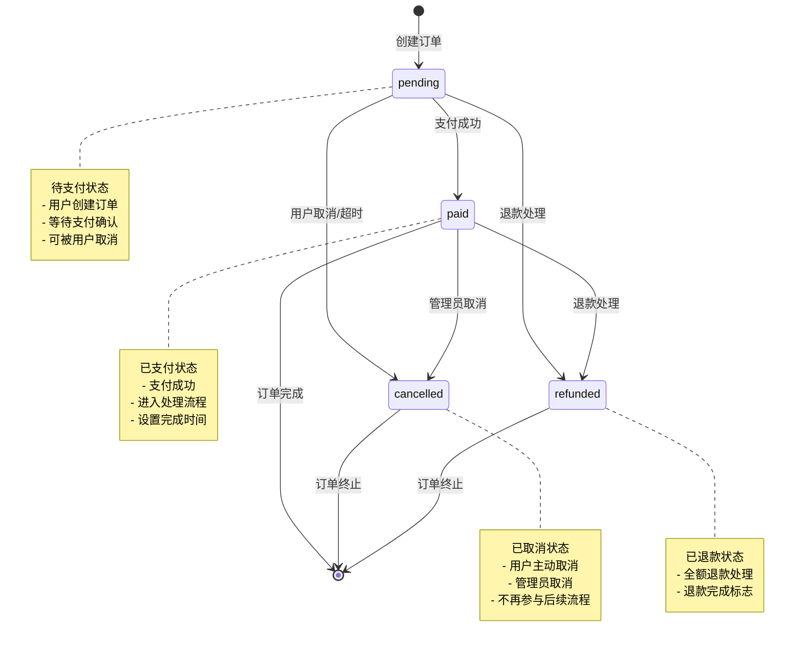
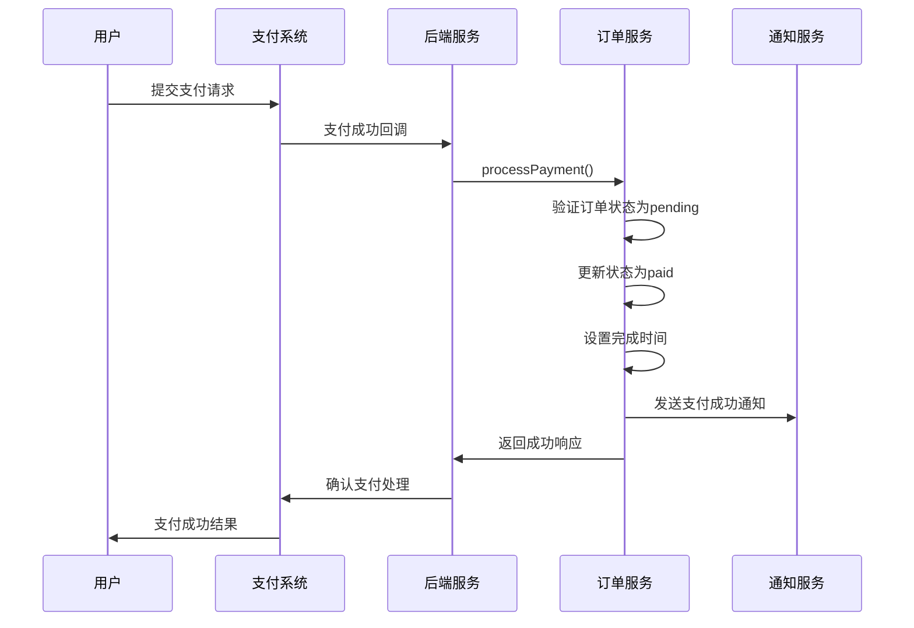
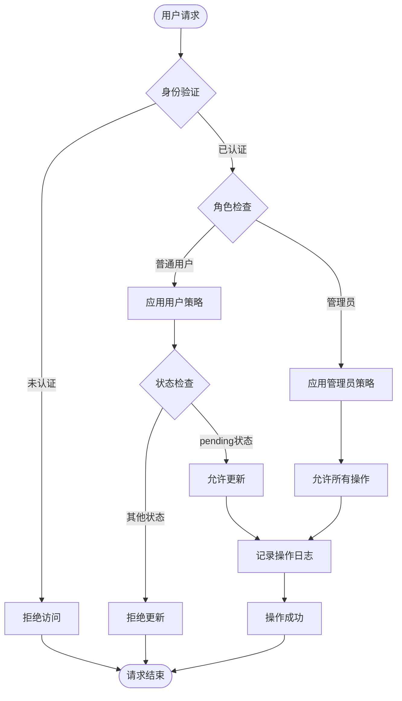

# 订单状态管理

<cite>
**本文档引用的文件**
- [orderService.ts](file://src/services/orderService.ts)
- [notificationService.ts](file://src/services/notificationService.ts)
- [OrderManagementView.vue](file://src/views/admin/OrderManagementView.vue)
- [OrdersView.vue](file://src/views/user/OrdersView.vue)
- [PaymentView.vue](file://src/views/PaymentView.vue)
- [supabase-schema.ts](file://src/lib/supabase-schema.ts)
- [create-rls-policies-final.sql](file://scripts/database/create-rls-policies-final.sql)
- [20241224000001_initial_schema.sql](file://supabase/migrations/20241224000001_initial_schema.sql)
</cite>

## 目录
1. [概述](#概述)
2. [订单状态定义](#订单状态定义)
3. [状态机架构](#状态机架构)
4. [状态转换规则](#状态转换规则)
5. [触发条件与业务校验](#触发条件与业务校验)
6. [通知机制](#通知机制)
7. [数据库RLS策略](#数据库rls策略)
8. [前端实现](#前端实现)
9. [性能考虑](#性能考虑)
10. [故障排除指南](#故障排除指南)
11. [总结](#总结)

## 概述

订单状态管理系统是整个电商应用的核心组件之一，负责管理订单在整个生命周期中的状态流转。该系统采用状态机模式，确保订单状态的变更遵循严格的业务规则，同时提供完整的审计跟踪和实时通知机制。

系统支持以下核心状态：
- **待支付 (pending)**: 新创建的订单，等待用户完成支付
- **已支付 (paid)**: 用户已完成支付，订单进入处理流程
- **已取消 (cancelled)**: 订单被用户或管理员取消
- **已退款 (refunded)**: 已支付的订单被全额退款

## 订单状态定义

### 数据库表结构

订单状态在数据库层面通过`orders`表的`status`字段进行管理：

```sql
CREATE TABLE IF NOT EXISTS orders (
    id UUID DEFAULT uuid_generate_v4() PRIMARY KEY,
    user_id UUID REFERENCES user_profiles(id) ON DELETE SET NULL,
    total_amount DECIMAL(10,2) NOT NULL,
    currency TEXT DEFAULT 'CNY',
    status order_status DEFAULT 'pending',
    payment_method TEXT,
    payment_id TEXT,
    billing_address JSONB,
    created_at TIMESTAMP WITH TIME ZONE DEFAULT NOW(),
    updated_at TIMESTAMP WITH TIME ZONE DEFAULT NOW(),
    completed_at TIMESTAMP WITH TIME ZONE
);
```

### TypeScript接口定义

```typescript
interface OrderRow {
  id: string;
  user_id: string;
  total_amount: number;
  currency: string;
  status: string;
  payment_method?: string;
  payment_id?: string;
  created_at: string;
  updated_at: string;
  completed_at?: string;
}
```

**章节来源**
- [20241224000001_initial_schema.sql](file://supabase/migrations/20241224000001_initial_schema.sql#L157-L168)
- [supabase-schema.ts](file://src/lib/supabase-schema.ts#L55-L66)

## 状态机架构

### 状态流转图



### 状态转换矩阵

| 当前状态 | 可转换为 | 触发条件 | 业务影响 |
|----------|----------|----------|----------|
| pending | paid | 支付成功回调 | 开始订单处理流程 |
| pending | cancelled | 用户取消/超时 | 取消订单，释放库存 |
| pending | refunded | 退款申请 | 退款处理流程 |
| paid | cancelled | 管理员操作 | 取消已支付订单 |
| paid | refunded | 退款请求 | 退款处理流程 |

**图表来源**
- [orderService.ts](file://src/services/orderService.ts#L591-L634)

## 状态转换规则

### 1. 创建订单状态

当用户创建订单时，系统自动将订单状态设置为`pending`：

```typescript
const orderInsertData: OrderInsertData = {
  user_id: userId,
  total_amount: totalAmount,
  currency: "CNY",
  status: "pending",
  billing_address: convertBillingAddress(orderData.billing_address),
};
```

### 2. 支付成功状态转换

支付成功后，系统执行以下状态转换：

```typescript
static async processPayment(paymentData: PaymentData): Promise<void> {
  try {
    const orderUpdateData: OrderUpdateData = {
      status: "paid",
      payment_method: paymentData.payment_method,
      payment_id: paymentData.payment_id,
      completed_at: new Date().toISOString(),
      updated_at: new Date().toISOString(),
    };

    const { error } = await supabase
      .from("orders")
      .update(orderUpdateData)
      .eq("id", paymentData.order_id)
      .eq("status", "pending"); // 只能更新待支付的订单

    if (error) throw error;
  } catch (error) {
    console.error("处理支付失败:", error);
    throw new Error("处理支付失败");
  }
}
```

### 3. 用户取消订单

用户只能取消处于`pending`状态的订单：

```typescript
static async cancelOrder(orderId: string, userId: string): Promise<void> {
  try {
    const orderUpdateData = {
      status: "cancelled",
      updated_at: new Date().toISOString(),
    };

    const { error } = await supabase
      .from("orders")
      .update(orderUpdateData)
      .eq("id", orderId)
      .eq("user_id", userId)
      .eq("status", "pending"); // 只能取消待支付的订单

    if (error) throw error;
  } catch (error) {
    console.error("取消订单失败:", error);
    throw new Error("取消订单失败");
  }
}
```

### 4. 管理员状态更新

管理员可以更新任意订单的状态：

```typescript
static async updateOrderStatus(
  orderId: string,
  status: "pending" | "paid" | "cancelled" | "refunded",
  adminUserId: string,
): Promise<void> {
  try {
    const updateData: any = {
      status,
      updated_at: new Date().toISOString(),
    };

    // 如果状态是已完成，设置完成时间
    if (status === "paid") {
      updateData.completed_at = new Date().toISOString();
    }

    const { error } = await supabase
      .from("orders")
      .update(updateData)
      .eq("id", orderId);

    if (error) throw error;

    console.log(
      `管理员 ${adminUserId} 将订单 ${orderId} 状态更新为 ${status}`,
    );
  } catch (error) {
    console.error("更新订单状态失败:", error);
    throw new Error("更新订单状态失败");
  }
}
```

**章节来源**
- [orderService.ts](file://src/services/orderService.ts#L45-L100)
- [orderService.ts](file://src/services/orderService.ts#L102-L140)
- [orderService.ts](file://src/services/orderService.ts#L270-L295)
- [orderService.ts](file://src/services/orderService.ts#L591-L634)

## 触发条件与业务校验

### 支付回调触发

支付回调是订单状态转换的主要触发点：



**图表来源**
- [orderService.ts](file://src/services/orderService.ts#L102-L140)

### 业务校验规则

1. **状态一致性校验**
   - 只有`pending`状态的订单才能被支付
   - 只有`pending`状态的订单才能被用户取消
   - 状态转换必须符合业务规则

2. **权限校验**
   - 用户只能操作自己创建的订单
   - 管理员可以操作任意订单
   - 系统自动记录操作人信息

3. **数据完整性校验**
   - 必须提供有效的订单ID
   - 支付信息必须完整
   - 时间戳必须正确

### 状态转换约束

```typescript
// 支付成功时的状态转换约束
.eq("status", "pending")

// 用户取消时的状态转换约束
.eq("status", "pending")

// 管理员更新时的状态转换约束
// 无特定状态限制，允许任意状态转换
```

**章节来源**
- [orderService.ts](file://src/services/orderService.ts#L102-L140)
- [orderService.ts](file://src/services/orderService.ts#L270-L295)
- [orderService.ts](file://src/services/orderService.ts#L591-L634)

## 通知机制

### 通知服务集成

订单状态变更会触发相应的通知机制，通过`notificationService`实现：

```typescript
// 订单状态变更通知
private sendRealTimeNotification(notification: Notification): void {
  // 通过 Supabase 实时功能发送通知
  supabase.channel("notifications").send({
    type: "broadcast",
    event: "new_notification",
    payload: notification,
  });
}
```

### 通知类型与内容

1. **支付成功通知**
   ```typescript
   const paymentSuccessNotification = {
     user_id: order.user_id,
     type: "order",
     title: "支付成功",
     message: `订单 ${order.id} 已支付成功`,
     action_url: `/orders/${order.id}`,
     is_important: true,
   };
   ```

2. **订单状态更新通知**
   ```typescript
   const statusUpdateNotification = {
     user_id: order.user_id,
     type: "order",
     title: "订单状态更新",
     message: `订单 ${order.id} 状态变更为 ${newStatus}`,
     action_url: `/orders/${order.id}`,
     is_important: false,
   };
   ```

3. **管理员操作通知**
   ```typescript
   const adminActionNotification = {
     user_id: order.user_id,
     type: "order",
     title: "管理员操作",
     message: `管理员将订单 ${order.id} 状态更新为 ${status}`,
     action_url: `/orders/${order.id}`,
     is_important: true,
   };
   ```

### 通知订阅机制

```typescript
// 订阅实时通知
subscribeToNotifications(
  userId: string,
  callback: (notification: Notification) => void,
): () => void {
  const channel = supabase
    .channel(`notifications:${userId}`)
    .on(
      "postgres_changes",
      {
        event: "INSERT",
        schema: "public",
        table: "notifications",
        filter: `user_id=eq.${userId}`,
      },
      (payload) => {
        callback(payload.new as Notification);
      },
    )
    .subscribe();

  return () => {
    supabase.removeChannel(channel);
  };
}
```

**章节来源**
- [notificationService.ts](file://src/services/notificationService.ts#L280-L295)
- [notificationService.ts](file://src/services/notificationService.ts#L300-L320)

## 数据库RLS策略

### 行级安全(RLS)策略

为了确保数据安全和权限控制，系统实现了完善的RLS策略：

```sql
-- 订单表RLS策略
CREATE POLICY "用户可以查看自己的订单" ON orders
FOR SELECT USING (
    auth.uid() = user_id OR 
    auth.uid() IN (
        SELECT user_profiles.id FROM user_profiles 
        WHERE user_profiles.role IN ('admin', 'super_admin')
    )
);

CREATE POLICY "用户可以更新自己的订单" ON orders
FOR UPDATE USING (
    auth.uid() = user_id AND status = 'pending'
);

CREATE POLICY "管理员可以管理所有订单" ON orders
FOR ALL USING (
    auth.uid() IN (
        SELECT user_profiles.id FROM user_profiles 
        WHERE user_profiles.role IN ('admin', 'super_admin')
    )
);
```

### 权限控制矩阵

| 操作类型 | 用户权限 | 管理员权限 | 条件 |
|----------|----------|------------|------|
| 查询订单 | 查看自己创建的订单 | 查看所有订单 | 无状态限制 |
| 更新订单 | 只能更新待支付订单 | 可更新任意订单 | 状态为pending |
| 删除订单 | 不支持删除 | 可删除任意订单 | 无状态限制 |
| 创建订单 | 任何人都可以创建 | 无特殊权限 | 无限制 |

### 安全验证流程



**图表来源**
- [create-rls-policies-final.sql](file://scripts/database/create-rls-policies-final.sql#L100-L110)

**章节来源**
- [create-rls-policies-final.sql](file://scripts/database/create-rls-policies-final.sql#L100-L110)

## 前端实现

### 订单管理界面

管理员可以通过专门的订单管理界面查看和操作订单：

```vue
<template>
  <div class="order-management-view">
    <table v-else class="orders-table">
      <thead>
        <tr>
          <th>订单信息</th>
          <th>用户</th>
          <th>金额</th>
          <th>支付方式</th>
          <th>状态</th>
          <th>创建时间</th>
          <th>操作</th>
        </tr>
      </thead>
      <tbody>
        <tr v-for="order in paginatedOrders" :key="order.id">
          <td>
            <span class="status-badge" :class="order.status">
              {{ getStatusText(order.status) }}
            </span>
          </td>
          <td class="actions">
            <button
              v-if="order.status === 'pending'"
              class="action-btn process"
              @click="processOrder(order)"
            >
              <PlayIcon />
            </button>
            <button
              v-if="order.status !== 'cancelled' && order.status !== 'paid'"
              class="action-btn cancel"
              @click="cancelOrder(order)"
            >
              <XIcon />
            </button>
          </td>
        </tr>
      </tbody>
    </table>
  </div>
</template>
```

### 用户订单界面

用户可以在个人中心查看自己的订单状态：

```vue
<template>
  <div class="order-item">
    <div class="order-header">
      <div class="order-info">
        <h3>订单号: {{ order.id.slice(-8).toUpperCase() }}</h3>
        <p>下单时间: {{ formatDate(order.created_at) }}</p>
      </div>
      <div class="order-status">
        <span class="status-badge" :class="order.status">
          {{ getStatusText(order.status) }}
        </span>
      </div>
    </div>
    
    <div class="order-actions">
      <button
        v-if="order.status === 'pending'"
        class="action-btn primary"
        @click="proceedToPayment(order)"
      >
        立即支付
      </button>
      <button
        v-if="order.status === 'pending'"
        class="action-btn secondary"
        @click="cancelOrder(order)"
      >
        取消订单
      </button>
      <button
        v-if="order.status === 'paid'"
        class="action-btn secondary"
        @click="downloadProducts(order)"
      >
        下载产品
      </button>
    </div>
  </div>
</template>
```

### 状态文本映射

```typescript
const getStatusText = (status: string) => {
  switch (status) {
    case "pending":
      return "待支付";
    case "paid":
      return "已支付";
    case "cancelled":
      return "已取消";
    case "refunded":
      return "已退款";
    default:
      return "未知";
  }
};
```

**章节来源**
- [OrderManagementView.vue](file://src/views/admin/OrderManagementView.vue#L145-L176)
- [OrdersView.vue](file://src/views/user/OrdersView.vue#L313-L350)

## 性能考虑

### 数据库优化

1. **索引策略**
   - 在`orders(user_id)`上建立索引，加速用户订单查询
   - 在`orders(status)`上建立索引，支持状态过滤
   - 在`orders(created_at)`上建立索引，支持时间范围查询

2. **查询优化**
   - 使用分页查询避免大量数据传输
   - 实现缓存机制减少重复查询
   - 使用预加载技术提高关联数据查询效率

3. **并发控制**
   - 使用乐观锁防止并发更新冲突
   - 实现分布式锁确保关键业务操作的原子性
   - 使用队列机制处理异步任务

### 前端性能优化

1. **状态管理**
   - 使用响应式数据减少不必要的重新渲染
   - 实现虚拟滚动处理大量订单列表
   - 使用防抖和节流优化用户交互

2. **网络优化**
   - 实现请求缓存减少重复网络请求
   - 使用WebSocket实现实时通知
   - 采用懒加载策略延迟非关键资源加载

## 故障排除指南

### 常见问题与解决方案

1. **订单状态更新失败**
   ```typescript
   // 检查状态转换条件
   if (order.status !== "pending") {
     throw new Error("只有待支付订单才能进行此操作");
   }
   
   // 检查权限
   if (order.user_id !== currentUser.id && !isAdmin) {
     throw new Error("没有权限操作此订单");
   }
   ```

2. **支付回调处理异常**
   ```typescript
   // 验证支付回调参数
   if (!paymentData.order_id || !paymentData.payment_method) {
     throw new Error("支付回调参数不完整");
   }
   
   // 检查订单状态是否匹配
   const order = await getOrderById(paymentData.order_id);
   if (order.status !== "pending") {
     throw new Error("订单状态已改变，无法处理支付");
   }
   ```

3. **通知发送失败**
   ```typescript
   // 检查通知配置
   const preferences = await getUserPreferences(userId);
   if (!preferences.order_notifications) {
     console.log("用户已禁用订单通知");
     return;
   }
   
   // 验证通知目标
   if (!isValidNotificationTarget(notification)) {
     throw new Error("无效的通知目标");
   }
   ```

### 错误监控与日志

```typescript
// 记录重要操作
console.log(
  `管理员 ${adminUserId} 将订单 ${orderId} 状态更新为 ${status}`,
);

// 异常处理
try {
  await updateOrderStatus(orderId, status, adminUserId);
} catch (error) {
  console.error("更新订单状态失败:", error);
  throw new Error("更新订单状态失败");
}
```

**章节来源**
- [orderService.ts](file://src/services/orderService.ts#L591-L634)

## 总结

订单状态管理系统是一个复杂而精密的业务组件，它不仅需要处理各种状态转换场景，还要确保数据的一致性和安全性。通过本文档的详细分析，我们可以看到：

### 关键特性

1. **严格的状态控制**: 通过状态机模式确保订单状态的合法转换
2. **完善的权限管理**: 基于RLS策略实现细粒度的访问控制
3. **实时通知机制**: 通过WebSocket和数据库触发器实现实时状态更新通知
4. **强大的业务校验**: 在各个层级实施严格的业务规则验证
5. **优秀的用户体验**: 前端界面直观易用，支持多种操作场景

### 最佳实践

1. **状态设计**: 保持状态的简洁性和语义化
2. **权限分离**: 区分用户和管理员的不同操作权限
3. **事务处理**: 确保状态变更的原子性和一致性
4. **监控告警**: 建立完善的错误监控和报警机制
5. **文档维护**: 保持技术文档与代码同步更新

这个订单状态管理系统为整个电商平台提供了坚实的基础，确保了订单处理的可靠性、安全性和可扩展性。随着业务的发展，这套系统还可以进一步扩展，支持更复杂的业务场景和更多的状态类型。