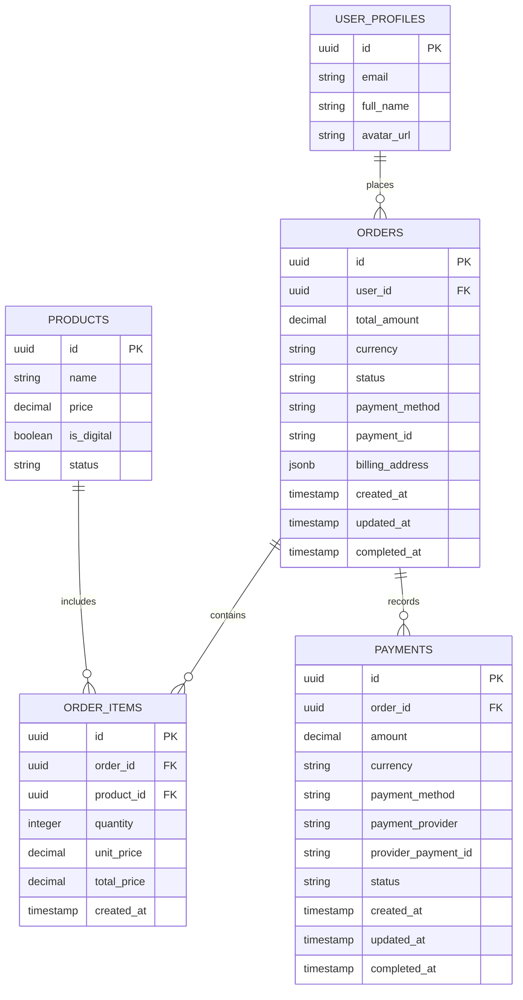
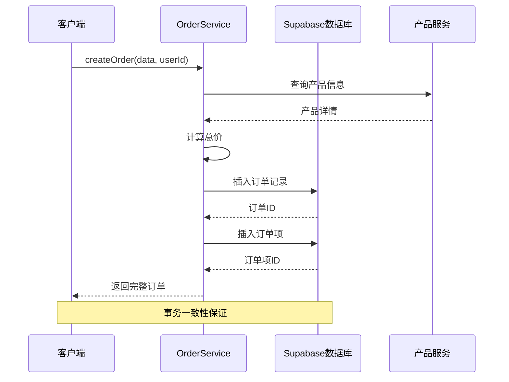
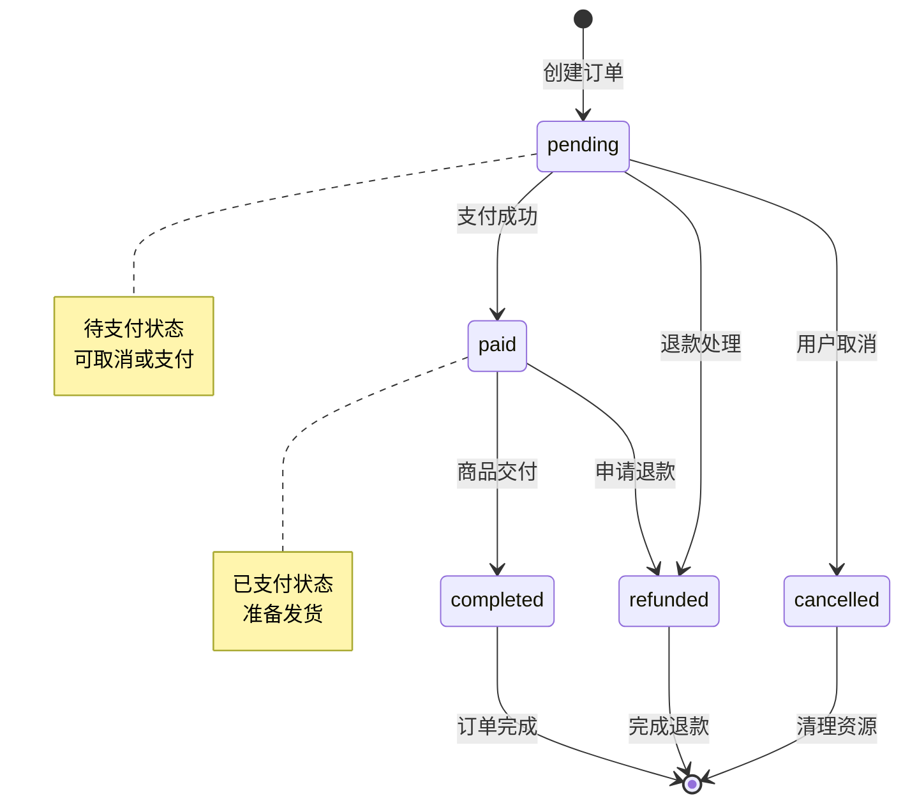
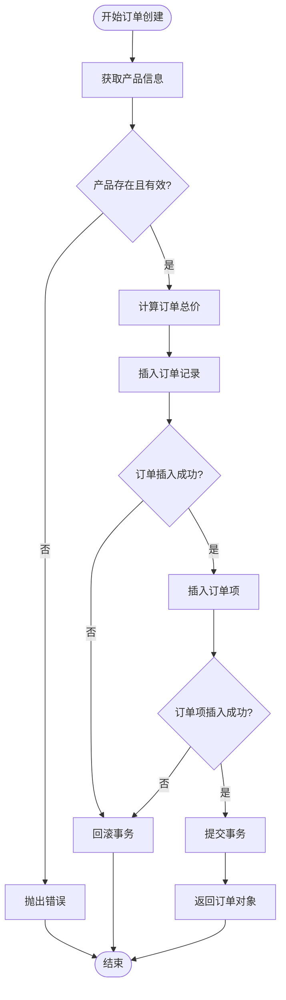
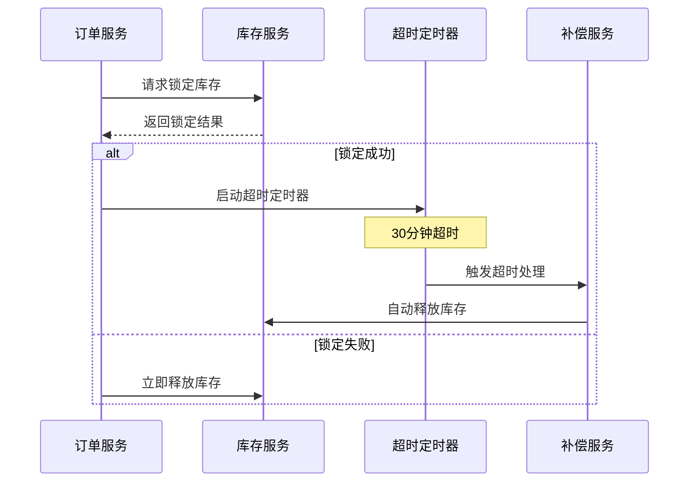
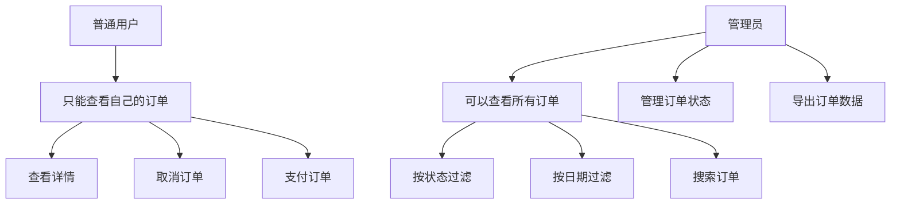

# 订单管理系统

<cite>
**本文档引用的文件**
- [orderService.ts](file://src/services/orderService.ts)
- [20250101000004_add_billing_address_to_orders.sql](file://supabase/migrations/20250101000004_add_billing_address_to_orders.sql)
- [20241224000001_initial_schema.sql](file://supabase/migrations/20241224000001_initial_schema.sql)
- [supabase-schema.ts](file://src/lib/supabase-schema.ts)
- [index.ts](file://src/types/index.ts)
- [OrderManagementView.vue](file://src/views/admin/OrderManagementView.vue)
- [OrdersView.vue](file://src/views/user/OrdersView.vue)
</cite>

## 目录
1. [系统概述](#系统概述)
2. [数据库架构设计](#数据库架构设计)
3. [订单服务核心功能](#订单服务核心功能)
4. [订单状态机设计](#订单状态机设计)
5. [事务处理机制](#事务处理机制)
6. [异常处理与补偿机制](#异常处理与补偿机制)
7. [性能优化策略](#性能优化策略)
8. [安全与权限控制](#安全与权限控制)
9. [故障排除指南](#故障排除指南)
10. [总结](#总结)

## 系统概述

订单管理系统是一个基于Vue 3和Supabase构建的现代化电子商务订单处理系统。该系统采用微服务架构，通过专门的OrderService提供完整的订单生命周期管理功能，包括订单创建、支付处理、状态跟踪和报表统计等核心业务逻辑。

系统的核心特点：
- **模块化设计**：清晰的服务层分离，便于维护和扩展
- **强类型支持**：完整的TypeScript类型定义确保代码质量
- **实时同步**：基于WebSocket的实时订单状态更新
- **多支付集成**：支持多种支付方式的统一处理
- **智能缓存**：多层次缓存策略提升系统性能

## 数据库架构设计

### 核心表结构

订单系统采用三层架构设计，包含订单主表、订单项表和支付记录表三个核心实体：



**图表来源**
- [20241224000001_initial_schema.sql](file://supabase/migrations/20241224000001_initial_schema.sql#L139-L204)
- [supabase-schema.ts](file://src/lib/supabase-schema.ts#L50-L85)

### 外键约束设计

系统采用严格的外键约束确保数据完整性：

1. **用户关系**：`orders.user_id` -> `user_profiles.id` (级联删除)
2. **订单项关系**：`order_items.order_id` -> `orders.id` (级联删除)
3. **产品关系**：`order_items.product_id` -> `products.id` (置空处理)
4. **支付关系**：`payments.order_id` -> `orders.id` (级联删除)

### 计费地址字段演进

计费地址字段经历了重要的结构演变：

```sql
-- 初始版本：简单文本存储
ALTER TABLE orders ADD COLUMN billing_address TEXT;

-- 升级版本：JSONB格式支持复杂结构
ALTER TABLE orders 
ADD COLUMN IF NOT EXISTS billing_address JSONB,
ADD COLUMN IF NOT EXISTS payment_id TEXT;

-- 性能优化：GIN索引加速查询
CREATE INDEX IF NOT EXISTS idx_orders_billing_address ON orders USING GIN (billing_address);
```

这种演进确保了：
- **灵活性**：支持不同国家和地区的地址格式
- **查询效率**：GIN索引提升复杂查询性能
- **向后兼容**：平滑过渡不影响现有数据

**章节来源**
- [20250101000004_add_billing_address_to_orders.sql](file://supabase/migrations/20250101000004_add_billing_address_to_orders.sql#L1-L42)
- [20241224000001_initial_schema.sql](file://supabase/migrations/20241224000001_initial_schema.sql#L139-L172)

## 订单服务核心功能

### 订单创建流程

OrderService的`createOrder`方法实现了完整的订单创建流程：



**图表来源**
- [orderService.ts](file://src/services/orderService.ts#L60-L156)

### 核心接口定义

系统定义了完整的类型安全接口：

```typescript
export interface CreateOrderData {
  product_id: string;
  quantity: number;
  billing_address: BillingAddress;
}

export interface PaymentData {
  order_id: string;
  payment_method: string;
  payment_id?: string;
  amount: number;
}
```

### 订单状态转换

订单状态遵循严格的状态机模式：



**图表来源**
- [orderService.ts](file://src/services/orderService.ts#L156-L193)
- [index.ts](file://src/types/index.ts#L120-L135)

**章节来源**
- [orderService.ts](file://src/services/orderService.ts#L60-L156)
- [index.ts](file://src/types/index.ts#L120-L135)

## 订单状态机设计

### 状态枚举定义

系统定义了标准化的订单状态枚举：

```typescript
status: "pending" | "paid" | "cancelled" | "refunded"
```

### 状态变更业务规则

每种状态变更都遵循特定的业务规则：

1. **待支付状态 (pending)**：
   - 新创建的订单默认状态
   - 支持用户主动取消
   - 支持支付系统回调更新

2. **已支付状态 (paid)**：
   - 支付验证通过后自动更新
   - 设置完成时间和支付信息
   - 触发库存扣减和发货流程

3. **已取消状态 (cancelled)**：
   - 用户或系统触发
   - 自动释放锁定的库存
   - 更新相关支付状态

4. **已退款状态 (refunded)**：
   - 退款请求处理完成后
   - 更新支付记录状态
   - 同步订单状态

### 状态验证机制

系统在状态变更时进行严格的验证：

```typescript
// 只能更新待支付的订单
.eq("status", "pending")

// 管理员更新状态
.update(updateData)
.eq("id", orderId)
```

**章节来源**
- [orderService.ts](file://src/services/orderService.ts#L200-L250)
- [index.ts](file://src/types/index.ts#L120-L135)

## 事务处理机制

### 原子性保障

OrderService通过数据库事务确保操作的原子性：



**图表来源**
- [orderService.ts](file://src/services/orderService.ts#L60-L156)

### 错误处理策略

系统采用多层次的错误处理策略：

1. **数据库级别**：利用PostgreSQL的事务回滚
2. **应用级别**：统一的错误捕获和日志记录
3. **用户级别**：友好的错误提示和重试机制

```typescript
try {
  // 业务逻辑
  return order;
} catch (error) {
  console.error("创建订单失败:", error);
  throw new Error("创建订单失败");
}
```

**章节来源**
- [orderService.ts](file://src/services/orderService.ts#L60-L156)

## 异常处理与补偿机制

### 库存锁定超时处理

系统实现了智能的库存锁定超时机制：



### 用户信息不完整处理

当用户信息不完整时的处理策略：

1. **信息验证**：创建订单前验证用户基本信息
2. **默认值填充**：使用合理的默认值处理缺失字段
3. **异步补全**：允许用户后续完善信息
4. **降级处理**：在必要时提供基本功能

### 支付异常恢复

支付异常的补偿机制：

```typescript
// 支付失败时的清理逻辑
static async handlePaymentFailure(orderId: string): Promise<void> {
  try {
    // 1. 回滚订单状态
    await supabase
      .from("orders")
      .update({ status: "pending" })
      .eq("id", orderId);
    
    // 2. 释放锁定的库存
    // 3. 清理临时支付记录
  } catch (error) {
    // 记录失败并通知管理员
    console.error("支付失败补偿处理失败:", error);
  }
}
```

**章节来源**
- [orderService.ts](file://src/services/orderService.ts#L200-L250)

## 性能优化策略

### 索引优化

系统采用多层次的索引策略：

```sql
-- 主键索引（自动创建）
PRIMARY KEY (id)

-- 外键索引
CREATE INDEX idx_orders_user_id ON orders(user_id);
CREATE INDEX idx_order_items_order_id ON order_items(order_id);
CREATE INDEX idx_payments_order_id ON payments(order_id);

-- 复合索引
CREATE INDEX idx_orders_status_created ON orders(status, created_at);

-- JSONB字段索引
CREATE INDEX idx_orders_billing_address ON orders USING GIN (billing_address);
```

### 查询优化

1. **延迟加载**：按需加载订单详情和关联数据
2. **分页查询**：大数据集采用分页处理
3. **缓存策略**：热点数据缓存减少数据库压力

### 批量操作

系统支持批量订单处理：

```typescript
// 批量获取用户订单
async getUserOrdersBatch(userIds: string[]): Promise<Order[]> {
  const { data, error } = await supabase
    .from("orders")
    .select("*")
    .in("user_id", userIds);
  
  return data || [];
}
```

**章节来源**
- [20250103000001_add_performance_indexes.sql](file://supabase/migrations/20250103000001_add_performance_indexes.sql#L137-L205)

## 安全与权限控制

### 数据访问控制

系统采用基于角色的访问控制(RBAC)：



### 权限验证

每个API调用都进行严格的权限验证：

```typescript
// 用户订单查询权限验证
async getUserOrders(userId: string): Promise<Order[]> {
  const { data, error } = await supabase
    .from("orders")
    .select("*")
    .eq("user_id", userId); // 只能查询自己的订单
}

// 管理员订单管理权限验证
async updateOrderStatus(orderId: string, status: string, adminUserId: string): Promise<void> {
  // 管理员权限验证逻辑
  const isAdmin = await verifyAdminPermission(adminUserId);
  if (!isAdmin) {
    throw new Error("无权修改订单状态");
  }
}
```

### 数据加密

敏感数据采用多层加密保护：

1. **传输加密**：HTTPS/TLS协议
2. **存储加密**：PostgreSQL透明数据加密
3. **字段加密**：关键字段AES加密存储

**章节来源**
- [orderService.ts](file://src/services/orderService.ts#L300-L400)

## 故障排除指南

### 常见问题诊断

1. **订单创建失败**
   - 检查产品是否存在且状态有效
   - 验证用户身份和权限
   - 确认数据库连接正常

2. **支付处理异常**
   - 检查支付网关连接
   - 验证订单状态一致性
   - 查看支付回调日志

3. **查询性能问题**
   - 分析慢查询日志
   - 检查索引使用情况
   - 优化查询条件

### 监控指标

系统监控的关键指标：

```typescript
interface OrderMetrics {
  totalOrders: number;           // 总订单数
  pendingOrders: number;         // 待处理订单
  paidOrders: number;           // 已支付订单
  cancelledOrders: number;      // 已取消订单
  totalRevenue: number;         // 总收入
  todayOrders: number;          // 今日订单数
  todayRevenue: number;         // 今日收入
}
```

### 日志记录

系统采用结构化日志记录：

```typescript
console.log(`管理员 ${adminUserId} 将订单 ${orderId} 状态更新为 ${status}`);
```

**章节来源**
- [orderService.ts](file://src/services/orderService.ts#L600-L700)

## 总结

订单管理系统是一个设计精良、功能完备的电子商务解决方案。通过模块化的架构设计、严格的事务处理、完善的异常处理机制和全面的安全控制，系统能够可靠地处理各种复杂的业务场景。

### 核心优势

1. **可靠性**：完整的事务处理和异常恢复机制
2. **可扩展性**：模块化设计支持功能扩展
3. **高性能**：多层次索引和缓存策略
4. **安全性**：严格的权限控制和数据保护
5. **易维护**：清晰的代码结构和完善的文档

### 技术特色

- **TypeScript强类型**：确保代码质量和开发效率
- **Vue 3响应式**：提供优秀的用户体验
- **Supabase后端**：简化部署和运维复杂度
- **JSONB灵活存储**：支持复杂的业务需求
- **GIN索引优化**：提升查询性能

该系统为现代电子商务提供了坚实的技术基础，能够满足从小型创业公司到大型企业的各种需求。通过持续的优化和改进，系统将继续为用户提供卓越的订单管理体验。