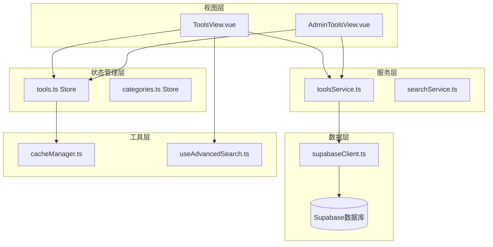
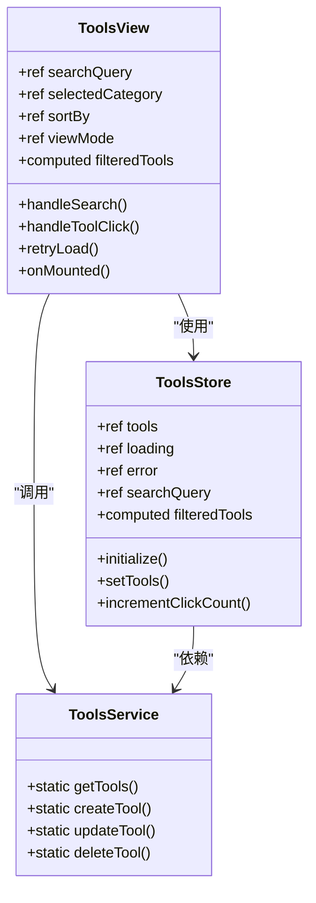
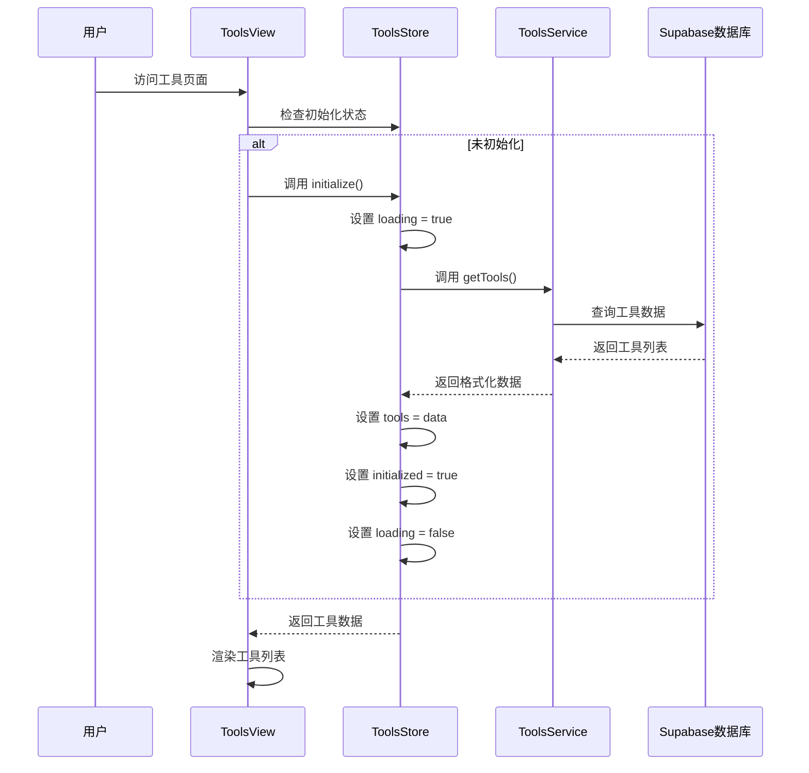
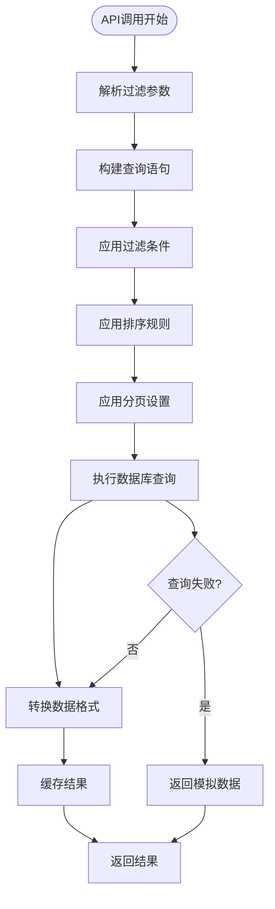
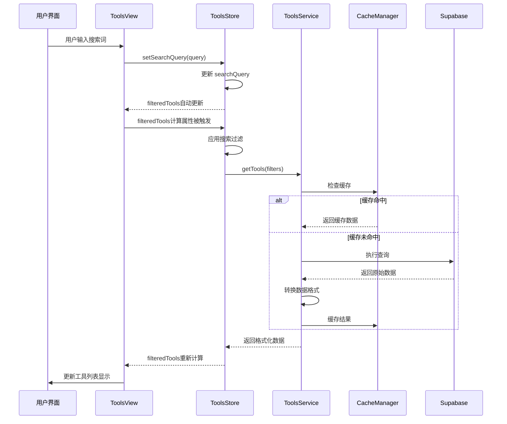
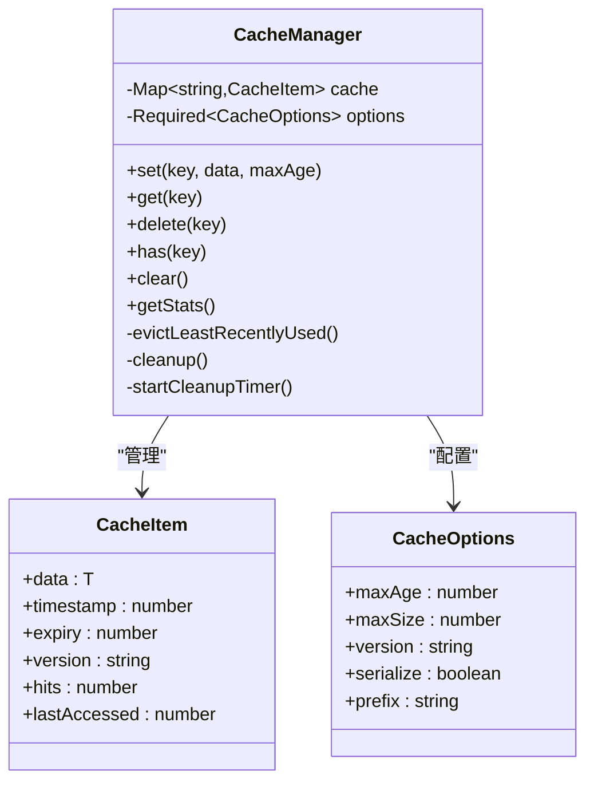
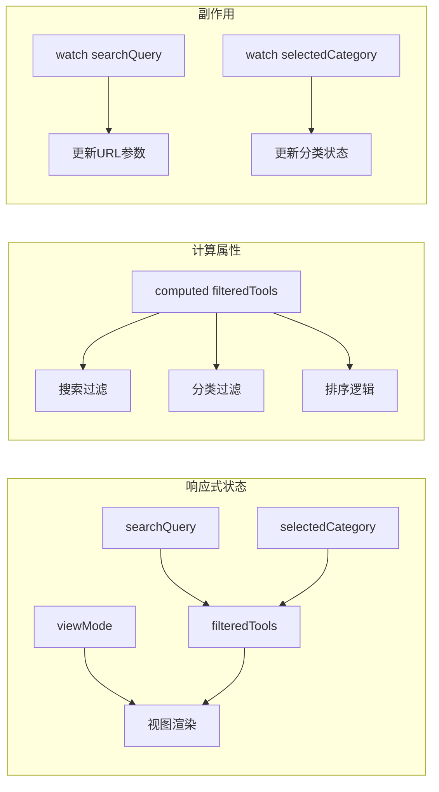

# 工具浏览功能详细文档

<cite>
**本文档引用的文件**
- [ToolsView.vue](file://src/views/ToolsView.vue)
- [toolsService.ts](file://src/services/toolsService.ts)
- [tools.ts](file://src/stores/tools.ts)
- [AdminToolsView.vue](file://src/views/AdminToolsView.vue)
- [cacheManager.ts](file://src/utils/cacheManager.ts)
- [supabaseClient.ts](file://src/lib/supabaseClient.ts)
- [useAdvancedSearch.ts](file://src/composables/useAdvancedSearch.ts)
- [index.ts](file://src/types/index.ts)
</cite>

## 目录
1. [简介](#简介)
2. [项目架构概览](#项目架构概览)
3. [核心组件分析](#核心组件分析)
4. [数据流分析](#数据流分析)
5. [缓存机制详解](#缓存机制详解)
6. [响应式更新策略](#响应式更新策略)
7. [性能优化方案](#性能优化方案)
8. [故障排除指南](#故障排除指南)
9. [最佳实践建议](#最佳实践建议)
10. [总结](#总结)

## 简介

工具浏览功能是本项目的核心特性之一，它为用户提供了一个完整的工具发现、搜索和管理平台。该功能通过Vue 3 Composition API、Pinia状态管理和Supabase数据库实现了现代化的前端架构。

主要功能包括：
- 工具列表展示（网格和列表两种视图模式）
- 高级搜索和过滤功能
- 分类浏览和排序
- 收藏功能
- 点击统计和热度排行
- 管理员工具管理界面

## 项目架构概览



**图表来源**
- [ToolsView.vue](file://src/views/ToolsView.vue#L1-L50)
- [tools.ts](file://src/stores/tools.ts#L1-L30)
- [toolsService.ts](file://src/services/toolsService.ts#L1-L30)

## 核心组件分析

### ToolsView.vue 视图组件

ToolsView.vue是工具浏览功能的主要入口点，负责渲染工具列表、处理用户交互和管理UI状态。



**图表来源**
- [ToolsView.vue](file://src/views/ToolsView.vue#L100-L200)
- [tools.ts](file://src/stores/tools.ts#L150-L250)
- [toolsService.ts](file://src/services/toolsService.ts#L30-L80)

#### 初始化流程



**图表来源**
- [ToolsView.vue](file://src/views/ToolsView.vue#L750-L799)
- [tools.ts](file://src/stores/tools.ts#L200-L280)

**章节来源**
- [ToolsView.vue](file://src/views/ToolsView.vue#L1-L100)
- [tools.ts](file://src/stores/tools.ts#L150-L319)

### Pinia Store 状态管理

tools.ts Pinia store负责管理工具相关的状态和业务逻辑，提供了响应式的状态管理和数据缓存功能。

#### 状态结构

```typescript
interface Tool {
  id: string;
  name: string;
  description: string;
  url: string | null;
  icon: string | null;
  category_id: string | null;
  is_featured: boolean;
  is_favorite?: boolean;
  click_count: number;
  status: 'active' | 'inactive';
  created_at: string;
  updated_at: string;
}
```

#### 计算属性和方法

Store提供了多个计算属性来处理复杂的过滤和排序逻辑：

- `featuredTools`: 过滤出推荐工具
- `activeTools`: 过滤出活跃工具
- `filteredTools`: 综合搜索、分类和收藏状态的最终过滤结果

**章节来源**
- [tools.ts](file://src/stores/tools.ts#L1-L319)
- [index.ts](file://src/types/index.ts#L1-L50)

### toolsService API调用实现

toolsService.ts封装了与后端API的所有交互，实现了分页、分类过滤和排序功能。

#### 分页和排序实现



**图表来源**
- [toolsService.ts](file://src/services/toolsService.ts#L40-L120)

#### 缓存策略

```typescript
// 缓存装饰器使用示例
return withCache(
  this._getToolsFromAPI.bind(this),
  () => cacheKey,
  apiCache,
  2 * 60 * 1000, // 2分钟缓存
)(filters);
```

**章节来源**
- [toolsService.ts](file://src/services/toolsService.ts#L1-L200)

## 数据流分析

### 从视图到服务的数据流



**图表来源**
- [ToolsView.vue](file://src/views/ToolsView.vue#L100-L200)
- [tools.ts](file://src/stores/tools.ts#L100-L150)
- [cacheManager.ts](file://src/utils/cacheManager.ts#L300-L350)

### 首次加载与刷新行为

#### 首次加载流程

1. **组件挂载**: onMounted钩子触发store初始化
2. **状态检查**: 检查toolsStore.initialized标志
3. **数据获取**: 调用toolsService.getTools()
4. **缓存检查**: 使用withCache装饰器检查缓存
5. **数据转换**: 调用transformToolRow进行数据格式化
6. **状态更新**: 更新store状态和UI

#### 刷新行为

```typescript
const refreshTools = async () => {
  try {
    loading.value = true;
    await toolsStore.initialize();
    await categoriesStore.initialize();
    message.value = "工具列表已刷新";
    messageType.value = "success";
  } catch (error) {
    message.value = "刷新失败";
    messageType.value = "error";
  } finally {
    loading.value = false;
  }
};
```

**章节来源**
- [ToolsView.vue](file://src/views/ToolsView.vue#L750-L799)
- [AdminToolsView.vue](file://src/views/AdminToolsView.vue#L320-L350)

## 缓存机制详解

### CacheManager架构



**图表来源**
- [cacheManager.ts](file://src/utils/cacheManager.ts#L20-L80)

### 缓存装饰器模式

```typescript
export function withCache<T extends (...args: any[]) => Promise<any>>(
  fn: T,
  cacheKey: ((...args: Parameters<T>) => string) | string,
  cacheInstance: CacheManager = defaultCache,
  maxAge?: number,
): T {
  return (async (...args: Parameters<T>) => {
    const key = typeof cacheKey === "function" ? cacheKey(...args) : cacheKey;
    
    // 尝试从缓存获取
    const cachedResult = cacheInstance.get(key);
    if (cachedResult !== null) {
      return cachedResult;
    }
    
    // 执行原函数
    const result = await fn(...args);
    
    // 缓存结果
    cacheInstance.set(key, result, maxAge);
    
    return result;
  }) as T;
}
```

### 缓存策略配置

不同类型的缓存有不同的配置：

- **defaultCache**: 通用缓存，5分钟有效期
- **imageCache**: 图片缓存，30分钟有效期
- **apiCache**: API数据缓存，3分钟有效期

**章节来源**
- [cacheManager.ts](file://src/utils/cacheManager.ts#L1-L400)

## 响应式更新策略

### Vue 3 Composition API响应式



**图表来源**
- [ToolsView.vue](file://src/views/ToolsView.vue#L150-L250)

### 状态同步机制

#### 路由参数同步

```typescript
// 监听路由参数变化
watch(
  () => route.query,
  (newQuery) => {
    if (newQuery.category && typeof newQuery.category === "string") {
      selectedCategory.value = newQuery.category;
    }
    if (newQuery.search && typeof newQuery.search === "string") {
      searchQuery.value = newQuery.search;
      toolsStore.setSearchQuery(newQuery.search);
    }
  },
  { immediate: true },
);
```

#### URL参数更新

```typescript
// 更新URL参数
watch(searchQuery, (newQuery) => {
  const query = { ...route.query };
  if (newQuery) {
    query.search = newQuery;
  } else {
    delete query.search;
  }
  router.replace({ query });
});
```

**章节来源**
- [ToolsView.vue](file://src/views/ToolsView.vue#L600-L700)

## 性能优化方案

### 懒加载和虚拟滚动

虽然当前实现使用了简单的分页，但可以扩展为虚拟滚动：

```typescript
// 虚拟滚动示例
const virtualScroll = computed(() => {
  const startIndex = currentPage.value * pageSize.value;
  const endIndex = startIndex + pageSize.value;
  return filteredTools.value.slice(startIndex, endIndex);
});
```

### 防抖和节流

```typescript
// 搜索防抖
const debouncedSearch = debounce((query: string) => {
  toolsStore.setSearchQuery(query);
}, 300);
```

### 内存优化

```typescript
// 缓存清理策略
private evictLeastRecentlyUsed(): void {
  let lruKey = "";
  let lruTime = Date.now();
  
  for (const [key, item] of this.cache) {
    if (item.lastAccessed < lruTime) {
      lruTime = item.lastAccessed;
      lruKey = key;
    }
  }
  
  if (lruKey) {
    this.delete(lruKey);
  }
}
```

**章节来源**
- [cacheManager.ts](file://src/utils/cacheManager.ts#L150-L200)

## 故障排除指南

### 常见问题及解决方案

#### 1. 数据未更新问题

**症状**: 工具列表显示旧数据或不显示新添加的工具

**排查步骤**:
1. 检查缓存是否过期
2. 验证API调用是否成功
3. 确认数据库数据是否正确
4. 检查store状态更新

**解决方案**:
```typescript
// 强制刷新缓存
await toolsStore.initialize(true); // 强制重新加载

// 清理特定缓存
apiCache.delete(`tools_${JSON.stringify(filters)}`);
```

#### 2. 加载延迟问题

**症状**: 页面加载缓慢，特别是工具列表显示延迟

**排查步骤**:
1. 检查网络请求时间
2. 分析数据库查询性能
3. 评估缓存命中率
4. 监控前端性能指标

**解决方案**:
```typescript
// 优化查询
const optimizedQuery = supabase
  .from(TABLES.TOOLS)
  .select(`
    id, name, description, url, icon, 
    category_id, is_featured, click_count, 
    status, created_at, updated_at
  `)
  .eq("status", "active");
```

#### 3. 响应式更新失效

**症状**: 搜索或过滤后UI不更新

**排查步骤**:
1. 检查计算属性依赖关系
2. 验证响应式变量是否正确更新
3. 确认watcher是否正常工作

**解决方案**:
```typescript
// 确保响应式更新
watch(
  () => toolsStore.filteredTools,
  (newVal) => {
    console.log("Filtered tools updated:", newVal.length);
  }
);
```

### 调试工具和技巧

#### 1. Store状态监控

```typescript
// 在开发环境中添加调试
if (process.env.NODE_ENV === 'development') {
  watch(
    () => toolsStore.$state,
    (newState) => {
      console.log('Store state changed:', newState);
    },
    { deep: true }
  );
}
```

#### 2. API调用追踪

```typescript
// 添加API调用日志
const originalGetTools = ToolsService.getTools;
ToolsService.getTools = async function(filters) {
  console.log('API call:', 'getTools', filters);
  const result = await originalGetTools.call(this, filters);
  console.log('API response:', result);
  return result;
};
```

**章节来源**
- [tools.ts](file://src/stores/tools.ts#L200-L319)
- [toolsService.ts](file://src/services/toolsService.ts#L40-L120)

## 最佳实践建议

### 1. 状态管理最佳实践

- **单一职责**: 每个store专注于特定领域
- **响应式设计**: 充分利用Vue 3的响应式系统
- **状态持久化**: 合理使用localStorage进行状态持久化

### 2. API调用最佳实践

- **错误处理**: 完善的错误处理和用户反馈
- **重试机制**: 实现自动重试和降级策略
- **并发控制**: 避免重复的API调用

### 3. 性能优化最佳实践

- **缓存策略**: 合理设置缓存时间和策略
- **懒加载**: 实现虚拟滚动和按需加载
- **内存管理**: 及时清理不需要的缓存和监听器

### 4. 开发体验最佳实践

- **类型安全**: 充分利用TypeScript类型系统
- **模块化**: 合理拆分组件和服务
- **测试覆盖**: 编写单元测试和集成测试

## 总结

工具浏览功能通过精心设计的架构实现了高性能、响应式的用户体验。主要特点包括：

1. **现代化架构**: 基于Vue 3 Composition API和Pinia的状态管理
2. **智能缓存**: 多层次的缓存策略提升性能
3. **响应式设计**: 自动化的状态同步和UI更新
4. **可扩展性**: 模块化设计便于功能扩展
5. **性能优化**: 多种优化策略确保流畅体验

该功能为用户提供了完整的工具发现和管理体验，同时为开发者提供了清晰的架构参考和最佳实践指导。通过合理的缓存策略、响应式更新和错误处理，确保了系统的稳定性和可维护性。