# 工具管理系统

<cite>
**本文档引用的文件**
- [ToolsView.vue](file://src/views/ToolsView.vue)
- [ToolDetailView.vue](file://src/views/ToolDetailView.vue)
- [toolsService.ts](file://src/services/toolsService.ts)
- [tools.ts](file://src/stores/tools.ts)
- [useAdvancedSearch.ts](file://src/composables/useAdvancedSearch.ts)
- [cacheManager.ts](file://src/utils/cacheManager.ts)
- [supabaseClient.ts](file://src/lib/supabaseClient.ts)
- [index.ts](file://src/types/index.ts)
- [services.test.ts](file://src/tests/integration/services.test.ts)
</cite>

## 目录
1. [简介](#简介)
2. [项目架构概览](#项目架构概览)
3. [核心组件分析](#核心组件分析)
4. [工具浏览功能](#工具浏览功能)
5. [高级搜索系统](#高级搜索系统)
6. [工具详情页面](#工具详情页面)
7. [状态管理机制](#状态管理机制)
8. [缓存策略](#缓存策略)
9. [性能优化措施](#性能优化措施)
10. [故障排除指南](#故障排除指南)
11. [总结](#总结)

## 简介

工具管理系统是一个基于Vue 3和TypeScript构建的现代化Web应用程序，专门用于管理和展示各种在线工具资源。该系统提供了完整的工具浏览、搜索、分类、评分和详情查看功能，采用Pinia状态管理、Supabase数据库和智能缓存策略，确保高性能和良好的用户体验。

系统的核心目标是为用户提供一个直观、高效的工具发现和管理平台，支持多种视图模式、智能搜索、实时过滤和个性化体验。

## 项目架构概览


**图表来源**
- [ToolsView.vue](file://src/views/ToolsView.vue#L1-L50)
- [toolsService.ts](file://src/services/toolsService.ts#L1-L50)
- [tools.ts](file://src/stores/tools.ts#L1-L50)
- [cacheManager.ts](file://src/utils/cacheManager.ts#L1-L50)

## 核心组件分析

### ToolsView.vue - 主要工具视图

ToolsView.vue是整个工具管理系统的核心组件，负责渲染工具列表、处理用户交互和协调各个子组件的工作。

```mermaid
classDiagram
class ToolsView {
+searchQuery : Ref~string~
+filters : Ref~SearchFilters~
+viewMode : Ref~"grid" | "list"~
+showFavoritesOnly : Ref~boolean~
+selectedCategory : Ref~string~
+filteredTools : ComputedRef~Tool[]~
+handleSearch() void
+handleAdvancedSearch(query : string) void
+goToToolDetail(toolId : string) void
+handleToolClick(tool : Tool) Promise~void~
+retryLoad() Promise~void~
}
class AdvancedSearchPanel {
+isOpen : Ref~boolean~
+filters : Ref~SearchFilters~
+searchHistory : Ref~string[]~
+popularSearches : Ref~string[]~
+onClose() void
+onUpdateFilters(filters : SearchFilters) void
+onSearch(query : string) void
}
class ToolCard {
+tool : Tool
+onClick() void
+onFavoriteToggle() void
+onVisit() void
+onDetails() void
}
ToolsView --> AdvancedSearchPanel : "contains"
ToolsView --> ToolCard : "renders"
ToolsView --> useAdvancedSearch : "uses"
```



**图表来源**
- [ToolsView.vue](file://src/views/ToolsView.vue#L150-L250)
- [useAdvancedSearch.ts](file://src/composables/useAdvancedSearch.ts#L1-L50)

**章节来源**
- [ToolsView.vue](file://src/views/ToolsView.vue#L1-L967)

### 工具服务架构


**图表来源**
- [toolsService.ts](file://src/services/toolsService.ts#L25-L80)
- [cacheManager.ts](file://src/utils/cacheManager.ts#L50-L100)

**章节来源**
- [toolsService.ts](file://src/services/toolsService.ts#L1-L642)

## 工具浏览功能

### 视图模式切换

系统支持两种视图模式：网格视图和列表视图，用户可以根据个人喜好自由切换。

```typescript
// 视图模式响应式状态
const viewMode = ref<"grid" | "list">("grid");

// 视图模式切换逻辑
const toggleViewMode = (mode: "grid" | "list") => {
  viewMode.value = mode;
  // 持久化用户偏好
  localStorage.setItem('preferredViewMode', mode);
};
```

### 工具卡片渲染

每个工具都以卡片形式展示，包含图标、名称、描述、标签、统计信息和操作按钮。


**图表来源**
- [ToolsView.vue](file://src/views/ToolsView.vue#L300-L450)

### 分类筛选功能

系统提供强大的分类筛选功能，支持多级分类和实时过滤。

```typescript
// 分类筛选逻辑
const filteredTools = computed(() => {
  let tools = toolsStore.activeTools;
  
  // 应用分类过滤
  if (selectedCategory.value !== 'all') {
    tools = tools.filter(tool => 
      tool.category_id === selectedCategory.value
    );
  }
  
  // 应用收藏过滤
  if (showFavoritesOnly.value) {
    tools = tools.filter(tool => tool.is_favorite);
  }
  
  return tools;
});
```

**章节来源**
- [ToolsView.vue](file://src/views/ToolsView.vue#L200-L300)

## 高级搜索系统

### useAdvancedSearch组合式API

useAdvancedSearch是系统的核心搜索功能，提供了智能搜索算法、多维筛选和结果排序功能。


**图表来源**
- [useAdvancedSearch.ts](file://src/composables/useAdvancedSearch.ts#L1-L100)

### 智能搜索算法

高级搜索系统采用多字段加权评分算法，为用户提供精准的搜索结果。

```typescript
// 智能搜索算法实现
const performSearch = (query: string, items: Tool[]): SearchResult[] => {
  if (!query.trim()) return items.map(item => ({ item, score: 1, matches: [] }));
  
  const searchTerms = query.toLowerCase().split(/\s+/).filter(term => term.length > 0);
  const results: SearchResult[] = [];
  
  items.forEach(item => {
    let score = 0;
    const matches: string[] = [];
    
    // 搜索字段权重配置
    const searchFields = [
      { field: "name", weight: 10 },
      { field: "description", weight: 5 },
      { field: "tags", weight: 3 },
      { field: "categories.name", weight: 2 },
    ];
    
    searchTerms.forEach(term => {
      searchFields.forEach(({ field, weight }) => {
        const value = getNestedValue(item, field);
        if (value && searchInField(value, term)) {
          score += weight;
          if (!matches.includes(field)) {
            matches.push(field);
          }
        }
      });
      
      // 模糊匹配
      if (fuzzyMatch(item.name?.toLowerCase() || "", term)) {
        score += 2;
      }
    });
    
    // 特色工具加分
    if (item.is_featured) {
      score += 1;
    }
    
    if (score > 0) {
      results.push({ item, score, matches });
    }
  });
  
  return results.sort((a, b) => b.score - a.score);
};
```

### 筛选器集成

高级搜索与主界面的筛选器无缝集成，提供一致的用户体验。


**图表来源**
- [useAdvancedSearch.ts](file://src/composables/useAdvancedSearch.ts#L100-L200)

**章节来源**
- [useAdvancedSearch.ts](file://src/composables/useAdvancedSearch.ts#L1-L306)

## 工具详情页面

### ToolDetailView.vue - 详情视图组件

工具详情页面提供了丰富的工具信息展示，包括功能特性、使用教程、优缺点分析、价格信息和用户评分。


**图表来源**
- [ToolDetailView.vue](file://src/views/ToolDetailView.vue#L100-L200)
- [tools.ts](file://src/stores/tools.ts#L150-L200)

### 详情页面功能模块


**图表来源**
- [ToolDetailView.vue](file://src/views/ToolDetailView.vue#L20-L100)

### 数据加载流程

工具详情页面采用预加载和懒加载相结合的策略，确保快速响应和良好的用户体验。

```typescript
// 详情页面数据加载逻辑
const loadToolDetail = async () => {
  try {
    loading.value = true;
    const toolId = route.params.id as string;
    
    // 从store中查找工具
    await toolsStore.initialize();
    tool.value = toolsStore.tools.find(t => t.id === toolId);
    
    if (tool.value) {
      // 加载相关工具
      relatedTools.value = toolsStore.tools
        .filter(t => 
          t.category_id === tool.value.category_id && 
          t.id !== tool.value.id
        )
        .slice(0, 4);
    }
  } catch (error) {
    console.error("加载工具详情失败:", error);
  } finally {
    loading.value = false;
  }
};
```

**章节来源**
- [ToolDetailView.vue](file://src/views/ToolDetailView.vue#L1-L508)

## 状态管理机制

### Pinia Store架构

系统使用Pinia作为状态管理解决方案，提供了集中化的状态管理和响应式数据流。


**图表来源**
- [tools.ts](file://src/stores/tools.ts#L100-L200)

### 状态同步机制


**图表来源**
- [tools.ts](file://src/stores/tools.ts#L200-L300)

### 数据规范化

系统实现了严格的数据规范化机制，确保不同类型的数据都能正确处理。

```typescript
// 工具数据规范化函数
export function normalizeTool(data: unknown): Tool {
  if (typeof data !== 'object' || data === null) {
    throw new Error('Invalid tool data: expected object');
  }
  
  const raw = data as Record<string, any>;
  
  // 验证必填字段
  if (typeof raw.id !== 'string') throw new Error('Invalid tool data: id must be string');
  if (typeof raw.name !== 'string') throw new Error('Invalid tool data: name must be string');
  
  // 创建基础工具对象
  const baseTool: ToolBase = {
    id: raw.id,
    name: raw.name,
    description: typeof raw.description === 'string' ? raw.description : '',
    url: typeof raw.url === 'string' ? raw.url : null,
    icon: typeof raw.icon === 'string' ? raw.icon : null,
    category_id: typeof raw.category_id === 'string' ? raw.category_id : null,
    is_featured: Boolean(raw.is_featured),
    is_favorite: Boolean(raw.is_favorite),
    click_count: Number(raw.click_count) || 0,
    status: raw.status === 'inactive' ? 'inactive' : 'active',
    created_at: typeof raw.created_at === 'string' ? raw.created_at : new Date().toISOString(),
    updated_at: typeof raw.updated_at === 'string' ? raw.updated_at : new Date().toISOString()
  };
  
  return baseTool;
}
```

**章节来源**
- [tools.ts](file://src/stores/tools.ts#L1-L319)

## 缓存策略

### 多层级缓存架构

系统实现了多层级缓存策略，包括内存缓存、本地存储缓存和API响应缓存。


**图表来源**
- [cacheManager.ts](file://src/utils/cacheManager.ts#L300-L400)

### 缓存装饰器模式

系统使用高阶函数模式实现缓存装饰器，简化缓存逻辑的使用。

```typescript
// 缓存装饰器实现
export function withCache<T extends (...args: any[]) => Promise<any>>(
  fn: T,
  cacheKey: ((...args: Parameters<T>) => string) | string,
  cacheInstance: CacheManager = defaultCache,
  maxAge?: number,
): T {
  return (async (...args: Parameters<T>) => {
    const key = typeof cacheKey === "function" ? cacheKey(...args) : cacheKey;
    
    // 尝试从缓存获取
    const cachedResult = cacheInstance.get(key);
    if (cachedResult !== null) {
      return cachedResult;
    }
    
    // 执行原函数
    const result = await fn(...args);
    
    // 缓存结果
    cacheInstance.set(key, result, maxAge);
    
    return result;
  }) as T;
}
```

### 缓存清理策略


**图表来源**
- [cacheManager.ts](file://src/utils/cacheManager.ts#L150-L250)

**章节来源**
- [cacheManager.ts](file://src/utils/cacheManager.ts#L1-L400)

## 性能优化措施

### 懒加载和虚拟滚动

系统实现了多种性能优化技术，包括懒加载、虚拟滚动和图片优化。

```typescript
// 懒加载组合式API
export function useLazyLoading() {
  const isLoading = ref(false);
  const hasMore = ref(true);
  const page = ref(1);
  
  const loadMore = async (callback: () => Promise<void>) => {
    if (isLoading.value || !hasMore.value) return;
    
    isLoading.value = true;
    try {
      await callback();
      page.value++;
    } finally {
      isLoading.value = false;
    }
  };
  
  return { isLoading, hasMore, page, loadMore };
}
```

### 请求去重和防抖

```typescript
// 搜索请求防抖
const debouncedSearch = debounce((query: string) => {
  search(query);
}, 300);

// 请求去重
const pendingRequests = new Map<string, Promise<any>>();
const getUniqueRequest = (key: string, requestFn: () => Promise<any>) => {
  if (!pendingRequests.has(key)) {
    pendingRequests.set(key, requestFn().finally(() => {
      pendingRequests.delete(key);
    }));
  }
  return pendingRequests.get(key)!;
};
```

### 内存管理

系统实现了智能的内存管理策略，包括自动清理过期缓存和LRU淘汰机制。


**章节来源**
- [useLazyLoading.ts](file://src/composables/useLazyLoading.ts#L1-L100)

## 故障排除指南

### 常见问题诊断


### 错误处理机制

系统实现了完善的错误处理机制，包括错误捕获、用户友好的错误消息和自动重试功能。

```typescript
// 错误处理装饰器
export function withErrorHandling<T extends (...args: any[]) => Promise<any>>(
  fn: T,
  errorMessage: string = "操作失败，请稍后重试",
): T {
  return (async (...args: Parameters<T>) => {
    try {
      return await fn(...args);
    } catch (error) {
      console.error(errorMessage, error);
      throw new Error(errorMessage);
    }
  }) as T;
}
```

### 性能监控

```typescript
// 性能监控工具
export const performanceMonitor = {
  trackPageLoad: (duration: number) => {
    console.log(`页面加载时间: ${duration}ms`);
    // 发送到分析服务
  },
  
  trackSearch: (query: string, duration: number) => {
    console.log(`搜索 "${query}" 耗时: ${duration}ms`);
  },
  
  trackToolClick: (toolId: string) => {
    console.log(`工具点击: ${toolId}`);
  }
};
```

**章节来源**
- [services.test.ts](file://src/tests/integration/services.test.ts#L1-L100)

## 总结

工具管理系统是一个功能完善、性能优异的现代Web应用程序。通过合理的架构设计、智能的缓存策略和优秀的用户体验，系统能够高效地管理和展示大量工具资源。

### 主要特性

1. **灵活的视图模式**：支持网格和列表两种视图模式，适应不同用户的偏好
2. **智能搜索功能**：提供高级搜索、模糊匹配和多维筛选功能
3. **响应式设计**：适配各种设备和屏幕尺寸
4. **高性能缓存**：多层级缓存策略确保快速响应
5. **状态管理**：基于Pinia的状态管理，确保数据一致性
6. **错误处理**：完善的错误处理和恢复机制

### 技术亮点

- **TypeScript强类型**：提供完整的类型安全和开发体验
- **Composition API**：充分利用Vue 3的新特性
- **模块化设计**：清晰的组件分离和职责划分
- **可扩展架构**：易于添加新功能和维护现有代码

该系统为工具发现和管理提供了一个强大而优雅的解决方案，能够满足现代Web应用的各种需求。