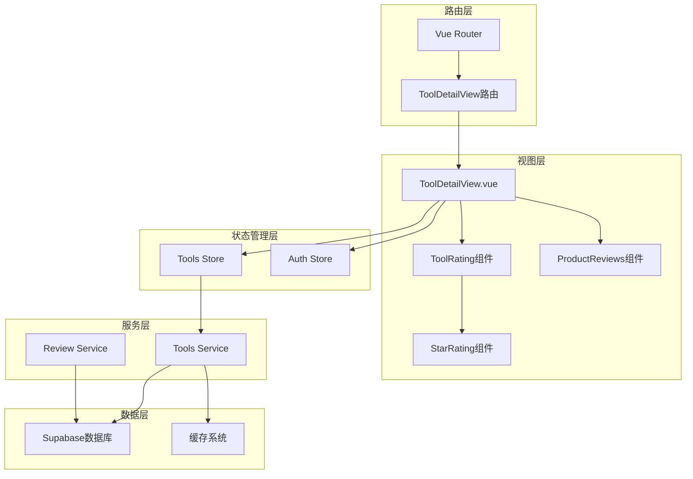
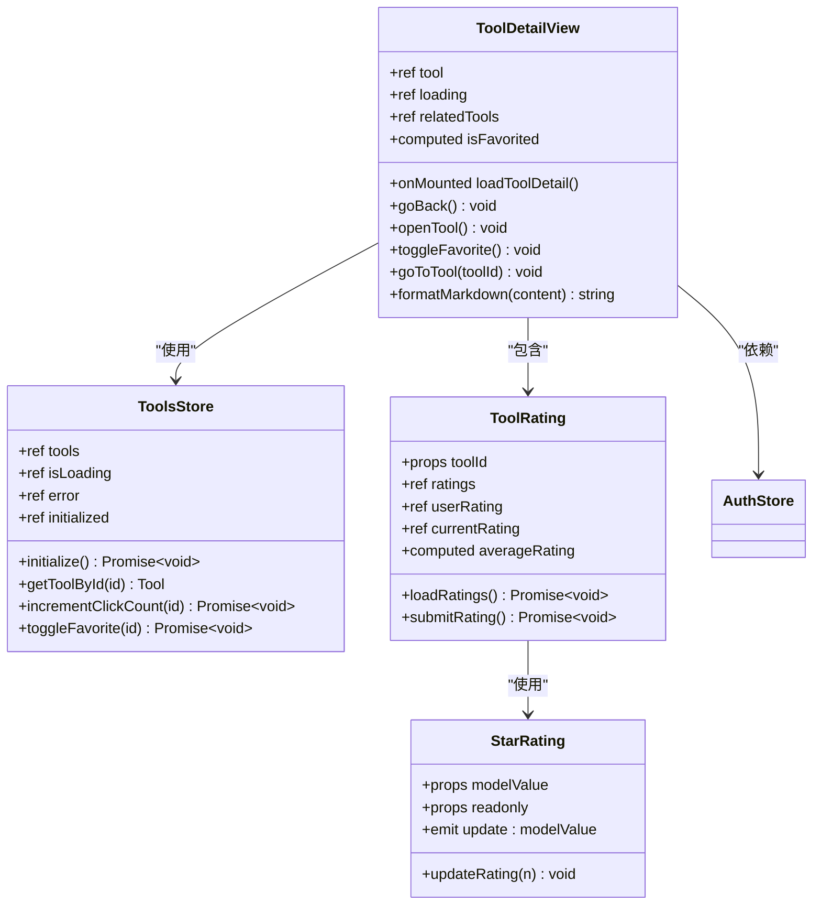
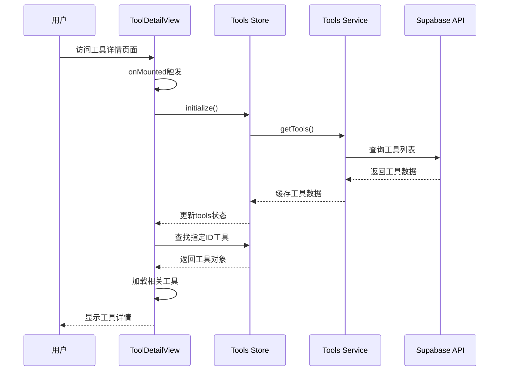
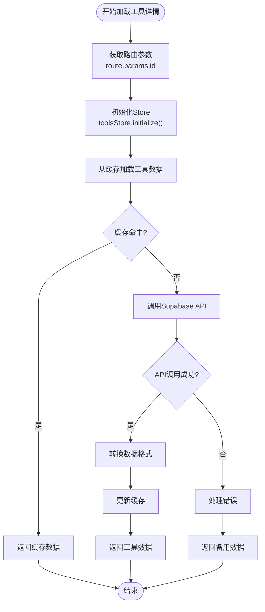
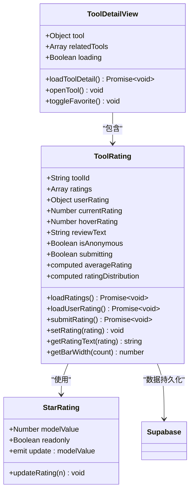
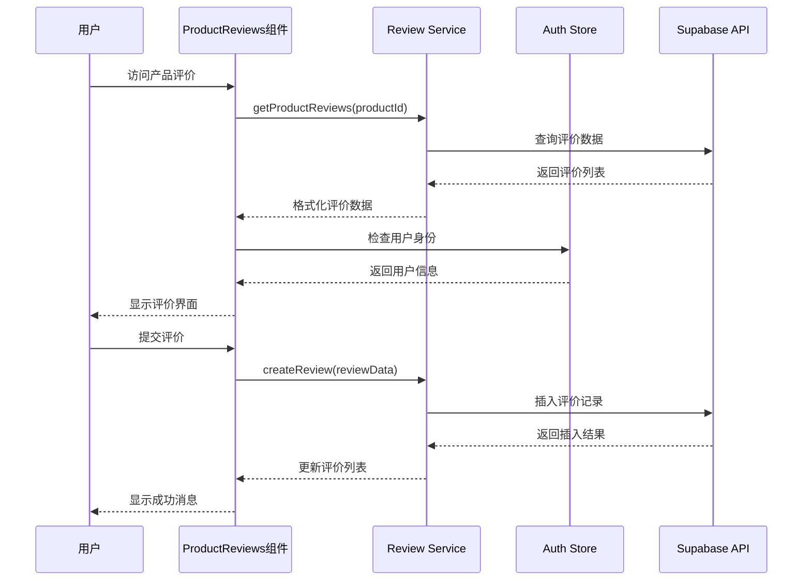
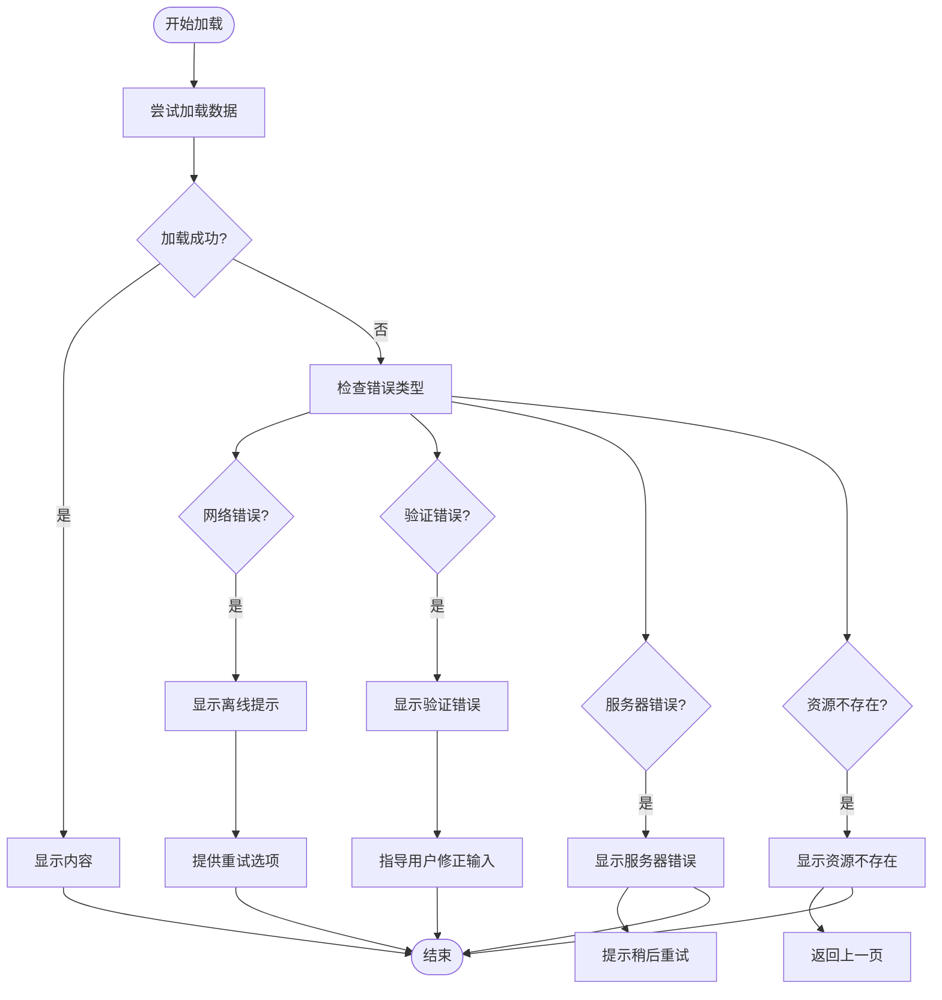
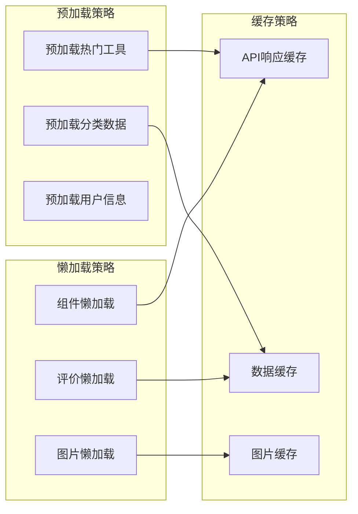

# 工具详情展示系统技术文档

<cite>
**本文档引用的文件**
- [ToolDetailView.vue](file://src/views/ToolDetailView.vue)
- [StarRating.vue](file://src/components/ui/StarRating.vue)
- [ToolRating.vue](file://src/components/ToolRating.vue)
- [ProductReviews.vue](file://src/components/reviews/ProductReviews.vue)
- [toolsService.ts](file://src/services/toolsService.ts)
- [tools.ts](file://src/stores/tools.ts)
- [index.ts](file://src/router/index.ts)
- [errorHandler.ts](file://src/utils/errorHandler.ts)
</cite>

## 目录
1. [简介](#简介)
2. [项目架构概览](#项目架构概览)
3. [核心组件分析](#核心组件分析)
4. [数据流与生命周期](#数据流与生命周期)
5. [组件间协作机制](#组件间协作机制)
6. [错误处理与降级策略](#错误处理与降级策略)
7. [性能优化方案](#性能优化方案)
8. [最佳实践建议](#最佳实践建议)
9. [总结](#总结)

## 简介

工具详情展示系统是高级工具导航平台的核心功能模块，负责为用户提供详细的工具信息展示界面。该系统采用Vue 3 Composition API架构，结合Pinia状态管理、TypeScript类型安全和现代化的前端开发模式，构建了一个高性能、可维护的工具详情页面。

系统的主要功能包括：
- 单个工具信息的完整展示
- 用户评分与评价系统
- 相关工具推荐
- 收藏功能集成
- 交互式教程内容
- 响应式设计适配

## 项目架构概览



**图表来源**
- [index.ts](file://src/router/index.ts#L1-L50)
- [ToolDetailView.vue](file://src/views/ToolDetailView.vue#L1-L50)
- [tools.ts](file://src/stores/tools.ts#L1-L50)

## 核心组件分析

### ToolDetailView 组件架构

ToolDetailView是整个工具详情展示的核心组件，采用了现代化的Vue 3 Composition API设计模式。



**图表来源**
- [ToolDetailView.vue](file://src/views/ToolDetailView.vue#L80-L150)
- [tools.ts](file://src/stores/tools.ts#L100-L200)
- [ToolRating.vue](file://src/components/ToolRating.vue#L118-L174)

**章节来源**
- [ToolDetailView.vue](file://src/views/ToolDetailView.vue#L1-L508)
- [tools.ts](file://src/stores/tools.ts#L1-L319)

### 生命周期钩子与数据加载流程

ToolDetailView组件的生命周期管理遵循Vue 3的最佳实践，通过onMounted钩子确保组件挂载后立即开始数据加载。



**图表来源**
- [ToolDetailView.vue](file://src/views/ToolDetailView.vue#L80-L120)
- [tools.ts](file://src/stores/tools.ts#L200-L319)

**章节来源**
- [ToolDetailView.vue](file://src/views/ToolDetailView.vue#L80-L120)
- [tools.ts](file://src/stores/tools.ts#L200-L319)

## 数据流与生命周期

### 路由参数处理机制

系统通过Vue Router的动态路由参数机制获取工具ID，并将其传递给数据加载函数：

```typescript
// 路由参数监听与处理
const route = useRoute();
const toolsStore = useToolsStore();

const loadToolDetail = async () => {
  try {
    loading.value = true;
    const toolId = route.params.id as string;

    // 从store中查找工具
    await toolsStore.initialize();
    tool.value = toolsStore.tools.find((t) => t.id === toolId);

    if (tool.value) {
      // 加载相关工具
      relatedTools.value = toolsStore.tools
        .filter(
          (t) =>
            t.category_id === tool.value.category_id && t.id !== tool.value.id,
        )
        .slice(0, 4);
    }
  } catch (error) {
    console.error("加载工具详情失败:", error);
  } finally {
    loading.value = false;
  }
};
```

### toolsService.fetchToolById()调用流程

虽然代码中直接使用了store中的工具数组，但实际的API调用通过toolsService实现：



**图表来源**
- [toolsService.ts](file://src/services/toolsService.ts#L80-L120)
- [ToolDetailView.vue](file://src/views/ToolDetailView.vue#L80-L120)

**章节来源**
- [ToolDetailView.vue](file://src/views/ToolDetailView.vue#L80-L120)
- [toolsService.ts](file://src/services/toolsService.ts#L80-L120)

## 组件间协作机制

### StarRating组件评分渲染机制

StarRating组件实现了用户友好的星级评分系统，支持交互式评分和只读模式：



**图表来源**
- [StarRating.vue](file://src/components/ui/StarRating.vue#L1-L53)
- [ToolRating.vue](file://src/components/ToolRating.vue#L118-L174)

### 用户身份联动逻辑

ToolRating组件与认证系统的深度集成，确保评分功能的用户身份验证：

```typescript
// 用户评分状态检查
const loadUserRating = async () => {
  if (!authStore.user) return;

  try {
    const { data, error } = await supabase
      .from("tool_ratings")
      .select("*")
      .eq("tool_id", props.toolId)
      .eq("user_id", authStore.user.id)
      .single();

    if (data) {
      userRating.value = data;
      currentRating.value = data.rating;
      reviewText.value = data.review || "";
      isAnonymous.value = data.is_anonymous;
    }
  } catch (error) {
    // 用户还没有评分，这是正常的
  }
};
```

### ProductReviews组件集成

ProductReviews组件提供了完整的用户评价功能，包括评价列表、筛选和回复功能：



**图表来源**
- [ProductReviews.vue](file://src/components/reviews/ProductReviews.vue#L184-L248)
- [reviewService.ts](file://src/services/reviewService.ts#L73-L139)

**章节来源**
- [StarRating.vue](file://src/components/ui/StarRating.vue#L1-L53)
- [ToolRating.vue](file://src/components/ToolRating.vue#L118-L231)
- [ProductReviews.vue](file://src/components/reviews/ProductReviews.vue#L136-L190)

## 错误处理与降级策略

### 异常处理案例

系统实现了多层次的错误处理机制，确保在各种异常情况下都能提供良好的用户体验：



**图表来源**
- [errorHandler.ts](file://src/utils/errorHandler.ts#L40-L120)
- [ToolDetailView.vue](file://src/views/ToolDetailView.vue#L80-L120)

### 加载状态与错误边界

ToolDetailView组件实现了完善的加载状态管理和错误边界处理：

```typescript
// 加载状态管理
const loading = ref(true);
const error = ref<string | null>(null);

// 错误处理逻辑
try {
  loading.value = true;
  const toolId = route.params.id as string;
  
  await toolsStore.initialize();
  tool.value = toolsStore.tools.find((t) => t.id === toolId);
  
  if (!tool.value) {
    error.value = "工具不存在";
  }
} catch (error) {
  console.error("加载工具详情失败:", error);
  error.value = "加载失败，请重试";
} finally {
  loading.value = false;
}
```

### ID无效或网络中断时的降级显示方案

系统针对不同类型的错误提供了相应的降级显示方案：

1. **ID无效场景**：显示"工具不存在"的友好提示
2. **网络中断场景**：显示离线状态指示器和重试按钮
3. **服务器错误场景**：显示服务器错误信息和建议
4. **权限不足场景**：引导用户进行身份验证

**章节来源**
- [errorHandler.ts](file://src/utils/errorHandler.ts#L40-L120)
- [ToolDetailView.vue](file://src/views/ToolDetailView.vue#L80-L120)

## 性能优化方案

### 预加载与懒加载策略

系统采用了多种性能优化策略来提升用户体验：



### 缓存管理机制

toolsService实现了智能的缓存管理机制：

```typescript
// 缓存装饰器使用示例
static async getTool(id: string): Promise<Tool> {
  const cacheKey = `tool_${id}`;
  
  return withCache(
    this._getToolFromAPI.bind(this),
    () => cacheKey,
    apiCache,
    5 * 60 * 1000, // 5分钟缓存
  )(id);
}
```

### 性能监控与优化指标

系统监控的关键性能指标包括：
- 首次内容绘制时间(FCP)
- 最大内容绘制时间(LCP)
- 累积布局偏移(CLS)
- 交互时间(TTI)
- 网络请求延迟

**章节来源**
- [toolsService.ts](file://src/services/toolsService.ts#L80-L120)
- [cacheManager.ts](file://src/utils/cacheManager.ts)

## 最佳实践建议

### 开发最佳实践

1. **组件设计原则**
   - 保持组件职责单一
   - 使用Composition API提高代码复用性
   - 实现适当的错误边界处理
   - 提供清晰的加载状态反馈

2. **状态管理规范**
   - 使用Pinia进行全局状态管理
   - 实现状态的持久化存储
   - 提供状态变更的撤销/重做功能
   - 实现状态的实时同步

3. **API调用优化**
   - 实现请求去重机制
   - 使用批量请求减少网络开销
   - 实现智能重试策略
   - 提供请求取消功能

### 用户体验优化

1. **交互反馈设计**
   - 提供即时的操作反馈
   - 实现渐进式的加载效果
   - 设计合理的错误提示信息
   - 保持界面的一致性

2. **性能优化策略**
   - 实现关键路径的代码分割
   - 使用Web Workers处理复杂计算
   - 优化图片和媒体资源
   - 实现智能的资源预加载

### 安全考虑

1. **数据验证**
   - 在客户端和服务端同时进行数据验证
   - 实现输入清理和转义
   - 防止XSS攻击
   - 实现CSRF保护

2. **权限控制**
   - 实现细粒度的权限控制
   - 使用角色基础的访问控制(RBAC)
   - 实现审计日志记录
   - 提供权限变更的通知机制

## 总结

工具详情展示系统展现了现代前端开发的最佳实践，通过Vue 3的Composition API、Pinia状态管理、TypeScript类型安全和现代化的架构设计，构建了一个高性能、可维护的工具详情页面。

系统的核心优势包括：

1. **架构清晰**：采用分层架构设计，职责分离明确
2. **性能优异**：实现了多级缓存和智能加载策略
3. **用户体验优秀**：提供丰富的交互反馈和错误处理
4. **可维护性强**：代码结构清晰，易于扩展和维护
5. **类型安全**：全面使用TypeScript确保代码质量

通过本系统的设计和实现，开发者可以学习到现代前端开发的核心技术和最佳实践，为构建高质量的Web应用程序提供参考和指导。