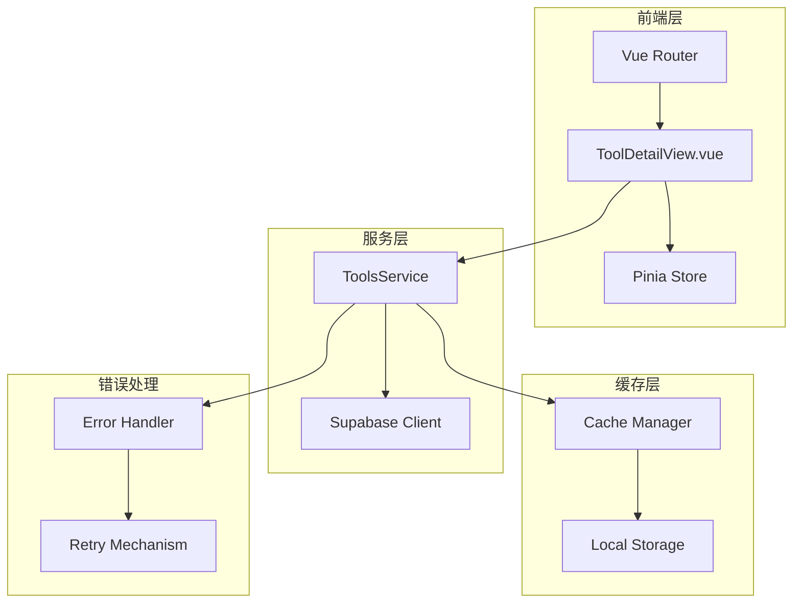
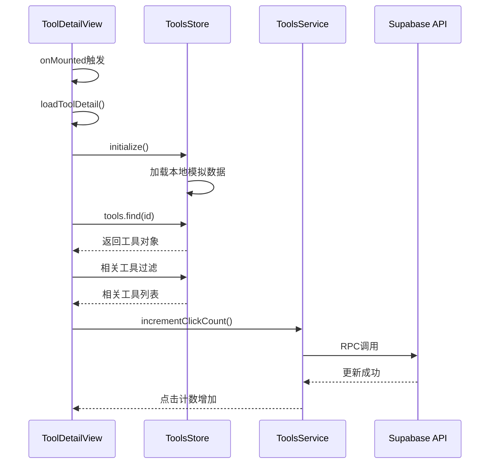
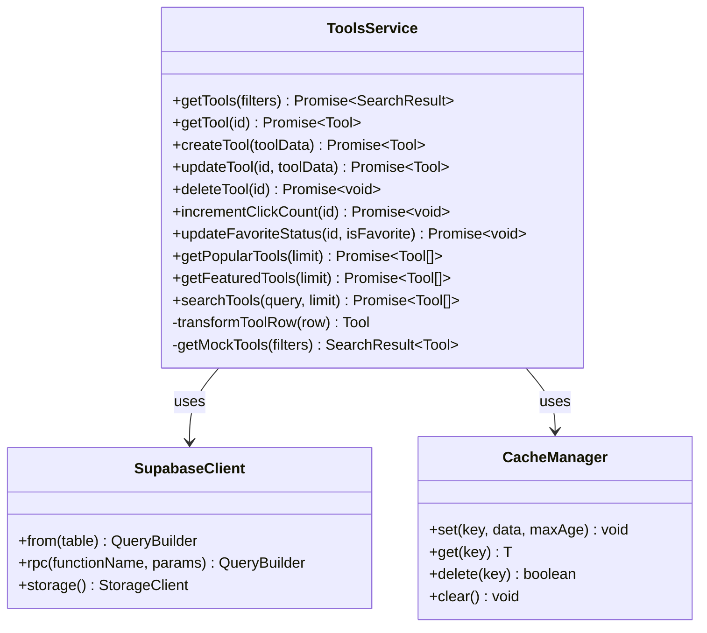
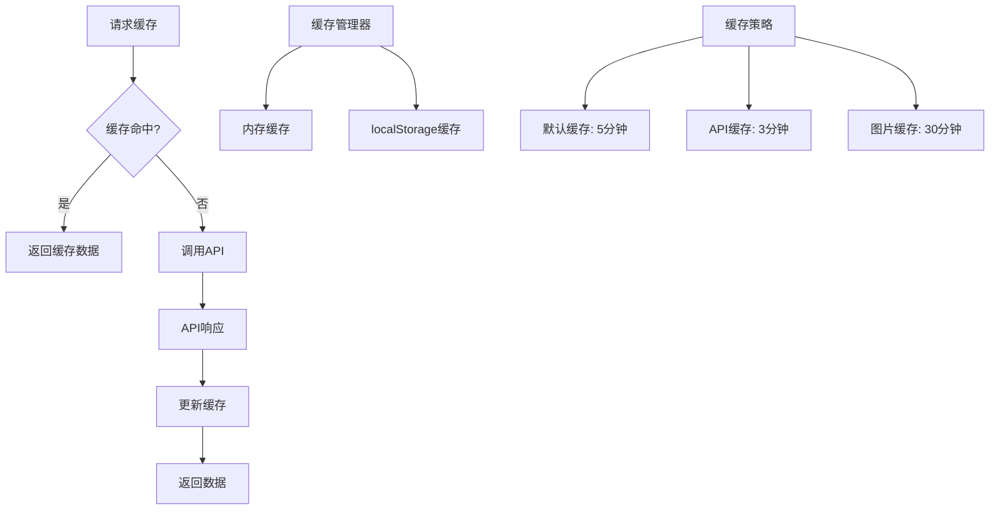
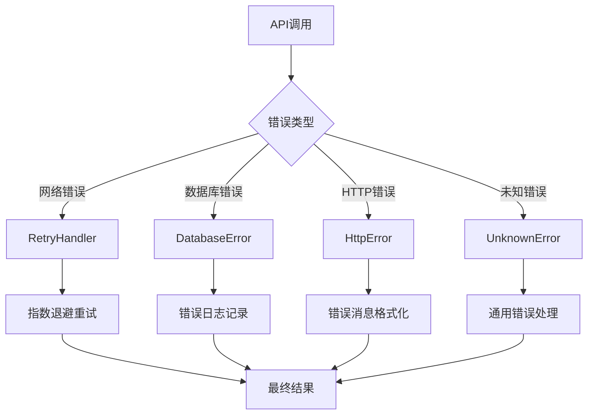
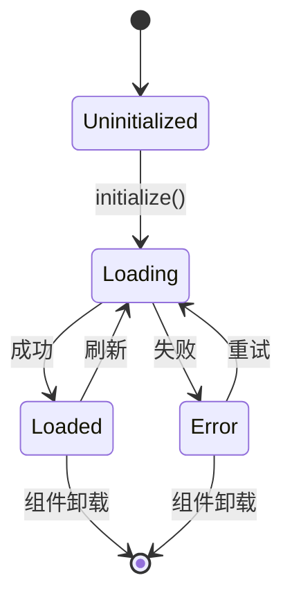

# 工具详情页数据加载机制

<cite>
**本文档引用的文件**
- [ToolDetailView.vue](file://src/views/ToolDetailView.vue)
- [toolsService.ts](file://src/services/toolsService.ts)
- [tools.ts](file://src/stores/tools.ts)
- [index.ts](file://src/router/index.ts)
- [supabaseClient.ts](file://src/lib/supabaseClient.ts)
- [cacheManager.ts](file://src/utils/cacheManager.ts)
- [errorHandler.ts](file://src/utils/errorHandler.ts)
</cite>

## 目录
1. [概述](#概述)
2. [架构概览](#架构概览)
3. [路由参数提取](#路由参数提取)
4. [生命周期钩子与数据加载](#生命周期钩子与数据加载)
5. [服务层封装](#服务层封装)
6. [缓存机制](#缓存机制)
7. [错误处理策略](#错误处理策略)
8. [响应式数据绑定](#响应式数据绑定)
9. [性能优化](#性能优化)
10. [故障排除指南](#故障排除指南)

## 概述

工具详情页（ToolDetailView.vue）采用现代Vue 3 Composition API模式，通过`onMounted`生命周期钩子触发数据加载流程。该系统实现了完整的数据流管道，从路由参数提取到最终的UI渲染，涵盖了状态管理、缓存优化、错误处理等多个层面的技术实现。

## 架构概览



**图表来源**
- [ToolDetailView.vue](file://src/views/ToolDetailView.vue#L146-L203)
- [toolsService.ts](file://src/services/toolsService.ts#L1-L50)
- [tools.ts](file://src/stores/tools.ts#L118-L159)

## 路由参数提取

### vue-router集成

工具详情页通过Vue Router的`useRoute()`组合式API获取路由参数：

```typescript
const route = useRoute();
const router = useRouter();

onMounted(async () => {
  await loadToolDetail();
});

const loadToolDetail = async () => {
  try {
    loading.value = true;
    const toolId = route.params.id as string;
    // 继续处理...
  } catch (error) {
    console.error("加载工具详情失败:", error);
  } finally {
    loading.value = false;
  }
};
```

### 参数验证逻辑

路由配置确保了正确的参数格式：
```typescript
{
  path: "/tools/:id",
  name: "ToolDetail",
  component: () => import("../views/ToolDetailView.vue"),
  meta: {
    title: "工具详情",
    description: "查看工具详细信息和使用教程",
  },
}
```

**章节来源**
- [ToolDetailView.vue](file://src/views/ToolDetailView.vue#L146-L203)
- [index.ts](file://src/router/index.ts#L100-L110)

## 生命周期钩子与数据加载

### onMounted生命周期钩子

工具详情页在组件挂载时自动触发数据加载：



**图表来源**
- [ToolDetailView.vue](file://src/views/ToolDetailView.vue#L158-L180)
- [tools.ts](file://src/stores/tools.ts#L199-L243)

### 数据加载流程

1. **初始化检查**：检查store是否已初始化
2. **工具查找**：在本地工具列表中查找对应ID的工具
3. **相关工具加载**：根据分类ID筛选相关工具
4. **点击计数更新**：异步更新工具点击次数

**章节来源**
- [ToolDetailView.vue](file://src/views/ToolDetailView.vue#L158-L180)

## 服务层封装

### ToolsService核心功能

ToolsService提供了完整的工具数据操作接口：



**图表来源**
- [toolsService.ts](file://src/services/toolsService.ts#L30-L80)
- [supabaseClient.ts](file://src/lib/supabaseClient.ts#L10-L30)

### Supabase客户端封装

服务层通过封装的Supabase客户端进行数据库操作：

```typescript
// 获取单个工具（带缓存）
static async getTool(id: string): Promise<Tool> {
  const cacheKey = `tool_${id}`;
  
  return withCache(
    this._getToolFromAPI.bind(this),
    () => cacheKey,
    apiCache,
    5 * 60 * 1000, // 5分钟缓存
  )(id);
}

private static async _getToolFromAPI(id: string): Promise<Tool> {
  try {
    const { data, error } = await supabase
      .from(TABLES.TOOLS)
      .select(`
        *,
        categories(*)
      `)
      .eq("id", id)
      .single();

    if (error) {
      throw new Error(handleSupabaseError(error));
    }

    return this.transformToolRow(data);
  } catch (error) {
    const appError = ErrorHandler.handleApiError(error);
    ErrorHandler.logError(appError, "ToolsService.getTool");
    throw appError;
  }
}
```

**章节来源**
- [toolsService.ts](file://src/services/toolsService.ts#L80-L120)

## 缓存机制

### 多层级缓存策略

系统实现了三级缓存机制：



**图表来源**
- [cacheManager.ts](file://src/utils/cacheManager.ts#L1-L50)

### 缓存装饰器实现

```typescript
export function withCache<T extends (...args: any[]) => Promise<any>>(
  fn: T,
  cacheKey: ((...args: Parameters<T>) => string) | string,
  cacheInstance: CacheManager = defaultCache,
  maxAge?: number,
): T {
  return (async (...args: Parameters<T>) => {
    const key = typeof cacheKey === "function" ? cacheKey(...args) : cacheKey;

    // 尝试从缓存获取
    const cachedResult = cacheInstance.get(key);
    if (cachedResult !== null) {
      return cachedResult;
    }

    // 执行原函数
    const result = await fn(...args);

    // 缓存结果
    cacheInstance.set(key, result, maxAge);

    return result;
  }) as T;
}
```

**章节来源**
- [cacheManager.ts](file://src/utils/cacheManager.ts#L350-L380)

## 错误处理策略

### 多层次错误处理



**图表来源**
- [errorHandler.ts](file://src/utils/errorHandler.ts#L1-L50)

### 错误恢复机制

```typescript
export class RetryHandler {
  static async withExponentialBackoff<T>(
    operation: () => Promise<T>,
    maxRetries: number = 3,
    baseDelay: number = 1000,
    maxDelay: number = 10000,
  ): Promise<T> {
    let lastError: unknown;

    for (let attempt = 1; attempt <= maxRetries; attempt++) {
      try {
        return await operation();
      } catch (error) {
        lastError = error;

        if (attempt === maxRetries) {
          throw error;
        }

        // 指数退避延迟，带抖动
        const exponentialDelay = baseDelay * Math.pow(2, attempt - 1);
        const jitter = Math.random() * 0.1 * exponentialDelay;
        const delay = Math.min(exponentialDelay + jitter, maxDelay);

        await new Promise((resolve) => setTimeout(resolve, delay));
      }
    }

    throw lastError;
  }
}
```

**章节来源**
- [errorHandler.ts](file://src/utils/errorHandler.ts#L300-L330)

## 响应式数据绑定

### Pinia状态管理



**图表来源**
- [tools.ts](file://src/stores/tools.ts#L118-L159)

### 响应式状态管理

```typescript
export const useToolsStore = defineStore('tools', () => {
  const tools = ref<Tool[]>([])
  const isLoading = ref(false)
  const error = ref<string | null>(null)
  const initialized = ref(false)
  
  // 计算属性
  const activeTools = computed(() => tools.value.filter(t => t.status === 'active'))
  const filteredTools = computed(() => {
    let result = activeTools.value
    
    if (searchQuery.value.trim()) {
      const query = searchQuery.value.toLowerCase()
      result = result.filter(tool => 
        tool.name.toLowerCase().includes(query) ||
        tool.description.toLowerCase().includes(query)
      )
    }
    
    if (selectedCategory.value) {
      result = result.filter(tool => tool.category_id === selectedCategory.value)
    }
    
    return result
  })

  // 方法
  async function initialize() {
    if (initialized.value) return true
    
    try {
      isLoading.value = true
      error.value = null
      
      // 模拟工具数据
      const mockTools: Tool[] = [
        {
          id: '1',
          name: 'GitHub',
          description: '世界上最大的代码托管平台',
          url: 'https://github.com',
          icon: '🐙',
          category_id: 'dev-tools',
          is_featured: true,
          click_count: 1250,
          status: 'active',
          created_at: new Date().toISOString(),
          updated_at: new Date().toISOString()
        }
      ]
      
      await new Promise(resolve => setTimeout(resolve, 500))
      setTools(mockTools)
      initialized.value = true
      return true
    } catch (err) {
      error.value = '加载工具数据失败'
      console.error('ToolsStore initialization error:', err)
      return false
    } finally {
      isLoading.value = false
    }
  }

  return {
    tools,
    activeTools,
    isLoading,
    error,
    initialized,
    filteredTools,
    initialize
  }
})
```

**章节来源**
- [tools.ts](file://src/stores/tools.ts#L118-L243)

## 性能优化

### 加载状态管理

工具详情页实现了完善的加载状态管理：

```typescript
// 加载状态组件
<div v-else-if="loading" class="loading-state">
  <div class="spinner"></div>
  <p>正在加载工具详情...</p>
</div>

// 错误状态组件
<div v-else class="error-state">
  <p>工具不存在或加载失败</p>
  <button class="secondary-button" @click="goBack">返回</button>
</div>
```

### 点击计数优化

```typescript
const openTool = async () => {
  if (!tool.value?.url) {
    alert("该工具暂无可用链接");
    return;
  }

  try {
    let url = tool.value.url.trim();
    if (!url.startsWith("http://") && !url.startsWith("https://")) {
      url = "https://" + url;
    }

    // 异步更新点击计数
    await toolsStore.incrementClickCount(tool.value.id);
    window.open(url, "_blank", "noopener,noreferrer");
  } catch (error) {
    console.error("打开链接失败:", error);
    alert("无法打开该链接");
  }
};
```

**章节来源**
- [ToolDetailView.vue](file://src/views/ToolDetailView.vue#L480-L508)

## 故障排除指南

### 常见问题与解决方案

1. **路由参数无效**
   - 检查路由配置是否正确
   - 验证工具ID格式是否符合要求

2. **数据加载失败**
   - 检查网络连接状态
   - 查看浏览器开发者工具中的API响应
   - 验证Supabase连接配置

3. **缓存问题**
   - 清除浏览器缓存
   - 检查localStorage存储空间
   - 验证缓存键生成逻辑

4. **错误处理**
   - 查看控制台错误日志
   - 检查ErrorHandler的错误报告
   - 验证重试机制配置

### 调试工具

```typescript
// 缓存统计信息
const cacheStats = apiCache.getStats();
console.log('缓存统计:', cacheStats);

// 错误日志
ErrorHandler.logError(error, "ToolDetailView.loadToolDetail");
```

**章节来源**
- [cacheManager.ts](file://src/utils/cacheManager.ts#L100-L130)
- [errorHandler.ts](file://src/utils/errorHandler.ts#L200-L230)

## 结论

工具详情页的数据加载机制展现了现代Vue 3应用的最佳实践，通过合理的架构分层、完善的错误处理、智能的缓存策略和响应式的状态管理，实现了高性能、高可靠性的用户体验。该系统不仅具备良好的可维护性，还为未来的功能扩展奠定了坚实的基础。