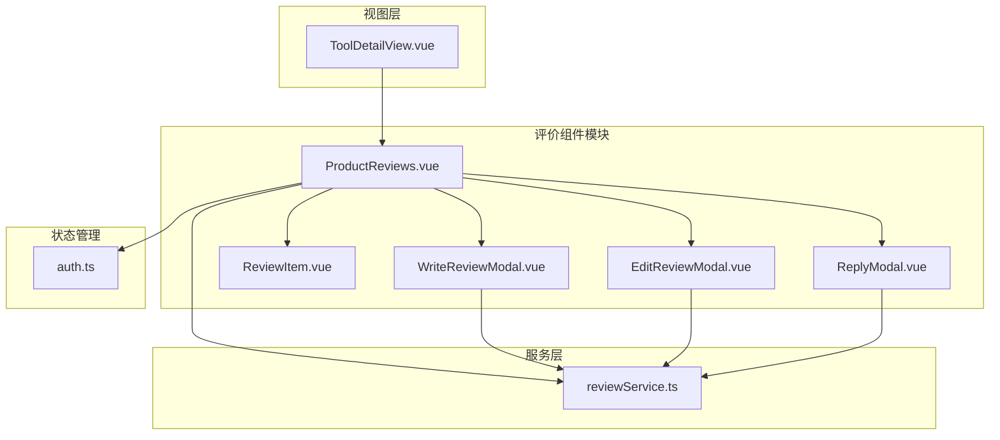
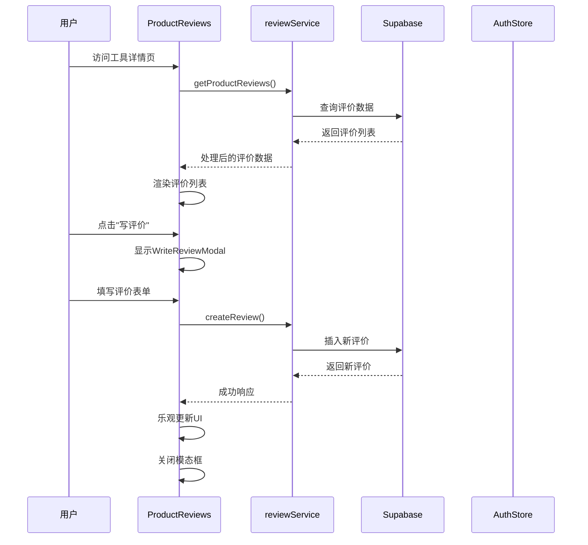
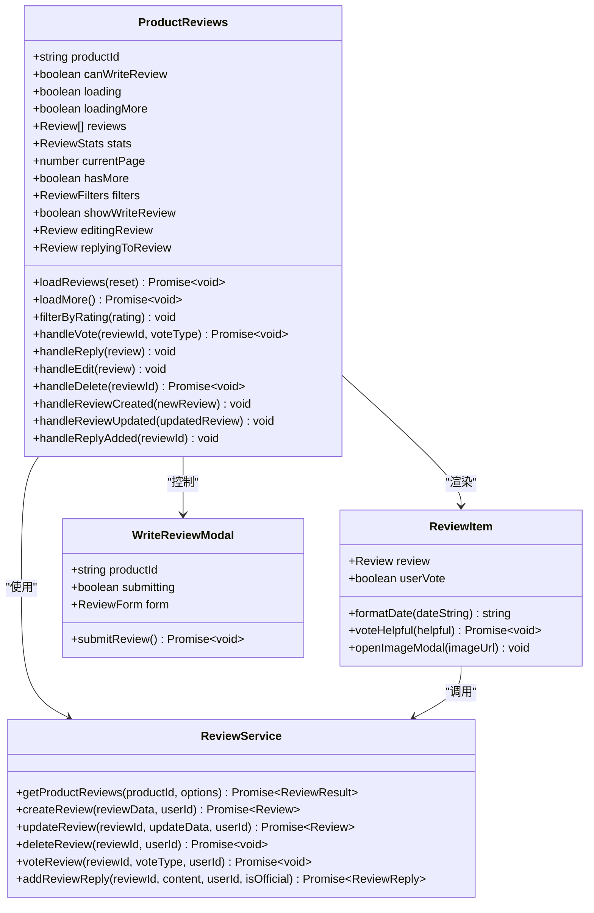
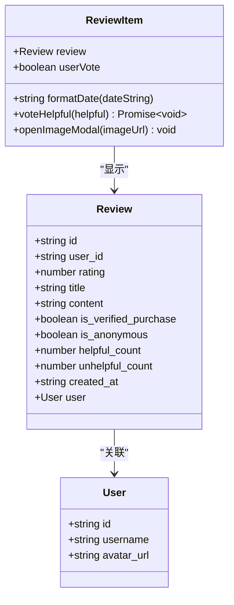
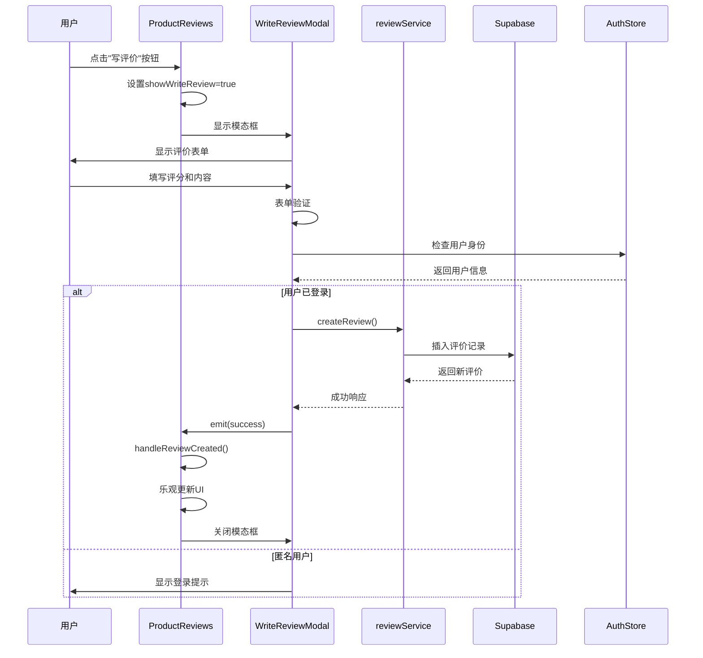
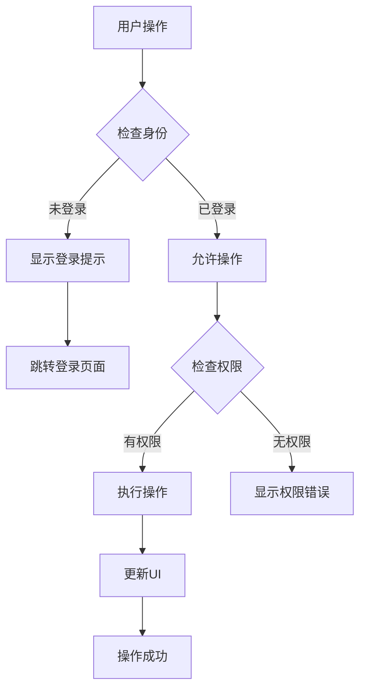
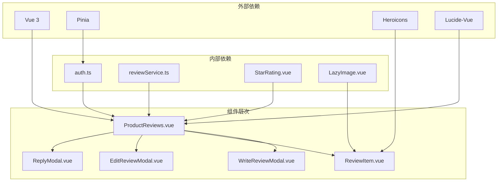

# 用户评价集成

<cite>
**本文档引用的文件**
- [ProductReviews.vue](file://src/components/reviews/ProductReviews.vue)
- [WriteReviewModal.vue](file://src/components/reviews/WriteReviewModal.vue)
- [ReviewItem.vue](file://src/components/reviews/ReviewItem.vue)
- [EditReviewModal.vue](file://src/components/reviews/EditReviewModal.vue)
- [ReplyModal.vue](file://src/components/reviews/ReplyModal.vue)
- [reviewService.ts](file://src/services/reviewService.ts)
- [ToolDetailView.vue](file://src/views/ToolDetailView.vue)
- [auth.ts](file://src/stores/auth.ts)
- [supabaseClient.ts](file://src/lib/supabaseClient.ts)
</cite>

## 目录
1. [简介](#简介)
2. [项目结构](#项目结构)
3. [核心组件](#核心组件)
4. [架构概览](#架构概览)
5. [详细组件分析](#详细组件分析)
6. [依赖关系分析](#依赖关系分析)
7. [性能考虑](#性能考虑)
8. [故障排除指南](#故障排除指南)
9. [结论](#结论)

## 简介

ProductReviews组件是Advanced Tools Navigation平台中用于展示和管理工具评价的核心组件。该组件深度集成在工具详情页中，提供完整的用户评价生态系统，包括评价列表展示、筛选排序、交互式投票、回复功能以及完整的CRUD操作。

该组件基于Vue 3 Composition API构建，采用TypeScript提供强类型支持，集成了Supabase作为后端服务，实现了完整的身份验证检查、乐观UI更新和实时数据同步功能。

## 项目结构

ProductReviews组件位于`src/components/reviews/`目录下，包含以下核心文件：



**图表来源**
- [ProductReviews.vue](file://src/components/reviews/ProductReviews.vue#L1-L611)
- [reviewService.ts](file://src/services/reviewService.ts#L1-L615)

**章节来源**
- [ProductReviews.vue](file://src/components/reviews/ProductReviews.vue#L1-L50)
- [ToolDetailView.vue](file://src/views/ToolDetailView.vue#L1-L100)

## 核心组件

### ProductReviews组件

ProductReviews是评价系统的核心容器组件，负责协调所有子组件和业务逻辑。它提供了完整的评价管理界面，包括：

- **评价概览**：显示总体评分、评分分布和统计信息
- **评价列表**：支持分页加载和多种排序方式
- **筛选功能**：按评分、验证购买和内容类型筛选
- **交互式投票**：支持有用/无用投票功能
- **模态框集成**：写评价、编辑评价和回复评价

### WriteReviewModal组件

WriteReviewModal是一个独立的模态框组件，专门用于创建新的评价。它提供了：

- **评分选择**：星级评分组件
- **表单验证**：必填字段验证
- **富文本输入**：支持标题和详细内容
- **乐观渲染**：提交后立即更新UI

### ReviewItem组件

ReviewItem负责单个评价的渲染，包含：

- **用户信息**：头像、用户名和认证标识
- **评价内容**：评分、标题、正文和图片
- **互动功能**：投票、回复和编辑按钮
- **懒加载优化**：图片懒加载和性能优化

**章节来源**
- [ProductReviews.vue](file://src/components/reviews/ProductReviews.vue#L1-L100)
- [WriteReviewModal.vue](file://src/components/reviews/WriteReviewModal.vue#L1-L50)
- [ReviewItem.vue](file://src/components/reviews/ReviewItem.vue#L1-L50)

## 架构概览

ProductReviews组件采用分层架构设计，确保关注点分离和可维护性：



**图表来源**
- [ProductReviews.vue](file://src/components/reviews/ProductReviews.vue#L130-L180)
- [reviewService.ts](file://src/services/reviewService.ts#L100-L150)

**章节来源**
- [ProductReviews.vue](file://src/components/reviews/ProductReviews.vue#L1-L200)
- [reviewService.ts](file://src/services/reviewService.ts#L1-L100)

## 详细组件分析

### ProductReviews组件详细分析

ProductReviews组件是评价系统的中央控制器，实现了复杂的数据管理和用户交互逻辑：



**图表来源**
- [ProductReviews.vue](file://src/components/reviews/ProductReviews.vue#L80-L150)
- [reviewService.ts](file://src/services/reviewService.ts#L50-L150)
- [ReviewItem.vue](file://src/components/reviews/ReviewItem.vue#L80-L120)

#### 分页查询实现

ProductReviews组件实现了高效的分页查询机制：

```typescript
const loadReviews = async (reset = true) => {
  try {
    if (reset) {
      loading.value = true;
      currentPage.value = 1;
      reviews.value = [];
    } else {
      loadingMore.value = true;
    }

    const result = await reviewService.getProductReviews(props.productId, {
      page: currentPage.value,
      limit: 10,
      ...filters.value,
    });

    if (reset) {
      reviews.value = result.reviews;
    } else {
      reviews.value.push(...result.reviews);
    }

    stats.value = result.stats;
    hasMore.value = reviews.value.length < result.total;
  } catch (error) {
    console.error("加载评价失败:", error);
  } finally {
    loading.value = false;
    loadingMore.value = false;
  }
};
```

#### 排序选项实现

组件支持多种排序方式，通过ReviewFilters接口实现：

```typescript
interface ReviewFilters {
  rating?: number;
  verified_only?: boolean;
  with_content?: boolean;
  sort_by?: "newest" | "oldest" | "highest_rating" | "lowest_rating" | "most_helpful";
}
```

支持的排序选项包括：
- **最新评价**：按创建时间降序排列
- **最早评价**：按创建时间升序排列  
- **评分最高**：按评分降序排列
- **评分最低**：按评分升序排列
- **最有用**：按有用投票数降序排列

#### 筛选条件实现

筛选功能通过多个复选框实现：

```html
<label class="filter-checkbox">
  <input
    v-model="filters.verified_only"
    type="checkbox"
    @change="() => loadReviews()"
  />
  只看验证购买
</label>

<label class="filter-checkbox">
  <input
    v-model="filters.with_content"
    type="checkbox"
    @change="() => loadReviews()"
  />
  只看有内容的评价
</label>
```

**章节来源**
- [ProductReviews.vue](file://src/components/reviews/ProductReviews.vue#L130-L200)
- [reviewService.ts](file://src/services/reviewService.ts#L50-L150)

### WriteReviewModal组件详细分析

WriteReviewModal组件提供了完整的评价创建功能：

```mermaid
flowchart TD
Start([用户点击"写评价"]) --> ShowModal[显示模态框]
ShowModal --> FormInit[初始化表单]
FormInit --> UserInput[用户填写表单]
UserInput --> Validation{表单验证}
Validation --> |验证失败| ShowError[显示错误信息]
ShowError --> UserInput
Validation --> |验证成功| Submit[提交评价]
Submit --> Loading[显示加载状态]
Loading --> APICall[调用reviewService]
APICall --> Success{API成功?}
Success --> |成功| OptimisticUpdate[乐观更新UI]
Success --> |失败| ShowError
OptimisticUpdate --> CloseModal[关闭模态框]
CloseModal --> RefreshList[刷新评价列表]
```

**图表来源**
- [WriteReviewModal.vue](file://src/components/reviews/WriteReviewModal.vue#L50-L100)

#### 表单验证机制

WriteReviewModal实现了完整的表单验证：

```typescript
const submitReview = async () => {
  try {
    submitting.value = true;
    await reviewService.createReview(
      {
        product_id: props.productId,
        rating: form.rating,
        title: form.title,
        content: form.content,
      },
      authStore.user?.id || "",
    );
    emit("success");
    emit("close");
  } catch (error) {
    console.error("提交评价失败:", error);
  } finally {
    submitting.value = false;
  }
};
```

#### 乐观渲染策略

组件采用了乐观渲染策略，在API调用前就更新UI：

```typescript
const handleReviewCreated = (newReview: Review) => {
  reviews.value.unshift(newReview);
  stats.value.total_reviews++;
  showWriteReview.value = false;
};
```

**章节来源**
- [WriteReviewModal.vue](file://src/components/reviews/WriteReviewModal.vue#L1-L100)
- [ProductReviews.vue](file://src/components/reviews/ProductReviews.vue#L250-L300)

### ReviewItem组件详细分析

ReviewItem组件负责单个评价的渲染和用户交互：



**图表来源**
- [ReviewItem.vue](file://src/components/reviews/ReviewItem.vue#L80-L120)
- [reviewService.ts](file://src/services/reviewService.ts#L10-L50)

#### 头像懒加载机制

ReviewItem组件实现了智能的头像加载：

```html

```

#### 内容安全过滤

组件对用户内容进行了基本的安全处理：

- **HTML转义**：自动转义特殊字符
- **长度限制**：防止过长内容影响布局
- **图片预览**：支持点击放大查看

**章节来源**
- [ReviewItem.vue](file://src/components/reviews/ReviewItem.vue#L1-L100)

### 交互流程分析

#### 添加新评论的完整流程



**图表来源**
- [ProductReviews.vue](file://src/components/reviews/ProductReviews.vue#L250-L300)
- [WriteReviewModal.vue](file://src/components/reviews/WriteReviewModal.vue#L50-L100)

#### 投票功能实现

```typescript
const handleVote = async (
  reviewId: string,
  voteType: "helpful" | "unhelpful",
) => {
  if (!currentUserId.value) {
    // 提示用户登录
    return;
  }

  try {
    await reviewService.voteReview(reviewId, voteType, currentUserId.value);

    // 更新本地状态
    const review = reviews.value.find((r) => r.id === reviewId);
    if (review) {
      if (review.user_vote === voteType) {
        // 取消投票
        review.user_vote = null;
        if (voteType === "helpful") {
          review.helpful_count--;
        } else {
          review.unhelpful_count--;
        }
      } else {
        // 新投票或更改投票
        if (review.user_vote) {
          // 更改投票
          if (review.user_vote === "helpful") {
            review.helpful_count--;
          } else {
            review.unhelpful_count--;
          }
        }

        review.user_vote = voteType;
        if (voteType === "helpful") {
          review.helpful_count++;
        } else {
          review.unhelpful_count++;
        }
      }
    }
  } catch (error) {
    console.error("投票失败:", error);
  }
};
```

**章节来源**
- [ProductReviews.vue](file://src/components/reviews/ProductReviews.vue#L180-L250)

### 身份验证检查

身份验证在整个评价系统中起着关键作用：



**图表来源**
- [auth.ts](file://src/stores/auth.ts#L50-L100)

#### 匿名用户处理

对于匿名用户尝试评论的情况，系统会：

1. **阻止操作**：禁止匿名用户提交评价
2. **显示提示**：弹出登录提示
3. **导航引导**：跳转到登录页面
4. **保持上下文**：保存当前操作以便登录后继续

**章节来源**
- [ProductReviews.vue](file://src/components/reviews/ProductReviews.vue#L180-L220)
- [auth.ts](file://src/stores/auth.ts#L1-L50)

### 功能边界说明

#### 举报不良评论

虽然当前实现中没有具体的举报功能，但系统设计支持扩展：

```typescript
// TODO: 实现举报功能
const reportReview = async (reviewId: string, reason: string) => {
  try {
    await reviewService.reportReview(reviewId, reason);
    // 更新本地状态
  } catch (error) {
    console.error("举报评价失败:", error);
  }
};
```

#### 回复他人评论

回复功能通过ReplyModal组件实现：

```typescript
const handleReply = (review: Review) => {
  if (!currentUserId.value) {
    // 提示用户登录
    return;
  }
  replyingToReview.value = review;
};
```

#### 管理员删除权限

管理员具有特殊的删除权限：

```typescript
async deleteReview(reviewId: string, userId: string): Promise<void> {
  try {
    // 验证用户权限
    const { data: existingReview } = await supabase
      .from("product_reviews")
      .select("user_id")
      .eq("id", reviewId)
      .single();

    if (!existingReview || existingReview.user_id !== userId) {
      throw new Error("无权限删除此评价");
    }

    const { error } = await supabase
      .from("product_reviews")
      .delete()
      .eq("id", reviewId);

    if (error) throw error;
  } catch (error) {
    console.error("删除评价失败:", error);
    throw error;
  }
}
```

**章节来源**
- [reviewService.ts](file://src/services/reviewService.ts#L300-L350)
- [ProductReviews.vue](file://src/components/reviews/ProductReviews.vue#L220-L250)

## 依赖关系分析

ProductReviews组件的依赖关系展现了清晰的分层架构：



**图表来源**
- [ProductReviews.vue](file://src/components/reviews/ProductReviews.vue#L80-L90)
- [reviewService.ts](file://src/services/reviewService.ts#L1-L20)

**章节来源**
- [ProductReviews.vue](file://src/components/reviews/ProductReviews.vue#L80-L100)
- [reviewService.ts](file://src/services/reviewService.ts#L1-L50)

## 性能考虑

### 懒加载优化

1. **图片懒加载**：ReviewItem组件对评价图片实现懒加载
2. **分页加载**：支持无限滚动和分页加载
3. **缓存策略**：利用Pinia store进行状态缓存

### 乐观更新

系统采用乐观更新策略提升用户体验：

- **即时反馈**：用户操作后立即更新UI
- **回滚机制**：API失败时自动回滚
- **并发处理**：支持同时进行多个操作

### 内存管理

- **组件卸载**：及时清理事件监听器
- **数据清理**：避免内存泄漏
- **缓存控制**：合理控制缓存大小

## 故障排除指南

### 常见问题及解决方案

#### 1. 评价加载失败

**症状**：评价列表显示空白或加载错误
**原因**：网络连接问题或数据库查询异常
**解决方案**：
- 检查网络连接
- 查看浏览器开发者工具中的网络请求
- 验证Supabase连接配置

#### 2. 无法提交评价

**症状**：点击提交按钮无响应
**原因**：身份验证失败或表单验证错误
**解决方案**：
- 确认用户已登录
- 检查表单必填字段
- 查看控制台错误信息

#### 3. 投票功能异常

**症状**：投票后计数不更新
**原因**：用户未登录或投票状态同步失败
**解决方案**：
- 确保用户已登录
- 检查网络连接
- 刷新页面重新加载数据

**章节来源**
- [ProductReviews.vue](file://src/components/reviews/ProductReviews.vue#L130-L180)
- [reviewService.ts](file://src/services/reviewService.ts#L200-L250)

## 结论

ProductReviews组件是一个功能完整、设计精良的评价系统，具备以下特点：

### 主要优势

1. **完整的功能覆盖**：从评价创建到管理的全流程支持
2. **优秀的用户体验**：乐观更新、即时反馈和流畅的交互
3. **强大的技术架构**：基于Vue 3 Composition API和TypeScript
4. **可靠的身份验证**：完善的权限控制和安全机制
5. **良好的可维护性**：清晰的组件分离和模块化设计

### 技术亮点

- **分层架构**：清晰的职责分离和依赖管理
- **类型安全**：完整的TypeScript类型定义
- **性能优化**：懒加载、缓存和分页策略
- **错误处理**：完善的异常处理和用户提示
- **可扩展性**：模块化设计便于功能扩展

### 改进建议

1. **举报功能**：添加不良内容举报机制
2. **高级筛选**：支持更多筛选条件
3. **批量操作**：支持批量删除和审核
4. **数据分析**：添加评价趋势分析功能
5. **移动端优化**：进一步优化移动端体验

该组件为Advanced Tools Navigation平台提供了坚实的评价基础设施，为用户提供了一个完整、可靠的评价生态系统。