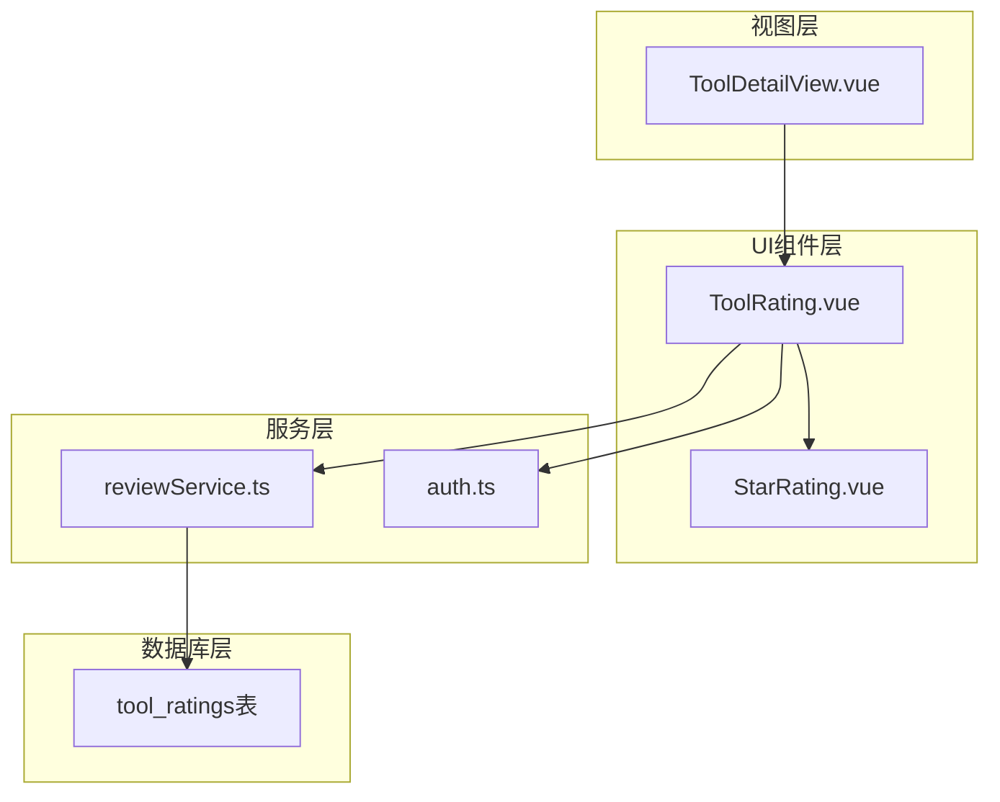
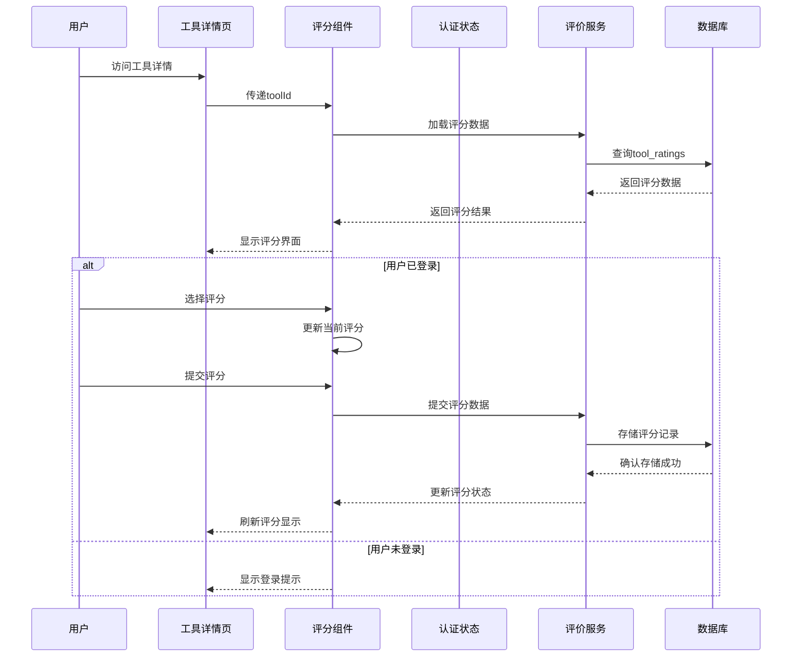
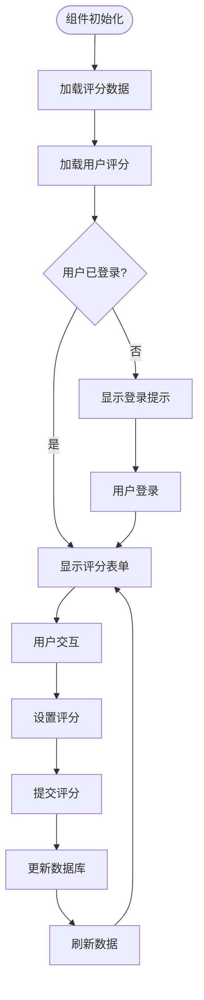
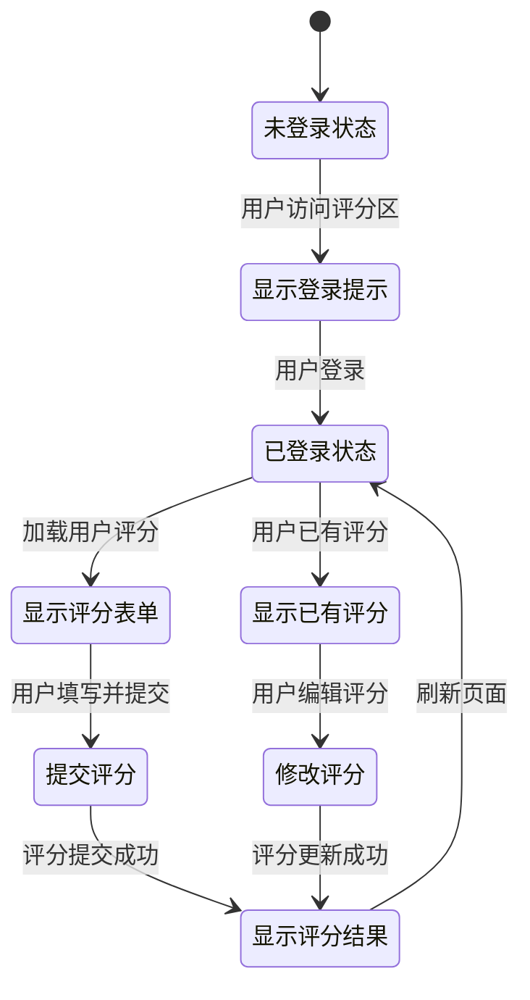
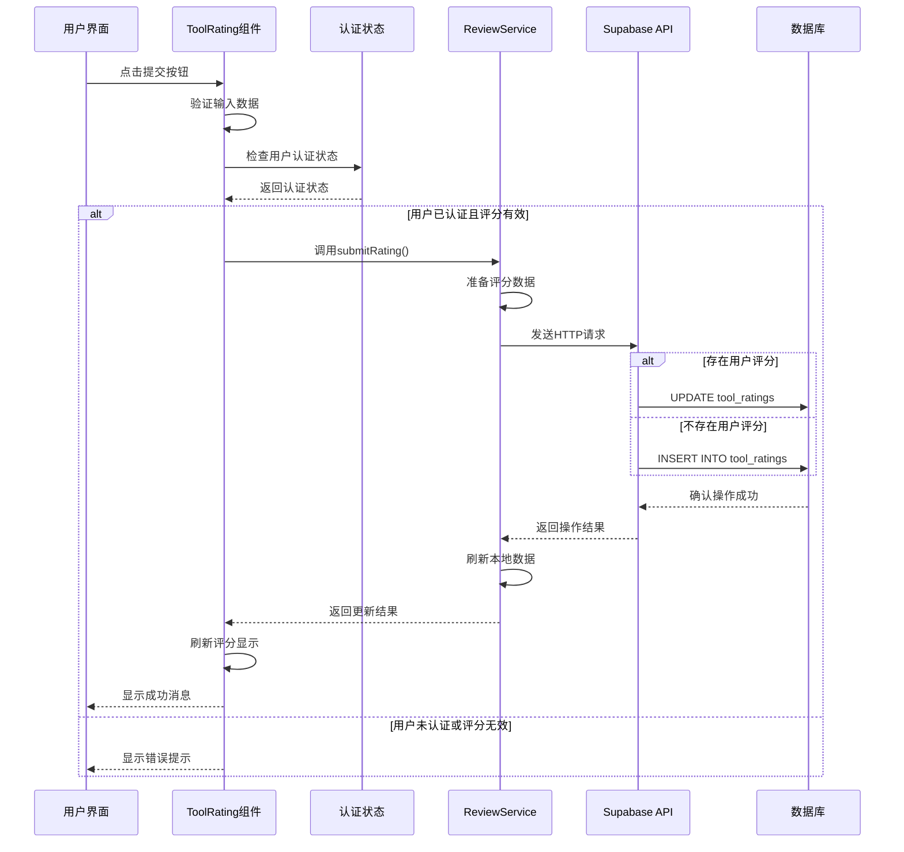

# 评分展示机制

<cite>
**本文档引用的文件**
- [StarRating.vue](file://src/components/ui/StarRating.vue)
- [ToolRating.vue](file://src/components/ToolRating.vue)
- [ToolDetailView.vue](file://src/views/ToolDetailView.vue)
- [reviewService.ts](file://src/services/reviewService.ts)
- [auth.ts](file://src/stores/auth.ts)
</cite>

## 目录
1. [简介](#简介)
2. [项目结构概览](#项目结构概览)
3. [核心组件分析](#核心组件分析)
4. [架构概览](#架构概览)
5. [详细组件分析](#详细组件分析)
6. [用户认证状态影响机制](#用户认证状态影响机制)
7. [评分提交流程](#评分提交流程)
8. [性能考虑](#性能考虑)
9. [故障排除指南](#故障排除指南)
10. [结论](#结论)

## 简介

本文档详细阐述了StarRating组件在工具详情页中的渲染逻辑与交互行为。该系统实现了完整的评分展示机制，包括半星评分的实现原理、CSS样式控制、用户身份认证状态对评分功能的影响机制，以及评分提交事件的完整流程。

评分系统采用Vue 3 Composition API构建，支持响应式数据绑定、实时反馈动画和无障碍访问（a11y）支持。系统通过Supabase数据库实现数据持久化，确保评分数据的安全存储和高效检索。

## 项目结构概览

评分系统的文件组织结构清晰，主要组件分布在以下目录中：



**图表来源**
- [ToolDetailView.vue](file://src/views/ToolDetailView.vue#L1-L50)
- [ToolRating.vue](file://src/components/ToolRating.vue#L1-L30)

**章节来源**
- [ToolDetailView.vue](file://src/views/ToolDetailView.vue#L1-L508)
- [ToolRating.vue](file://src/components/ToolRating.vue#L1-L483)

## 核心组件分析

### StarRating基础组件

StarRating组件是一个轻量级的基础评分组件，提供基本的星级显示和交互功能：

```typescript
// 基础组件接口
interface StarRatingProps {
  modelValue: number;     // 当前评分值
  readonly?: boolean;     // 是否只读模式
}

// 组件核心逻辑
function updateRating(n: number) {
  if (!props.readonly) {
    emit("update:modelValue", n);
  }
}
```

该组件采用简洁的模板结构，通过v-for指令动态生成5个星级元素，每个星级都支持点击事件和条件样式绑定。

**章节来源**
- [StarRating.vue](file://src/components/ui/StarRating.vue#L1-L55)

### ToolRating高级组件

ToolRating组件是StarRating的扩展版本，提供了完整的评分展示和管理功能：

```typescript
// ToolRating组件接口
interface ToolRatingProps {
  toolId: string;         // 工具唯一标识符
}

// 状态管理
const ratings = ref([]);           // 所有评分数据
const reviews = ref([]);           // 评论数据
const userRating = ref(null);      // 当前用户评分
const currentRating = ref(0);      // 当前选择评分
const hoverRating = ref(0);        // 鼠标悬停评分
const reviewText = ref("");        // 评论文本
const isAnonymous = ref(false);    // 匿名评价标志
const submitting = ref(false);     // 提交状态
```

**章节来源**
- [ToolRating.vue](file://src/components/ToolRating.vue#L118-L174)

## 架构概览

评分系统采用分层架构设计，各组件职责明确：



**图表来源**
- [ToolDetailView.vue](file://src/views/ToolDetailView.vue#L1-L50)
- [ToolRating.vue](file://src/components/ToolRating.vue#L200-L250)

## 详细组件分析

### StarRating组件详细分析

StarRating组件采用简洁的设计理念，专注于核心功能：

```mermaid
classDiagram
class StarRating {
+Number modelValue
+Boolean readonly
+updateRating(n : number)
+emit("update : modelValue")
}
class StarRatingTemplate {
+v-for="n in 5"
+ : key="n"
+ : class="{ filled : n <= modelValue }"
+@click="updateRating(n)"
}
class StarRatingStyles {
+display : flex
+gap : 4px
+font-size : 1.5rem
+color : #ffd700
+cursor : pointer
}
StarRating --> StarRatingTemplate : "使用"
StarRating --> StarRatingStyles : "应用"
```

**图表来源**
- [StarRating.vue](file://src/components/ui/StarRating.vue#L1-L20)

#### 半星评分实现原理

虽然当前的StarRating组件不直接支持半星评分，但其设计为未来扩展预留了空间。组件通过简单的数值比较实现星级填充效果：

```javascript
// 星级填充逻辑
:class="{ filled: n <= modelValue }"
```

当modelValue为整数时，显示完整填充的星级；当modelValue为小数时，可以通过CSS过渡效果实现半星显示。

#### CSS样式控制

组件采用Scoped CSS确保样式隔离：

```css
.star-rating {
  display: flex;
  gap: 4px;
  font-size: 1.5rem;
  color: #ffd700;
  cursor: pointer;
}

.star {
  transition: color 0.2s;
}

.star.filled {
  color: #ffd700;
}

.star:not(.filled) {
  color: #ccc;
}
```

**章节来源**
- [StarRating.vue](file://src/components/ui/StarRating.vue#L20-L55)

### ToolRating组件详细分析

ToolRating组件是评分系统的核心，提供了丰富的功能：



**图表来源**
- [ToolRating.vue](file://src/components/ToolRating.vue#L174-L231)

#### 评分分布可视化

组件实现了直观的评分分布柱状图：

```typescript
const ratingDistribution = computed(() => {
  const distribution = { 5: 0, 4: 0, 3: 0, 2: 0, 1: 0 };
  ratings.value.forEach((rating) => {
    distribution[rating.rating]++;
  });
  return distribution;
});

const getBarWidth = (count: number) => {
  if (totalRatings.value === 0) return 0;
  return (count / totalRatings.value) * 100;
};
```

#### 评分文本映射

系统提供了评分等级的文字描述：

```typescript
const getRatingText = (rating: number) => {
  const texts = ["", "很差", "一般", "不错", "很好", "极佳"];
  return texts[rating] || "";
};
```

**章节来源**
- [ToolRating.vue](file://src/components/ToolRating.vue#L130-L170)

## 用户认证状态影响机制

评分系统严格区分已登录用户和未登录用户的体验：



**图表来源**
- [ToolRating.vue](file://src/components/ToolRating.vue#L40-L60)
- [auth.ts](file://src/stores/auth.ts#L25-L35)

### 认证状态检测

系统通过Pinia状态管理器监控用户认证状态：

```typescript
// 认证状态计算属性
const isAuthenticated = computed(() => !!user.value);

// 用户认证检查
async function checkAuth(): Promise<boolean> {
  if (!initialized.value) {
    await initialize();
  }
  return isAuthenticated.value;
}
```

### 权限控制逻辑

评分功能的权限控制体现在多个层面：

1. **前端显示控制**：根据认证状态决定显示评分表单还是登录提示
2. **后端数据过滤**：只有已认证用户才能提交评分数据
3. **数据完整性保护**：防止未授权用户修改他人评分

**章节来源**
- [auth.ts](file://src/stores/auth.ts#L25-L40)
- [ToolRating.vue](file://src/components/ToolRating.vue#L40-L60)

## 评分提交流程

评分提交是一个完整的异步流程，涉及多个组件间的协调：



**图表来源**
- [ToolRating.vue](file://src/components/ToolRating.vue#L200-L250)

### 评分数据结构

评分数据遵循标准化的数据结构：

```typescript
interface RatingData {
  tool_id: string;           // 工具ID
  user_id: string;           // 用户ID
  rating: number;            // 评分值（1-5）
  review?: string;           // 评论内容（可选）
  is_anonymous?: boolean;    // 是否匿名
}
```

### 防抖与重复提交限制

系统通过多种机制防止重复提交：

1. **提交状态控制**：使用submitting标志防止并发提交
2. **禁用提交按钮**：在提交过程中禁用提交按钮
3. **后端约束**：数据库层面防止重复评分

```typescript
const submitRating = async () => {
  if (!currentRating.value || !authStore.user) return;
  
  try {
    submitting.value = true;
    
    // 提交评分逻辑...
    
  } catch (error) {
    console.error("提交评分失败:", error);
    alert("提交失败，请重试");
  } finally {
    submitting.value = false;
  }
};
```

**章节来源**
- [ToolRating.vue](file://src/components/ToolRating.vue#L200-L250)

## 性能考虑

评分系统在设计时充分考虑了性能优化：

### 数据缓存策略

1. **本地状态缓存**：使用Vue响应式系统缓存评分数据
2. **懒加载机制**：仅在需要时加载评分数据
3. **增量更新**：只更新变化的数据部分

### 渲染优化

1. **虚拟滚动**：对于大量评价，使用虚拟滚动技术
2. **条件渲染**：根据用户状态动态渲染不同内容
3. **CSS优化**：使用高效的CSS选择器和动画

### 网络优化

1. **请求合并**：将多个小请求合并为批量请求
2. **缓存策略**：合理设置HTTP缓存头
3. **CDN加速**：静态资源使用CDN分发

## 故障排除指南

### 常见问题及解决方案

#### 1. 评分无法提交

**症状**：点击提交按钮后没有反应

**可能原因**：
- 用户未登录
- 网络连接异常
- 后端服务不可用

**解决方案**：
```typescript
// 检查网络连接
if (!navigator.onLine) {
  alert("请检查网络连接");
  return;
}

// 检查认证状态
if (!authStore.isAuthenticated) {
  router.push('/auth/login');
  return;
}
```

#### 2. 评分显示异常

**症状**：星级显示不正确或布局错乱

**可能原因**：
- CSS样式冲突
- 字体加载失败
- 响应式布局问题

**解决方案**：
```css
/* 确保字体加载 */
@font-face {
  font-family: 'StarFont';
  src: url('/fonts/star-font.woff2') format('woff2');
}

/* 响应式调整 */
@media (max-width: 768px) {
  .star {
    width: 14px;
    height: 14px;
  }
}
```

#### 3. 数据同步问题

**症状**：提交后评分未立即更新

**可能原因**：
- 数据库延迟
- 缓存未刷新
- 网络延迟

**解决方案**：
```typescript
// 强制刷新数据
const forceRefresh = async () => {
  ratings.value = [];
  reviews.value = [];
  await loadRatings();
  await loadUserRating();
};
```

**章节来源**
- [ToolRating.vue](file://src/components/ToolRating.vue#L200-L250)

## 结论

评分展示机制是一个设计精良、功能完整的系统，具有以下特点：

### 技术优势

1. **模块化设计**：清晰的组件分离，便于维护和扩展
2. **响应式架构**：充分利用Vue 3的Composition API
3. **状态管理**：通过Pinia实现集中化的状态管理
4. **数据持久化**：基于Supabase的可靠数据存储

### 功能完整性

1. **完整的评分体系**：支持评分、评论、匿名选项
2. **用户友好界面**：直观的交互设计和视觉反馈
3. **权限控制**：严格的认证和授权机制
4. **数据可视化**：直观的评分分布展示

### 可扩展性

1. **插件化架构**：易于添加新的评分功能
2. **主题支持**：支持自定义主题和样式
3. **国际化**：支持多语言环境
4. **无障碍访问**：符合Web无障碍标准

该评分系统为工具导航平台提供了强大的用户评价功能，不仅提升了用户体验，也为平台的持续发展奠定了坚实的基础。通过合理的架构设计和技术选型，系统具备了良好的性能表现和可维护性，能够满足当前和未来的业务需求。