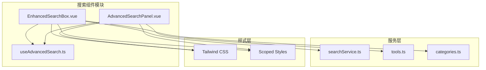
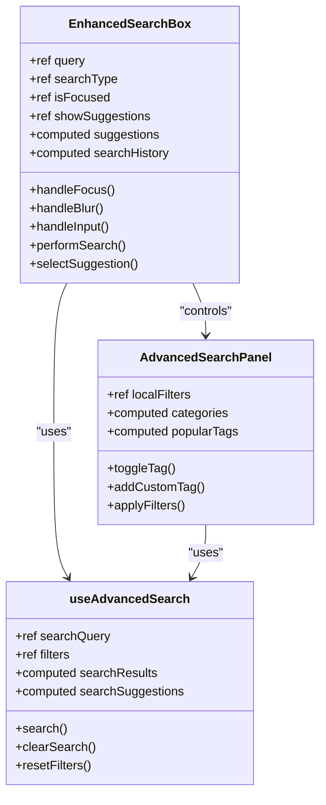
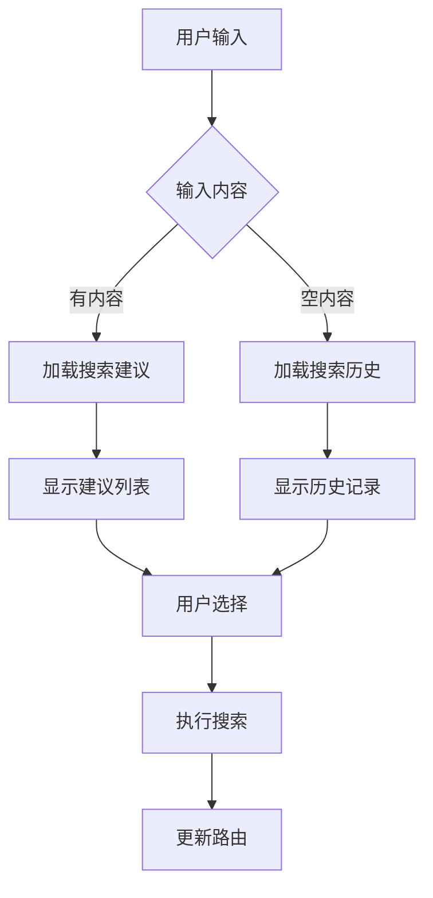
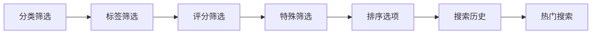
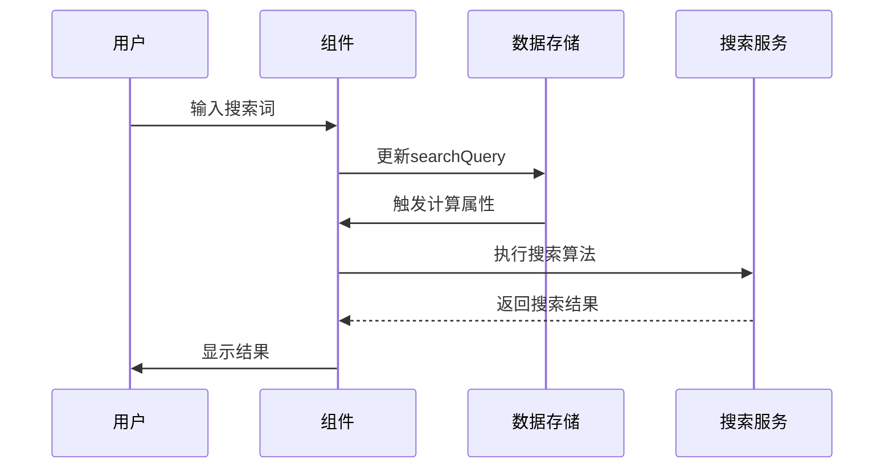
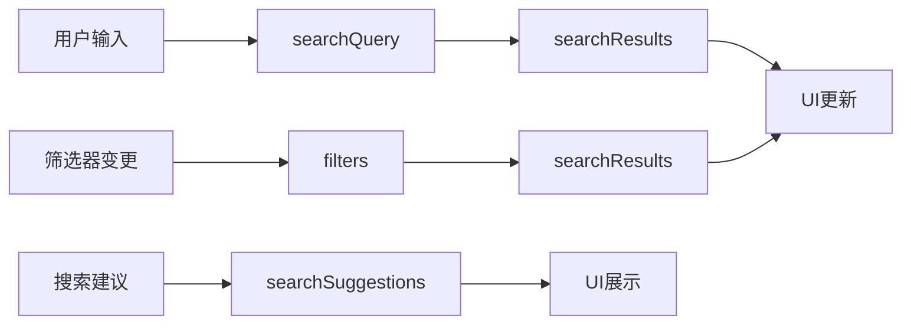
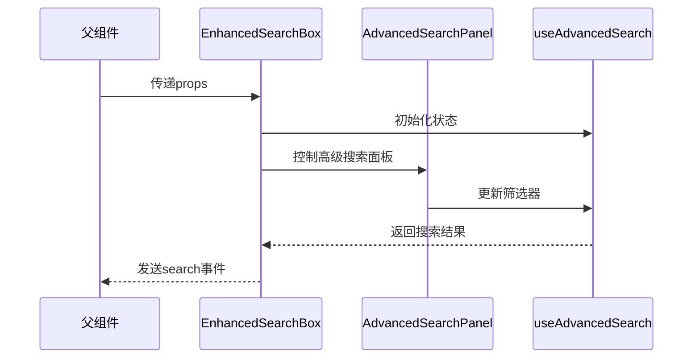

# 搜索UI组件设计与实现

<cite>
**本文档引用的文件**
- [EnhancedSearchBox.vue](file://src/components/search/EnhancedSearchBox.vue)
- [AdvancedSearchPanel.vue](file://src/components/search/AdvancedSearchPanel.vue)
- [useAdvancedSearch.ts](file://src/composables/useAdvancedSearch.ts)
- [searchService.ts](file://src/services/searchService.ts)
- [tools.ts](file://src/stores/tools.ts)
- [categories.ts](file://src/stores/categories.ts)
</cite>

## 目录
1. [简介](#简介)
2. [项目结构](#项目结构)
3. [核心组件概览](#核心组件概览)
4. [EnhancedSearchBox组件详解](#enhancedsearchbox组件详解)
5. [AdvancedSearchPanel组件详解](#advancedsearchpanel组件详解)
6. [组合式函数架构](#组合式函数架构)
7. [组件通信机制](#组件通信机制)
8. [性能优化策略](#性能优化策略)
9. [可访问性优化](#可访问性优化)
10. [常见问题与解决方案](#常见问题与解决方案)
11. [总结](#总结)

## 简介

AdvancedSearchPanel和EnhancedSearchBox是Advanced Tools Navigation项目中的核心搜索UI组件，为用户提供智能搜索体验。这两个组件采用Vue 3 Composition API设计，集成了防抖处理、搜索建议、高级筛选等功能，同时保持良好的可访问性和性能表现。

## 项目结构



**图表来源**
- [EnhancedSearchBox.vue](file://src/components/search/EnhancedSearchBox.vue#L1-L50)
- [AdvancedSearchPanel.vue](file://src/components/search/AdvancedSearchPanel.vue#L1-L50)
- [useAdvancedSearch.ts](file://src/composables/useAdvancedSearch.ts#L1-L30)

## 核心组件概览

### 组件关系图



**图表来源**
- [EnhancedSearchBox.vue](file://src/components/search/EnhancedSearchBox.vue#L300-L400)
- [AdvancedSearchPanel.vue](file://src/components/search/AdvancedSearchPanel.vue#L150-L250)
- [useAdvancedSearch.ts](file://src/composables/useAdvancedSearch.ts#L15-L50)

## EnhancedSearchBox组件详解

### 输入框防抖处理机制

EnhancedSearchBox实现了智能的输入防抖处理，通过`@vueuse/core`的`useDebounceFn`函数确保搜索建议不会在用户快速输入时频繁触发：

```typescript
const debouncedLoadSuggestions = useDebounceFn(loadSuggestions, 300);
```

这种设计避免了不必要的API调用，提升了用户体验和系统性能。

### 搜索建议下拉展示

组件提供了多层次的搜索建议展示：

1. **实时搜索建议**：基于当前输入内容的智能建议
2. **搜索历史**：最近的搜索记录
3. **热门搜索**：系统推荐的热门关键词



**图表来源**
- [EnhancedSearchBox.vue](file://src/components/search/EnhancedSearchBox.vue#L400-L500)

### 键盘导航支持

组件实现了完整的键盘导航功能：

```typescript
const handleKeydown = (event: KeyboardEvent) => {
  switch (event.key) {
    case "ArrowDown":
      event.preventDefault();
      selectedIndex.value = Math.min(
        selectedIndex.value + 1,
        allSuggestions.value.length - 1,
      );
      break;
    case "ArrowUp":
      event.preventDefault();
      selectedIndex.value = Math.max(selectedIndex.value - 1, -1);
      break;
    case "Enter":
      event.preventDefault();
      if (selectedIndex.value >= 0) {
        selectSuggestion(allSuggestions.value[selectedIndex.value].text);
      } else {
        performSearch();
      }
      break;
    case "Escape":
      searchInput.value?.blur();
      break;
  }
};
```

### 用户交互响应

组件通过以下机制响应用户交互：

- **焦点管理**：通过`handleFocus`和`handleBlur`控制输入框状态
- **点击选择**：支持鼠标点击选择建议项
- **清除功能**：提供一键清除搜索内容的功能
- **高级搜索切换**：通过过滤器图标控制高级搜索面板的显示

**章节来源**
- [EnhancedSearchBox.vue](file://src/components/search/EnhancedSearchBox.vue#L350-L450)
- [EnhancedSearchBox.vue](file://src/components/search/EnhancedSearchBox.vue#L500-L600)

## AdvancedSearchPanel组件详解

### 筛选条件可视化布局

AdvancedSearchPanel采用网格布局展示各种筛选条件：



**图表来源**
- [AdvancedSearchPanel.vue](file://src/components/search/AdvancedSearchPanel.vue#L50-L150)

### 控件状态绑定机制

组件通过双向绑定实现状态同步：

```typescript
const localFilters = ref<SearchFilters>({ ...props.filters });

// 监听外部筛选器变化
watch(
  () => props.filters,
  (newFilters) => {
    localFilters.value = { ...newFilters };
  },
  { deep: true },
);
```

### 分类选择控件

分类选择通过下拉菜单实现，支持无限层级分类：

```html
<select v-model="localFilters.category" class="filter-select">
  <option value="">所有分类</option>
  <option
    v-for="category in categories"
    :key="category.id"
    :value="category.id"
  >
    {{ category.name }}
  </option>
</select>
```

### 标签过滤控件

标签过滤功能包含：
- **热门标签**：自动计算并显示最常用的标签
- **自定义标签**：支持用户添加新的标签
- **标签移除**：提供便捷的标签删除功能

```typescript
const popularTags = computed(() => {
  const tagCounts = new Map<string, number>();
  
  toolsStore.tools.forEach((tool) => {
    if (tool.tags) {
      tool.tags.forEach((tag: string) => {
        tagCounts.set(tag, (tagCounts.get(tag) || 0) + 1);
      });
    }
  });
  
  return Array.from(tagCounts.entries())
    .sort(([, a], [, b]) => b - a)
    .slice(0, 10)
    .map(([tag]) => tag);
});
```

### 特色工具开关

特色工具筛选通过复选框实现：

```html
<label class="checkbox-item">
  <input v-model="localFilters.isFeatured" type="checkbox" />
  <span class="checkbox-label">仅显示特色工具</span>
</label>
```

**章节来源**
- [AdvancedSearchPanel.vue](file://src/components/search/AdvancedSearchPanel.vue#L100-L200)
- [AdvancedSearchPanel.vue](file://src/components/search/AdvancedSearchPanel.vue#L250-L350)

## 组合式函数架构

### useAdvancedSearch组合式函数

`useAdvancedSearch`是整个搜索功能的核心，提供了完整的搜索逻辑：



**图表来源**
- [useAdvancedSearch.ts](file://src/composables/useAdvancedSearch.ts#L20-L80)

### 搜索算法实现

组合式函数实现了智能搜索算法：

```typescript
const performSearch = (
  query: string,
  items: Tool[],
): SearchResult[] => {
  if (!query.trim())
    return items.map((item) => ({ item, score: 1, matches: [] }));

  const searchTerms = query
    .toLowerCase()
    .split(/\s+/)
    .filter((term) => term.length > 0);
  const results: SearchResult[] = [];

  items.forEach((item) => {
    let score = 0;
    const matches: string[] = [];

    // 搜索字段权重
    const searchFields = [
      { field: "name", weight: 10 },
      { field: "description", weight: 5 },
      { field: "tags", weight: 3 },
      { field: "categories.name", weight: 2 },
    ];

    searchTerms.forEach((term) => {
      searchFields.forEach(({ field, weight }) => {
        const value = getNestedValue(item, field);
        if (value && searchInField(value, term)) {
          score += weight;
          if (!matches.includes(field)) {
            matches.push(field);
          }
        }
      });

      // 模糊匹配
      const itemName = item.name as string | undefined;
      if (fuzzyMatch(itemName?.toLowerCase() || "", term)) {
        score += 2;
      }
    });

    if (score > 0) {
      results.push({ item, score, matches });
    }
  });

  return results.sort((a, b) => b.score - a.score);
};
```

### 响应式数据流



**图表来源**
- [useAdvancedSearch.ts](file://src/composables/useAdvancedSearch.ts#L100-L200)

**章节来源**
- [useAdvancedSearch.ts](file://src/composables/useAdvancedSearch.ts#L1-L100)
- [useAdvancedSearch.ts](file://src/composables/useAdvancedSearch.ts#L200-L300)

## 组件通信机制

### Props与Emits设计

EnhancedSearchBox通过明确的Props和Emits接口与父组件通信：

```typescript
interface Props {
  placeholder?: string;
  autoFocus?: boolean;
  showAdvanced?: boolean;
  defaultType?: string;
}

interface Emits {
  (e: "search", result: SearchResult<Record<string, unknown>>): void;
  (e: "clear"): void;
  (e: "focus"): void;
  (e: "blur"): void;
}
```

### 父级视图集成

组件通过事件系统与父级视图通信：



**图表来源**
- [EnhancedSearchBox.vue](file://src/components/search/EnhancedSearchBox.vue#L200-L300)
- [AdvancedSearchPanel.vue](file://src/components/search/AdvancedSearchPanel.vue#L100-L200)

**章节来源**
- [EnhancedSearchBox.vue](file://src/components/search/EnhancedSearchBox.vue#L200-L300)
- [AdvancedSearchPanel.vue](file://src/components/search/AdvancedSearchPanel.vue#L50-L150)

## 性能优化策略

### 防抖处理

输入防抖确保搜索建议不会在用户快速输入时频繁触发：

```typescript
const debouncedLoadSuggestions = useDebounceFn(loadSuggestions, 300);
```

### 虚拟滚动

对于大量搜索结果，可以考虑实现虚拟滚动以提升性能。

### 缓存机制

搜索历史和热门搜索词会被缓存，避免重复计算：

```typescript
const popularSearches = computed(() => {
  const searches = searchHistory.value.reduce(
    (acc, search) => {
      acc[search] = (acc[search] || 0) + 1;
      return acc;
    },
    {} as Record<string, number>,
  );

  return Object.entries(searches)
    .sort(([, a], [, b]) => b - a)
    .slice(0, 10)
    .map(([search]) => search);
});
```

## 可访问性优化

### 键盘导航

组件完全支持键盘操作，包括：
- 方向键导航建议列表
- Enter键确认选择
- Escape键关闭面板

### 屏幕阅读器支持

```html
<!-- 建议项的ARIA属性 -->
<div
  role="option"
  aria-selected="false"
  :aria-label="`搜索建议: ${suggestion.text}`"
>
```

### 颜色对比度

组件使用高对比度的颜色方案，确保色盲用户也能正常使用。

## 常见问题与解决方案

### Tailwind CSS优先级覆盖

**问题**：Tailwind CSS类可能被其他样式覆盖

**解决方案**：
```css
/* 使用!important或提升选择器优先级 */
.search-input {
  @apply !bg-white !border-gray-300;
}
```

### 组件复用问题

**问题**：在不同页面中复用组件时出现状态冲突

**解决方案**：
```typescript
// 使用provide/inject模式隔离状态
const searchId = Symbol('search-id');
provide(searchId, 'unique-search-instance');
```

### 移动端适配

**问题**：在移动设备上显示效果不佳

**解决方案**：
```css
@media (max-width: 768px) {
  .enhanced-search-box {
    max-width: 100%;
    padding: 0.5rem;
  }
  
  .advanced-row {
    grid-template-columns: 1fr;
  }
}
```

## 总结

AdvancedSearchPanel和EnhancedSearchBox组件展现了现代Vue 3应用的最佳实践：

1. **模块化设计**：清晰的组件职责分离
2. **响应式架构**：基于Composition API的响应式数据流
3. **性能优化**：防抖、缓存等多重优化策略
4. **可访问性**：完整的键盘导航和屏幕阅读器支持
5. **可维护性**：良好的代码组织和类型安全

这两个组件不仅提供了优秀的用户体验，也为开发者提供了可扩展的基础架构，是构建复杂搜索功能的优秀范例。