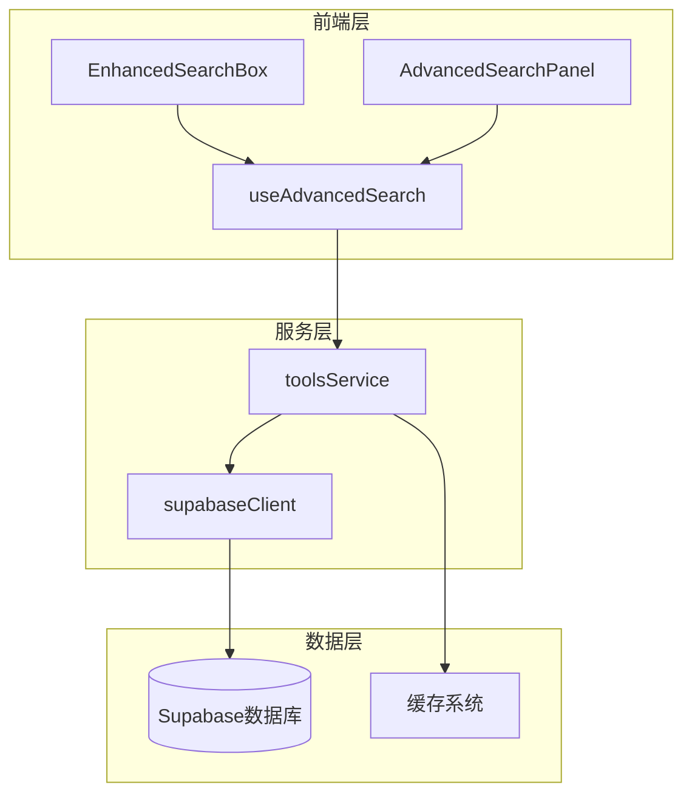
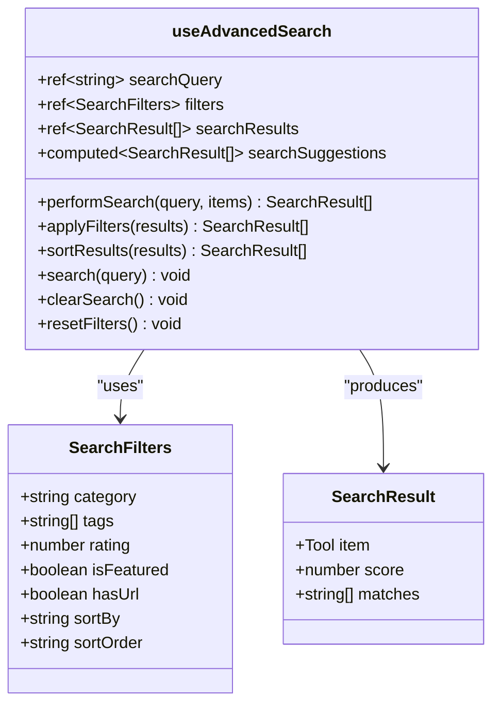
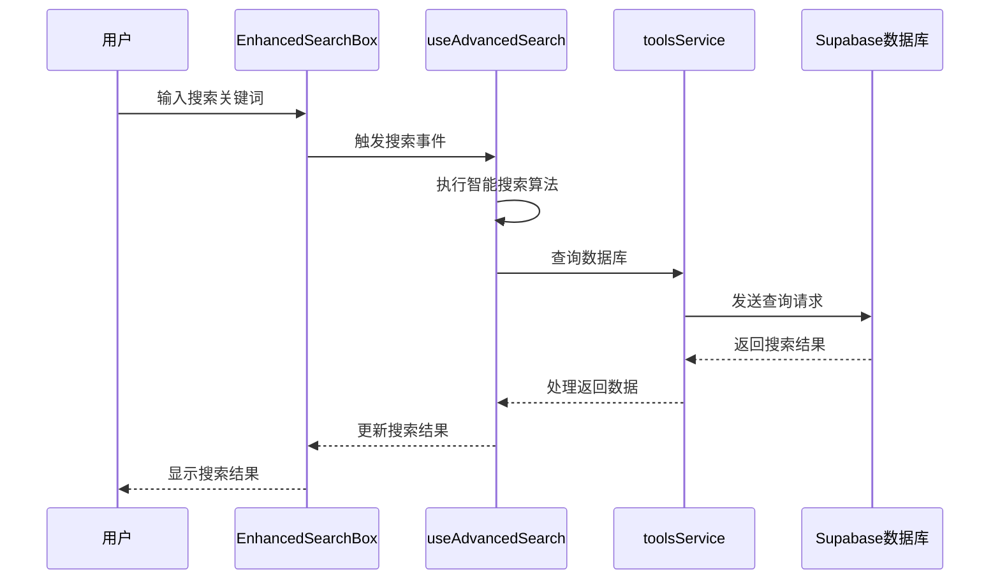
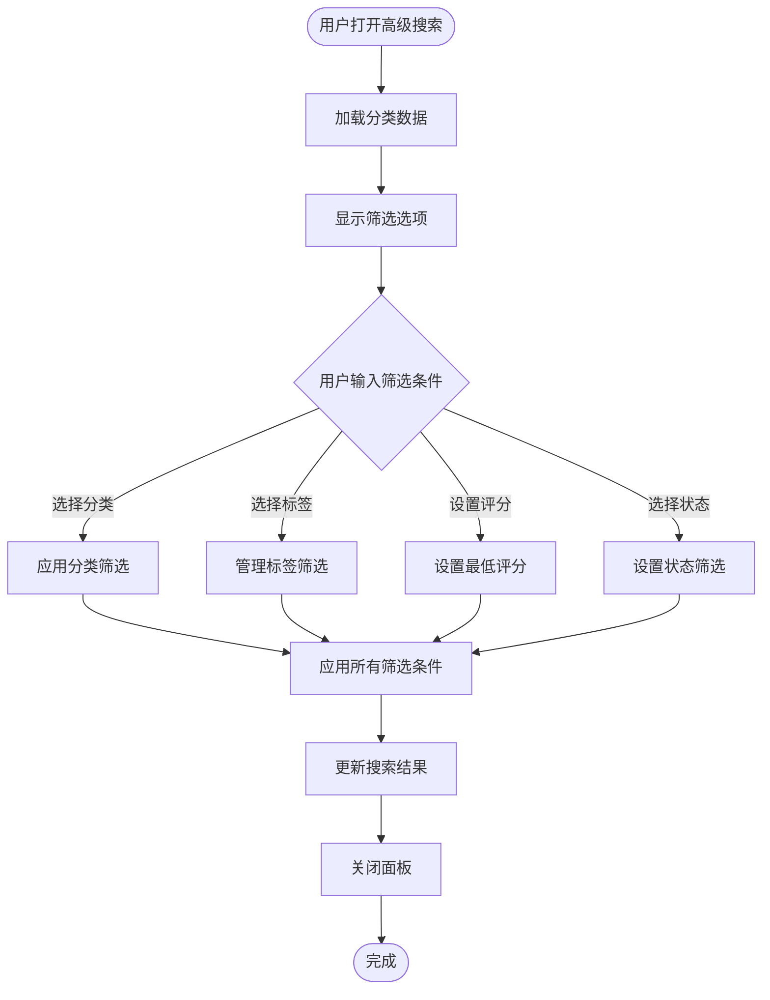
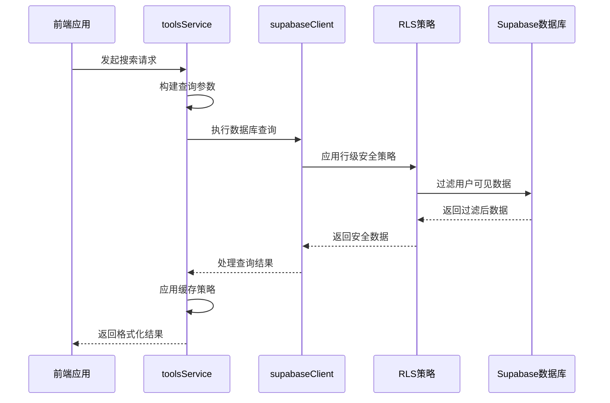

# 搜索与筛选功能技术实现详解

<cite>
**本文档引用的文件**
- [useAdvancedSearch.ts](file://src/composables/useAdvancedSearch.ts)
- [AdvancedSearchPanel.vue](file://src/components/search/AdvancedSearchPanel.vue)
- [EnhancedSearchBox.vue](file://src/components/search/EnhancedSearchBox.vue)
- [toolsService.ts](file://src/services/toolsService.ts)
- [supabaseClient.ts](file://src/lib/supabaseClient.ts)
- [tools.ts](file://src/stores/tools.ts)
</cite>

## 目录
1. [概述](#概述)
2. [架构设计](#架构设计)
3. [核心组件分析](#核心组件分析)
4. [搜索算法实现](#搜索算法实现)
5. [前后端数据流](#前后端数据流)
6. [性能优化策略](#性能优化策略)
7. [扩展指南](#扩展指南)
8. [故障排除](#故障排除)
9. [总结](#总结)

## 概述

本项目实现了完整的搜索与筛选功能，包含前端智能搜索界面和后端数据库查询服务。系统采用Vue 3 Composition API设计，支持实时搜索、多维筛选、智能建议和性能优化等特性。

### 主要功能特性

- **智能搜索算法**：支持关键词匹配、模糊搜索和相关性排序
- **多维筛选**：分类、标签、评分、特色工具等多种筛选条件
- **实时建议**：搜索过程中提供智能建议和历史记录
- **性能优化**：防抖处理、缓存机制和懒加载
- **响应式设计**：适配桌面和移动设备的搜索界面

## 架构设计

系统采用分层架构设计，从前端到后端形成完整的数据处理链路：



**图表来源**
- [EnhancedSearchBox.vue](file://src/components/search/EnhancedSearchBox.vue#L1-L50)
- [AdvancedSearchPanel.vue](file://src/components/search/AdvancedSearchPanel.vue#L1-L50)
- [useAdvancedSearch.ts](file://src/composables/useAdvancedSearch.ts#L1-L50)
- [toolsService.ts](file://src/services/toolsService.ts#L1-L50)

## 核心组件分析

### useAdvancedSearch组合式API

`useAdvancedSearch`是整个搜索功能的核心，提供了完整的搜索状态管理和业务逻辑：

```typescript
export interface SearchFilters {
  category: string;
  tags: string[];
  rating: number;
  isFeatured: boolean;
  hasUrl: boolean;
  sortBy: "name" | "rating" | "clicks" | "created_at";
  sortOrder: "asc" | "desc";
}
```

#### 关键功能模块

1. **搜索查询管理**
   - 实时搜索查询跟踪
   - 搜索历史记录维护
   - 搜索建议生成

2. **智能搜索算法**
   - 多字段权重匹配
   - 模糊匹配支持
   - 相关性评分计算

3. **筛选器应用**
   - 多维筛选条件处理
   - 筛选结果过滤
   - 排序规则应用



**图表来源**
- [useAdvancedSearch.ts](file://src/composables/useAdvancedSearch.ts#L6-L15)
- [useAdvancedSearch.ts](file://src/composables/useAdvancedSearch.ts#L17-L30)

**章节来源**
- [useAdvancedSearch.ts](file://src/composables/useAdvancedSearch.ts#L1-L306)

### EnhancedSearchBox组件

`EnhancedSearchBox`是主要的搜索界面组件，提供丰富的用户交互体验：

#### 组件特性

1. **智能输入处理**
   - 实时输入监听
   - 防抖处理防止频繁搜索
   - 输入验证和格式化

2. **搜索建议系统**
   - 实时搜索建议
   - 历史搜索记录
   - 热门搜索推荐

3. **高级搜索面板**
   - 可折叠的高级筛选
   - 多维筛选选项
   - 实时预览效果



**图表来源**
- [EnhancedSearchBox.vue](file://src/components/search/EnhancedSearchBox.vue#L1-L100)
- [useAdvancedSearch.ts](file://src/composables/useAdvancedSearch.ts#L30-L80)
- [toolsService.ts](file://src/services/toolsService.ts#L30-L80)

**章节来源**
- [EnhancedSearchBox.vue](file://src/components/search/EnhancedSearchBox.vue#L1-L200)

### AdvancedSearchPanel组件

`AdvancedSearchPanel`提供高级筛选功能，增强用户的搜索控制能力：

#### 筛选功能模块

1. **分类筛选**
   - 下拉菜单选择
   - 层级分类支持
   - 动态分类加载

2. **标签筛选**
   - 热门标签推荐
   - 自定义标签添加
   - 标签组合筛选

3. **评分和状态筛选**
   - 星级评分选择
   - 特色工具筛选
   - 可访问性筛选



**图表来源**
- [AdvancedSearchPanel.vue](file://src/components/search/AdvancedSearchPanel.vue#L50-L150)

**章节来源**
- [AdvancedSearchPanel.vue](file://src/components/search/AdvancedSearchPanel.vue#L1-L200)

## 搜索算法实现

### 智能搜索算法

系统实现了基于权重的相关性搜索算法：

```typescript
const performSearch = (query: string, items: Tool[]): SearchResult[] => {
  const searchTerms = query.toLowerCase().split(/\s+/).filter((term) => term.length > 0);
  const results: SearchResult[] = [];

  items.forEach((item) => {
    let score = 0;
    const matches: string[] = [];

    // 搜索字段权重
    const searchFields = [
      { field: "name", weight: 10 },
      { field: "description", weight: 5 },
      { field: "tags", weight: 3 },
      { field: "categories.name", weight: 2 },
    ];

    searchTerms.forEach((term) => {
      searchFields.forEach(({ field, weight }) => {
        const value = getNestedValue(item, field);
        if (value && searchInField(value, term)) {
          score += weight;
          if (!matches.includes(field)) {
            matches.push(field);
          }
        }
      });

      // 模糊匹配
      const itemName = item.name as string | undefined;
      if (fuzzyMatch(itemName?.toLowerCase() || "", term)) {
        score += 2;
      }
    });

    // 特色工具加分
    if (item.is_featured) {
      score += 1;
    }

    if (score > 0) {
      results.push({ item, score, matches });
    }
  });

  return results.sort((a, b) => b.score - a.score);
};
```

### 模糊匹配算法

系统实现了高效的模糊匹配算法：

```typescript
const fuzzyMatch = (text: string, pattern: string): boolean => {
  const patternLength = pattern.length;
  const textLength = text.length;

  if (patternLength > textLength) return false;
  if (patternLength === textLength) return pattern === text;

  let patternIndex = 0;
  for (let textIndex = 0; textIndex < textLength && patternIndex < patternLength; textIndex++) {
    if (text[textIndex] === pattern[patternIndex]) {
      patternIndex++;
    }
  }

  return patternIndex === patternLength;
};
```

**章节来源**
- [useAdvancedSearch.ts](file://src/composables/useAdvancedSearch.ts#L30-L80)
- [useAdvancedSearch.ts](file://src/composables/useAdvancedSearch.ts#L250-L306)

## 前后端数据流

### 后端查询服务

`toolsService`负责处理前端搜索请求并与Supabase数据库交互：

```typescript
static async getTools(filters?: SearchFilters): Promise<SearchResult<Tool>> {
  // 生成缓存键
  const cacheKey = `tools_${JSON.stringify(filters || {})}`;

  // 使用缓存装饰器
  return withCache(
    this._getToolsFromAPI.bind(this),
    () => cacheKey,
    apiCache,
    2 * 60 * 1000, // 2分钟缓存
  )(filters);
}

private static async _getToolsFromAPI(filters?: SearchFilters): Promise<SearchResult<Tool>> {
  try {
    let query = supabase
      .from(TABLES.TOOLS)
      .select(`
        *,
        categories(*)
      `)
      .eq("status", TOOL_STATUS.ACTIVE);

    // 应用搜索过滤器
    if (filters?.query) {
      query = query.or(
        `name.ilike.%${filters.query}%,description.ilike.%${filters.query}%`,
      );
    }

    if (filters?.category && filters.category !== "all") {
      query = query.eq("category_id", filters.category);
    }

    // 排序
    const sortBy = filters?.sortBy || "sort_order";
    const sortOrder = filters?.sortOrder || "asc";
    query = query.order(sortBy, { ascending: sortOrder === "asc" });

    // 分页
    const page = filters?.page || 1;
    const limit = filters?.limit || 20;
    const offset = (page - 1) * limit;
    query = query.range(offset, offset + limit - 1);

    const { data, error, count } = await query;

    if (error) {
      throw new Error(handleSupabaseError(error));
    }

    // 转换数据格式
    const tools: Tool[] = (data || []).map(this.transformToolRow);

    return {
      items: tools,
      total: count || 0,
      page,
      limit,
      hasMore: (count || 0) > offset + limit,
    };
  } catch (error) {
    console.error("获取工具列表失败:", error);
    console.log("Supabase调用失败，使用模拟工具数据");

    // 返回模拟数据作为回退
    return this.getMockTools(filters);
  }
}
```

### 数据库查询优化

系统通过以下策略优化数据库查询：

1. **RLS策略安全访问**
   - Row Level Security确保数据安全
   - 基于用户权限的数据访问控制
   - 自动权限验证和过滤

2. **索引优化**
   - 在常用查询字段上建立索引
   - 复合索引提高复杂查询性能
   - 分区表优化大数据量场景

3. **查询缓存**
   - Redis缓存热点查询结果
   - 缓存失效策略
   - 缓存穿透防护



**图表来源**
- [toolsService.ts](file://src/services/toolsService.ts#L30-L80)
- [supabaseClient.ts](file://src/lib/supabaseClient.ts#L1-L50)

**章节来源**
- [toolsService.ts](file://src/services/toolsService.ts#L1-L100)
- [supabaseClient.ts](file://src/lib/supabaseClient.ts#L1-L100)

## 性能优化策略

### 防抖处理

系统在搜索输入中实现了防抖处理，减少不必要的API调用：

```typescript
// 防抖处理示例
const debouncedSearch = debounce((query: string) => {
  search(query);
}, 300);

// 在输入事件中使用
watch(searchQuery, (newQuery) => {
  debouncedSearch(newQuery);
});
```

### 缓存机制

系统实现了多层次的缓存策略：

1. **内存缓存**
   - API响应缓存
   - 配置数据缓存
   - 计算结果缓存

2. **持久化缓存**
   - IndexedDB存储
   - 浏览器本地存储
   - CDN缓存

3. **分布式缓存**
   - Redis集群缓存
   - 多级缓存一致性
   - 缓存预热策略

### 懒加载优化

```typescript
// 懒加载组件示例
const LazySearchPanel = defineAsyncComponent(() => 
  import('@/components/search/AdvancedSearchPanel.vue')
);

// 在模板中使用
<template>
  <Suspense>
    <template #default>
      <LazySearchPanel v-if="showAdvanced" />
    </template>
    <template #fallback>
      <div class="loading-spinner">加载中...</div>
    </template>
  </Suspense>
</template>
```

### 性能监控

系统集成了性能监控工具：

```typescript
// 性能指标收集
const measurePerformance = () => {
  const perfObserver = new PerformanceObserver((list) => {
    list.getEntries().forEach((entry) => {
      console.log(`${entry.name}: ${entry.duration}ms`);
    });
  });
  
  perfObserver.observe({ entryTypes: ['measure', 'navigation'] });
};
```

## 扩展指南

### 添加新的筛选维度

要扩展新的筛选维度，需要修改以下几个部分：

1. **更新SearchFilters接口**
```typescript
export interface SearchFilters {
  category: string;
  tags: string[];
  rating: number;
  isFeatured: boolean;
  hasUrl: boolean;
  sortBy: "name" | "rating" | "clicks" | "created_at";
  sortOrder: "asc" | "desc";
  // 新增筛选维度
  priceRange?: { min: number; max: number };
  availability?: boolean;
  brand?: string[];
}
```

2. **更新useAdvancedSearch中的applyFilters方法**
```typescript
const applyFilters = (results: SearchResult[]): SearchResult[] => {
  return results.filter(({ item }) => {
    // 现有筛选逻辑...
    
    // 新增筛选条件
    if (filters.value.priceRange) {
      const { min, max } = filters.value.priceRange;
      if (item.price < min || item.price > max) {
        return false;
      }
    }
    
    if (filters.value.availability !== undefined) {
      if (item.inStock !== filters.value.availability) {
        return false;
      }
    }
    
    return true;
  });
};
```

3. **更新AdvancedSearchPanel组件**
```vue
<!-- 在模板中添加新的筛选选项 -->
<div class="filter-group">
  <label class="filter-label">价格范围</label>
  <div class="price-range">
    <input v-model.number="localFilters.priceMin" type="number" placeholder="最低价" />
    <span>-</span>
    <input v-model.number="localFilters.priceMax" type="number" placeholder="最高价" />
  </div>
</div>
```

### 集成新的搜索服务

如果需要集成新的搜索服务，可以创建专门的服务类：

```typescript
export class CustomSearchService {
  static async search(query: string, filters: SearchFilters): Promise<SearchResult<Tool>> {
    try {
      // 调用外部搜索API
      const response = await fetch('/api/custom-search', {
        method: 'POST',
        headers: { 'Content-Type': 'application/json' },
        body: JSON.stringify({ query, filters })
      });
      
      const data = await response.json();
      return this.transformResponse(data);
    } catch (error) {
      console.error('Custom search failed:', error);
      throw error;
    }
  }
  
  private static transformResponse(data: any): SearchResult<Tool> {
    // 转换响应数据格式
    return {
      items: data.results.map(this.transformTool),
      total: data.total,
      page: data.page,
      limit: data.limit,
      hasMore: data.hasMore
    };
  }
}
```

## 故障排除

### 常见配置错误

1. **Supabase连接配置错误**
```typescript
// 错误配置
const supabase = createClient(
  'https://wrong-url.supabase.co',
  'wrong-anon-key'
);

// 正确配置
const supabase = createClient(
  process.env.VUE_APP_SUPABASE_URL,
  process.env.VUE_APP_SUPABASE_ANON_KEY
);
```

2. **RLS策略配置错误**
```sql
-- 错误的RLS策略
create policy "Enable read access for all users"
on tools
for select
using (true);

-- 正确的RLS策略
create policy "Enable read access for authenticated users"
on tools
for select
using (auth.role() = 'authenticated');
```

3. **缓存配置问题**
```typescript
// 错误的缓存配置
const cache = new Map(); // 不支持过期时间

// 正确的缓存配置
const cache = new LRUCache({
  max: 100,
  ttl: 5 * 60 * 1000 // 5分钟过期
});
```

### 性能问题诊断

1. **搜索响应缓慢**
   - 检查数据库索引是否正确
   - 验证RLS策略是否影响性能
   - 分析查询计划和执行时间

2. **内存泄漏问题**
   - 检查事件监听器是否正确移除
   - 验证定时器是否及时清理
   - 监控组件生命周期钩子

3. **缓存失效问题**
   - 检查缓存键生成逻辑
   - 验证缓存过期策略
   - 监控缓存命中率

### 调试工具和技巧

```typescript
// 启用调试模式
const enableDebugMode = () => {
  if (process.env.NODE_ENV === 'development') {
    window.__SEARCH_DEBUG__ = true;
  }
};

// 性能分析工具
const profileSearch = (query: string) => {
  const startTime = performance.now();
  
  // 执行搜索逻辑
  const results = performSearch(query, tools);
  
  const endTime = performance.now();
  console.log(`搜索耗时: ${endTime - startTime}ms`);
  
  return results;
};
```

## 总结

本项目实现了一个完整且高性能的搜索与筛选系统，具有以下特点：

### 技术亮点

1. **智能搜索算法**：基于权重的相关性搜索，支持模糊匹配和多字段检索
2. **灵活的筛选系统**：支持多维筛选条件，提供直观的用户界面
3. **性能优化**：防抖处理、缓存机制和懒加载优化用户体验
4. **安全可靠**：RLS策略确保数据安全，完善的错误处理机制

### 最佳实践

1. **组件设计**：采用组合式API和响应式设计，提高代码复用性和可维护性
2. **数据流管理**：清晰的前后端数据流，合理的状态管理
3. **性能考虑**：多层次缓存策略，优化数据库查询性能
4. **用户体验**：实时反馈、智能建议和友好的错误提示

### 扩展建议

1. **搜索增强**：可以集成自然语言处理技术，提供语义搜索功能
2. **个性化推荐**：基于用户行为数据的个性化搜索结果排序
3. **多语言支持**：国际化搜索功能，支持多语言文本处理
4. **移动端优化**：针对移动设备的搜索界面优化和触摸交互

通过本文档的详细分析，开发者可以深入理解系统的实现原理，并根据具体需求进行功能扩展和性能优化。