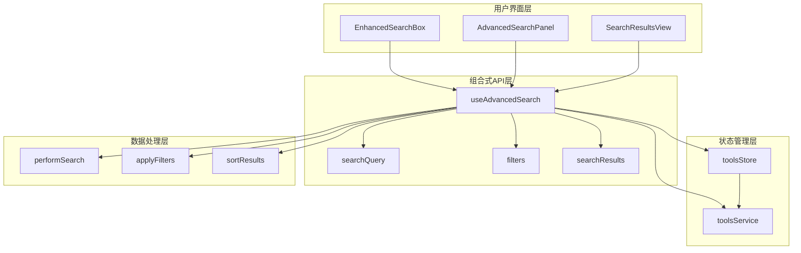
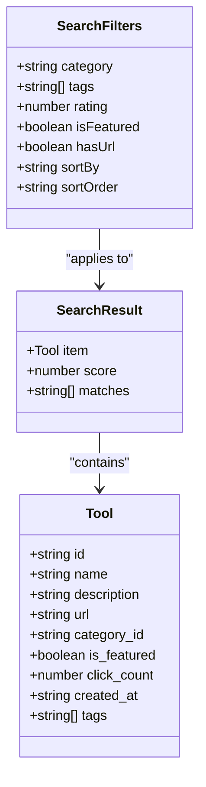
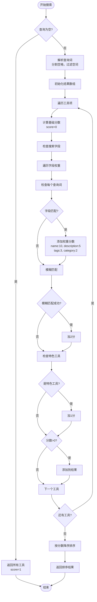
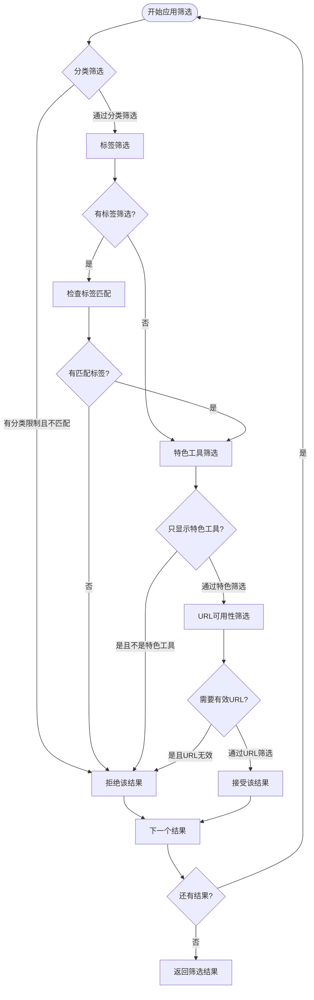
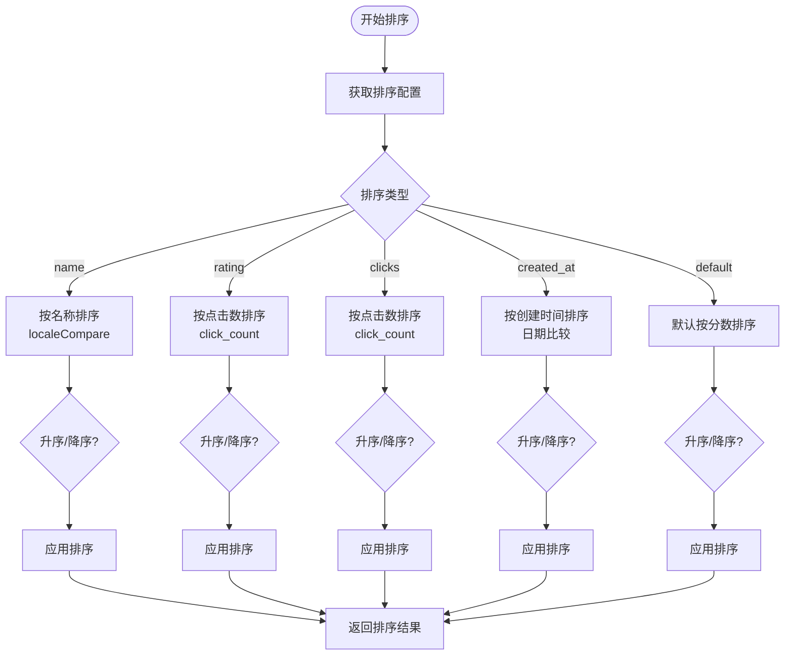
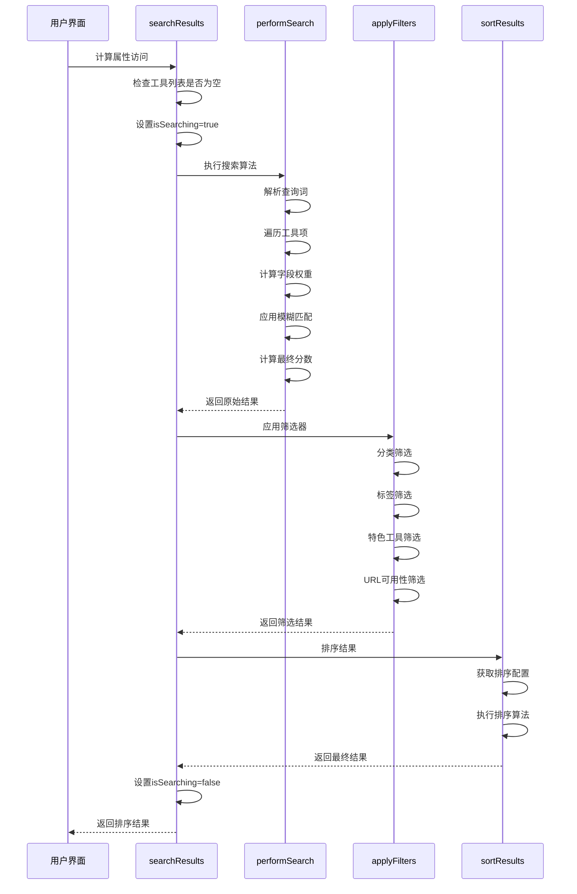
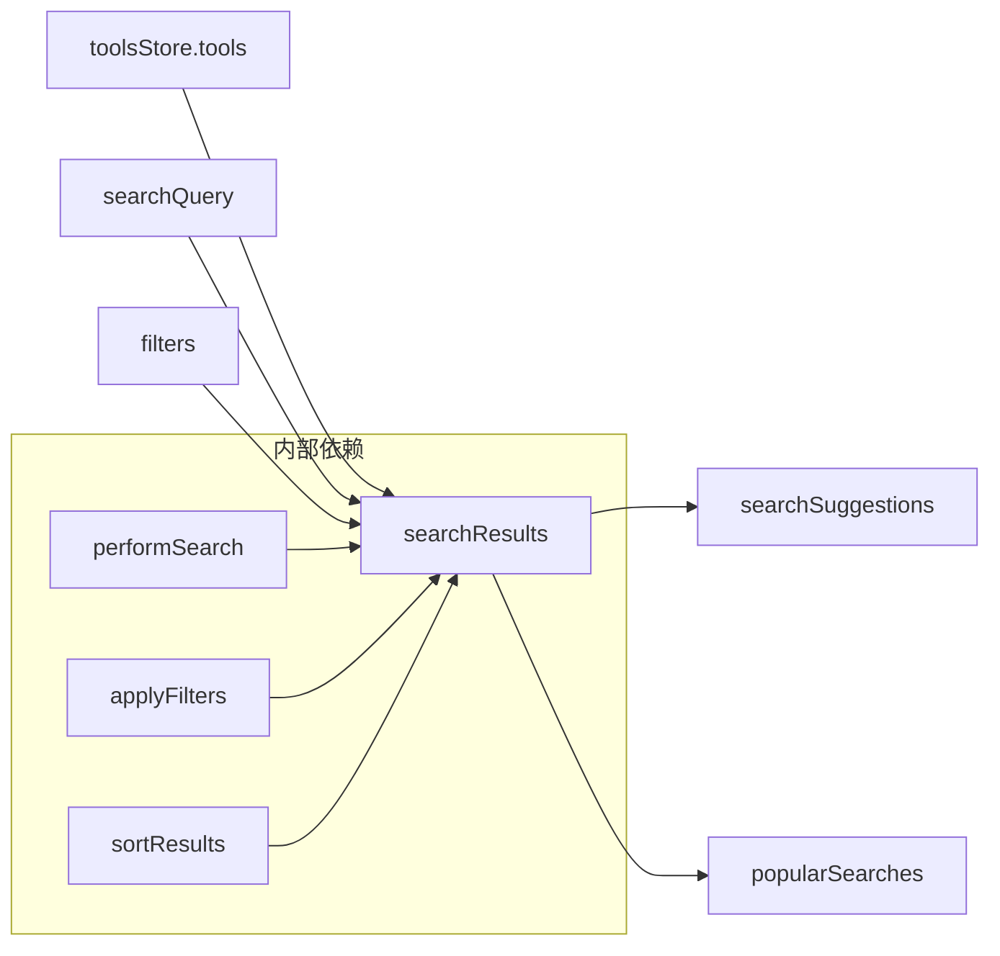
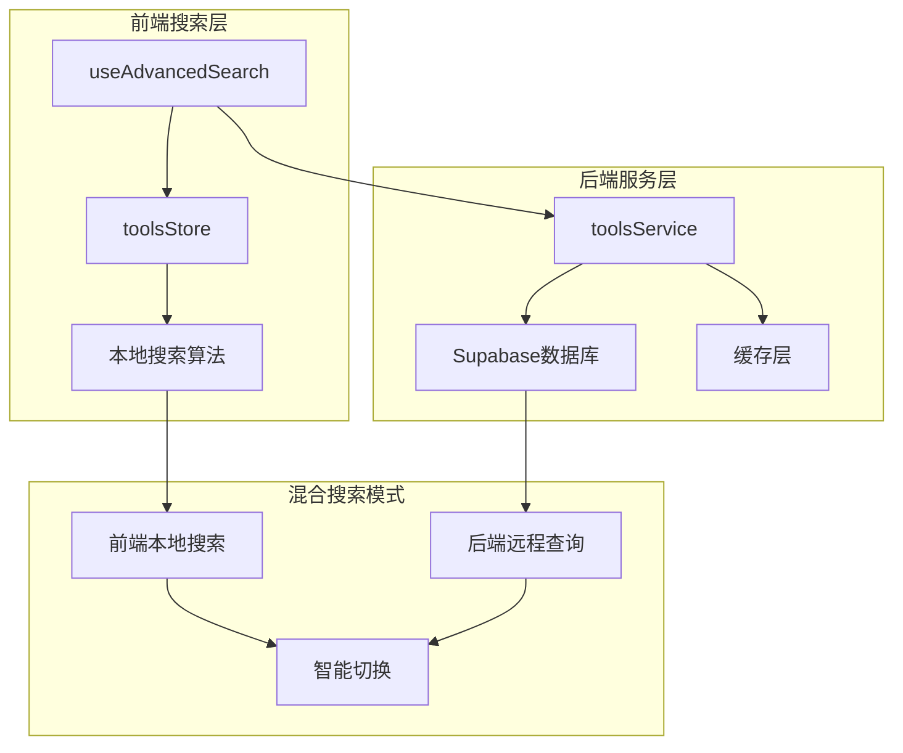

# 搜索与筛选逻辑深度解析

<cite>
**本文档引用的文件**
- [useAdvancedSearch.ts](file://src/composables/useAdvancedSearch.ts)
- [tools.ts](file://src/stores/tools.ts)
- [toolsService.ts](file://src/services/toolsService.ts)
- [AdvancedSearchPanel.vue](file://src/components/search/AdvancedSearchPanel.vue)
- [EnhancedSearchBox.vue](file://src/components/search/EnhancedSearchBox.vue)
- [SearchResultsView.vue](file://src/views/SearchResultsView.vue)
- [services.test.ts](file://src/tests/integration/services.test.ts)
</cite>

## 目录
1. [简介](#简介)
2. [核心架构概览](#核心架构概览)
3. [响应式状态管理](#响应式状态管理)
4. [智能搜索算法](#智能搜索算法)
5. [筛选器系统](#筛选器系统)
6. [结果排序机制](#结果排序机制)
7. [计算属性链](#计算属性链)
8. [前端本地搜索与后端查询协同](#前端本地搜索与后端查询协同)
9. [扩展新筛选维度](#扩展新筛选维度)
10. [常见错误排查](#常见错误排查)
11. [总结](#总结)

## 简介

useAdvancedSearch组合式API是本项目搜索与筛选功能的核心引擎，它实现了复杂的多字段加权匹配算法、灵活的筛选器系统和高效的排序机制。该组合式API通过响应式状态管理，为用户提供实时的搜索体验，同时支持前端本地搜索和潜在的后端查询协同工作。

## 核心架构概览



**图表来源**
- [useAdvancedSearch.ts](file://src/composables/useAdvancedSearch.ts#L1-L306)
- [EnhancedSearchBox.vue](file://src/components/search/EnhancedSearchBox.vue#L1-L337)
- [AdvancedSearchPanel.vue](file://src/components/search/AdvancedSearchPanel.vue#L1-L415)

## 响应式状态管理

### 核心状态定义

useAdvancedSearch组合式API定义了多个响应式状态来管理搜索流程：

```typescript
// 搜索查询状态
const searchQuery = ref("");

// 筛选器状态
const filters = ref<SearchFilters>({
  category: "",
  tags: [],
  rating: 0,
  isFeatured: false,
  hasUrl: false,
  sortBy: "name",
  sortOrder: "asc",
});

// 搜索历史状态
const searchHistory = ref<string[]>([]);

// 搜索状态
const isSearching = ref(false);
```

### SearchFilters接口结构



**图表来源**
- [useAdvancedSearch.ts](file://src/composables/useAdvancedSearch.ts#L5-L15)
- [tools.ts](file://src/stores/tools.ts#L15-L45)

**章节来源**
- [useAdvancedSearch.ts](file://src/composables/useAdvancedSearch.ts#L17-L35)

## 智能搜索算法

### performSearch函数实现

performSearch函数是搜索算法的核心，实现了多字段加权匹配和模糊匹配机制：



**图表来源**
- [useAdvancedSearch.ts](file://src/composables/useAdvancedSearch.ts#L37-L75)

### 字段权重分配策略

搜索算法采用以下字段权重分配策略：

1. **名称字段 (weight: 10)**：工具名称是最重要的匹配字段
2. **描述字段 (weight: 5)**：工具描述提供额外的上下文信息
3. **标签字段 (weight: 3)**：标签有助于细粒度匹配
4. **分类名称 (weight: 2)**：分类名称提供层次化匹配

### 模糊匹配机制

模糊匹配算法实现了字符序列匹配：

```typescript
const fuzzyMatch = (text: string, pattern: string): boolean => {
  const patternLength = pattern.length;
  const textLength = text.length;

  if (patternLength > textLength) return false;
  if (patternLength === textLength) return pattern === text;

  let patternIndex = 0;
  for (let textIndex = 0; textIndex < textLength && patternIndex < patternLength; textIndex++) {
    if (text[textIndex] === pattern[patternIndex]) {
      patternIndex++;
    }
  }

  return patternIndex === patternLength;
};
```

**章节来源**
- [useAdvancedSearch.ts](file://src/composables/useAdvancedSearch.ts#L37-L75)
- [useAdvancedSearch.ts](file://src/composables/useAdvancedSearch.ts#L275-L290)

## 筛选器系统

### applyFilters函数逻辑

applyFilters函数实现了多维度筛选逻辑：



**图表来源**
- [useAdvancedSearch.ts](file://src/composables/useAdvancedSearch.ts#L77-L105)

### 筛选器类型详解

1. **分类筛选**：根据工具所属分类进行过滤
2. **标签筛选**：支持多标签交集匹配
3. **特色工具筛选**：仅显示标记为特色工具的结果
4. **URL可用性筛选**：确保工具具有有效的访问链接

**章节来源**
- [useAdvancedSearch.ts](file://src/composables/useAdvancedSearch.ts#L77-L105)

## 结果排序机制

### sortResults函数实现

sortResults函数支持多种排序方式：



**图表来源**
- [useAdvancedSearch.ts](file://src/composables/useAdvancedSearch.ts#L107-L135)

### 排序优先级

1. **名称排序**：使用localeCompare进行字符串比较
2. **点击数排序**：基于工具的使用频率
3. **创建时间排序**：按工具发布时间排序
4. **默认排序**：按搜索相关性分数排序

**章节来源**
- [useAdvancedSearch.ts](file://src/composables/useAdvancedSearch.ts#L107-L135)

## 计算属性链

### searchResults计算属性

searchResults是整个搜索流程的核心计算属性，它串联了搜索、过滤和排序三个阶段：



**图表来源**
- [useAdvancedSearch.ts](file://src/composables/useAdvancedSearch.ts#L137-L147)

### 计算属性依赖关系



**图表来源**
- [useAdvancedSearch.ts](file://src/composables/useAdvancedSearch.ts#L137-L147)

**章节来源**
- [useAdvancedSearch.ts](file://src/composables/useAdvancedSearch.ts#L137-L147)

## 前端本地搜索与后端查询协同

### 数据流架构



**图表来源**
- [useAdvancedSearch.ts](file://src/composables/useAdvancedSearch.ts#L1-L306)
- [toolsService.ts](file://src/services/toolsService.ts#L1-L642)

### 协同工作机制

1. **前端本地搜索**：当数据量较小时，直接在前端进行搜索和筛选
2. **后端远程查询**：当数据量较大或需要复杂查询时，调用后端服务
3. **智能切换**：根据数据规模和查询复杂度自动选择最优方案

### 缓存策略

toolsService实现了智能缓存机制：

```typescript
// 缓存装饰器
return withCache(
  this._getToolsFromAPI.bind(this),
  () => cacheKey,
  apiCache,
  2 * 60 * 1000, // 2分钟缓存
)(filters);
```

**章节来源**
- [toolsService.ts](file://src/services/toolsService.ts#L40-L50)

## 扩展新筛选维度

### 实际代码修改示例

要扩展新的筛选维度（如新增评分范围），需要修改以下几个部分：

#### 1. 更新SearchFilters接口

```typescript
export interface SearchFilters {
  category: string;
  tags: string[];
  rating: number;
  ratingRange: { min: number; max: number }; // 新增评分范围
  isFeatured: boolean;
  hasUrl: boolean;
  sortBy: "name" | "rating" | "clicks" | "created_at";
  sortOrder: "asc" | "desc";
}
```

#### 2. 修改applyFilters函数

```typescript
const applyFilters = (results: SearchResult[]): SearchResult[] => {
  return results.filter(({ item }) => {
    // ... 现有筛选逻辑
    
    // 新增评分范围筛选
    if (filters.value.ratingRange) {
      const { min, max } = filters.value.ratingRange;
      const itemRating = item.rating || 0;
      if (itemRating < min || itemRating > max) {
        return false;
      }
    }
    
    return true;
  });
};
```

#### 3. 更新排序逻辑

```typescript
const sortResults = (results: SearchResult[]): SearchResult[] => {
  return results.sort((a, b) => {
    const { sortBy, sortOrder } = filters.value;
    let comparison = 0;

    switch (sortBy) {
      case "rating":
        // 使用评分字段进行排序
        comparison = (a.item.rating || 0) - (b.item.rating || 0);
        break;
      // ... 其他排序逻辑
    }
    
    return sortOrder === "desc" ? -comparison : comparison;
  });
};
```

#### 4. 更新UI组件

```vue
<!-- AdvancedSearchPanel.vue -->
<div class="filter-group">
  <label class="filter-label">评分范围</label>
  <div class="range-inputs">
    <input 
      v-model.number="localFilters.ratingRange.min" 
      type="number" 
      placeholder="最低评分"
    />
    <span>-</span>
    <input 
      v-model.number="localFilters.ratingRange.max" 
      type="number" 
      placeholder="最高评分"
    />
  </div>
</div>
```

## 常见错误排查

### 1. 状态未正确重置

**问题症状**：筛选后结果不正确，或者搜索历史残留

**排查步骤**：
```typescript
// 检查resetFilters函数是否被正确调用
const resetFilters = () => {
  filters.value = {
    category: "",
    tags: [],
    rating: 0,
    isFeatured: false,
    hasUrl: false,
    sortBy: "name",
    sortOrder: "asc",
  };
};

// 确保在适当的地方调用
// 例如：AdvancedSearchPanel.vue中的重置按钮
<button @click="resetFilters">重置筛选</button>
```

**解决方案**：确保在组件卸载或需要重置时调用resetFilters函数

### 2. 计算属性依赖遗漏

**问题症状**：搜索结果不随查询变化而更新

**排查步骤**：
```typescript
// 检查searchResults是否正确依赖所有相关状态
const searchResults = computed(() => {
  if (!toolsStore.tools.length) return [];
  
  isSearching.value = true;
  try {
    let results = performSearch(searchQuery.value, toolsStore.tools);
    results = applyFilters(results);
    results = sortResults(results);
    return results;
  } finally {
    isSearching.value = false;
  }
});
```

**解决方案**：确保计算属性依赖了所有影响结果的状态变量

### 3. 模糊匹配性能问题

**问题症状**：大量数据时搜索响应缓慢

**排查步骤**：
```typescript
// 检查模糊匹配算法的复杂度
const fuzzyMatch = (text: string, pattern: string): boolean => {
  // 当前实现的时间复杂度为O(n*m)
  // 对于大数据集可能成为性能瓶颈
};
```

**解决方案**：
1. 实现字符串索引预处理
2. 使用正则表达式优化匹配
3. 添加搜索延迟防抖

### 4. 字段访问错误

**问题症状**：运行时出现undefined错误

**排查步骤**：
```typescript
// 检查getNestedValue函数的安全性
const getNestedValue = (obj: Record<string, unknown>, path: string): unknown => {
  return path.split(".").reduce((current, key) => current?.[key], obj);
};

// 确保字段存在后再访问
if (item.categories?.name) {
  // 安全访问
}
```

**解决方案**：使用可选链操作符和类型守卫确保字段安全访问

### 5. 排序稳定性问题

**问题症状**：相同分数的结果顺序不一致

**排查步骤**：
```typescript
// 检查排序算法的稳定性
const sortResults = (results: SearchResult[]): SearchResult[] => {
  return results.sort((a, b) => {
    // 确保稳定排序
    if (a.score === b.score) {
      return a.item.name.localeCompare(b.item.name); // 名称作为第二排序依据
    }
    return b.score - a.score;
  });
};
```

**解决方案**：在主排序基础上添加稳定的次级排序规则

## 总结

useAdvancedSearch组合式API通过精心设计的搜索算法、灵活的筛选器系统和高效的排序机制，为用户提供了优秀的搜索体验。其核心优势包括：

1. **智能搜索算法**：多字段加权匹配和模糊匹配确保搜索结果的相关性
2. **灵活筛选系统**：支持分类、标签、特色工具等多种筛选维度
3. **高效排序机制**：支持多种排序方式，满足不同场景需求
4. **响应式状态管理**：通过Vue 3的响应式系统实现实时更新
5. **前后端协同**：智能选择前端本地搜索或后端查询模式
6. **可扩展架构**：易于添加新的筛选维度和排序选项

通过深入理解这些核心概念和实现细节，开发者可以有效地维护和扩展搜索功能，为用户提供更加智能和便捷的搜索体验。