# 前端组件集成：useAdvancedSearch组合式API与搜索组件系统

<cite>
**本文档引用的文件**
- [useAdvancedSearch.ts](file://src/composables/useAdvancedSearch.ts)
- [EnhancedSearchBox.vue](file://src/components/search/EnhancedSearchBox.vue)
- [AdvancedSearchPanel.vue](file://src/components/search/AdvancedSearchPanel.vue)
- [SearchResultsView.vue](file://src/views/SearchResultsView.vue)
- [searchService.ts](file://src/services/searchService.ts)
- [tools.ts](file://src/stores/tools.ts)
- [index.ts](file://src/types/index.ts)
- [index.ts](file://src/router/index.ts)
</cite>

## 目录
1. [简介](#简介)
2. [项目架构概览](#项目架构概览)
3. [核心组件分析](#核心组件分析)
4. [useAdvancedSearch组合式API详解](#useadvancedsearch组合式api详解)
5. [EnhancedSearchBox组件深度解析](#enhancedsearchbox组件深度解析)
6. [AdvancedSearchPanel组件分析](#advancedsearchpanel组件分析)
7. [SearchResultsView视图组件](#searchresultsview视图组件)
8. [组件间数据流与事件通信](#组件间数据流与事件通信)
9. [用户体验优化最佳实践](#用户体验优化最佳实践)
10. [性能考虑与优化](#性能考虑与优化)
11. [总结](#总结)

## 简介

本文档详细阐述了基于Vue 3 Composition API的前端搜索组件集成系统，重点分析`useAdvancedSearch`组合式API如何与多个前端组件协同工作，实现完整的搜索功能。该系统包括输入防抖处理、实时建议展示、高级筛选、结果排序等功能模块，为用户提供流畅且智能的搜索体验。

## 项目架构概览

该项目采用现代化的前端架构，基于Vue 3 Composition API构建，具有清晰的分层结构：

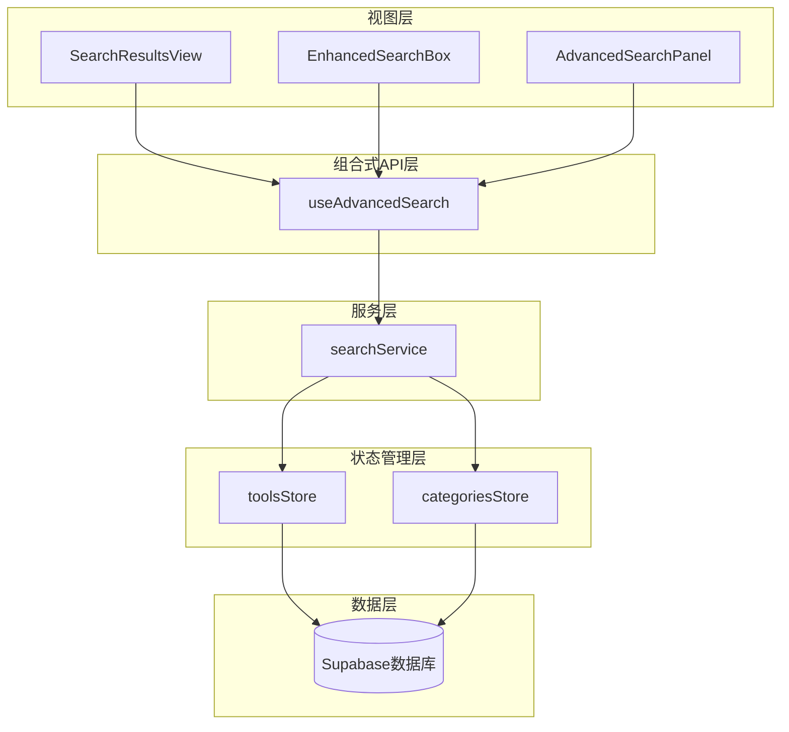

**图表来源**
- [SearchResultsView.vue](file://src/views/SearchResultsView.vue#L1-L50)
- [EnhancedSearchBox.vue](file://src/components/search/EnhancedSearchBox.vue#L1-L50)
- [useAdvancedSearch.ts](file://src/composables/useAdvancedSearch.ts#L1-L50)

## 核心组件分析

### 组件层次结构

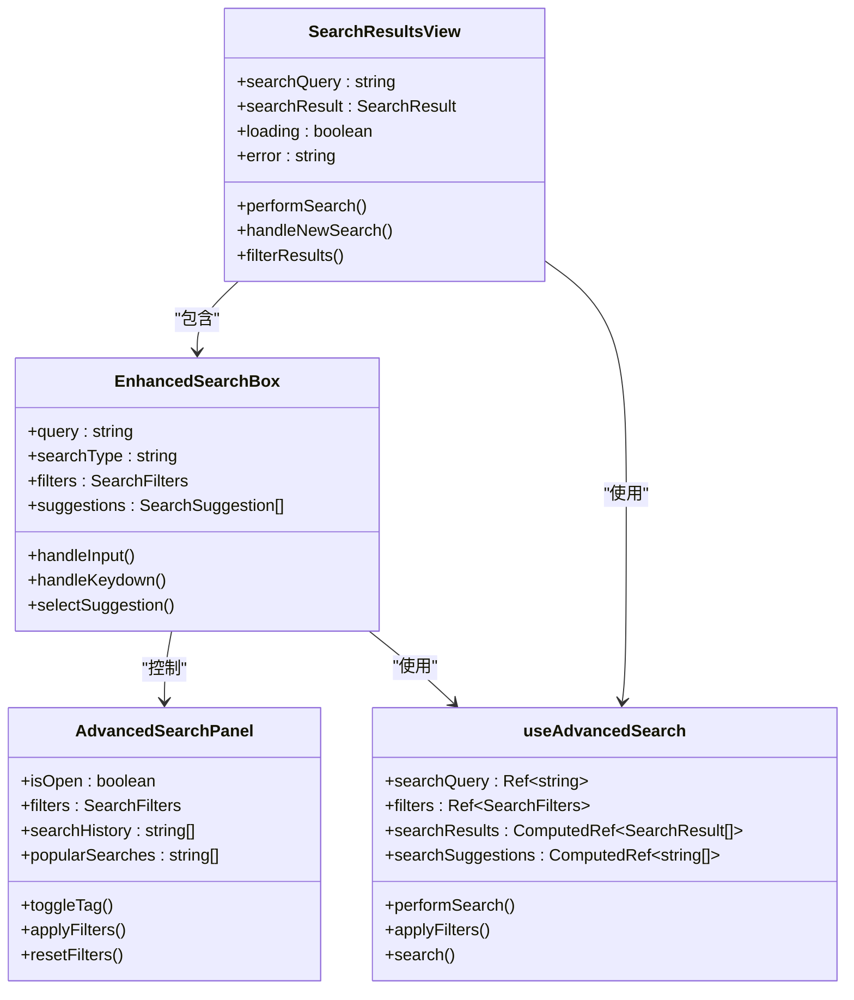

**图表来源**
- [SearchResultsView.vue](file://src/views/SearchResultsView.vue#L100-L200)
- [EnhancedSearchBox.vue](file://src/components/search/EnhancedSearchBox.vue#L150-L250)
- [AdvancedSearchPanel.vue](file://src/components/search/AdvancedSearchPanel.vue#L100-L200)
- [useAdvancedSearch.ts](file://src/composables/useAdvancedSearch.ts#L20-L100)

## useAdvancedSearch组合式API详解

`useAdvancedSearch`是整个搜索系统的核心，提供了完整的搜索状态管理和算法实现。

### 核心接口定义

```typescript
export interface SearchFilters {
  category: string;
  tags: string[];
  rating: number;
  isFeatured: boolean;
  hasUrl: boolean;
  sortBy: "name" | "rating" | "clicks" | "created_at";
  sortOrder: "asc" | "desc";
}

export interface SearchResult {
  item: Tool;
  score: number;
  matches: string[];
}
```

### 搜索算法实现

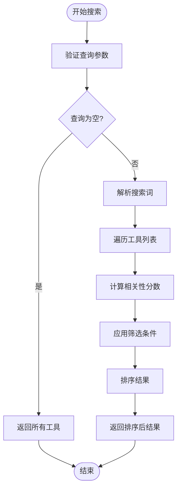

**图表来源**
- [useAdvancedSearch.ts](file://src/composables/useAdvancedSearch.ts#L30-L100)

### 智能搜索算法

系统实现了多字段加权搜索算法：

1. **字段权重分配**：
   - 名称字段：权重10
   - 描述字段：权重5  
   - 标签字段：权重3
   - 分类名称：权重2

2. **模糊匹配**：支持部分匹配和字符顺序匹配

3. **特色工具加分**：为特色工具提供额外分数

### 筛选器应用流程

```mermaid
sequenceDiagram
participant User as 用户
participant Box as EnhancedSearchBox
participant API as useAdvancedSearch
participant Store as toolsStore
User->>Box : 输入搜索词
Box->>API : 触发搜索
API->>Store : 获取工具列表
Store-->>API : 返回工具数据
API->>API : 执行搜索算法
API->>API : 应用筛选器
API->>API : 排序结果
API-->>Box : 返回搜索结果
Box-->>User : 显示结果
```

**图表来源**
- [useAdvancedSearch.ts](file://src/composables/useAdvancedSearch.ts#L100-L200)
- [EnhancedSearchBox.vue](file://src/components/search/EnhancedSearchBox.vue#L300-L400)

**章节来源**
- [useAdvancedSearch.ts](file://src/composables/useAdvancedSearch.ts#L1-L306)

## EnhancedSearchBox组件深度解析

### 输入防抖处理机制

EnhancedSearchBox组件实现了智能的输入防抖处理，避免频繁触发搜索请求：

```typescript
// 防抖函数实现
const debouncedLoadSuggestions = useDebounceFn(() => {
  loadSuggestions();
}, 300);
```

### 实时建议展示系统

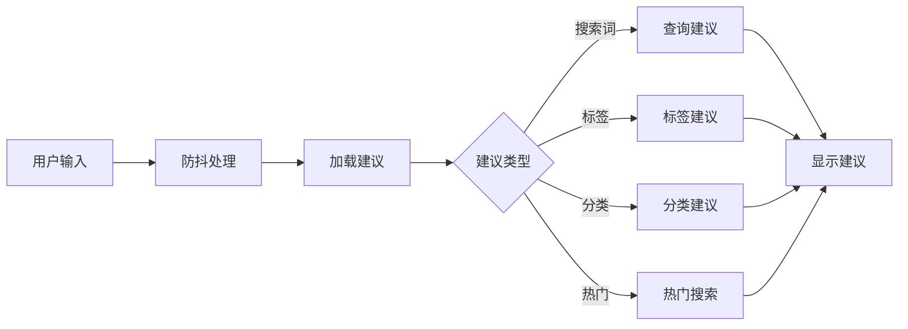

**图表来源**
- [EnhancedSearchBox.vue](file://src/components/search/EnhancedSearchBox.vue#L200-L300)

### 搜索触发机制

组件支持多种搜索触发方式：

1. **键盘导航**：使用方向键选择建议，按下Enter键确认
2. **鼠标点击**：直接点击建议项
3. **手动搜索**：输入完成后自动触发搜索
4. **快捷键支持**：ESC键关闭建议，Tab键切换焦点

### 高级搜索面板集成

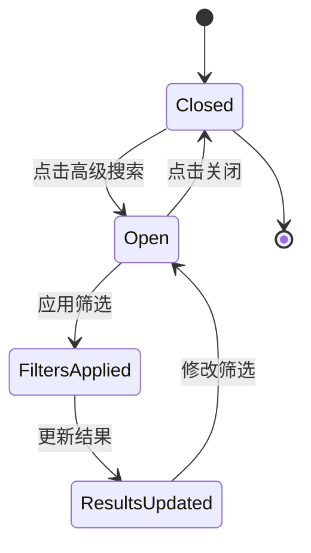

**图表来源**
- [EnhancedSearchBox.vue](file://src/components/search/EnhancedSearchBox.vue#L400-L500)

**章节来源**
- [EnhancedSearchBox.vue](file://src/components/search/EnhancedSearchBox.vue#L1-L400)

## AdvancedSearchPanel组件分析

### 筛选控件布局

AdvancedSearchPanel采用模块化的筛选控件布局：

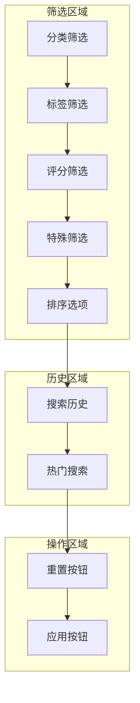

**图表来源**
- [AdvancedSearchPanel.vue](file://src/components/search/AdvancedSearchPanel.vue#L1-L100)

### 标签管理功能

组件实现了智能的标签管理系统：

1. **热门标签推荐**：根据使用频率推荐标签
2. **自定义标签输入**：支持用户添加新标签
3. **标签状态同步**：实时更新筛选状态

### 筛选器状态同步

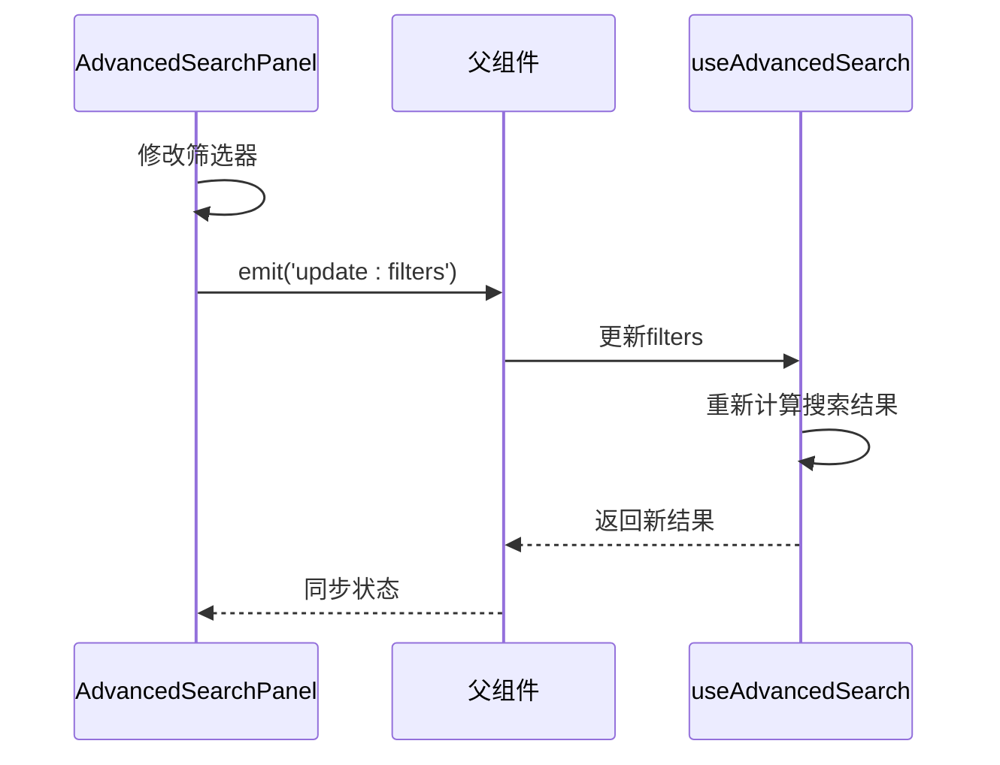

**图表来源**
- [AdvancedSearchPanel.vue](file://src/components/search/AdvancedSearchPanel.vue#L200-L300)

**章节来源**
- [AdvancedSearchPanel.vue](file://src/components/search/AdvancedSearchPanel.vue#L1-L596)

## SearchResultsView视图组件

### 搜索结果消费模式

SearchResultsView作为最终的结果展示组件，负责消费搜索服务返回的数据：

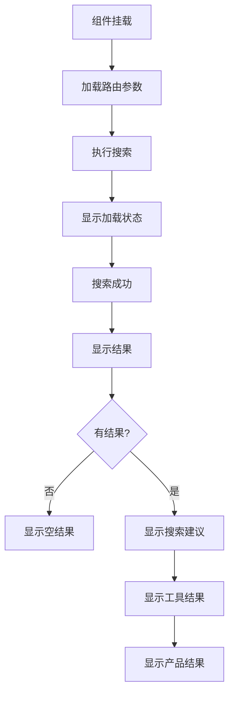

**图表来源**
- [SearchResultsView.vue](file://src/views/SearchResultsView.vue#L100-L200)

### 结果类型分类展示

组件支持多种结果类型的分类展示：

1. **工具结果**：显示工具卡片，包含图标、描述、分类信息
2. **产品结果**：显示产品卡片，包含图片、价格、评分
3. **分类结果**：显示分类列表，支持层级展示

### 搜索建议交互

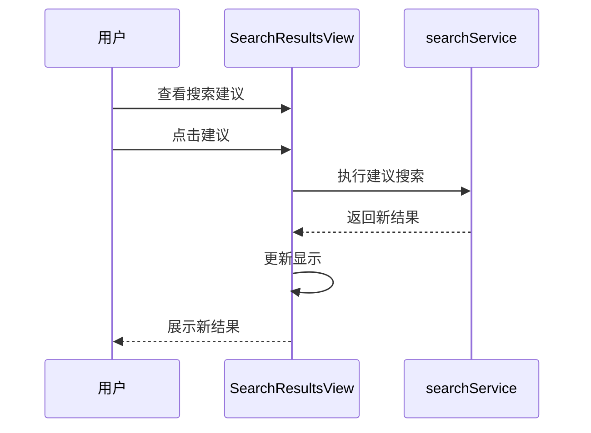

**图表来源**
- [SearchResultsView.vue](file://src/views/SearchResultsView.vue#L300-L400)

**章节来源**
- [SearchResultsView.vue](file://src/views/SearchResultsView.vue#L1-L571)

## 组件间数据流与事件通信

### 数据流向图

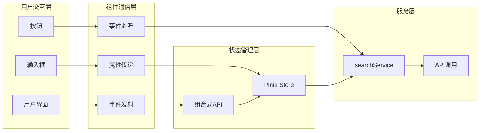

**图表来源**
- [EnhancedSearchBox.vue](file://src/components/search/EnhancedSearchBox.vue#L150-L250)
- [SearchResultsView.vue](file://src/views/SearchResultsView.vue#L50-L150)

### 事件通信模式

组件间采用标准的Vue事件通信模式：

1. **父子组件通信**：通过props传递数据，通过$emit发送事件
2. **兄弟组件通信**：通过共同的父组件进行协调
3. **跨层级通信**：通过事件总线或状态管理

### 状态同步机制

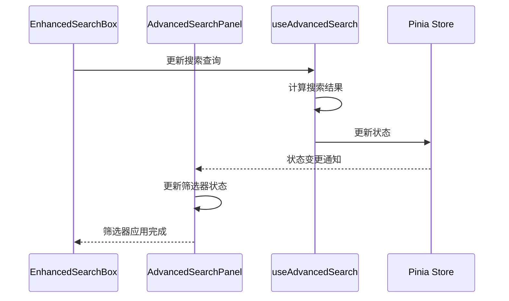

**图表来源**
- [EnhancedSearchBox.vue](file://src/components/search/EnhancedSearchBox.vue#L300-L400)
- [AdvancedSearchPanel.vue](file://src/components/search/AdvancedSearchPanel.vue#L100-L200)

## 用户体验优化最佳实践

### 输入响应优化

1. **防抖处理**：输入防抖300ms，避免频繁搜索
2. **即时反馈**：输入时立即显示建议列表
3. **键盘导航**：支持方向键和Enter键操作
4. **视觉反馈**：搜索过程中显示加载动画

### 搜索建议优化

1. **智能预测**：基于用户输入和历史记录提供建议
2. **类型区分**：不同类型的建议使用不同图标
3. **数量限制**：最多显示8个建议项
4. **高亮匹配**：突出显示匹配的文本部分

### 结果展示优化

1. **分页加载**：大数据集采用分页加载
2. **懒加载**：图片和内容采用懒加载
3. **响应式设计**：适配不同屏幕尺寸
4. **无障碍支持**：支持屏幕阅读器和键盘操作

### 性能优化策略

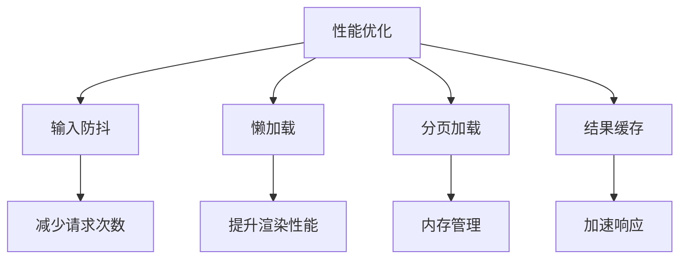

**图表来源**
- [EnhancedSearchBox.vue](file://src/components/search/EnhancedSearchBox.vue#L200-L300)

## 性能考虑与优化

### 搜索算法优化

1. **索引优化**：对常用搜索字段建立索引
2. **缓存策略**：缓存热门搜索结果
3. **并发控制**：限制同时进行的搜索请求数量
4. **结果限制**：默认限制搜索结果数量

### 内存管理

1. **组件卸载清理**：及时清理定时器和事件监听器
2. **状态重置**：组件销毁时重置相关状态
3. **引用释放**：避免循环引用导致内存泄漏

### 网络优化

1. **请求合并**：合并相似的搜索请求
2. **压缩传输**：启用gzip压缩
3. **CDN加速**：静态资源使用CDN
4. **预加载**：预加载可能需要的资源

## 总结

本文档详细分析了基于Vue 3 Composition API的前端搜索组件集成系统。该系统通过`useAdvancedSearch`组合式API为核心，结合EnhancedSearchBox、AdvancedSearchPanel和SearchResultsView等组件，实现了完整的搜索功能。

### 主要特点

1. **模块化设计**：各组件职责明确，便于维护和扩展
2. **智能算法**：支持多字段加权搜索和模糊匹配
3. **用户体验**：提供丰富的交互功能和即时反馈
4. **性能优化**：采用防抖、缓存、懒加载等多种优化策略

### 技术亮点

1. **组合式API**：充分利用Vue 3的新特性
2. **响应式编程**：基于Reactive API的状态管理
3. **类型安全**：完整的TypeScript类型定义
4. **可测试性**：良好的组件分离便于单元测试

该系统为现代Web应用提供了优秀的搜索解决方案，具有高度的可扩展性和维护性，是前端组件集成的优秀范例。