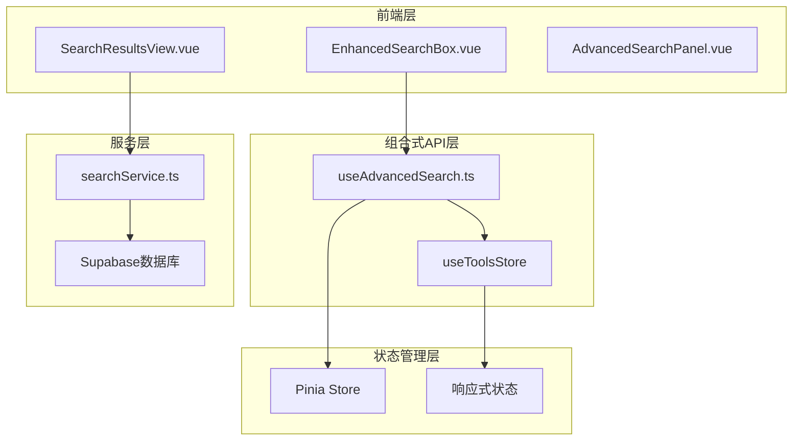
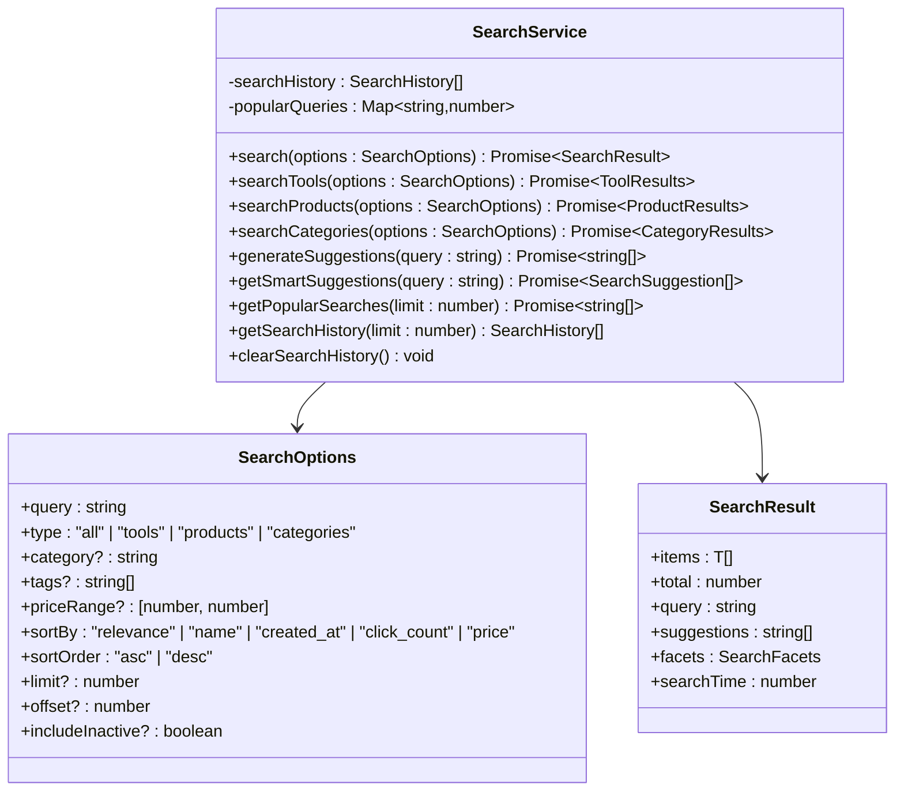
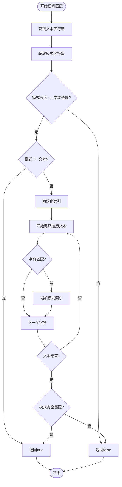
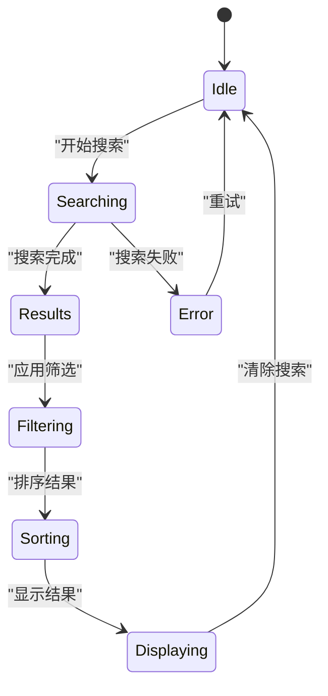
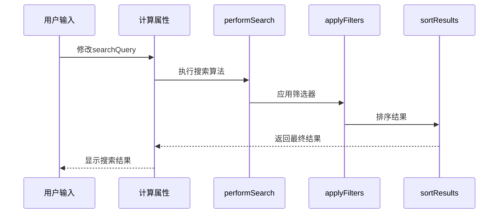
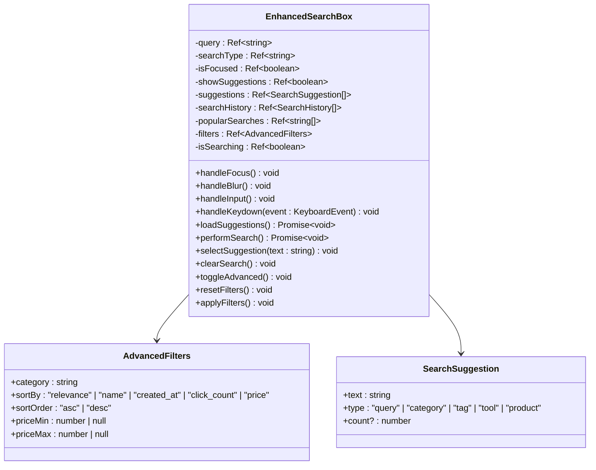
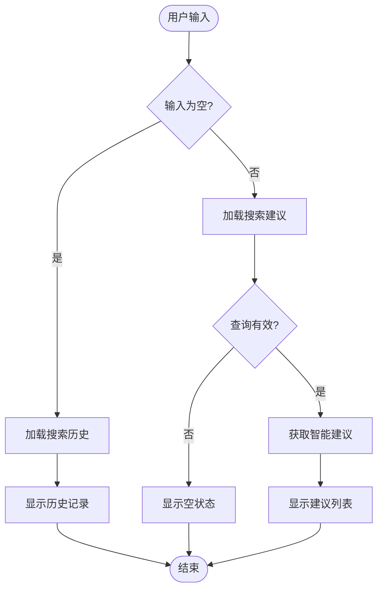

# 客户端搜索实现

<cite>
**本文档引用的文件**
- [useAdvancedSearch.ts](file://src/composables/useAdvancedSearch.ts)
- [EnhancedSearchBox.vue](file://src/components/search/EnhancedSearchBox.vue)
- [searchService.ts](file://src/services/searchService.ts)
- [tools.ts](file://src/stores/tools.ts)
- [SearchResultsView.vue](file://src/views/SearchResultsView.vue)
- [services.test.ts](file://src/tests/integration/services.test.ts)
</cite>

## 目录
1. [简介](#简介)
2. [项目架构概览](#项目架构概览)
3. [核心组件分析](#核心组件分析)
4. [智能搜索算法](#智能搜索算法)
5. [响应式状态管理](#响应式状态管理)
6. [前端组件实现](#前端组件实现)
7. [性能优化策略](#性能优化策略)
8. [代码示例与最佳实践](#代码示例与最佳实践)
9. [故障排除指南](#故障排除指南)
10. [总结](#总结)

## 简介

本文档详细解析了基于Vue 3 Composition API的高级搜索功能实现，重点分析`useAdvancedSearch`组合式API的内部机制。该搜索系统采用智能算法、模糊匹配逻辑和结果评分系统，为用户提供实时、精准的搜索体验。

搜索系统的核心特点：
- **多维度搜索**：支持工具、产品、分类等多种内容类型的综合搜索
- **智能算法**：基于相关性评分和权重计算的智能搜索算法
- **实时反馈**：输入防抖处理和搜索建议实时展示
- **高级筛选**：丰富的筛选条件和排序选项
- **性能优化**：缓存机制和懒加载优化

## 项目架构概览



**图表来源**
- [EnhancedSearchBox.vue](file://src/components/search/EnhancedSearchBox.vue#L1-L50)
- [useAdvancedSearch.ts](file://src/composables/useAdvancedSearch.ts#L1-L30)
- [searchService.ts](file://src/services/searchService.ts#L1-L50)

## 核心组件分析

### useAdvancedSearch组合式API

`useAdvancedSearch`是整个搜索系统的核心，提供了完整的搜索功能封装：

```typescript
export function useAdvancedSearch() {
  const toolsStore = useToolsStore();
  
  const searchQuery = ref("");
  const filters = ref<SearchFilters>({
    category: "",
    tags: [],
    rating: 0,
    isFeatured: false,
    hasUrl: false,
    sortBy: "name",
    sortOrder: "asc",
  });
  
  const searchHistory = ref<string[]>([]);
  const isSearching = ref(false);
}
```

**章节来源**
- [useAdvancedSearch.ts](file://src/composables/useAdvancedSearch.ts#L15-L35)

### 搜索服务架构



**图表来源**
- [searchService.ts](file://src/services/searchService.ts#L50-L100)
- [searchService.ts](file://src/services/searchService.ts#L10-L40)

**章节来源**
- [searchService.ts](file://src/services/searchService.ts#L50-L150)

## 智能搜索算法

### 搜索评分机制

搜索算法采用多字段加权评分系统：

```typescript
const performSearch = (query: string, items: Tool[]): SearchResult[] => {
  if (!query.trim()) return items.map((item) => ({ item, score: 1, matches: [] }));

  const searchTerms = query.toLowerCase().split(/\s+/).filter((term) => term.length > 0);
  const results: SearchResult[] = [];

  items.forEach((item) => {
    let score = 0;
    const matches: string[] = [];

    // 搜索字段权重
    const searchFields = [
      { field: "name", weight: 10 },
      { field: "description", weight: 5 },
      { field: "tags", weight: 3 },
      { field: "categories.name", weight: 2 },
    ];

    searchTerms.forEach((term) => {
      searchFields.forEach(({ field, weight }) => {
        const value = getNestedValue(item, field);
        if (value && searchInField(value, term)) {
          score += weight;
          if (!matches.includes(field)) {
            matches.push(field);
          }
        }
      });

      // 模糊匹配
      const itemName = item.name as string | undefined;
      if (fuzzyMatch(itemName?.toLowerCase() || "", term)) {
        score += 2;
      }
    });

    // 特色工具加分
    if (item.is_featured) {
      score += 1;
    }

    if (score > 0) {
      results.push({ item, score, matches });
    }
  });

  return results.sort((a, b) => b.score - a.score);
};
```

### 模糊匹配算法



**图表来源**
- [useAdvancedSearch.ts](file://src/composables/useAdvancedSearch.ts#L280-L305)

**章节来源**
- [useAdvancedSearch.ts](file://src/composables/useAdvancedSearch.ts#L35-L85)

## 响应式状态管理

### 搜索状态结构



### 筛选器接口设计

```typescript
export interface SearchFilters {
  category: string;
  tags: string[];
  rating: number;
  isFeatured: boolean;
  hasUrl: boolean;
  sortBy: "name" | "rating" | "clicks" | "created_at";
  sortOrder: "asc" | "desc";
}
```

### 计算属性链



**图表来源**
- [useAdvancedSearch.ts](file://src/composables/useAdvancedSearch.ts#L85-L120)

**章节来源**
- [useAdvancedSearch.ts](file://src/composables/useAdvancedSearch.ts#L5-L15)

## 前端组件实现

### EnhancedSearchBox组件架构



**图表来源**
- [EnhancedSearchBox.vue](file://src/components/search/EnhancedSearchBox.vue#L200-L250)

### 输入防抖处理

```typescript
const debouncedLoadSuggestions = useDebounceFn(loadSuggestions, 300);

const handleInput = () => {
  selectedIndex.value = -1;
  debouncedLoadSuggestions();
};
```

### 搜索建议系统



**图表来源**
- [EnhancedSearchBox.vue](file://src/components/search/EnhancedSearchBox.vue#L350-L400)

**章节来源**
- [EnhancedSearchBox.vue](file://src/components/search/EnhancedSearchBox.vue#L200-L300)

## 性能优化策略

### 缓存机制

搜索服务实现了多层次的缓存策略：

1. **搜索历史缓存**：本地存储搜索历史记录
2. **热门搜索缓存**：内存中维护热门搜索统计
3. **结果缓存**：对相同查询结果进行缓存

```typescript
// 搜索历史持久化
private saveHistoryToStorage(): void {
  try {
    localStorage.setItem("search_history", JSON.stringify(this.searchHistory));
  } catch (error) {
    console.error("保存搜索历史失败:", error);
  }
}

// 热门搜索统计
private addToHistory(query: string, type: string): void {
  const currentCount = this.popularQueries.get(query) || 0;
  this.popularQueries.set(query, currentCount + 1);
}
```

### 并行搜索优化

```typescript
// 综合搜索中的并行处理
private async searchAll(options: SearchOptions): Promise<{
  items: SearchAllItem[];
  total: number;
  facets: SearchFacets;
}> {
  const { limit = 20 } = options;

  // 并行搜索各个类型
  const [toolResults, productResults, categoryResults] = await Promise.all([
    this.searchTools({ ...options, limit: Math.ceil(limit / 3) }),
    this.searchProducts({ ...options, limit: Math.ceil(limit / 3) }),
    this.searchCategories({ ...options, limit: Math.ceil(limit / 3) }),
  ]);

  // 合并结果
  const items: SearchAllItem[] = [
    ...toolResults.items.map((item) => ({ ...item, _type: "tool" as const })),
    ...productResults.items.map((item) => ({ ...item, _type: "product" as const })),
    ...categoryResults.items.map((item) => ({ ...item, _type: "category" as const })),
  ];

  return { items, total, facets };
}
```

**章节来源**
- [searchService.ts](file://src/services/searchService.ts#L580-L620)

## 代码示例与最佳实践

### 在新组件中使用useAdvancedSearch

```vue
<template>
  <div class="advanced-search-demo">
    <input v-model="searchQuery" placeholder="搜索工具..." @input="handleSearch" />
    
    <div class="filters">
      <select v-model="filters.category">
        <option value="">所有分类</option>
        <option v-for="category in categories" :key="category.id" :value="category.id">
          {{ category.name }}
        </option>
      </select>
      
      <select v-model="filters.sortBy">
        <option value="name">名称</option>
        <option value="clicks">热度</option>
        <option value="created_at">创建时间</option>
      </select>
    </div>
    
    <div v-if="isSearching" class="loading">搜索中...</div>
    
    <div class="results">
      <div v-for="result in searchResults" :key="result.item.id" class="result-item">
        <h3>{{ result.item.name }}</h3>
        <p>{{ result.item.description }}</p>
        <span>相关度: {{ result.score }}</span>
      </div>
    </div>
  </div>
</template>

<script setup lang="ts">
import { useAdvancedSearch } from '@/composables/useAdvancedSearch';
import { useCategoriesStore } from '@/stores/categories';

const { 
  searchQuery, 
  filters, 
  searchResults, 
  isSearching,
  search, 
  resetFilters 
} = useAdvancedSearch();

const categoriesStore = useCategoriesStore();

// 处理搜索
const handleSearch = () => {
  search(searchQuery.value);
};

// 监听结果变化
watchEffect(() => {
  if (searchResults.value.length > 0) {
    console.log('搜索结果:', searchResults.value);
  }
});
</script>
```

### 自定义搜索配置

```typescript
// 自定义搜索选项
const customSearchOptions = {
  query: "AI tools",
  type: "tools" as const,
  category: "development",
  tags: ["ai", "machine learning"],
  sortBy: "clicks" as const,
  sortOrder: "desc" as const,
  limit: 50
};

// 使用搜索服务
const searchService = new SearchService();
const results = await searchService.search(customSearchOptions);
```

### 错误处理最佳实践

```typescript
// 搜索错误处理
const performSafeSearch = async (query: string) => {
  try {
    const results = await searchService.search({
      query,
      type: "tools",
      limit: 20
    });
    
    return results;
  } catch (error) {
    console.error("搜索失败:", error);
    
    // 提供默认结果
    return {
      items: [],
      total: 0,
      query,
      suggestions: [],
      facets: { categories: [], tags: [], priceRanges: [] },
      searchTime: 0
    };
  }
};
```

## 故障排除指南

### 常见问题及解决方案

1. **搜索结果为空**
   - 检查搜索查询是否包含有效字符
   - 验证筛选条件是否过于严格
   - 确认数据源是否正常加载

2. **搜索性能问题**
   - 检查防抖设置是否合理
   - 优化搜索字段和权重配置
   - 实现结果缓存机制

3. **响应式状态不同步**
   - 确保使用正确的ref和computed语法
   - 检查依赖关系是否正确声明
   - 验证事件监听器是否正确绑定

### 调试技巧

```typescript
// 启用调试模式
const debugSearch = (query: string) => {
  console.log('搜索查询:', query);
  console.log('当前筛选器:', filters.value);
  console.log('搜索结果数量:', searchResults.value.length);
};

// 监控搜索状态
watch(isSearching, (newValue) => {
  if (newValue) {
    console.log('开始搜索...');
  } else {
    console.log('搜索完成');
  }
});
```

**章节来源**
- [useAdvancedSearch.ts](file://src/composables/useAdvancedSearch.ts#L200-L250)

## 总结

本文档深入分析了基于Vue 3的高级搜索系统实现，涵盖了从底层算法到前端组件的完整技术栈。该搜索系统具有以下核心优势：

1. **智能化程度高**：采用多字段加权评分和模糊匹配算法
2. **用户体验优秀**：实时搜索建议和防抖处理
3. **扩展性强**：模块化设计支持多种内容类型
4. **性能优异**：缓存机制和并行处理优化
5. **易于维护**：清晰的架构和完善的测试覆盖

通过合理的架构设计和性能优化，该搜索系统能够为用户提供快速、准确、直观的搜索体验，同时保持良好的可维护性和扩展性。开发者可以根据具体需求，在现有基础上进行定制和扩展，以满足不同场景下的搜索需求。