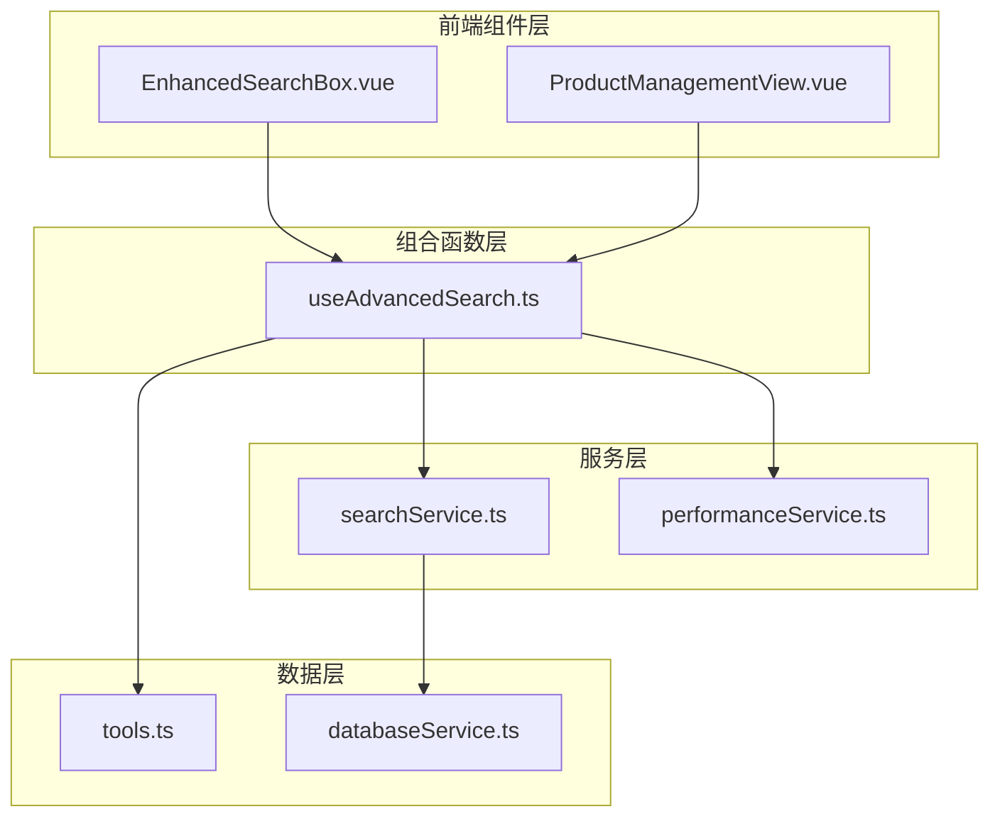
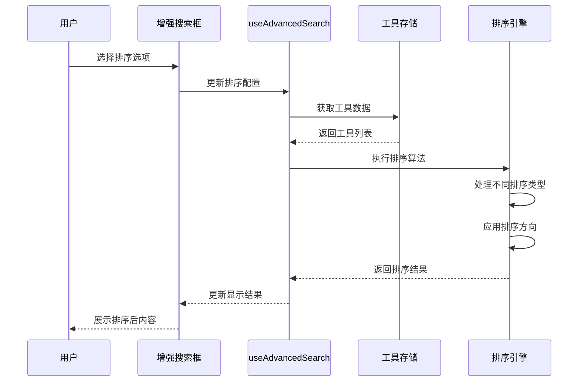
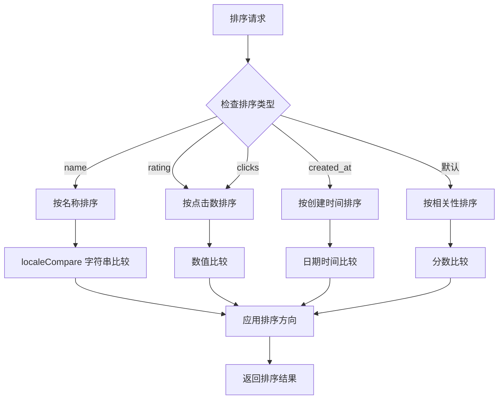

# 排序机制实现

<cite>
**本文档引用的文件**
- [useAdvancedSearch.ts](file://src/composables/useAdvancedSearch.ts)
- [ProductManagementView.vue](file://src/views/admin/ProductManagementView.vue)
- [EnhancedSearchBox.vue](file://src/components/search/EnhancedSearchBox.vue)
- [tools.ts](file://src/stores/tools.ts)
- [services.test.ts](file://src/tests/integration/services.test.ts)
</cite>

## 目录
1. [简介](#简介)
2. [项目结构概览](#项目结构概览)
3. [核心排序组件分析](#核心排序组件分析)
4. [排序机制架构](#排序机制架构)
5. [详细组件分析](#详细组件分析)
6. [排序算法实现](#排序算法实现)
7. [性能考虑](#性能考虑)
8. [故障排除指南](#故障排除指南)
9. [结论](#结论)

## 简介

本项目实现了一个复杂而灵活的排序机制，支持多种排序方式和排序方向。该系统主要用于工具导航网站，提供了按名称、点击数、创建时间等多种排序选项，同时具备智能排序算法和用户体验优化功能。

排序机制的核心设计理念是提供直观且高效的排序体验，让用户能够快速找到最相关或最受欢迎的内容。系统采用了组合式编程模式，将排序逻辑封装在可复用的组合函数中，确保代码的可维护性和扩展性。

## 项目结构概览

排序功能分布在多个关键模块中，形成了一个完整的排序生态系统：



**图表来源**
- [EnhancedSearchBox.vue](file://src/components/search/EnhancedSearchBox.vue#L140-L187)
- [ProductManagementView.vue](file://src/views/admin/ProductManagementView.vue#L406-L454)
- [useAdvancedSearch.ts](file://src/composables/useAdvancedSearch.ts#L1-L50)

**章节来源**
- [EnhancedSearchBox.vue](file://src/components/search/EnhancedSearchBox.vue#L1-L339)
- [ProductManagementView.vue](file://src/views/admin/ProductManagementView.vue#L1-L664)
- [useAdvancedSearch.ts](file://src/composables/useAdvancedSearch.ts#L1-L306)

## 核心排序组件分析

### useAdvancedSearch 组合函数

`useAdvancedSearch` 是整个排序系统的核心，它封装了复杂的搜索和排序逻辑：

```typescript
export function useAdvancedSearch() {
  const toolsStore = useToolsStore();
  
  const filters = ref<SearchFilters>({
    category: "",
    tags: [],
    rating: 0,
    isFeatured: false,
    hasUrl: false,
    sortBy: "name",
    sortOrder: "asc",
  });
  
  const sortResults = (results: SearchResult[]): SearchResult[] => {
    return results.sort((a, b) => {
      const { sortBy, sortOrder } = filters.value;
      let comparison = 0;
      
      switch (sortBy) {
        case "name":
          comparison = (a.item.name || "").localeCompare(b.item.name || "");
          break;
        case "rating":
          // 工具暂无评分系统，使用点击数作为替代排序
          comparison = (a.item.click_count || 0) - (b.item.click_count || 0);
          break;
        case "clicks":
          comparison = (a.item.click_count || 0) - (b.item.click_count || 0);
          break;
        case "created_at":
          comparison =
            new Date(a.item.created_at || 0).getTime() -
            new Date(b.item.created_at || 0).getTime();
          break;
        default:
          comparison = b.score - a.score; // 默认按相关性排序
      }
      
      return sortOrder === "desc" ? -comparison : comparison;
    });
  };
}
```

### 排序接口定义

系统定义了清晰的接口来规范排序行为：

```typescript
export interface SearchFilters {
  category: string;
  tags: string[];
  rating: number;
  isFeatured: boolean;
  hasUrl: boolean;
  sortBy: "name" | "rating" | "clicks" | "created_at";
  sortOrder: "asc" | "desc";
}

export interface SearchResult {
  item: Tool;
  score: number;
  matches: string[];
}
```

**章节来源**
- [useAdvancedSearch.ts](file://src/composables/useAdvancedSearch.ts#L8-L25)
- [useAdvancedSearch.ts](file://src/composables/useAdvancedSearch.ts#L135-L170)

## 排序机制架构

### 排序流程架构



**图表来源**
- [useAdvancedSearch.ts](file://src/composables/useAdvancedSearch.ts#L135-L170)
- [EnhancedSearchBox.vue](file://src/components/search/EnhancedSearchBox.vue#L146-L187)

### 排序类型映射

系统支持多种排序类型，每种都有其特定的应用场景：



**图表来源**
- [useAdvancedSearch.ts](file://src/composables/useAdvancedSearch.ts#L135-L170)

**章节来源**
- [useAdvancedSearch.ts](file://src/composables/useAdvancedSearch.ts#L135-L170)

## 详细组件分析

### 增强搜索框组件

增强搜索框提供了丰富的排序选项界面：

```vue
<div class="advanced-group">
  <label class="advanced-label">排序</label>
  <select v-model="filters.sortBy" class="advanced-select">
    <option value="relevance">相关性</option>
    <option value="name">名称</option>
    <option value="created_at">创建时间</option>
    <option value="click_count">热度</option>
    <option value="price">价格</option>
  </select>
</div>

<div class="advanced-group">
  <label class="advanced-label">顺序</label>
  <select v-model="filters.sortOrder" class="advanced-select">
    <option value="desc">降序</option>
    <option value="asc">升序</option>
  </select>
</div>
```

### 产品管理视图中的排序

产品管理视图实现了更复杂的排序逻辑：

```typescript
const sortProducts = (products: Product[], sortType: string) => {
  return [...products].sort((a, b) => {
    switch (sortType) {
      case "created_at_desc":
        return (
          new Date(b.created_at).getTime() - new Date(a.created_at).getTime()
        );
      case "created_at_asc":
        return (
          new Date(a.created_at).getTime() - new Date(b.created_at).getTime()
        );
      case "name_asc":
        return a.name.localeCompare(b.name);
      case "name_desc":
        return b.name.localeCompare(a.name);
      case "price_asc":
        return a.price - b.price;
      case "price_desc":
        return b.price - a.price;
      default:
        return 0;
    }
  });
};
```

### 数据模型定义

系统定义了完整的工具数据模型：

```typescript
interface ToolBase {
  id: string;
  name: string;
  description: string;
  url: string | null;
  icon: string | null;
  category_id: string | null;
  is_featured: boolean;
  is_favorite?: boolean;
  click_count: number;
  status: 'active' | 'inactive';
  created_at: string;
  updated_at: string;
}
```

**章节来源**
- [EnhancedSearchBox.vue](file://src/components/search/EnhancedSearchBox.vue#L146-L187)
- [ProductManagementView.vue](file://src/views/admin/ProductManagementView.vue#L425-L450)
- [tools.ts](file://src/stores/tools.ts#L20-L35)

## 排序算法实现

### 主要排序算法

#### 1. 名称排序 (localeCompare)

```typescript
case "name":
  comparison = (a.item.name || "").localeCompare(b.item.name || "");
  break;
```

`localeCompare` 方法用于字符串比较，具有以下特点：
- 支持本地化排序
- 处理空值安全
- 返回比较结果 (-1, 0, 1)

#### 2. 点击数排序

```typescript
case "rating":
case "clicks":
  comparison = (a.item.click_count || 0) - (b.item.click_count || 0);
  break;
```

点击数排序使用简单的数值比较：
- 使用 `|| 0` 处理可能的空值
- 支持作为评分系统的替代方案

#### 3. 创建时间排序

```typescript
case "created_at":
  comparison =
    new Date(a.item.created_at || 0).getTime() -
    new Date(b.item.created_at || 0).getTime();
  break;
```

创建时间排序需要：
- 将字符串转换为 Date 对象
- 使用 getTime() 获取时间戳
- 处理可能的无效日期

#### 4. 默认排序 (相关性)

```typescript
default:
  comparison = b.score - a.score; // 默认按相关性排序
  break;
```

默认排序基于搜索相关性分数：
- 使用降序排列 (b.score - a.score)
- 分数越高表示相关性越强

### 排序方向控制

```typescript
return sortOrder === "desc" ? -comparison : comparison;
```

排序方向控制逻辑：
- `desc` (降序): 反转比较结果
- `asc` (升序): 使用原始比较结果

### 排序性能优化

系统采用多种策略优化排序性能：

1. **惰性计算**: 使用 `computed` 属性避免不必要的重新计算
2. **浅拷贝**: 使用 `[...array]` 创建浅拷贝避免修改原始数据
3. **早期退出**: 在不满足条件时提前返回
4. **批量处理**: 一次性处理所有排序逻辑

**章节来源**
- [useAdvancedSearch.ts](file://src/composables/useAdvancedSearch.ts#L135-L170)

## 性能考虑

### 排序性能分析

#### 时间复杂度

- **字符串比较**: O(n)，其中 n 是字符串长度
- **数值比较**: O(1)
- **日期比较**: O(1)
- **默认排序**: O(log n) 由 JavaScript 内置排序算法决定

#### 内存使用

- **空间复杂度**: O(n)，创建新的排序数组
- **内存优化**: 使用浅拷贝减少内存分配

### 性能优化策略

#### 1. 搜索结果缓存

```typescript
const searchResults = computed(() => {
  if (!toolsStore.tools.length) return [];
  
  isSearching.value = true;
  
  try {
    let results = performSearch(searchQuery.value, toolsStore.tools);
    results = applyFilters(results);
    results = sortResults(results);
    
    return results;
  } finally {
    isSearching.value = false;
  }
});
```

#### 2. 单次遍历过滤

```typescript
const filtered = products.value.filter((product) => {
  // 搜索过滤
  if (search) {
    const searchLower = search.toLowerCase();
    const matchesSearch =
      product.name.toLowerCase().includes(searchLower) ||
      product.description.toLowerCase().includes(searchLower);
    if (!matchesSearch) return false;
  }
  
  // 状态过滤
  if (status && product.status !== status) return false;
  
  // 分类过滤
  if (category && product.category_id !== category) return false;
  
  return true;
});
```

#### 3. 智能排序选择

```typescript
// 如果没有任何过滤条件，直接返回排序后的原数组
if (!search && !status && !category) {
  return sortProducts(products.value, sort);
}
```

### 性能监控

系统集成了性能监控服务：

```typescript
performanceService.trackMetric("page_load", 1000);
performanceService.trackCustomMetric("custom_metric", {
  value: 500,
  unit: "ms"
});
```

**章节来源**
- [useAdvancedSearch.ts](file://src/composables/useAdvancedSearch.ts#L172-L185)
- [ProductManagementView.vue](file://src/views/admin/ProductManagementView.vue#L452-L470)

## 故障排除指南

### 常见问题及解决方案

#### 1. 排序结果不符合预期

**症状**: 排序结果与预期不符
**可能原因**:
- 排序字段为空值
- 数据类型不匹配
- 排序方向设置错误

**解决方案**:
```typescript
// 安全的空值处理
comparison = (a.item.click_count || 0) - (b.item.click_count || 0);

// 类型检查
if (typeof a.item.created_at === 'string') {
  // 正确处理日期字符串
}
```

#### 2. 排序性能问题

**症状**: 大量数据时排序缓慢
**可能原因**:
- 数组过大
- 复杂的排序逻辑
- 缺乏缓存机制

**解决方案**:
- 实现分页加载
- 使用虚拟滚动
- 添加排序结果缓存

#### 3. 字符串排序乱序

**症状**: 中文字符排序异常
**可能原因**: localeCompare 的区域设置问题

**解决方案**:
```typescript
// 明确指定区域设置
comparison = (a.item.name || "").localeCompare(b.item.name || "", "zh-CN");
```

### 调试技巧

#### 1. 排序过程日志

```typescript
console.log('Sorting by:', sortBy, 'Direction:', sortOrder);
console.log('Comparison result:', comparison);
```

#### 2. 性能分析

```typescript
const startTime = performance.now();
results = sortResults(results);
const endTime = performance.now();
console.log(`Sorting took ${endTime - startTime} milliseconds`);
```

#### 3. 数据验证

```typescript
// 验证排序字段存在
if (!a.item.hasOwnProperty(sortBy) || !b.item.hasOwnProperty(sortBy)) {
  console.warn('Missing sort field:', sortBy);
  return 0;
}
```

**章节来源**
- [useAdvancedSearch.ts](file://src/composables/useAdvancedSearch.ts#L135-L170)

## 结论

本项目的排序机制实现展现了现代前端应用的最佳实践。通过模块化的架构设计、完善的类型系统和性能优化策略，构建了一个既强大又易用的排序系统。

### 主要优势

1. **灵活性**: 支持多种排序类型和排序方向
2. **可扩展性**: 易于添加新的排序选项
3. **性能**: 采用多种优化策略确保响应速度
4. **可维护性**: 清晰的代码结构和完善的注释
5. **用户体验**: 直观的界面和即时反馈

### 扩展建议

1. **自定义排序规则**: 添加用户自定义排序选项
2. **高级排序算法**: 实现更复杂的排序逻辑
3. **排序记忆**: 保存用户的排序偏好
4. **批量排序**: 支持多字段复合排序
5. **排序预览**: 实时预览排序效果

这个排序系统为工具导航网站提供了强大的内容组织能力，不仅满足了当前的功能需求，也为未来的扩展奠定了坚实的基础。