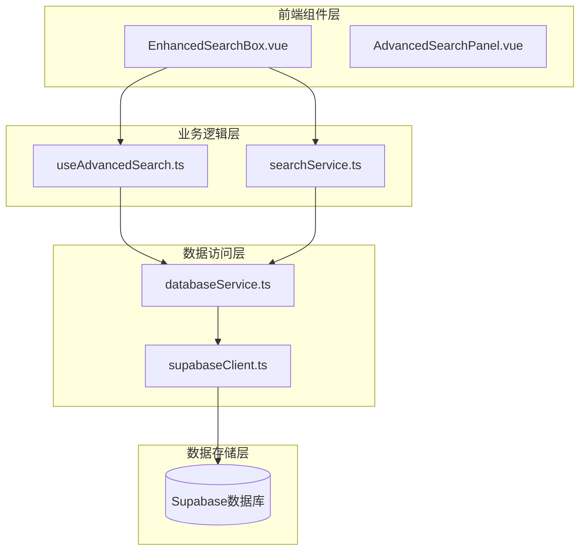
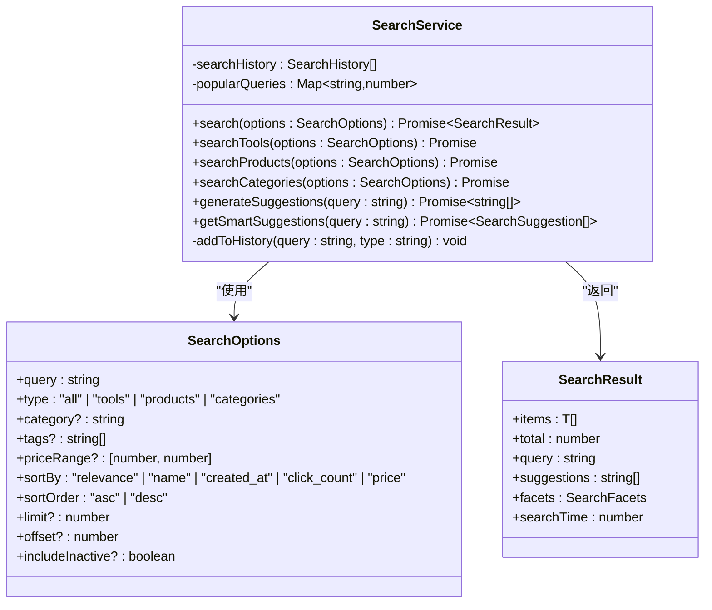
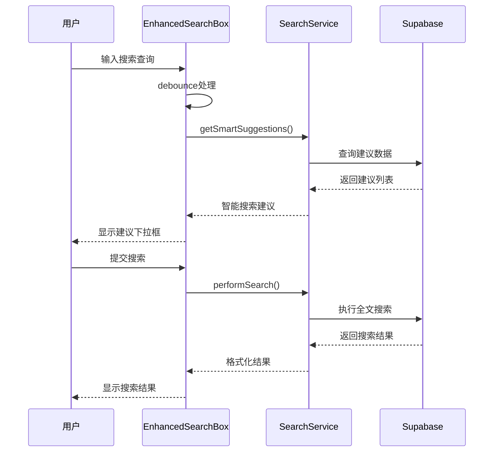
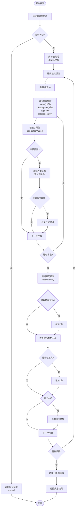
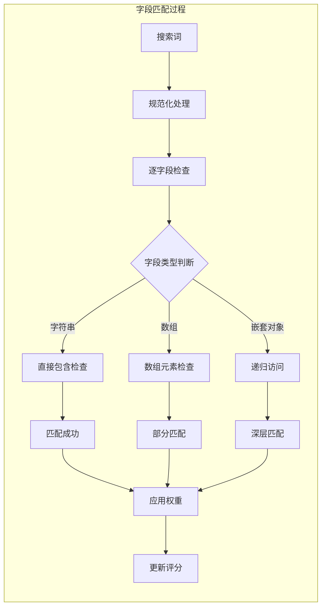
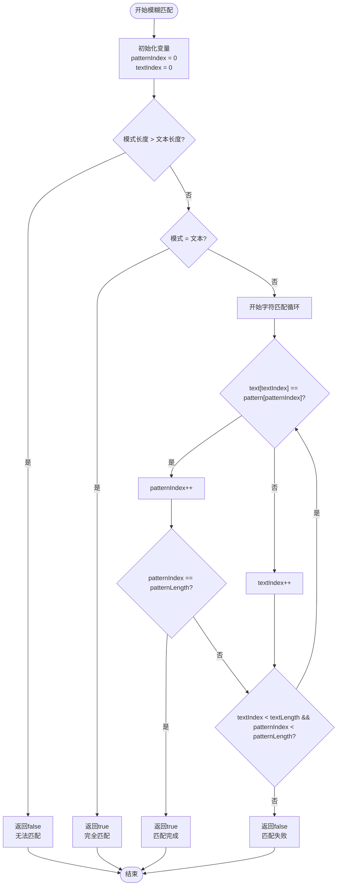
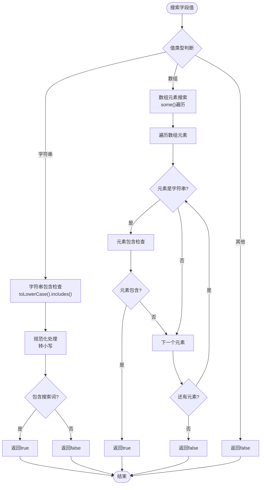
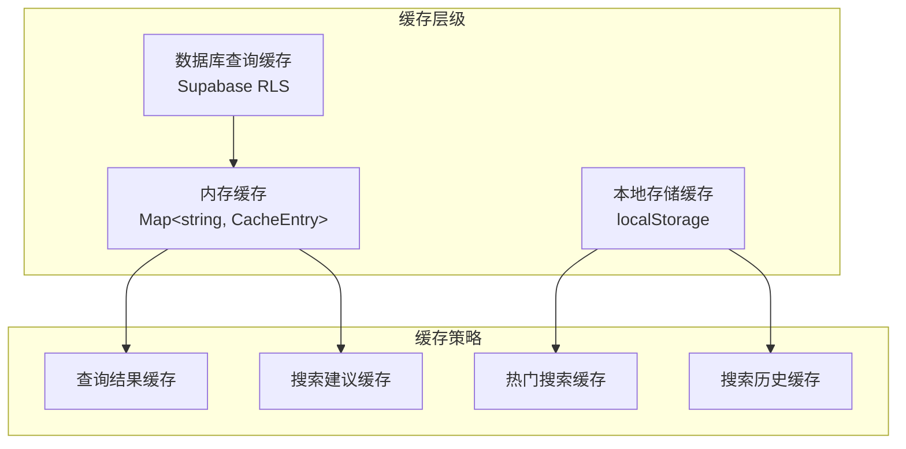

# 搜索算法实现

<cite>
**本文档引用的文件**
- [searchService.ts](file://src/services/searchService.ts)
- [EnhancedSearchBox.vue](file://src/components/search/EnhancedSearchBox.vue)
- [useAdvancedSearch.ts](file://src/composables/useAdvancedSearch.ts)
- [databaseService.ts](file://src/services/databaseService.ts)
- [tools.ts](file://src/stores/tools.ts)
- [index.ts](file://src/types/index.ts)
</cite>

## 目录
1. [简介](#简介)
2. [项目结构概览](#项目结构概览)
3. [核心搜索组件分析](#核心搜索组件分析)
4. [智能搜索算法详解](#智能搜索算法详解)
5. [多字段加权评分系统](#多字段加权评分系统)
6. [模糊匹配算法实现](#模糊匹配算法实现)
7. [辅助函数分析](#辅助函数分析)
8. [性能优化策略](#性能优化策略)
9. [故障排除指南](#故障排除指南)
10. [总结](#总结)

## 简介

本文档详细解析了客户端智能搜索算法的实现机制，重点关注`performSearch`函数如何通过多字段加权评分系统计算搜索相关性。该搜索系统采用先进的模糊匹配算法，结合嵌套数据搜索和实时建议生成功能，为用户提供高效准确的搜索体验。

## 项目结构概览

搜索功能在项目中分布在多个层次，形成了完整的搜索生态系统：



**图表来源**
- [EnhancedSearchBox.vue](file://src/components/search/EnhancedSearchBox.vue#L1-L50)
- [useAdvancedSearch.ts](file://src/composables/useAdvancedSearch.ts#L1-L30)
- [searchService.ts](file://src/services/searchService.ts#L1-L40)

## 核心搜索组件分析

### 搜索服务架构

搜索服务采用模块化设计，支持多种搜索类型和复杂的查询条件：



**图表来源**
- [searchService.ts](file://src/services/searchService.ts#L1-L50)
- [searchService.ts](file://src/services/searchService.ts#L10-L30)

### 增强搜索框组件

增强搜索框提供了丰富的用户交互功能：



**图表来源**
- [EnhancedSearchBox.vue](file://src/components/search/EnhancedSearchBox.vue#L400-L500)
- [searchService.ts](file://src/services/searchService.ts#L30-L80)

**章节来源**
- [searchService.ts](file://src/services/searchService.ts#L1-L641)
- [EnhancedSearchBox.vue](file://src/components/search/EnhancedSearchBox.vue#L1-L1024)

## 智能搜索算法详解

### performSearch函数核心实现

智能搜索算法的核心是`performSearch`函数，它实现了基于多字段加权评分的搜索相关性计算：

```typescript
const performSearch = (query: string, items: Tool[]): SearchResult[] => {
  if (!query.trim()) return items.map((item) => ({ item, score: 1, matches: [] }));

  const searchTerms = query
    .toLowerCase()
    .split(/\s+/)
    .filter((term) => term.length > 0);
  const results: SearchResult[] = [];

  items.forEach((item) => {
    let score = 0;
    const matches: string[] = [];

    // 搜索字段权重配置
    const searchFields = [
      { field: "name", weight: 10 },
      { field: "description", weight: 5 },
      { field: "tags", weight: 3 },
      { field: "categories.name", weight: 2 },
    ];

    searchTerms.forEach((term) => {
      searchFields.forEach(({ field, weight }) => {
        const value = getNestedValue(item, field);
        if (value && searchInField(value, term)) {
          score += weight;
          if (!matches.includes(field)) {
            matches.push(field);
          }
        }
      });

      // 模糊匹配
      const itemName = item.name as string | undefined;
      if (fuzzyMatch(itemName?.toLowerCase() || "", term)) {
        score += 2;
      }
    });

    // 特色工具加分
    if (item.is_featured) {
      score += 1;
    }

    if (score > 0) {
      results.push({ item, score, matches });
    }
  });

  return results.sort((a, b) => b.score - a.score);
};
```

### 搜索评分流程图



**图表来源**
- [useAdvancedSearch.ts](file://src/composables/useAdvancedSearch.ts#L30-L116)

**章节来源**
- [useAdvancedSearch.ts](file://src/composables/useAdvancedSearch.ts#L30-L116)

## 多字段加权评分系统

### 权重分配策略详解

搜索系统采用精心设计的权重分配策略，确保最重要的信息获得最高的相关性评分：

| 字段 | 权重 | 描述 | 示例 |
|------|------|------|------|
| 名称 | 10分 | 工具名称是最重要的识别特征 | "GitHub" vs "Git" |
| 描述 | 5分 | 描述内容提供上下文信息 | "代码托管平台" |
| 标签 | 3分 | 标签帮助精确分类和过滤 | "开发工具", "协作" |
| 分类 | 2分 | 分类提供高层次的组织结构 | "开发工具", "设计工具" |

### 字段匹配算法



**图表来源**
- [useAdvancedSearch.ts](file://src/composables/useAdvancedSearch.ts#L280-L304)

### 嵌套数据搜索实现

系统支持对嵌套数据结构的深度搜索，通过`getNestedValue`函数实现：

```typescript
const getNestedValue = (obj: Record<string, unknown>, path: string): unknown => {
  return path.split(".").reduce((current, key) => current?.[key], obj);
};
```

这种设计允许搜索：
- `name`: 直接字段搜索
- `categories.name`: 嵌套分类名称搜索
- `tool_tags.tags.name`: 多层级标签搜索

**章节来源**
- [useAdvancedSearch.ts](file://src/composables/useAdvancedSearch.ts#L280-L304)

## 模糊匹配算法实现

### fuzzyMatch函数核心逻辑

模糊匹配算法实现了非连续字符匹配，能够在不完全匹配的情况下仍然提供相关结果：

```typescript
const fuzzyMatch = (text: string, pattern: string): boolean => {
  const patternLength = pattern.length;
  const textLength = text.length;

  if (patternLength > textLength) return false;
  if (patternLength === textLength) return pattern === text;

  let patternIndex = 0;
  for (let textIndex = 0; textIndex < textLength && patternIndex < patternLength; textIndex++) {
    if (text[textIndex] === pattern[patternIndex]) {
      patternIndex++;
    }
  }

  return patternIndex === patternLength;
};
```

### 模糊匹配算法流程



**图表来源**
- [useAdvancedSearch.ts](file://src/composables/useAdvancedSearch.ts#L269-L304)

### 模糊匹配示例

以下是一些模糊匹配的实际示例：

| 文本 | 模式 | 匹配结果 | 说明 |
|------|------|----------|------|
| "GitHub" | "gh" | true | 非连续字符匹配 |
| "Visual Studio Code" | "vscode" | true | 单词首字母缩写 |
| "Advanced Tools Navigation" | "atn" | true | 多单词首字母 |
| "JavaScript" | "jss" | false | 字符不连续 |
| "React" | "react" | true | 完全匹配 |

**章节来源**
- [useAdvancedSearch.ts](file://src/composables/useAdvancedSearch.ts#L269-L304)

## 辅助函数分析

### searchInField函数实现

`searchInField`函数负责在各种数据类型上执行搜索操作：

```typescript
const searchInField = (value: unknown, term: string): boolean => {
  if (Array.isArray(value)) {
    return value.some(
      (item) => typeof item === "string" && item.toLowerCase().includes(term),
    );
  }
  return typeof value === "string" && value.toLowerCase().includes(term);
};
```

该函数支持：
- **字符串搜索**: 直接包含检查
- **数组搜索**: 遍历数组元素进行匹配
- **类型安全**: 确保只对字符串或字符串数组进行操作

### 多类型数据处理流程



**图表来源**
- [useAdvancedSearch.ts](file://src/composables/useAdvancedSearch.ts#L290-L304)

**章节来源**
- [useAdvancedSearch.ts](file://src/composables/useAdvancedSearch.ts#L280-L304)

## 性能优化策略

### 缓存机制

搜索系统实现了多层次的缓存策略：



**图表来源**
- [databaseService.ts](file://src/services/databaseService.ts#L15-L50)
- [searchService.ts](file://src/services/searchService.ts#L500-L550)

### 搜索性能指标

| 优化策略 | 效果 | 实现方式 |
|----------|------|----------|
| 防抖处理 | 减少请求频率 | 300ms防抖 |
| 智能建议 | 提高用户体验 | 实时建议生成 |
| 缓存机制 | 减少数据库查询 | 多层缓存 |
| 分页加载 | 控制响应时间 | 20条/页 |
| 并行搜索 | 提高并发效率 | Promise.all |

### 时间复杂度分析

| 操作 | 时间复杂度 | 说明 |
|------|------------|------|
| 单词解析 | O(n) | n为查询长度 |
| 字段遍历 | O(m×k) | m为字段数，k为平均值长度 |
| 模糊匹配 | O(p×t) | p为模式长度，t为文本长度 |
| 结果排序 | O(r log r) | r为结果数量 |

其中：
- n: 查询字符串长度
- m: 搜索字段数量 (4个字段)
- k: 字段平均值长度
- p: 模式字符串长度
- t: 文本字符串长度
- r: 搜索结果数量

**章节来源**
- [databaseService.ts](file://src/services/databaseService.ts#L15-L100)
- [searchService.ts](file://src/services/searchService.ts#L500-L600)

## 故障排除指南

### 常见问题及解决方案

#### 1. 搜索结果不准确

**症状**: 搜索特定关键词时返回不相关结果

**可能原因**:
- 权重配置不当
- 模糊匹配阈值过高
- 数据库索引缺失

**解决方案**:
```typescript
// 调整权重配置
const searchFields = [
  { field: "name", weight: 15 },     // 增加名称权重
  { field: "description", weight: 8 }, // 增加描述权重
  { field: "tags", weight: 5 },      // 增加标签权重
  { field: "categories.name", weight: 3 }, // 增加分类权重
];

// 降低模糊匹配门槛
const fuzzyMatch = (text: string, pattern: string): boolean => {
  // 允许更宽松的匹配
  if (Math.abs(text.length - pattern.length) > 2) return false;
  // ...
};
```

#### 2. 搜索响应缓慢

**症状**: 搜索操作耗时过长

**可能原因**:
- 数据量过大
- 缺少数据库索引
- 缓存失效频繁

**解决方案**:
```sql
-- 创建全文搜索索引
CREATE INDEX idx_tools_fulltext ON tools
USING gin(to_tsvector('english', name || ' ' || description || ' ' || meta_title));

-- 优化查询条件
SELECT * FROM tools 
WHERE to_tsvector('english', name || ' ' || description) @@ to_tsquery('english', 'search terms')
LIMIT 20;
```

#### 3. 模糊匹配效果差

**症状**: 相关结果被漏掉

**可能原因**:
- 模式匹配过于严格
- 字符串规范化问题
- 特殊字符处理不当

**解决方案**:
```typescript
// 改进字符串规范化
const normalizeString = (str: string): string => {
  return str
    .toLowerCase()
    .normalize('NFD') // 规范化Unicode字符
    .replace(/[\u0300-\u036f]/g, '') // 移除重音符号
    .replace(/[^a-z0-9\s]/g, ''); // 移除特殊字符
};

// 增强模糊匹配
const fuzzyMatch = (text: string, pattern: string): boolean => {
  // 允许一定程度的字符错位
  const normalizedText = normalizeString(text);
  const normalizedPattern = normalizeString(pattern);
  
  // 计算相似度阈值
  const similarityThreshold = Math.max(0.7, 1 - (normalizedPattern.length / 10));
  return calculateSimilarity(normalizedText, normalizedPattern) >= similarityThreshold;
};
```

**章节来源**
- [useAdvancedSearch.ts](file://src/composables/useAdvancedSearch.ts#L269-L304)
- [searchService.ts](file://src/services/searchService.ts#L30-L80)

## 总结

本文档详细分析了客户端智能搜索算法的实现机制，主要包括：

1. **多字段加权评分系统**: 通过精心设计的权重分配策略，确保最重要的信息获得最高的相关性评分
2. **模糊匹配算法**: 实现了非连续字符匹配，提高了搜索的灵活性和准确性
3. **嵌套数据搜索**: 支持对复杂数据结构的深度搜索，增强了搜索能力
4. **性能优化策略**: 通过缓存、防抖、分页等技术手段，确保搜索系统的高性能
5. **错误处理机制**: 提供了完善的错误处理和故障排除指南

该搜索系统的设计充分考虑了用户体验和技术实现的平衡，为用户提供了快速、准确、智能的搜索体验。通过持续的优化和改进，该系统能够适应不断增长的数据规模和复杂的搜索需求。