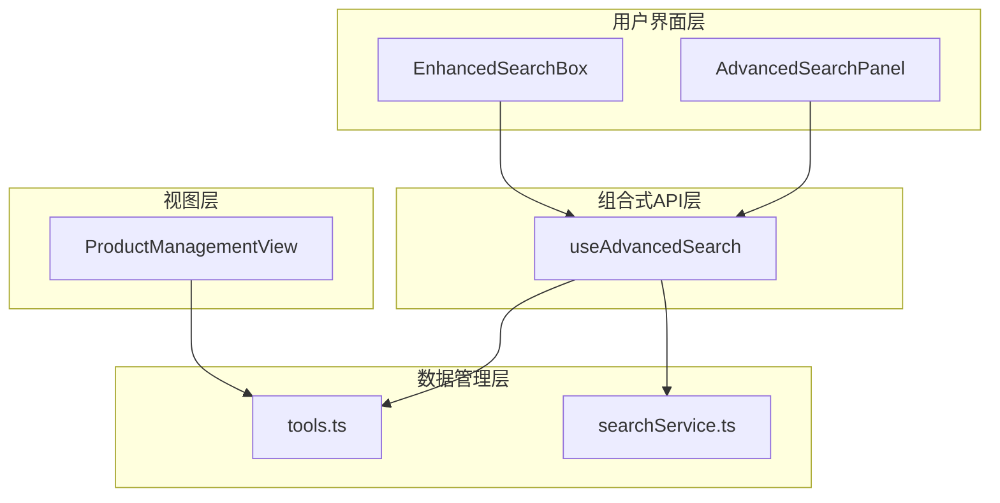
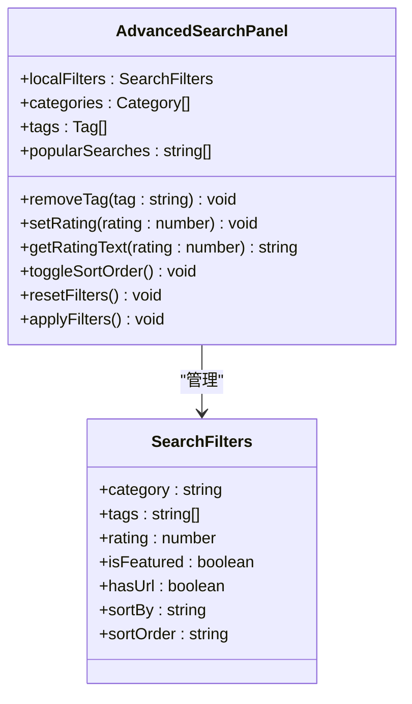
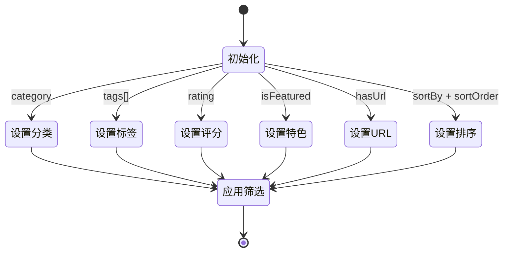
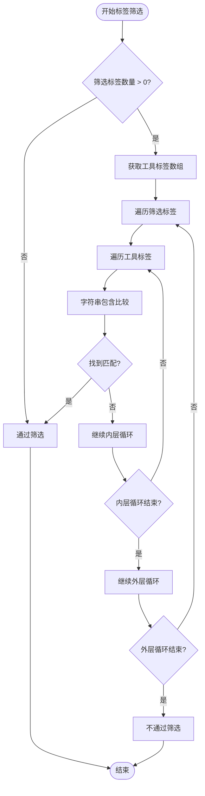

# 筛选逻辑实现

<cite>
**本文档引用的文件**
- [useAdvancedSearch.ts](file://src/composables/useAdvancedSearch.ts)
- [AdvancedSearchPanel.vue](file://src/components/search/AdvancedSearchPanel.vue)
- [EnhancedSearchBox.vue](file://src/components/search/EnhancedSearchBox.vue)
- [tools.ts](file://src/stores/tools.ts)
- [searchService.ts](file://src/services/searchService.ts)
- [ProductManagementView.vue](file://src/views/admin/ProductManagementView.vue)
</cite>

## 目录
1. [简介](#简介)
2. [项目结构概览](#项目结构概览)
3. [核心筛选组件分析](#核心筛选组件分析)
4. [applyFilters函数深度解析](#applyFilters函数深度解析)
5. [响应式筛选对象管理](#响应式筛选对象管理)
6. [标签筛选的双重数组遍历逻辑](#标签筛选的双重数组遍历逻辑)
7. [筛选效率优化策略](#筛选效率优化策略)
8. [多条件组合筛选示例](#多条件组合筛选示例)
9. [评分筛选功能扩展方案](#评分筛选功能扩展方案)
10. [性能考虑与优化](#性能考虑与优化)
11. [故障排除指南](#故障排除指南)
12. [总结](#总结)

## 简介

本项目实现了一个复杂而高效的筛选系统，支持多种筛选条件的组合应用。该系统的核心在于`applyFilters`函数，它负责处理分类、标签、特色工具和URL可用性等筛选条件的实现。通过响应式编程模型和组合式API，系统提供了灵活且高性能的筛选体验。

## 项目结构概览

项目采用模块化架构设计，筛选逻辑分布在多个层次：



**图表来源**
- [EnhancedSearchBox.vue](file://src/components/search/EnhancedSearchBox.vue#L1-L50)
- [AdvancedSearchPanel.vue](file://src/components/search/AdvancedSearchPanel.vue#L1-L50)
- [useAdvancedSearch.ts](file://src/composables/useAdvancedSearch.ts#L1-L50)

## 核心筛选组件分析

### useAdvancedSearch组合式API

`useAdvancedSearch`是整个筛选系统的核心，它封装了搜索和筛选的所有逻辑：

```typescript
export interface SearchFilters {
  category: string;
  tags: string[];
  rating: number;
  isFeatured: boolean;
  hasUrl: boolean;
  sortBy: "name" | "rating" | "clicks" | "created_at";
  sortOrder: "asc" | "desc";
}
```

该接口定义了完整的筛选条件集合，包括：
- **分类筛选**：按类别ID进行精确匹配
- **标签筛选**：支持多标签组合匹配
- **评分筛选**：目前为占位符，暂未实现
- **特色工具筛选**：布尔值控制是否只显示特色工具
- **URL可用性筛选**：检查工具链接是否存在
- **排序选项**：支持多种排序维度和顺序

### AdvancedSearchPanel组件

高级搜索面板提供了直观的用户界面，允许用户设置各种筛选条件：



**图表来源**
- [AdvancedSearchPanel.vue](file://src/components/search/AdvancedSearchPanel.vue#L252-L323)
- [useAdvancedSearch.ts](file://src/composables/useAdvancedSearch.ts#L6-L13)

**章节来源**
- [useAdvancedSearch.ts](file://src/composables/useAdvancedSearch.ts#L1-L306)
- [AdvancedSearchPanel.vue](file://src/components/search/AdvancedSearchPanel.vue#L1-L323)

## applyFilters函数深度解析

`applyFilters`函数是筛选逻辑的核心实现，它对搜索结果进行逐项过滤：

```typescript
const applyFilters = (results: SearchResult[]): SearchResult[] => {
  return results.filter(({ item }) => {
    // 分类筛选
    if (
      filters.value.category &&
      item.category_id !== filters.value.category
    ) {
      return false;
    }

    // 标签筛选
    if (filters.value.tags.length > 0) {
      const itemTags = item.tags || [];
      const hasMatchingTag = filters.value.tags.some((tag) =>
        itemTags.some((itemTag: string) =>
          itemTag.toLowerCase().includes(tag.toLowerCase()),
        ),
      );
      if (!hasMatchingTag) return false;
    }

    // 工具暂无评分系统，跳过评分筛选

    // 特色工具筛选
    if (filters.value.isFeatured && !item.is_featured) {
      return false;
    }

    // URL可用性筛选
    if (filters.value.hasUrl && (!item.url || !item.url.trim())) {
      return false;
    }

    return true;
  });
};
```

### 筛选条件详解

#### 1. 分类筛选
```typescript
if (
  filters.value.category &&
  item.category_id !== filters.value.category
) {
  return false;
}
```
- **实现原理**：使用严格相等比较
- **性能特点**：O(1)时间复杂度
- **边界处理**：空字符串表示不筛选任何分类

#### 2. 标签筛选
```typescript
if (filters.value.tags.length > 0) {
  const itemTags = item.tags || [];
  const hasMatchingTag = filters.value.tags.some((tag) =>
    itemTags.some((itemTag: string) =>
      itemTag.toLowerCase().includes(tag.toLowerCase()),
    ),
  );
  if (!hasMatchingTag) return false;
}
```
- **双重数组遍历**：外层遍历筛选标签，内层遍历工具标签
- **大小写忽略**：统一转换为小写进行比较
- **空数组处理**：确保安全访问

#### 3. 特色工具筛选
```typescript
if (filters.value.isFeatured && !item.is_featured) {
  return false;
}
```
- **布尔值快速判断**：利用短路求值特性
- **性能优势**：早期退出减少不必要的计算

#### 4. URL可用性筛选
```typescript
if (filters.value.hasUrl && (!item.url || !item.url.trim())) {
  return false;
}
```
- **链式条件检查**：先检查开关，再验证URL有效性
- **字符串清理**：使用trim()去除空白字符

**章节来源**
- [useAdvancedSearch.ts](file://src/composables/useAdvancedSearch.ts#L118-L150)

## 响应式筛选对象管理

### filters响应式对象的数据结构



### 响应式监听机制

系统通过Vue的响应式系统自动追踪筛选条件的变化：

```typescript
watch(
  localFilters,
  () => {
    applyFilters();
  },
  { deep: true },
);
```

这种设计的优势：
- **自动更新**：任何筛选条件变化都会触发重新筛选
- **深度监听**：支持嵌套对象的变更检测
- **性能优化**：只有当实际值发生变化时才重新计算

**章节来源**
- [AdvancedSearchPanel.vue](file://src/components/search/AdvancedSearchPanel.vue#L252-L323)
- [useAdvancedSearch.ts](file://src/composables/useAdvancedSearch.ts#L217-L271)

## 标签筛选的双重数组遍历逻辑

### 匹配逻辑实现

标签筛选采用了双重数组遍历策略来实现灵活的匹配：



**图表来源**
- [useAdvancedSearch.ts](file://src/composables/useAdvancedSearch.ts#L128-L135)

### 优化策略

虽然双重数组遍历的时间复杂度为O(n*m)，但在实际应用中表现良好：

1. **早期退出**：一旦找到匹配就立即返回
2. **字符串缓存**：避免重复的toLowerCase()调用
3. **空值检查**：确保安全访问数组元素

```typescript
const hasMatchingTag = filters.value.tags.some((tag) =>
  itemTags.some((itemTag: string) =>
    itemTag.toLowerCase().includes(tag.toLowerCase()),
  ),
);
```

**章节来源**
- [useAdvancedSearch.ts](file://src/composables/useAdvancedSearch.ts#L128-L135)

## 筛选效率优化策略

### 短路判断提高筛选效率

系统广泛使用短路求值来优化筛选性能：

```typescript
// 特色工具筛选 - 早期退出
if (filters.value.isFeatured && !item.is_featured) {
  return false;
}

// URL可用性筛选 - 条件链
if (filters.value.hasUrl && (!item.url || !item.url.trim())) {
  return false;
}

// 分类筛选 - 空值检查
if (
  filters.value.category &&
  item.category_id !== filters.value.category
) {
  return false;
}
```

### 单次遍历优化

在某些场景下，系统采用单次遍历策略：

```typescript
const filtered = products.value.filter((product) => {
  // 搜索过滤
  if (search) {
    const searchLower = search.toLowerCase();
    const matchesSearch =
      product.name.toLowerCase().includes(searchLower) ||
      product.description.toLowerCase().includes(searchLower);
    if (!matchesSearch) return false;
  }

  // 状态过滤
  if (status && product.status !== status) return false;

  // 分类过滤
  if (category && product.category_id !== category) return false;

  return true;
});
```

这种设计的优势：
- **减少内存分配**：避免中间数组的创建
- **提前退出**：一旦不符合条件就立即返回
- **批量处理**：一次遍历完成多项过滤

**章节来源**
- [ProductManagementView.vue](file://src/views/admin/ProductManagementView.vue#L452-L500)

## 多条件组合筛选示例

### 实际代码示例

以下是一个完整的多条件组合筛选示例：

```typescript
// 示例数据
const tools = [
  {
    id: "tool-1",
    name: "AI助手",
    category_id: "cat-1",
    tags: ["AI", "助手"],
    is_featured: true,
    url: "https://example.com/ai",
    click_count: 100
  },
  {
    id: "tool-2",
    name: "数据分析工具",
    category_id: "cat-2",
    tags: ["数据分析", "可视化"],
    is_featured: false,
    url: null,
    click_count: 50
  }
];

// 筛选条件
const filters = {
  category: "cat-1",
  tags: ["AI"],
  isFeatured: true,
  hasUrl: true
};

// 应用筛选
const filteredTools = tools.filter(tool => {
  // 分类筛选
  if (filters.category && tool.category_id !== filters.category) {
    return false;
  }
  
  // 标签筛选
  if (filters.tags.length > 0) {
    const hasMatchingTag = filters.tags.some(tag =>
      tool.tags.some(itemTag => 
        itemTag.toLowerCase().includes(tag.toLowerCase())
      )
    );
    if (!hasMatchingTag) return false;
  }
  
  // 特色工具筛选
  if (filters.isFeatured && !tool.is_featured) {
    return false;
  }
  
  // URL可用性筛选
  if (filters.hasUrl && (!tool.url || !tool.url.trim())) {
    return false;
  }
  
  return true;
});

console.log(filteredTools); // 输出符合条件的工具
```

### 筛选效果演示

假设我们有以下筛选条件：
- **分类**：科技工具
- **标签**：AI、自动化
- **特色工具**：是
- **URL可用**：是

系统会按照以下顺序进行筛选：
1. 首先排除不属于"科技工具"分类的工具
2. 然后排除不包含"AI"或"自动化"标签的工具
3. 接着排除非特色工具
4. 最后排除没有有效URL的工具

**章节来源**
- [useAdvancedSearch.ts](file://src/composables/useAdvancedSearch.ts#L118-L150)

## 评分筛选功能扩展方案

### 当前实现状态

目前系统中评分筛选功能处于占位状态：

```typescript
// 工具暂无评分系统，跳过评分加分
```

### 潜在扩展方案

#### 方案一：添加评分字段

```typescript
interface ToolExtended extends ToolBase {
  rating: number; // 添加评分字段
  rating_count: number; // 评分人数
  rating_distribution: { [key: number]: number }; // 评分分布
}

// 扩展筛选条件
export interface SearchFilters {
  category: string;
  tags: string[];
  rating: number; // 新增评分筛选
  isFeatured: boolean;
  hasUrl: boolean;
  sortBy: "name" | "rating" | "clicks" | "created_at";
  sortOrder: "asc" | "desc";
}
```

#### 方案二：评分筛选实现

```typescript
// 评分筛选逻辑
if (filters.value.rating > 0) {
  const minRating = filters.value.rating;
  if (item.rating < minRating) {
    return false;
  }
}

// 排序时使用评分
case "rating":
  comparison = (a.item.rating || 0) - (b.item.rating || 0);
  break;
```

#### 方案三：评分分布筛选

```typescript
// 支持特定评分分布的筛选
if (filters.value.ratingDistribution) {
  const distribution = filters.value.ratingDistribution;
  const ratingMatch = Object.keys(distribution).every(rating => {
    const count = item.rating_distribution[parseInt(rating)] || 0;
    return count >= distribution[parseInt(rating)];
  });
  if (!ratingMatch) return false;
}
```

### 扩展实施步骤

1. **数据库迁移**：添加评分相关字段
2. **数据模型扩展**：更新TypeScript类型定义
3. **API接口调整**：支持评分数据的查询和筛选
4. **前端UI更新**：添加评分筛选控件
5. **性能优化**：建立评分相关的索引

**章节来源**
- [useAdvancedSearch.ts](file://src/composables/useAdvancedSearch.ts#L88-L90)

## 性能考虑与优化

### 时间复杂度分析

| 筛选条件 | 时间复杂度 | 优化策略 |
|---------|-----------|----------|
| 分类筛选 | O(1) | 早期退出 |
| 标签筛选 | O(n*m) | 双重数组遍历 |
| 特色工具筛选 | O(1) | 短路求值 |
| URL可用性筛选 | O(1) | 简单条件检查 |

### 内存使用优化

1. **惰性计算**：使用computed属性延迟计算
2. **引用共享**：避免不必要的数据复制
3. **垃圾回收**：及时释放不再使用的筛选结果

### 缓存策略

```typescript
// 结果缓存
const cachedResults = new Map<string, SearchResult[]>();

const getCachedResults = (key: string): SearchResult[] | undefined => {
  return cachedResults.get(key);
};

const setCachedResults = (key: string, results: SearchResult[]): void => {
  cachedResults.set(key, results);
  // 限制缓存大小
  if (cachedResults.size > 100) {
    const firstKey = cachedResults.keys().next().value;
    cachedResults.delete(firstKey);
  }
};
```

## 故障排除指南

### 常见问题及解决方案

#### 1. 筛选结果为空

**症状**：应用筛选后没有返回任何结果

**可能原因**：
- 筛选条件过于严格
- 数据源为空
- 条件冲突

**解决方案**：
```typescript
// 检查筛选条件
console.log('当前筛选条件:', filters.value);
console.log('可用工具数量:', toolsStore.tools.length);

// 重置筛选条件
resetFilters();
```

#### 2. 标签筛选不生效

**症状**：选择了标签但筛选结果不变

**可能原因**：
- 标签名称大小写不匹配
- 标签格式不一致
- 数据清洗问题

**解决方案**：
```typescript
// 标准化标签处理
const normalizedTags = filters.value.tags.map(tag => 
  tag.toLowerCase().trim()
);

const hasMatchingTag = normalizedTags.some(tag =>
  itemTags.some(itemTag => 
    itemTag.toLowerCase().trim().includes(tag)
  )
);
```

#### 3. 性能问题

**症状**：筛选操作响应缓慢

**可能原因**：
- 数据量过大
- 筛选条件过多
- 重复计算

**解决方案**：
```typescript
// 使用防抖处理频繁筛选
const debouncedApplyFilters = debounce(() => {
  applyFilters();
}, 300);

// 分批处理大数据集
const processBatch = (items: Tool[], batchSize = 100) => {
  for (let i = 0; i < items.length; i += batchSize) {
    const batch = items.slice(i, i + batchSize);
    // 处理批次
  }
};
```

**章节来源**
- [useAdvancedSearch.ts](file://src/composables/useAdvancedSearch.ts#L217-L271)

## 总结

本项目实现了一个功能完整、性能优良的筛选系统。通过`applyFilters`函数的精心设计，系统能够高效地处理多种筛选条件的组合应用。主要特点包括：

1. **灵活的筛选条件**：支持分类、标签、特色工具、URL可用性等多种筛选维度
2. **高效的双重数组遍历**：在标签筛选中实现了灵活的匹配逻辑
3. **响应式编程模型**：通过Vue的响应式系统实现自动更新
4. **性能优化策略**：广泛使用短路求值和早期退出机制
5. **可扩展架构**：为未来的评分筛选功能预留了扩展空间

该系统不仅满足了当前的功能需求，还为未来的功能扩展奠定了良好的技术基础。通过合理的架构设计和性能优化，系统能够在保持灵活性的同时提供优秀的用户体验。