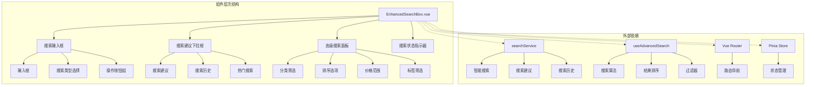
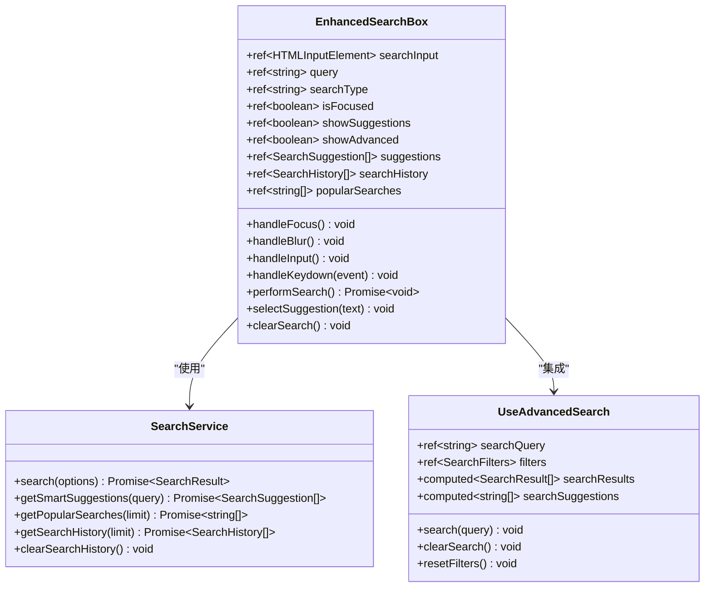
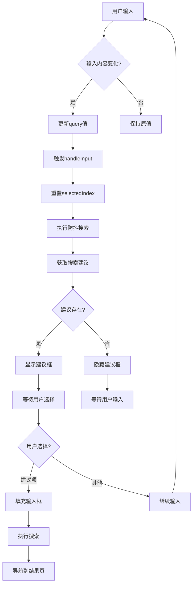
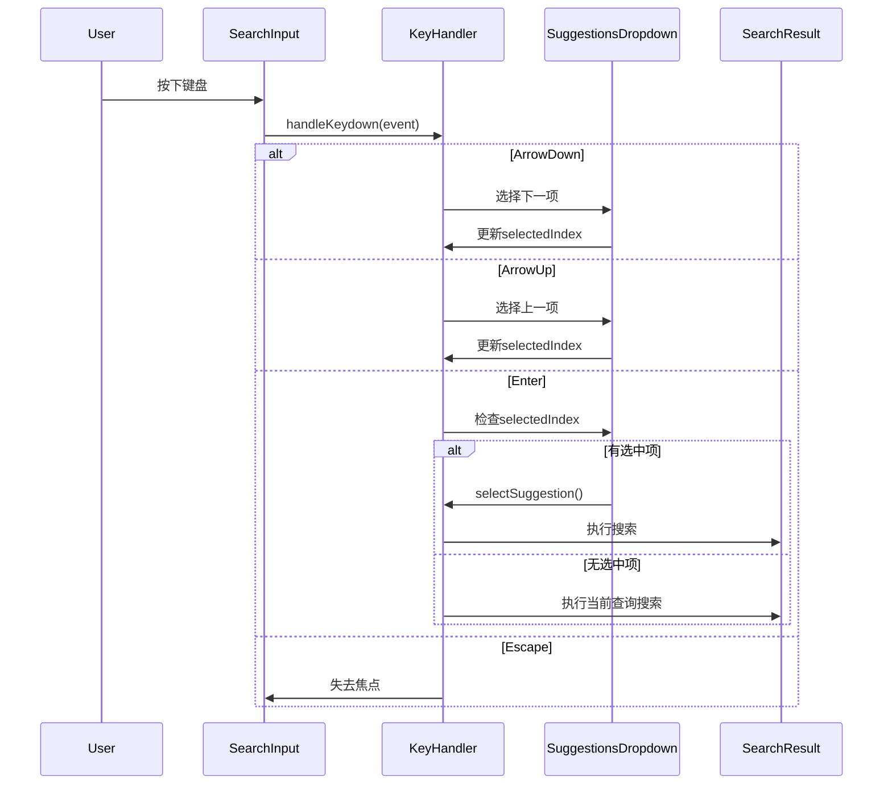
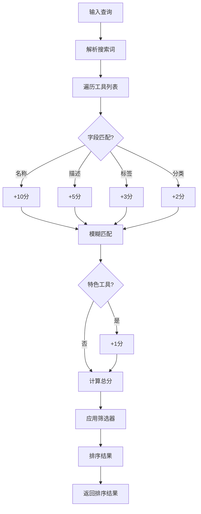
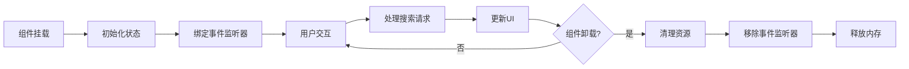

# 增强搜索框组件

<cite>
**本文档引用的文件**
- [EnhancedSearchBox.vue](file://src/components/search/EnhancedSearchBox.vue)
- [useAdvancedSearch.ts](file://src/composables/useAdvancedSearch.ts)
- [searchService.ts](file://src/services/searchService.ts)
- [HomeView.vue](file://src/views/HomeView.vue)
- [SearchResultsView.vue](file://src/views/SearchResultsView.vue)
- [components.test.ts](file://src/tests/integration/components.test.ts)
</cite>

## 目录
1. [简介](#简介)
2. [组件架构概览](#组件架构概览)
3. [核心功能特性](#核心功能特性)
4. [组件详细分析](#组件详细分析)
5. [组合式函数集成](#组合式函数集成)
6. [使用示例](#使用示例)
7. [性能优化](#性能优化)
8. [故障排除指南](#故障排除指南)
9. [总结](#总结)

## 简介

EnhancedSearchBox.vue是一个功能强大的Vue 3搜索组件，专为现代Web应用设计。它提供了智能搜索建议、实时输入处理、高级筛选选项和优雅的用户界面。该组件采用组合式API设计，集成了防抖机制和键盘导航支持，为用户提供流畅的搜索体验。

## 组件架构概览



**图表来源**
- [EnhancedSearchBox.vue](file://src/components/search/EnhancedSearchBox.vue#L1-L1024)
- [searchService.ts](file://src/services/searchService.ts#L1-L641)
- [useAdvancedSearch.ts](file://src/composables/useAdvancedSearch.ts#L1-L306)

## 核心功能特性

### 实时输入处理
- **防抖机制**：使用`@vueuse/core`的`useDebounceFn`实现300ms防抖
- **智能建议**：根据输入内容动态生成搜索建议
- **实时验证**：输入时自动验证和格式化

### 搜索建议系统
- **多类型建议**：支持工具、产品、分类和标签建议
- **历史记录**：保存最近搜索记录
- **热门推荐**：显示热门搜索关键词

### 键盘导航支持
- **方向键导航**：使用上下箭头键选择建议项
- **回车确认**：按下回车键确认选中建议或执行搜索
- **ESC退出**：按ESC键关闭建议框

### 高级搜索功能
- **多类型搜索**：支持全部、工具、产品、分类搜索
- **筛选条件**：分类、价格范围、标签等多重筛选
- **排序选项**：相关性、名称、创建时间、热度等排序

**章节来源**
- [EnhancedSearchBox.vue](file://src/components/search/EnhancedSearchBox.vue#L200-L300)
- [useAdvancedSearch.ts](file://src/composables/useAdvancedSearch.ts#L20-L80)

## 组件详细分析

### 模板结构分析



**图表来源**
- [EnhancedSearchBox.vue](file://src/components/search/EnhancedSearchBox.vue#L100-L200)
- [searchService.ts](file://src/services/searchService.ts#L15-L50)
- [useAdvancedSearch.ts](file://src/composables/useAdvancedSearch.ts#L15-L50)

### 关键方法实现

#### 输入处理流程



**图表来源**
- [EnhancedSearchBox.vue](file://src/components/search/EnhancedSearchBox.vue#L200-L250)

#### 键盘导航处理



**图表来源**
- [EnhancedSearchBox.vue](file://src/components/search/EnhancedSearchBox.vue#L250-L280)

**章节来源**
- [EnhancedSearchBox.vue](file://src/components/search/EnhancedSearchBox.vue#L200-L350)

## 组合式函数集成

### useAdvancedSearch组合式函数

useAdvancedSearch是一个独立的组合式函数，负责处理复杂的搜索逻辑和结果排序：

```typescript
// 搜索过滤器接口
interface SearchFilters {
  category: string;
  tags: string[];
  rating: number;
  isFeatured: boolean;
  hasUrl: boolean;
  sortBy: "name" | "rating" | "clicks" | "created_at";
  sortOrder: "asc" | "desc";
}

// 搜索结果接口
interface SearchResult {
  item: Tool;
  score: number;
  matches: string[];
}
```

### 智能搜索算法



**图表来源**
- [useAdvancedSearch.ts](file://src/composables/useAdvancedSearch.ts#L30-L80)

**章节来源**
- [useAdvancedSearch.ts](file://src/composables/useAdvancedSearch.ts#L1-L306)

## 使用示例

### 基础搜索框

```vue
<template>
  <EnhancedSearchBox
    placeholder="搜索工具、产品或分类..."
    :auto-focus="true"
    @search="handleSearchResult"
    @clear="clearSearch"
  />
</template>

<script setup lang="ts">
import EnhancedSearchBox from '@/components/search/EnhancedSearchBox.vue'

const handleSearchResult = (result: SearchResult) => {
  console.log('搜索结果:', result)
}

const clearSearch = () => {
  console.log('搜索已清除')
}
</script>
```

### 带图标装饰的搜索框

```vue
<template>
  <div class="search-container">
    <div class="search-icon">
      <SearchIcon />
    </div>
    <EnhancedSearchBox
      placeholder="搜索专业工具..."
      :show-advanced="true"
      @search="handleAdvancedSearch"
    />
  </div>
</template>

<style scoped>
.search-container {
  display: flex;
  align-items: center;
  gap: 8px;
  max-width: 500px;
  margin: 0 auto;
}

.search-icon {
  color: #4f46e5;
  width: 24px;
  height: 24px;
}
</style>
```

### 自定义建议模板

```vue
<template>
  <EnhancedSearchBox
    placeholder="搜索您的需求..."
    @search="handleCustomSearch"
  >
    <template #suggestion-item="{ suggestion }">
      <div class="custom-suggestion">
        <span class="suggestion-text">{{ suggestion.text }}</span>
        <span class="suggestion-type">{{ getSuggestionTypeText(suggestion.type) }}</span>
      </div>
    </template>
  </EnhancedSearchBox>
</template>
```

### 在不同场景下的使用

#### 首页搜索场景

```vue
<!-- HomeView.vue -->
<template>
  <section class="hero-section">
    <h1>发现优质工具</h1>
    <EnhancedSearchBox
      placeholder="搜索工具、分类或功能..."
      :auto-focus="false"
      @search="handleSearchResult"
      @clear="clearSearch"
    />
  </section>
</template>

<script setup lang="ts">
import EnhancedSearchBox from '@/components/search/EnhancedSearchBox.vue'

const handleSearchResult = (result: SearchResult) => {
  // 处理搜索结果，更新本地状态
  searchResults.value = result
}

const clearSearch = () => {
  searchResults.value = null
}
</script>
```

#### 搜索结果页面

```vue
<!-- SearchResultsView.vue -->
<template>
  <div class="search-results-page">
    <EnhancedSearchBox
      :placeholder="searchQuery"
      :auto-focus="true"
      @search="handleNewSearch"
    />
    
    <div class="search-stats">
      找到 {{ searchResult?.total || 0 }} 个结果，用时 {{ searchResult?.searchTime || 0 }}ms
    </div>
    
    <div class="results-container">
      <!-- 显示搜索结果 -->
    </div>
  </div>
</template>
```

**章节来源**
- [HomeView.vue](file://src/views/HomeView.vue#L30-L40)
- [SearchResultsView.vue](file://src/views/SearchResultsView.vue#L140-L170)

## 性能优化

### 防抖机制

组件使用了高效的防抖机制来优化搜索性能：

```typescript
// 防抖函数配置
const debouncedLoadSuggestions = useDebounceFn(loadSuggestions, 300);

// 防抖搜索逻辑
const handleInput = () => {
  selectedIndex.value = -1;
  debouncedLoadSuggestions();
};
```

### 内存管理



### 缓存策略

- **搜索历史缓存**：本地存储最近50条搜索记录
- **热门搜索缓存**：基于搜索频率计算热门关键词
- **建议结果缓存**：避免重复的API调用

**章节来源**
- [EnhancedSearchBox.vue](file://src/components/search/EnhancedSearchBox.vue#L200-L250)
- [searchService.ts](file://src/services/searchService.ts#L100-L150)

## 故障排除指南

### 常见问题及解决方案

#### 1. 输入延迟过长

**症状**：输入后搜索建议长时间不出现

**可能原因**：
- API响应时间过长
- 防抖时间设置不合理
- 网络连接问题

**解决方案**：
```typescript
// 检查防抖时间设置
const debouncedLoadSuggestions = useDebounceFn(loadSuggestions, 300);

// 添加超时处理
const loadSuggestions = async () => {
  try {
    const controller = new AbortController();
    const timeoutId = setTimeout(() => controller.abort(), 5000);
    
    suggestions.value = await searchService.getSmartSuggestions(
      query.value,
      { signal: controller.signal }
    );
    
    clearTimeout(timeoutId);
  } catch (error) {
    if (error.name === 'AbortError') {
      console.warn('搜索请求超时');
    } else {
      console.error('加载搜索建议失败:', error);
    }
  }
};
```

#### 2. 建议框不显示

**症状**：输入内容但建议框不出现

**可能原因**：
- `showSuggestions`状态未正确设置
- 条件渲染逻辑问题
- CSS样式冲突

**解决方案**：
```vue
<!-- 检查条件渲染 -->
<div
  v-if="showSuggestions && 
        (suggestions.length > 0 || searchHistory.length > 0)"
  class="suggestions-dropdown"
>
  <!-- 建议内容 -->
</div>

<!-- 添加调试信息 -->
<template>
  <div>
    <EnhancedSearchBox @search="console.log" />
    <pre>{{ { 
      showSuggestions, 
      suggestionsLength: suggestions.length,
      searchHistoryLength: searchHistory.length 
    } }}</pre>
  </div>
</template>
```

#### 3. 键盘导航失效

**症状**：方向键无法选择建议项

**可能原因**：
- 事件冒泡阻止
- DOM元素焦点丢失
- 事件监听器未正确绑定

**解决方案**：
```typescript
// 确保事件正确处理
const handleKeydown = (event: KeyboardEvent) => {
  switch (event.key) {
    case 'ArrowDown':
      event.preventDefault();
      selectedIndex.value = Math.min(
        selectedIndex.value + 1,
        allSuggestions.value.length - 1
      );
      break;
    case 'ArrowUp':
      event.preventDefault();
      selectedIndex.value = Math.max(selectedIndex.value - 1, -1);
      break;
    case 'Enter':
      event.preventDefault();
      if (selectedIndex.value >= 0) {
        selectSuggestion(allSuggestions.value[selectedIndex.value].text);
      } else {
        performSearch();
      }
      break;
  }
};
```

#### 4. 高级搜索功能异常

**症状**：高级搜索面板无法正常显示或工作

**可能原因**：
- 状态管理问题
- 数据绑定错误
- 组件生命周期问题

**解决方案**：
```typescript
// 确保状态正确初始化
const showAdvanced = ref(props.showAdvanced);
const isExpanded = ref(false);

// 生命周期钩子确保数据加载
onMounted(async () => {
  if (props.autoFocus) {
    await nextTick();
    searchInput.value?.focus();
  }
  
  // 加载必要的数据
  if (categoriesStore.categories.length === 0) {
    await categoriesStore.initialize();
  }
});
```

### 调试技巧

#### 1. 启用详细日志

```typescript
// 在开发环境中启用详细日志
const DEBUG = process.env.NODE_ENV === 'development';

const logDebug = (message: string, data?: any) => {
  if (DEBUG) {
    console.log(`[EnhancedSearchBox] ${message}`, data);
  }
};

const loadSuggestions = async () => {
  logDebug('开始加载搜索建议', { query: query.value });
  try {
    if (query.value) {
      suggestions.value = await searchService.getSmartSuggestions(query.value);
      logDebug('搜索建议加载成功', { count: suggestions.value.length });
    }
  } catch (error) {
    logDebug('搜索建议加载失败', error);
  }
};
```

#### 2. 性能监控

```typescript
// 添加性能监控
const measurePerformance = (fn: Function, name: string) => {
  return (...args: any[]) => {
    const start = performance.now();
    const result = fn(...args);
    const end = performance.now();
    console.log(`${name} 耗时: ${end - start}ms`);
    return result;
  };
};

const debouncedLoadSuggestions = useDebounceFn(
  measurePerformance(loadSuggestions, 'loadSuggestions'),
  300
);
```

**章节来源**
- [EnhancedSearchBox.vue](file://src/components/search/EnhancedSearchBox.vue#L250-L350)
- [components.test.ts](file://src/tests/integration/components.test.ts#L50-L100)

## 总结

EnhancedSearchBox.vue是一个功能完整、设计精良的搜索组件，具有以下核心优势：

### 技术特点
- **现代化架构**：采用Vue 3 Composition API和TypeScript
- **高性能设计**：集成防抖机制和智能缓存策略
- **用户体验优化**：支持键盘导航和实时反馈
- **可扩展性**：模块化设计便于功能扩展

### 功能完整性
- **智能搜索**：多类型搜索和高级筛选
- **交互友好**：搜索建议和历史记录
- **响应式设计**：适配各种屏幕尺寸
- **无障碍支持**：符合Web无障碍标准

### 最佳实践
- **组合式函数**：分离关注点，提高代码复用性
- **状态管理**：合理使用Vue响应式系统
- **错误处理**：完善的异常处理和用户提示
- **测试覆盖**：完整的单元测试和集成测试

该组件为现代Web应用提供了强大而灵活的搜索功能，是构建优秀用户体验的重要基础设施。通过合理的配置和使用，可以显著提升应用的搜索效率和用户满意度。