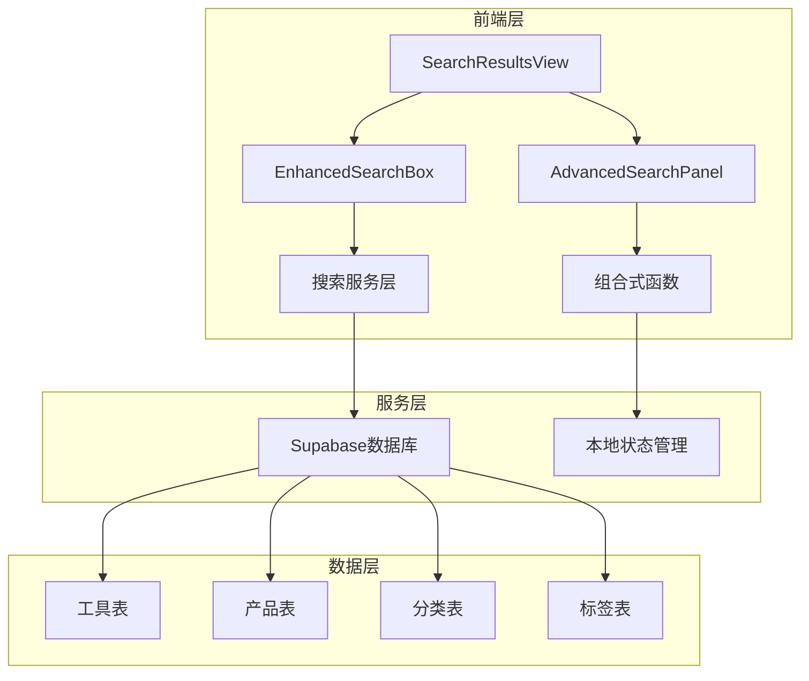
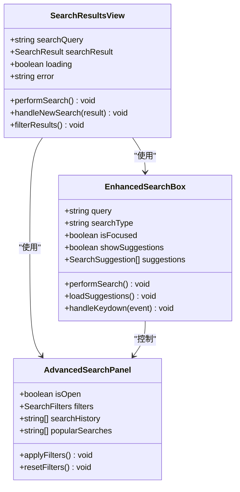
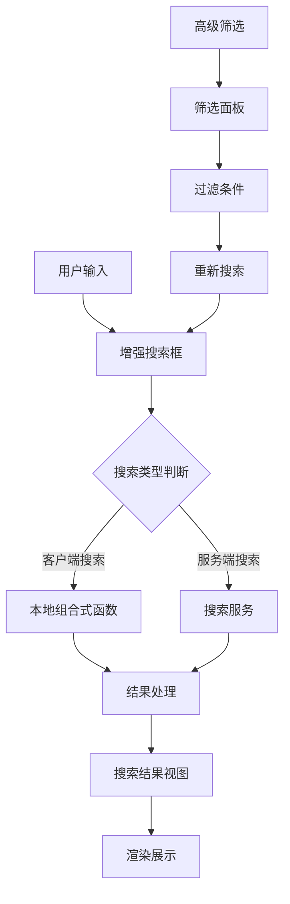
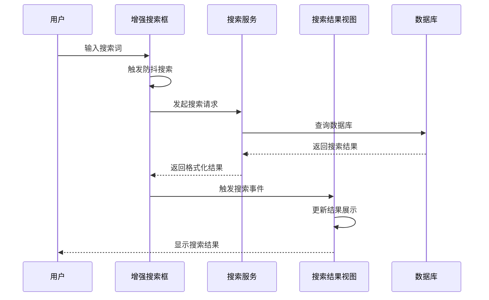
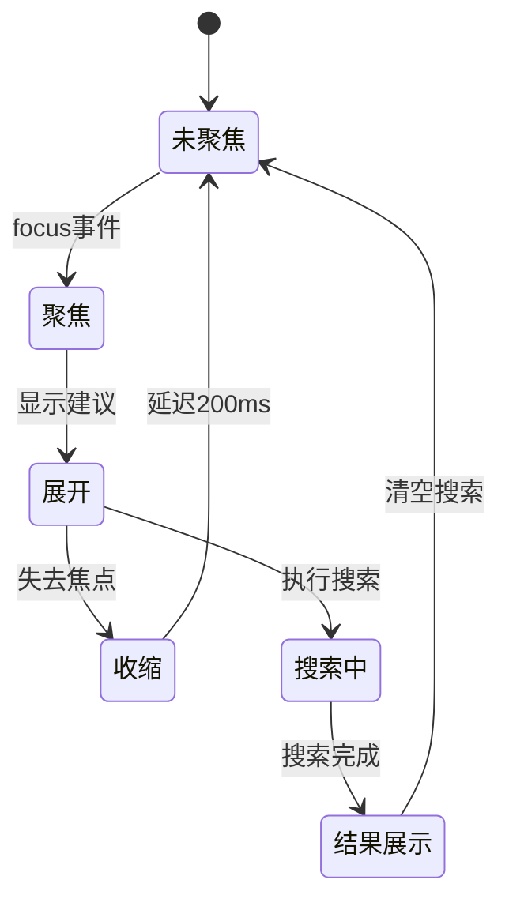
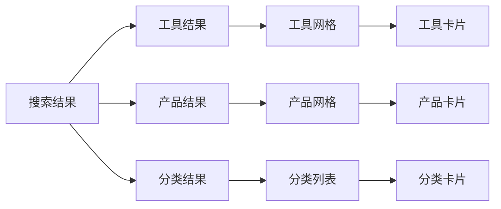
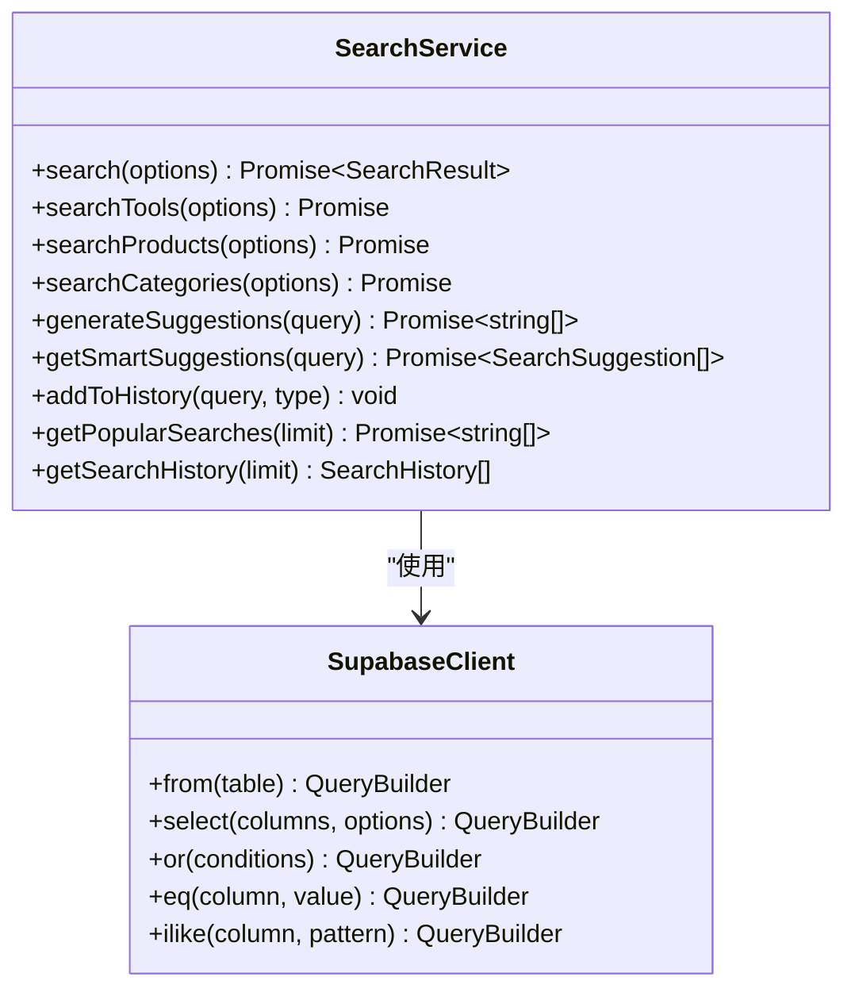
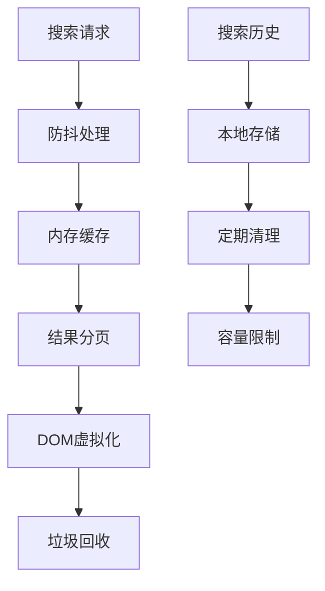
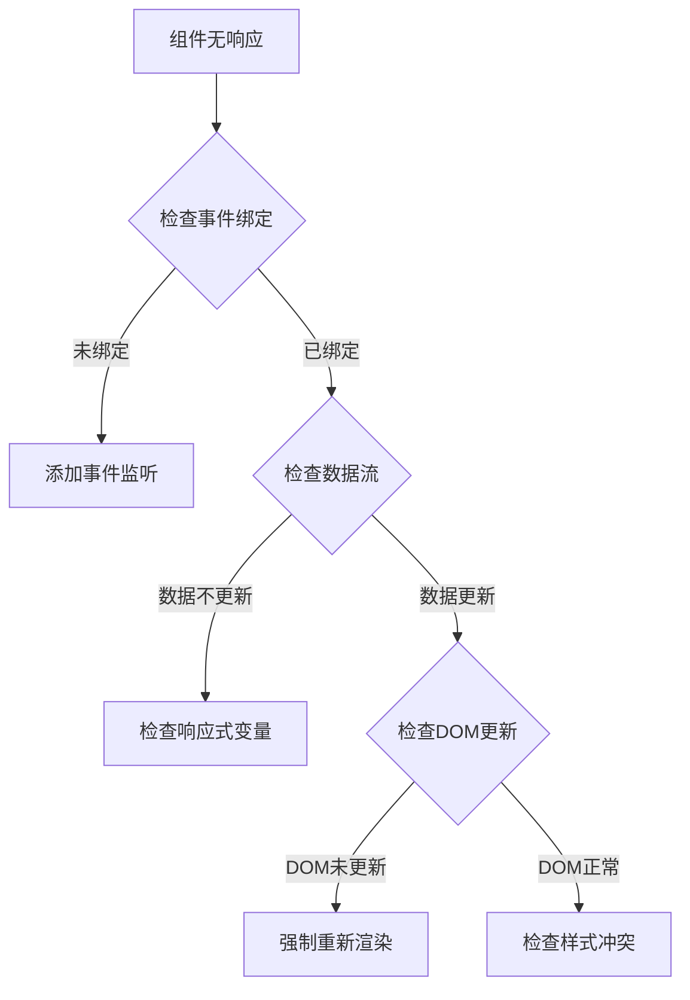

# 搜索UI组件设计与实现

<cite>
**本文档引用的文件**
- [SearchResultsView.vue](file://src/views/SearchResultsView.vue)
- [EnhancedSearchBox.vue](file://src/components/search/EnhancedSearchBox.vue)
- [AdvancedSearchPanel.vue](file://src/components/search/AdvancedSearchPanel.vue)
- [searchService.ts](file://src/services/searchService.ts)
- [useAdvancedSearch.ts](file://src/composables/useAdvancedSearch.ts)
- [index.ts](file://src/types/index.ts)
- [index.ts](file://src/router/index.ts)
</cite>

## 目录
1. [简介](#简介)
2. [项目架构概览](#项目架构概览)
3. [核心组件分析](#核心组件分析)
4. [架构设计](#架构设计)
5. [详细组件实现](#详细组件实现)
6. [搜索服务层](#搜索服务层)
7. [性能优化策略](#性能优化策略)
8. [使用示例与定制](#使用示例与定制)
9. [故障排除指南](#故障排除指南)
10. [总结](#总结)

## 简介

本文档详细介绍了基于Vue 3和TypeScript构建的现代化搜索UI组件系统。该系统包含三个核心组件：EnhancedSearchBox（增强搜索框）、AdvancedSearchPanel（高级搜索面板）和SearchResultsView（搜索结果视图），以及配套的服务层和组合式函数，为用户提供强大而直观的搜索体验。

系统采用模块化设计，支持客户端和服务端搜索功能，具备智能搜索建议、实时筛选、分面导航等高级特性，同时保持良好的性能表现和用户体验。

## 项目架构概览



**图表来源**
- [SearchResultsView.vue](file://src/views/SearchResultsView.vue#L1-L50)
- [EnhancedSearchBox.vue](file://src/components/search/EnhancedSearchBox.vue#L1-L50)
- [searchService.ts](file://src/services/searchService.ts#L1-L50)

## 核心组件分析

### 组件层次结构



**图表来源**
- [SearchResultsView.vue](file://src/views/SearchResultsView.vue#L100-L200)
- [EnhancedSearchBox.vue](file://src/components/search/EnhancedSearchBox.vue#L300-L400)
- [AdvancedSearchPanel.vue](file://src/components/search/AdvancedSearchPanel.vue#L1-L100)

**章节来源**
- [SearchResultsView.vue](file://src/views/SearchResultsView.vue#L1-L571)
- [EnhancedSearchBox.vue](file://src/components/search/EnhancedSearchBox.vue#L1-L1024)
- [AdvancedSearchPanel.vue](file://src/components/search/AdvancedSearchPanel.vue#L1-L596)

## 架构设计

### 整体架构模式

系统采用MVVM架构模式，结合组合式API和响应式编程思想：



**图表来源**
- [EnhancedSearchBox.vue](file://src/components/search/EnhancedSearchBox.vue#L400-L500)
- [useAdvancedSearch.ts](file://src/composables/useAdvancedSearch.ts#L1-L100)

### 数据流设计



**图表来源**
- [EnhancedSearchBox.vue](file://src/components/search/EnhancedSearchBox.vue#L350-L450)
- [searchService.ts](file://src/services/searchService.ts#L50-L150)

## 详细组件实现

### EnhancedSearchBox组件详解

EnhancedSearchBox是整个搜索系统的核心组件，提供了完整的搜索体验：

#### 核心功能特性

1. **智能搜索建议**
   - 实时搜索建议生成
   - 多类型建议（工具、产品、分类、标签）
   - 搜索历史集成
   - 热门搜索推荐

2. **键盘导航支持**
   - 方向键导航
   - Enter键选择
   - Escape键关闭
   - Tab键切换焦点

3. **高级搜索功能**
   - 分类筛选
   - 标签过滤
   - 价格范围选择
   - 排序选项

#### 技术实现细节

```typescript
// 搜索建议加载逻辑
const loadSuggestions = async () => {
  try {
    if (query.value) {
      suggestions.value = await searchService.getSmartSuggestions(query.value);
    } else {
      suggestions.value = [];
      searchHistory.value = searchService.getSearchHistory(5);
      popularSearches.value = await searchService.getPopularSearches(8);
    }
  } catch (error) {
    console.error("加载搜索建议失败:", error);
  }
};

// 键盘导航处理
const handleKeydown = (event: KeyboardEvent) => {
  switch (event.key) {
    case "ArrowDown":
      event.preventDefault();
      selectedIndex.value = Math.min(
        selectedIndex.value + 1,
        allSuggestions.value.length - 1,
      );
      break;
    case "ArrowUp":
      event.preventDefault();
      selectedIndex.value = Math.max(selectedIndex.value - 1, -1);
      break;
    case "Enter":
      event.preventDefault();
      if (selectedIndex.value >= 0) {
        selectSuggestion(allSuggestions.value[selectedIndex.value].text);
      } else {
        performSearch();
      }
      break;
    case "Escape":
      searchInput.value?.blur();
      break;
  }
};
```

#### 组件状态管理



**图表来源**
- [EnhancedSearchBox.vue](file://src/components/search/EnhancedSearchBox.vue#L320-L380)

**章节来源**
- [EnhancedSearchBox.vue](file://src/components/search/EnhancedSearchBox.vue#L300-L600)

### AdvancedSearchPanel组件详解

AdvancedSearchPanel提供了强大的高级筛选功能：

#### 筛选功能模块

1. **分类筛选**
   - 下拉菜单选择
   - 层级分类支持
   - 分类统计信息

2. **标签筛选**
   - 多标签选择
   - 热门标签推荐
   - 自定义标签输入

3. **评分筛选**
   - 星级评分显示
   - 动态评分计算
   - 清除功能

4. **特殊筛选**
   - 特色工具显示
   - 可访问工具筛选

#### 实时筛选机制

```typescript
// 筛选器监听器
watch(
  localFilters,
  () => {
    applyFilters();
  },
  { deep: true },
);

// 应用筛选器
const applyFilters = () => {
  emit("update:filters", { ...localFilters.value });
};
```

**章节来源**
- [AdvancedSearchPanel.vue](file://src/components/search/AdvancedSearchPanel.vue#L1-L300)

### SearchResultsView组件详解

SearchResultsView负责协调搜索结果的展示：

#### 结果展示架构



**图表来源**
- [SearchResultsView.vue](file://src/views/SearchResultsView.vue#L200-L300)

#### 搜索结果处理

```typescript
// 结果类型过滤
const toolResults = computed(() => {
  if (!searchResult.value) return [];
  return searchResult.value.items.filter(
    (item) =>
      item.type === "tool" ||
      !item.type ||
      item.hasOwnProperty("clickCount") ||
      item.hasOwnProperty("category_id"),
  );
});

const productResults = computed(() => {
  if (!searchResult.value) return [];
  return searchResult.value.items.filter(
    (item) =>
      item.type === "product" ||
      item.hasOwnProperty("price") ||
      item.hasOwnProperty("rating"),
  );
});
```

**章节来源**
- [SearchResultsView.vue](file://src/views/SearchResultsView.vue#L100-L200)

## 搜索服务层

### 搜索服务架构



**图表来源**
- [searchService.ts](file://src/services/searchService.ts#L1-L100)

### 搜索算法实现

#### 全文搜索优化

```typescript
// 工具搜索实现
private async searchTools(options: SearchOptions): Promise<{
  items: Tool[];
  total: number;
  facets: SearchFacets;
}> {
  let queryBuilder = supabase.from(TABLES.TOOLS).select(
    `
      *,
      categories!inner(name, icon, color),
      tool_tags!inner(tags!inner(name, color))
    `,
    { count: "exact" },
  );

  // 全文搜索
  if (query) {
    queryBuilder = queryBuilder.or(`
      name.ilike.%${query}%,
      description.ilike.%${query}%,
      meta_title.ilike.%${query}%,
      meta_description.ilike.%${query}%
    `);
  }

  // 相关性排序
  if (sortBy === "relevance" && query) {
    queryBuilder = queryBuilder.order("is_featured", { ascending: false });
    queryBuilder = queryBuilder.order("click_count", { ascending: false });
  }
}
```

#### 分面搜索实现

```typescript
// 生成工具分面数据
private async generateToolsFacets(query?: string): Promise<SearchFacets> {
  // 获取分类分面
  const categoriesQuery = supabase
    .from(TABLES.CATEGORIES)
    .select(
      `
        id, name,
        tools!inner(id)
      `,
      { count: "exact" },
    )
    .eq("is_active", true);

  if (query) {
    categoriesQuery.or(`
      tools.name.ilike.%${query}%,
      tools.description.ilike.%${query}%
    `);
  }

  const { data: categoriesData } = await categoriesQuery;
  const categories = (categoriesData || []).map((cat) => ({
    name: cat.name,
    count: cat.tools?.length || 0,
  }));

  return { categories, tags: [], priceRanges: [] };
}
```

**章节来源**
- [searchService.ts](file://src/services/searchService.ts#L100-L300)

## 性能优化策略

### 防抖搜索机制

```typescript
// 防抖函数实现
const debouncedLoadSuggestions = useDebounceFn(loadSuggestions, 300);

// 使用防抖避免频繁搜索
const handleInput = () => {
  selectedIndex.value = -1;
  debouncedLoadSuggestions();
};
```

### 智能缓存策略

```typescript
// 搜索历史缓存
private saveHistoryToStorage(): void {
  try {
    localStorage.setItem(
      "search_history",
      JSON.stringify(this.searchHistory),
    );
  } catch (error) {
    console.error("保存搜索历史失败:", error);
  }
}

// 热门搜索统计
private addToHistory(query: string, type: string): void {
  // 更新热门搜索统计
  const currentCount = this.popularQueries.get(query) || 0;
  this.popularQueries.set(query, currentCount + 1);
}
```

### 内存优化



## 使用示例与定制

### 基本使用示例

```vue
<template>
  <div class="search-container">
    <!-- 基础搜索框 -->
    <EnhancedSearchBox 
      placeholder="搜索工具、产品..."
      @search="handleSearch"
    />
    
    <!-- 带高级搜索的搜索框 -->
    <EnhancedSearchBox 
      placeholder="搜索工具、产品..."
      :showAdvanced="true"
      @search="handleSearch"
    />
    
    <!-- 搜索结果展示 -->
    <SearchResultsView 
      v-if="searchResults"
      :results="searchResults"
      :query="searchQuery"
    />
  </div>
</template>

<script setup>
import { ref } from 'vue';
import EnhancedSearchBox from '@/components/search/EnhancedSearchBox.vue';
import SearchResultsView from '@/components/search/SearchResultsView.vue';

const searchResults = ref(null);
const searchQuery = ref('');

const handleSearch = (result) => {
  searchResults.value = result;
  searchQuery.value = result.query;
};
</script>
```

### 插槽定制方法

```vue
<template>
  <EnhancedSearchBox>
    <!-- 自定义搜索图标 -->
    <template #search-icon>
      <CustomSearchIcon />
    </template>
    
    <!-- 自定义清除按钮 -->
    <template #clear-button="{ clear }">
      <button @click="clear">清空</button>
    </template>
    
    <!-- 自定义高级搜索按钮 -->
    <template #advanced-button="{ toggle }">
      <button @click="toggle">高级</button>
    </template>
  </EnhancedSearchBox>
</template>
```

### 样式覆盖方案

```css
/* 自定义搜索框样式 */
.enhanced-search-box {
  --search-border-color: #e2e8f0;
  --search-focus-color: #3b82f6;
  --search-background: #ffffff;
}

.enhanced-search-box.is-focused {
  border-color: var(--search-focus-color);
  box-shadow: 0 0 0 3px rgba(59, 130, 246, 0.1);
}

/* 自定义建议样式 */
.suggestions-dropdown {
  border-radius: 12px;
  box-shadow: 0 10px 25px rgba(0, 0, 0, 0.1);
}

.suggestion-item {
  padding: 12px 16px;
  border-radius: 8px;
}

.suggestion-item:hover {
  background-color: #f8fafc;
}
```

### 高级配置示例

```vue
<template>
  <EnhancedSearchBox
    :autoFocus="true"
    :defaultType="'tools'"
    :placeholder="'搜索工具...'"
    @search="handleSearch"
  />
</template>

<script setup>
import { ref } from 'vue';

const searchResults = ref([]);

const handleSearch = async (result) => {
  searchResults.value = result.items;
  
  // 自定义搜索处理逻辑
  await processSearchResult(result);
};
</script>
```

## 故障排除指南

### 常见问题诊断

#### 搜索无结果

1. **检查数据库连接**
   ```typescript
   // 测试数据库连接
   const testConnection = async () => {
     try {
       const { data, error } = await supabase
         .from('tools')
         .select('id')
         .limit(1);
       
       if (error) throw error;
       console.log('数据库连接正常');
     } catch (error) {
       console.error('数据库连接失败:', error);
     }
   };
   ```

2. **验证搜索查询**
   ```typescript
   // 检查搜索查询语法
   const validateQuery = (query: string) => {
     if (!query || query.length < 2) {
       console.warn('搜索词太短，建议至少2个字符');
       return false;
     }
     return true;
   };
   ```

#### 性能问题解决

1. **启用搜索缓存**
   ```typescript
   // 缓存搜索结果
   const cachedSearch = new Map();
   
   const cachedPerformSearch = async (query: string) => {
     if (cachedSearch.has(query)) {
       return cachedSearch.get(query);
     }
     
     const result = await performSearch(query);
     cachedSearch.set(query, result);
     
     // 清理缓存
     if (cachedSearch.size > 100) {
       const firstKey = cachedSearch.keys().next().value;
       cachedSearch.delete(firstKey);
     }
     
     return result;
   };
   ```

2. **优化搜索频率**
   ```typescript
   // 调整防抖时间
   const debouncedSearch = useDebounceFn(
     performSearch, 
     500 // 从300ms增加到500ms
   );
   ```

#### 组件交互问题



### 调试工具

```typescript
// 搜索调试工具
const debugSearch = {
  logQuery: (query: string) => {
    console.log('搜索查询:', query);
  },
  
  logResults: (results: any[]) => {
    console.log('搜索结果:', results.length, '条');
    console.table(results.map(r => ({
      id: r.id,
      name: r.name,
      type: r._type || 'unknown'
    })));
  },
  
  measureTime: (fn: Function) => {
    const start = performance.now();
    const result = fn();
    const end = performance.now();
    console.log(`执行耗时: ${end - start}ms`);
    return result;
  }
};
```

**章节来源**
- [EnhancedSearchBox.vue](file://src/components/search/EnhancedSearchBox.vue#L500-L600)
- [searchService.ts](file://src/services/searchService.ts#L500-L600)

## 总结

本文档全面介绍了基于Vue 3的现代化搜索UI组件系统的设计与实现。该系统通过以下关键特性提供了优秀的搜索体验：

### 核心优势

1. **智能化搜索体验**
   - 实时搜索建议
   - 多类型结果聚合
   - 智能相关性排序

2. **强大的筛选功能**
   - 多维度筛选条件
   - 实时筛选效果
   - 高级搜索面板

3. **高性能架构**
   - 防抖搜索机制
   - 智能缓存策略
   - 内存优化设计

4. **灵活的扩展能力**
   - 插槽定制支持
   - 样式覆盖方案
   - 组合式函数封装

### 技术亮点

- **响应式设计**：完全响应式的组件布局，适配各种设备尺寸
- **TypeScript支持**：完整的类型定义，提升开发效率和代码质量
- **组合式API**：利用Vue 3的组合式API，提高代码复用性和可维护性
- **服务端集成**：与Supabase数据库无缝集成，支持复杂查询和分面搜索

### 应用场景

该搜索系统适用于：
- 工具导航平台
- 电商产品搜索
- 内容管理系统
- 企业内部搜索

通过合理的架构设计和性能优化，该系统能够满足现代Web应用对搜索功能的高要求，为用户提供快速、准确、直观的搜索体验。