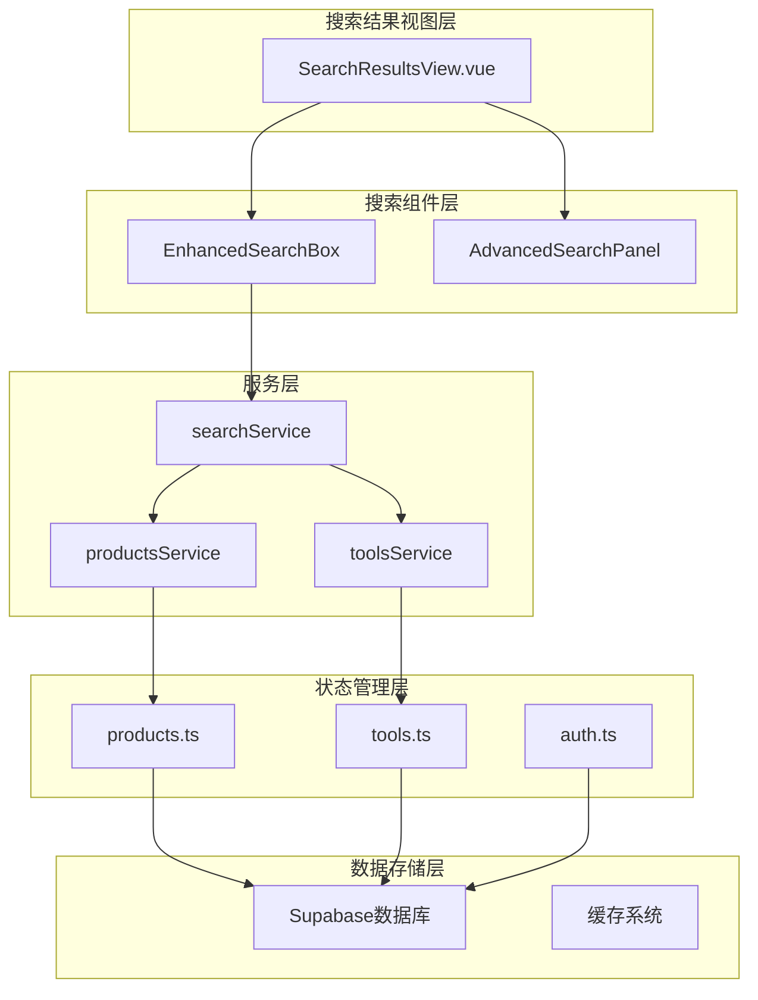
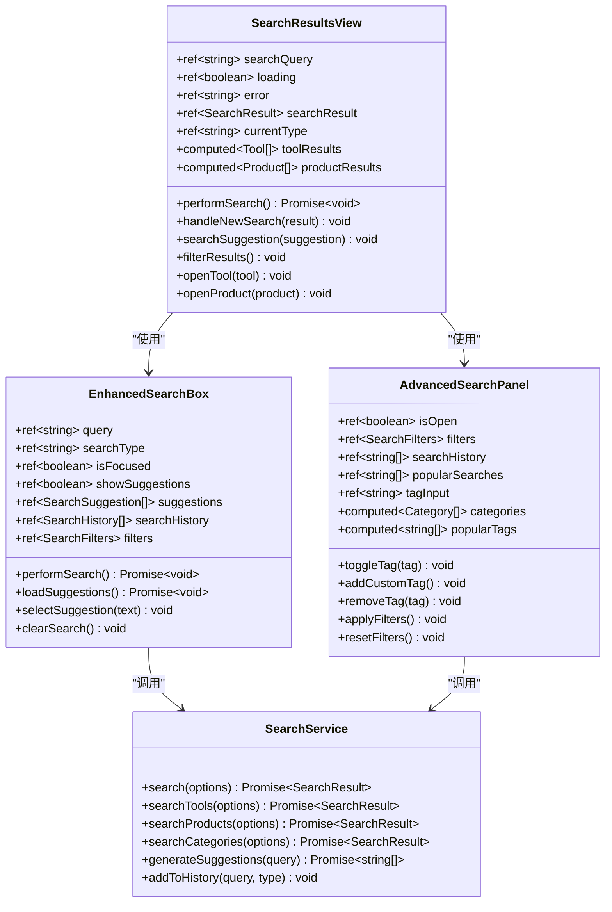
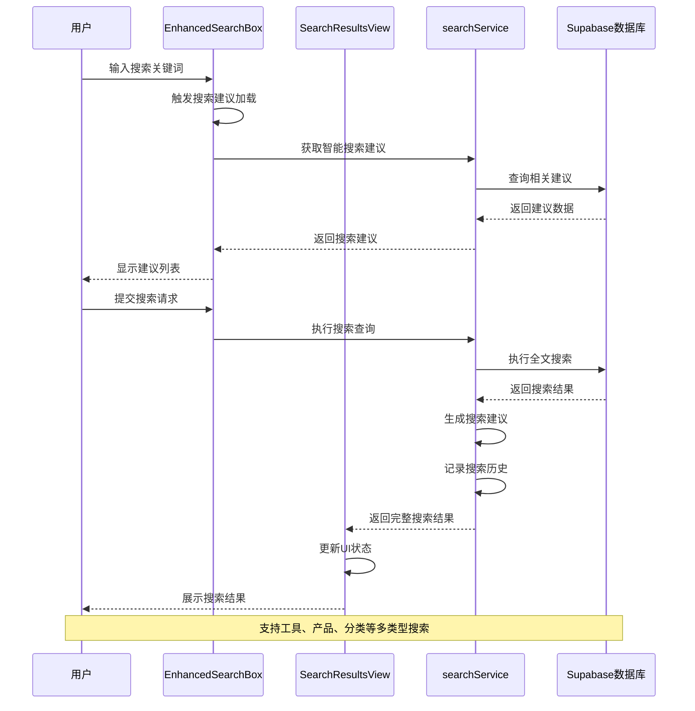
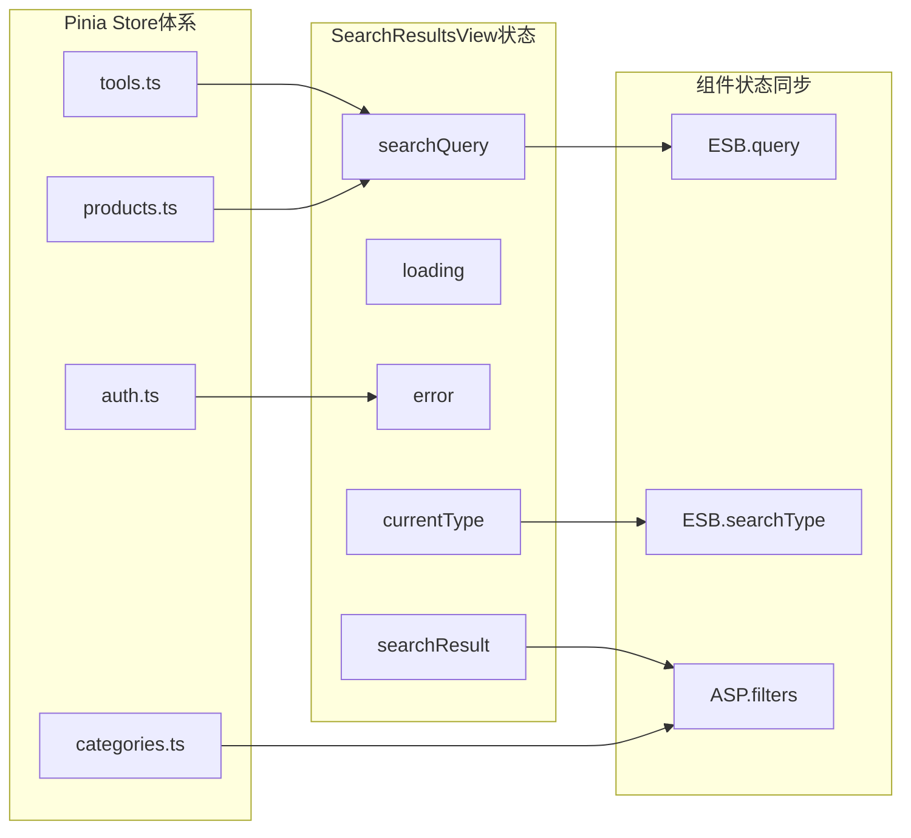
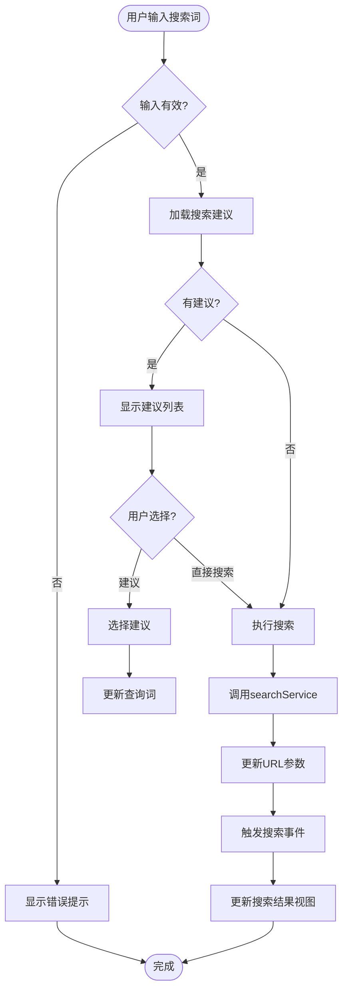
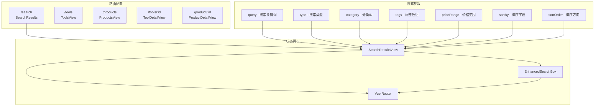
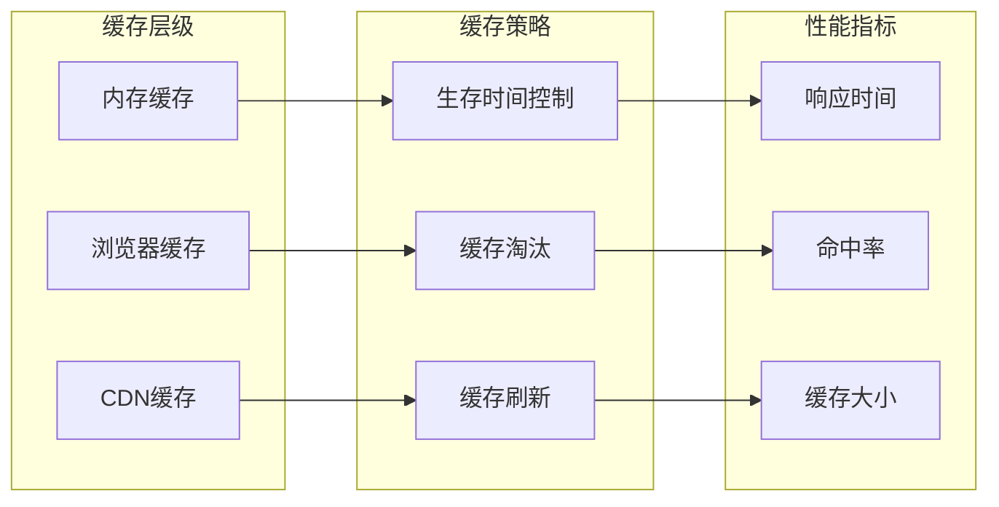
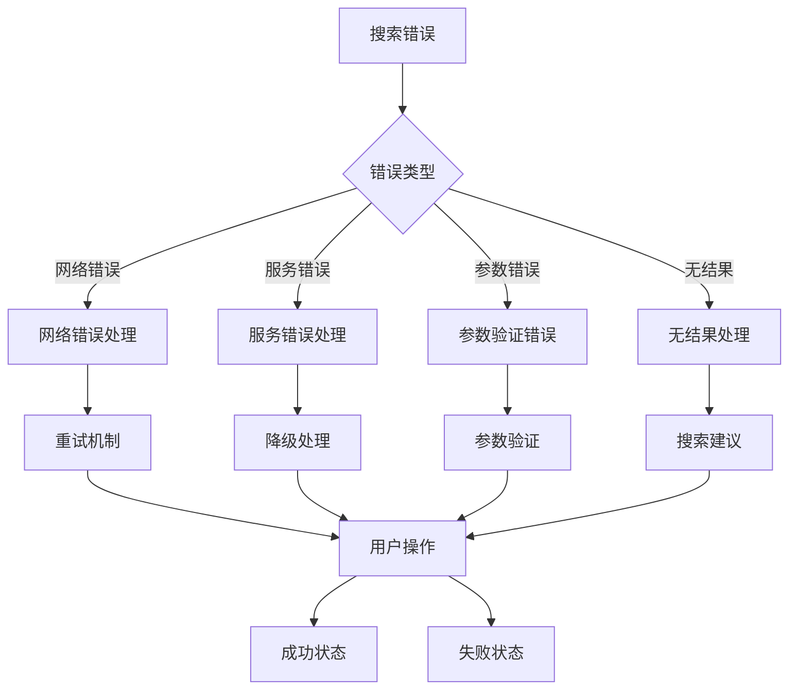
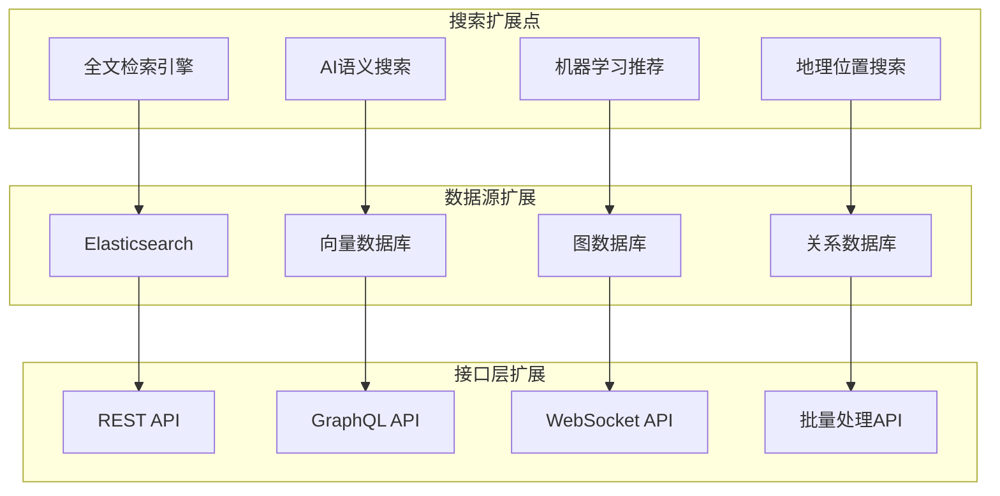

# 搜索结果视图页面架构设计与业务逻辑文档

<cite>
**本文档引用的文件**
- [SearchResultsView.vue](file://src/views/SearchResultsView.vue)
- [EnhancedSearchBox.vue](file://src/components/search/EnhancedSearchBox.vue)
- [AdvancedSearchPanel.vue](file://src/components/search/AdvancedSearchPanel.vue)
- [searchService.ts](file://src/services/searchService.ts)
- [products.ts](file://src/stores/products.ts)
- [useAdvancedSearch.ts](file://src/composables/useAdvancedSearch.ts)
- [index.ts](file://src/router/index.ts)
</cite>

## 目录
1. [项目概述](#项目概述)
2. [核心组件架构](#核心组件架构)
3. [搜索流程分析](#搜索流程分析)
4. [状态管理与数据流](#状态管理与数据流)
5. [组件交互机制](#组件交互机制)
6. [搜索服务实现](#搜索服务实现)
7. [路由与导航](#路由与导航)
8. [性能优化策略](#性能优化策略)
9. [错误处理与用户体验](#错误处理与用户体验)
10. [扩展性设计](#扩展性设计)

## 项目概述

SearchResultsView.vue是现代Web应用中的核心搜索功能模块，负责协调多个搜索组件，统一处理用户发起的搜索请求，并提供丰富的搜索结果展示和交互体验。该页面采用Vue 3 Composition API设计，集成了先进的搜索技术和服务架构。

### 主要功能特性

- **多维度搜索**：支持工具、产品、分类等多种类型的搜索
- **智能搜索建议**：基于用户输入提供实时搜索建议
- **高级筛选**：支持多条件筛选和排序
- **分面导航**：提供多维度的数据聚合展示
- **响应式设计**：适配不同设备和屏幕尺寸
- **SEO优化**：支持搜索引擎优化和友好的元数据管理

## 核心组件架构



**图表来源**
- [SearchResultsView.vue](file://src/views/SearchResultsView.vue#L1-L571)
- [EnhancedSearchBox.vue](file://src/components/search/EnhancedSearchBox.vue#L1-L1024)
- [searchService.ts](file://src/services/searchService.ts#L1-L641)

### 组件层次结构



**图表来源**
- [SearchResultsView.vue](file://src/views/SearchResultsView.vue#L150-L285)
- [EnhancedSearchBox.vue](file://src/components/search/EnhancedSearchBox.vue#L200-L400)
- [searchService.ts](file://src/services/searchService.ts#L30-L100)

**章节来源**
- [SearchResultsView.vue](file://src/views/SearchResultsView.vue#L1-L571)
- [EnhancedSearchBox.vue](file://src/components/search/EnhancedSearchBox.vue#L1-L1024)
- [AdvancedSearchPanel.vue](file://src/components/search/AdvancedSearchPanel.vue#L1-L596)

## 搜索流程分析

### 完整搜索流程



**图表来源**
- [EnhancedSearchBox.vue](file://src/components/search/EnhancedSearchBox.vue#L300-L400)
- [SearchResultsView.vue](file://src/views/SearchResultsView.vue#L150-L200)
- [searchService.ts](file://src/services/searchService.ts#L50-L150)

### 搜索类型处理机制

SearchResultsView支持四种主要的搜索类型：

1. **全部类型 (all)**：综合搜索工具、产品和分类
2. **工具 (tools)**：专门搜索工具信息
3. **产品 (products)**：专门搜索产品信息
4. **分类 (categories)**：专门搜索分类信息

每种类型都有对应的处理逻辑和数据过滤机制：

```typescript
// 类型过滤逻辑
const toolResults = computed(() => {
  if (!searchResult.value) return [];
  return searchResult.value.items.filter(
    (item) =>
      item.type === "tool" ||
      !item.type ||
      item.hasOwnProperty("clickCount") ||
      item.hasOwnProperty("category_id"),
  );
});

const productResults = computed(() => {
  if (!searchResult.value) return [];
  return searchResult.value.items.filter(
    (item) =>
      item.type === "product" ||
      item.hasOwnProperty("price") ||
      item.hasOwnProperty("rating"),
  );
});
```

**章节来源**
- [SearchResultsView.vue](file://src/views/SearchResultsView.vue#L100-L150)
- [searchService.ts](file://src/services/searchService.ts#L50-L200)

## 状态管理与数据流

### Pinia Store集成



**图表来源**
- [products.ts](file://src/stores/products.ts#L1-L365)
- [SearchResultsView.vue](file://src/views/SearchResultsView.vue#L150-L200)

### 状态同步机制

SearchResultsView通过以下机制确保状态的一致性：

1. **路由监听**：监听路由参数变化自动更新搜索状态
2. **双向绑定**：与EnhancedSearchBox组件建立双向数据绑定
3. **事件通信**：通过事件总线传递搜索结果和状态变更

```typescript
// 路由监听机制
watch(
  () => route.query,
  (newQuery) => {
    searchQuery.value = (newQuery.q as string) || "";
    currentType.value = (newQuery.type as string) || "all";

    if (searchQuery.value) {
      performSearch();
    }
  },
);
```

**章节来源**
- [SearchResultsView.vue](file://src/views/SearchResultsView.vue#L250-L285)
- [products.ts](file://src/stores/products.ts#L100-L200)

## 组件交互机制

### EnhancedSearchBox与SearchResultsView的协作



**图表来源**
- [EnhancedSearchBox.vue](file://src/components/search/EnhancedSearchBox.vue#L200-L400)
- [SearchResultsView.vue](file://src/views/SearchResultsView.vue#L200-L250)

### AdvancedSearchPanel集成

AdvancedSearchPanel提供了高级筛选功能，与主搜索组件协同工作：

1. **筛选器管理**：维护复杂的筛选条件状态
2. **实时预览**：在应用筛选前提供结果预览
3. **历史记录**：保存用户的筛选历史
4. **热门推荐**：基于用户行为推荐筛选条件

**章节来源**
- [EnhancedSearchBox.vue](file://src/components/search/EnhancedSearchBox.vue#L400-L600)
- [AdvancedSearchPanel.vue](file://src/components/search/AdvancedSearchPanel.vue#L1-L596)

## 搜索服务实现

### 多类型搜索架构

```mermaid
classDiagram
class SearchService {
+search(options) Promise~SearchResult~
+searchTools(options) Promise~SearchResult~
+searchProducts(options) Promise~SearchResult~
+searchCategories(options) Promise~SearchResult~
+generateSuggestions(query) Promise~string[]~
+addToHistory(query, type) void
-searchHistory SearchHistory[]
-popularQueries Map~string,number~
}
class SearchOptions {
+query string
+type "all"|"tools"|"products"|"categories"
+category string
+tags string[]
+priceRange [number,number]
+sortBy "relevance"|"name"|"created_at"|"click_count"|"price"
+sortOrder "asc"|"desc"
+limit number
+offset number
+includeInactive boolean
}
class SearchResult {
+items T[]
+total number
+query string
+suggestions string[]
+facets SearchFacets
+searchTime number
}
class SearchFacets {
+categories {name : string,count : number}[]
+tags {name : string,count : number}[]
+priceRanges {range : string,count : number}[]
}
SearchService --> SearchOptions : "使用"
SearchService --> SearchResult : "返回"
SearchResult --> SearchFacets : "包含"
```

**图表来源**
- [searchService.ts](file://src/services/searchService.ts#L1-L200)

### 全文搜索实现

searchService实现了强大的全文搜索功能，支持多字段模糊匹配：

```typescript
// 全文搜索查询构建
if (query) {
  queryBuilder = queryBuilder.or(`
    name.ilike.%${query}%,
    description.ilike.%${query}%,
    meta_title.ilike.%${query}%,
    meta_description.ilike.%${query}%
  `);
}
```

### 分面导航数据聚合

分面导航提供了多维度的数据聚合展示：

1. **分类聚合**：按分类统计结果数量
2. **标签聚合**：按标签统计结果数量
3. **价格区间**：按价格范围统计结果数量

**章节来源**
- [searchService.ts](file://src/services/searchService.ts#L100-L300)

## 路由与导航

### 路由配置与参数管理



**图表来源**
- [index.ts](file://src/router/index.ts#L1-L50)
- [SearchResultsView.vue](file://src/views/SearchResultsView.vue#L250-L285)

### SEO优化策略

SearchResultsView实现了多项SEO优化措施：

1. **动态标题**：根据搜索结果动态设置页面标题
2. **元数据管理**：为每个搜索结果页面设置合适的meta标签
3. **结构化数据**：提供JSON-LD格式的结构化数据
4. **面包屑导航**：提供清晰的导航路径

```typescript
// 路由守卫中的SEO处理
router.beforeEach(async (to, from, next) => {
  if (to.meta.title) {
    document.title = `${to.meta.title} | ${import.meta.env.VITE_APP_NAME || '应用'}`;
  }
  next();
});
```

**章节来源**
- [index.ts](file://src/router/index.ts#L350-L399)
- [SearchResultsView.vue](file://src/views/SearchResultsView.vue#L1-L50)

## 性能优化策略

### 搜索结果缓存机制



### 懒加载与虚拟滚动

对于大量搜索结果，系统实现了懒加载和虚拟滚动技术：

1. **分页加载**：支持无限滚动和传统分页
2. **图片懒加载**：延迟加载产品图片
3. **组件懒加载**：按需加载大型组件

### 搜索防抖与节流

```typescript
// 搜索建议防抖处理
const debouncedLoadSuggestions = useDebounceFn(loadSuggestions, 300);

// 输入防抖避免频繁搜索
const handleInput = () => {
  selectedIndex.value = -1;
  debouncedLoadSuggestions();
};
```

**章节来源**
- [EnhancedSearchBox.vue](file://src/components/search/EnhancedSearchBox.vue#L150-L200)

## 错误处理与用户体验

### 多层次错误处理



### 无结果处理策略

当搜索没有结果时，系统提供多种引导方式：

1. **搜索建议**：显示相关关键词建议
2. **搜索提示**：提供优化搜索的建议
3. **热门搜索**：展示当前热门搜索词
4. **重新搜索**：提供重新搜索的入口

```html
<!-- 无结果提示模板 -->
<div v-if="searchResult.total === 0" class="no-results">
  <div class="no-results-icon">🔍</div>
  <h3>未找到相关结果</h3>
  <p>尝试使用不同的关键词或检查拼写</p>
  <div class="search-tips">
    <h4>搜索建议：</h4>
    <ul>
      <li>使用更通用的关键词</li>
      <li>检查拼写是否正确</li>
      <li>尝试使用同义词</li>
      <li>减少搜索词的数量</li>
    </ul>
  </div>
</div>
```

### 加载状态管理

系统提供了丰富的加载状态反馈：

1. **旋转加载器**：视觉化的加载指示
2. **进度条**：长时间搜索的进度反馈
3. **骨架屏**：提升用户体验的占位符
4. **空状态**：明确的状态指示

**章节来源**
- [SearchResultsView.vue](file://src/views/SearchResultsView.vue#L285-L350)

## 扩展性设计

### 支持全文检索的架构



### 多字段匹配支持

系统设计支持多种匹配模式：

1. **精确匹配**：完全匹配关键词
2. **模糊匹配**：支持部分匹配和近似匹配
3. **语义匹配**：基于语义理解的匹配
4. **同义词匹配**：支持同义词扩展

### 插件化架构

```typescript
// 搜索插件接口
interface SearchPlugin {
  name: string;
  priority: number;
  match(query: string): boolean;
  execute(query: string, options: SearchOptions): Promise<SearchResult>;
}

// 插件注册机制
class SearchPluginRegistry {
  private plugins: SearchPlugin[] = [];
  
  register(plugin: SearchPlugin) {
    this.plugins.push(plugin);
    this.plugins.sort((a, b) => b.priority - a.priority);
  }
  
  async execute(query: string, options: SearchOptions): Promise<SearchResult> {
    for (const plugin of this.plugins) {
      if (plugin.match(query)) {
        return await plugin.execute(query, options);
      }
    }
    throw new Error('No matching plugin found');
  }
}
```

### 国际化支持

系统支持多语言搜索：

1. **多语言索引**：为不同语言创建独立索引
2. **语言检测**：自动检测用户语言偏好
3. **翻译服务**：集成翻译API提供多语言支持
4. **本地化界面**：支持RTL语言和特殊字符

**章节来源**
- [searchService.ts](file://src/services/searchService.ts#L1-L100)
- [EnhancedSearchBox.vue](file://src/components/search/EnhancedSearchBox.vue#L1-L100)

## 总结

SearchResultsView.vue展现了现代Web应用搜索功能的最佳实践，通过精心设计的架构和组件协作，提供了强大而灵活的搜索体验。其核心优势包括：

1. **模块化设计**：清晰的组件分离和职责划分
2. **高性能实现**：多层次的缓存和优化策略
3. **优秀的用户体验**：智能的搜索建议和错误处理
4. **良好的扩展性**：支持多种搜索模式和数据源
5. **完善的SEO支持**：符合搜索引擎优化标准

该架构不仅满足了当前的功能需求，还为未来的功能扩展和性能优化奠定了坚实的基础。通过持续的迭代和改进，SearchResultsView将继续为用户提供卓越的搜索体验。