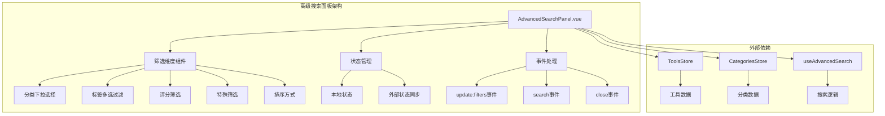
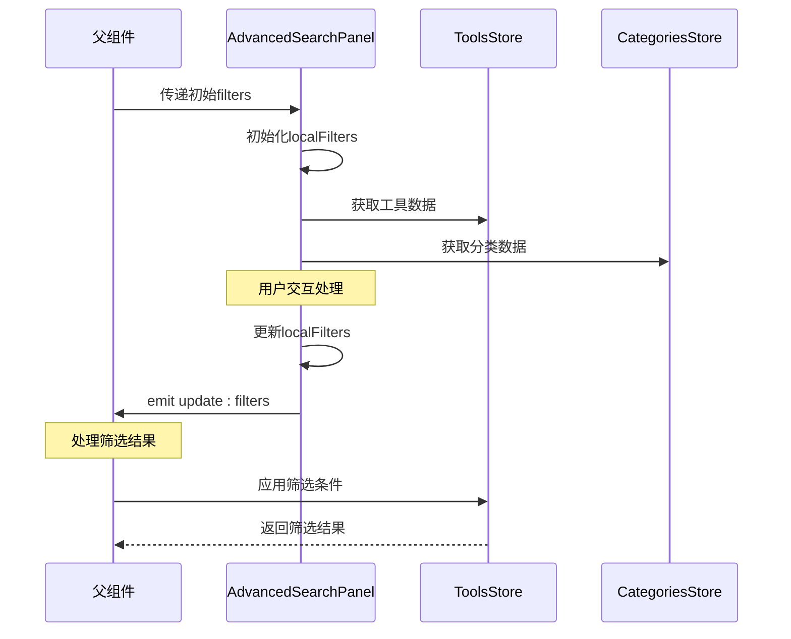
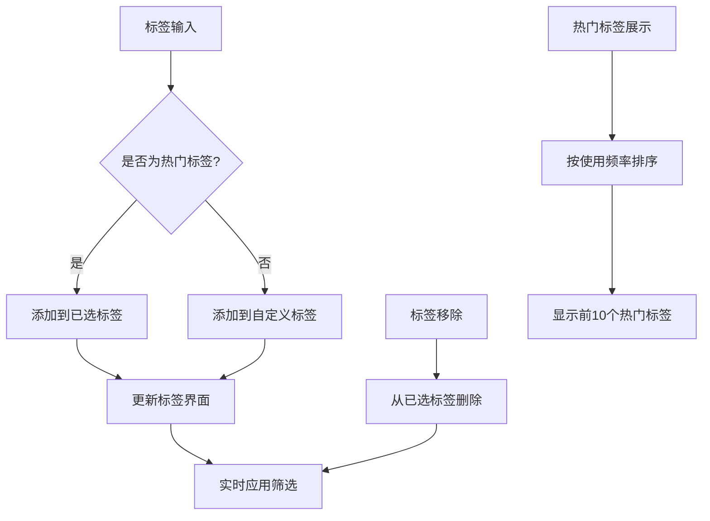
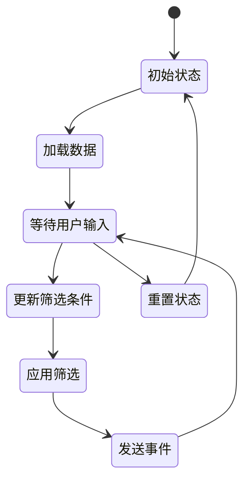
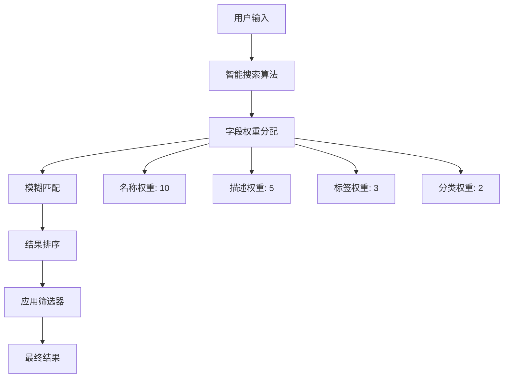

# 高级搜索面板组件技术文档

<cite>
**本文档引用的文件**
- [AdvancedSearchPanel.vue](file://src/components/search/AdvancedSearchPanel.vue)
- [useAdvancedSearch.ts](file://src/composables/useAdvancedSearch.ts)
- [productsService.ts](file://src/services/productsService.ts)
- [searchService.ts](file://src/services/searchService.ts)
- [tools.ts](file://src/stores/tools.ts)
- [ToolsView.vue](file://src/views/ToolsView.vue)
- [EnhancedSearchBox.vue](file://src/components/search/EnhancedSearchBox.vue)
</cite>

## 目录
1. [简介](#简介)
2. [组件架构概览](#组件架构概览)
3. [核心组件分析](#核心组件分析)
4. [筛选维度详解](#筛选维度详解)
5. [状态管理机制](#状态管理机制)
6. [响应式设计实现](#响应式设计实现)
7. [性能优化策略](#性能优化策略)
8. [集成与使用指南](#集成与使用指南)
9. [故障排除指南](#故障排除指南)
10. [总结](#总结)

## 简介

AdvancedSearchPanel.vue是Advanced Tools Navigation项目中的核心高级筛选组件，为用户提供强大的多维度筛选功能。该组件作为高级搜索入口，支持分类选择、标签过滤、评分筛选、特殊条件设置、排序方式切换以及历史记录等功能，是提升用户体验和搜索效率的关键组件。

## 组件架构概览



**图表来源**
- [AdvancedSearchPanel.vue](file://src/components/search/AdvancedSearchPanel.vue#L1-L596)
- [useAdvancedSearch.ts](file://src/composables/useAdvancedSearch.ts#L1-L306)

## 核心组件分析

### 组件接口定义

AdvancedSearchPanel组件采用Vue 3的组合式API设计，通过明确的接口定义确保类型安全：

```typescript
interface Props {
  isOpen: boolean;
  filters: SearchFilters;
  searchHistory: string[];
  popularSearches: string[];
}

interface Emits {
  (e: "close"): void;
  (e: "update:filters", filters: SearchFilters): void;
  (e: "search", query: string): void;
}
```

### 数据流架构



**图表来源**
- [AdvancedSearchPanel.vue](file://src/components/search/AdvancedSearchPanel.vue#L50-L70)
- [ToolsView.vue](file://src/views/ToolsView.vue#L1-L300)

**章节来源**
- [AdvancedSearchPanel.vue](file://src/components/search/AdvancedSearchPanel.vue#L50-L70)
- [useAdvancedSearch.ts](file://src/composables/useAdvancedSearch.ts#L6-L15)

## 筛选维度详解

### 分类下拉选择

分类筛选是最基础的筛选维度，支持按工具所属分类进行精确匹配：

```vue
<select v-model="localFilters.category" class="filter-select">
  <option value="">所有分类</option>
  <option
    v-for="category in categories"
    :key="category.id"
    :value="category.id"
  >
    {{ category.name }}
  </option>
</select>
```

**特点：**
- 支持"所有分类"的默认选项
- 动态加载分类数据
- 即时更新筛选结果

### 标签多选过滤

标签系统提供了灵活的多维度筛选能力：



**图表来源**
- [AdvancedSearchPanel.vue](file://src/components/search/AdvancedSearchPanel.vue#L25-L45)

### 评分筛选系统

评分筛选允许用户根据工具质量进行筛选：

```typescript
const getRatingText = (rating: number) => {
  const texts = ["不限", "1星以上", "2星以上", "3星以上", "4星以上", "5星"];
  return texts[rating] || "不限";
};
```

**评分系统特性：**
- 星级图标可视化
- 文本描述清晰
- 支持清除操作

### 特殊筛选条件

特殊筛选提供针对特定属性的过滤选项：

- **仅显示特色工具**：突出推荐内容
- **仅显示可访问工具**：过滤无效链接

### 排序方式切换

支持多种排序维度和方向：

```typescript
const toggleSortOrder = () => {
  localFilters.value.sortOrder =
    localFilters.value.sortOrder === "asc" ? "desc" : "asc";
};
```

**排序选项：**
- 名称排序
- 使用次数排序
- 创建时间排序
- 评分排序（基于点击数）

**章节来源**
- [AdvancedSearchPanel.vue](file://src/components/search/AdvancedSearchPanel.vue#L25-L150)
- [useAdvancedSearch.ts](file://src/composables/useAdvancedSearch.ts#L100-L150)

## 状态管理机制

### 本地状态与外部状态同步

AdvancedSearchPanel采用双向绑定模式，确保状态一致性：

```typescript
const localFilters = ref<SearchFilters>({ ...props.filters });

// 监听外部筛选器变化
watch(
  () => props.filters,
  (newFilters) => {
    localFilters.value = { ...newFilters };
  },
  { deep: true },
);
```

### 实时应用机制

组件内置实时监听机制，确保用户操作即时生效：

```typescript
// 实时应用筛选器
watch(
  localFilters,
  () => {
    applyFilters();
  },
  { deep: true },
);
```

### 状态持久化策略



**图表来源**
- [AdvancedSearchPanel.vue](file://src/components/search/AdvancedSearchPanel.vue#L280-L300)

**章节来源**
- [AdvancedSearchPanel.vue](file://src/components/search/AdvancedSearchPanel.vue#L70-L100)
- [useAdvancedSearch.ts](file://src/composables/useAdvancedSearch.ts#L20-L50)

## 响应式设计实现

### 移动端适配

AdvancedSearchPanel采用CSS动画和弹性布局，确保在移动设备上的良好体验：

```css
.advanced-search-panel {
  position: absolute;
  top: 100%;
  left: 0;
  right: 0;
  background: white;
  border: 1px solid #e0e0e0;
  border-radius: 8px;
  box-shadow: 0 8px 32px rgba(0, 0, 0, 0.1);
  z-index: 1000;
  max-height: 600px;
  overflow-y: auto;
  transform: translateY(-10px);
  opacity: 0;
  visibility: hidden;
  transition: all 0.2s ease;
}

.advanced-search-panel.is-open {
  transform: translateY(0);
  opacity: 1;
  visibility: visible;
}
```

### 交互反馈机制

组件提供丰富的视觉反馈：

- **悬停效果**：按钮和标签的鼠标悬停状态
- **激活状态**：选中标签和按钮的高亮显示
- **过渡动画**：平滑的展开和收起动画

### 触摸友好设计


**章节来源**
- [AdvancedSearchPanel.vue](file://src/components/search/AdvancedSearchPanel.vue#L319-L350)

## 性能优化策略

### 避免频繁重建筛选器实例

组件通过以下策略优化性能：

1. **状态缓存**：避免重复计算热门标签
2. **深度监听优化**：合理使用deep: true
3. **事件防抖**：减少不必要的事件触发

```typescript
const popularTags = computed(() => {
  const tagCounts = new Map<string, number>();

  toolsStore.tools.forEach((tool) => {
    if (tool.tags) {
      tool.tags.forEach((tag: string) => {
        tagCounts.set(tag, (tagCounts.get(tag) || 0) + 1);
      });
    }
  });

  return Array.from(tagCounts.entries())
    .sort(([, a], [, b]) => b - a)
    .slice(0, 10)
    .map(([tag]) => tag);
});
```

### 内存管理最佳实践

- **及时清理监听器**：组件销毁时自动清理
- **避免内存泄漏**：正确处理异步操作
- **优化DOM操作**：减少不必要的重绘和回流

### 搜索算法优化



**图表来源**
- [useAdvancedSearch.ts](file://src/composables/useAdvancedSearch.ts#L30-L80)

**章节来源**
- [AdvancedSearchPanel.vue](file://src/components/search/AdvancedSearchPanel.vue#L100-L130)
- [useAdvancedSearch.ts](file://src/composables/useAdvancedSearch.ts#L150-L200)

## 集成与使用指南

### 在父组件中的使用

AdvancedSearchPanel通常与ToolsView配合使用：

```vue
<AdvancedSearchPanel
  :is-open="showAdvancedSearch"
  :filters="filters"
  :search-history="searchHistory"
  :popular-searches="popularSearches"
  @close="showAdvancedSearch = false"
  @update:filters="updateFilters"
  @search="handleAdvancedSearch"
/>
```

### 自定义条件组合

组件支持复杂的条件组合：

```typescript
// 条件组合示例
const applyFilters = (results: SearchResult[]): SearchResult[] => {
  return results.filter(({ item }) => {
    // 分类筛选
    if (filters.value.category && item.category_id !== filters.value.category) {
      return false;
    }

    // 标签筛选
    if (filters.value.tags.length > 0) {
      const itemTags = item.tags || [];
      const hasMatchingTag = filters.value.tags.some((tag) =>
        itemTags.some((itemTag: string) =>
          itemTag.toLowerCase().includes(tag.toLowerCase()),
        ),
      );
      if (!hasMatchingTag) return false;
    }

    // 特色工具筛选
    if (filters.value.isFeatured && !item.is_featured) {
      return false;
    }

    // URL可用性筛选
    if (filters.value.hasUrl && (!item.url || !item.url.trim())) {
      return false;
    }

    return true;
  });
};
```

### Scoped Slots定制化

虽然当前版本不直接支持scoped slots，但可以通过以下方式进行定制：

```vue
<!-- 自定义标签渲染 -->
<template #default="{ tag }">
  <span class="custom-tag">{{ tag }}</span>
</template>
```

**章节来源**
- [ToolsView.vue](file://src/views/ToolsView.vue#L10-L30)
- [useAdvancedSearch.ts](file://src/composables/useAdvancedSearch.ts#L80-L120)

## 故障排除指南

### 常见问题与解决方案

1. **筛选条件不生效**
   - 检查filters prop是否正确传递
   - 确认update:filters事件是否正常触发
   - 验证本地状态与外部状态同步

2. **热门标签显示异常**
   - 检查toolsStore.tools数据完整性
   - 确认标签数据格式正确
   - 验证计算属性的依赖关系

3. **性能问题**
   - 监控深度监听的性能影响
   - 检查不必要的重新渲染
   - 优化大型数据集的处理

### 调试技巧

```typescript
// 开发环境调试
if (process.env.NODE_ENV === 'development') {
  console.log('Current filters:', localFilters.value);
  console.log('Popular tags:', popularTags.value);
}
```

### 错误处理机制

组件内置基本的错误处理：

```typescript
try {
  let results = performSearch(searchQuery.value, toolsStore.tools);
  results = applyFilters(results);
  results = sortResults(results);
  return results;
} finally {
  isSearching.value = false;
}
```

**章节来源**
- [AdvancedSearchPanel.vue](file://src/components/search/AdvancedSearchPanel.vue#L280-L300)
- [useAdvancedSearch.ts](file://src/composables/useAdvancedSearch.ts#L280-L306)

## 总结

AdvancedSearchPanel.vue是一个功能完整、设计精良的高级筛选组件，具有以下核心优势：

### 技术特点
- **类型安全**：完整的TypeScript支持
- **响应式设计**：良好的跨设备兼容性
- **高性能**：智能的性能优化策略
- **易于维护**：清晰的代码结构和模块化设计

### 功能完整性
- 支持多维度过滤
- 提供实时搜索建议
- 包含历史记录和热门搜索
- 具备完善的错误处理机制

### 最佳实践
- 遵循Vue 3组合式API规范
- 实现状态的双向绑定
- 采用事件驱动的设计模式
- 提供丰富的用户交互反馈

该组件为Advanced Tools Navigation项目提供了强大的搜索和筛选能力，显著提升了用户体验和系统的功能性。通过合理的架构设计和性能优化，确保了在各种使用场景下的稳定性和高效性。