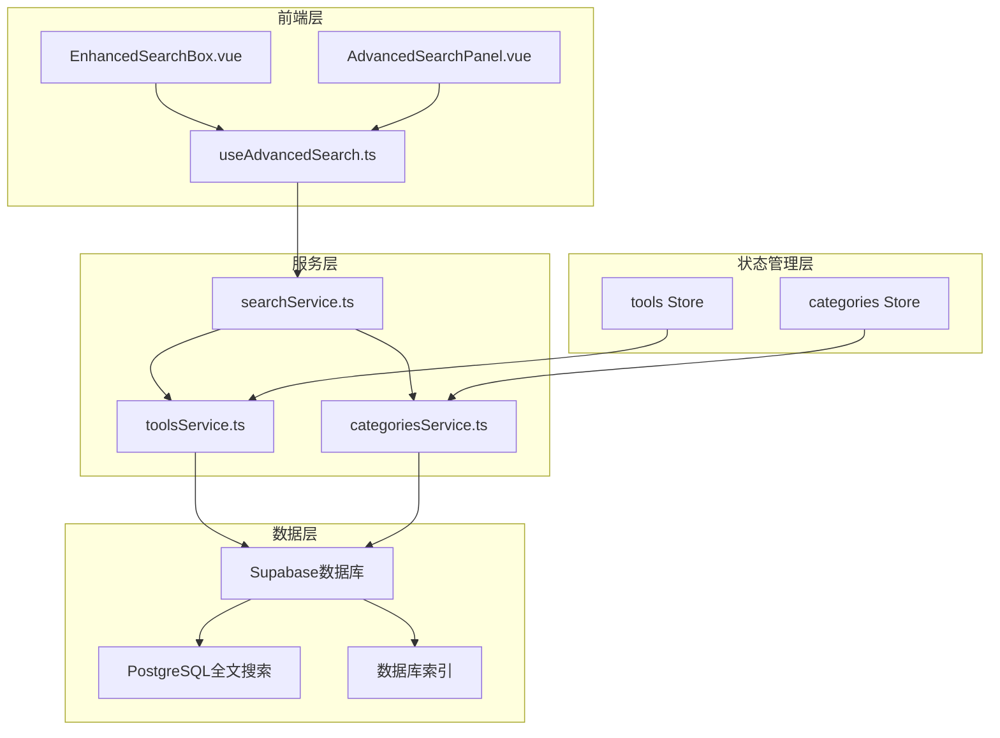
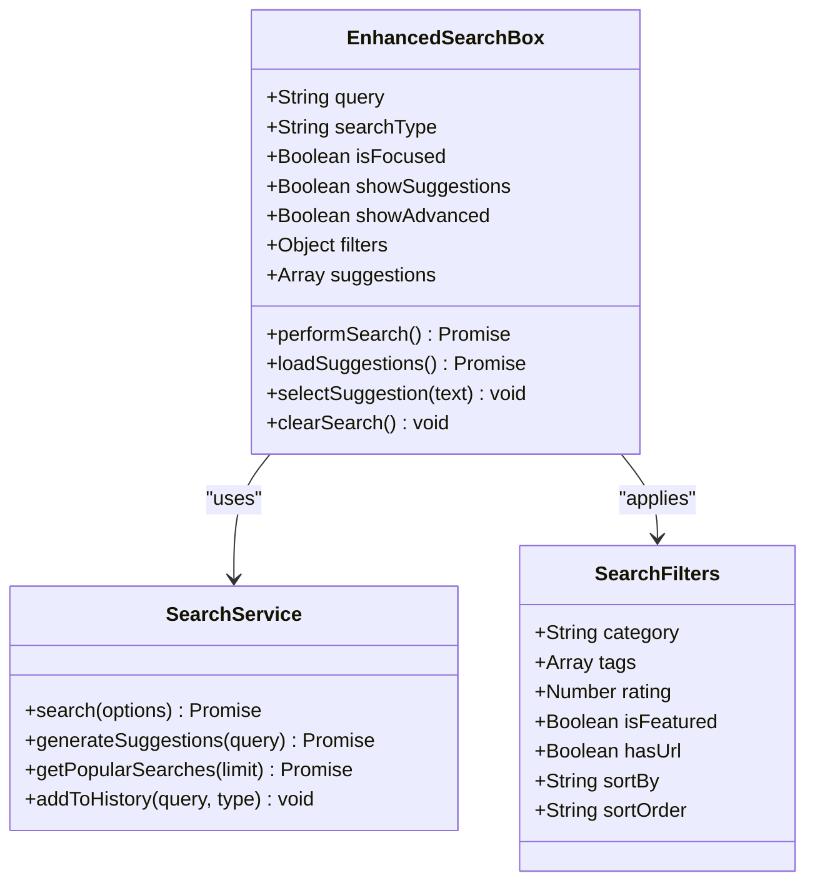
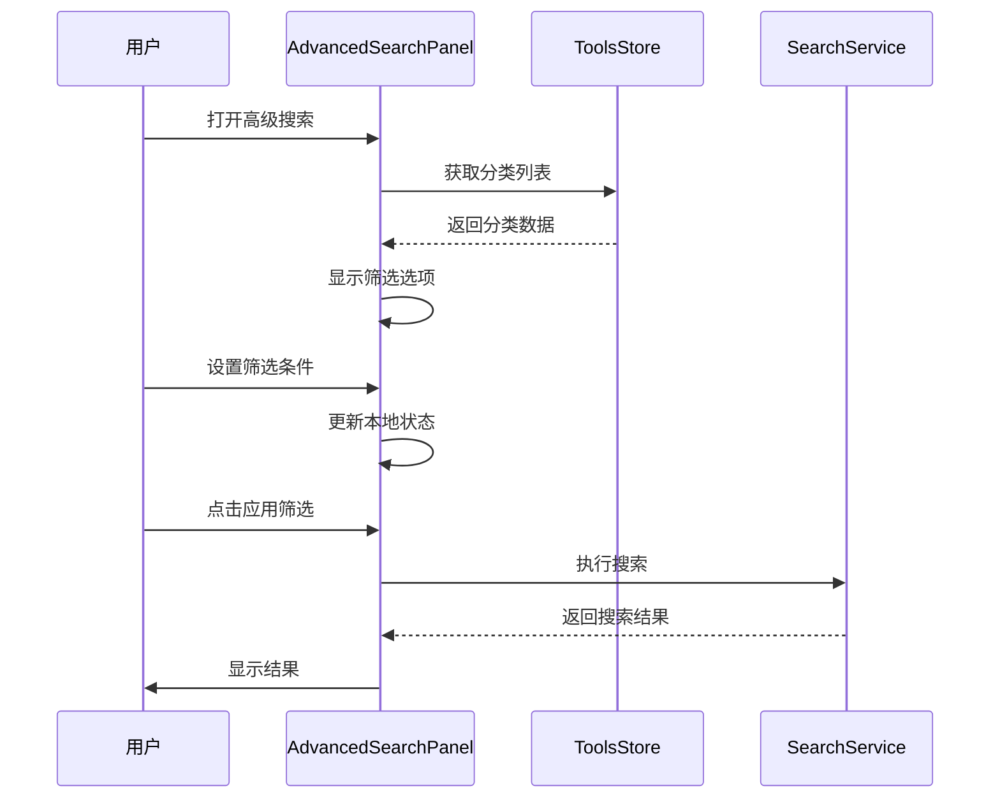
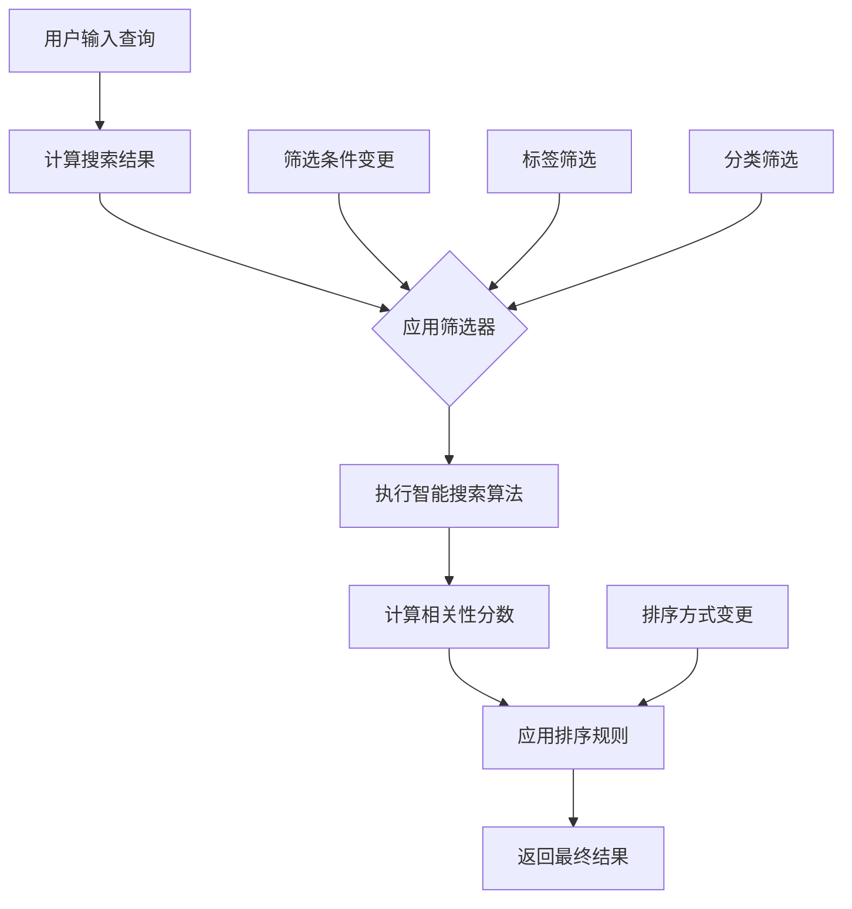
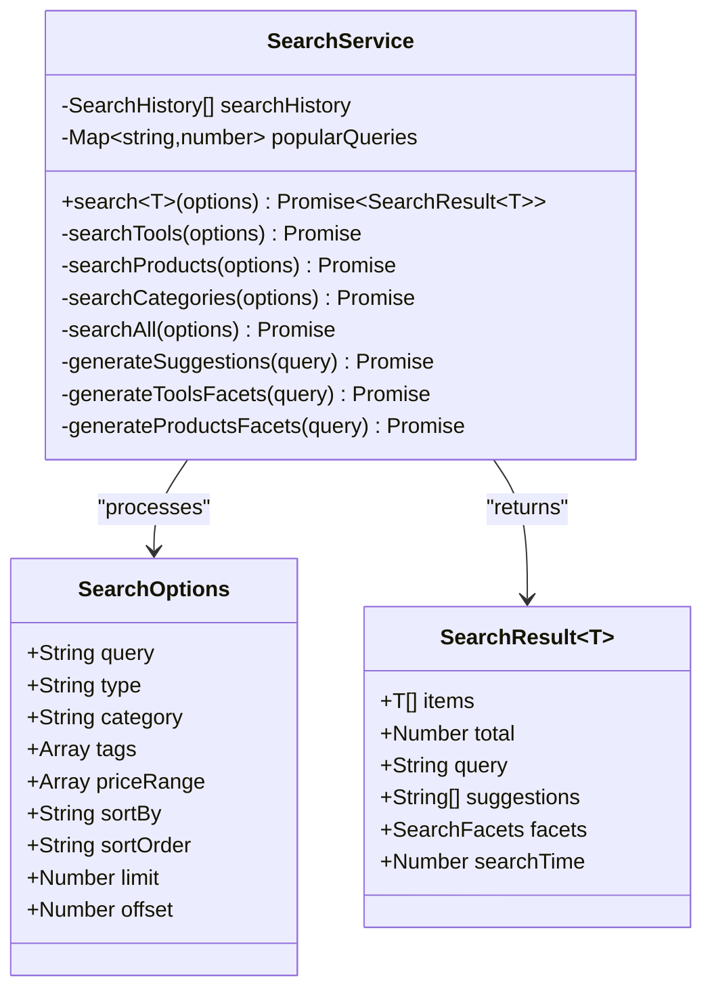
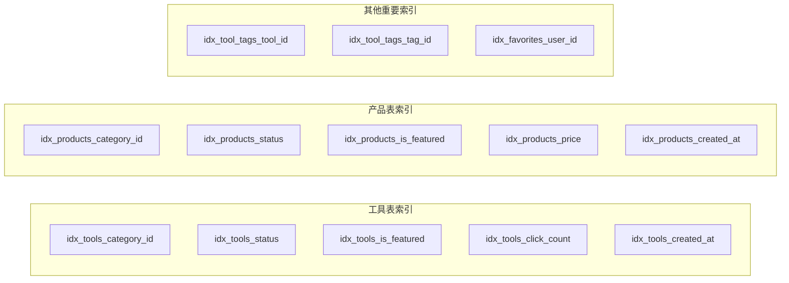
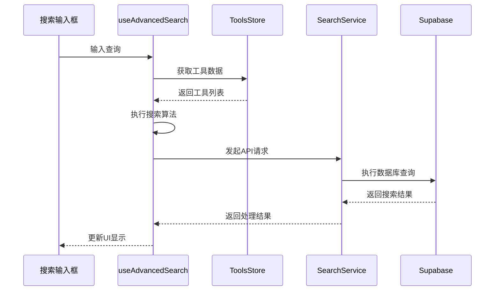
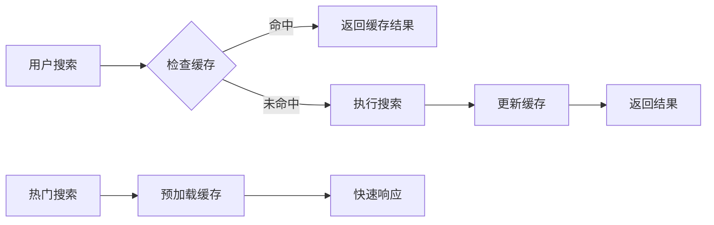
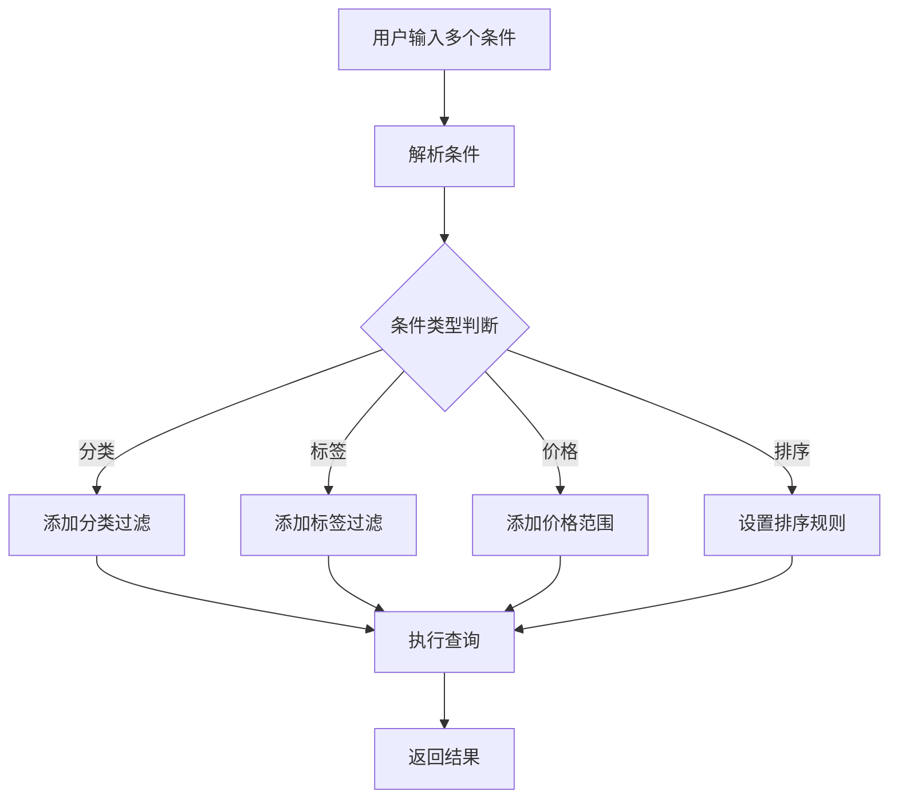

# 搜索与过滤能力

<cite>
**本文档引用的文件**
- [useAdvancedSearch.ts](file://src/composables/useAdvancedSearch.ts)
- [searchService.ts](file://src/services/searchService.ts)
- [EnhancedSearchBox.vue](file://src/components/search/EnhancedSearchBox.vue)
- [AdvancedSearchPanel.vue](file://src/components/search/AdvancedSearchPanel.vue)
- [tools.ts](file://src/stores/tools.ts)
- [supabaseClient.ts](file://src/lib/supabaseClient.ts)
- [initial_schema.sql](file://supabase/migrations/20241224000001_initial_schema.sql)
- [services.test.ts](file://src/tests/integration/services.test.ts)
</cite>

## 目录
1. [简介](#简介)
2. [项目架构概览](#项目架构概览)
3. [核心搜索组件](#核心搜索组件)
4. [高级搜索组合式API](#高级搜索组合式API)
5. [搜索服务架构](#搜索服务架构)
6. [数据库索引优化](#数据库索引优化)
7. [前端组件交互](#前端组件交互)
8. [性能优化策略](#性能优化策略)
9. [最佳实践指南](#最佳实践指南)
10. [故障排除](#故障排除)

## 简介

本项目实现了完整的搜索与过滤功能，支持关键词检索、高级筛选、结果排序等多种特性。系统采用前后端分离架构，前端使用Vue 3 Composition API，后端基于Supabase数据库和全文搜索功能。

搜索功能的核心特性包括：
- 多维度搜索：支持工具、产品、分类等多种类型的综合搜索
- 智能排序：基于相关性、热度、时间等多种排序方式
- 高级筛选：支持分类、标签、价格范围、特色工具等筛选条件
- 实时建议：提供搜索建议和热门搜索推荐
- 性能优化：通过数据库索引和缓存机制提升查询效率

## 项目架构概览



**图表来源**
- [EnhancedSearchBox.vue](file://src/components/search/EnhancedSearchBox.vue#L1-L50)
- [searchService.ts](file://src/services/searchService.ts#L1-L50)
- [useAdvancedSearch.ts](file://src/composables/useAdvancedSearch.ts#L1-L50)

## 核心搜索组件

### 搜索输入框组件 (EnhancedSearchBox)

EnhancedSearchBox是整个搜索功能的核心组件，提供了丰富的用户交互体验：



**图表来源**
- [EnhancedSearchBox.vue](file://src/components/search/EnhancedSearchBox.vue#L200-L300)
- [searchService.ts](file://src/services/searchService.ts#L15-L30)

组件的主要功能包括：

1. **智能搜索建议**：根据用户输入实时生成搜索建议
2. **多类型搜索**：支持工具、产品、分类等多种搜索类型
3. **高级筛选面板**：提供详细的筛选选项
4. **搜索历史管理**：记录用户的搜索历史
5. **热门搜索推荐**：展示热门搜索关键词

**章节来源**
- [EnhancedSearchBox.vue](file://src/components/search/EnhancedSearchBox.vue#L1-L200)

### 高级搜索面板组件 (AdvancedSearchPanel)

AdvancedSearchPanel提供了更精细的筛选控制：



**图表来源**
- [AdvancedSearchPanel.vue](file://src/components/search/AdvancedSearchPanel.vue#L100-L200)
- [useAdvancedSearch.ts](file://src/composables/useAdvancedSearch.ts#L200-L300)

**章节来源**
- [AdvancedSearchPanel.vue](file://src/components/search/AdvancedSearchPanel.vue#L1-L100)

## 高级搜索组合式API

### useAdvancedSearch组合式API

useAdvancedSearch是核心的组合式API，负责管理搜索状态和逻辑：



**图表来源**
- [useAdvancedSearch.ts](file://src/composables/useAdvancedSearch.ts#L30-L100)

#### 搜索算法实现

智能搜索算法是该API的核心，具有以下特点：

1. **多字段加权搜索**：不同字段有不同的权重系数
   - 名称字段权重：10
   - 描述字段权重：5
   - 标签字段权重：3
   - 分类名称权重：2

2. **模糊匹配**：支持部分匹配和近似匹配
3. **特色工具加分**：对特色工具给予额外分数
4. **相关性排序**：基于分数进行降序排列

#### 筛选器系统

```typescript
interface SearchFilters {
  category: string;
  tags: string[];
  rating: number;
  isFeatured: boolean;
  hasUrl: boolean;
  sortBy: "name" | "rating" | "clicks" | "created_at";
  sortOrder: "asc" | "desc";
}
```

**章节来源**
- [useAdvancedSearch.ts](file://src/composables/useAdvancedSearch.ts#L1-L150)

## 搜索服务架构

### SearchService类设计

SearchService是后端搜索逻辑的核心，提供了完整的搜索功能：



**图表来源**
- [searchService.ts](file://src/services/searchService.ts#L50-L150)

#### 多类型搜索策略

SearchService支持四种搜索类型，每种都有专门的实现：

1. **工具搜索**：针对工具表的全文搜索和筛选
2. **产品搜索**：包含价格范围筛选的产品搜索
3. **分类搜索**：专注于分类名称和描述的搜索
4. **综合搜索**：同时搜索三种类型并合并结果

#### 全文搜索实现

```sql
-- 使用ILIKE进行全文搜索
or(`
  name.ilike.%${query}%,
  description.ilike.%${query}%,
  meta_title.ilike.%${query}%,
  meta_description.ilike.%${query}%
`)
```

这种实现方式虽然简单，但在大数据量场景下可能需要考虑使用PostgreSQL的全文搜索功能或外部搜索引擎如Elasticsearch。

**章节来源**
- [searchService.ts](file://src/services/searchService.ts#L100-L300)

## 数据库索引优化

### 索引策略

数据库索引是搜索性能的关键因素。项目采用了全面的索引策略：



**图表来源**
- [initial_schema.sql](file://supabase/migrations/20241224000001_initial_schema.sql#L200-L250)

#### 关键索引说明

1. **工具表索引**：
   - `idx_tools_category_id`：加速分类筛选
   - `idx_tools_status`：快速过滤活跃工具
   - `idx_tools_is_featured`：特色工具快速查找
   - `idx_tools_click_count`：热度排序优化
   - `idx_tools_created_at`：时间排序优化

2. **标签关联索引**：
   - `idx_tool_tags_tool_id`：快速查找工具标签
   - `idx_tool_tags_tag_id`：快速查找标签工具

3. **全文搜索优化**：
   - 虽然当前使用ILIKE，但建议在生产环境中升级为GIN索引
   - PostgreSQL全文搜索索引示例：
     ```sql
     CREATE INDEX idx_tools_search ON tools USING gin(to_tsvector('english', name || ' ' || description));
     ```

**章节来源**
- [initial_schema.sql](file://supabase/migrations/20241224000001_initial_schema.sql#L150-L200)

## 前端组件交互

### 组件通信机制



**图表来源**
- [EnhancedSearchBox.vue](file://src/components/search/EnhancedSearchBox.vue#L400-L500)
- [useAdvancedSearch.ts](file://src/composables/useAdvancedSearch.ts#L200-L250)

#### 实时搜索实现

组件采用了多种技术来实现高效的实时搜索：

1. **防抖处理**：使用`useDebounceFn`避免频繁搜索
2. **异步加载**：搜索结果异步加载，不阻塞UI
3. **状态管理**：通过Pinia store管理全局状态
4. **响应式更新**：自动响应数据变化

**章节来源**
- [EnhancedSearchBox.vue](file://src/components/search/EnhancedSearchBox.vue#L300-L400)

## 性能优化策略

### 缓存机制



#### 搜索历史缓存

系统实现了多层次的缓存策略：

1. **内存缓存**：在JavaScript中缓存热门搜索
2. **本地存储**：持久化搜索历史到localStorage
3. **数据库缓存**：Supabase的查询缓存机制

#### 分页优化

```typescript
// 分页参数优化
const searchOptions = {
  limit: 20,           // 控制每页数量
  offset: page * limit, // 计算偏移量
};
```

**章节来源**
- [searchService.ts](file://src/services/searchService.ts#L400-L500)

## 最佳实践指南

### 模糊搜索最佳实践

1. **查询优化**：
   ```typescript
   // 使用通配符优化模糊搜索
   queryBuilder = queryBuilder.ilike("name", `%${query}%`);
   ```

2. **长度限制**：
   ```typescript
   // 避免过短的查询导致性能问题
   if (query.length < 2) return [];
   ```

3. **字符清理**：
   ```typescript
   // 清理特殊字符，防止SQL注入
   const sanitizedQuery = query.replace(/[^\w\s]/g, '');
   ```

### 多条件组合查询



**图表来源**
- [searchService.ts](file://src/services/searchService.ts#L200-L300)

### 典型查询案例

#### 案例1：综合搜索
```typescript
const result = await searchService.search({
  query: "AI 工具",
  type: "all",
  limit: 20,
  sortBy: "relevance",
  sortOrder: "desc"
});
```

#### 案例2：高级筛选
```typescript
const result = await searchService.search({
  query: "设计",
  type: "tools",
  category: "design-tools",
  tags: ["AI", "创意"],
  isFeatured: true,
  sortBy: "click_count",
  sortOrder: "desc"
});
```

#### 案例3：价格范围搜索
```typescript
const result = await searchService.search({
  query: "软件",
  type: "products",
  priceRange: [100, 500],
  sortBy: "price",
  sortOrder: "asc"
});
```

**章节来源**
- [searchService.ts](file://src/services/searchService.ts#L50-L150)

## 故障排除

### 常见问题及解决方案

#### 1. 搜索结果为空

**症状**：输入查询后没有返回任何结果

**可能原因**：
- 数据库中缺少相关数据
- 索引未正确创建
- 查询条件过于严格

**解决方案**：
```typescript
// 检查数据库连接
console.log(await supabase.from("tools").select("count"));

// 检查索引是否存在
console.log(await supabase.rpc("get_index_info"));
```

#### 2. 搜索性能慢

**症状**：搜索响应时间过长

**可能原因**：
- 缺少必要的数据库索引
- 查询条件复杂度过高
- 数据量过大

**解决方案**：
```sql
-- 创建全文搜索索引
CREATE INDEX idx_tools_fulltext ON tools USING gin(to_tsvector('english', name || ' ' || description));

-- 优化查询条件
SELECT * FROM tools WHERE status = 'active' LIMIT 10;
```

#### 3. 搜索建议不准确

**症状**：搜索建议与当前输入无关

**可能原因**：
- 建议生成逻辑有问题
- 数据库查询结果不准确

**解决方案**：
```typescript
// 检查建议生成逻辑
const suggestions = await searchService.generateSuggestions(query);
console.log("Generated suggestions:", suggestions);
```

### 调试技巧

1. **启用详细日志**：
   ```typescript
   console.log("Search query:", query);
   console.log("Search options:", options);
   console.log("Search results:", result);
   ```

2. **性能监控**：
   ```typescript
   const startTime = performance.now();
   const result = await searchService.search(options);
   const endTime = performance.now();
   console.log(`Search took ${endTime - startTime} milliseconds`);
   ```

3. **数据验证**：
   ```typescript
   // 验证输入数据
   if (!query || typeof query !== 'string') {
     throw new Error('Invalid search query');
   }
   ```

**章节来源**
- [searchService.ts](file://src/services/searchService.ts#L600-L641)

## 结论

本项目实现了一个功能完整、性能优化的搜索与过滤系统。通过合理的架构设计、完善的索引策略和高效的组件交互，系统能够提供优秀的用户体验。

关键优势包括：
- **多维度搜索**：支持多种类型的数据搜索
- **智能排序**：基于相关性和热度的智能排序
- **灵活筛选**：提供丰富的筛选选项
- **性能优化**：通过索引和缓存提升查询效率
- **用户体验**：实时建议和智能提示

未来改进方向：
- 升级为PostgreSQL全文搜索
- 集成Elasticsearch等专业搜索引擎
- 实现更复杂的推荐算法
- 优化移动端搜索体验